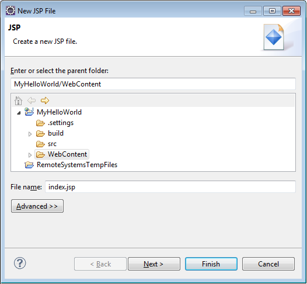
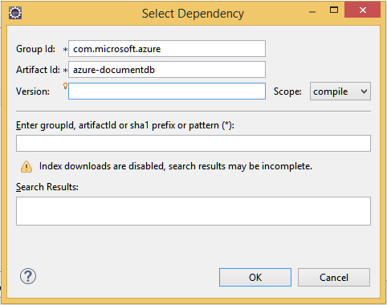

<properties
    pageTitle="Tutorial de desenvolvimento de aplicativo Java usando DocumentDB | Microsoft Azure"
    description="Este tutorial de aplicativo web Java mostra como usar o serviço de DocumentDB do Azure para armazenar e acessar dados de um aplicativo de Java hospedado em sites do Azure."
    keywords="Desenvolvimento de aplicativos, tutorial do banco de dados, aplicativo java, tutorial de aplicativo web java, documentdb, azure, do Microsoft azure"
    services="documentdb"
    documentationCenter="java"
    authors="dennyglee"
    manager="jhubbard"
    editor="mimig"/>

<tags
    ms.service="documentdb"
    ms.devlang="java"
    ms.topic="hero-article"
    ms.tgt_pltfrm="NA"
    ms.workload="data-services"
    ms.date="08/24/2016"
    ms.author="denlee"/>

# Criar um aplicativo da web de Java usando DocumentDB

> [AZURE.SELECTOR]
- [.NET](documentdb-dotnet-application.md)
- [Node](documentdb-nodejs-application.md)
- [Java](documentdb-java-application.md)
- [Python](documentdb-python-application.md)

Este tutorial de aplicativo web Java mostra como usar o serviço do [Microsoft Azure DocumentDB](https://portal.azure.com/#gallery/Microsoft.DocumentDB) para armazenar e acessar dados de um aplicativo de Java hospedado em sites do Azure. Neste tópico, você aprenderá:

- Como criar um aplicativo de JSP básico em Eclipse.
- Como trabalhar com o serviço de DocumentDB Azure usando o [DocumentDB Java SDK](https://github.com/Azure/azure-documentdb-java).

Este tutorial de aplicativo Java mostra como criar um aplicativo de gerenciamento de tarefas baseado na web que permite que você criar, recuperar e marcar tarefas como concluído, conforme mostrado na imagem a seguir. Cada uma das tarefas na lista ToDo são armazenados como documentos JSON no Azure DocumentDB.

> [AZURE.TIP] Este tutorial de desenvolvimento de aplicativo pressupõe que você tenha experiência anterior usando Java. Se você estiver começando a usar o Java ou as [Ferramentas de pré-requisito](#Prerequisites), é recomendável baixando o projeto completo [todo](https://github.com/Azure-Samples/documentdb-java-todo-app) de GitHub e criá-lo seguindo [as instruções no final deste artigo](#GetProject). Quando tiver criado, você pode examinar o artigo para Obtenha mais informações sobre o código no contexto do projeto.  

##Pré-requisitos para este tutorial de aplicativo web Java
Antes de começar este tutorial de desenvolvimento do aplicativo, você deve ter o seguinte:

- Uma conta do Azure active. Se você não tiver uma conta, você pode criar uma conta de avaliação gratuita em apenas alguns minutos. Para obter detalhes, consulte [Avaliação gratuita do Azure](https://azure.microsoft.com/pricing/free-trial/).
- [Kit de desenvolvimento de Java (JDK 7 +)](http://www.oracle.com/technetwork/java/javase/downloads/index.html).
- [Eclipse IDE para desenvolvedores do Java EE.](http://www.eclipse.org/downloads/packages/eclipse-ide-java-ee-developers/lunasr1)
- [Um site do Azure com um Java runtime ambiente (por exemplo, Tomcat ou Jetty) habilitado.](../app-service-web/web-sites-java-get-started.md)

Se você estiver instalando essas ferramentas pela primeira vez, coreservlets.com fornece uma orientação sobre o processo de instalação na seção início rápido do seu [Tutorial: Instalando TomCat7 e usá-lo com o Eclipse](http://www.coreservlets.com/Apache-Tomcat-Tutorial/tomcat-7-with-eclipse.html) artigo.

##Etapa 1: Criar uma conta de banco de dados de DocumentDB

Vamos começar criando uma conta de DocumentDB. Se você já tiver uma conta, você pode pular para [etapa 2: criar o aplicativo JSP Java](#CreateJSP).

[AZURE.INCLUDE [documentdb-create-dbaccount](../../includes/documentdb-create-dbaccount.md)]

[AZURE.INCLUDE [documentdb-keys](../../includes/documentdb-keys.md)]

##Etapa 2: Criar o aplicativo JSP Java

Para criar o aplicativo JSP:

1. Primeiro, vamos começar criando um projeto Java. Iniciar Eclipse, e em seguida, clique em **arquivo**, clique em **novo**e clique em **Projeto de Web dinâmico**. Se você não vir o **Projeto de Web dinâmico** listado como um projeto disponível, faça o seguinte: clique em **arquivo**, clique em **novo**, clique em **projeto**…, expanda **Web**, clique em **Dinâmico Web Project**e clique em **Avançar**.

    

2. Insira um nome de projeto na caixa **nome do projeto** e, no menu suspenso **Runtime de destino** , opcionalmente, selecione um valor (por exemplo, Apache Tomcat v 7.0) e clique em **Concluir**. Selecionar um destino runtime permite que você percorrer seu projeto localmente Eclipse.
3. No Eclipse, no modo de exibição do Explorador de projeto, expanda seu projeto. **Conteúdo da Web**de atalho, clique em **novo**e, em seguida, clique em **Arquivo JSP**.
4. Na caixa de diálogo **Novo arquivo JSP** , nomeie o arquivo **JSP**. Manter a pasta pai como **conteúdo da Web**, conforme mostrado na ilustração a seguir e clique em **Avançar**.

    

5. Na caixa de diálogo **Selecionar modelo JSP** , efeitos neste tutorial, selecione **Novo arquivo JSP (html)**e clique em **Concluir**.

6. Quando o arquivo JSP abre no Eclipse, adicionar texto para exibição **Olá, mundo!** dentro das existentes <body> elemento. Seu atualizado <body> conteúdo deve parecer com o seguinte código:

        <body>
            <% out.println("Hello World!"); %>
        </body>

8. Salve o arquivo JSP.
9. Se você definir um tempo de execução de destino na etapa 2, você pode clicar em **projeto** e depois **Executar** para executar o aplicativo JSP localmente:

    

##Etapa 3: Instalar o DocumentDB Java SDK ##

A maneira mais fácil para obter o SDK do Java DocumentDB e suas dependências é por meio de [Apache Maven](http://maven.apache.org/).

Para fazer isso, você precisará converter seu projeto em um projeto maven realizando as seguintes etapas:

1. Seu projeto no Explorador de projeto de atalho, clique em **Configurar**, clique em **Converter em projeto Maven**.
2. Na janela **Criar nova POM** , aceite os padrões e clique em **Concluir**.
3. No **Explorador de projeto**, abra o arquivo pom.xml.
4. Na guia **dependências** , no painel **dependências** , clique em **Adicionar**.
4. Na janela **Selecionar dependência** , faça o seguinte:
 - Na caixa **ID do grupo** , digite com.microsoft.azure.
 - Na caixa **Id de artefato** insira azure-documentdb.
 - Na caixa **versão** insira 1.5.1.

    

    Ou adicione a dependência XML para ID do grupo e ArtifactId diretamente para o pom.xml por meio de um editor de texto:

        <dependency>
            <groupId>com.microsoft.azure</groupId>
            <artifactId>azure-documentdb</artifactId>
            <version>1.5.1</version>
        </dependency>

5. Clique em **Okey** e Maven irá instalar o SDK do Java DocumentDB.
6. Salve o arquivo de pom.xml.

##Etapa 4: Usando o serviço de DocumentDB em um aplicativo Java

1. Primeiro, vamos definir o objeto TodoItem:

        @Data
        @Builder
        public class TodoItem {
            private String category;
            private boolean complete;
            private String id;
            private String name;
        }

    Neste projeto, estamos usando [Lombok de projeto](http://projectlombok.org/) para gerar o construtor, getters, setters e um construtor. Como alternativa, você pode escrever este código manualmente ou gerá-lo.

2. Para chamar o serviço de DocumentDB, você deve criar um novo **DocumentClient**. Em geral, é melhor reutilizar o **DocumentClient** - em vez de construir um novo cliente para cada solicitação subsequente. Nós pode reutilizar o cliente quebrar o cliente em uma **DocumentClientFactory**. Isso também é onde você precisa cole o valor URI e chave primária que você salvou sua área de transferência na [etapa 1](#CreateDB). Substituir [YOUR\_ponto de EXTREMIDADE\_aqui] com URI e substituir [YOUR\_chave\_aqui] com a chave primária.

        private static final String HOST = "[YOUR_ENDPOINT_HERE]";
        private static final String MASTER_KEY = "[YOUR_KEY_HERE]";

        private static DocumentClient documentClient;

        public static DocumentClient getDocumentClient() {
            if (documentClient == null) {
                documentClient = new DocumentClient(HOST, MASTER_KEY,
                        ConnectionPolicy.GetDefault(), ConsistencyLevel.Session);
            }

            return documentClient;
        }

3. Agora vamos criar um objeto de acesso de dados (DAO) para abstratos persistir nossos itens ToDo para DocumentDB.

    Para salvar itens ToDo um conjunto, o cliente precisa saber qual banco de dados e o conjunto para persistir (como referenciado pelo auto links). Em geral, é melhor para armazenar em cache o banco de dados e a coleção quando possível para evitar adicionais ida e volta ao banco de dados.

    O código a seguir ilustra como recuperar nosso banco de dados e o conjunto, se ele existir, ou crie um novo se ele não existir:

        public class DocDbDao implements TodoDao {
            // The name of our database.
            private static final String DATABASE_ID = "TodoDB";

            // The name of our collection.
            private static final String COLLECTION_ID = "TodoCollection";

            // The DocumentDB Client
            private static DocumentClient documentClient = DocumentClientFactory
                    .getDocumentClient();

            // Cache for the database object, so we don't have to query for it to
            // retrieve self links.
            private static Database databaseCache;

            // Cache for the collection object, so we don't have to query for it to
            // retrieve self links.
            private static DocumentCollection collectionCache;

            private Database getTodoDatabase() {
                if (databaseCache == null) {
                    // Get the database if it exists
                    List<Database> databaseList = documentClient
                            .queryDatabases(
                                    "SELECT * FROM root r WHERE r.id='" + DATABASE_ID
                                            + "'", null).getQueryIterable().toList();

                    if (databaseList.size() > 0) {
                        // Cache the database object so we won't have to query for it
                        // later to retrieve the selfLink.
                        databaseCache = databaseList.get(0);
                    } else {
                        // Create the database if it doesn't exist.
                        try {
                            Database databaseDefinition = new Database();
                            databaseDefinition.setId(DATABASE_ID);

                            databaseCache = documentClient.createDatabase(
                                    databaseDefinition, null).getResource();
                        } catch (DocumentClientException e) {
                            // TODO: Something has gone terribly wrong - the app wasn't
                            // able to query or create the collection.
                            // Verify your connection, endpoint, and key.
                            e.printStackTrace();
                        }
                    }
                }

                return databaseCache;
            }

            private DocumentCollection getTodoCollection() {
                if (collectionCache == null) {
                    // Get the collection if it exists.
                    List<DocumentCollection> collectionList = documentClient
                            .queryCollections(
                                    getTodoDatabase().getSelfLink(),
                                    "SELECT * FROM root r WHERE r.id='" + COLLECTION_ID
                                            + "'", null).getQueryIterable().toList();

                    if (collectionList.size() > 0) {
                        // Cache the collection object so we won't have to query for it
                        // later to retrieve the selfLink.
                        collectionCache = collectionList.get(0);
                    } else {
                        // Create the collection if it doesn't exist.
                        try {
                            DocumentCollection collectionDefinition = new DocumentCollection();
                            collectionDefinition.setId(COLLECTION_ID);

                            collectionCache = documentClient.createCollection(
                                    getTodoDatabase().getSelfLink(),
                                    collectionDefinition, null).getResource();
                        } catch (DocumentClientException e) {
                            // TODO: Something has gone terribly wrong - the app wasn't
                            // able to query or create the collection.
                            // Verify your connection, endpoint, and key.
                            e.printStackTrace();
                        }
                    }
                }

                return collectionCache;
            }
        }

4. A próxima etapa é escrever um código para manter a TodoItems no conjunto de. Neste exemplo, usaremos [Gson](https://code.google.com/p/google-gson/) para serializar e desserializar TodoItem simples antigo POJOs (Java Objects) para documentos JSON. [Jackson](http://jackson.codehaus.org/) ou seu próprio serializador personalizado também são excelentes alternativas para serializar POJOs.

        // We'll use Gson for POJO <=> JSON serialization for this example.
        private static Gson gson = new Gson();

        @Override
        public TodoItem createTodoItem(TodoItem todoItem) {
            // Serialize the TodoItem as a JSON Document.
            Document todoItemDocument = new Document(gson.toJson(todoItem));

            // Annotate the document as a TodoItem for retrieval (so that we can
            // store multiple entity types in the collection).
            todoItemDocument.set("entityType", "todoItem");

            try {
                // Persist the document using the DocumentClient.
                todoItemDocument = documentClient.createDocument(
                        getTodoCollection().getSelfLink(), todoItemDocument, null,
                        false).getResource();
            } catch (DocumentClientException e) {
                e.printStackTrace();
                return null;
            }

            return gson.fromJson(todoItemDocument.toString(), TodoItem.class);
        }

5. Como bancos de dados de DocumentDB e coleções, documentos também são referenciados por auto links. A seguinte função auxiliar nos permite recuperar documentos por outro atributo (por exemplo, "id") em vez de vincular automática:

        private Document getDocumentById(String id) {
            // Retrieve the document using the DocumentClient.
            List<Document> documentList = documentClient
                    .queryDocuments(getTodoCollection().getSelfLink(),
                            "SELECT * FROM root r WHERE r.id='" + id + "'", null)
                    .getQueryIterable().toList();

            if (documentList.size() > 0) {
                return documentList.get(0);
            } else {
                return null;
            }
        }

6. Podemos usar o método auxiliar na etapa 5 para recuperar um documento TodoItem JSON pelo id e, em seguida, desserializá-la para um POJO:

        @Override
        public TodoItem readTodoItem(String id) {
            // Retrieve the document by id using our helper method.
            Document todoItemDocument = getDocumentById(id);

            if (todoItemDocument != null) {
                // De-serialize the document in to a TodoItem.
                return gson.fromJson(todoItemDocument.toString(), TodoItem.class);
            } else {
                return null;
            }
        }

7. Nós também pode usar o DocumentClient para obter um conjunto ou lista de TodoItems usando DocumentDB SQL:

        @Override
        public List<TodoItem> readTodoItems() {
            List<TodoItem> todoItems = new ArrayList<TodoItem>();

            // Retrieve the TodoItem documents
            List<Document> documentList = documentClient
                    .queryDocuments(getTodoCollection().getSelfLink(),
                            "SELECT * FROM root r WHERE r.entityType = 'todoItem'",
                            null).getQueryIterable().toList();

            // De-serialize the documents in to TodoItems.
            for (Document todoItemDocument : documentList) {
                todoItems.add(gson.fromJson(todoItemDocument.toString(),
                        TodoItem.class));
            }

            return todoItems;
        }

8. Há várias maneiras para atualizar um documento com o DocumentClient. Em nosso aplicativo de lista de Todo, queremos sejam capazes de alternar se uma TodoItem é concluída. Isso pode ser feito atualizando o atributo "concluído" dentro do documento:

        @Override
        public TodoItem updateTodoItem(String id, boolean isComplete) {
            // Retrieve the document from the database
            Document todoItemDocument = getDocumentById(id);

            // You can update the document as a JSON document directly.
            // For more complex operations - you could de-serialize the document in
            // to a POJO, update the POJO, and then re-serialize the POJO back in to
            // a document.
            todoItemDocument.set("complete", isComplete);

            try {
                // Persist/replace the updated document.
                todoItemDocument = documentClient.replaceDocument(todoItemDocument,
                        null).getResource();
            } catch (DocumentClientException e) {
                e.printStackTrace();
                return null;
            }

            return gson.fromJson(todoItemDocument.toString(), TodoItem.class);
        }

9. Por fim, queremos a capacidade de excluir um TodoItem da nossa lista. Para fazer isso, podemos usar o método auxiliar que podemos escreveu anteriormente para recuperar o link certificado e, em seguida, informe o cliente para excluí-la:

        @Override
        public boolean deleteTodoItem(String id) {
            // DocumentDB refers to documents by self link rather than id.

            // Query for the document to retrieve the self link.
            Document todoItemDocument = getDocumentById(id);

            try {
                // Delete the document by self link.
                documentClient.deleteDocument(todoItemDocument.getSelfLink(), null);
            } catch (DocumentClientException e) {
                e.printStackTrace();
                return false;
            }

            return true;
        }

##Etapa 5: Fiação o restante do de projeto de desenvolvimento de aplicativo de Java junto

Agora que estamos terminar da diversão bits - todos os que esquerda é criar um usuário rápido interface e conexão-lo até o nosso DAO.

1. Primeiro, vamos começar criando um controlador para chamar nosso DAO:

        public class TodoItemController {
            public static TodoItemController getInstance() {
                if (todoItemController == null) {
                    todoItemController = new TodoItemController(TodoDaoFactory.getDao());
                }
                return todoItemController;
            }

            private static TodoItemController todoItemController;

            private final TodoDao todoDao;

            TodoItemController(TodoDao todoDao) {
                this.todoDao = todoDao;
            }

            public TodoItem createTodoItem(@NonNull String name,
                    @NonNull String category, boolean isComplete) {
                TodoItem todoItem = TodoItem.builder().name(name).category(category)
                        .complete(isComplete).build();
                return todoDao.createTodoItem(todoItem);
            }

            public boolean deleteTodoItem(@NonNull String id) {
                return todoDao.deleteTodoItem(id);
            }

            public TodoItem getTodoItemById(@NonNull String id) {
                return todoDao.readTodoItem(id);
            }

            public List<TodoItem> getTodoItems() {
                return todoDao.readTodoItems();
            }

            public TodoItem updateTodoItem(@NonNull String id, boolean isComplete) {
                return todoDao.updateTodoItem(id, isComplete);
            }
        }

    Em um aplicativo mais complexo, o controlador pode colocar lógica de negócios complicado na parte superior do DAO.

2. Em seguida, vamos criar um servlet para rotear solicitações HTTP para o controlador:

        public class TodoServlet extends HttpServlet {
            // API Keys
            public static final String API_METHOD = "method";

            // API Methods
            public static final String CREATE_TODO_ITEM = "createTodoItem";
            public static final String GET_TODO_ITEMS = "getTodoItems";
            public static final String UPDATE_TODO_ITEM = "updateTodoItem";

            // API Parameters
            public static final String TODO_ITEM_ID = "todoItemId";
            public static final String TODO_ITEM_NAME = "todoItemName";
            public static final String TODO_ITEM_CATEGORY = "todoItemCategory";
            public static final String TODO_ITEM_COMPLETE = "todoItemComplete";

            public static final String MESSAGE_ERROR_INVALID_METHOD = "{'error': 'Invalid method'}";

            private static final long serialVersionUID = 1L;
            private static final Gson gson = new Gson();

            @Override
            protected void doGet(HttpServletRequest request,
                    HttpServletResponse response) throws ServletException, IOException {

                String apiResponse = MESSAGE_ERROR_INVALID_METHOD;

                TodoItemController todoItemController = TodoItemController
                        .getInstance();

                String id = request.getParameter(TODO_ITEM_ID);
                String name = request.getParameter(TODO_ITEM_NAME);
                String category = request.getParameter(TODO_ITEM_CATEGORY);
                boolean isComplete = StringUtils.equalsIgnoreCase("true",
                        request.getParameter(TODO_ITEM_COMPLETE)) ? true : false;

                switch (request.getParameter(API_METHOD)) {
                case CREATE_TODO_ITEM:
                    apiResponse = gson.toJson(todoItemController.createTodoItem(name,
                            category, isComplete));
                    break;
                case GET_TODO_ITEMS:
                    apiResponse = gson.toJson(todoItemController.getTodoItems());
                    break;
                case UPDATE_TODO_ITEM:
                    apiResponse = gson.toJson(todoItemController.updateTodoItem(id,
                            isComplete));
                    break;
                default:
                    break;
                }

                response.getWriter().println(apiResponse);
            }

            @Override
            protected void doPost(HttpServletRequest request,
                    HttpServletResponse response) throws ServletException, IOException {
                doGet(request, response);
            }
        }

3. Precisaremos uma Interface de usuário da Web para exibir para o usuário. Vamos regravar o JSP criado anteriormente:

        <html>
        <head>
          <meta http-equiv="Content-Type" content="text/html; charset=ISO-8859-1">
          <meta http-equiv="X-UA-Compatible" content="IE=edge;" />
          <title>Azure DocumentDB Java Sample</title>

          <!-- Bootstrap -->
          <link href="//ajax.aspnetcdn.com/ajax/bootstrap/3.2.0/css/bootstrap.min.css" rel="stylesheet">

          
        </head>
        <body>
          <!-- Nav Bar -->
          

            

              

                <a class="navbar-brand" href="#">My Tasks</a>
              

            

          

          <!-- Body -->
          

            <h1>My ToDo List</h1>

            

            <!-- The ToDo List -->
            

              <table class="table table-bordered table-striped" id="todoItems">
                <thead>
                  <tr>
                    <th>Name</th>
                    <th>Category</th>
                    <th>Complete</th>
                  </tr>
                </thead>
                <tbody>
                </tbody>
              </table>

              <!-- Update Button -->
              

                <form class="form-horizontal" role="form">
                  <button type="button" class="btn btn-primary">Update Tasks</button>
                </form>
              

            

            

            <!-- Item Input Form -->
            

              <form class="form-horizontal" role="form">
                

                  <label for="inputItemName" class="col-sm-2">Task Name</label>
                  

                    <input type="text" class="form-control" id="inputItemName" placeholder="Enter name">
                  

                

                

                  <label for="inputItemCategory" class="col-sm-2">Task Category</label>
                  

                    <input type="text" class="form-control" id="inputItemCategory" placeholder="Enter category">
                  

                

                <button type="button" class="btn btn-primary">Add Task</button>
              </form>
            

          

          <!-- Placed at the end of the document so the pages load faster -->
          
          
          
        </body>
        </html>

4. E finalmente, escrever alguns Javascript do lado do cliente para unir a interface de usuário da web e o servlet:

        var todoApp = {
          /*
           * API methods to call Java backend.
           */
          apiEndpoint: "api",

          createTodoItem: function(name, category, isComplete) {
            $.post(todoApp.apiEndpoint, {
                "method": "createTodoItem",
                "todoItemName": name,
                "todoItemCategory": category,
                "todoItemComplete": isComplete
              },
              function(data) {
                var todoItem = data;
                todoApp.addTodoItemToTable(todoItem.id, todoItem.name, todoItem.category, todoItem.complete);
              },
              "json");
          },

          getTodoItems: function() {
            $.post(todoApp.apiEndpoint, {
                "method": "getTodoItems"
              },
              function(data) {
                var todoItemArr = data;
                $.each(todoItemArr, function(index, value) {
                  todoApp.addTodoItemToTable(value.id, value.name, value.category, value.complete);
                });
              },
              "json");
          },

          updateTodoItem: function(id, isComplete) {
            $.post(todoApp.apiEndpoint, {
                "method": "updateTodoItem",
                "todoItemId": id,
                "todoItemComplete": isComplete
              },
              function(data) {},
              "json");
          },

          /*
           * UI Methods
           */
          addTodoItemToTable: function(id, name, category, isComplete) {
            var rowColor = isComplete ? "active" : "warning";

            todoApp.ui_table().append($("<tr>")
              .append($("<td>").text(name))
              .append($("<td>").text(category))
              .append($("<td>")
                .append($("<input>")
                  .attr("type", "checkbox")
                  .attr("id", id)
                  .attr("checked", isComplete)
                  .attr("class", "isComplete")
                ))
              .addClass(rowColor)
            );
          },

          /*
           * UI Bindings
           */
          bindCreateButton: function() {
            todoApp.ui_createButton().click(function() {
              todoApp.createTodoItem(todoApp.ui_createNameInput().val(), todoApp.ui_createCategoryInput().val(), false);
              todoApp.ui_createNameInput().val("");
              todoApp.ui_createCategoryInput().val("");
            });
          },

          bindUpdateButton: function() {
            todoApp.ui_updateButton().click(function() {
              // Disable button temporarily.
              var myButton = $(this);
              var originalText = myButton.text();
              $(this).text("Updating...");
              $(this).prop("disabled", true);

              // Call api to update todo items.
              $.each(todoApp.ui_updateId(), function(index, value) {
                todoApp.updateTodoItem(value.name, value.value);
                $(value).remove();
              });

              // Re-enable button.
              setTimeout(function() {
                myButton.prop("disabled", false);
                myButton.text(originalText);
              }, 500);
            });
          },

          bindUpdateCheckboxes: function() {
            todoApp.ui_table().on("click", ".isComplete", function(event) {
              var checkboxElement = $(event.currentTarget);
              var rowElement = $(event.currentTarget).parents('tr');
              var id = checkboxElement.attr('id');
              var isComplete = checkboxElement.is(':checked');

              // Toggle table row color
              if (isComplete) {
                rowElement.addClass("active");
                rowElement.removeClass("warning");
              } else {
                rowElement.removeClass("active");
                rowElement.addClass("warning");
              }

              // Update hidden inputs for update panel.
              todoApp.ui_updateForm().children("input[name='" + id + "']").remove();

              todoApp.ui_updateForm().append($("<input>")
                .attr("type", "hidden")
                .attr("class", "updateComplete")
                .attr("name", id)
                .attr("value", isComplete));

            });
          },

          /*
           * UI Elements
           */
          ui_createNameInput: function() {
            return $(".todoForm #inputItemName");
          },

          ui_createCategoryInput: function() {
            return $(".todoForm #inputItemCategory");
          },

          ui_createButton: function() {
            return $(".todoForm button");
          },

          ui_table: function() {
            return $(".todoList table tbody");
          },

          ui_updateButton: function() {
            return $(".todoUpdatePanel button");
          },

          ui_updateForm: function() {
            return $(".todoUpdatePanel form");
          },

          ui_updateId: function() {
            return $(".todoUpdatePanel .updateComplete");
          },

          /*
           * Install the TodoApp
           */
          install: function() {
            todoApp.bindCreateButton();
            todoApp.bindUpdateButton();
            todoApp.bindUpdateCheckboxes();

            todoApp.getTodoItems();
          }
        };

        $(document).ready(function() {
          todoApp.install();
        });

5. Impressionantes! Agora, tudo o que resta é testar o aplicativo. Executar o aplicativo localmente e adicione alguns itens Todo preenchendo o nome do item e categoria e clicando em **Adicionar tarefa**.

6. Quando o item for exibida, você pode atualizar seja concluída alternando a caixa de seleção e clicando em **Atualizar tarefas**.

##Etapa 6: Implantar seu aplicativo Java para sites do Azure

Sites Azure torna a implantação de aplicativos Java tão simples quanto a exportação de seu aplicativo como um arquivo de guerra e carregá-la ou através de controle de origem (por exemplo, GITO) ou FTP.

1. Para exportar seu aplicativo como uma guerra, clique com botão direito no seu projeto no **Explorador de projeto**, clique em **Exportar**e, em seguida, clique em **Arquivo de guerra**.
2. Na janela **Guerra exportar** , faça o seguinte:
 - Na caixa de projeto da Web, insira azure documentdb-java-amostra.
 - Na caixa de destino, escolha um destino para salvar o arquivo de guerra.
 - Clique em **Concluir**.

3. Agora que você tem um arquivo de guerra em mãos, você pode simplesmente carregá-lo ao diretório de **webapps** do seu site do Azure. Para obter instruções sobre como carregar o arquivo, consulte [Adicionar um aplicativo para o seu site de Java no Azure](../app-service-web/web-sites-java-add-app.md).

    Uma vez que o arquivo de guerra é carregado ao diretório webapps, o ambiente de runtime irá detectar que você adicionou-lo e automaticamente carregá-lo.
4. Para exibir seu produto acabado, navegue até http://YOUR\_SITE\_NAME.azurewebsites.net/azure-documentdb-java-sample/ e começar a adicionar suas tarefas!

##Obtenha o projeto do GitHub

Todos os exemplos deste tutorial são incluídos no projeto [todo](https://github.com/Azure-Samples/documentdb-java-todo-app) no GitHub. Para importar o projeto todo para Eclipse, certifique-se de que você tem o software e os recursos listados na seção [pré-requisitos](#Prerequisites) , em seguida, faça o seguinte:

1. Instale [Lombok de projeto](http://projectlombok.org/). Lombok é usada para gerar construtores, getters, setters no projeto. Depois que você baixou o arquivo lombok.jar, clique duas vezes nela para instalá-lo ou instalá-lo na linha de comando.
2. Se Eclipse estiver aberta, fechá-lo e reiniciá-lo para carregar Lombok.
3. No Eclipse, no menu **arquivo** , clique em **Importar**.
4. Na janela de **importação** , clique **gito**, clique em **projetos de gito**e clique em **Avançar**.
5. Na tela **Selecionar fonte de repositório** , clique em **Clonar URI**.
6. Na tela do **Repositório de gito de origem** , na caixa **URI** , digite https://github.com/Azure-Samples/documentdb-java-todo-app.git e clique em **Avançar**.
7. Na tela de **Seleção de ramificação** , certifique-se de que **mestre** está selecionada e clique em **Avançar**.
8. Na tela de **Destino Local** , clique em **Procurar** para selecionar uma pasta onde o repositório podem ser copiados e clique em **Avançar**.
9. Na tela do **Assistente para selecionar um ser usado para importar projetos** , certifique-se de que **Importar projetos existentes** está selecionada e clique em **Avançar**.
10. Na tela **Importar projetos** , desmarcar o projeto **DocumentDB** e clique em **Concluir**. O projeto DocumentDB contém o DocumentDB Java SDK, adicionaremos como uma dependência em vez disso.
11. No **Explorador de projeto**, navegue até azure-documentdb-java-sample\src\com.microsoft.azure.documentdb.sample.dao\DocumentClientFactory.java e substitua os valores HOST e MASTER_KEY com o URI e a chave primária para a sua conta de DocumentDB e salve o arquivo. Para obter mais informações, consulte [etapa 1. Criar uma conta de banco de dados de DocumentDB](#CreateDB).
12. No **Explorador de projeto**, clique com botão direito **do azure documentdb-java-amostra**, clique **Construir caminho**e, em seguida, clique em **Configurar construir caminho**.
13. Na tela **Java construir caminho** , no painel direito, selecione a guia de **bibliotecas** e clique em **Adicionar JARs externos**. Navegue até o local do arquivo lombok.jar e clique em **Abrir**e clique em **Okey**.
14. Use a etapa 12 para abrir a janela **Propriedades** novamente e clique em **Tempos de execução direcionadas**no painel esquerdo.
15. Na tela **Direcionadas tempos de execução** , clique em **novo**, selecione **v 7.0 Apache Tomcat**e clique em **Okey**.
16. Use a etapa 12 para abrir a janela **Propriedades** novamente e clique em **Aspectos de projeto**no painel esquerdo.
17. Na tela **Aspectos do projeto** , selecione o **Módulo Web dinâmico** e **Java**e clique em **Okey**.
18. Na guia **servidores** , na parte inferior da tela, clique com botão direito **Tomcat v 7.0 servidor no host local** e clique em **Adicionar e remover**.
19. Na janela **Adicionar e remover** , mover **azure documentdb-java-amostras** para a caixa **configurado** e, em seguida, clique em **Concluir**.
20. Na guia **servidor** , clique com botão direito **Tomcat v 7.0 servidor no host local**e, em seguida, clique em **Reiniciar**.
21. Em um navegador, navegue até http://localhost:8080/azure-documentdb-java-sample / e começar a adicionar à sua lista de tarefas. Observe que se você alterou os valores de porta padrão, alterar 8080 para o valor selecionado.
22. Para implantar o seu projeto em um site do Azure, consulte [etapa 6. Implantar seu aplicativo para sites do Azure](#Deploy).

[1]: media/documentdb-java-application/keys.png
