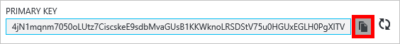

<properties
    pageTitle="Gerenciar uma conta de DocumentDB através do Portal do Azure | Microsoft Azure"
    description="Saiba como gerenciar sua conta DocumentDB através do Portal do Azure. Encontre um guia sobre como usar o Portal do Azure para exibir, copiar, excluir e acessar contas."
    keywords="Azure Portal, documentdb, azure, do Microsoft azure"
    services="documentdb"
    documentationCenter=""
    authors="kirillg"
    manager="jhubbard"
    editor="cgronlun"/>

<tags
    ms.service="documentdb"
    ms.workload="data-services"
    ms.tgt_pltfrm="na"
    ms.devlang="na"
    ms.topic="article"
    ms.date="10/14/2016"
    ms.author="kirillg"/>

# Como gerenciar uma conta de DocumentDB

Aprenda a definir consistência global, trabalhar com chaves e excluir uma conta de DocumentDB no portal do Azure.

## Gerenciar configurações de consistência DocumentDB

Selecionar o nível de consistência direito depende da semântica do seu aplicativo. Você deve se familiarizar com os níveis de consistência disponíveis no DocumentDB lendo [usando níveis de consistência maximizar a disponibilidade e desempenho em DocumentDB] [consistency]. DocumentDB fornece consistência, disponibilidade e garantias de desempenho, em cada nível de consistência disponível para sua conta de banco de dados. Configurar sua conta de banco de dados com um nível de consistência de forte requer que seus dados restrita para uma única região Azure e globalmente não está disponível. Por outro lado, os níveis de consistência reduzida - envelhecimento limitada, session ou habilitar eventual associar qualquer número de regiões Azure com sua conta de banco de dados. As seguintes etapas simples mostram como selecionar o nível de consistência padrão para sua conta de banco de dados. 

### Para especificar a consistência padrão para uma conta de DocumentDB

1. No [portal do Azure](https://portal.azure.com/), acesse sua conta de DocumentDB.
2. Na lâmina conta, clique em **padrão consistência**.
3. Na lâmina **Consistência padrão** , selecione o novo nível de consistência e clique em **Salvar**.
    ![Sessão de consistência padrão][5]

## Exibir, copiar e gerar as teclas de acesso
Quando você cria uma conta de DocumentDB, o serviço gera duas teclas de acesso mestre que podem ser usadas para autenticação quando a conta de DocumentDB é acessada. Fornecendo duas teclas de acesso, DocumentDB permite gerar as chaves sem interrupção à sua conta de DocumentDB. 

No [portal do Azure](https://portal.azure.com/), acesse a lâmina de **teclas** no menu de recurso no blade **DocumentDB conta** para exibir, copiar e gerar as teclas de acesso que são usadas para acessar sua conta de DocumentDB.

> [AZURE.NOTE] A lâmina de **chaves** também inclui cadeias de caracteres de conexão principal e secundário que podem ser usadas para conectar à sua conta da [Ferramenta de migração de dados](documentdb-import-data.md).

Chaves somente leitura também estão disponíveis nessa lâmina. Leituras e consultas são operações de somente leitura, enquanto cria, exclusões, e substitui não.

### Copiar uma tecla de acesso no Portal do Azure

Na lâmina **chaves** , clique no botão **Copiar** para a direita da chave que você deseja copiar.

### Gerar as teclas de acesso

Você deve alterar as teclas de acesso à sua conta de DocumentDB periodicamente para ajudar a manter suas conexões mais segura. Duas teclas de acesso são atribuídas para que você possa manter conexões para a conta de DocumentDB usando uma tecla de acesso enquanto você gerar tecla de acesso.

> [AZURE.WARNING] Gerar suas chaves de acesso afeta todos os aplicativos que dependem da chave atual. Todos os clientes que usam a chave de acesso para acessar a conta de DocumentDB devem ser atualizados para usar a nova chave.

Se você tiver aplicativos ou serviços de nuvem usando a conta de DocumentDB, você perderá as conexões se você gerar chaves, a menos que você implementar suas chaves. As etapas a seguir descrevem o processo envolvidos em contínuas suas chaves.

1. Atualize a chave de acesso no seu código do aplicativo para fazer referência a tecla de acesso secundário da conta DocumentDB.
2. Gerar novamente a chave primária de acesso para sua conta de DocumentDB. No [Portal do Azure](https://portal.azure.com/), acesse sua conta de DocumentDB.
3. Na lâmina **DocumentDB conta** , clique em **chaves**.
4. Na lâmina **chaves** , clique no botão gerar novamente, clique em **Okey** para confirmar que você deseja gerar uma nova chave.
    

5. Depois de verificar que a nova chave está disponível para uso (aproximadamente 5 minutos após a nova geração), atualize a chave de acesso no seu código do aplicativo para fazer referência a nova chave de acesso primário.
6. Gerar novamente a chave de acesso secundário.

    

> [AZURE.NOTE] Pode levar alguns minutos antes de uma chave gerada recentemente pode ser usada para acessar sua conta de DocumentDB.

## Obter a cadeia de conexão

Para recuperar a cadeia de caracteres de conexão, faça o seguinte: 

1. No [portal do Azure](https://portal.azure.com), acesse sua conta de DocumentDB.
2. No menu recursos, clique em **chaves**.
3. Clique no botão **Copiar** ao lado da caixa de **Cadeia de Conexão principal** ou **Secundário cadeia de Conexão** . 

Se você estiver usando a cadeia de conexão na [Ferramenta de migração do banco de dados de DocumentDB](documentdb-import-data.md), anexe o nome do banco de dados para o final da cadeia de caracteres de conexão. `AccountEndpoint=< >;AccountKey=< >;Database=< >`.

## Excluir uma conta de DocumentDB
Para remover uma conta de DocumentDB do Portal do Azure que você já não está usando, use o comando **Excluir conta** na lâmina **DocumentDB conta** .

1. No [portal do Azure](https://portal.azure.com/), acesse a conta de DocumentDB que você deseja excluir.
2. Na lâmina **DocumentDB conta** , clique em **mais**e, em seguida, clique em **Excluir conta**. Ou, clique com botão direito no nome do banco de dados e clique em **Excluir conta**.
3. Na lâmina confirmação resultante, digite o nome da conta de DocumentDB para confirmar que você deseja excluir a conta.
4. Clique no botão **Excluir** .

## Próximas etapas

Saiba como [começar com sua conta de DocumentDB](http://go.microsoft.com/fwlink/p/?LinkId=402364).

Para saber mais sobre DocumentDB, consulte a documentação do Azure DocumentDB em [azure.com](http://go.microsoft.com/fwlink/?LinkID=402319&clcid=0x409).

<!--Image references-->
[1]: ./media/documentdb-manage-account/documentdb_add_region-1.png
[2]: ./media/documentdb-manage-account/documentdb_add_region-2.png
[3]: ./media/documentdb-manage-account/documentdb_change_write_region-1.png
[4]: ./media/documentdb-manage-account/documentdb_change_write_region-2.png
[5]: ./media/documentdb-manage-account/documentdb_change_consistency-1.png
[6]: ./media/documentdb-manage-account/chooseandsaveconsistency.png

<!--Reference style links - using these makes the source content way more readable than using inline links-->
[bcdr]: https://azure.microsoft.com/documentation/articles/best-practices-availability-paired-regions/
[consistency]: https://azure.microsoft.com/documentation/articles/documentdb-consistency-levels/
[azureregions]: https://azure.microsoft.com/en-us/regions/#services
[offers]: https://azure.microsoft.com/en-us/pricing/details/documentdb/
