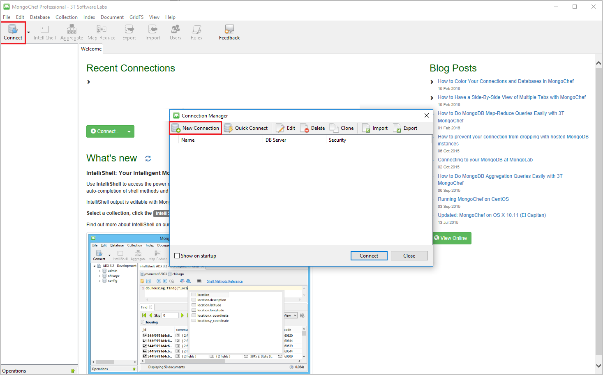
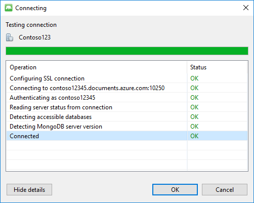
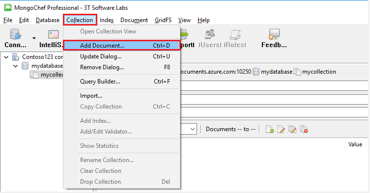

<properties 
    pageTitle="Usar MongoChef com uma conta de DocumentDB com suporte ao protocolo para MongoDB | Microsoft Azure" 
    description="Saiba como usar MongoChef com uma conta de DocumentDB com suporte ao protocolo para MongoDB, agora disponível para visualização." 
    keywords="mongochef"
    services="documentdb" 
    authors="AndrewHoh" 
    manager="jhubbard" 
    editor="" 
    documentationCenter=""/>

<tags 
    ms.service="documentdb" 
    ms.workload="data-services" 
    ms.tgt_pltfrm="na" 
    ms.devlang="na" 
    ms.topic="article" 
    ms.date="08/25/2016" 
    ms.author="anhoh"/>

# Usar MongoChef com uma conta de DocumentDB com suporte ao protocolo para MongoDB

Para conectar a uma conta do Azure DocumentDB com suporte ao protocolo para MongoDB usando MongoChef, faça o seguinte:

- Baixe e instale o [MongoChef](http://3t.io/mongochef)
- Ter sua conta de DocumentDB com suporte ao protocolo para informações de [cadeia de conexão](documentdb-connect-mongodb-account.md) do MongoDB

## Criar a conexão no MongoChef  

Para adicionar sua conta de DocumentDB com suporte ao protocolo para MongoDB para o Gerenciador de conexão de MongoChef, execute as etapas a seguir.

1. Recuperar sua DocumentDB com suporte de protocolo para obter informações de conexão de MongoDB seguindo as instruções [aqui](documentdb-connect-mongodb-account.md).

    

2. Clique em **Conectar** para abrir o Gerenciador de Conexão, clique em **Nova Conexão**

    
    
2. Na janela **Nova Conexão** , na guia **servidor** , insira o HOST (FQDN) da conta DocumentDB com suporte ao protocolo para MongoDB e a porta.
    
    

3. Na janela **Nova Conexão** , na guia **autenticação** , escolha modo de autenticação **padrão (MONGODB-CR ou SCARM-SHA-1)** e digite o nome de usuário e senha.  Aceite o banco de dados de autenticação de padrão (admin) ou fornecer seu próprio valor.

    

4. Na janela **Nova Conexão** , na guia **SSL** , marque a caixa de seleção **protocolo de usar SSL para conectar-se** e o botão de rádio de **certificados SSL auto-assinado de aceitar** .

    

5. Clique no botão **Testar Conexão** para validar as informações de conexão, clique em **Okey** para retornar à janela nova Conexão e clique em **Salvar**.

    

## Use MongoChef para criar um banco de dados, conjunto e documentos  

Para criar um banco de dados, coleta e documentos usando MongoChef, execute as etapas a seguir.

1. No **Gerenciador de Conexão**, realce a conexão e clique em **Conectar**.

    

2. Clique com botão direito do host e escolha **Adicionar banco de dados**.  Forneça um nome de banco de dados e clique em **Okey**.
    
    

3. Clique com botão direito do banco de dados e escolha **Adicionar conjunto**.  Forneça um nome de coleção e clique em **criar**.

    

4. Clique no item de menu **conjunto** , clique em **Adicionar documento**.

    

5. Na caixa de diálogo Adicionar documento, cole o seguinte e clique em **Adicionar documento**.

        {
        "_id": "AndersenFamily",
        "lastName": "Andersen",
        "parents": [
            { "firstName": "Thomas" },
            { "firstName": "Mary Kay"}
        ],
        "children": [
        {
            "firstName": "Henriette Thaulow", "gender": "female", "grade": 5,
            "pets": [{ "givenName": "Fluffy" }]
        }
        ],
        "address": { "state": "WA", "county": "King", "city": "seattle" },
        "isRegistered": true
        }

    
6. Adicione outro documento, dessa vez com o seguinte conteúdo.

        {
        "_id": "WakefieldFamily",
        "parents": [
            { "familyName": "Wakefield", "givenName": "Robin" },
            { "familyName": "Miller", "givenName": "Ben" }
        ],
        "children": [
            {
                "familyName": "Merriam", 
                "givenName": "Jesse", 
                "gender": "female", "grade": 1,
                "pets": [
                    { "givenName": "Goofy" },
                    { "givenName": "Shadow" }
                ]
            },
            { 
                "familyName": "Miller", 
                "givenName": "Lisa", 
                "gender": "female", 
                "grade": 8 }
        ],
        "address": { "state": "NY", "county": "Manhattan", "city": "NY" },
        "isRegistered": false
        }

7. Execute uma consulta de exemplo. Por exemplo, pesquise famílias com o sobrenome 'Freitas' e retornar os campos de estado e pais.

    
    

## Próximas etapas

- Explore DocumentDB com suporte ao protocolo para MongoDB [amostras](documentdb-mongodb-samples.md).

 
