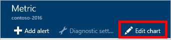
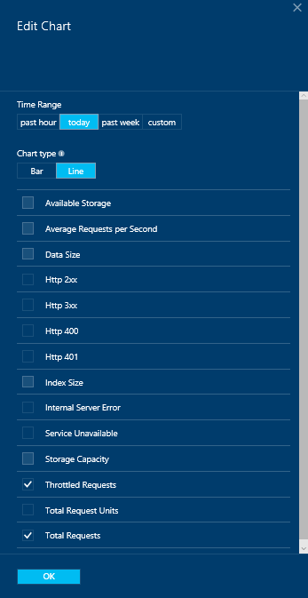
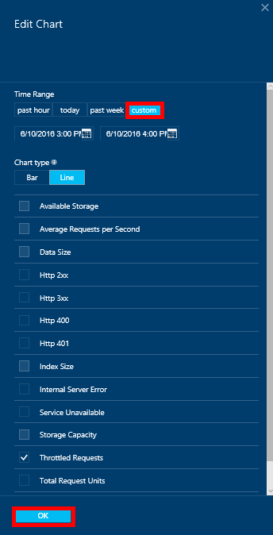
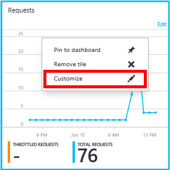
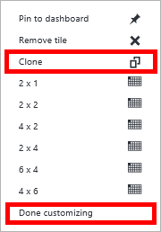
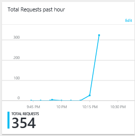

<properties
    pageTitle="Monitorar o armazenamento e solicitações de DocumentDB | Microsoft Azure"
    description="Saiba como monitorar a sua conta de DocumentDB de métricas de desempenho, como as solicitações e erros de servidor e métricas de uso, como o consumo de armazenamento."
    services="documentdb"
    documentationCenter=""
    authors="mimig1"
    manager="jhubbard"
    editor="cgronlun"/>

<tags
    ms.service="documentdb"
    ms.workload="data-services"
    ms.tgt_pltfrm="na"
    ms.devlang="na"
    ms.topic="article"
    ms.date="10/17/2016"
    ms.author="mimig"/>

# Monitorar solicitações DocumentDB, uso e armazenamento

Você pode monitorar suas contas do Azure DocumentDB no [portal do Azure](https://portal.azure.com/). Para cada conta DocumentDB, ambas as métricas de desempenho, como as solicitações de erros do servidor e métricas de uso, como o consumo de armazenamento, estão disponíveis.

Métricas podem ser examinadas na lâmina conta ou no novo blade métricas.

## Métricas de desempenho do modo de exibição na lâmina métricas

1. Em uma nova janela, abra o [portal do Azure](https://portal.azure.com/), clique em **Mais serviços**, clique **DocumentDB (NoSQL)**e clique no nome da conta de DocumentDB para o qual você deseja exibir métricas de desempenho.
2. No menu recursos, clique em **métricas**.

A lâmina métricas abre, e você pode selecionar o conjunto a ser revisado. Você pode revisar métricas de disponibilidade, solicitações, produtividade e armazenamento e compará-los com os SLAs DocumentDB.

## Métricas de desempenho do modo de exibição na lâmina conta
1.  Em uma nova janela, abra o [portal do Azure](https://portal.azure.com/), clique em **Mais serviços**, clique **DocumentDB (NoSQL)**e clique no nome da conta de DocumentDB para o qual você deseja exibir métricas de desempenho.

2.  Por padrão, as lentes de **monitoramento** exibe imagens a seguir:
    *   Total de pedidos do dia atual.
    *   Armazenamento usado.

    Se sua tabela não exibe **nenhum dado disponível** e você acha que há dados no seu banco de dados, consulte a seção de [solução de problemas](#troubleshooting) .

    

3.  Clicar na **solicitações** ou **armazenamento** bloco abre uma lâmina **métrica** detalhada.
4.  A lâmina **métrica** mostra detalhes sobre as métricas que você selecionou.  Na parte superior da lâmina é um gráfico de solicitações representados por hora e abaixo disso está tabela que mostra os valores de agregação para solicitações limitadas e totais.  A lâmina métrica também mostra a lista de alertas que foram definidos, filtrado para as métricas que aparecem na lâmina métrica atual (dessa forma, se você tiver um número de alertas, você só verá os relevantes apresentados aqui).   

    

## Personalizar modos de exibição de métricas de desempenho no portal

1.  Para personalizar as métricas exibem em um gráfico específico, clique no gráfico para abri-lo na lâmina **métrica** e clique em **Editar gráfico**.  
    

2.  Na lâmina **Editar gráfico** , existem opções para modificar as métricas que exibidos no gráfico, bem como o intervalo de tempo.  
    

3.  Para alterar as métricas exibidas na parte, simplesmente selecione ou desmarque as métricas de desempenho disponíveis e clique em **Okey** na parte inferior da lâmina.  
4.  Para alterar o intervalo de tempo, escolha um intervalo diferente (por exemplo, **personalizado**) e clique em **Okey** na parte inferior da lâmina.  

    

## Criar gráficos de lado a lado no portal
Portal do Azure permite que você crie gráficos métricos lado a lado.  

1.  Primeiro, clique com botão direito no gráfico que você deseja copiar e selecione **Personalizar**.

    

2.  Clique em **clonar** no menu para copiar a parte e, em seguida, clique em **Personalizar como concluído**.

      

Agora você pode tratar essa parte como qualquer outra parte métrica, personalizando o intervalo de tempo e métricas exibido na parte.  Fazendo isso, você pode ver duas métricas diferentes gráfico lado a lado ao mesmo tempo.  
      

## Configurar alertas no portal
1.  No [portal do Azure](https://portal.azure.com/), clique em **Mais serviços**, clique **DocumentDB (NoSQL)**e clique no nome da conta de DocumentDB para o qual você deseja configurar alertas de métricas de desempenho.

2.  No menu recursos, clique em **Regras de alerta** para abrir a lâmina de regras de alerta.  
    

3.  Na lâmina **regras de alerta** , clique em **Adicionar alerta**.  
    

4.  Na lâmina **Adicionar uma regra de alerta** , especifique:
    *   O nome da regra de alerta que você está configurando.
    *   Uma descrição da nova regra de alerta.
    *   A métrica para a regra de alerta.
    *   A condição, limite e período que determinam quando o alerta ativa. Por exemplo, um erro de servidor contar maior do que 5 sobre últimos 15 minutos.
    *   Se o administrador do serviço e coadministrators são enviados por e-mail quando o alerta for acionado.
    *   Endereços de email adicionais para notificações de alerta.  
    

## Monitorar DocumentDB programaticamente
As métricas de nível de conta disponíveis no portal do, como nos solicitações do uso e total de armazenamento de conta não estão disponíveis por meio das APIs DocumentDB. No entanto, você pode recuperar dados de uso do nível de conjunto usando as APIs DocumentDB. Para recuperar dados de nível de conjunto, faça o seguinte:

- Para usar a API REST, [realizar um GET na coleção](https://msdn.microsoft.com/library/mt489073.aspx). As informações de cota e o uso da coleção serão retornadas nos cabeçalhos de x-ms-cota de recursos e x-ms-uso de recursos na resposta.
- Para usar o SDK do .NET, use o método [DocumentClient.ReadDocumentCollectionAsync](https://msdn.microsoft.com/library/microsoft.azure.documents.client.documentclient.readdocumentcollectionasync.aspx) , que retorna um [ResourceResponse](https://msdn.microsoft.com/library/dn799209.aspx) que contém um número de propriedades de uso como **CollectionSizeUsage**, **DatabaseUsage**, **DocumentUsage**e muito mais.

Para acessar métricas adicionais, use o [SDK do Azure Monitor](https://www.nuget.org/packages/Microsoft.Azure.Insights). Definições de métrica disponíveis podem ser recuperadas chamando:

    https://management.azure.com/subscriptions/{SubscriptionId}/resourceGroups/{ResourceGroup}/providers/Microsoft.DocumentDb/databaseAccounts/{DocumentDBAccountName}/metricDefinitions?api-version=2015-04-08

Consultas para recuperar métricas individuais usam o seguinte formato:

    https://management.azure.com/subscriptions/{SubecriptionId}/resourceGroups/{ResourceGroup}/providers/Microsoft.DocumentDb/databaseAccounts/{DocumentDBAccountName}/metrics?api-version=2015-04-08&$filter=%28name.value%20eq%20%27Total%20Requests%27%29%20and%20timeGrain%20eq%20duration%27PT5M%27%20and%20startTime%20eq%202016-06-03T03%3A26%3A00.0000000Z%20and%20endTime%20eq%202016-06-10T03%3A26%3A00.0000000Z

Para obter mais informações, consulte [Recuperando métricas de recurso através da API REST do Azure Monitor](https://blogs.msdn.microsoft.com/cloud_solution_architect/2016/02/23/retrieving-resource-metrics-via-the-azure-insights-api/). Observe que "Azure Inights" foi renomeada "Azure Monitor".  Essa entrada de blog se refere ao nome mais antigo.

## Solução de problemas
Se seus blocos de monitoramento exibem a mensagem **nenhum dado disponível** e você recentemente feitas solicitações ou adicionado dados no banco de dados, você pode editar o bloco para refletir o uso da recente.

### Editar uma peça para atualizar dados atuais
1.  Para personalizar as métricas exibidas em uma determinada parte, clique no gráfico para abrir a lâmina **métrica** e clique em **Editar gráfico**.  
    

2.  Na lâmina **Editar gráfico** , na seção **Intervalo de tempo** , clique **depois Hora**e clique em **Okey**.  
    

3.  Seu bloco agora deve atualizar mostrando seus dados atuais e o uso.  
    

## Próximas etapas
Para saber mais sobre a capacidade de DocumentDB, consulte [Gerenciar DocumentDB capacidade](documentdb-manage.md).
