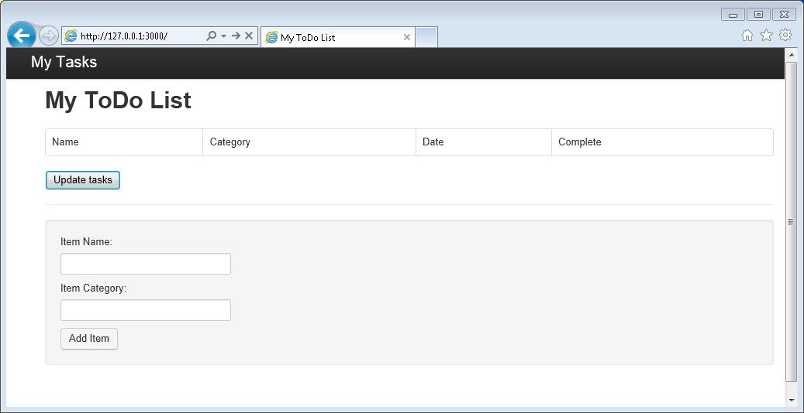

<properties 
    pageTitle="Saiba Node - DocumentDB Node Tutorial | Microsoft Azure" 
    description="Saiba Node! Tutorial examina como usar o Microsoft Azure DocumentDB para armazenar e acessar dados de um aplicativo web do Node Express hospedado em sites do Azure." 
    keywords="Desenvolvimento de aplicativos, tutorial do banco de dados, saiba Node, Node tutorial, documentdb, azure, do Microsoft azure"
    services="documentdb" 
    documentationCenter="nodejs" 
    authors="syamkmsft" 
    manager="jhubbard" 
    editor="cgronlun"/>

<tags 
    ms.service="documentdb" 
    ms.workload="data-services" 
    ms.tgt_pltfrm="na" 
    ms.devlang="nodejs" 
    ms.topic="hero-article" 
    ms.date="08/25/2016" 
    ms.author="syamk"/>

# Criar um aplicativo web do Node usando DocumentDB

> [AZURE.SELECTOR]
- [.NET](documentdb-dotnet-application.md)
- [Node](documentdb-nodejs-application.md)
- [Java](documentdb-java-application.md)
- [Python](documentdb-python-application.md)

Este tutorial Node mostra como usar o serviço de DocumentDB do Azure para armazenar e acessar dados de um aplicativo de Node Express hospedado em sites do Azure.

Recomendamos Introdução assistindo vídeo a seguir, onde você aprenderá provisionar uma conta de banco de dados do Azure DocumentDB e armazenar documentos JSON em seu aplicativo Node. 

> [AZURE.VIDEO azure-demo-getting-started-with-azure-documentdb-on-nodejs-in-linux]

Em seguida, retorne neste tutorial Node, onde você vai aprender as respostas para as seguintes perguntas:

- Como faço para trabalhar com DocumentDB usar o módulo do npm documentdb?
- Como faço para implantar o aplicativo web aos sites do Azure?

Seguindo este tutorial de banco de dados, você criará um aplicativo simples de gerenciamento de tarefa baseado na web que permite criar, recuperar e conclusão de tarefas. As tarefas serão armazenadas como documentos JSON no Azure DocumentDB.

Não tem tempo para concluir o tutorial e apenas deseja obter a solução completa? Não é um problema, você pode acessar a solução de exemplo completos de [GitHub][].

## Pré-requisitos

> [AZURE.TIP] Este tutorial Node pressupõe que você tenha alguma experiência anterior usando node e sites do Azure.

Antes de seguir as instruções neste artigo, você deve garantir que você tenha o seguinte:

- Uma conta do Azure active. Se você não tiver uma conta, você pode criar uma conta de avaliação gratuita em apenas alguns minutos. Para obter detalhes, consulte [Avaliação gratuita do Azure](https://azure.microsoft.com/pricing/free-trial/).
- [Node][] versão v0.10.29 ou superior.
- [Gerador de Express](http://www.expressjs.com/starter/generator.html) (você pode instalá-lo via `npm install express-generator -g`)
- [Gito][].

## Etapa 1: Criar uma conta de banco de dados de DocumentDB

Vamos começar criando uma conta de DocumentDB. Se você já tiver uma conta, você pode pular para [etapa 2: criar um novo aplicativo Node](#_Toc395783178).

[AZURE.INCLUDE [documentdb-create-dbaccount](../../includes/documentdb-create-dbaccount.md)]

[AZURE.INCLUDE [documentdb-keys](../../includes/documentdb-keys.md)]

## Etapa 2: Saiba como criar um novo aplicativo Node

Agora vamos aprender criar um projeto de Hello World Node básico usando o framework [Express](http://expressjs.com/) .

1. Abra o terminal favorito.

2. Use o gerador express para gerar um novo aplicativo chamado **todo**.

        express todo

3. Abra seu novo diretório **todo** e instalar dependências.

        cd todo
        npm install

4. Execute seu novo aplicativo.

        npm start

5. Você pode exibir seu novo aplicativo navegando seu navegador para [http://localhost:3000](http://localhost:3000).

    

## Etapa 3: Instalar módulos adicionais

O arquivo de **package.json** é um dos arquivos criados na raiz do projeto. Este arquivo contém uma lista de módulos adicionais necessários para seu aplicativo Node. Mais tarde, quando você implantar esse aplicativo para sites um Azure, esse arquivo é usado para determinar quais módulos precisam estar instalado no Azure para seu aplicativo de suporte. Nós ainda precisa instalar dois pacotes mais para este tutorial.

1. Voltar no terminal, instale o módulo **assíncrono** via npm.

        npm install async --save

1. Instale o módulo **documentdb** via npm. Este é o módulo onde todos o mágico de DocumentDB acontece.

        npm install documentdb --save

3. Uma verificação rápida do arquivo **package.json** do aplicativo deve mostrar os módulos adicionais. Este arquivo informará Azure quais pacotes para baixar e instalar durante a execução de seu aplicativo. Ele deve se parecer com o exemplo a seguir.

    

    Isso informa ao nó (e posterior Azure) que seu aplicativo depende esses módulos adicionais.

## Etapa 4: Usando o serviço de DocumentDB em um aplicativo de nó

Que cuida de todos os configuração inicial e configuração, agora vamos get para baixo para por que estamos aqui e que é escrever algum código usando DocumentDB do Azure.

### Criar o modelo

1. No diretório do projeto, crie um novo diretório chamado **modelos**.
2. No diretório de **modelos** , crie um novo arquivo chamado **taskDao.js**. Esse arquivo irá conter o modelo para as tarefas criadas pelo nosso aplicativo.
3. Na mesma pasta **modelos** , crie um novo arquivo chamado **docdbUtils.js**. Esse arquivo irá conter alguns códigos úteis, reutilizável, que serão usadas em todo o nosso aplicativo. 
4. Copie o seguinte código para **docdbUtils.js**

        var DocumentDBClient = require('documentdb').DocumentClient;
            
        var DocDBUtils = {
            getOrCreateDatabase: function (client, databaseId, callback) {
                var querySpec = {
                    query: 'SELECT * FROM root r WHERE r.id= @id',
                    parameters: [{
                        name: '@id',
                        value: databaseId
                    }]
                };
        
                client.queryDatabases(querySpec).toArray(function (err, results) {
                    if (err) {
                        callback(err);
        
                    } else {
                        if (results.length === 0) {
                            var databaseSpec = {
                                id: databaseId
                            };
        
                            client.createDatabase(databaseSpec, function (err, created) {
                                callback(null, created);
                            });
        
                        } else {
                            callback(null, results[0]);
                        }
                    }
                });
            },
        
            getOrCreateCollection: function (client, databaseLink, collectionId, callback) {
                var querySpec = {
                    query: 'SELECT * FROM root r WHERE r.id=@id',
                    parameters: [{
                        name: '@id',
                        value: collectionId
                    }]
                };             
                
                client.queryCollections(databaseLink, querySpec).toArray(function (err, results) {
                    if (err) {
                        callback(err);
        
                    } else {        
                        if (results.length === 0) {
                            var collectionSpec = {
                                id: collectionId
                            };
                            
                            client.createCollection(databaseLink, collectionSpec, function (err, created) {
                                callback(null, created);
                            });
        
                        } else {
                            callback(null, results[0]);
                        }
                    }
                });
            }
        };
                
        module.exports = DocDBUtils;

    > [AZURE.TIP] createCollection aceita um parâmetro requestOptions opcionais que pode ser usado para especificar o tipo de oferta para o conjunto. Se nenhum valor requestOptions.offerType for fornecido, em seguida, o conjunto será criado usando o tipo de oferta padrão.
    >
    > Para obter mais informações sobre tipos de oferecer DocumentDB, consulte [níveis de desempenho em DocumentDB](documentdb-performance-levels.md) 
        
3. Salve e feche o arquivo **docdbUtils.js** .

4. No início do arquivo **taskDao.js** , adicione o seguinte código para fazer referência a **DocumentDBClient** e a **docdbUtils.js** que criamos acima:

        var DocumentDBClient = require('documentdb').DocumentClient;
        var docdbUtils = require('./docdbUtils');

4. Em seguida, você irá adicionar código para definir e exporte o objeto de tarefa. Isso é responsável por inicializar o nosso objeto de tarefa e configurando o banco de dados e a coleção de documento que usaremos.

        function TaskDao(documentDBClient, databaseId, collectionId) {
          this.client = documentDBClient;
          this.databaseId = databaseId;
          this.collectionId = collectionId;
        
          this.database = null;
          this.collection = null;
        }
        
        module.exports = TaskDao;

5. Em seguida, adicione o seguinte código para definir métodos adicionais no objeto de tarefa, que permitem interações com dados armazenados em DocumentDB.

        TaskDao.prototype = {
            init: function (callback) {
                var self = this;
        
                docdbUtils.getOrCreateDatabase(self.client, self.databaseId, function (err, db) {
                    if (err) {
                        callback(err);
                    } else {
                        self.database = db;
                        docdbUtils.getOrCreateCollection(self.client, self.database._self, self.collectionId, function (err, coll) {
                            if (err) {
                                callback(err);
        
                            } else {
                                self.collection = coll;
                            }
                        });
                    }
                });
            },
        
            find: function (querySpec, callback) {
                var self = this;
        
                self.client.queryDocuments(self.collection._self, querySpec).toArray(function (err, results) {
                    if (err) {
                        callback(err);
        
                    } else {
                        callback(null, results);
                    }
                });
            },
        
            addItem: function (item, callback) {
                var self = this;
        
                item.date = Date.now();
                item.completed = false;
        
                self.client.createDocument(self.collection._self, item, function (err, doc) {
                    if (err) {
                        callback(err);
        
                    } else {
                        callback(null, doc);
                    }
                });
            },
        
            updateItem: function (itemId, callback) {
                var self = this;
        
                self.getItem(itemId, function (err, doc) {
                    if (err) {
                        callback(err);
        
                    } else {
                        doc.completed = true;
        
                        self.client.replaceDocument(doc._self, doc, function (err, replaced) {
                            if (err) {
                                callback(err);
        
                            } else {
                                callback(null, replaced);
                            }
                        });
                    }
                });
            },
        
            getItem: function (itemId, callback) {
                var self = this;
        
                var querySpec = {
                    query: 'SELECT * FROM root r WHERE r.id = @id',
                    parameters: [{
                        name: '@id',
                        value: itemId
                    }]
                };
        
                self.client.queryDocuments(self.collection._self, querySpec).toArray(function (err, results) {
                    if (err) {
                        callback(err);
        
                    } else {
                        callback(null, results[0]);
                    }
                });
            }
        };

6. Salve e feche o arquivo **taskDao.js** . 

### Criar o controlador

1. No diretório de **rotas** do seu projeto, crie um novo arquivo chamado **tasklist.js**. 
2. Adicione o seguinte código para **tasklist.js**. Isso carrega os módulos DocumentDBClient e assíncrono, que são usados pelo **tasklist.js**. Isso também definido a função de **lista de tarefas** , que é passada uma instância do objeto de **tarefa** que definimos anteriormente:

        var DocumentDBClient = require('documentdb').DocumentClient;
        var async = require('async');
        
        function TaskList(taskDao) {
          this.taskDao = taskDao;
        }
        
        module.exports = TaskList;

3. Continue adicionando ao arquivo **tasklist.js** adicionando os métodos usados para **showTasks, addTask**e **completeTasks**:
        
        TaskList.prototype = {
            showTasks: function (req, res) {
                var self = this;
        
                var querySpec = {
                    query: 'SELECT * FROM root r WHERE r.completed=@completed',
                    parameters: [{
                        name: '@completed',
                        value: false
                    }]
                };
        
                self.taskDao.find(querySpec, function (err, items) {
                    if (err) {
                        throw (err);
                    }
        
                    res.render('index', {
                        title: 'My ToDo List ',
                        tasks: items
                    });
                });
            },
        
            addTask: function (req, res) {
                var self = this;
                var item = req.body;
        
                self.taskDao.addItem(item, function (err) {
                    if (err) {
                        throw (err);
                    }
        
                    res.redirect('/');
                });
            },
        
            completeTask: function (req, res) {
                var self = this;
                var completedTasks = Object.keys(req.body);
        
                async.forEach(completedTasks, function taskIterator(completedTask, callback) {
                    self.taskDao.updateItem(completedTask, function (err) {
                        if (err) {
                            callback(err);
                        } else {
                            callback(null);
                        }
                    });
                }, function goHome(err) {
                    if (err) {
                        throw err;
                    } else {
                        res.redirect('/');
                    }
                });
            }
        };

4. Salve e feche o arquivo **tasklist.js** .
 
### Adicionar config.js

1. No diretório do projeto, crie um novo arquivo chamado **config.js**.
2. Adicione o seguinte para **config.js**. Isso define configurações e valores necessárias para o nosso aplicativo.

        var config = {}
        
        config.host = process.env.HOST || "[the URI value from the DocumentDB Keys blade on http://portal.azure.com]";
        config.authKey = process.env.AUTH_KEY || "[the PRIMARY KEY value from the DocumentDB Keys blade on http://portal.azure.com]";
        config.databaseId = "ToDoList";
        config.collectionId = "Items";
        
        module.exports = config;

3. No arquivo **config.js** , atualize os valores de HOST e AUTH_KEY usando os valores encontrados na lâmina teclas da sua conta de DocumentDB no [Portal do Microsoft Azure](https://portal.azure.com):

4. Salve e feche o arquivo **config.js** .
 
### Modificar app.js

1. No diretório do projeto, abra o arquivo **app.js** . Este arquivo foi criado anteriormente quando o aplicativo da web de Express foi criado.
2. Adicione o seguinte código na parte superior da **app.js**
    
        var DocumentDBClient = require('documentdb').DocumentClient;
        var config = require('./config');
        var TaskList = require('./routes/tasklist');
        var TaskDao = require('./models/taskDao');

3. Esse código define o arquivo de configuração a ser usada e prossegue para ler valores fora este arquivo em algumas variáveis usaremos em breve.
4. Substitua as duas linhas seguintes no arquivo **app.js** :

        app.use('/', routes);
        app.use('/users', users); 

      com o trecho a seguir:

        var docDbClient = new DocumentDBClient(config.host, {
            masterKey: config.authKey
        });
        var taskDao = new TaskDao(docDbClient, config.databaseId, config.collectionId);
        var taskList = new TaskList(taskDao);
        taskDao.init();
        
        app.get('/', taskList.showTasks.bind(taskList));
        app.post('/addtask', taskList.addTask.bind(taskList));
        app.post('/completetask', taskList.completeTask.bind(taskList));
        app.set('view engine', 'jade');

6. Essas linhas definem uma nova instância do nosso objeto **TaskDao** , com uma nova conexão para DocumentDB (usando os valores de ler a partir do **config.js**), inicializar o objeto de tarefa e, em seguida, vinculam ações do formulário para métodos em nosso controlador de **lista de tarefas** . 

7. Finalmente, salve e feche o arquivo **app.js** , podemos praticamente terminar.
 
## Etapa 5: Criar uma interface de usuário

Agora vamos voltar nossa atenção para criar a interface do usuário para que um usuário realmente pode interagir com nosso aplicativo. O aplicativo de Express criamos usa **Jade** como o mecanismo de exibição. Para obter mais informações sobre Jade consulte [http://jade-lang.com/](http://jade-lang.com/).

1. O arquivo de **layout.jade** no diretório de **modos de exibição** é usado como um modelo global para outros arquivos de **.jade** . Nesta etapa, você irá modificá-lo para usar [Inicialização Twitter](https://github.com/twbs/bootstrap), que é um kit de ferramentas que torna mais fácil criar um site de aparência interessante. 
2. Abra o arquivo **layout.jade** encontrado na pasta **modos de exibição** e substitua o conteúdo com procedimentos:
    
        doctype html
        html
          head
            title= title
            link(rel='stylesheet', href='//ajax.aspnetcdn.com/ajax/bootstrap/3.3.2/css/bootstrap.min.css')
            link(rel='stylesheet', href='/stylesheets/style.css')
          body
            nav.navbar.navbar-inverse.navbar-fixed-top
              div.navbar-header
                a.navbar-brand(href='#') My Tasks
            block content
            script(src='//ajax.aspnetcdn.com/ajax/jQuery/jquery-1.11.2.min.js')
            script(src='//ajax.aspnetcdn.com/ajax/bootstrap/3.3.2/bootstrap.min.js')

    Isso efetivamente informa ao mecanismo **Jade** para renderizar alguns HTML de nosso aplicativo e cria um **bloco** de chamada de **conteúdo** onde estamos pode fornecer o layout para nossas páginas de conteúdo.
    Salve e feche o arquivo **layout.jade** .

4. Agora, abra o arquivo **Jade** , o modo de exibição que será usado por nosso aplicativo e substitua o conteúdo do arquivo com o seguinte:

        extends layout
        
        block content
          h1 #{title}
          br
        
          form(action="/completetask", method="post")
            table.table.table-striped.table-bordered
              tr
                td Name
                td Category
                td Date
                td Complete
              if (typeof tasks === "undefined")
                tr
                  td
              else
                each task in tasks
                  tr
                    td #{task.name}
                    td #{task.category}
                    - var date  = new Date(task.date);
                    - var day   = date.getDate();
                    - var month = date.getMonth() + 1;
                    - var year  = date.getFullYear();
                    td #{month + "/" + day + "/" + year}
                    td
                      input(type="checkbox", name="#{task.id}", value="#{!task.completed}", checked=task.completed)
            button.btn(type="submit") Update tasks
          hr
          form.well(action="/addtask", method="post")
            label Item Name:
            input(name="name", type="textbox")
            label Item Category:
            input(name="category", type="textbox")
            br
            button.btn(type="submit") Add item

    Isso estende o layout e fornece conteúdo para o espaço reservado de **conteúdo** visto no arquivo **layout.jade** anteriormente.
    
    Neste layout criamos duas formas HTML. 
    Primeiro formulário contém uma tabela para nossos dados e um botão que permite atualizar itens postando em método de **/completetask** de nosso controlador.
    O segundo formulário contém dois campos de entrada e um botão que permite criar um novo item postando em método de **/addtask** de nosso controlador.
    
    Isso deve ser tudo o que precisamos para nosso aplicativo funcione.

5. Abra o arquivo **Style** no diretório **public\stylesheets** e substitua o código a seguir:

        body {
          padding: 50px;
          font: 14px "Lucida Grande", Helvetica, Arial, sans-serif;
        }
        a {
          color: #00B7FF;
        }
        .well label {
          display: block;
        }
        .well input {
          margin-bottom: 5px;
        }
        .btn {
          margin-top: 5px;
          border: outset 1px #C8C8C8;
        }

    Salve e feche o arquivo **Style** .

## Etapa 6: Executar o aplicativo localmente

1. Para testar o aplicativo no computador local, execute `npm start` em um terminal para iniciar o aplicativo e iniciar um navegador com uma página que se parece com a imagem abaixo:

    

2. Use os campos fornecidos para Item, o nome do Item e a categoria para inserir informações e, em seguida, clique em **Adicionar Item**.

3. A página deve atualizar para exibir o item recém-criado na lista ToDo.

    

4. Para concluir uma tarefa, basta marcar a caixa de seleção na coluna concluído e clique em **Atualizar tarefas**.

## Etapa 7: Implantar o seu projeto de desenvolvimento de aplicativo para sites do Azure

1. Se você ainda não começou, habilite um repositório gito para seu site do Azure. Você pode encontrar instruções sobre como fazer isso no tópico da [Implantação Local do gito ao serviço de aplicativo do Azure](../app-service-web/app-service-deploy-local-git.md) .

2. Adicione seu site do Azure como um gito remoto.

        git remote add azure https://username@your-azure-website.scm.azurewebsites.net:443/your-azure-website.git

3. Implante enviando para o computador remoto.

        git push azure master

4. Em alguns segundos, gito serão terminar seu aplicativo da web de publicação e iniciar um navegador onde você pode ver seu trabalho prático em execução no Azure!

## Próximas etapas

Parabéns! Apenas você tiver criado seu primeiro Node Express aplicativo Web usando DocumentDB do Azure e publicá-lo para sites do Azure.

O código-fonte para o aplicativo de referência completa pode ser baixado do [GitHub][].

Para obter mais informações, consulte o [Node Developer Center](https://azure.microsoft.com/develop/nodejs/).

[Node]: http://nodejs.org/
[Gito]: http://git-scm.com/
[GitHub]: https://github.com/Azure-Samples/documentdb-node-todo-app
 
