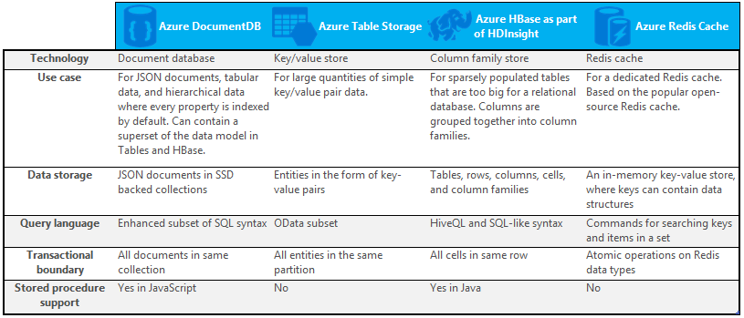

<properties
    pageTitle="Quando usar NoSQL vs SQL | Microsoft Azure"
    description="Compare os benefícios de usar NoSQL soluções não relacionais versus soluções SQL. Saber se um dos serviços do Microsoft Azure NoSQL ou SQL Server melhor se encaixa no seu cenário."
    keywords="NoSQL vs sql, quando usar NoSQL, sql vs nosql"
    services="documentdb"
    documentationCenter=""
    authors="mimig1"
    manager="jhubbard"
    editor=""/>

<tags
    ms.service="documentdb"
    ms.workload="data-services"
    ms.tgt_pltfrm="na"
    ms.devlang="dotnet"
    ms.topic="article" 
    ms.date="06/24/2016"
    ms.author="mimig"/>

# NoSQL vs SQL

SQL Server e bancos de dados relacionais (RDBMS) foram os bancos de dados ir para mais de 20 anos. No entanto, a necessidade de aumento para processar maiores volumes e tipos de dados a uma taxa rápida alterou a natureza das necessidades de armazenamento de dados para desenvolvedores de aplicativos. Para habilitar esse cenário, bancos de dados NoSQL que permitem armazenar dados estruturados e heterogêneos em escala ganharam popularidade. 

NoSQL é uma categoria de bancos de dados nitidamente diferentes de bancos de dados do SQL. NoSQL geralmente é usado para se referir a sistemas de gerenciamento de dados que são "Não SQL" ou uma abordagem de gerenciamento de dados que inclui "não somente SQL". Há um número de tecnologias na categoria de NoSQL, incluindo bancos de dados do documento, valor da chave, lojas de família de coluna e bancos de dados do gráfico, que são populares de jogos, social, e IoT aplicativos.

O objetivo deste artigo é para ajudá-lo a saber mais sobre as diferenças entre NoSQL e SQL e fornecer uma introdução às ofertas NoSQL e SQL da Microsoft.  

## Quando usar NoSQL?

Digamos que você está construindo um novo site de contrato social. Os usuários podem criar postagens e adicionar imagens, vídeos e músicas a eles. Outros usuários podem comentar as postagens e dar pontos (curtidas) para classificar as postagens. A página inicial terá um feed das postagens que os usuários podem compartilhar e interagir com. 

Então, como você armazena esses dados? Se você estiver familiarizado com SQL, você pode começar a desenhar algo parecido com isto:

Até aqui tudo bem, mas agora pense sobre a estrutura de uma única postagem e como exibi-la. Se você quiser mostrar a postagem e as imagens associadas, áudio, vídeo, comentários, pontos e informações do usuário em um site ou aplicativo, você teria que executar uma consulta com oito relações de tabela apenas para recuperar o conteúdo. Agora, imagine um fluxo de postagens que carregar dinamicamente e aparecem na tela e você pode prever facilmente que vai exigir milhares de consultas e junções muitos para concluir a tarefa.

Agora você pode usar uma solução relacional como o SQL Server para armazenar os dados -, mas há outra opção, uma opção de NoSQL que simplifica a abordagem. Transformando a postagem em um documento JSON como procedimentos e armazená-la em DocumentDB, um serviço de banco de dados do Azure NoSQL documento, você pode aumentar o desempenho e recuperar a postagem inteira com uma consulta e nenhum junções. É mais simples, mais simples e um desempenho melhor resultado.

    {
        "id":"ew12-res2-234e-544f",
        "title":"post title",
        "date":"2016-01-01",
        "body":"this is an awesome post stored on NoSQL",
        "createdBy":User,
        "images":["http://myfirstimage.png","http://mysecondimage.png"],
        "videos":[
            {"url":"http://myfirstvideo.mp4", "title":"The first video"},
            {"url":"http://mysecondvideo.mp4", "title":"The second video"}
        ],
        "audios":[
            {"url":"http://myfirstaudio.mp3", "title":"The first audio"},
            {"url":"http://mysecondaudio.mp3", "title":"The second audio"}
        ]
    }

Além disso, esses dados podem ser particionados pelo id de postagem, permitindo que os dados dimensionar naturalmente e tirar proveito das características de escala NoSQL. Também sistemas de NoSQL permitem aos desenvolvedores solte consistência e oferecer aplicativos altamente disponíveis.  Por fim, esta solução não exige desenvolvedores definir, gerenciar e manter esquema na camada de dados permitindo iteração rápida.

Em seguida, você pode criar sobre esta solução usando outros serviços do Azure:

- [Pesquisa do Azure](https://azure.microsoft.com/services/search/) podem ser usados por meio do aplicativo da web para permitir que os usuários para pesquisar por postagens.
- [Serviços de aplicativo do Azure](https://azure.microsoft.com/services/app-service/) pode ser usado para hospedar aplicativos e processos de plano de fundo.
- [Armazenamento de Blob do Azure](https://azure.microsoft.com/services/storage/) pode ser usado para armazenar perfis de usuário completo incluindo imagens.
- [Azure SQL Database](https://azure.microsoft.com/services/sql-database/) pode ser usada para armazenar grandes quantidades de dados como informações de logon e dados para análise de uso.
- [Aprendizado de máquina do Azure](https://azure.microsoft.com/services/machine-learning/) podem ser usados para criar o conhecimento e inteligência que pode fornecer comentários para o processo e ajudar a oferecer o conteúdo certo para os usuários à direita.

Este site de contrato social é apenas um um cenário em que um banco de dados NoSQL é o modelo de dados corretos para o trabalho. Se você estiver interessado em ler mais sobre esse cenário e como seus dados de modelo para DocumentDB em aplicativos de mídia social, consulte [indo social com DocumentDB](documentdb-social-media-apps.md). 

## Comparação SQL vs NoSQL

A tabela a seguir compara as principais diferenças entre NoSQL e SQL. 

Se um banco de dados NoSQL melhor atenda às suas necessidades, prossiga para a próxima seção para saber mais sobre os serviços de NoSQL disponíveis do Azure. Caso contrário, se um banco de dados do SQL melhor atenda às suas necessidades, vá para [quais são as ofertas do Microsoft SQL?](#what-are-the-microsoft-sql-offerings)

## Quais são as ofertas do Microsoft Azure NoSQL?

Azure tem quatro totalmente gerenciados NoSQL serviços: 

- [DocumentDB Azure](https://azure.microsoft.com/services/documentdb/)
- [Armazenamento de tabela do Microsoft Azure](https://azure.microsoft.com/services/storage/)
- [Azure HBase como parte do HDInsight](https://azure.microsoft.com/services/hdinsight/)
- [Cache relacionada Azure](https://azure.microsoft.com/services/cache/)

O gráfico de comparação a seguir mapeia os principais diferenciadores para cada serviço. Qual com mais precisão descreve as necessidades de seu aplicativo? 

Se um ou mais desses serviços podem atender às necessidades de seu aplicativo, saiba mais com os seguintes recursos: 

- [Caminho de aprendizagem DocumentDB](https://azure.microsoft.com/documentation/learning-paths/documentdb/) e [casos de uso de DocumentDB](documentdb-use-cases.md)
- [Introdução ao armazenamento de tabela do Microsoft Azure](../storage/storage-dotnet-how-to-use-tables.md)
- [O que é HBase no HDInsight](../hdinsight/hdinsight-hbase-overview.md)
- [Relacionada Cache caminho de aprendizagem](https://azure.microsoft.com/documentation/learning-paths/redis-cache/)

Vá para [próximos passos](#next-steps) para obter informações de avaliação gratuitas.

## Quais são as ofertas do Microsoft SQL?

Microsoft tem cinco ofertas de SQL: 

- [Banco de dados do SQL Azure](https://azure.microsoft.com/services/sql-database/)
- [SQL Server no Azure máquinas virtuais](https://azure.microsoft.com/services/virtual-machines/sql-server/)
- [SQL Server](https://www.microsoft.com/server-cloud/products/sql-server-2016/)
- [Depósito de dados do SQL Azure (visualização)](https://azure.microsoft.com/services/sql-data-warehouse/)
- [Sistema de plataforma de análise (dispositivo local)](https://www.microsoft.com/en-us/server-cloud/products/analytics-platform-system/)

Se você estiver interessado em SQL Server em uma máquina Virtual ou banco de dados SQL, leia [Escolha uma opção do SQL Server de nuvem: banco de dados do SQL Azure (PaaS) ou SQL Server no Azure VMs (IaaS)](../sql-database/sql-database-paas-vs-sql-server-iaas.md) para saber mais sobre as diferenças entre os dois.

Se SQL parece a melhor opção, vá para o [SQL Server](https://www.microsoft.com/server-cloud/products/) para saber mais sobre o que nossos produtos Microsoft SQL e serviços tem a oferecer.

Vá para [as próximas etapas](#next-steps) gratuitamente links de avaliação e avaliação.

## Próximas etapas

Você está convidado para saber mais sobre nossos produtos SQL e NoSQL experimentando-los gratuitamente. 

- Para todos os serviços do Azure, você pode inscrever-se para uma [versão de avaliação de um mês gratuita](https://azure.microsoft.com/pricing/free-trial/) e receber $200 gastar em qualquer um dos serviços do Azure.
    - [DocumentDB Azure](https://azure.microsoft.com/services/documentdb/)
    - [Azure HBase como parte do HDInsight](https://azure.microsoft.com/services/hdinsight/)
    - [Cache relacionada Azure](https://azure.microsoft.com/services/cache/)
    - [Depósito de dados do SQL Azure (visualização)](https://azure.microsoft.com/services/sql-data-warehouse/)
    - [Banco de dados do SQL Azure](https://azure.microsoft.com/services/sql-database/)
    - [Armazenamento de tabela do Microsoft Azure](https://azure.microsoft.com/services/storage/)

- Você pode girar uma [versão de avaliação do SQL Server 2016 em uma máquina virtual](https://azure.microsoft.com/marketplace/partners/microsoft/sqlserver2016ctp33evaluationwindowsserver2012r2/) ou baixar uma [versão de avaliação do SQL Server](https://www.microsoft.com/en-us/evalcenter/evaluate-sql-server-2016).
    - [SQL Server](https://www.microsoft.com/server-cloud/products/sql-server-2016/)
    - [SQL Server no Azure máquinas virtuais](https://azure.microsoft.com/services/virtual-machines/sql-server/)

