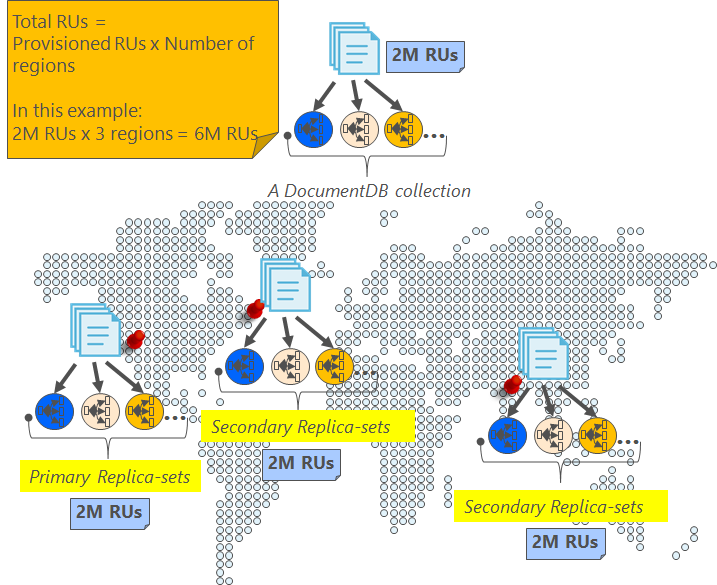

<properties
    pageTitle="Online backup e restauração com DocumentDB | Microsoft Azure"
    description="Saiba como realizar automático backup e restauração de bancos de dados NoSQL com DocumentDB do Azure."
    keywords="backup e restauração, backup on-line"
    services="documentdb"
    documentationCenter=""
    authors="RahulPrasad16"
    manager="jhubbard"
    editor="monicar"/>

<tags
    ms.service="documentdb"
    ms.workload="data-services"
    ms.tgt_pltfrm="na"
    ms.devlang="multiple"
    ms.topic="article"
    ms.date="09/23/2016"
    ms.author="raprasa"/>

# Backup on-line automático e restauração com DocumentDB 

DocumentDB Azure leva automaticamente backups de todos os dados em intervalos regulares. Os backups automáticos são tirados sem afetar o desempenho ou a disponibilidade de suas operações de banco de dados NoSQL. Todos os backups são armazenados separadamente em outro serviço de armazenamento e esses backups globalmente são replicados para resiliência contra desastres regionais. Os backups automáticos são destinados a cenários quando você excluir acidentalmente seu conjunto de DocumentDB e posterior exige recuperação de dados ou uma solução de recuperação.  

Este artigo começa com um resumo rápido da redundância de dados e disponibilidade no DocumentDB e, em seguida, discute backups. 

## Alta disponibilidade com DocumentDB - um resumo

DocumentDB foi projetado para ser [distribuídas globalmente](documentdb-distribute-data-globally.md) – permite escalonar produtividade em várias regiões Azure juntamente com a política controlado pelo failover e APIs múltiplas home pages transparente. Como um sistema de banco de dados oferecendo [disponibilidade de 99,99% SLAs](https://azure.microsoft.com/support/legal/sla/documentdb/v1_0/), todas as gravações no DocumentDB são permanentemente confirmadas discos locais por um quórum de réplicas em um data center local antes de confirmar para o cliente. Observe que a alta disponibilidade do DocumentDB depende de armazenamento local e não dependem de quaisquer tecnologias de armazenamento externo. Além disso, se sua conta de banco de dados está associada a mais de uma região Azure, suas gravações são replicadas em outras regiões também. Para dimensionar seus dados de produtividade e acesso ao menos latências, você pode ter muitos leia regiões associados a uma conta de banco de dados como desejar. Em cada região de leitura, os dados (replicados) permanentemente são mantidos em um conjunto de réplica.  

Conforme ilustrado no diagrama a seguir, um único conjunto de DocumentDB é [particionado horizontalmente](documentdb-partition-data.md). Uma partição de"" é indicada por um círculo no diagrama a seguir, e cada partição é altamente disponível por meio de um conjunto de réplica. Esta é a distribuição local dentro de uma única região Azure (indicada do eixo X). Além disso, cada partição (com seu conjunto de réplica correspondente) é então globalmente distribuída várias regiões associados a uma conta de banco de dados (por exemplo, neste regiões da ilustração três – Leste EUA, oeste EUA e Índia Central). "Conjunto de partições" é globalmente distribuído entidade composta de várias cópias de seus dados em cada região (indicado pelo eixo Y). Você pode atribuir prioridade até as regiões associadas a uma conta de banco de dados e DocumentDB falharão transparente para a próxima região em caso de desastres. Você também manualmente pode simular failover para testar a disponibilidade de ponta a ponta do seu aplicativo.  

A imagem a seguir ilustra o alto grau de redundância com DocumentDB.

## Backups completos, automáticos on-line

EPA, excluídos meu conjunto ou banco de dados! Com DocumentDB, não apenas seus dados, mas os backups dos seus dados também feitas flexível e altamente redundantes desastres regionais. Esses backups automatizados atualmente são tiradas aproximadamente cada quatro horas. 

Os backups são tirados sem afetar o desempenho ou a disponibilidade de suas operações de banco de dados. DocumentDB leva o backup em segundo plano sem consumindo seu RUs provisionados ou afetar o desempenho e sem afetar a disponibilidade de seu banco de dados NoSQL. 

Ao contrário dos seus dados armazenada dentro DocumentDB, os backups automáticos são armazenados em um serviço de armazenamento de Blob do Azure. Para garantir o upload de latência baixa/eficiente, o instantâneo do backup é carregado para uma instância do armazenamento de Blob do Azure na mesma região como a região atual de gravação da sua conta de banco de dados DocumentDB. Para resiliência contra desastre regional, cada instantâneo dos seus dados de backup no armazenamento de Blob do Azure novamente for replicado via geográfica-armazenamento redundante (GRS) para outra região. O diagrama a seguir mostra que toda a coleção de DocumentDB (com todos os três partições primárias Oeste EUA, neste exemplo) é feita backup em uma conta de armazenamento de Blob do Azure remota Oeste EUA e, então, GRS replicados Leste EUA. 

A imagem a seguir ilustra backups completos periódicos de todas as entidades de DocumentDB em armazenamento do Azure GRS.

## Período de retenção para um determinado instantâneo

Conforme descrito acima, podemos periodicamente instantâneos dos dados e por nossos regulamentos, podemos manter instantâneo mais recente backup 90 dias antes eventualmente obtém limpas. Se uma conta ou um conjunto é excluída, o DocumentDB armazene o último backup por 90 dias.

## Restaurar o banco de dados do backup on-line

Caso você excluir acidentalmente seus dados, você pode [arquivo um tíquete](https://portal.azure.com/?#blade/Microsoft_Azure_Support/HelpAndSupportBlade) ou [contate o suporte do Azure](https://azure.microsoft.com/support/options/) para restaurar os dados a partir do último backup automático. Para obter um instantâneo específico do backup a ser restaurado, DocumentDB exige que os dados estavam pelo menos disponíveis conosco para a duração do ciclo de backup para esse instantâneo.

## Próximas etapas

Para replicar o banco de dados NoSQL em vários data centers, consulte [distribuir seus dados globalmente com DocumentDB](documentdb-distribute-data-globally.md). 

Contato de arquivo suporte do Azure, [arquivo um tíquete do portal do Azure](https://portal.azure.com/?#blade/Microsoft_Azure_Support/HelpAndSupportBlade).