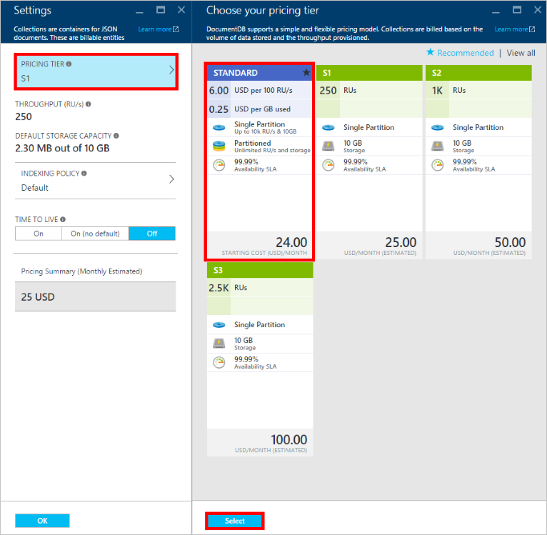

<properties
    pageTitle="Níveis de desempenho em DocumentDB | Microsoft Azure"
    description="Saiba mais sobre como os níveis de desempenho no DocumentDB habilitar reservar produtividade em uma base por conjunto."
    services="documentdb"
    authors="mimig1"
    manager="jhubbard"
    editor="monicar"
    documentationCenter=""/>

<tags
    ms.service="documentdb"
    ms.workload="data-services"
    ms.tgt_pltfrm="na"
    ms.devlang="na"
    ms.topic="article"
    ms.date="08/26/2016"
    ms.author="mimig"/>

# Níveis de desempenho em DocumentDB

Este artigo fornece uma visão geral dos níveis de desempenho no [Microsoft Azure DocumentDB](https://azure.microsoft.com/services/documentdb/).

Após ler este artigo, você poderá responder às seguintes perguntas:  

-   O que é um nível de desempenho?
-   Como a produtividade é reservada para uma conta de banco de dados?
-   Como trabalhar com níveis de desempenho?
-   Como estou cobrado para níveis de desempenho?

## Introdução aos níveis de desempenho

Cada conjunto de DocumentDB criado em uma conta padrão está provisionado com um nível de desempenho associados. Cada conjunto em um banco de dados pode ter um nível de desempenho diferentes, permitindo que você designar mais produtividade para conjuntos de acessadas e menos produtividade para conjuntos de acessados raramente. DocumentDB suporta dois níveis de desempenho definidos pelo usuário e predefinida em níveis de desempenho.  

Cada nível de desempenho tem um limite de taxa associada [a unidade de solicitação (RU)](documentdb-request-units.md) . Esta é a taxa de transferência que será reservada para uma coleção com base em seu nível de desempenho e está disponível para uso por esse conjunto exclusivamente.

<table border="0" cellspacing="0" cellpadding="0">
    <tbody>
        <tr>
            <td valign="top">

</td>
            <td valign="top">
Detalhes
</td>
            <td valign="top">
Limites de produtividade
</td>
            <td valign="top">
Limites de armazenamento
</td>
            <td valign="top">
Versão
</td>
            <td valign="top">
APIs
</td>            
        </tr>
        <tr>
            <td valign="top">
Desempenho definidos pelo usuário
</td>
            <td valign="top">
Armazenamento limitadas com base no uso em GB.

Produtividade em unidades de 100 RU/s
</td>
            <td valign="top">
Ilimitado. 400 - 250.000 solicitar unidades/s por padrão (acima por solicitação)
</td>
            <td valign="top">
Ilimitado. 250 GB por padrão (acima por solicitação) 
</td>
            <td valign="top">
V2
</td>
            <td valign="top">
API de 2015-12-16 e versões mais recentes
</td>  
        </tr>
        <tr>
            <td valign="top">
Desempenho predefinidos
</td>
            <td valign="top">
Armazenamento de 10 GB reservado.

S1 = 250 RU/s, S2 = 1000 RU/s, S3 = 2500 RU/s
</td>
            <td valign="top">
2500 RU/s
</td>
            <td valign="top">
10 GB
</td>
            <td valign="top">
V1
</td>
            <td valign="top">
Qualquer
</td>  
        </tr>        
    </tbody>
</table>                

DocumentDB permite um conjunto sofisticado de operações de banco de dados, incluindo consultas, procedimentos de consultas com funções definidas pelo usuário (UDFs), armazenados e disparadores. O custo de processamento associado a cada uma dessas operações variará com base na CPU, IO e memória necessária para concluir a operação. Em vez de pensando e gerenciamento de recursos de hardware, você pode pensar em uma unidade de solicitação como uma medida única para os recursos necessários para executar várias operações de banco de dados e uma solicitação de aplicativo de serviço.

Coleções podem ser criadas por meio do [portal do Microsoft Azure](https://portal.azure.com), a [API REST](https://msdn.microsoft.com/library/azure/mt489078.aspx) ou qualquer um dos [SDKs DocumentDB](https://msdn.microsoft.com/library/azure/dn781482.aspx). As APIs DocumentDB permitem que você especifique o nível de desempenho de um conjunto.

> [AZURE.NOTE] O nível de desempenho de um conjunto pode ser ajustado pelas APIs ou o [portal do Microsoft Azure](https://portal.azure.com/). Alterações de nível de desempenho devem concluir em 3 minutos.

## Configuração de níveis de desempenho para conjuntos
Depois de um conjunto é criado, a alocação completa de RUs com base no nível de desempenho designado são reservados para o conjunto.

Observe que, com dois níveis de desempenho predefinidos e definidos pelo usuário, DocumentDB opera com base nas reserva de produtividade. Criando uma coleção, um aplicativo reservou e é cobrado para produtividade reservada independentemente quanto do que produtividade for usado ativamente. Níveis de desempenho definidos pelo usuário, armazenamento é limitado com base no consumo, mas com níveis de desempenho predefinidos, 10 GB de armazenamento está reservado no momento da criação do conjunto.  

Depois de coleções são criadas, você pode modificar o nível de desempenho por meio de SDK do DocumentDB ou Portal clássico do Azure.

> [AZURE.IMPORTANT] Conjuntos de DocumentDB padrão são cobrados uma taxa por hora e cada conjunto que você criar será cobrado por um mínimo de uma hora de uso.

Se você ajustar o nível de desempenho de um conjunto dentro de uma hora, você será cobrado para o mais alto nível de desempenho definido durante a hora. Por exemplo, se você aumentar o nível de desempenho para um conjunto às 8:53 você será cobrado para o novo nível começando em 8:00 am. Da mesma forma, se você diminuir o nível de desempenho às 8:53, a nova taxa será aplicada às 9:00 am.

Unidades de solicitação são reservadas para cada conjunto baseado no conjunto de nível de desempenho. Consumo de unidade de solicitação é avaliado como uma taxa de segundo. Aplicativos que excedeu a taxa de unidade de solicitação provisionado (ou o nível de desempenho) em um conjunto serão reduzidos até que a taxa cai abaixo do nível reservado para esse conjunto. Se seu aplicativo requer um nível de produtividade maior, você pode aumentar o nível de desempenho para cada conjunto.

> [AZURE.NOTE] Quando seu aplicativo excede os níveis de desempenho para conjuntos de uma ou várias, solicitações serão reduzidas em uma base por conjunto. Isso significa que algumas solicitações de aplicativo podem bem-sucedida enquanto outras pessoas podem ser limitadas. É recomendável para adicionar um pequeno número de tentativas quando limitado para lidar com picos de tráfego de solicitação.

## Trabalhando com níveis de desempenho
Conjuntos de DocumentDB permitem que você agrupe seus dados com base nos padrões de consulta e necessidades de desempenho do seu aplicativo. Com do DocumentDB a indexação automática e suporte de consulta, é bastante comum colocar documentos heterogêneos no mesmo conjunto. As principais considerações ao decidir se devem ser usadas coleções separadas incluem:

- Consultas – um conjunto é o escopo para execução da consulta. Se você precisar consulta através de um conjunto de documentos, os padrões de leitura mais eficientes provenientes próximos documentos em uma única coleção.
- Transações – todas as transações têm como escopo em um único conjunto. Se você tiver documentos que devem ser atualizados dentro de um único procedimento armazenado ou um disparador, eles devem ser armazenados no mesmo conjunto. Mais especificamente, uma chave de partição dentro de uma coleção é o limite de transação. Consulte [Partitioning em DocumentDB](documentdb-partition-data.md) para obter mais detalhes.
- Isolamento de desempenho – um conjunto tem um nível de desempenho associados. Isso garante que cada conjunto tem um desempenho previsível por meio de RUs reservadas. Dados podem ser alocados para conjuntos de diferentes, com diferentes níveis de desempenho, com base na frequência de acesso.

> [AZURE.IMPORTANT] É importante entender que será cobrada taxas padrão completo, com base no número de conjuntos de criados pelo seu aplicativo.

É recomendável que seu aplicativo faz uso de um pequeno número de conjuntos de, a menos que tenha grandes requisitos de armazenamento ou a produtividade. Certifique-se de que você tenha compreendido padrões de aplicativos para a criação de novos conjuntos. Você pode optar por reservar criação de coleção como uma ação de gerenciamento manipulada fora de seu aplicativo. Da mesma forma, ajustar o nível de desempenho para um conjunto mudará a taxa por hora em que o conjunto é cobrado. Você deve monitorar os níveis de desempenho do conjunto se ajusta-esses dinamicamente do seu aplicativo.

## Alterar de S1, S2, S3 para desempenho definidos pelo usuário

Siga estas etapas para alterar de usar níveis de produtividade predefinidos níveis de produtividade definidas pelo usuário no portal do Azure. Usando níveis de produtividade definidas pelo usuário, você pode ajustar a taxa de transferência às suas necessidades. E se você ainda estiver usando uma conta de S1, você pode aumentar a taxa de transferência padrão de 250 RU/s 400 RU/s com apenas alguns cliques.

Para obter mais informações sobre a produtividade de itens relacionados a predefinidos e definidos pelo usuário alterações preços, consulte o postagem de blog [DocumentDB: tudo o que você precisa saber sobre como usar as novas opções de preços](https://azure.microsoft.com/blog/documentdb-use-the-new-pricing-options-on-your-existing-collections/).

> [AZURE.VIDEO changedocumentdbcollectionperformance]

1. No seu navegador, navegue até o [**portal do Azure**](https://portal.azure.com).
2. Clique em **Procurar** -> **DocumentDB contas**, em seguida, selecione a conta de DocumentDB para modificar.   
3. Em lentes de **bancos de dados** , selecione o banco de dados para modificar e na lâmina **banco de dados** , selecione o conjunto de gravação. Contas usando produtividade predefinida tem um nível de preço de S1, S2 ou S3.

      

4. Na lâmina **conjuntos** , clique em **mais**, em seguida, **as configurações** na barra superior.   
5. Na lâmina **configurações** , clique em **Nível de preços** e observe que a estimativa de custo mensal para cada plano é exibida na lâmina **Escolha sua camada de preços** . Para alterar para produtividade definidas pelo usuário, clique em **padrão**e clique em **Selecionar** para salvar as alterações.

      

6. Volte a lâmina de **configurações** , o **Nível de preços** é alterado para **padrão** e a caixa de **produtividade (RU/s)** é exibida com um valor padrão de 400. Definir a taxa de transferência entre 400 e 10.000 [Solicitar unidades](documentdb-request-units.md)/second (RU/s). O **Resumo de preços** na parte inferior da página é atualizada automaticamente para fornecer uma estimativa do custo mensal. Clique em **Okey** para salvar suas alterações.

    

7. Novamente na lâmina **banco de dados** , você pode verificar a taxa de transferência nova da coleção.

    

Se você determinar que precisa de mais produtividade (maior que 10.000 RU/s) ou mais armazenamento (maior que 10GB), você pode criar um conjunto de particionada. Para criar um conjunto de particionada, consulte [criar um conjunto](documentdb-create-collection.md).

>[AZURE.NOTE] Alterar os níveis de desempenho de um conjunto pode levar até 2 minutos.

## Alterando os níveis de desempenho usando o SDK do .NET

Outra opção para alterar os níveis de desempenho dos seus conjuntos é por meio de nossos SDKs. Esta seção aborda apenas alterando o nível de desempenho de uma coleção usando nosso [.NET SDK](https://msdn.microsoft.com/library/azure/dn948556.aspx), mas o processo é semelhante para nossos outros [SDKs](https://msdn.microsoft.com/library/azure/dn781482.aspx). Se você estiver começando a usar o nosso .NET SDK, visite o nosso [tutorial de Introdução](documentdb-get-started.md).

Aqui está um trecho de código para alterar a taxa de transferência de oferta para 50.000 unidades de solicitação por segundo:

    //Fetch the resource to be updated
    Offer offer = client.CreateOfferQuery()
                      .Where(r => r.ResourceLink == collection.SelfLink)    
                      .AsEnumerable()
                      .SingleOrDefault();

    // Set the throughput to 5000 request units per second
    offer = new OfferV2(offer, 5000);

    //Now persist these changes to the database by replacing the original resource
    await client.ReplaceOfferAsync(offer);

    // Set the throughput to S2
    offer = new Offer(offer);
    offer.OfferType = "S2";

    //Now persist these changes to the database by replacing the original resource
    await client.ReplaceOfferAsync(offer);

> [AZURE.NOTE] Coleções provisionadas com 10.000 em unidades de solicitação por segundo podem ser migradas entre ofertas com produtividade definidas pelo usuário e produtividade predefinida (S1, S2, S3) a qualquer momento. Coleções que são provisionadas com acima 10.000 unidades de solicitação por segundo não podem ser convertidas para níveis de produtividade predefinidos.

Visite o [MSDN](https://msdn.microsoft.com/library/azure/microsoft.azure.documents.client.documentclient.aspx) para ver exemplos adicionais e saiba mais sobre nossos métodos de oferta:

- [**ReadOfferAsync**](https://msdn.microsoft.com/library/azure/microsoft.azure.documents.client.documentclient.readofferasync.aspx)
- [**ReadOffersFeedAsync**](https://msdn.microsoft.com/library/azure/microsoft.azure.documents.client.documentclient.readoffersfeedasync.aspx)
- [**ReplaceOfferAsync**](https://msdn.microsoft.com/library/azure/microsoft.azure.documents.client.documentclient.replaceofferasync.aspx)
- [**CreateOfferQuery**](https://msdn.microsoft.com/library/azure/microsoft.azure.documents.linq.documentqueryable.createofferquery.aspx)

## Alterando a taxa de transferência de um conjunto

Se você já estiver usando o desempenho definidos pelo usuário, você pode alterar a taxa de transferência do seu conjunto de seguindo este procedimento. Se você precisar alterar de um nível de desempenho S1, S2 ou S3 (desempenho predefinido) para desempenho definidos pelo usuário, consulte [Alterar S1, S2, S3 desempenho definidos pelo usuário](#changing-performance-levels-using-the-azure-portal).

1. No seu navegador, navegue até o [**portal do Azure**](https://portal.azure.com).
2. Clique em **Procurar** -> **DocumentDB contas**, em seguida, selecione a conta de DocumentDB para modificar.   
3. Na lâmina **DocumentDB conta** , nas lentes de **bancos de dados** , selecione o banco de dados para modificar e na lâmina **banco de dados** , selecione o conjunto de gravação.
4. Na lâmina **conjuntos** , clique em **configurações** na barra superior.   
5. Na lâmina **configurações** , aumente o valor na caixa de **produtividade (RU/s)** e clique em **Okey** para salvar as alterações. O **Resumo de preços** na parte inferior da lâmina é atualizada para mostrar o novo custo mensal estimado dessa coleção em uma única região.

    

Se você não sabe quanto para aumentar sua produtividade, consulte [precisa de produtividade Estimating](documentdb-request-units.md#estimating-throughput-needs) e [Solicitar Calculadora de unidade](https://www.documentdb.com/capacityplanner).

## Próximas etapas

Para saber mais sobre preços e gerenciamento de dados do Azure DocumentDB, explore estes recursos:

- [DocumentDB preços](https://azure.microsoft.com/pricing/details/documentdb/)
- [Gerenciando capacidade de DocumentDB](documentdb-manage.md)
- [Dados de modelagem em DocumentDB](documentdb-modeling-data.md)
- [Partição de dados em DocumentDB](documentdb-partition-data.md)
- [Unidades de solicitação](http://go.microsoft.com/fwlink/?LinkId=735027)

Para saber mais sobre DocumentDB, consulte a [documentação](https://azure.microsoft.com/documentation/services/documentdb/)do Azure DocumentDB.

Para começar a usar escala e testes de desempenho com DocumentDB, consulte [desempenho e escala de teste com DocumentDB do Azure](documentdb-performance-testing.md).

[1]: ./media/documentdb-performance-levels/documentdb-change-collection-performance7-9.png
[2]: ./media/documentdb-performance-levels/documentdb-change-collection-performance10-11.png
