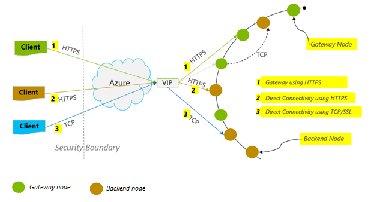

<properties 
    pageTitle="Dicas de desempenho de DocumentDB | Microsoft Azure" 
    description="Aprenda as opções de configuração de cliente para melhorar o desempenho de banco de dados do Azure DocumentDB"
    keywords="como melhorar o desempenho de banco de dados"
    services="documentdb" 
    authors="mimig1" 
    manager="jhubbard" 
    editor="" 
    documentationCenter=""/>

<tags 
    ms.service="documentdb" 
    ms.workload="data-services" 
    ms.tgt_pltfrm="na" 
    ms.devlang="na" 
    ms.topic="article" 
    ms.date="10/17/2016" 
    ms.author="mimig"/>

# Dicas de desempenho para DocumentDB

DocumentDB Azure é um rápida e flexível banco de dados distribuído que se expande perfeitamente com garantia de latência e taxa de transferência. Você não precisa fazer alterações de arquitetura principais ou escrever código complexo para dimensionar seu banco de dados com DocumentDB. Dimensionamento de cima e para baixo é tão fácil quanto fazer uma chamada de API única ou [método SDK chamar](documentdb-performance-levels.md#changing-performance-levels-using-the-net-sdk). No entanto, porque DocumentDB é acessado por meio de chamadas de rede há otimizações do lado do cliente que você pode fazer para obter melhor desempenho.

Portanto, se você estiver fazendo "como pode melhorar meu banco de dados desempenho?" Considere as seguintes opções:

## Rede

1. **Política de Conexão: usar o modo de conexão direta**
    
    Como um cliente se conecta ao Azure DocumentDB tem implicações importantes sobre o desempenho, especialmente em termos de latência observado do lado do cliente. Há duas configurações de configuração de chave disponíveis para configurar a política de Conexão – o *modo* de conexão e o [ *protocolo*de conexão](#connection-protocol)de cliente.  Os dois modos disponíveis são:

    1. Modo de gateway (padrão)
    2. Modo direto

    Como DocumentDB é um sistema de armazenamento distribuído, DocumentDB recursos como coleções são particionados por vários computadores e cada partição é replicada para alta disponibilidade. A tradução de endereço físico lógico é mantido em uma tabela de roteamento, que também está disponível internamente como um recurso.

    No modo de Gateway, as máquinas de gateway DocumentDB executam esse roteamento, permitindo que o código do cliente ser simples e compacto. Um aplicativo cliente emite solicitações para as máquinas de gateway DocumentDB, que traduzem o URI lógico na solicitação para o endereço físico do nó de back-end e encaminham a solicitação adequadamente.  Por outro lado, em modo direto clientes devem manter – e atualizar periodicamente – uma cópia da tabela de roteamento e se conectar diretamente a nós DocumentDB back-end.

    Modo de gateway é suportado em todas as plataformas SDK e é o padrão configurado.  Se seu aplicativo é executado em uma rede corporativa com restrições de firewall estrito, o modo de Gateway é a melhor opção desde que ele usa a porta HTTPS padrão e uma única empresa. A desvantagem de desempenho, no entanto, é que o modo de Gateway envolve um salto de rede adicionais sempre dados é lido ou gravados DocumentDB.   Por isso, o modo direto oferece melhor desempenho devido a menos saltos de rede.

2. **Política de Conexão: usar o protocolo TCP**

    Quando utilizar o modo direto, há duas opções de protocolo disponíveis:

    - TCP
    - HTTPS

    DocumentDB oferece um simples e abra o modelo de programação RESTful por HTTPS. Além disso, ele oferece um protocolo TCP eficiente, que também está RESTful no seu modelo de comunicação e está disponível por meio do cliente do .NET SDK. Direct TCP e HTTPS usar SSL para autenticação inicial e o tráfego de criptografia. Para obter melhor desempenho, use o protocolo TCP quando possível. 

    Ao usar TCP no modo de Gateway, porta TCP 443 é a porta de DocumentDB e 10250 é a porta MongoDB API. Ao usar TCP em modo direto, além das portas do Gateway, você precisará garantir que a porta intervalo entre 10000 e 20000 é aberto porque DocumentDB usa portas TCP dinâmicas. Se essas portas não estão abertas e você tentar usar TCP, você receberá o erro 503 Serviço indisponível. 

    O modo de conectividade está configurado durante a construção da instância DocumentClient com o parâmetro ConnectionPolicy. Se o modo direto for usado, o protocolo também pode ser definido dentro do parâmetro ConnectionPolicy.

        var serviceEndpoint = new Uri("https://contoso.documents.net");
        var authKey = new "your authKey from Azure Mngt Portal";
        DocumentClient client = new DocumentClient(serviceEndpoint, authKey, 
        new ConnectionPolicy
        {
            ConnectionMode = ConnectionMode.Direct,
            ConnectionProtocol = Protocol.Tcp
        });

    Porque TCP só é suportado no modo direto, se o modo de Gateway é usado, o protocolo HTTPS é sempre usado para se comunicar com o Gateway e o valor de protocolo no ConnectionPolicy será ignorado.

    

3. **Chamar OpenAsync para evitar a latência de inicialização na primeira solicitação**

    Por padrão, a primeira solicitação terá uma latência maior porque ela buscar a tabela de roteamento de endereço. Para evitar esse latência de inicialização na primeira solicitação, você deve chamar OpenAsync() uma vez durante a inicialização da seguinte maneira.

        await client.OpenAsync();

4. **Colocar clientes na mesma região Azure para desempenho**

    Quando possível, coloque todos os aplicativos chamar DocumentDB na mesma região do banco de dados de DocumentDB. Para ver uma comparação aproximada, chamadas para DocumentDB dentro da região mesma concluir dentro de 1 e 2 ms, mas a latência entre o oeste e Costa Leste dos EUA for > 50 ms. Essa latência provavelmente pode variar de uma solicitação para solicitar dependendo a rota adotada pela solicitação conforme passa do cliente para o limite de data center Azure. A menor latência possível é alcançada garantindo que o aplicativo de chamada está localizado dentro da mesma região Azure como ponto de extremidade DocumentDB provisionado. Para obter uma lista das regiões disponíveis, consulte [Regiões do Azure](https://azure.microsoft.com/regions/#services).

    

5. **Aumentar o número de threads/tarefas**

    Como chamadas para DocumentDB são feitas através da rede, você talvez precise variar o grau de paralelismo de suas solicitações de forma que o aplicativo cliente gasta muito pouco tempo de espera entre as solicitações. Por exemplo, se você estiver usando. Da líquido [Biblioteca de tarefas paralelas](https://msdn.microsoft.com//library/dd460717.aspx), criar na ordem 100s das tarefas ler ou gravar para DocumentDB.

## Uso SDK

1. **Instalar o SDK mais recente**

    SDK do DocumentDB constantemente estão sendo aperfeiçoado para fornecer o melhor desempenho. Consulte as páginas de [DocumentDB SDK](documentdb-sdk-dotnet.md) para determinar o SDK mais recente e revisar melhorias. 

2. **Usar um cliente de DocumentDB único para o ciclo de vida do seu aplicativo**
  
    Observe que cada instância DocumentClient é thread-safe e executa o gerenciamento de conexão eficiente e endereço cache quando operando no modo direto. Para permitir que o gerenciamento de conexão eficiente e melhor desempenho por DocumentClient, é recomendável usar uma única instância do DocumentClient por AppDomain para o ciclo de vida do aplicativo.

3. **Aumentar System.Net MaxConnections por host**

    Solicitações de DocumentDB são feitas sobre HTTPS/restante por padrão e estão sujeitos ao limite de conexão padrão por nome do host ou o endereço IP. Você talvez precise configurar o MaxConnections para um valor maior (100-1000) para que a biblioteca do cliente pode utilizar várias conexões simultâneas para DocumentDB. No SDK do .NET 1.8.0 acima, o valor padrão para [ServicePointManager.DefaultConnectionLimit](https://msdn.microsoft.com/library/system.net.servicepointmanager.defaultconnectionlimit.aspx) é 50 e para alterar o valor, você pode configurar o [Documents.Client.ConnectionPolicy.MaxConnectionLimit](https://msdn.microsoft.com/en-us/library/azure/microsoft.azure.documents.client.connectionpolicy.maxconnectionlimit.aspx) para um valor mais alto.  

4. **Ajuste consultas em paralelo para conjuntos particionados**

     DocumentDB .NET SDK versão 1.9.0 e acima suporte consultas em paralelo, que permitem uma coleção particionada em paralelo de consulta (consulte [Trabalhando com o SDK do](documentdb-partition-data.md#working-with-the-sdks) e as [amostras de código](https://github.com/Azure/azure-documentdb-dotnet/blob/master/samples/code-samples/Queries/Program.cs) relacionados para obter mais informações). Consultas em paralelo foram projetadas para melhorar a latência da consulta e produtividade sobre seu serial correspondente. Consultas em paralelo fornecem dois parâmetros que os usuários podem ajustar para custom-ajustar seus requisitos, (a) MaxDegreeOfParallelism: controlar o número máximo de partições que podem ser consultados em paralelo e (b) MaxBufferedItemCount: controlar o número de resultados pre-fetched. 
    
    (a) ***ajuste MaxDegreeOfParallelism\: *** 
    paralela consulta works consultando várias partições em paralelo. No entanto, dados de um coletar particionada individual são procurados em série relacionadas com a consulta. Portanto, definindo a MaxDegreeOfParallelism para o número de partições tem a chance de máxima de atingir a maioria dos consulta de alto desempenho, desde que todas as outras condições de sistema permanecem os mesmos. Se você não souber o número de partições, você pode configurar o MaxDegreeOfParallelism para um número alto, e o sistema irá escolher o mínimo (número de partições, entrada fornecidas pelo usuário) como o MaxDegreeOfParallelism. 
    
    É importante observar que consultas em paralelo produzem os benefícios de melhores se os dados são distribuídos uniformemente todas as partições relacionadas com a consulta. Se o conjunto de particionado é particionado forma que todos ou a maioria dos dados retornados por uma consulta é concentrada em alguns partições (uma partição no pior caso), então o desempenho da consulta deve ser afunilado por essas partições. 
    
    (b) ***ajuste MaxBufferedItemCount\: *** 
    consulta paralela foi projetada para buscar previamente resultados enquanto o lote atual de resultados está sendo processado pelo cliente. A busca prévia ajuda no aperfeiçoamento de latência geral de uma consulta. MaxBufferedItemCount é o parâmetro para limitar a quantidade de resultados pre-fetched. Configurar MaxBufferedItemCount para o número de resultados retornados esperado (ou um número maior) permite a consulta para receber o benefício máximo de busca prévia. 
    
    Observe que busca prévia funciona da mesma maneira independentemente o MaxDegreeOfParallelism, e não há um único buffer para os dados de todas as partições.  

5. **Ativar o servidor GC**
    
    Reduzir a frequência de coleta de lixo pode ajudar em alguns casos. No .NET, defina [gcServer](https://msdn.microsoft.com/library/ms229357.aspx) como true.

6. **Implementar retirada em intervalos de RetryAfter**
 
    Durante o teste de desempenho, você deve aumentar a carga até que uma pequena taxa de solicitações de obter limitado. Se limitado, o aplicativo cliente deve retirada na aceleração para o intervalo de repetição de servidor especificado. Respeito a retirada garante que você gasta quantidade mínima de tempo de espera entre as tentativas. O suporte de política de repetição está incluído na versão 1.8.0 e acima da DocumentDB [.NET](documentdb-sdk-dotnet.md) e [Java](documentdb-sdk-java.md)e versão 1.9.0 e acima das [Node](documentdb-sdk-node.md) e [Python](documentdb-sdk-python.md). Para obter mais informações, consulte [limites de produtividade reservada Exceeding](documentdb-request-units.md#exceeding-reserved-throughput-limits) e [RetryAfter](https://msdn.microsoft.com/library/microsoft.azure.documents.documentclientexception.retryafter.aspx).

7. **Dimensionar sua carga de trabalho do cliente**

    Se você estiver testando nos níveis de alta produtividade (> 50.000 RU/s), o aplicativo cliente pode se tornar o gargalo devido a máquina limitar check-out na utilização da CPU ou na rede. Se você chegar neste ponto, você pode continuar a push ainda mais a conta de DocumentDB dimensionando seus aplicativos cliente em vários servidores.

8. **Documento de cache URIs para menor latência de leitura**

    Documento de cache URIs sempre que possível para o melhor desempenho de leitura.

9. **Ajustar o tamanho da página para feeds de consultas/lido para obter melhor desempenho**

    Ao realizar uma massa ler de documentos usando leitura feed funcionalidade (ou seja, ReadDocumentFeedAsync) ou ao emitir uma consulta SQL DocumentDB, os resultados são retornados de maneira segmentada se o conjunto de resultados for muito grande. Por padrão, os resultados são retornados em blocos de 100 itens ou 1 MB, o limite que for atingido primeiro. 

    Para reduzir o número de rede arredondar viagens necessárias para recuperar todos os resultados aplicáveis, você pode aumentar o tamanho de página usando o cabeçalho x-ms-item-contagem máxima solicitação para até 1000. Em casos em que você precisa exibir apenas alguns resultados, por exemplo, se sua API de interface ou aplicativo de usuário retornará apenas 10 resultados vez, também é possível reduzir o tamanho de página para 10 para reduzir a produtividade consumida para leituras e consultas.

    Você também pode definir o tamanho da página usando o SDK do DocumentDB disponíveis.  Por exemplo:
    
        IQueryable<dynamic> authorResults = client.CreateDocumentQuery(documentCollection.SelfLink, "SELECT p.Author FROM Pages p WHERE p.Title = 'About Seattle'", new FeedOptions { MaxItemCount = 1000 });

10. **Aumentar o número de threads/tarefas**

    Consulte [aumentar o número de threads/tarefas](#increase-threads) na seção rede.

## Política de indexação

1. **Use a indexação lenta para proporcionar taxas de inclusão de horário de pico**

    DocumentDB permite que você especifique – no nível do conjunto – uma política de indexação, que permite que você escolha se deseja que os documentos em um conjunto a serem indexados automaticamente ou não.  Além disso, você também pode escolher entre síncrono (consistente) e assíncronas atualizações de índice (Lazy). Por padrão, o índice é atualizado sincronia em cada inserir, substituir ou excluir de um documento para o conjunto. Sincronia modo permite que as consultas aceitar o mesmo [nível de consistência](documentdb-consistency-levels.md) que as leituras de documento sem qualquer atraso de índice "acompanhar".
    
    A indexação lenta poderá ser considerada para cenários em que os dados são gravados em picos, e você quiser amortizar o trabalho necessário para indexar conteúdo por um período de tempo maior. A indexação lenta também permite usar sua produtividade provisionada efetivamente e servir solicitações de gravação em horários de pico com latência mínima. É importante Entretanto, observe que, quando a indexação lenta está habilitada, os resultados da consulta será eventualmente consistentes, independentemente do nível de consistência configurado para a conta de DocumentDB.

    Portanto, modo consistente de indexação (IndexingPolicy.IndexingMode é definido para consistente) provoca o encargo de unidade de solicitação alto por gravação, enquanto Lazy indexação modo (IndexingPolicy.IndexingMode é definido para Lazy) e nenhuma indexação (IndexingPolicy.Automatic é definida como False) têm custo zero indexação no momento da gravação.

2. **Excluir caminhos não utilizados de indexação para gravações mais rápidas**

    Política de indexação do DocumentDB também permite especificar quais caminhos de documento para incluir ou excluir da indexação aproveitando caminhos de indexação (IndexingPolicy.IncludedPaths e IndexingPolicy.ExcludedPaths). O uso de indexação caminhos pode oferecer desempenho aprimorado gravação e armazenamento de índice inferior para cenários em que os padrões de consulta são conhecidos antecipadamente, como custos de indexação estão correlacionados diretamente para o número de caminhos exclusivos indexados.  Por exemplo, o código a seguir mostra como excluir uma seção inteira dos documentos (também conhecido como uma subárvore) de indexação usando a "*" curinga.

        var collection = new DocumentCollection { Id = "excludedPathCollection" };
        collection.IndexingPolicy.IncludedPaths.Add(new IncludedPath { Path = "/*" });
        collection.IndexingPolicy.ExcludedPaths.Add(new ExcludedPath { Path = "/nonIndexedContent/*");
        collection = await client.CreateDocumentCollectionAsync(UriFactory.CreateDatabaseUri("db"), excluded);

    Para obter mais informações, consulte [DocumentDB políticas de indexação](documentdb-indexing-policies.md).

## Taxa de transferência

1. **Meça e ajuste de solicitação de inferior unidades/segundo uso**

    DocumentDB oferece um conjunto sofisticado de operações de banco de dados, incluindo consultas relacionais e hierárquicas com UDFs, procedimentos armazenados e disparadores – todos operando nos documentos em um conjunto de banco de dados. O custo associado a cada uma dessas operações variam de acordo com a CPU, IO e memória necessária para concluir a operação. Em vez de pensar e gerenciamento de recursos de hardware, você pode pensar uma unidade de solicitação (RU) medida única para os recursos necessários para executar várias operações de banco de dados e uma solicitação de aplicativo de serviço.

    [Solicitar unidades](documentdb-request-units.md) são provisionados para cada conta de banco de dados com base no número de unidades de capacidade que você comprar. Consumo de unidade de solicitação é avaliado como uma taxa por segundo. Aplicativos que excedeu a taxa de unidade de solicitação provisionado para sua conta está limitada até que a taxa cai abaixo do nível reservado para a conta. Se seu aplicativo requer um nível de produtividade maior, você pode adquirir unidades de capacidade adicional.

    A complexidade de uma consulta afeta quantas unidades solicitar são consumidas para uma operação. O número de predicados, natureza de predicados, número de UDFs e o tamanho do conjunto de dados de origem todos influenciar o custo das operações de consulta.

    Para medir a sobrecarga de qualquer operação (criar, atualizar ou excluir), inspecionar o cabeçalho x-ms-solicitação-charge (ou a propriedade de RequestCharge equivalente em ResourceResponse<T> ou FeedResponse<T> no SDK do .NET) para medir o número de unidades de solicitação consumida por essas operações.

        // Measure the performance (request units) of writes
        ResourceResponse<Document> response = await client.CreateDocumentAsync(collectionSelfLink, myDocument);
        Console.WriteLine("Insert of document consumed {0} request units", response.RequestCharge);
        // Measure the performance (request units) of queries
        IDocumentQuery<dynamic> queryable = client.CreateDocumentQuery(collectionSelfLink, queryString).AsDocumentQuery();
        while (queryable.HasMoreResults)
             {
                  FeedResponse<dynamic> queryResponse = await queryable.ExecuteNextAsync<dynamic>();
                  Console.WriteLine("Query batch consumed {0} request units", queryResponse.RequestCharge);
             }
        
    A carga de solicitação retornada nesse cabeçalho é uma fração do sua produtividade provisionada (ou seja, 2000 RUs ou segunda). Por exemplo, se a consulta acima retornará 1000 1KB documentos, o custo da operação será 1000. Assim, dentro de um segundo, o servidor honra apenas dois tais solicitações antes de otimização solicitações subsequentes. Para obter mais informações, consulte [unidades de solicitação](documentdb-request-units.md) e a [Calculadora de unidade de solicitação](https://www.documentdb.com/capacityplanner).

2. **Taxa de limitando/solicitação de taxa de alça muito grande**

    Quando um cliente tenta exceder a taxa de transferência reservada para uma conta, não há nenhuma degradação de desempenho no servidor e sem uso de capacidade de produtividade além do nível reservada. O servidor será preventivamente encerrar a solicitação com RequestRateTooLarge (código de status HTTP 429) e retornar o cabeçalho x-ms-Repetir-após-ms indicando a quantidade de tempo, em milissegundos, que o usuário deve aguardar antes de tentar novamente a solicitação.
 
        HTTP Status 429,
        Status Line: RequestRateTooLarge
        x-ms-retry-after-ms :100

    SDK do tudo implicitamente capturar esta resposta respeita o servidor especificado depois de Repetir cabeçalho e repita a solicitação. A menos que sua conta está sendo acessada simultaneamente por vários clientes, a próxima tentativa será bem-sucedida.

    Se você tiver mais de um cliente cumulativa operacional consistentemente acima da taxa de solicitação, a contagem de repetição padrão definida no momento para 9 internamente pelo cliente não pode ser suficiente; Nesse caso, o cliente gera uma DocumentClientException com código de status 429 ao aplicativo. A contagem de repetição padrão pode ser alterada definindo a RetryOptions na instância do ConnectionPolicy. Por padrão, o DocumentClientException com código de status 429 é retornado após um tempo de espera cumulativo de 30 segundos se a solicitação continua a operar acima da taxa de solicitação. Isso ocorre mesmo quando a contagem de repetição atual for menor que a contagem de repetição máx, seja o padrão de 9 ou um valor definido pelo usuário.

    Enquanto o comportamento de repetir automatizada ajuda a melhorar resiliência e usabilidade para a maioria dos aplicativos, ela pode vir oposta ao fazer avaliações de desempenho, especialmente ao medir latência.  A latência observado cliente serão pico se o experimento visitas a aceleração de servidor e faz com que o cliente SDK para repetir silenciosamente. Para evitar picos de latência durante experiências de desempenho, medir o encargo retornado por cada operação e garantir que as solicitações são operando abaixo a taxa de solicitação reservadas. Para obter mais informações, consulte [Solicitar unidades](documentdb-request-units.md).
   
3. **Design para documentos menores para produtividade superior**

    A carga de solicitação (ou seja, o custo de processamento de solicitação) de uma determinada operação é correlacionada diretamente para o tamanho do documento. Operações em documentos grandes custam mais que operações para documentos pequenos.

## Níveis de consistência

1. **Usar níveis de consistência mais fracos para melhores latências de leitura**

    Outro fator importante levar em conta enquanto ajustar o desempenho de aplicativos de DocumentDB é o nível de consistência. A opção de nível de consistência tem implicações de desempenho para leituras e gravações. Você pode configurar o nível de consistência padrão na conta do banco de dados e o nível de consistência escolhido aplica para todas as coleções (em todos os bancos de dados) dentro da conta da DocumentDB. Em termos de operações de gravação, o impacto da alteração de nível de consistência é observado como latência da solicitação. Como os níveis de consistência mais fortes são usados, aumentará latências de gravação. Por outro lado, o impacto de nível de consistência em operações de leitura é observado em termos de produtividade. Mais fraca consistência níveis permitem maiores leia produtividade a ser realizada pelo cliente.

    Por padrão a todas as leituras e consultas emitidas para os recursos definidos pelo usuário usará o nível de consistência padrão especificado na conta do banco de dados. No entanto, você pode diminuir o nível de consistência de uma solicitação de leitura/consulta específica, especificando o cabeçalho x-ms-nível de consistência solicitação. Para obter mais informações, consulte [níveis de consistência em DocumentDB](documentdb-consistency-levels.md).

## Próximas etapas

Para um aplicativo de exemplo usado para avaliar DocumentDB cenários de alto desempenho em alguns computadores cliente, consulte [desempenho e escala de teste com DocumentDB do Azure](documentdb-performance-testing.md).

Para saber mais sobre a criação de seu aplicativo de escala e de alto desempenho, consulte também [particionamento e a escala do Azure DocumentDB](documentdb-partition-data.md).
