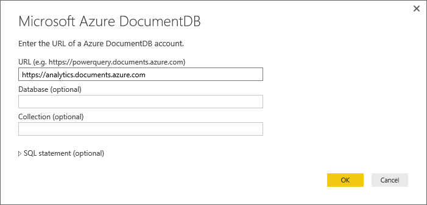
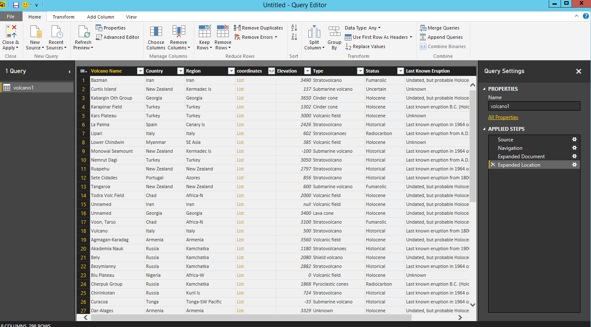
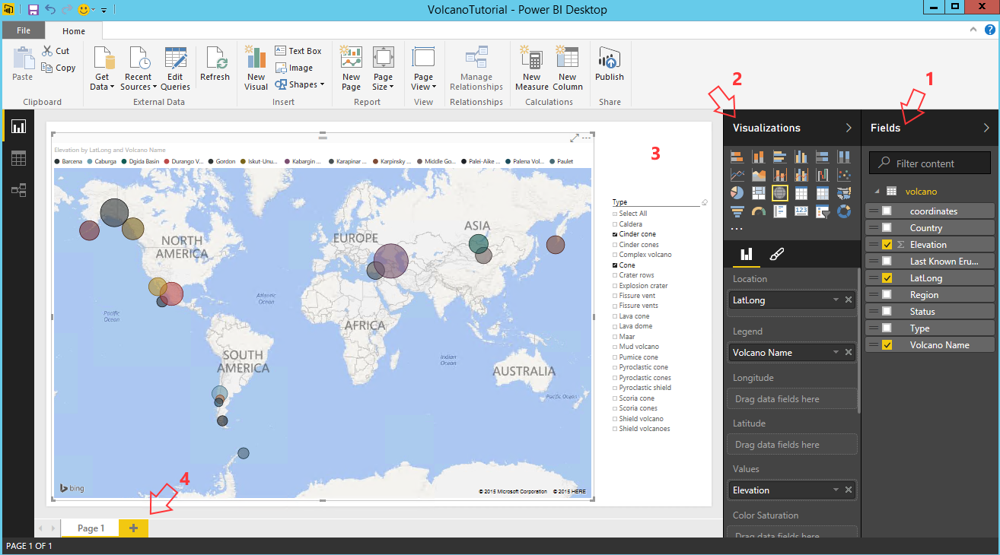

<properties
    pageTitle="Tutorial do Power BI para conector de DocumentDB | Microsoft Azure"
    description="Use este tutorial do Power BI para importar JSON, criar relatórios informativos e visualizar dados utilizando o conector DocumentDB e Power BI."
    keywords="Power bi tutorial, visualizar dados, conector de alimentação de bi"
    services="documentdb"
    authors="h0n"
    manager="jhubbard"
    editor="mimig"
    documentationCenter=""/>

<tags
    ms.service="documentdb"
    ms.workload="data-services"
    ms.tgt_pltfrm="na"
    ms.devlang="na"
    ms.topic="article"
    ms.date="09/22/2016"
    ms.author="hawong"/>

# Tutorial do Power BI para DocumentDB: visualizar dados utilizando o conector de Power BI

[PowerBI.com](https://powerbi.microsoft.com/) é um serviço online, onde você pode criar e compartilhar relatórios e painéis com dados que são importantes para você e sua organização.  Power BI Desktop é uma ferramenta que permite que você recuperar dados de várias fontes de dados, mesclar e transformar os dados, criar poderosas visualizações e relatórios e publicar os relatórios do Power BI de criação de relatórios dedicado.  Com a versão mais recente do Power BI Desktop, agora você pode conectar sua conta DocumentDB por meio do conector DocumentDB Power BI.   

Neste tutorial do Power BI, podemos siga as etapas para conectar-se a uma conta de DocumentDB no Power BI Desktop, navegue para um conjunto onde desejamos extrair os dados usando o navegador, transformar dados JSON em formato tabular usando o Editor de consulta de área de trabalho do Power BI, criar e publicar um relatório PowerBI.com.

Depois de concluir este tutorial do Power BI, você poderá responder às seguintes perguntas:  

-   Como posso criar relatórios com dados de DocumentDB usando o Power BI Desktop?
-   Como posso me conectar a uma conta de DocumentDB na área de trabalho do Power BI?
-   Como pode recuperar dados de uma coleção na área de trabalho do Power BI?
-   Como transformar a dados JSON aninhada na área de trabalho do Power BI?
-   Como publicar e compartilhar meus relatórios no PowerBI.com?

## Pré-requisitos

Antes de seguir as instruções neste tutorial do Power BI, certifique-se de que você tenha o seguinte:

- [A versão mais recente do Power BI Desktop](https://powerbi.microsoft.com/desktop).
- Acesso a nossa demonstração conta ou os dados em sua conta do Azure DocumentDB.
    - A conta de demonstração é preenchida com os dados de vulcões mostrados neste tutorial. Esta conta de demonstração não está ligada por qualquer SLAs e destina-se apenas para demonstração.  Estamos reserva o direito de fazer modificações nesta conta de demonstração, incluindo, mas não limitado a, encerrando a conta, alterar a chave, restringindo o acesso, alterar e excluir os dados, a qualquer momento sem prévio ou motivo.
        - URL: https://analytics.documents.azure.com
        - Chave de somente leitura: MSr6kt7Gn0YRQbjd6RbTnTt7VHc5ohaAFu7osF0HdyQmfR + YhwCH2D2jcczVIR1LNK3nMPNBD31losN7lQ/fkw = =
    - Ou, para criar sua própria conta, consulte [criar uma conta de banco de dados de DocumentDB usando o portal do Azure](https://azure.microsoft.com/documentation/articles/documentdb-create-account/). Em seguida, para obter vulcões de amostra dados que seja parecidos com o que são usados neste tutorial (mas não contiver os blocos de GeoJSON), consulte o [site NOAA](https://www.ngdc.noaa.gov/nndc/struts/form?t=102557&s=5&d=5) e importe os dados usando a [ferramenta de migração de dados de DocumentDB](https://azure.microsoft.com/documentation/articles/documentdb-import-data/).

Para compartilhar seus relatórios no PowerBI.com, você deve ter uma conta na PowerBI.com.  Para saber mais sobre o Power BI para gratuitos e Power BI Pro, visite [https://powerbi.microsoft.com/pricing](https://powerbi.microsoft.com/pricing).

## Vamos começar
Neste tutorial, vamos imaginar que você é um geologist estudar basquete em todo o mundo.  Os dados de vulcões são armazenados em uma conta de DocumentDB e os documentos JSON veja como o mostrado abaixo.

    {
        "Volcano Name": "Rainier",
        "Country": "United States",
        "Region": "US-Washington",
        "Location": {
            "type": "Point",
            "coordinates": [
            -121.758,
            46.87
            ]
        },
        "Elevation": 4392,
        "Type": "Stratovolcano",
        "Status": "Dendrochronology",
        "Last Known Eruption": "Last known eruption from 1800-1899, inclusive"
    }

Você deseja recuperar os dados de vulcões da conta DocumentDB e visualizar dados em um relatório do Power BI interativo como o exibido abaixo.

Pronto para experimentar? Então vamos começar.

1. Execute o Power BI Desktop na estação de trabalho.
2. Depois de Power BI Desktop for iniciado, uma tela de *boas-vindas* é exibida.

    

3. Você pode **Obter dados**, consulte **Fontes recentes**ou **Abrir outros relatórios** diretamente na tela de *boas-vindas* .  Clique no X no canto superior direito para fechar a tela. O modo de exibição de **relatório** do Power BI Desktop é exibido.

    

4. Selecione a **página inicial** da faixa de opções, clique em **Obter dados**.  A janela de **Obter dados** deverá aparecer.

5. Clique no **Azure**, selecione **Microsoft Azure DocumentDB (Beta)**e clique em **Conectar**.  Janela do **Microsoft Azure DocumentDB Connect** deverá aparecer.

    

6. Especifique a URL de ponto de extremidade de conta DocumentDB que você gostaria de recuperar os dados conforme mostrado abaixo e, em seguida, clique em **Okey**. Você pode recuperar a URL na caixa de URI na lâmina **[teclas](documentdb-manage-account.md#keys)** do portal do Azure ou você pode usar a conta de demonstração, caso em que a URL é `https://analytics.documents.azure.com`. 

    Deixe o nome do banco de dados, nome da coleção e instrução SQL em branco como esses campos são opcionais.  Em vez disso, usaremos o navegador para selecionar o banco de dados e a coleção para identificar onde os dados oriundos.

    

7. Se você estiver se conectando a esse ponto de extremidade pela primeira vez, você será solicitado para a chave de conta.  Você pode recuperar a chave na caixa **Chave primária** na lâmina **[chaves somente leitura](documentdb-manage-account.md#keys)** do portal do Azure, ou você pode usar a conta de demonstração, nesse caso a chave é `RcEBrRI2xVnlWheejXncHId6QRcKdCGQSW6uSUEgroYBWVnujW3YWvgiG2ePZ0P0TppsrMgscoxsO7cf6mOpcA==`. Insira a chave da conta e clique em **Conectar**.

    Recomendamos que você use a tecla de somente leitura quando a criação de relatórios.  Isso impedirá exposição desnecessária da chave mestra a possíveis riscos de segurança. A chave de somente leitura está disponível da lâmina [teclas](documentdb-manage-account.md#keys) do portal do Azure ou você pode usar as informações de conta de demonstração fornecidas acima.

    

8. Quando a conta estiver conectada com êxito, o **navegador** será exibida.  O **navegador** mostrará uma lista de bancos de dados com a conta.
9. Clique e expanda no banco de dados onde os dados para o relatório serão vêm, se você estiver usando a conta de demonstração, selecione **volcanodb**.   

10. Agora, selecione um conjunto que você irá recuperar os dados de. Se você estiver usando a conta de demonstração, selecione **volcano1**.

    O painel de visualização mostra uma lista de itens de **registro** .  Um documento é representado por um tipo de **registro** no Power BI. Da mesma forma, um bloco JSON aninhado dentro de um documento também é um **registro**.

    

11. Clique em **Editar** para iniciar o Editor de consulta para nós pode transformar os dados.

## Nivelamento e transformar documentos JSON
1. No Editor de consulta de BI do Power, você deve ver uma coluna de **documento** no painel central.

2. Clique na expansão situado à direita do cabeçalho da coluna de **documento** .  Menu de contexto com uma lista de campos aparecerão.  Selecione os campos que necessários para o relatório, por exemplo, vulcões nome, país, região, local, elevação, tipo, Status e último jogo de saber, e clique em **Okey**.

    

3. O painel central será exibida uma visualização do resultado com os campos selecionados.

    

4. Em nosso exemplo, a propriedade de localização é um bloco de GeoJSON em um documento.  Como você pode ver, o local é representado por um tipo de **registro** na área de trabalho do Power BI.  
5. Clique na expansão situado à direita do cabeçalho da coluna local.  Menu de contexto com campos tipo e coordenadas aparecerão.  Vamos selecionar o campo coordenadas e clique em **Okey**.

    

6. Agora, o painel central mostra uma coluna de coordenadas do tipo de **lista** .  Como mostrado no início do tutorial, os dados GeoJSON neste tutorial são do tipo de ponto com valores de Latitude e Longitude gravados na matriz coordenadas.

    O elemento de coordenadas [0] representa Longitude enquanto coordenadas [1] representa Latitude.
    

7. Para nivelar a matriz de coordenadas, vamos criar uma **Coluna personalizada** chamada LatLong.  Selecione a faixa de opções de **Adicionar coluna** e clique em **Adicionar coluna personalizada**.  A janela **Adicionar coluna personalizada** deve aparecer.

8. Forneça um nome para a nova coluna, por exemplo, LatLong.

9. Em seguida, especifique a fórmula personalizada para a nova coluna.  Para nosso exemplo, podemos irá concatenar os valores de Latitude e Longitude separados por vírgula, conforme mostrado abaixo usando a seguinte fórmula: `Text.From([Document.Location.coordinates]{1})&","&Text.From([Document.Location.coordinates]{0})`. Clique em **Okey**.

    Para obter mais informações sobre expressões DAX (Data Analysis) incluindo funções DAX, visite [Básicas de DAX no Power BI Desktop](https://support.powerbi.com/knowledgebase/articles/554619-dax-basics-in-power-bi-desktop).

    

10. Agora, o painel central mostrará a nova coluna de LatLong preenchida com os valores de Latitude e Longitude separados por uma vírgula.

    

    Se você receber um erro na nova coluna, certifique-se de que as etapas aplicadas em configurações de consulta correspondem a figura a seguir:

    

    Se as etapas forem diferentes, exclua as outras etapas e tente adicionar a coluna personalizada novamente. 

11. Agora, podemos concluiu nivelamento os dados em formato tabular.  Você pode aproveitar todos os recursos disponíveis no Editor de consultas a forma e transformar os dados no DocumentDB.  Se você estiver usando o exemplo, altere o tipo de dados para elevação para **número inteiro** alterando o **Tipo de dados** na faixa **Home** .

    

12. Clique em **Fechar e em Aplicar** para salvar o modelo de dados.

    

## Criar relatórios
Modo de exibição do Power BI Desktop relatório é onde você pode começar a criar relatórios para visualizar dados.  Você pode criar relatórios arrastando e soltando campos em tela de **relatório** .

No modo de exibição relatório, você deve encontrar:

 1. Painel **campos** , isso é onde você verá uma lista de modelos de dados com os campos que você pode usar para seus relatórios.

 2. O painel de **visualizações** . Um relatório pode conter uma única ou várias visualizações.  Selecione os tipos de visual atende às suas necessidades do painel **visualizações** .

 3. A tela de **relatório** , isso é onde você criará os elementos visuais para o seu relatório.

 4. A página de **relatório** . Você pode adicionar várias páginas de relatório no Power BI Desktop.

A seguir mostra as etapas básicas de criação de um relatório de modo de exibição de mapa interativo simples.

1. Para nosso exemplo, vamos criar um modo de exibição de mapa mostrando o local de cada vulcões.  No painel de **visualizações** , clique no tipo de visual de mapa conforme realçado na captura de tela acima.  Você deve ver visual tipo de mapa de pintura na tela de **relatório** .  O painel de **visualização** também deve exibir um conjunto de propriedades relacionadas ao tipo de mapa visual.

2. Agora, arraste e solte o campo LatLong do painel de **campos** para a propriedade de **localização** no painel de **visualizações** .
3. Em seguida, arraste e solte o campo vulcões nome para a propriedade de **legenda** .  

4. Em seguida, arraste e solte o campo elevação para a propriedade de **tamanho** .  

5. Agora você deve ver o mapa visual mostrando um conjunto de bolhas que indica o local de cada vulcões com o tamanho da bolha correlação para a elevação de vulcões.

6. Agora que você tiver criado um relatório básico.  Você pode personalizar ainda mais o relatório adicionando mais visualizações.  Em nosso caso, adicionamos uma segmentação de dados de tipo de vulcões para tornar o relatório interativo.  

    

## Publicar e compartilhar seu relatório
Para compartilhar seu relatório, você deve ter uma conta na PowerBI.com.

1. Na área de trabalho do Power BI, clique na faixa **Home** .
2. Clique em **Publicar**.  Você será solicitado a inserir o nome de usuário e senha para sua conta de PowerBI.com.
3. Depois que a credencial foi autenticada, o relatório é publicado no seu destino selecionado.
4. Clique em **Abrir 'PowerBITutorial.pbix' no Power BI** para ver e compartilhar seu relatório em PowerBI.com.

    

## Criar um painel em PowerBI.com

Agora que você tem um relatório, permite compartilhá-lo no PowerBI.com

Quando você publica seu relatório do Power BI Desktop para PowerBI.com, ele gera um **relatório** e um **conjunto de dados** em seu locatário PowerBI.com. Por exemplo, depois que você publicou um relatório chamado **PowerBITutorial** para PowerBI.com, você verá PowerBITutorial nas seções os **relatórios** e os **conjuntos de dados** em PowerBI.com.

   

Para criar um painel compartilhados e, clique no botão **Fixar Live página** em seu relatório de PowerBI.com.

   

Siga as instruções em [um bloco de um relatório do Pin](https://powerbi.microsoft.com/documentation/powerbi-service-pin-a-tile-to-a-dashboard-from-a-report/#pin-a-tile-from-a-report) para criar um novo painel. 

Você também pode fazer modificações ad hoc ao relatório antes de criar um painel. No entanto, é recomendável que você use o Power BI Desktop para executar as modificações e republicar o relatório PowerBI.com.

## Atualizar dados em PowerBI.com

Há duas maneiras de atualizar os dados, ad hoc e agendados.

Para uma atualização ad-hoc, basta clicar nas eclipses (…) por **conjunto de dados**, por exemplo, PowerBITutorial. Você verá uma lista de ações, incluindo **Atualizar agora**. Clique em **Atualizar agora** para atualizar os dados.

Uma atualização agendada, faça o seguinte.

1. Clique em **Atualização programada** na lista ação. 
    

2. Na página **configurações** , expanda **as credenciais de fonte de dados**. 

3. Clique em **Editar credenciais**. 

    Configurar pop-up é exibida. 

4. Insira a chave para se conectar à conta DocumentDB para esse conjunto de dados, clique em **entrar**. 

5. Expanda a **Programação de atualização** e configurar a agenda que você deseja atualizar o dataset. 
  
6. Clique em **Aplicar** e terminar de configurar a atualização agendada.

## Próximas etapas
- Para saber mais sobre o Power BI, consulte [Introdução ao Power BI](https://powerbi.microsoft.com/documentation/powerbi-service-get-started/).
- Para saber mais sobre DocumentDB, consulte a [documentação de DocumentDB página inicial](https://azure.microsoft.com/documentation/services/documentdb/).
