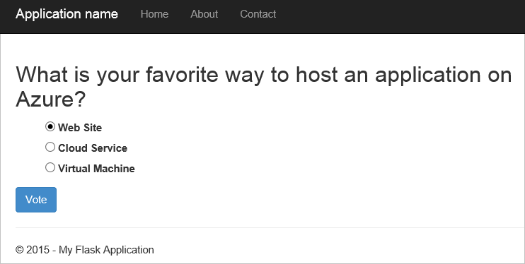
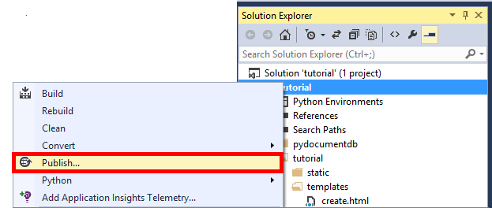
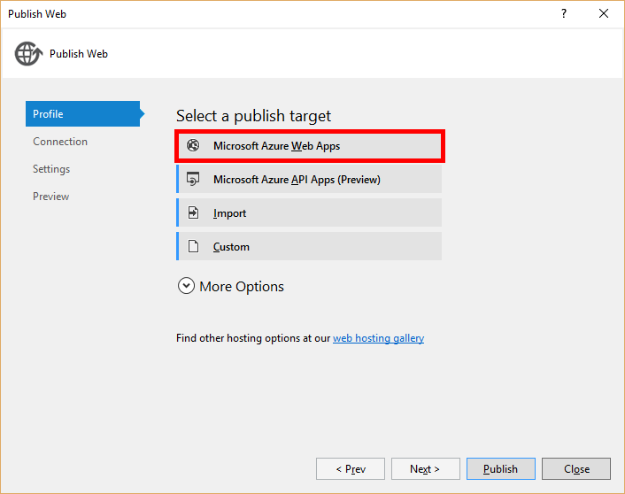
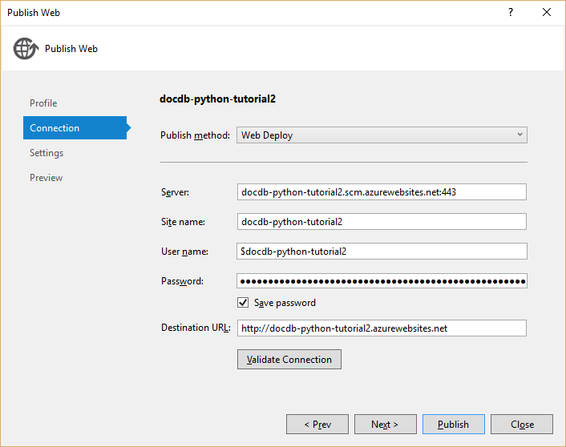

<properties
    pageTitle="Python Flask desenvolvimento de aplicativos Web com DocumentDB | Microsoft Azure"
    description="Examine um tutorial de banco de dados usando DocumentDB para armazenar e acessar dados de um aplicativo da web de Python Flask hospedado no Azure. Encontre soluções de desenvolvimento de aplicativos." 
    keywords="Desenvolvimento de aplicativos, tutorial do banco de dados, flask python, aplicativo web do python, desenvolvimento de web python, documentdb, azure, do Microsoft azure"
    services="documentdb"
    documentationCenter="python"
    authors="syamkmsft"
    manager="jhubbard"
    editor="cgronlun"/>

<tags
    ms.service="documentdb"
    ms.workload="data-management"
    ms.tgt_pltfrm="na"
    ms.devlang="python"
    ms.topic="hero-article"
    ms.date="08/25/2016"
    ms.author="syamk"/>

# <a name="python-flask-web-application-development-with-documentdb"></a>Python Flask desenvolvimento de aplicativos Web com DocumentDB

> [AZURE.SELECTOR]
- [.NET](documentdb-dotnet-application.md)
- [Node](documentdb-nodejs-application.md)
- [Java](documentdb-java-application.md)
- [Python](documentdb-python-application.md)

Este tutorial mostra como usar o Azure DocumentDB para armazenar e acessar dados de um Python aplicativo hospedado no Azure web e presume que você tenha alguma experiência anterior usando Python e sites Azure.

Este tutorial de banco de dados abrange:

1. Criando e uma conta de DocumentDB de provisionamento.
2. Criando um aplicativo MVC Python.
3. Conectando ao e usando o Azure DocumentDB de seu aplicativo web.
4. Implantando o aplicativo web aos sites do Azure.

Seguindo este tutorial, você criará um aplicativo de votação simples que permite que você votar por uma votação.


## <a name="database-tutorial-prerequisites"></a>Pré-requisitos tutoriais do banco de dados

Antes de seguir as instruções neste artigo, você deve garantir que você tenha o seguinte instalado:

- Uma conta do Azure active. Se você não tiver uma conta, você pode criar uma conta de avaliação gratuita em apenas alguns minutos. Para obter detalhes, consulte [Avaliação gratuita do Azure](https://azure.microsoft.com/pricing/free-trial/).
- [Visual Studio 2013](http://www.visualstudio.com/) ou superior, ou [Visual Studio Express](), que é a versão gratuita. As instruções neste tutorial são escritas especificamente para Visual Studio 2015. 
- Ferramentas de Python para Visual Studio do [GitHub](http://microsoft.github.io/PTVS/). Este tutorial usa ferramentas de Python de 2015 VS. 
- Azure SDK de Python para Visual Studio, versão 2,4 ou superior disponível em [azure.com](https://azure.microsoft.com/downloads/). Usamos o SDK do Microsoft Azure para 2.7 Python.
- Python 2.7 de [python.org][2]. Usamos Python 2.7.11. 

> [AZURE.IMPORTANT] Se você estiver instalando Python 2.7 pela primeira vez, certifique-se de que a tela Personalizar Python 2.7.11, selecione **Adicionar python.exe ao caminho**.
> 
>    

- Compilador do Microsoft Visual C++ para Python 2.7 no [Centro de Download da Microsoft]de[3].

## <a name="step-1-create-a-documentdb-database-account"></a>Etapa 1: Criar uma conta de banco de dados de DocumentDB

Vamos começar criando uma conta de DocumentDB. Se você já tiver uma conta, você pode pular para [etapa 2: criar um novo aplicativo web Python Flask](#step-2:-create-a-new-python-flask-web-application).

[AZURE.INCLUDE [documentdb-create-dbaccount](../../includes/documentdb-create-dbaccount.md)]

<br/>
Agora vamos percorrer como criar um novo aplicativo web Python Flask desde o início para cima.

## <a name="step-2-create-a-new-python-flask-web-application"></a>Etapa 2: Criar um novo aplicativo web Python Flask

1. No Visual Studio, no menu **arquivo** , aponte para **novo**e, em seguida, clique em **projeto**.

    A caixa de diálogo **Novo projeto** aparece.

2. No painel esquerdo, expanda **modelos** e **Python**e, em seguida, clique em **Web**. 

3. Selecione o **Projeto de Web Flask** no painel central, em seguida, no **nome da** caixa tipo **tutorial**e clique em **Okey**. Lembre-se de que os nomes de pacote de Python devem ser todas minúsculos, conforme descrito no [Guia de estilo de código Python](https://www.python.org/dev/peps/pep-0008/#package-and-module-names).

    Para aqueles que conhece Python Flask, é uma estrutura de desenvolvimento de aplicativo da web que ajuda você a criar aplicativos web no Python com mais rapidez.

    

4. Na janela **Ferramentas de Python para Visual Studio** , clique em **instalação em um ambiente virtual**. 

    

5. Na janela **Adicionar ambiente Virtual** , você pode aceitar os padrões e usar Python 2.7 como o ambiente base porque PyDocumentDB não suportamos Python 3. x e, em seguida, clique em **criar**. Isso configura o ambiente virtual Python necessário para o seu projeto.

    

    A janela de saída exibe `Successfully installed Flask-0.10.1 Jinja2-2.8 MarkupSafe-0.23 Werkzeug-0.11.5 itsdangerous-0.24 'requirements.txt' was installed successfully.` quando o ambiente está instalado com êxito.

## <a name="step-3-modify-the-python-flask-web-application"></a>Etapa 3: Modificar o aplicativo da web de Python Flask

### <a name="add-the-python-flask-packages-to-your-project"></a>Adicione os pacotes de Python Flask ao seu projeto

Depois de configurar o seu projeto, você precisará adicionar os pacotes de Flask necessários ao seu projeto, incluindo pydocumentdb, o pacote de Python para DocumentDB.

1. No Solution Explorer, abra o arquivo chamado **requirements.txt** e substitua o conteúdo com o seguinte:

        flask==0.9
        flask-mail==0.7.6
        sqlalchemy==0.7.9
        flask-sqlalchemy==0.16
        sqlalchemy-migrate==0.7.2
        flask-whooshalchemy==0.55a
        flask-wtf==0.8.4
        pytz==2013b
        flask-babel==0.8
        flup
        pydocumentdb>=1.0.0

2. Salve o arquivo de **requirements.txt** . 
3. No Solution Explorer, clique com botão direito **env** e clique em **instalar a partir de requirements.txt**.

    

    Após a instalação bem-sucedida, a janela de saída exibe o seguinte:

        Successfully installed Babel-2.3.2 Tempita-0.5.2 WTForms-2.1 Whoosh-2.7.4 blinker-1.4 decorator-4.0.9 flask-0.9 flask-babel-0.8 flask-mail-0.7.6 flask-sqlalchemy-0.16 flask-whooshalchemy-0.55a0 flask-wtf-0.8.4 flup-1.0.2 pydocumentdb-1.6.1 pytz-2013b0 speaklater-1.3 sqlalchemy-0.7.9 sqlalchemy-migrate-0.7.2

    > [AZURE.NOTE] Em casos raros, você poderá ver uma falha na janela de saída. Se isso acontecer, verifique se o erro está relacionado a limpeza. Às vezes, a limpeza falha, mas a instalação ainda será bem-sucedida (rolar para cima na janela de saída para verificar isso). Você pode verificar sua instalação verificando [o ambiente virtual](#verify-the-virtual-environment). Se a instalação falhou, mas a verificação for bem-sucedida, é Okey para continuar.

### <a name="verify-the-virtual-environment"></a>Verificar o ambiente virtual

Vamos, certifique-se de que tudo seja instalado corretamente.

1. Criar a solução pressionando **Ctrl**+**Shift**+**B**.
2. Depois que a compilação estiver concluído, inicie o site pressionando **F5**. Isso inicia o servidor de desenvolvimento Flask e inicia seu navegador da web. Você verá a página seguinte.

    

3. Parar a depuração do site pressionando **Shift**+**F5** no Visual Studio.

### <a name="create-database-collection-and-document-definitions"></a>Criar definições de documento, conjunto e banco de dados

Agora vamos criar seu aplicativo votação adicionando novos arquivos e atualizando outras pessoas.

1. No Solution Explorer, clique com botão direito do projeto **tutorial** , clique em **Adicionar**e, em seguida, clique em **Novo Item**. Selecione o **Arquivo Python vazio** e nomeie o arquivo **forms.py**.  
2. Adicione o seguinte código para o arquivo de forms.py e salve o arquivo.

```python
from flask.ext.wtf import Form
from wtforms import RadioField

class VoteForm(Form):
    deploy_preference  = RadioField('Deployment Preference', choices=[
        ('Web Site', 'Web Site'),
        ('Cloud Service', 'Cloud Service'),
        ('Virtual Machine', 'Virtual Machine')], default='Web Site')
```


### <a name="add-the-required-imports-to-viewspy"></a>Adicione as importações necessárias para views.py

1. No Solution Explorer, expanda a pasta **tutorial** e abra o arquivo **views.py** . 
2. Adicione o seguinte importar demonstrativos na parte superior do arquivo **views.py** , em seguida, salve o arquivo. Esses importar PythonSDK do DocumentDB e os pacotes de Flask.

    ```python
    from forms import VoteForm
    import config
    import pydocumentdb.document_client as document_client
    ```


### <a name="create-database-collection-and-document"></a>Criar o banco de dados, conjunto e documento

- Ainda no **views.py**, adicione o seguinte código para o final do arquivo. Isso cuida da criação de banco de dados usado pelo formulário. Não exclua qualquer uma do código existente no **views.py**. Simplesmente anexá-lo para o final.

```python
@app.route('/create')
def create():
    """Renders the contact page."""
    client = document_client.DocumentClient(config.DOCUMENTDB_HOST, {'masterKey': config.DOCUMENTDB_KEY})

    # Attempt to delete the database.  This allows this to be used to recreate as well as create
    try:
        db = next((data for data in client.ReadDatabases() if data['id'] == config.DOCUMENTDB_DATABASE))
        client.DeleteDatabase(db['_self'])
    except:
        pass

    # Create database
    db = client.CreateDatabase({ 'id': config.DOCUMENTDB_DATABASE })

    # Create collection
    collection = client.CreateCollection(db['_self'],{ 'id': config.DOCUMENTDB_COLLECTION })

    # Create document
    document = client.CreateDocument(collection['_self'],
        { 'id': config.DOCUMENTDB_DOCUMENT,
          'Web Site': 0,
          'Cloud Service': 0,
          'Virtual Machine': 0,
          'name': config.DOCUMENTDB_DOCUMENT 
        })

    return render_template(
       'create.html',
        title='Create Page',
        year=datetime.now().year,
        message='You just created a new database, collection, and document.  Your old votes have been deleted')
```

> [AZURE.TIP] O método **CreateCollection** leva um opcional **RequestOptions** como o terceiro parâmetro. Isso pode ser usado para especificar o tipo de oferta para o conjunto. Se nenhum valor de offerType é fornecido, então o conjunto será criado usando o tipo de oferta padrão. Para obter mais informações sobre tipos de oferecer DocumentDB, consulte [níveis de desempenho em DocumentDB](documentdb-performance-levels.md).


### <a name="read-database-collection-document-and-submit-form"></a>Leia o banco de dados, o conjunto, o documento e submeter o formulário

- Ainda no **views.py**, adicione o seguinte código para o final do arquivo. Isso cuida da configuração de formulário, o banco de dados, conjunto e documento de leitura. Não exclua qualquer uma do código existente no **views.py**. Simplesmente anexá-lo para o final.

```python
@app.route('/vote', methods=['GET', 'POST'])
def vote(): 
    form = VoteForm()
    replaced_document ={}
    if form.validate_on_submit(): # is user submitted vote  
        client = document_client.DocumentClient(config.DOCUMENTDB_HOST, {'masterKey': config.DOCUMENTDB_KEY})

        # Read databases and take first since id should not be duplicated.
        db = next((data for data in client.ReadDatabases() if data['id'] == config.DOCUMENTDB_DATABASE))

        # Read collections and take first since id should not be duplicated.
        coll = next((coll for coll in client.ReadCollections(db['_self']) if coll['id'] == config.DOCUMENTDB_COLLECTION))

        # Read documents and take first since id should not be duplicated.
        doc = next((doc for doc in client.ReadDocuments(coll['_self']) if doc['id'] == config.DOCUMENTDB_DOCUMENT))

        # Take the data from the deploy_preference and increment our database
        doc[form.deploy_preference.data] = doc[form.deploy_preference.data] + 1
        replaced_document = client.ReplaceDocument(doc['_self'], doc)

        # Create a model to pass to results.html
        class VoteObject:
            choices = dict()
            total_votes = 0

        vote_object = VoteObject()
        vote_object.choices = {
            "Web Site" : doc['Web Site'],
            "Cloud Service" : doc['Cloud Service'],
            "Virtual Machine" : doc['Virtual Machine']
        }
        vote_object.total_votes = sum(vote_object.choices.values())

        return render_template(
            'results.html', 
            year=datetime.now().year, 
            vote_object = vote_object)

    else :
        return render_template(
            'vote.html', 
            title = 'Vote',
            year=datetime.now().year,
            form = form)
```


### <a name="create-the-html-files"></a>Criar os arquivos HTML

1. No Solution Explorer, na pasta **tutorial** , clique com botão direito na pasta **modelos** , clique em **Adicionar**e, em seguida, clique em **Novo Item**. 
2. Selecione a **Página HTML**e, em seguida, na caixa Nome, digite **create.html**. 
3. Repita as etapas 1 e 2 para criar dois arquivos HTML adicionais: results.html e vote.html.
4. Adicione o seguinte código para **create.html** no `<body>` elemento. Ele exibe uma mensagem informando que criamos um novo banco de dados, conjunto e documento.

    ```html
    
    
    <h2>{{ title }}.</h2>
    <h3>{{ message }}</h3>
    <p><a href="{{ url_for('vote') }}" class="btn btn-primary btn-large">Vote &raquo;</a></p>
    
    ```

5. Adicione o seguinte código para **results.html** no `<body`> elemento. Ele exibe os resultados da pesquisa.

    ```html
    
    
    <h2>Results of the vote</h2>
        <br />
        
    
    <div class="row">
        <div class="col-sm-5">{{choice}}</div>
            <div class="col-sm-5">
                <div class="progress">
                    <div class="progress-bar" role="progressbar" aria-valuenow="{{vote_object.choices[choice]}}" aria-valuemin="0" aria-valuemax="{{vote_object.total_votes}}" style="width: {{(vote_object.choices[choice]/vote_object.total_votes)*100}}%;">
                                {{vote_object.choices[choice]}}
                </div>
            </div>
            </div>
    </div>
    
    
    <br />
    <a class="btn btn-primary" href="{{ url_for('vote') }}">Vote again?</a>
    
    ```

6. Adicione o seguinte código para **vote.html** no `<body`> elemento. Exibe a votação e aceita os votos. Sobre como registrar os votos, o controle é passado para views.py onde estamos reconhecerá a conversão de voto e anexar o documento de forma adequada.

    ```html
    
    
    <h2>What is your favorite way to host an application on Azure?</h2>
    <form action="" method="post" name="vote">
        {{form.hidden_tag()}}
            {{form.deploy_preference}}
            <button class="btn btn-primary" type="submit">Vote</button>
    </form>
    
    ```

7. Na pasta **modelos** , substitua o conteúdo de **index** seguinte. Isso serve como a página inicial para seu aplicativo.
    
    ```html
    
    
    <h2>Python + DocumentDB Voting Application.</h2>
    <h3>This is a sample DocumentDB voting application using PyDocumentDB</h3>
    <p><a href="{{ url_for('create') }}" class="btn btn-primary btn-large">Create/Clear the Voting Database &raquo;</a></p>
    <p><a href="{{ url_for('vote') }}" class="btn btn-primary btn-large">Vote &raquo;</a></p>
    
    ```

### <a name="add-a-configuration-file-and-change-the-initpy"></a>Adicionar um arquivo de configuração e alterar o \_ \_inicial\_\_.py

1. No Solution Explorer, clique com botão direito do projeto **tutorial** , clique em **Adicionar**, clique em **Novo Item**, selecione **Arquivo Python vazio**e nomeie o arquivo **config.py**. Este arquivo de configuração é exigido por formulários no Flask. Você pode usá-lo para fornecer uma chave secreta também. Esta chave não é necessária para este tutorial apesar.

2. Adicione o seguinte código para config.py, você precisará alterar os valores das **DOCUMENTDB\_HOST** e **DOCUMENTDB\_chave** na próxima etapa.

    ```python
    CSRF_ENABLED = True
    SECRET_KEY = 'you-will-never-guess'
    
    DOCUMENTDB_HOST = 'https://YOUR_DOCUMENTDB_NAME.documents.azure.com:443/'
    DOCUMENTDB_KEY = 'YOUR_SECRET_KEY_ENDING_IN_=='
    
    DOCUMENTDB_DATABASE = 'voting database'
    DOCUMENTDB_COLLECTION = 'voting collection'
    DOCUMENTDB_DOCUMENT = 'voting document'
    ```

3. No [portal do Azure](https://portal.azure.com/), navegue até a lâmina de **chaves** clicando em **Procurar**, **DocumentDB contas**, clique duas vezes no nome da conta para usar e clique no botão de **teclas** na área **Essentials** . Na lâmina **chaves** , copie o valor **URI** e cole o arquivo de **config.py** , como o valor para o **DOCUMENTDB\_HOST** propriedade. 
4. Voltar no portal do Azure, na lâmina **chaves** , copie o valor da **Chave primária** ou a **Chave secundária**e cole o arquivo de **config.py** , como o valor para o **DOCUMENTDB\_chave** propriedade.
5. No ** \_ \_inicial\_\_.py** arquivo, adicione a seguinte linha. 

        app.config.from_object('config')

    Para que o conteúdo do arquivo é:

    ```python
    from flask import Flask
    app = Flask(__name__)
    app.config.from_object('config')
    import tutorial.views
    ```

6. Depois de adicionar todos os arquivos, Solution Explorer deve ficar assim:

    


## <a name="step-4-run-your-web-application-locally"></a>Etapa 4: Executar o aplicativo da web localmente

1. Criar a solução pressionando **Ctrl**+**Shift**+**B**.
2. Depois que a compilação estiver concluído, inicie o site pressionando **F5**. Você verá o seguinte na sua tela.

    

3. Clique em **Criar/desmarca o banco de dados de votação** para gerar o banco de dados.

    

4. Em seguida, clique em **voto** e selecione a opção desejada.

    

5. Para cada voto que você converter, ele é incrementado o contador apropriado.

    

6. Pare depuração do projeto pressionando Shift + F5.

## <a name="step-5-deploy-the-web-application-to-azure-websites"></a>Etapa 5: Implantar o aplicativo web aos sites do Azure

Agora que você tem o aplicativo completo funcionando corretamente contra DocumentDB, vamos de implantá-la para sites do Azure.

1. Clique com botão direito do projeto no Solution Explorer (certificar-se de que você não estiver ainda executá-lo localmente) e selecione **Publicar**.  

    

2. Na janela **Publicar Web** , selecione **Microsoft Azure Web Apps**e, em seguida, clique em **Avançar**.

    

3. Na janela da **Janela de aplicativos do Microsoft Azure da Web** , clique em **novo**.

    

4. Na janela **Criar site no Microsoft Azure** , digite um **nome de aplicativo da Web**, **plano de serviço de aplicativo**, **grupo de recursos**e **região**, clique em **criar**.

    

5. Na janela **Publicar Web** , clique em **Publicar**.

    

3. Em alguns segundos, o Visual Studio irá concluir a publicação de seu aplicativo da web e iniciar um navegador onde você pode ver seu trabalho prático em execução no Azure!

## <a name="troubleshooting"></a>Solução de problemas

Se esse for o primeiro aplicativo de Python que você já tiver executado em seu computador, certifique-se de que as seguintes pastas (ou os locais de instalação equivalente) estão incluídos na sua variável de caminho:

    C:\Python27\site-packages;C:\Python27\;C:\Python27\Scripts;

Se você receber um erro na sua página de voto e você nomeado seu projeto algo diferente de **tutorial**, verifique se ** \_ \_inicial\_\_.py** referencia o nome de projeto correto na linha: `import tutorial.view`.

## <a name="next-steps"></a>Próximas etapas

Parabéns! Apenas você tiver concluído seu primeiro aplicativo da web de Python usando DocumentDB do Azure e publicá-lo para sites do Azure.

Podemos atualizar e melhorar este tópico frequentemente com base nos seus comentários.  Depois que você concluiu o tutorial, por favor, usando os botões de votação na parte superior e inferior desta página e certifique-se de incluir seus comentários sobre o que você deseja ver aprimorada. Se você quiser que contatemos você diretamente, fique à vontade para incluir seu endereço de email em seus comentários.

Para adicionar funcionalidade adicional ao seu aplicativo da web, examine as APIs disponíveis no [SDK do Python DocumentDB](documentdb-sdk-python.md).

Para obter mais informações sobre o Azure, Visual Studio e Python, consulte o [Python Developer Center](https://azure.microsoft.com/develop/python/). 

Para tutoriais de Python Flask adicionais, consulte [o Flask megabytes-Tutorial, parte i: Olá, mundo!](http://blog.miguelgrinberg.com/post/the-flask-mega-tutorial-part-i-hello-world). 

  [Visual Studio Express]: http://www.visualstudio.com/products/visual-studio-express-vs.aspx
  [2]: https://www.python.org/downloads/windows/
  [3]: https://www.microsoft.com/download/details.aspx?id=44266
  [Microsoft Web Platform Installer]: http://www.microsoft.com/web/downloads/platform.aspx
  [Azure portal]: http://portal.azure.com
