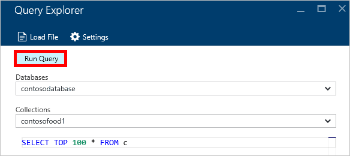

<properties
    pageTitle="Consulta de DocumentDB Explorer: Um SQL editor de consulta | Microsoft Azure"
    description="Saiba mais sobre o Explorador de consulta DocumentDB, um editor de consultas SQL no portal do Azure para escrever consultas SQL e executá-los em relação a um conjunto de NoSQL DocumentDB."
    keywords="escrever consultas sql, editor de consulta sql"
    services="documentdb"
    authors="kirillg"
    manager="jhubbard"
    editor="monicar"
    documentationCenter=""/>

<tags
    ms.service="documentdb"
    ms.workload="data-services"
    ms.tgt_pltfrm="na"
    ms.devlang="na"
    ms.topic="article"
    ms.date="08/30/2016"
    ms.author="kirillg"/>

# Gravar, editar e executar consultas SQL para DocumentDB usando o Explorador de consulta 

Este artigo fornece uma visão geral do Gerenciador de consulta do [Microsoft Azure DocumentDB](https://azure.microsoft.com/services/documentdb/) , uma ferramenta de portal Azure que permite gravar, editar e executar consultas SQL em um [conjunto de DocumentDB](documentdb-create-collection.md).

1. No portal do Azure, em Jumpbar, clique em **DocumentDB (NoSQL)**. Se **DocumentDB (NoSQL)** não estiver visível, clique em **Mais serviços** e clique em **DocumentDB (NoSQL)**.

2. No menu recursos, clique em **Gerenciador de consulta**. 

    

3. Na lâmina **Explorer de consulta** , selecione **bancos de dados** e **coleções** a consulta na lista suspensa e digite a consulta para executar. 

    Os **bancos de dados** e **coleções** nas listas suspensas são preenchidas dependendo do contexto em que você inicia o Explorer de consulta. 

    Uma consulta padrão de `SELECT TOP 100 * FROM c` é fornecido.  Você pode aceitar a consulta padrão ou construir sua própria consulta usando a linguagem de consulta SQL descrita a [consulta SQL roteiro](documentdb-sql-query-cheat-sheet.md) ou a [consulta SQL e sintaxe SQL](documentdb-sql-query.md) do artigo.

    Clique em **Executar consulta** para exibir os resultados.

    

4. A lâmina de **resultados** exibe a saída da consulta. 

    

## Trabalhar com os resultados

Por padrão, o Explorador de consulta retorna os resultados em conjuntos de 100.  Se sua consulta produz mais de 100 resultados, basta use os comandos de **próxima página** e **página anterior** para navegar entre o conjunto de resultados.

Para consultas com êxito, o painel de **informações** contém métricas como a carga de solicitação, o número de idas a consulta é feita, o conjunto de resultados no momento está sendo mostrado, e se há mais resultados, que podem ser acessados por meio do comando de **próxima página** , como mencionado anteriormente.

## Usar várias consultas

Se você estiver usando várias consultas e quiser alternar rapidamente entre elas, você pode insira todas as consultas na caixa de texto de consulta da lâmina **Explorer de consulta** , e em seguida, selecione o que você deseja executar e clique em **Executar consulta** para exibir os resultados.

## Adicionar consultas de um arquivo para o editor de consulta SQL

Você pode carregar o conteúdo de um arquivo existente usando o comando **Carregar arquivo** .

## Solucionar problemas

Se uma consulta for concluído com erros, Gerenciador de consulta exibe uma lista de erros que podem ajudar com esforços de solução de problemas.

## Executar consultas de fora do portal de DocumentDB SQL

O navegador de consulta no portal do Azure é apenas uma maneira de executar consultas SQL DocumentDB. Você também pode executar consultas SQL usando a [API REST](https://msdn.microsoft.com/library/azure/dn781481.aspx) ou o [cliente SDKs](documentdb-sdk-dotnet.md). Para obter mais informações sobre como usar esses outros métodos, consulte [consultas SQL em execução](documentdb-sql-query.md#executing-sql-queries)

## Próximas etapas

Para saber mais sobre a gramática DocumentDB SQL com suporte no Explorador de consulta, consulte o artigo de [consulta SQL e sintaxe SQL](documentdb-sql-query.md) ou imprimir a [consulta SQL roteiro](documentdb-sql-query-cheat-sheet.md).
Você também pode aproveitar experiências com o [Espaço de consulta](https://www.documentdb.com/sql/demo) onde você poderá testar consultas online usando um conjunto de dados de exemplo.
