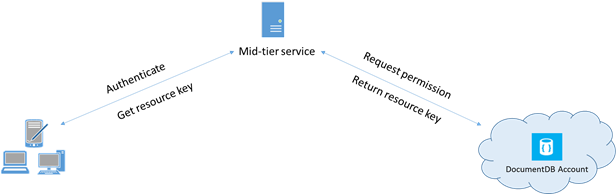

<properties 
    pageTitle="Aprenda a proteger o acesso a dados no DocumentDB | Microsoft Azure" 
    description="Saiba mais sobre os conceitos de controle de acesso no DocumentDB, incluindo chaves mestre, chaves somente leitura, os usuários e permissões." 
    services="documentdb" 
    authors="kiratp" 
    manager="jhubbard" 
    editor="monicar" 
    documentationCenter=""/>

<tags 
    ms.service="documentdb" 
    ms.workload="data-services" 
    ms.tgt_pltfrm="na" 
    ms.devlang="na" 
    ms.topic="article" 
    ms.date="09/19/2016" 
    ms.author="kipandya"/>

# Protegendo o acesso aos dados de DocumentDB

Este artigo fornece uma visão geral de Protegendo o acesso aos dados armazenados no [Microsoft Azure DocumentDB](https://azure.microsoft.com/services/documentdb/).

Após ler esta visão geral, você poderá responder às seguintes perguntas:  

-   O que são chaves de mestre DocumentDB?
-   O que são chaves de somente leitura do DocumentDB?
-   O que são tokens de recurso de DocumentDB?
-   Como usar DocumentDB usuários e permissões para proteger o acesso aos dados de DocumentDB?

## Conceitos de controle de acesso de DocumentDB

DocumentDB fornece conceitos de primeira classe para controlar o acesso aos recursos de DocumentDB.  Para os fins deste tópico, recursos de DocumentDB são agrupados em duas categorias:

- Recursos administrativos
    - Conta
    - Banco de dados
    - Usuário
    - Permissão
- Recursos de aplicativo
    - Coleção
    - Oferta
    - Documento
    - Anexo
    - Procedimento armazenado
    - Disparadores
    - Função definida pelo usuário

No contexto dessas duas categorias, DocumentDB dá suporte a três tipos de personas de controle de acesso: conta administrador, administrador somente leitura e usuário de banco de dados.  Os direitos para cada pessoa de controle de acesso são:
 
- Administrador de conta: acesso a todos os recursos (administrativos e aplicativos) dentro de uma determinada conta de DocumentDB completo.
- Administrador somente leitura: acesso somente leitura para todos os recursos (administrativos e aplicativos dentro de uma determinada conta de DocumentDB. 
- Usuário de banco de dados: DocumentDB o recurso de usuário associado a um conjunto específico de recursos de banco de dados de DocumentDB (por exemplo, coleções, documentos, scripts).  Pode haver um ou mais recursos de usuário associados a um determinado banco de dados e cada recurso de usuário podem ter uma ou mais permissões associadas a ele.

Com as categorias mencionado anteriormente e recursos em mente, o modelo de controle de acesso de DocumentDB define três tipos de construções de acesso:

- Chaves mestre: durante a criação de uma conta de DocumentDB, duas chaves de mestre (primárias e secundárias) são criadas.  Estas teclas habilitam acesso administrativo total a todos os recursos dentro da conta da DocumentDB.

- Chaves somente leitura: durante a criação de uma conta de DocumentDB, duas chaves somente leitura (primárias e secundárias) são criadas.  Estas teclas habilitam acesso somente leitura para todos os recursos dentro da conta da DocumentDB.

- Tokens de recurso: um símbolo de recurso está associado a um recurso de permissão DocumentDB e captura a relação entre o usuário de um banco de dados e a permissão o usuário tem para um recurso de aplicativo DocumentDB específico (por exemplo, conjunto, documento).

## Trabalhar com chaves de DocumentDB mestres e somente leitura

Conforme mencionado anteriormente, chaves de mestre DocumentDB fornecer acesso administrativo total a todos os recursos dentro de uma conta de DocumentDB, enquanto chaves somente leitura permitem o acesso de leitura a todos os recursos dentro da conta.  O trecho de código a seguir ilustra como usar um ponto de extremidade do DocumentDB conta e chave mestre para criar uma instância de um DocumentClient e criar um novo banco de dados. 

    //Read the DocumentDB endpointUrl and authorization keys from config.
    //These values are available from the Azure Classic Portal on the DocumentDB Account Blade under "Keys".
    //NB > Keep these values in a safe and secure location. Together they provide Administrative access to your DocDB account.
    
    private static readonly string endpointUrl = ConfigurationManager.AppSettings["EndPointUrl"];
    private static readonly SecureString authorizationKey = ToSecureString(ConfigurationManager.AppSettings["AuthorizationKey"]);
        
    client = new DocumentClient(new Uri(endpointUrl), authorizationKey);
    
    // Create Database
    Database database = await client.CreateDatabaseAsync(
        new Database
        {
            Id = databaseName
        });

## Visão geral dos tokens de recurso de DocumentDB

Você pode usar um símbolo de recurso (Criando DocumentDB usuários e permissões) quando você deseja fornecer acesso aos recursos na sua conta de DocumentDB a um cliente que não é confiável com a chave mestra. Suas chaves de mestre DocumentDB incluem tanto uma chave primária e secundária, cada um deles concede acesso administrativo a sua conta e todos os recursos nele. Expor uma das suas chaves mestre abre sua conta para a possibilidade de uso mal-intencionado ou negligente. 

Da mesma forma, chaves de somente leitura de DocumentDB fornecem acesso de leitura a todos os recursos - exceto recursos de permissão, é claro - dentro de uma conta de DocumentDB e não podem ser usadas para fornecer acesso mais granular aos recursos de DocumentDB específicos.

Tokens de recurso DocumentDB fornecem uma alternativa segura que permite aos clientes ler, gravar e excluir recursos na sua conta DocumentDB acordo com as permissões que você concedeu e sem necessidade de um mestre ou chave somente leitura.

Aqui está um padrão de design típico no qual o tokens de recurso podem ser solicitados, gerados e entregues aos clientes:

1. Um serviço intermediário está configurado para servir um aplicativo móvel para compartilhar fotos do usuário.
2. O serviço de intermediário possui a chave mestra da conta DocumentDB.
3. O aplicativo de fotos está instalado em dispositivos móveis do usuário final. 
4. No logon, o aplicativo de fotos estabelece a identidade do usuário com o serviço de intermediário. Esse mecanismo de definição de identidade da é puramente até o aplicativo.
5. Depois que a identidade é estabelecida, o serviço de intermediário solicita permissões com base na identidade.
6. O serviço de intermediário envia um símbolo de recurso voltar para o aplicativo de telefone.
7. O aplicativo de telefone pode continuar a usar o símbolo de recurso para acessar diretamente recursos de DocumentDB com as permissões definidas pelo token de recurso e para o intervalo permitido pelo token de recurso. 
8. Quando o símbolo de recurso expira, as solicitações subsequentes receberá uma exceção não autorizado 401.  Neste ponto, o aplicativo de telefone estabelece novamente a identidade e as solicitações de um novo token de recurso.

## Trabalhando com DocumentDB usuários e permissões
Um recurso de usuário DocumentDB está associado um banco de dados de DocumentDB.  Cada banco de dados pode conter zero ou mais usuários de DocumentDB.  O trecho de código a seguir mostra como criar um recurso de usuário DocumentDB.

    //Create a user.
    User docUser = new User
    {
        Id = "mobileuser"
    };

    docUser = await client.CreateUserAsync(UriFactory.CreateDatabaseUri("db"), docUser);

> [AZURE.NOTE] Cada usuário DocumentDB tem uma propriedade PermissionsLink que pode ser usada para recuperar a lista de permissões associadas com o usuário.

Um recurso de permissão DocumentDB está associado um usuário DocumentDB.  Cada usuário pode conter zero ou mais permissões DocumentDB.  Um recurso de permissão fornece acesso a um token de segurança que o usuário precisa ao tentar acessar um recurso de aplicativo específico.
Há dois níveis de acesso disponível que podem ser fornecidos por um recurso de permissão:

- Todos: O usuário tem permissão total do recurso
- Lido: O usuário só pode ler o conteúdo do recurso, mas não é possível executar gravação, atualização ou operações de exclusão do recurso.

> [AZURE.NOTE] Para executar o DocumentDB o usuário deve ter a permissão All na coleção na qual o procedimento armazenado será executado de procedimentos armazenados.

O trecho de código a seguir mostra como criar um recurso de permissão, o símbolo de recurso do recurso permissão de leitura e associar as permissões de usuário criado acima.

    // Create a permission.
    Permission docPermission = new Permission
    {
        PermissionMode = PermissionMode.Read,
        ResourceLink = documentCollection.SelfLink,
        Id = "readperm"
    };
            
  docPermission = esperar cliente. CreatePermissionAsync (UriFactory.CreateUserUri ("BD", "usuário"), docPermission); Console. WriteLine (docPermission.Id + "tem token de:" + docPermission.Token);
  
Se você especificou uma chave de partição para seu conjunto, em seguida, a permissão para o conjunto, recursos de documento e anexo também devem incluir o ResourcePartitionKey além do ResourceLink.

Para obter facilmente todos os recursos de permissão associados a um usuário específico, DocumentDB disponibiliza uma permissão feed para cada objeto de usuário.  O trecho de código a seguir mostra como recuperar a permissão associada ao usuário criado acima, criar uma lista de permissão e criar uma instância de um novo DocumentClient em nome de usuário.

    //Read a permission feed.
    FeedResponse<Permission> permFeed = await client.ReadPermissionFeedAsync(
      UriFactory.CreateUserUri("db", "myUser"));

    List<Permission> permList = new List<Permission>();
      
    foreach (Permission perm in permFeed)
    {
        permList.Add(perm);
    }
            
    DocumentClient userClient = new DocumentClient(new Uri(endpointUrl), permList);

> [AZURE.TIP] Tokens de recurso tem um período de tempo válido padrão de 1 hora.  Vida útil do token, no entanto, pode ser explicitamente especificada, até no máximo 5 horas.

## Próximas etapas

- Para saber mais sobre DocumentDB, clique [aqui](http://azure.com/docdb).
- Para aprender sobre o gerenciamento de chaves mestres e somente leitura, clique [aqui](documentdb-manage-account.md).
- Para saber como construir tokens de autorização de DocumentDB, clique [aqui](https://msdn.microsoft.com/library/azure/dn783368.aspx)
 
