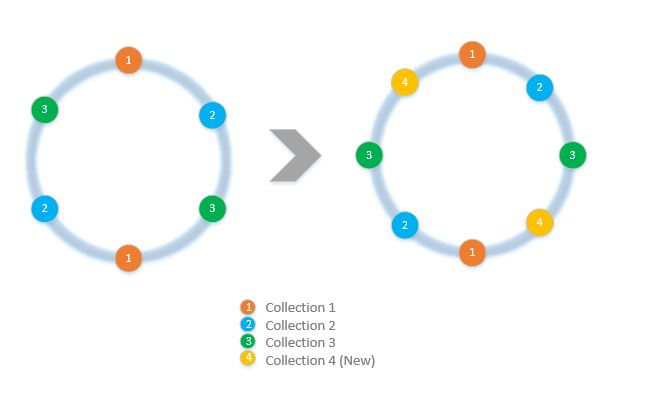

<properties 
    pageTitle="Como implementar partição de lado do cliente com o SDK do | Microsoft Azure" 
    description="Saiba como usar o SDK do DocumentDB do Azure para solicitações de dados e rota de partição (fragmentar) em vários conjuntos" 
    services="documentdb" 
    authors="arramac" 
    manager="jhubbard" 
    editor="cgronlun" 
    documentationCenter=""/>

<tags 
    ms.service="documentdb" 
    ms.workload="data-services" 
    ms.tgt_pltfrm="na" 
    ms.devlang="na" 
    ms.topic="article" 
    ms.date="10/27/2016" 
    ms.author="arramac"/>

# <a name="how-to-partition-data-using-client-side-support-in-documentdb"></a>Como os dados de partição usando o suporte do lado do cliente em DocumentDB

DocumentDB Azure suporta [automáticas partição de coleções](documentdb-partition-data.md). No entanto, há casos de uso onde ele é útil ter um controle refinado sobre partição comportamento. Para reduzir o código de placa de clichê necessário para a partição de tarefas, adicionamos funcionalidade no .NET, node e SDKs Java que torna mais fácil criar aplicativos que são dimensionados em vários conjuntos.

Neste artigo, vamos dar uma olhada as classes e interfaces no SDK do .NET e como você pode usá-los para desenvolver aplicativos particionados. Outros SDKs como Java, node e Python suportam semelhante interfaces e métodos para a partição do lado do cliente.

## <a name="client-side-partitioning-with-the-documentdb-sdk"></a>Partição do lado do cliente com o SDK do DocumentDB

Antes de nos aprofundar mais profunda na partição, vejamos novamente alguns conceitos básicos de DocumentDB relacionadas à partição. Cada conta de banco de dados do Azure DocumentDB consiste em um conjunto de bancos de dados, cada um contendo vários conjuntos, cada um deles pode conter procedimentos armazenados, disparadores, UDFs, documentos e anexos relacionados. Coleções podem ser partição única ou particionada próprios e ter as seguintes propriedades:

- Coleções oferecem isolamento de desempenho. Portanto, há um benefício de desempenho em documentos semelhantes no mesmo conjunto de agrupamento. Por exemplo, para dados de série de tempo, você talvez queira colocar os dados para o último mês, frequentemente consultado, dentro de uma coleção com maior produtividade provisionada enquanto dados antigos são colocados dentro de coleções com baixa taxa de transferência provisionada.
- Transações ACID isto é, procedimentos armazenados e disparadores não podem abranger um conjunto. Transações têm como escopo dentro de um valor de chave única partição dentro de uma coleção.
- Coleções não aplicar um esquema, para que possam ser usadas para documentos JSON do mesmo tipo ou diferentes tipos.

Começando com a versão [1.5. x do SDK de DocumentDB do Azure](documentdb-sdk-dotnet.md), você pode executar operações de documento diretamente em um banco de dados. Internamente o [DocumentClient](https://msdn.microsoft.com/library/azure/microsoft.azure.documents.client.documentclient.aspx) usa o PartitionResolver que você especificou para o banco de dados para rotear solicitações à coleção apropriada.

>[AZURE.NOTE] [Partição de servidor](documentdb-partition-data.md) introduzido em 1.6.0+ REST API 2015-12-16 e SDKs substitui a abordagem de resolução de partição do lado do cliente para casos de uso simples. No entanto partição do lado do cliente é mais flexível e permite que você controle isolamento de desempenho entre chaves de partição, controlar o grau de paralelismo ao ler os resultados de várias partições e usar o intervalo/espacial partição abordagens versus hash.

Por exemplo, no .NET, cada classe PartitionResolver é uma implementação concreta de uma interface de [IPartitionResolver](https://msdn.microsoft.com/library/azure/microsoft.azure.documents.client.ipartitionresolver.aspx) que possui três métodos - [GetPartitionKey](https://msdn.microsoft.com/library/azure/microsoft.azure.documents.client.ipartitionresolver.getpartitionkey.aspx), [ResolveForCreate](https://msdn.microsoft.com/library/azure/microsoft.azure.documents.client.ipartitionresolver.resolveforcreate.aspx) e [ResolveForRead](https://msdn.microsoft.com/library/azure/microsoft.azure.documents.client.ipartitionresolver.resolveforread.aspx). Consultas LINQ e iteradores de ReadFeed usam o método ResolveForRead internamente para iteração em todas as coleções que correspondem a chave da partição para a solicitação. Da mesma forma, crie o método ResolveForCreate para rotear cria para a direita partição de uso de operações. Nenhuma alteração necessária para substituir, excluir e ler desde que usarem documentos, que já contêm a referência à coleção correspondente.

SDK do também inclui duas classes que oferecem suporte a duas técnicas partição canônicas, pesquisas de hash e intervalo, por meio de um [HashPartitionResolver](https://msdn.microsoft.com/library/azure/microsoft.azure.documents.partitioning.hashpartitionresolver.aspx) e um [RangePartitionResolver](https://msdn.microsoft.com/library/azure/mt126047.aspx). Você pode usar essas classes facilmente adicionar lógica de partição ao seu aplicativo.  

## <a name="add-partitioning-logic-and-register-the-partitionresolver"></a>Adicionar lógica de partição e registrar o PartitionResolver 

Aqui está um trecho mostrando como criar uma [HashPartitionResolver](https://msdn.microsoft.com/library/azure/microsoft.azure.documents.partitioning.hashpartitionresolver.aspx) e registrar com o DocumentClient para um banco de dados.

```cs
// Create some collections to partition data.
DocumentCollection collection1 = await client.CreateDocumentCollectionAsync(...);
DocumentCollection collection2 = await client.CreateDocumentCollectionAsync(...);

// Initialize a HashPartitionResolver using the "UserId" property and the two collection self-links.
HashPartitionResolver hashResolver = new HashPartitionResolver(
    u => ((UserProfile)u).UserId, 
    new string[] { collection1.SelfLink, collection2.SelfLink });

// Register the PartitionResolver with the database.
this.client.PartitionResolvers[database.SelfLink] = hashResolver;

```

## <a name="create-documents-in-a-partition"></a>Criar documentos em uma partição  

Quando o PartitionResolver estiver registrado, você pode executar cria e consultas diretamente no banco de dados, conforme mostrado abaixo. Neste exemplo, o SDK usa o PartitionResolver para extrair o ID de usuário, hash-lo e, em seguida, use esse valor para rotear a operação de criação para o conjunto correto.

```cs
Document johnDocument = await this.client.CreateDocumentAsync(
    database.SelfLink, new UserProfile("J1", "@John", Region.UnitedStatesEast));
Document ryanDocument = await this.client.CreateDocumentAsync(
    database.SelfLink, new UserProfile("U4", "@Ryan", Region.AsiaPacific, UserStatus.AppearAway));
```

## <a name="create-queries-against-partitions"></a>Criar consultas em partições  

Você pode consultar usando o método [CreateDocumentQuery](https://msdn.microsoft.com/library/azure/microsoft.azure.documents.linq.documentqueryable.createdocumentquery.aspx) passando o banco de dados e uma chave de partição. A consulta retorna um único conjunto de resultados sobre todas as coleções no banco de dados que são mapeados para a chave da partição.  

```cs
// Query for John's document by ID - uses PartitionResolver to restrict the query to the partitions 
// containing @John. Again the query uses the database self link, and relies on the hash resolver 
// to route the appropriate collection.
var query = this.client.CreateDocumentQuery<UserProfile>(
    database.SelfLink, null, partitionResolver.GetPartitionKey(johnProfile))
    .Where(u => u.UserName == "@John");
johnProfile = query.AsEnumerable().FirstOrDefault();
```

## <a name="create-queries-against-all-collections-in-the-database"></a>Criar consultas em todos os conjuntos no banco de dados 

Você também pode todos os conjuntos no banco de dados da consulta e enumerar os resultados como mostrado abaixo, ignorando o argumento de chave de partição.

```cs
// Query for all "Available" users. Here since there is no partition key, the query is serially executed 
// across each partition/collection and returns a single result-set. 
query = this.client.CreateDocumentQuery<UserProfile>(database.SelfLink)
    .Where(u => u.Status == UserStatus.Available);
foreach (UserProfile activeUser in query)
{
    Console.WriteLine(activeUser);
}
```

## <a name="hash-partition-resolver"></a>Resolução de partição hash
Com o hash partição, partições são atribuídas com base no valor de uma função de hash, permitindo que você distribuir uniformemente as solicitações e dados em um número de partições. Essa abordagem geralmente é usada para partição dados produzidos ou consumidas de um grande número de clientes distintos e é útil para armazenar perfis de usuário, itens de catálogo e dados de telemetria IoT ("Internet das coisas"). Partição de hash também é usado pelo suporte partição do servidor do DocumentDB em um conjunto.

**Particionamento de hash:**


Um hash simple partição esquema entre conjuntos de *N* seria levar qualquer documento, calcular *hash(d) mod N* para determinar qual coleção ele colocado em. Mas um problema com essa técnica simples é que ela não funciona bem quando você adicionar novas coleções ou remove conjuntos de como isso requer quase todos os dados para obter reshuffled. [Hash consistente] (http://citeseerx.ist.psu.edu/viewdoc/summary?doi=10.1.1.23.3738) é um algoritmo conhecido que aborda isso Implementando um esquema de hash que minimiza a quantidade de movimentação de dados necessária durante adicionando ou removendo coleções.

A classe [HashPartitionResolver](https://msdn.microsoft.com/library/azure/microsoft.azure.documents.partitioning.hashpartitionresolver.aspx) implementa lógica para construir um anel hash consistentes sobre a função de hash especificada na interface do [IHashGenerator](https://msdn.microsoft.com/library/azure/microsoft.azure.documents.partitioning.ihashgenerator.aspx) . Por padrão, o HashPartitionResolver usa uma função de hash MD5, mas você pode trocar isso com sua própria implementação de hash. O HashPartitionResolver internamente cria 16 hash ou "nós virtuais" dentro de ligar para o hash para cada conjunto para obter uma distribuição mais uniforme de documentos em coleções, mas você pode variar esse número trade desativar distorção de dados com a quantidade de computação de lado cliente.

**O hash consistente com HashPartitionResolver:**


## <a name="range-partition-resolver"></a>Resolução de partição de intervalo

No intervalo partição, partições são atribuídas com base em se a chave da partição está em um determinado intervalo. Isso geralmente é usado para a partição com propriedades de carimbo de data / hora (por exemplo, eventTime entre 1 de abril de 2015 e 14 de abril de 2015). A classe [RangePartitionResolver](https://msdn.microsoft.com/library/azure/mt126047.aspx) ajuda você a manter um mapeamento entre um intervalo\<T\> e coleção auto vincular. 

[Intervalo\<T\> ](https://msdn.microsoft.com/library/azure/mt126048.aspx) é uma classe simple que gerencia intervalos de quaisquer tipos que implementam IComparable\<T\> e IEquatable\<T\> como cadeias de caracteres ou números. Para lê e cria, você pode passar em qualquer intervalo aleatório e o solucionador identifica todas as coleções de candidato identificando os intervalos das partições que formam uma interseção com o intervalo solicitado. Essa funcionalidade pode ser útil ao executar consultas de intervalo em dados da série de tempo.

**Intervalo partição:**  

  

Um caso especial de partição de intervalo é quando o intervalo é apenas um único discreto valor, às vezes chamado de "partição de pesquisa". Isso geralmente é usado para partição por região (por exemplo, a partição de Escandinávia contém Suécia, Dinamarca e Noruega) ou partição locatários em um aplicativo de vários locatário.

## <a name="samples"></a>Amostras 

Dê uma olhada o [projeto DocumentDB partição amostras Github](https://github.com/Azure/azure-documentdb-dotnet/tree/287acafef76ad223577759b0170c8f08adb45755/samples/code-samples/Partitioning) contendo trechos de código sobre como usar esses PartitionResolvers e estendê-los para implementar seus próprio resolvedores para ajustá-la casos de uso específico, como o seguinte: 

* Como especificar uma expressão lambda aleatório para GetPartitionKey e usá-lo para implementar chaves compostas de partição ou partição diferentes tipos de objetos de maneira diferente.
* Como criar um simples [LookupPartitionResolver](https://github.com/Azure/azure-documentdb-dotnet/blob/287acafef76ad223577759b0170c8f08adb45755/samples/code-samples/Partitioning/Partitioners/LookupPartitionResolver.cs) que usa uma tabela de pesquisa manual para executar partição. Esse padrão geralmente é usado para a partição com base em valores distintos região, como identificação de locatário ou aplicativo nome.
* Como criar um [ManagedPartitionResolver](https://github.com/Azure/azure-documentdb-dotnet/blob/287acafef76ad223577759b0170c8f08adb45755/samples/code-samples/Partitioning/Partitioners/ManagedHashPartitionResolver.cs) que cria automaticamente com base em um modelo que define um esquema de nomenclatura, IndexingPolicy e procedimentos armazenados que precisam ser registrados contra novos conjuntos de coleções.
* Como criar um esquema sem [SpilloverPartitionResolver](https://github.com/Azure/azure-documentdb-dotnet/blob/287acafef76ad223577759b0170c8f08adb45755/samples/code-samples/Partitioning/Partitioners/SpilloverPartitionResolver.cs) que simplesmente cria novos conjuntos como preencher coleções antigas.
* Como serializar e desserializar seu estado de PartitionResolver como JSON, para que você possa compartilhar entre processos e em desligamentos. Você pode persistir esses em arquivos de configuração, ou mesmo em um conjunto de DocumentDB.
* Uma classe [DocumentClientHashPartitioningManager](https://github.com/Azure/azure-documentdb-dotnet/blob/287acafef76ad223577759b0170c8f08adb45755/samples/code-samples/Partitioning/Util/DocumentClientHashPartitioningManager.cs) para adicionar e remover partições para um banco de dados particionado dinamicamente com base em hash consistentes. Internamente usa um [TransitionHashPartitionResolver](https://github.com/Azure/azure-documentdb-dotnet/blob/287acafef76ad223577759b0170c8f08adb45755/samples/code-samples/Partitioning/Partitioners/TransitionHashPartitionResolver.cs) para rotear leituras e gravações durante a migração usando um dos quatro modos - ler o antigo esquema de partição (ReadCurrent), uma nova (ReadNext), mesclar os resultados de ambas as (ReadBoth) ou não esteja disponível durante a migração (nenhum).

Os exemplos são Abrir origem e recomendamos que você envie solicitações de recepção com contribuições que poderiam se beneficiar outros desenvolvedores DocumentDB. Consulte as [diretrizes de contribuição](https://github.com/Azure/azure-documentdb-net/blob/master/Contributing.md) para obter orientações sobre como Contribuir.  

>[AZURE.NOTE] Coleção cria são taxa limitada por DocumentDB, portanto, alguns dos métodos exemplo mostrados aqui podem levar alguns minutos para ser concluída.

##<a name="faq"></a>Perguntas Freqüentes
**DocumentDB suporta partição de servidor?**

Sim, DocumentDB aceita [partição de servidor](documentdb-partition-data.md). DocumentDB também suporta partição do lado do cliente por meio de resolvedores de partição do lado do cliente para usos mais avançados.

**Quando devo usar o servidor versus partição do lado do cliente?**
Para a maioria dos casos de uso, recomendamos o uso de servidor partição desde que ela lida com as tarefas administrativas de roteamento solicitações e partição de dados. No entanto, se você precisar partição de intervalo ou tiver um caso de uso especializado para isolamento de desempenho entre diferentes valores de chaves de partição, em seguida, partição do lado do cliente pode ser a melhor abordagem.

**Como adicionar ou remover uma coleção para meu esquema de partição?**

Dê uma olhada a implementação de DocumentClientHashPartitioningManager no projeto exemplos para obter um exemplo de como você pode implementar reparticionar.

**Como persistir ou compartilhar minha configuração partição com outros clientes?**

Você pode serializar o estado de particionador como JSON e armazenar em arquivos de configuração ou até mesmo em conjuntos de DocumentDB. Dê uma olhada o método RunSerializeDeserializeSample no projeto amostras para obter um exemplo.

**Como posso cadeia várias técnicas partição?**

Você pode cadeia PartitionResolvers implementando seu próprio IPartitionResolver que usa internamente um ou mais resolvedores existentes. Dê uma olhada TransitionHashPartitionResolver do projeto de amostras para obter um exemplo.

##<a name="references"></a>Referências
* [Servidor partição no DocumentDB](documentdb-partition-data.md)
* [Conjuntos de DocumentDB e níveis de desempenho](documentdb-performance-levels.md)
* [Exemplos de código partição no Github](https://github.com/Azure/azure-documentdb-dotnet/tree/287acafef76ad223577759b0170c8f08adb45755/samples/code-samples/Partitioning)
* [Documentação do DocumentDB .NET SDK no MSDN](https://msdn.microsoft.com/library/azure/dn948556.aspx)
* [Exemplos de DocumentDB .NET](https://github.com/Azure/azure-documentdb-net)
* [Limites de DocumentDB](documentdb-limits.md)
* [Blog de DocumentDB em dicas de desempenho](https://azure.microsoft.com/blog/2015/01/20/performance-tips-for-azure-documentdb-part-1-2/)
 
