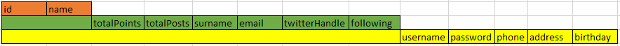
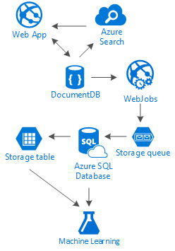

<properties 
    pageTitle="Padrão de design de DocumentDB: aplicativos de mídia Social | Microsoft Azure" 
    description="Saiba mais sobre um padrão de design para redes sociais, aproveitando a flexibilidade de armazenamento de DocumentDB e outros serviços do Azure." 
    keywords="aplicativos de mídia social"
    services="documentdb" 
    authors="ealsur" 
    manager="jhubbard" 
    editor="" 
    documentationCenter=""/>

<tags 
    ms.service="documentdb" 
    ms.workload="data-services" 
    ms.tgt_pltfrm="na" 
    ms.devlang="na" 
    ms.topic="article" 
    ms.date="09/27/2016" 
    ms.author="mimig"/>

# Indo social com DocumentDB

Vivem na Sociedade amplamente interconectados significa que, em algum momento da vida, você se tornar parte de uma **rede social**. Usamos redes sociais para manter contato com amigos, colegas, familiares ou às vezes, compartilhar nossa paixão com pessoas com interesses comuns.

Como engenheiros ou desenvolvedores, podemos podem ter se perguntou como essas redes armazenar e interconexão nossos dados, ou pode até mesmo foi designado para criar ou projetar uma nova rede social para um mercado especializado específicos em si. É quando surge a grande pergunta: como todos os dados são armazenados?

Vamos supor que estamos criando uma nova e brilhante rede social, onde os usuários podem postar artigos com mídia relacionada como, imagens, vídeos ou até mesmo música. Os usuários podem comentar postagens e dar pontos para classificações. Haverá um feed de postagens que os usuários verão e poderá interagir com na página inicial do site principal. Isso não parecer realmente complexo (a primeira), mas para simplificar, vamos parar lá (poderia examinarmos feeds do usuário personalizada afetados por relações, mas ela excede o objetivo deste artigo).

Então, como podemos armazenar isso e onde?

Muitos de vocês podem ter experiência em bancos de dados do SQL ou ter pelo menos noção de [modelagem de dados relacionais](https://en.wikipedia.org/wiki/Relational_model) e você poderá ficar tentado a começar a desenhar algo parecido com isto:

 

Uma estrutura de dados perfeitamente normalizado e muito... não são dimensionadas. 

Não me entenda mal, que trabalhei com bancos de dados do SQL todas as minha vida, eles são excelentes, mas como cada plataforma padrão, prática e software, não é ideal para cada cenário.

Por que não SQL a melhor opção nesse cenário? Vamos examinar a estrutura de uma única postagem, se eu quiser mostrar essa postagem em um site ou aplicativo, que eu precisaria fazer uma consulta com … para mostrar um único post, agora, imagem um fluxo de postagens que carregar dinamicamente e aparecem na tela e você poderá ver onde vou apenas 8 junções de tabela (!).

Poderia, é claro, usamos uma instância do SQL humongous com energia suficiente para resolver milhares de consultas com essas relações muitos para servir nosso conteúdo, mas realmente, por que faria nós quando existe uma solução mais simples?

## Estrada NoSQL

Há bancos de dados de gráfico especial que podem [ser executados em Azure](http://neo4j.com/developer/guide-cloud-deployment/#_windows_azure) , mas não são baratos e requer os serviços de IaaS (infraestrutura como serviço, máquinas virtuais principalmente) e a manutenção. Vou público-alvo neste artigo em uma solução de custo menor que funciona para a maioria dos cenários, em execução no banco de dados do Azure do NoSQL [DocumentDB](https://azure.microsoft.com/services/documentdb/). Usando uma abordagem de [NoSQL](https://en.wikipedia.org/wiki/NoSQL) , armazenar dados no formato JSON e aplicando [denormalization](https://en.wikipedia.org/wiki/Denormalization), nossa postagem anteriormente complicada pode ser transformada em um único [documento](https://en.wikipedia.org/wiki/Document-oriented_database):

    {
        "id":"ew12-res2-234e-544f",
        "title":"post title",
        "date":"2016-01-01",
        "body":"this is an awesome post stored on NoSQL",
        "createdBy":User,
        "images":["http://myfirstimage.png","http://mysecondimage.png"],
        "videos":[
            {"url":"http://myfirstvideo.mp4", "title":"The first video"},
            {"url":"http://mysecondvideo.mp4", "title":"The second video"}
        ],
        "audios":[
            {"url":"http://myfirstaudio.mp3", "title":"The first audio"},
            {"url":"http://mysecondaudio.mp3", "title":"The second audio"}
        ]
    }

E pode ser obtido com uma única consulta e nenhum junções. Isso é muito mais simples e direto e, budget-wise, requer menos recursos para obter um resultado melhor.

DocumentDB Azure garante que todas as propriedades são indexadas com a sua [a indexação automática](documentdb-indexing.md), que pode ser [personalizado](documentdb-indexing-policies.md). A abordagem livre esquema permite armazenar documentos com diferentes e dinâmicas estruturas, talvez amanhã que queremos postagens ter uma lista de categorias ou hashtags associados a elas, DocumentDB tratará os novos documentos com os atributos adicionados sem trabalho extra requerido conosco.

Comentários em uma postagem podem ser tratados como apenas outras postagens com uma propriedade de pai (Isso simplifica nosso mapeamento de objeto). 

    {
        "id":"1234-asd3-54ts-199a",
        "title":"Awesome post!",
        "date":"2016-01-02",
        "createdBy":User2,
        "parent":"ew12-res2-234e-544f"
    }

    {
        "id":"asd2-fee4-23gc-jh67",
        "title":"Ditto!",
        "date":"2016-01-03",
        "createdBy":User3,
        "parent":"ew12-res2-234e-544f"
    }

E todas as interações sociais podem ser armazenadas em um objeto separado como contadores:

    {
        "id":"dfe3-thf5-232s-dse4",
        "post":"ew12-res2-234e-544f",
        "comments":2,
        "likes":10,
        "points":200
    }

Criar feeds é apenas uma questão de criação de documentos que podem conter uma lista de ids de postagem com uma ordem de determinado relevância:

    [
        {"relevance":9, "post":"ew12-res2-234e-544f"},
        {"relevance":8, "post":"fer7-mnb6-fgh9-2344"},
        {"relevance":7, "post":"w34r-qeg6-ref6-8565"}
    ]

Podemos poderia ter um fluxo de "mais recente" com postagens classificadas por data de criação, um fluxo de "melhores" com essas postagens com mais gosta nas últimas 24 horas, podemos mesmo poderia implementar um fluxo personalizado para cada usuário com base em lógica como seguidores e interesses e ainda seria uma lista de postagens. É uma questão de como criar essas listas, mas o desempenho de leitura permanece unhindered. Depois que podemos adquirir uma dessas listas, podemos emitir uma única consulta para DocumentDB usando o [operador IN](documentdb-sql-query.md#where-clause) para obter páginas de postagens por vez.

Os fluxos de feed podem ser criados usando processos de plano de fundo [Dos serviços de aplicativo do Azure](https://azure.microsoft.com/services/app-service/) : [Webjobs](../app-service-web/web-sites-create-web-jobs.md). Depois de criado uma postagem, processamento de plano de fundo pode ser acionado usando o [Armazenamento do Azure](https://azure.microsoft.com/services/storage/) [filas](../storage/storage-dotnet-how-to-use-queues.md) e Webjobs disparadas usando o [SDK do Azure Webjobs](../app-service-web/websites-dotnet-webjobs-sdk.md), implementar a propagação de postagem dentro fluxos com base em nossa própria lógica personalizada. 

Pontos e curtidas sobre uma postagem podem ser processadas de maneira adiada usando essa mesma técnica para criar um ambiente eventualmente consistente.

Seguidores são mais complicados. DocumentDB tem um limite de tamanho do documento de 512Kb, por isso, talvez você ache sobre como armazenar seguidores como um documento com essa estrutura:

    {
        "id":"234d-sd23-rrf2-552d",
        "followersOf": "dse4-qwe2-ert4-aad2",
        "followers":[
            "ewr5-232d-tyrg-iuo2",
            "qejh-2345-sdf1-ytg5",
            //...
            "uie0-4tyg-3456-rwjh"
        ]
    }

Isso pode funcionar para um usuário com alguns milhares seguidores, mas se alguns celebridades une nossa classifica, esta será abordagem eventualmente acertar o limite de tamanho do documento.

Para resolver isso, podemos usar uma abordagem mista. Como parte do documento estatísticas do usuário podemos armazenar o número de seguidores:

    {
        "id":"234d-sd23-rrf2-552d",
        "user": "dse4-qwe2-ert4-aad2",
        "followers":55230,
        "totalPosts":452,
        "totalPoints":11342
    }

E o gráfico real da seguidores pode ser armazenado nas tabelas de armazenamento do Azure usando uma [extensão](https://github.com/richorama/AzureStorageExtensions#azuregraphstore) que permite a recuperação e armazenamento de "R-segue-B" simples. Dessa maneira podemos delegar o processo de recuperação da seguidores exata lista (quando necessário) a tabelas de armazenamento do Azure, mas uma pesquisa de números de acesso rápido, podemos continuar usando DocumentDB.

## A duplicação de dados e padrão de "Pirâmide"

Como você deve ter notado no documento JSON que faz referência a uma postagem, há várias ocorrências de um usuário. E você poderia esperar à direita, que isso significa que as informações que representa um usuário, fornecido este denormalization, podem estar presentes em mais de um só lugar.

Para permitir consultas mais rápidas, podemos provoca duplicação de dados. O problema com esse efeito de lado é que se por alguma ação, alterações de dados de um usuário, precisamos encontrar todas as atividades já fez e atualizá-los todos. Não som muito prático, certo?

Bancos de dados do gráfico solução-lo em sua própria maneira, vamos solucioná-lo ao identificar os atributos de chave de um usuário que mostraremos em nosso aplicativo para cada atividade. Se nós visualmente mostrar uma postagem em nosso aplicativo e mostrar apenas o criador nome e imagem, por que armazena todos os dados do usuário no atributo "createdBy"? Se cada comentário podemos mostrar apenas imagem do usuário, não realmente precisamos o restante das suas informações. Isso é que algo para chamar o "padrão de escada" entra em cena.

Vamos informações do usuário como um exemplo:

    {
        "id":"dse4-qwe2-ert4-aad2",
        "name":"John",
        "surname":"Doe",
        "address":"742 Evergreen Terrace",
        "birthday":"1983-05-07",
        "email":"john@doe.com",
        "twitterHandle":"@john",
        "username":"johndoe",
        "password":"some_encrypted_phrase",
        "totalPoints":100,
        "totalPosts":24
    }
    
Observando essas informações, pode rapidamente Detectamos que informações críticas e quais não, criando assim uma "pirâmide":

Na etapa menor é chamada um UserChunk, a informação mínima que identifica um usuário e ele é usado para duplicação de dados. Reduzindo o tamanho dos dados duplicados a apenas as informações "mostraremos", podemos reduzir a possibilidade de atualizações grandes.

Na etapa intermediária é chamada de usuário, ele é dados completos que serão usados na maioria das consultas de desempenho dependentes em DocumentDB, mais acessado e essenciais. Ele inclui as informações são representadas por um UserChunk.

O maior é o usuário estendida. Ele inclui todas as informações do usuário críticas plus outros dados que realmente não requerem a serem lidas rapidamente ou seu uso é eventual (como o processo de login). Esses dados podem ser armazenados fora do DocumentDB, nas tabelas de armazenamento do Azure ou Azure SQL Database.

Por que estamos deseja dividir o usuário e até mesmo armazenar essas informações em locais diferentes? Porque o espaço de armazenamento em DocumentDB é [não infinito](documentdb-limits.md) de desempenho de um ponto e de modo de exibição, quanto maior os documentos a costlier as consultas. Manter os documentos fino, com as informações certas para fazer todas as consultas de desempenho dependentes para sua rede social e armazenar as informações extras para eventual cenários, como edições de perfil completo, logon, mesmo mineração de dados para a análise de uso e iniciativas de grande volume. Podemos realmente não importa se para mineração de dados de coleta de dados são mais lentos porque ele é executado em Azure SQL Database, podemos ter interessam Apesar que nossos usuários tenham uma experiência rápida e fina. Um usuário, armazenado em DocumentDB, teria esta aparência:

    {
        "id":"dse4-qwe2-ert4-aad2",
        "name":"John",
        "surname":"Doe",
        "username":"johndoe"
        "email":"john@doe.com",
        "twitterHandle":"@john"
    }

E uma postagem teria o seguinte:

    {
        "id":"1234-asd3-54ts-199a",
        "title":"Awesome post!",
        "date":"2016-01-02",
        "createdBy":{
            "id":"dse4-qwe2-ert4-aad2",
            "username":"johndoe"
        }
    }

E quando uma edição surge onde um dos atributos do fragmento é afetado, é fácil localizar os documentos afetados usando consultas que apontam para os atributos indexados (selecione * FROM postagens p onde p.createdBy.id = = "edited_user_id") e, em seguida, atualizar os blocos.

## Caixa de pesquisa

Usuários gerará, Felizmente, muito conteúdo. E podemos deve ser capazes de fornecer a capacidade de pesquisar e localizar conteúdo que talvez não seja diretamente em seus fluxos de conteúdo, talvez porque não seguimos os criadores ou talvez estamos apenas tentando encontrar que postagem antiga fizemos 6 meses.

Felizmente, e porque estamos usando DocumentDB do Azure, podemos facilmente implementar um mecanismo de pesquisa usando a [pesquisa do Azure](https://azure.microsoft.com/services/search/) em alguns minutos e sem digitar uma única linha de código (diferente de obviamente, o processo de pesquisa e interface do usuário).

Por que isso é tão fácil?

Pesquisa Azure implementa o que eles chamam [indexadores](https://msdn.microsoft.com/library/azure/dn946891.aspx), processos de plano de fundo que se ligar em seus repositórios de dados e automagically adicionar, atualizar ou remover os objetos nos índices. Elas suportam um [indexadores de banco de dados do SQL Azure](https://blogs.msdn.microsoft.com/kaevans/2015/03/06/indexing-azure-sql-database-with-azure-search/), [indexadores Blobs do Azure](../search/search-howto-indexing-azure-blob-storage.md) e Felizmente, [indexadores DocumentDB do Azure](../documentdb/documentdb-search-indexer.md). A transição de informações do DocumentDB para pesquisa de Azure é simples, como ambas as informações de armazenamento no formato JSON, precisamos [criar nosso índice](../search/search-create-index-portal.md) e mapa quais atributos de nossos documentos queremos indexado e isto é, em questão de minutos (depende do tamanho dos dados), todo o nosso conteúdo estará disponível para ser pesquisadas, a melhor solução de pesquisa-como um serviço na infraestrutura de nuvem. 

Para obter mais informações sobre pesquisa do Azure, você pode visitar o [guia para pesquisa](https://blogs.msdn.microsoft.com/mvpawardprogram/2016/02/02/a-hitchhikers-guide-to-search/).

## O conhecimento subjacente

Depois de armazenar todo esse conteúdo que aumenta e torna a cada dia, podemos localizar nós pensando: o que posso fazer com todo este fluxo de informações de meus usuários?

A resposta é simples: colocá-lo para trabalhar e aprender com ele.

Mas, o que nós aprendemos? Alguns exemplos de fácil incluem [análise sentimento](https://en.wikipedia.org/wiki/Sentiment_analysis), recomendações conteúdas com base nas preferências do usuário ou até mesmo um moderador conteúdo automatizada que garante que todo o conteúdo publicado por nossa rede social é segura para a família.

Agora que eu obtive você conectado, você provavelmente será pensar você precisa alguns PhD em ciência de matemática para extrair esses padrões e informações de arquivos e bancos de dados simples, mas está errado.

[Aprendizado de máquina do azure](https://azure.microsoft.com/services/machine-learning/), parte do [Pacote de inteligência de Cortana](https://www.microsoft.com/en/server-cloud/cortana-analytics-suite/overview.aspx), é a um serviço de nuvem totalmente gerenciado que permite criar fluxos de trabalho usando algoritmos em uma interface de arrastar e soltar simple, o código de seus próprios algoritmos em [R](https://en.wikipedia.org/wiki/R_(programming_language)) ou usar alguns dos já criado e pronto para usar APIs como: [Análise de texto](https://gallery.cortanaanalytics.com/MachineLearningAPI/Text-Analytics-2), [Moderador conteúdo](https://www.microsoft.com/moderator) ou [recomendações](https://gallery.cortanaanalytics.com/MachineLearningAPI/Recommendations-2).

Para conseguir qualquer um desses cenários de aprendizado de máquina, podemos usar [Lucerne de dados do Azure](https://azure.microsoft.com/services/data-lake-store/) para receber as informações de diferentes fontes e use [U-SQL](https://azure.microsoft.com/documentation/videos/data-lake-u-sql-query-execution/) para processar as informações e gerar uma saída que pode ser processada pelo aprendizado de máquina do Azure.

Outra opção disponível é usar [Serviços cognitivas da Microsoft](https://www.microsoft.com/cognitive-services) para analisar nosso conteúdo de usuários; não só pode entendemos-los melhor (por meio de analisar o que eles escreverem com a [API de análise de texto](https://www.microsoft.com/cognitive-services/en-us/text-analytics-api)), mas também pode detectar conteúdo indesejado ou desenvolvido e age de acordo com a [API de visão do computador](https://www.microsoft.com/cognitive-services/en-us/computer-vision-api). Serviços cognitivas incluem muitas soluções de fora da caixa que não exigem qualquer tipo de dados de Conhecimento de aprendizado de máquina para usar.

## Conclusão

Este artigo tenta esclarecer em alternativas de criar redes sociais completamente no Azure com os serviços de baixo custo e fornecer resultados ótimos incentivar o uso de uma distribuição de dados e de solução de armazenamento em várias camadas chamado "Pirâmide".

A verdade é que não há nenhum marcador prata para esse tipo de cenários, mas a sinergia criada pela combinação dos serviços excelentes que nos permitem criar excelentes experiências: a velocidade e liberdade de DocumentDB do Azure para fornecer um ótimo aplicativo social, a inteligência atrás de uma solução de pesquisa de primeira classe como pesquisa do Azure, a flexibilidade dos serviços de aplicativo do Azure para o host nem mesmo idioma independente aplicativos mas processos de plano de fundo poderosos e expansível armazenamento do Azure e Azure SQL Database para armazenar grandes quantidades de dados e potência analítica de aprendizado de máquina do Azure para criar conhecimento e inteligência que pode fornecer comentários para nossos processos e ajuda nos fornecer o conteúdo certo para os usuários à direita.

## Próximas etapas

Saiba mais sobre modelagem lendo o artigo de [dados de modelagem em DocumentDB](documentdb-modeling-data.md) de dados. Se você estiver interessado em outros casos de uso para DocumentDB, consulte [casos de uso de DocumentDB comuns](documentdb-use-cases.md).

Ou Saiba mais sobre DocumentDB seguindo o [Caminho de aprendizagem do DocumentDB](https://azure.microsoft.com/documentation/learning-paths/documentdb/).
