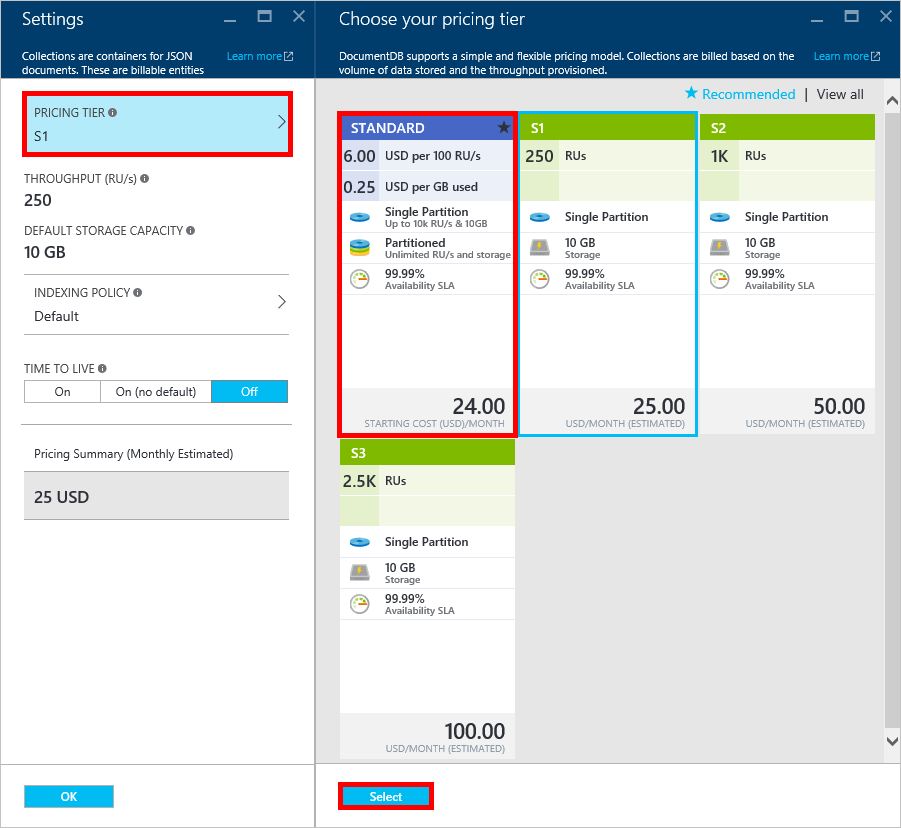

<properties 
    pageTitle="Impulsione sua conta DocumentDB S1 | Microsoft Azure" 
    description="Aproveite maior produtividade em sua conta DocumentDB S1 fazendo algumas alterações simples no portal do Azure." 
    services="documentdb" 
    authors="mimig1" 
    manager="jhubbard" 
    editor="monicar" 
    documentationCenter=""/>

<tags 
    ms.service="documentdb" 
    ms.workload="data-services" 
    ms.tgt_pltfrm="na" 
    ms.devlang="na" 
    ms.topic="article" 
    ms.date="08/25/2016" 
    ms.author="mimig"/>

# Impulsione sua conta DocumentDB

Siga estas etapas para tirar proveito de maior produtividade para a sua conta do Azure DocumentDB S1. Com pouco ou nenhum custo adicional, você pode aumentar a produtividade da sua conta existente do S1 de 250 [RU/s](documentdb-request-units.md) para 400 RU/s ou mais!  

> [AZURE.VIDEO changedocumentdbcollectionperformance]

## Alterar para desempenho definidos pelo usuário no portal do Azure

1. No seu navegador, navegue até o [**portal do Azure**](https://portal.azure.com). 
2. Clique em **Procurar** -> **DocumentDB (NoSQL)**, em seguida, selecione a conta de DocumentDB para modificar.   
3. Em lentes de **bancos de dados** , selecione o banco de dados para modificar e na lâmina **banco de dados** , selecione o conjunto com a camada de preços S1.

      

4. Na lâmina **conjunto** , clique em **mais**e, em seguida, clique em **configurações**.   
5. Na lâmina **configurações** , clique em **Nível de preços** e observe que a estimativa de custo mensal para cada plano é exibida. Na lâmina **Escolher sua camada de preços** , clique em **padrão**e clique em **Selecionar** para salvar as alterações.

      

6. Volte a lâmina de **configurações** , o **Nível de preços** é alterado para **padrão** e a caixa de **produtividade (RU/s)** é exibida com um valor padrão de 400. Clique em **Okey** para salvar suas alterações. 

    > [AZURE.NOTE] Você pode definir a taxa de transferência entre 400 e 10.000 [Solicitar unidades](../articles/documentdb/documentdb-request-units.md)/second (RU/s). O **Resumo de preços** na parte inferior da página é atualizada automaticamente para fornecer uma estimativa do custo mensal.
    
    

8. Novamente na lâmina **banco de dados** , você pode verificar a taxa de transferência de teste de sobrecarga da coleção. 

    

Para obter mais informações sobre as alterações relacionadas a produtividade predefinida e definidos pelo usuário, consulte o postagem de blog [DocumentDB: tudo o que você precisa saber sobre como usar as novas opções de preços](https://azure.microsoft.com/blog/documentdb-use-the-new-pricing-options-on-your-existing-collections/).

## Próximas etapas

Se você determinar que precisa de mais produtividade (maior que 10.000 RU/s) ou mais armazenamento (maior que 10GB), você pode criar um conjunto de particionada. Para criar um conjunto de particionada, consulte [criar um conjunto](documentdb-create-collection.md).