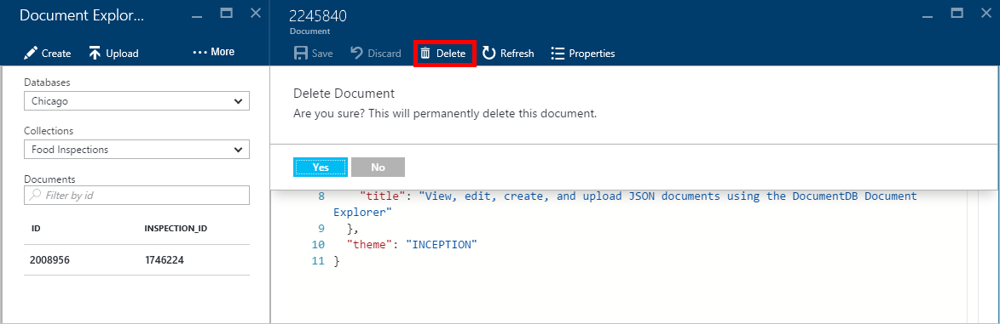
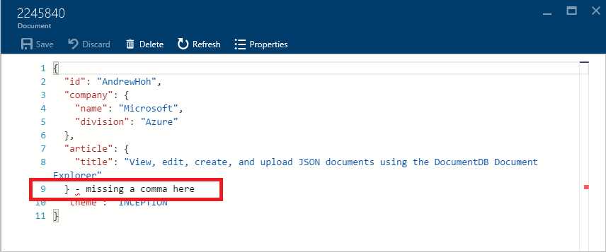
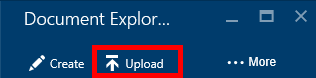

<properties
    pageTitle="DocumentDB Document Explorer, exibir JSON | Microsoft Azure"
    description="Saiba mais sobre o DocumentDB Document Explorer, uma ferramenta de Portal Azure para exibir JSON, editar, criar e carregar documentos JSON com DocumentDB, um banco de dados de documentos NoSQL."
        keywords="Exibir json"
    services="documentdb"
    authors="kirillg"
    manager="jhubbard"
    editor="monicar"
    documentationCenter=""/>

<tags
    ms.service="documentdb"
    ms.workload="data-services"
    ms.tgt_pltfrm="na"
    ms.devlang="na"
    ms.topic="article"
    ms.date="08/30/2016"
    ms.author="kirillg"/>

# Exibir, editar, criar e carregar documentos JSON usando o Explorador de documento DocumentDB

Este artigo fornece uma visão geral do Gerenciador de documento do [Microsoft Azure DocumentDB](https://azure.microsoft.com/services/documentdb/) , uma ferramenta de portal Azure que permite exibir, editar, criar, carregar e filtrar documentos JSON com DocumentDB. 

Observe que Document Explorer não está habilitado em contas de DocumentDB com suporte ao protocolo para MongoDB. Esta página será atualizada quando esse recurso é habilitado.

## Inicie o Explorador de documento

1. No portal do Azure, em Jumpbar, clique em **DocumentDB (NoSQL)**. Se **DocumentDB (NoSQL)** não estiver visível, clique em **Mais serviços** e clique em **DocumentDB (NoSQL)**.

2. Selecione o nome da conta. 

3. No menu recursos, clique em **Gerenciador de documento**. 
 
    

    Os **bancos de dados** e **coleções** nas listas suspensas são preenchidas previamente na lâmina **Document Explorer** , dependendo do contexto no qual você iniciou Document Explorer. 

## Criar um documento

1. [Iniciar o Explorer do documento](#launch-document-explorer).

2. Na lâmina **Document Explorer** , clique em **Criar documento**. 

    Um trecho JSON mínimo é fornecido na lâmina **documento** .

    

2. Na lâmina **documento** , digite ou cole no conteúdo do documento JSON que você deseja criar e clique em **Salvar** para confirmar seu documento para o banco de dados e coleção especificada na lâmina **Document Explorer** .

    

    > [AZURE.NOTE] Se você não fornecer uma propriedade de "id", então Document Explorer adiciona automaticamente uma propriedade de id e gera um GUID como o valor de id.

    Se você já tiver arquivos de dados de JSON, MongoDB, SQL Server, arquivos CSV, armazenamento de tabela do Azure, Amazon DynamoDB, HBase, ou de outros conjuntos de DocumentDB, você pode usar da DocumentDB [ferramenta de migração de dados](documentdb-import-data.md) para importar seus dados rapidamente.

## Editar um documento

1. [Iniciar o Explorer do documento](#launch-document-explorer).

2. Para editar um documento existente, selecione-o na lâmina **Document Explorer** , editar o documento na lâmina **documento** e clique em **Salvar**.

    

    Se você estiver editando um documento e decidir que você deseja descartar o conjunto atual de edições, simplesmente clique em **Descartar** na lâmina **documento** , confirme a ação descartar e o estado anterior do documento é recarregar.

    

## Excluir um documento

1. [Iniciar o Explorer do documento](#launch-document-explorer).

2. Selecione o documento no **Explorador de documento**, clique em **Excluir**e, em seguida, confirmar a exclusão. Depois de confirmar, o documento é removido imediatamente na lista Document Explorer.

    

## Trabalhar com documentos JSON

Documento Explorer valida que qualquer documento novo ou editado contém JSON válida.  Você pode até mesmo exibir erros de JSON passando o mouse sobre a seção incorreta para obter detalhes sobre o erro de validação.

Além disso, Document Explorer impede que você salvar um documento com conteúdo JSON inválido.

Finalmente, Document Explorer permite exibir as propriedades do sistema do documento atualmente carregado facilmente clicando no comando **Propriedades** .

> [AZURE.NOTE] A propriedade de carimbo de hora (_ts) internamente é representada por hora época, mas Document Explorer exibe o valor em um formato de GMT legível humano.

## Documentos de filtro
Explorador de documento compatível com um número de opções de navegação e configurações avançadas.

Por padrão, Document Explorer carrega os 100 primeiros documentos no conjunto de selecionada, por sua data de criação do mais antigo para mais recente.  Você pode carregar documentos adicionais (em lotes de 100) selecionando a opção **carregar mais** na parte inferior da lâmina Document Explorer. Você pode escolher quais documentos para carregar através do comando de **filtro** .

1. [Iniciar o Explorer do documento](#launch-document-explorer).

2. Na parte superior da lâmina **Document Explorer** , clique em **filtro**.  

    
  
3.  As configurações de filtro aparecem abaixo da barra de comando. Nas configurações de filtro, forneça uma cláusula WHERE e/ou uma cláusula ORDER BY e clique em **filtro**.

    

    Documento Explorer atualiza automaticamente os resultados com documentos que correspondam a consulta de filtro. Leia mais sobre a gramática DocumentDB SQL na [consulta SQL e sintaxe SQL](documentdb-sql-query.md) artigo ou imprimir uma cópia da [consulta SQL roteiro](documentdb-sql-query-cheat-sheet.md).

    As caixas de lista suspensa de **banco de dados** e **conjunto** podem ser usadas para alterar facilmente o conjunto do qual documentos atualmente estão sendo visualizados sem precisar feche e abra novamente o Explorador de documento.  

    Documento Explorer também oferece suporte à filtragem o atualmente carregado conjunto de documentos por sua propriedade de id.  Basta digite no filtro de documentos por caixa de id.

    

    Os resultados no Explorador de documento lista são filtrados com base em seus critérios fornecidos.

    

    > [AZURE.IMPORTANT] Os filtros Document Explorer filtro funcionalidade somente do ***atualmente*** carregado conjunto de documentos e não executará uma consulta em relação à coleção atualmente selecionada.

4. Para atualizar a lista de documentos carregados pelo Explorer do documento, clique em **Atualizar** na parte superior da lâmina.

    

## Adição em massa de documentos

Explorador de documento compatível com a inclusão de massa de um ou mais JSON documentos existentes, até 100 arquivos JSON por operação de carregamento.  

1. [Iniciar o Explorer do documento](#launch-document-explorer).

2. Para iniciar o processo de carregamento, clique em **Carregar documento**.

    

    A lâmina de **Carregar documento** é aberto. 

2. Clique no botão Procurar para abrir uma janela do Explorador de arquivos, selecione um ou mais documentos JSON para carregar e, em seguida, clique em **Abrir**.

    

    > [AZURE.NOTE] Explorador de documento atualmente suporta até 100 documentos JSON por operação de upload individuais.

3. Quando estiver satisfeito com a sua seleção, clique no botão **carregar** .  Os documentos são automaticamente adicionados à grade de Document Explorer e os resultados de carregamento são exibidos como a operação progride. Falhas de importação são relatadas para arquivos individuais.

    

4. Quando a operação for concluída, você pode selecionar até outra documentos 100 para carregar.

## Trabalhar com documentos JSON fora do portal

O Explorador de documento no portal do Azure é apenas uma maneira de trabalhar com documentos em DocumentDB. Você também pode trabalhar com documentos usando a [API REST](https://msdn.microsoft.com/library/azure/mt489082.aspx) ou o [cliente SDKs](documentdb-sdk-dotnet.md). Por exemplo, código, consulte os [exemplos de documento do .NET SDK](documentdb-dotnet-samples.md#document-examples) e os [exemplos de documento Node SDK](documentdb-nodejs-samples.md#document-examples).

Se você precisar importar ou migrar os arquivos de outra fonte (JSON arquivos, MongoDB, SQL Server, CSV arquivos, tabela do Azure armazenamento, Amazon DynamoDB ou HBase), você pode usar a [ferramenta de migração de dados](documentdb-import-data.md) do DocumentDB rapidamente importar seus dados para DocumentDB.

## Solucionar problemas

**Sintoma**: Document Explorer não retorna **Nenhum documento encontrado**.

**Solução**: Certifique-se de que você selecionou a assinatura correta, o banco de dados e o conjunto em que os documentos foram inseridos. Além disso, verifique se que você está operando dentro de suas cotas de produtividade. Se você estiver operando em sua produtividade máxima nível e Obtendo limitada, menor uso do aplicativo para operar sob a cota de transferência máxima para o conjunto.

**Explicação**: O portal é um aplicativo como qualquer outro, fazer chamadas para seu banco de dados de DocumentDB e o conjunto. Se suas solicitações atualmente estão sendo limitadas devido a chamadas sejam feitas a partir de um aplicativo separado, o portal também pode ser limitado, causando recursos não apareça no portal. Para resolver o problema, a causa do uso da taxa de transferência alta de endereço e depois atualize a lâmina portal. Obter informações sobre como medir e o uso de produtividade inferior podem ser encontradas na seção de [produtividade](documentdb-performance-tips.md#throughput) do artigo [dicas de desempenho](documentdb-performance-tips.md) .

## Próximas etapas

Para saber mais sobre a gramática DocumentDB SQL com suporte no Explorador de documento, consulte o artigo de [consulta SQL e sintaxe SQL](documentdb-sql-query.md) ou imprimir a [consulta SQL roteiro](documentdb-sql-query-cheat-sheet.md).

O [caminho de aprendizagem](https://azure.microsoft.com/documentation/learning-paths/documentdb/) também é um recurso útil para orientá-lo à medida que você aprender mais sobre DocumentDB. 
