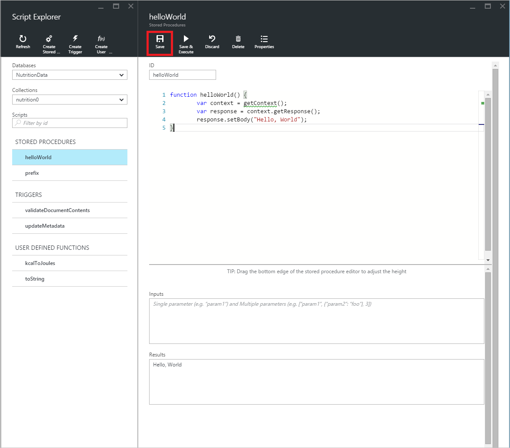

<properties
    pageTitle="DocumentDB Script Explorer, um editor de JavaScript | Microsoft Azure"
    description="Saiba mais sobre o DocumentDB Script Explorer, uma ferramenta de Portal Azure para gerenciar artefatos de programação de servidor do DocumentDB incluindo procedimentos armazenados, disparadores e funções definidas pelo usuário."
    keywords="editor de JavaScript"
    services="documentdb"
    authors="kirillg"
    manager="jhubbard"
    editor="monicar"
    documentationCenter=""/>

<tags
    ms.service="documentdb"
    ms.workload="data-services"
    ms.tgt_pltfrm="na"
    ms.devlang="na"
    ms.topic="article"
    ms.date="08/30/2016"
    ms.author="kirillg"/>

# Criar e executar procedimentos armazenados, disparadores e funções definidas pelo usuário usando o Explorador de Script DocumentDB

Este artigo fornece uma visão geral do Gerenciador de Script do [Microsoft Azure DocumentDB](https://azure.microsoft.com/services/documentdb/) , que é um editor de JavaScript no portal do Azure que permite que você exiba e execute artefatos de programação de servidor do DocumentDB incluindo procedimentos armazenados, disparadores e funções definidas pelo usuário. Leia mais sobre a programação de servidor de DocumentDB no artigo [procedimentos armazenados, disparadores de banco de dados e UDFs](documentdb-programming.md) .

## Iniciar o Script Explorer

1. No portal do Azure, em Jumpbar, clique em **DocumentDB (NoSQL)**. Se **DocumentDB contas** não estiver visível, clique em **Mais serviços** e clique em **DocumentDB (NoSQL)**.

2. No menu recursos, clique em **Gerenciador de Script**.

    
 
    As caixas de lista suspensa de **banco de dados** e **coleção** previamente são preenchidas dependendo do contexto em que você inicia o Script Explorer.  Por exemplo, se você iniciar de uma lâmina de banco de dados, o banco de dados atual é pré-populadas.  Se você iniciar da lâmina conjunto, coleção atual é pré-populadas.

4.  Use as caixas de lista suspensa de **banco de dados** e **conjunto** para alterar facilmente o conjunto do qual scripts atualmente estão sendo visualizadas sem precisar feche e abra novamente o Script Explorer.  

5. Script Explorer também dá suporte à filtragem o conjunto atualmente carregado de scripts por sua propriedade de id.  Basta digitar na caixa filtro e os resultados na lista Script Explorer são filtrados com base em critérios fornecidos.

    

    > [AZURE.IMPORTANT] O Script Explorer filtrar apenas filtros de funcionalidade do conjunto ***atualmente*** carregado de scripts e não atualizar automaticamente a coleção atualmente selecionada.

5. Para atualizar a lista de scripts carregados pelo Explorer de Script, basta clica no comando **Atualizar** na parte superior da lâmina.

    

## Criar, exibir e editar procedimentos armazenados, disparadores e funções definidas pelo usuário

Script Explorer permite executar operações CRUD em artefatos de programação de servidor de DocumentDB facilmente.  

- Para criar um script, basta clicar em aplicável no criar comando dentro do explorer de script, forneça uma id, digite o conteúdo do script e clique em **Salvar**.

    

- Ao criar um disparador, você também deve especificar a operação de tipo e gatilho de disparadores

    

- Para exibir um script, basta clicar o script em que você está interessado.

    

- Para editar um script, faça as alterações desejadas no JavaScript editor e clique em **Salvar**.

    

- Para descartar todas as alterações pendentes para um script, basta clicar no comando **Descartar** .

    

- Script Explorer também permite exibir as propriedades do sistema do script atualmente carregado facilmente clicando no comando **Propriedades** .

    

    > [AZURE.NOTE] A propriedade de carimbo de hora (_ts) internamente é representada por hora época, mas o Script Explorer exibe o valor em um formato de GMT legível humano.

- Para excluir um script, selecione-o no Explorador de Script e clique no comando **Excluir** .

    

- Confirme a ação de exclusão clicando em **Sim** ou cancelar a ação de exclusão, clicando em **não**.

    

## Executar um procedimento armazenado

> [AZURE.WARNING] Executar procedimentos armazenados no Explorador de Script ainda não é suportado para conjuntos de particionado do lado do servidor. Para obter mais informações, visite [Partitioning e dimensionamento em DocumentDB](documentdb-partition-data.md).

Script Explorer permite que você execute procedimentos armazenados do lado do servidor do portal do Azure.

- Ao abrir um novo blade de procedimento armazenado de criar, um script de padrão (*prefixo*) já será fornecido. Para executar o script de *prefixo* ou seu próprio script, adicione uma *id* e *entradas*. Para obter os procedimentos armazenados que aceitam vários parâmetros, todas as entradas devem estar dentro de uma matriz (por exemplo, *["foo", "barra"]*).

    

- Para executar um procedimento armazenado, basta clicar no comando **Salvar & executar** no painel do editor de scripts.

    > [AZURE.NOTE] O comando **Salvar e executar** salvará o procedimento armazenado antes de executar, o que significa que ele substituirá a versão salva anteriormente do procedimento armazenado.

- Bem-sucedida procedimento armazenado execuções terá um status *salvos com êxito e executado o procedimento armazenado* e resultados retornados serão preenchidos no painel de *resultados* .

    

- Se a execução encontrar um erro, o erro será preenchido no painel de *resultados* .

    

## Trabalhar com scripts fora do portal

O navegador de Script no portal do Azure é apenas uma maneira de trabalhar com procedimentos armazenados, disparadores e funções definidas pelo usuário no DocumentDB. Você também pode trabalhar com scripts usando a API REST e o [cliente SDKs](documentdb-sdk-dotnet.md). A documentação da API REST inclui exemplos para trabalhar com [usando o resto de procedimentos armazenados](https://msdn.microsoft.com/library/azure/mt489092.aspx), [usando o resto de funções definidas pelo usuário](https://msdn.microsoft.com/library/azure/dn781481.aspx)e [disparadores usando o restante](https://msdn.microsoft.com/library/azure/mt489116.aspx). Exemplos também estão disponível mostrando como [trabalhar com scripts usando c#](documentdb-dotnet-samples.md#server-side-programming-examples) e [trabalhar com scripts usando Node](documentdb-nodejs-samples.md#server-side-programming-examples).

## Próximas etapas

Saiba mais sobre a programação de servidor de DocumentDB no artigo [procedimentos armazenados, disparadores de banco de dados e UDFs](documentdb-programming.md) .

O [caminho de aprendizagem](https://azure.microsoft.com/documentation/learning-paths/documentdb/) também é um recurso útil para orientá-lo à medida que você aprender mais sobre DocumentDB.  
