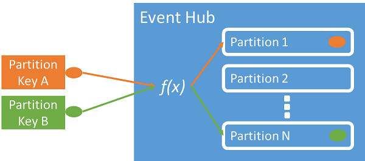

<properties 
    pageTitle="Visão geral de Hubs de evento Azure | Microsoft Azure"
    description="Introdução e visão geral de Hubs de evento do Azure."
    services="event-hubs"
    documentationCenter="na"
    authors="sethmanheim"
    manager="timlt"
    editor="" />
<tags 
    ms.service="event-hubs"
    ms.devlang="na"
    ms.topic="get-started-article"
    ms.tgt_pltfrm="na"
    ms.workload="na"
    ms.date="08/16/2016"
    ms.author="sethm" />

# Visão geral de Hubs de evento Azure

Muitas soluções modernas pretende para fornecer experiências de clientes adaptativa ou para aprimorar os produtos por meio de comentários contínuo e automatizada de telemetria. Essas soluções enfrentam o desafio de como grandes quantidades de informações de muitos editores simultâneas de processo de forma segura e confiável. Hubs de evento do Microsoft Azure é um serviço de plataforma gerenciada que fornece uma base para entrada de dados em grande escala em uma ampla variedade de cenários. Exemplos dessas situações são comportamento rastreamento de aplicativos móveis, informações de tráfego das web farms, captura de eventos de jogo em jogos de console, ou dados de telemetria coletados de máquinas industriais ou conectado veículos. A função comuns que Hubs de evento desempenha em arquiteturas de solução é que ele atua como a "porta frontal" para um pipeline de evento, normalmente chamada um *ingestor do evento*. Ingestor um evento é um componente ou serviço que fica entre fornecedores de evento e consumidores de evento desassociar a produção de um fluxo de evento do consumo dos eventos.

Azure Hubs de evento é um serviço que fornece o evento e telemetria ingresso na nuvem grande, em escala com alta confiabilidade e baixa latência de processamento de eventos. Esse serviço, usado com outros serviços downstream, é especialmente útil em situações de Internet das coisas (IoT), processamento de fluxo de trabalho ou de experiência do usuário e instrumentação do aplicativo. Hubs de evento fornece um recurso de manipulação de fluxo de mensagens e embora um Hub de evento é uma entidade semelhante a tópicos e filas, ela tem características que são muito diferentes dos corporativo tradicional de mensagens. Cenários de mensagens do Enterprise comumente requerem recursos sofisticados como sequência, letras de inatividade, suporte à transação e garantias de entrega forte, enquanto o problema dominante para entrada de evento é alta taxa de transferência e flexibilidade para fluxos de evento de processamento. Portanto, recursos de evento Hubs diferem dos tópicos do barramento de serviço em que eles são altamente viesados para produtividade alta e cenários de processamento de evento. Assim, Hubs de evento não implementar alguns dos recursos mensagens que estão disponíveis para tópicos. Se você precisar desses recursos, tópicos permanecem a melhor opção.

Um Hub de evento é criado no nível de namespace do evento Hubs, semelhante a tópicos e filas de barramento de serviço. Hubs de evento usa AMQP e HTTP como suas interfaces API principais. O diagrama a seguir mostra a relação entre Hubs de evento e barramento de serviço.

## Visão geral conceitual

Hubs de evento fornece mensagem streaming por meio de um padrão de consumidor particionada. Tópicos e filas usam um modelo de [Consumidor que competem](https://msdn.microsoft.com/library/dn568101.aspx) em que cada consumidor tenta ler a partir da mesma fila ou recurso. Nessa competição para recursos finalmente resulta em complexidade e limites de escala para aplicativos de processamento de fluxo. Hubs de evento usa um padrão de consumidor particionado em que cada consumidor lê somente um subconjunto específico, ou uma partição, de fluxo de mensagens. Esse padrão permite escala horizontal para processamento de evento e fornece outros recursos com foco em fluxo que estão indisponíveis nos tópicos e filas.

### Partições

Uma partição é uma sequência ordenada de eventos que é mantida em um Hub de evento. Como os eventos mais recentes chegam, eles são adicionados ao final desta sequência. Uma partição pode ser considerada como um "log de confirmação".

Partições mantêm dados por um período de retenção configurado que é definido no nível do Hub de evento. Esta configuração se aplica entre todas as partições em eventos Hub. Eventos expirarem periodicamente; Você não pode explicitamente excluí-los. Um Hub de evento contém várias partições. Cada partição é independente e contém sua própria sequência de dados. Como resultado, partições com frequência crescem com diferentes taxas.

O número de partições é especificado na hora de criação do Hub de evento e deve estar entre 2 e 32 (o padrão é 4). Partições são um mecanismo de organização de dados e mais estão relacionadas ao grau de paralelismo downstream necessário em outros programas de produtividade Hubs de evento. Isso torna a escolha do número de partições em um Hub de evento diretamente relacionados ao número de leitores simultâneos que você espera ter. Após a criação de Hub de evento, a contagem de partição não é pode ser alterada; Você deve considerar esse número em termos de longo prazo escala esperado. Você pode aumentar o limite de 32 partição, entrar em contato com a equipe do barramento de serviço.

Enquanto partições são identificáveis e podem ser enviadas à diretamente, é melhor evitar o envio de dados para partições específico. Em vez disso, você pode usar construções de nível superiores apresentadas nas seções [publisher de eventos](#event-publisher) e [Política do Publisher](#capacity-and-security) .

No contexto de Hubs de evento, mensagens citadas como *dados de evento*. Dados do evento contém o corpo do evento, um usuário definido bolsa de propriedade e vários metadados sobre o evento como seu deslocamento na partição e seu número na sequência de fluxo. Partições são preenchidas com uma sequência de dados do evento.

## Fornecedor de evento

Qualquer entidade que envia eventos ou dados a um Hub de evento é um *fornecedor de evento*. Fornecedores de evento podem publicar eventos usando HTTPS ou AMQP 1.0. Fornecedores de evento usam um token de assinatura de acesso compartilhado (SAS) identificam a um Hub de evento e pode ter uma identidade exclusiva, ou usar um token SAS comuns, dependendo dos requisitos do cenário.

Para obter mais informações sobre como trabalhar com SAS, consulte [Autenticação de assinatura de acesso compartilhado com barramento de serviço](../service-bus-messaging/service-bus-shared-access-signature-authentication.md).

### Tarefas comuns do publisher

Esta seção descreve as tarefas comuns para editores de eventos.

#### Adquirir um token SAS

Assinatura de acesso compartilhado (SAS) é o mecanismo de autenticação para Hubs de evento. Barramento de serviço fornece políticas SAS no namespace e no nível do Hub de evento. Um token SAS é gerado a partir de uma chave SAS e é um hash SHA de uma URL, codificado em um formato específico. Usando o nome da chave (política) e o token, barramento de serviço pode gerar o hash e, portanto, autenticar o remetente. Normalmente, tokens SAS para editores de eventos são criados com somente **Enviar** privilégios em um Hub de evento específico. Esse mecanismo de URL de token de SAS é a base para a identificação de fornecedor introduzida na política do publisher. Para obter mais informações sobre como trabalhar com SAS, consulte [Autenticação de assinatura de acesso compartilhado com barramento de serviço](../service-bus-messaging/service-bus-shared-access-signature-authentication.md).

#### Um evento de publicação

Você pode publicar um evento via AMQP 1.0 ou HTTPS. Barramento de serviço fornece uma classe [EventHubClient](https://msdn.microsoft.com/library/microsoft.servicebus.messaging.eventhubclient.aspx) para eventos de publicação a um Hub de eventos de clientes .NET. Para outras plataformas e tempos de execução, você pode usar qualquer cliente AMQP 1.0, como o [Apache Qpid](http://qpid.apache.org/). Você pode publicar eventos individualmente ou em lote. Uma única publicação (instância de dados do evento) tem um limite de 256KB, independentemente do fato de ela é um único evento ou um lote. Eventos maiores do que isso resulta em um erro de publicação. É uma prática recomendada para fornecedores para estar ciente das partições no Hub do evento e especificar apenas uma *chave de partição* (introduzido na próxima seção), ou sua identidade por meio de seu símbolo SAS.

A opção usar AMQP ou HTTPS é específica para o cenário de uso. AMQP requer a determinação de um soquete bidirecional persistente, além de transporte nível TLS (security) ou SSL/TLS. Isso pode ser uma operação cara em termos de tráfego de rede, mas só acontece no início de uma sessão de AMQP. HTTPS tem uma sobrecarga inicial inferior, mas exige SSL adicional de sobrecarga para cada solicitação. Para fornecedores que publica frequentemente eventos, AMQP oferece economia significativa de desempenho, latência e taxa de transferência.

### Chave da partição

Uma chave de partição é um valor que é usado para mapear dados de eventos de entrada em partições específicas para fins de organização de dados. A chave de partição é um valor fornecido pelo remetente passado a um Hub de evento. Ela é processada através de uma função de hash estática, o resultado de que cria a atribuição de partição. Se você não especificar uma chave de partição durante a publicação de um evento, uma atribuição de round robin é usada. Ao usar chaves de partição, o Editor de evento só é atento a sua chave de partição, não a partição à qual os eventos são publicados. Essa separação da chave e partição isola o remetente da necessidade de saber muito sobre o processamento de downstream e o armazenamento de eventos. Chaves de partição são importantes para organizar dados para processamento downstream, mas são bem relacionadas ao partições próprios. Um por dispositivo ou usuário exclusivo identidade compõe uma chave de partição boa, mas outros atributos como geografia também podem ser usado para agrupar eventos relacionados em uma única partição. A imagem a seguir mostra os remetentes de evento usando as teclas de partição para fixar a partições.

Hubs de evento garante que todos e quaisquer eventos compartilhando o mesmo valor de chave de partição são entregues em ordem e à mesma partição. Importante, se as chaves de partição são usadas com políticas do publisher, descritas na próxima seção, a identidade do Editor e o valor da chave de partição devem coincidir. Caso contrário, ocorrerá um erro.

### Consumidor de eventos

Qualquer entidade que lê dados de eventos de um Hub de evento é um consumidor de eventos. Todos os consumidores de evento ler o fluxo de eventos por meio de partições em um grupo de consumidor. Cada partição deve ter apenas um leitor de ativo por vez. Todos os consumidores de evento Hubs conexão via a sessão AMQP 1.0, no qual os eventos são entregues quando estiverem disponíveis. O cliente não precisa pesquisar para disponibilidade de dados.

#### Grupos do consumidor

O mecanismo de publicação/assinatura do evento Hubs está habilitado por meio de grupos do consumidor. Um grupo de consumidor é um modo de exibição (estado, posição ou deslocamento) de um Hub de evento inteira. Consumidor grupos habilitar vários aplicativos consumindo a cada têm um modo de exibição separado do fluxo de evento e ler o fluxo de maneira independente em seu próprio ritmo e com seus próprios compensações. Em um fluxo de arquitetura de processamento, cada aplicativo downstream equivale a um grupo de consumidor. Se desejar gravar dados de evento para armazenamento de longo prazo, esse aplicativo de gravador de armazenamento é um grupo de consumidor. Processamento de evento complexa é executado pelo grupo de consumidor do outro, separada. Você só pode acessar partições através de um grupo de consumidor. Sempre há um grupo de consumidor do padrão em um Hub de evento, e você pode criar até 20 grupos de consumidor para um nível padrão Hub de evento.

Estes são exemplos da convenção URI de grupo do consumidor:

    //<my namespace>.servicebus.windows.net/<event hub name>/<Consumer Group #1>
    //<my namespace>.servicebus.windows.net/<event hub name>/<Consumer Group #2>

A imagem a seguir mostra os consumidores de evento dentro de grupos de consumidor.

#### Fluxo desloca

Um deslocamento é a posição de um evento dentro de uma partição. Você pode pensar um deslocamento como um cursor do lado do cliente. O deslocamento é um byte numeração do evento. Isso permite que um consumidor de eventos (leitor) especificar um ponto em eventos de fluxo do qual deseja começar a ler eventos. Você pode especificar o deslocamento como um carimbo de hora ou como um valor de deslocamento. Os consumidores são responsáveis para armazenar seu próprios valores de deslocamento fora o serviço de Hubs de evento.

Dentro de uma partição, cada evento inclui um deslocamento. Esse deslocamento é usado pelos consumidores para mostrar o local na sequência de evento para uma determinada partição. Compensações podem ser passadas para o Hub de evento como um número ou como um valor de carimbo de hora quando um leitor se conecta.

#### Ponto de verificação

*Ponto de verificação* é um processo pelo qual leitores marcam ou confirmar sua posição em uma sequência de evento partição. Ponto de verificação é responsabilidade do consumidor e ocorre em uma base por partição dentro de um grupo de consumidor. Isso significa que para cada grupo de consumidor, cada leitor partição deve controlar de sua posição atual em eventos de fluxo e pode informar o serviço quando ele considera o fluxo de dados concluída. Se desconecta de um leitor de uma partição, quando se reconectar-começa a ler na verificação anteriormente foi enviada pelo leitor de última dessa partição desse grupo de consumidor. Quando o leitor se conecta, ela passa esse deslocamento para o Hub de evento para especificar o local em que deve começar a ler. Dessa forma, você pode usar o ponto de verificação para ambos os eventos de marcar como "concluído" por aplicativos downstream e fornecer resiliência em caso de um failover entre leitores em execução em máquinas diferentes. Como os dados de evento são mantidos para o intervalo de retenção especificado no momento que o Hub de evento for criado, é possível retornar ao dados antigos, especificando um deslocamento inferior desse processo de ponto de verificação. Por meio desse mecanismo, ponto de verificação permite failover resiliência e repetição de fluxo de evento controlado.

#### Tarefas comuns do consumidor

Esta seção descreve as tarefas comuns para consumidores de evento do evento Hubs ou leitores. Todos os consumidores de evento Hubs conexão via AMQP 1.0. AMQP 1.0 é uma sessão e o canal de comunicação bidirecional reconhecimento de estado. Cada partição tem uma sessão de link AMQP 1.0 que facilita o transporte de eventos separados por partição.

##### Conectar a uma partição

Para consumir eventos de um Hub de evento, um consumidor deve se conectar a uma partição. Conforme mencionado anteriormente, você sempre acessar partições através de um grupo de consumidor. Como parte do modelo do consumidor particionada, somente um único leitor deve estar ativo em uma partição em qualquer momento dentro de um grupo de consumidor. É prática comum ao conectar diretamente a partições para usar um mecanismo de leasing para coordenar conexões de leitor para partições específico. Dessa forma, é possível para cada partição em um grupo de consumidor para ter apenas um leitor de ativo. Gerenciar a posição na sequência de um leitor é uma tarefa importante que é alcançada por meio de ponto de verificação. Esta funcionalidade é simplificada, usando a classe [EventProcessorHost](https://msdn.microsoft.com/library/microsoft.servicebus.messaging.eventprocessorhost.aspx) para clientes .NET. [EventProcessorHost](https://msdn.microsoft.com/library/microsoft.servicebus.messaging.eventprocessorhost.aspx) é um agente de consumidor inteligente e está descrito na próxima seção.

##### Eventos de leitura

Depois de uma sessão de AMQP 1.0 e o link é aberto para uma partição específica, eventos são entregues ao cliente AMQP 1.0 pelo serviço Hubs de evento. Esse mecanismo de entrega permite maior produtividade e menor latência que mecanismos baseados em recepção como GET HTTP. Como eventos são enviados para o cliente, cada instância de dados do evento contém metadados importantes como o número de deslocamento e sequência que são usados para facilitar o ponto de verificação na sequência de eventos.

É sua responsabilidade para gerenciar esse deslocamento da maneira que melhor permite Gerenciando progresso no fluxo de processamento.

## Capacidade e segurança

Hubs de evento é uma arquitetura de paralela altamente escalável para ingresso do fluxo. Assim, há vários aspectos importantes a considerar ao dimensionar e dimensionamento uma solução baseada em Hubs de evento. O primeiro desses controles de capacidade é chamado de *unidades de produtividade*, descrito na seção a seguir.

### Unidades de produtividade

A capacidade de produtividade do evento Hubs é controlada pelo unidades de produtividade. Unidades de produtividade previamente são adquiridas unidades de capacidade. Uma unidade única produtividade inclui o seguinte:

- Ingresso: Até 1 MB por segundo ou 1000 eventos por segundo.

- Saída: Até 2 MB por segundo.

Ingresso está limitado à quantidade de capacidade fornecida pelo número de unidades de produtividade compradas. Enviando dados acima esta quantidade resulta em uma exceção "cota excedida". Esse valor é um dos 1 MB por segundo ou 1000 eventos por segundo, o que vier primeiro. Egresso não produz limitação exceções, mas está limitado à quantidade de transferência de dados fornecida para pelas unidades de produtividade comprados: 2 MB por segundo por unidade de produtividade. Se você recebe exceções de taxa de publicação ou esperava ver egresso maior Verifique quantas unidades de produtividade que foram compradas para o namespace no qual o Hub de evento foi criado. Para obter mais unidades de produtividade, você pode ajustar a configuração na página **Namespaces** na guia **escala** no [Azure portal clássico][]. Você também pode alterar essa configuração usando as APIs do Azure.

Enquanto partições são um conceito de organização de dados, unidades de produtividade são puramente um conceito de capacidade. Unidades de produtividade são cobradas por hora e são adquiridas por antecipação. Depois de adquirido, unidades de produtividade serão cobradas por um mínimo de uma hora. Até 20 produtividade unidades podem ser compradas para um namespace Hubs de evento e há um limite de conta do Microsoft Azure de 20 unidades de produtividade. Essas unidades de produtividade são compartilhadas entre todos os Hubs de evento em um determinado namespace.

Unidades de produtividade são provisionadas individualmente melhor esforço e podem não estar sempre disponíveis para compra imediata. Se você solicitar uma capacidade específico, é recomendável que você adquira as unidades de produtividade antecedência. Se você precisar de mais de 20 unidades de produtividade, você pode contatar o suporte Azure para adquirir mais unidades de produtividade em cada compromisso em blocos de 20, até as unidades de 100 produtividade primeira. Além disso, você também pode adquirir blocos de 100 unidades de produtividade.

É recomendável que você cuidadosamente saldo unidades de produtividade e partições para atingir ideal escala com Hubs de evento. Uma única partição tem uma escala máxima de unidade de uma taxa de transferência. O número de unidades de produtividade deve ser menor ou igual ao número de partições em um Hub de evento.

Para obter informações sobre preços, consulte [Preços de Hubs de evento](https://azure.microsoft.com/pricing/details/event-hubs/).

### Política do Publisher

Hubs de evento permite controle granular sobre fornecedores de eventos por meio de *políticas do publisher*. Políticas de fornecedor são um conjunto de recursos de tempo de execução projetados para facilitar a grandes números de fornecedores independentes de evento. Com políticas do publisher, cada publisher usa seu próprio identificador exclusivo ao publicar eventos a um Hub de evento, usando o mecanismo a seguir:

    //<my namespace>.servicebus.windows.net/<event hub name>/publishers/<my publisher name>

Você não precisa criar nomes de publisher antecedência, mas eles devem coincidir com o token SAS usado durante a publicação de um evento, para garantir identidades do publisher independente. Para obter mais informações sobre SAS, consulte [Autenticação de assinatura de acesso compartilhado com barramento de serviço](../service-bus-messaging/service-bus-shared-access-signature-authentication.md). Ao usar políticas do publisher, o valor de **PartitionKey** é definido como o nome do Editor. Para funcionar corretamente, esses valores devem coincidir.

## Resumo

Azure Hubs de evento fornece um evento de escala hyper e serviço que pode ser usado para o aplicativo e o usuário do fluxo de trabalho comum monitoramento em qualquer escala de processamento de telemetria. Com a capacidade de fornecer publicação assinatura recursos com baixa latência e grande, em escala Hubs de evento servir como "no painel de" para os dados de grande. Com identidade baseada no publisher e listas de revogação, esses recursos são estendidos em cenários comuns de Internet das coisas. Para obter mais informações sobre como desenvolver aplicativos de Hubs de evento, consulte o [guia de programação do evento Hubs](event-hubs-programming-guide.md).

## Próximas etapas

Agora que você aprendeu os conceitos de Hubs de evento, você pode mover em para os seguintes cenários:

- Comece com um [tutorial Hubs de evento].
- Um [aplicativo de exemplo que usa o evento Hubs]completo.

[Azure portal clássico]: http://manage.windowsazure.com
[Tutorial de Hubs de evento]: event-hubs-csharp-ephcs-getstarted.md
[aplicativo de exemplo que usa Hubs de evento]: https://code.msdn.microsoft.com/windowsazure/Service-Bus-Event-Hub-286fd097
