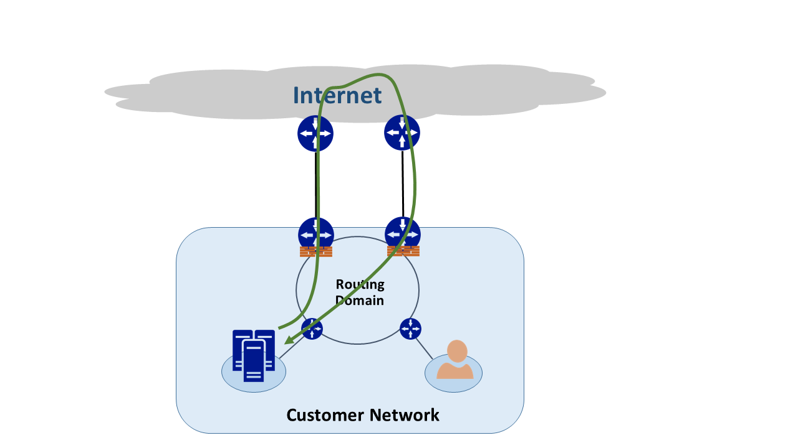

<properties
   pageTitle="Roteamento assimétricos | Microsoft Azure"
   description="Este artigo explica os problemas de que um cliente poderá enfrentar com roteamento assimétricos em uma rede que tem vários links para um destino."
   documentationCenter="na"
   services="expressroute"
   authors="osamazia"
   manager="carmonm"
   editor=""/>
<tags
   ms.service="expressroute"
   ms.devlang="na"
   ms.topic="get-started-article"
   ms.tgt_pltfrm="na"
   ms.workload="infrastructure-services"
   ms.date="10/10/2016"
   ms.author="osamazia"/>

# Roteamento assimétricos com vários caminhos de rede

Este artigo explica como encaminhar e retornar o tráfego de rede pode demorar rotas diferentes quando vários caminhos estiverem disponíveis entre destino e origem da rede.

É importante entender os dois conceitos entender roteamento assimétricos. Uma é o efeito de vários caminhos de rede. A outra é como dispositivos, como um firewall, manter o estado. Esses tipos de dispositivos são chamados de dispositivos com estado. Uma combinação desses dois fatores cria cenários na rede na qual o tráfego é descartado por um dispositivo com estado porque o dispositivo com informações de estado não detecta que tráfego se originou no próprio dispositivo.

## Vários caminhos de rede

Quando uma rede corporativa tem apenas um vínculo com a Internet por meio de seu provedor de serviços de Internet, todo o tráfego para e da Internet percorre o mesmo caminho. Muitas vezes, empresas compram vários circuitos, como caminhos redundantes, para melhorar o tempo de atividade de rede. Quando isso acontece, é possível que o tráfego que vai fora da rede, com a Internet, passa por um link e o tráfego de retorno vai através de um link diferente. Isso é conhecido como roteamento assimétricos. No roteamento assimétricos, o tráfego de rede inversa leva um caminho diferente do fluxo de original.

Embora ele ocorra principalmente na Internet, roteamento assimétricos também se aplica a outras combinações de vários caminhos. Ele se aplica, por exemplo, para um caminho de Internet e um caminho particular que ir para o mesmo destino e para vários caminhos particulares que ir para o mesmo destino.

Cada roteador ao longo da forma, de origem para o destino, calcula o melhor caminho para alcançar um destino. Determinação do roteador de melhor caminho possível é baseada em dois fatores principais:

-   Roteamento entre redes externas se baseia em um protocolo de roteamento, borda Gateway Protocol (BGP). BGP leva anúncios de vizinhos e executa por meio de uma série de etapas para determinar o melhor caminho para o destino pretendido. Ele armazena o melhor caminho em sua tabela de roteamento.
-   O comprimento de uma máscara de sub-rede associada a uma rota influencia caminhos de roteamento. Se um roteador recebe vários anúncios para o mesmo endereço IP, mas com máscaras de sub-rede diferentes, o roteador prefere o anúncio com uma máscara de sub-rede mais porque ele é considerado uma rota mais específica.

## Dispositivos com informações de estado

Roteadores examine o cabeçalho IP de um pacote para fins de roteamento. Alguns dispositivos procure ainda mais profundas dentro do pacote. Normalmente, esses dispositivos examine Layer4 (protocolo de controle de transmissão, ou TCP; ou protocolo de datagrama de usuário ou UDP), ou até mesmo Layer7 cabeçalhos (camada de aplicativos). Esses tipos de dispositivos são dispositivos de segurança ou de dispositivos de otimização de largura de banda. 

Um firewall é um exemplo comum de um dispositivo com estado. Um firewall permite ou nega um pacote para passar através das interfaces com base em vários campos como protocolo, porta TCP/UDP e cabeçalhos de URL. Esse nível de inspeção de pacote coloca um carga do dispositivo de processamento de pesado. Para melhorar o desempenho, o firewall analisa o primeiro pacote de um fluxo. Se ele permite que o pacote prosseguir, ele mantém as informações de fluxo em sua tabela de estado. Todos os pacotes subsequentes relacionados a esse fluxo são permitidos com base na determinação inicial. Um pacote que faz parte de um fluxo de existente pode chegar no firewall. Se o firewall não tem nenhuma informação de estado anterior sobre ele, o firewall descarta o pacote.

## Assimétricos roteamento com rota expressa

Quando você se conectar à Microsoft por meio de rota expressa do Azure, suas alterações de rede assim:

-   Você tem vários vínculos à Microsoft. Um link é sua conexão de Internet existente e a outra é via rota expressa. Algum tráfego para a Microsoft pode ir através da Internet, mas voltar via rota expressa, ou vice-versa.
-   Você receberá endereços IP mais específicos via rota expressa. Portanto, para o tráfego da sua rede à Microsoft para serviços oferecidos pelo rota expressa, roteadores sempre preferem rota expressa.

Para compreender o efeito que tem estas duas alterações em uma rede, vamos considerar alguns cenários. Como exemplo, você tem apenas um circuito à Internet e você consumir todos os serviços da Microsoft através da Internet. O tráfego de rede para Microsoft e voltar percorre o mesmo link de Internet e passa pelo firewall. O firewall registra o fluxo como ele vê o primeiro pacote e pacotes de retorno são permitidos porque o fluxo existe na tabela de estado.

Em seguida, você ativar a rota expressa e consumir serviços oferecidos pela Microsoft sobre rota expressa. Todos os outros serviços da Microsoft são consumidos pela Internet. Você pode implantar um firewall separado na sua borda que está conectada a rota expressa. Microsoft anuncia prefixos mais específicos à sua rede sobre rota expressa para serviços específicos. Sua infraestrutura de roteamento escolhe rota expressa como o caminho preferido para esses prefixos. Se você não é publicidade seus endereços IP públicos para a Microsoft pela rota expressa, Microsoft se comunica com seus endereços IP públicos através da Internet. Encaminhar o tráfego da sua rede para a Microsoft usa rota expressa e inverso tráfego da Microsoft usa a Internet. Quando o firewall na borda vê um pacote de resposta para um fluxo de que ele não encontra na tabela de estado, ele descarta o tráfego de retorno.

Se você optar por usar o mesmo pool de NAT (conversão) de endereços de rede para rota expressa e para a Internet, você verá problemas semelhantes com os clientes em sua rede em endereços IP particulares. Solicitações de serviços como o Windows Update entrar pela Internet porque os endereços IP para esses serviços não são anunciados via rota expressa. No entanto, o tráfego de retorno volta pelo rota expressa. Se a Microsoft recebe um endereço IP com a mesma máscara de sub-rede da Internet e rota expressa, ele prefere rota expressa pela Internet. Se um firewall ou outro dispositivo com informações de estado que está em sua borda de rede e opostas rota expressa não possui anteriores informações sobre o fluxo, ele descarta os pacotes que pertençam a esse fluxo.

## Soluções de roteamento assimétricas

Você tem duas opções principais para resolver o problema de roteamento assimétricos. Uma é por meio de roteamento e a outra é usando NAT baseada na origem (SNAT).

### Roteamento

Certifique-se de que seus endereços IP públicos são anunciados para links de WAN (rede) de longa distância apropriada. Por exemplo, se você quiser usar a Internet para o tráfego de autenticação e rota expressa para tráfego de seu email, você não deve anunciar seus serviços de Federação do Active Directory (AD FS) os endereços IP públicos por rota expressa. Da mesma forma, certifique-se de não expõem um local servidor do AD FS para endereços IP que o roteador recebe pela rota expressa. Rotas recebidas pela rota expressa são mais específicas para que eles fazem rota expressa o caminho preferencial tráfego de autenticação de Microsoft. Isso faz com que o roteamento assimétricos.

Se você quiser usar rota expressa para autenticação, verifique se você está anunciando endereços IP públicos do AD FS sobre rota expressa sem NAT. Dessa forma, o tráfego que se origina da Microsoft e vai para um local servidor do AD FS apresenta rota expressa. Tráfego de retorno do cliente para a Microsoft usa rota expressa porque é a rota preferencial pela Internet.

### NAT baseada na origem

Outra maneira de resolver problemas de roteamento assimétricos é usando SNAT. Por exemplo, você não tiver anunciado o endereço IP público de um servidor de SMTP Simple Mail Transfer Protocol () no local pela rota expressa porque você pretende usar na Internet para esse tipo de comunicação. Uma solicitação que se origina com a Microsoft e, em seguida, vai para o servidor de SMTP local percorre a Internet. Você SNAT a solicitação de entrada para um endereço IP interno. Tráfego reverso do servidor SMTP vai para o borda firewall (que você usar para NAT) em vez de por meio de rota expressa. O tráfego de retorno volta através da Internet.

## Detecção de roteamento assimétrica

Traceroute é a melhor maneira de certificar-se de que o tráfego de rede cruza o caminho esperado. Se você espera tráfego do seu servidor de SMTP local à Microsoft para fazer o caminho de Internet, o traceroute esperado é do servidor SMTP para o Office 365. O resultado valida que tráfego é realmente saiam da sua rede em direção a Internet e não em direção a rota expressa.
