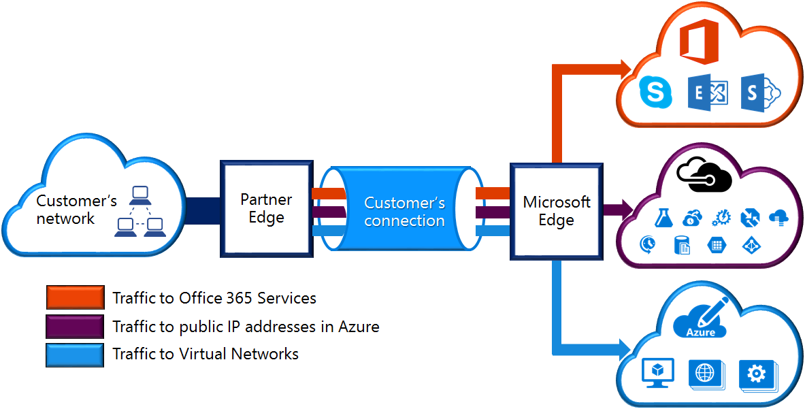

<properties 
   pageTitle="Rota expressa circuitos e domínios de roteamento | Microsoft Azure"
   description="Esta página fornece uma visão geral de rota expressa circuitos e os domínios de roteamento."
   documentationCenter="na"
   services="expressroute"
   authors="cherylmc"
   manager="carmonm"
   editor=""/>
<tags 
   ms.service="expressroute"
   ms.devlang="na"
   ms.topic="article" 
   ms.tgt_pltfrm="na"
   ms.workload="infrastructure-services" 
   ms.date="10/10/2016"
   ms.author="cherylmc"/>

# Rota expressa circuitos e domínios de roteamento

 Você deve solicitar um *circuito de rota expressa* para se conectar a sua infraestrutura de locais à Microsoft através de um provedor de conectividade. A figura a seguir fornece uma representação lógica de conectividade entre sua WAN e da Microsoft.

## Rota expressa circuitos

Um *circuito de rota expressa* representa uma conexão lógica entre sua infraestrutura de local e serviços de nuvem da Microsoft através de um provedor de conectividade. Você pode solicitar vários circuitos rota expressa. Cada circuito pode ser nas regiões iguais ou diferentes e pode ser conectado a seus locais através de provedores de conectividade diferente. 

Rota expressa circuitos não mapeada para qualquer entidades físicas. Um circuito é identificado exclusivamente por um padrão de que GUID chamado como uma chave de serviço (s-chave). A chave do serviço é a única informação trocados entre o Microsoft, o provedor de conectividade e você. A tecla s não é um segredo para fins de segurança. Não há um mapeamento 1:1 entre um circuito de rota expressa e a s-chave.

Um circuito de rota expressa pode ter até três peerings independentes: Azure particular público, Azure e da Microsoft. Cada correspondência é um par de BGP independente sessões cada um deles redundante configurado para alta disponibilidade. Não há 1: n (1 < = N < = 3) mapeamento entre um circuito de rota expressa e roteamento de domínios. Um circuito de rota expressa pode ter qualquer um, dois ou todos os três peerings habilitados por rota expressa circuito.
 
Cada circuito tem uma largura de banda fixa (50 Mbps, 100 Mbps, 200 Mbps, 500 Mbps, 1 Gbps, 10 Gbps) e é mapeado para um provedor de conectividade e um local de correspondência. A largura de banda você seleciona é ser compartilhadas entre todos os peerings para o circuito. 

### Cotas, limites e limitações

Limites e cotas padrão se aplicam para cada circuito rota expressa. Consulte a página [assinatura do Azure e limites de serviço, cotas e restrições](../azure-subscription-service-limits.md) para obter informações atualizadas sobre cotas.

## Rota expressa domínios de roteamento

Um circuito de rota expressa tiver vários domínios de roteamento associados a ele: Azure particular público, Azure e da Microsoft. Cada um dos domínios roteamento está configurada de forma idêntica em um par de roteadores (ativa ou compartilhamento de carga configuração) para alta disponibilidade. Os serviços do Azure são categorizados como *Azure pública* e *privada do Azure* para representar o esquemas de endereçamento de IP.

### Correspondência particular

Serviços, ou seja máquinas virtuais (IaaS) de computação do Azure e serviços de nuvem (PaaS), que são implantados dentro de uma rede virtual podem ser conectados por meio do domínio aos particular. O domínio de correspondência particular é considerado uma extensão de confiável da sua rede de núcleo em Microsoft Azure. Você pode configurar a conectividade bidirecional entre sua rede principal e redes virtuais Azure (VNets). Esta correspondência permite conectar-se a máquinas virtuais e serviços diretamente em seus endereços IP privados em nuvem.  

Você pode conectar mais de uma rede virtual privada domínio aos. Revise a [página de perguntas Frequentes](expressroute-faqs.md) para obter informações sobre limitações e limites. Você pode visitar a página [assinatura do Azure e limites de serviço, cotas e restrições](../azure-subscription-service-limits.md) para obter informações atualizadas sobre os limites.  Consulte a página de [Roteamento](expressroute-routing.md) para obter informações detalhadas sobre a configuração de roteamento.

### Correspondência pública

Serviços como o armazenamento do Azure, bancos de dados SQL e sites são oferecidos em endereços IP públicos. Em particular, você pode conectar aos serviços hospedados em endereços IP públicos, incluindo VIPs dos seus serviços de nuvem, por meio do domínio de roteamento aos público. Você pode conectar-se aos domínio público a sua DMZ e conectar todos os serviços do Azure em seus endereços IP públicos de sua WAN sem precisar se conectar pela internet. 

Conectividade é sempre iniciada de sua WAN nos serviços do Microsoft Azure. Os serviços do Microsoft Azure não será capazes de iniciar conexões na sua rede por meio desse domínio de roteamento. Quando a correspondência público estiver ativada, você poderá conectar-se a todos os serviços do Azure. Podemos não permitem que você escolha seletivamente para os quais nós anunciar rotas para os serviços. Você pode examinar a lista de prefixos que podemos anunciar a você por meio dessa correspondência na página de [Intervalos de IP do Microsoft Azure data center](http://www.microsoft.com/download/details.aspx?id=41653) . A página é atualizada semanalmente.

Você pode definir filtros de rota personalizada dentro de sua rede para consumir apenas as rotas que você precisa. Consulte a página de [Roteamento](expressroute-routing.md) para obter informações detalhadas sobre a configuração de roteamento. Você pode definir filtros de rota personalizada dentro de sua rede para consumir apenas as rotas que você precisa. 

Consulte a [página de perguntas Frequentes](expressroute-faqs.md) para obter mais informações nos serviços de suporte através do domínio de roteamento aos público. 
 
### Microsoft correspondência

[AZURE.INCLUDE [expressroute-office365-include](../../includes/expressroute-office365-include.md)]

Conectividade com todos os outros Microsoft online services (como serviços do Office 365) será através do Microsoft correspondência. Nós permitem conectividade bidirecional entre os serviços de nuvem WAN e Microsoft através do domínio de roteamento aos Microsoft. Você deve se conectar aos serviços de nuvem da Microsoft somente por endereços IP públicos pertencentes a você ou o seu provedor de conectividade e você deve atender a todas as regras definidas. Consulte a página de [pré-requisitos de rota expressa](expressroute-prerequisites.md) para obter mais informações.

Consulte a [página de perguntas Frequentes](expressroute-faqs.md) para mais informações sobre serviços de suporte, custos e detalhes de configuração. Consulte a página de [Locais de rota expressa](expressroute-locations.md) para obter informações sobre a lista de provedores de conectividade oferece suporte aos Microsoft.

## Comparação de domínio de roteamento

A tabela a seguir compara os três domínios de roteamento.

||**Correspondência particular**|**Correspondência pública**|**Microsoft correspondência**|
|---|---|---|---|
|**Máx. prefixos # suportados por correspondência**|4000 por padrão, 10.000 com rota expressa Premium|200|200|
|**Intervalos de endereços IP com suporte**|Qualquer endereço IPv4 válido dentro de sua WAN.|Endereços IPv4 públicos pertencentes a você ou o seu provedor de conectividade.|Endereços IPv4 públicos pertencentes a você ou o seu provedor de conectividade.|
|**COMO os requisitos de número**|Particular e público como números. Você deve ser proprietário público como número, se você optar por usar um. | Particular e público como números. No entanto, você deve comprovar sua propriedade de endereços IP públicos.| Particular e público como números. No entanto, você deve comprovar sua propriedade de endereços IP públicos.|
|**Endereços de IP de Interface de roteamento**|RFC1918 e público endereços IP|Endereços IP públicos registrados para você no roteamento de registros.| Endereços IP públicos registrados para você no roteamento de registros.|
|**Suporte de Hash MD5**| Sim|Sim|Sim|

Você pode optar por habilitar um ou mais dos domínios roteamento como parte das sua circuito rota expressa. Você pode optar por ter todos os domínios de roteamento colocados na mesma VPN se quiser combiná-los em um único domínio de roteamento. Você também pode colocá-los em domínios de roteamento diferentes, semelhantes ao diagrama. A configuração recomendada é que correspondência particular está conectado diretamente à rede principal e o público e links da Microsoft estão conectados à sua DMZ.
 
Se você optar por deixar todos os três sessões de correspondência, você deve ter três pares de sessões de BGP (um par para cada tipo de correspondência). Os pares de sessão BGP fornecem um link altamente disponível. Se você estiver se conectando através de provedores de conectividade 2 de camada, você será responsável por configurar e gerenciar o roteamento. É possível saber mais examinando os [fluxos de trabalho](expressroute-workflows.md) para configurar a rota expressa.

## Próximas etapas

- Encontre um provedor de serviço. Consulte [provedores de serviços de rota expressa e locais](expressroute-locations.md).
- Certifique-se de que todos os pré-requisitos forem atendidos. Consulte [rota expressa pré-requisitos](expressroute-prerequisites.md).
- Configure sua conexão de rota expressa.
    - [Criar um circuito de rota expressa](expressroute-howto-circuit-classic.md)
    - [Configurar o roteamento (circuito peerings)](expressroute-howto-routing-classic.md)
    - [Vincular um VNet a um circuito de rota expressa](expressroute-howto-linkvnet-classic.md)
