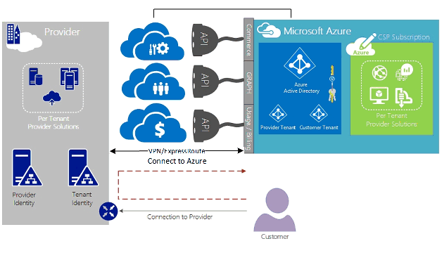
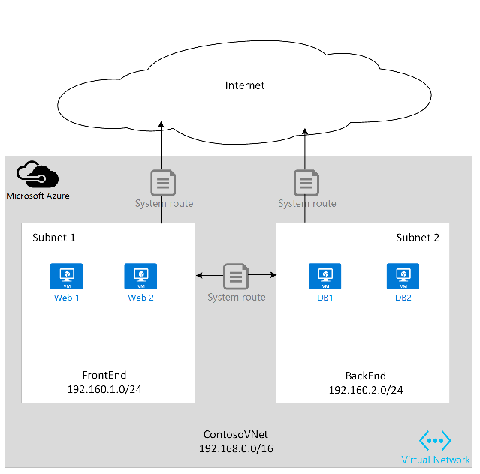

<properties
   pageTitle="Rota expressa do Azure para provedores de solução de nuvem | Microsoft Azure"
   description="Este artigo fornece informações para provedores de serviços de nuvem que desejar incorporar serviços do Azure e rota expressa em suas ofertas."
   documentationCenter="na"
   services="expressroute"
   authors="richcar"
   manager="carmonm"
   editor=""/>
<tags
   ms.service="expressroute"
   ms.devlang="na"
   ms.topic="get-started-article"
   ms.tgt_pltfrm="na"
   ms.workload="infrastructure-services"
   ms.date="10/10/2016"
   ms.author="richcar"/>

# Rota expressa para provedores de solução de nuvem (CSP)

Microsoft fornece serviços de escala Hyper para revendedores tradicionais e distribuidores (CSP) poder provisionar rapidamente novos serviços e soluções para seus clientes sem a necessidade de investir no desenvolvimento esses novos serviços. Para permitir que o provedor de solução de nuvem (CSP) a capacidade de gerenciar diretamente esses novos serviços, a Microsoft fornece APIs que permitem que o CSP gerenciar recursos do Microsoft Azure em nome de seus clientes e programas. Um desses recursos é rota expressa. Rota expressa permite que o CSP conectar recursos existentes do cliente ao Azure services. Rota expressa é um link de comunicação privada de alta velocidade aos serviços no Azure. 

ExpresRoute é composta por um par de circuitos para alta disponibilidade que são anexados a uma único cliente inscrições e não podem ser compartilhados por vários clientes. Cada circuito deve ser terminado em um roteador diferente para manter a alta disponibilidade.

>[AZURE.NOTE] Há caps de largura de banda e conexão rota expressa que significa que grandes/complexo implementações exigirá vários circuitos rota expressa para um único cliente.

Microsoft Azure fornece um número crescente de serviços que você pode oferecer aos seus clientes.  Para melhor tirar proveito desses serviços será necessário usar conexões de rota expressa para fornecer alta velocidade baixa acesso de latência ao ambiente do Microsoft Azure.

## Gerenciamento do Microsoft Azure
A Microsoft fornece provedores com APIs para gerenciar as assinaturas de cliente Azure permitindo programação integração com seus próprios sistemas de gerenciamento de serviço. Recursos compatíveis de gerenciamento podem ser encontrados [aqui](https://msdn.microsoft.com/library/partnercenter/dn974944.aspx).

## Gerenciamento de recursos do Microsoft Azure
Dependendo do contrato com seu cliente determinará a como a assinatura será gerenciada. O CSP diretamente pode gerenciar a criação e manutenção de recursos ou o cliente pode manter o controle da assinatura do Microsoft Azure e criar os recursos Azure conforme necessário. Se seu cliente gerencia a criação de recursos em suas assinaturas do Microsoft Azure eles usarão um dos dois modelos: "Conectar-Through" modelo, ou "Direct-a". Esses modelos são descritos detalhadamente nas seções a seguir.  

### Conectar-se através de modelo

  

No modelo conectar-through, o CSP cria uma conexão direta entre o data center e sua assinatura do cliente Azure. A conexão direta é feita usando rota expressa, conectando a sua rede com o Azure. Seu cliente se conecta à sua rede. Esse cenário requer que o cliente passa pela rede CSP para acessar os serviços do Azure. 

Se seu cliente tiver outras assinaturas Azure não gerenciadas por você, elas usaria Internet pública ou sua próprias conexão particular para se conectar desses serviços provisionados sob a assinatura CSP não. 

Para CSP Gerenciando serviços Azure, ele será considerado que o CSP tem um armazenamento de identidade de cliente estabelecida anteriormente que poderia ser replicado para o Active Directory do Azure para o gerenciamento de suas assinaturas de CSP por meio de Administrate-On-Behalf-Of (AOBO). Principais fatores para esse cenário incluem onde um determinado parceiro ou o provedor de serviços tem uma relação estabelecida com o cliente, o cliente está consumindo serviços de provedor no momento ou o parceiro tem um desejo fornecer uma combinação das soluções de provedor hospedado e hospedados Azure para fornecer flexibilidade e o cliente de endereço desafios que não podem ser atendidos pelo CSP sozinho. Este modelo é ilustrado na **Figura**, abaixo.

### Conectar-se ao modelo

No modelo de conectar-se a, o provedor de serviço cria uma conexão direta entre o data center de seus clientes e a assinatura do Azure CSP provisionado usando rota expressa através do cliente (cliente) rede.

>[AZURE.NOTE] Para rota expressa o cliente precisaria criar e manter o circuito rota expressa.  

Esse cenário de conectividade requer que o cliente conecta-se diretamente por meio de uma rede do cliente para acessar a assinatura do Azure CSP gerenciados, usando uma conexão de rede direta que é criado, pertencente e gerenciado todo ou em parte pelo cliente. Para esses clientes que presume-se que o provedor não tem atualmente estabelecido um armazenamento de identidade do cliente e o provedor poderia ajudar o cliente em replicar o seu armazenamento de identificar atual para o Active Directory do Azure para o gerenciamento de sua assinatura através de AOBO. Principais fatores para esse cenário incluem onde um determinado parceiro ou o provedor de serviços tem uma relação estabelecida com o cliente, o cliente está consumindo serviços de provedor no momento ou o parceiro tem um desejo fornecer serviços que são baseados exclusivamente em hospedados Azure soluções sem a necessidade de um data center de provedor existente ou infraestrutura.

A escolha entre essas duas opção são baseados nas necessidades de seu cliente e sua necessidade atual para fornecer os serviços do Azure. Controlam os detalhes desses modelos e o acesso baseado em função associado, rede e padrões de design de identidade são descritas detalhes nos links a seguir:
-   **Controle de acesso baseado da função (RBAC)** – RBAC baseia-se no Active Directory do Azure.  Para obter mais informações sobre Azure RBAC consulte [aqui](../active-directory/role-based-access-control-configure.md).
-   **Rede** – aborda os vários tópicos das redes no Microsoft Azure.
-   **Azure Active Directory (AAD)** – AAD fornece o gerenciamento de identidades do Microsoft Azure e 3º aplicativos SaaS de festa. Para obter mais informações sobre, consulte Azure AD [aqui](https://azure.microsoft.com/documentation/services/active-directory/).  

## Velocidades da rede
Rota expressa suporta velocidades de rede de 50 Mb/s para 10Gb/s. Isso permite aos clientes adquirir a quantidade de largura de banda de rede necessária para seu ambiente exclusivo.

>[AZURE.NOTE] Largura de banda de rede pode ser aumentada conforme necessário, sem interromper as comunicações, mas para reduzir a rede velocidade requer subdividir o circuito e recriá-lo com a velocidade de rede inferior.  

Rota expressa é compatível com a conexão de vários vNets para um único circuito de rota expressa para melhor utilização das conexões de alta velocidade. Um único circuito de rota expressa pode ser compartilhado entre várias assinaturas Azure pertencentes o mesmo cliente.

## Configurando a rota expressa
Rota expressa pode ser configurada para oferecer suporte a três tipos de tráfego ([domínios de roteamento](#ExpressRoute-routing-domains)) sobre um único circuito de rota expressa. Esse tráfego é separado em Microsoft correspondência, correspondência público Azure e correspondência particular. Você pode escolher um ou todos os tipos de tráfego para ser enviado por meio de um único circuito de rota expressa ou use vários circuitos rota expressa dependendo do tamanho da rota expressa circuito e isolamento requerido pelo seu cliente. A postura de segurança do cliente pode não permitir o tráfego público e privada percorrer o mesmo circuito.

### Conectar-se através de modelo
Em uma configuração através de conectar a você será responsável por todas as redes bases conectem seus recursos de análise de clientes as assinaturas hospedadas no Azure. Cada um do cliente que deseja usar recursos Azure precisará seu próprios conexão rota expressa, que será gerenciado por você. Você usará os mesmos métodos que o cliente usaria para adquirir o circuito rota expressa. Você seguirá as mesmas etapas descritas no artigo [fluxos de trabalho de rota expressa](./expressroute-workflows.md) para provisionamento de circuito e estados de circuito. Em seguida, você irá configurar as rotas de protocolo de Gateway de borda (BGP) para controlar o tráfego fluindo entre a rede local e vNet Azure.

### Conectar-se ao modelo
Em uma configuração de conectar-se a, ou seu cliente já tem uma conexão existente para o Azure iniciará uma conexão para o provedor de serviços de internet vinculação rota expressa do data center do cliente diretamente para o Azure, em vez de seu data center. Para começar o processo de provisionamento, seu cliente seguirá as etapas, conforme descrito no modelo conectar-Through, acima. Depois que o circuito foi estabelecido que seu cliente será necessário configurar os roteadores locais para poder acessar sua rede e o Azure vNets.

Você pode ajudá-lo com configurar a conexão e definir as rotas para permitir que os recursos de seu datacenter(s) para se comunicar com os recursos de cliente no seu data center ou com os recursos hospedados no Azure.

## Rota expressa domínios de roteamento
Rota expressa oferece três domínios roteamento: públicas, particulares e Microsoft correspondência. Cada um dos domínios roteamento são configurados com roteadores idênticos na configuração ativa para alta disponibilidade. Para obter mais detalhes sobre rota expressa domínios de roteamento procure [aqui](./expressroute-circuit-peerings.md).

Você pode definir filtros de rotas personalizadas para permitir que apenas o route(s) que você deseja permitir ou necessário. Para obter mais informações ou para ver como fazer essas alterações consulte artigo: [criar e modificar o roteamento para um circuito de rota expressa usando o PowerShell](./expressroute-howto-routing-classic.md) para obter mais detalhes sobre o roteamento de filtros.

>[AZURE.NOTE] Para Microsoft e correspondência público conectividade deve ser apesar um endereço IP público pertencente ao cliente ou CSP e deve seguir todas as regras definidas. Para obter mais informações, consulte a página de [Rota expressa pré-requisitos](expressroute-prerequisites.md) .  

## Roteamento
Rota expressa conecta as redes Azure por meio do Gateway de rede Virtual do Azure. Os gateways de rede oferecem roteamento para redes virtuais Azure.

Criar redes virtuais Azure também cria uma tabela de roteamento padrão para o vNet direcionar o tráfego de/para as sub-redes da vNet. Se a tabela de rota padrão é insuficiente para a solução personalizada rotas podem ser criadas para rotear o tráfego de saída para dispositivos personalizados ou rotas de bloco para sub-redes específicas ou redes externas.

### Roteamento padrão
A tabela de rota padrão inclui as seguintes rotas:

- Roteamento dentro de uma sub-rede
- -Sub-redes dentro da rede virtual
- Com a Internet
- Rede virtual de rede-para-virtual usando o gateway VPN
- Rede virtual de rede-para-local usando um gateway VPN ou rota expressa

  

### Roteamento definidos pelo usuário (UDR)
Rotas definidas pelo usuário permitem que o controle de tráfego de saída da sub-rede atribuída para outras sub-redes na rede virtual ou sobre um dos outros gateways predefinidos (rota expressa; internet ou VPN). A tabela de roteamento de sistema padrão pode ser substituída por uma tabela de roteamento definidas pelo usuário que substitui a tabela de roteamento padrão com rotas personalizadas. Com o roteamento de definidas pelo usuário, clientes podem criar rotas específicas para dispositivos como firewalls ou dispositivos de detecção de intrusos ou bloquear o acesso para sub-redes específicas da sub-rede hospedagem a rota definidos pelo usuário. Para obter uma visão geral de rotas de definidas pelo usuário procure [aqui](../virtual-network/virtual-networks-udr-overview.md). 

## Segurança
Dependendo de qual modelo está em uso, conectar-se a ou conectar-Through, ou seu cliente define as políticas de segurança em seu vNet fornece a segurança requisitos de política para o CSP para definir para seus vNets. Os seguintes critérios de segurança podem ser definidos:

1.  **Isolamento de cliente** — plataforma do Azure fornece isolamento de cliente armazenando informações de identificação do cliente e vNet em um banco de dados seguro, o que seja usado para tráfego de cada cliente em um túnel GRE.
2.  Regras de **Grupo de segurança de rede (NSG)** são para definir o tráfego permitido dentro e fora das sub-redes dentro vNets no Azure. Por padrão, o NSG contêm regras de bloco para bloquear o tráfego da Internet para o vNet e permitir regras para tráfego dentro de um vNet. Para obter mais informações sobre grupos de segurança de rede procure [aqui](https://azure.microsoft.com/blog/network-security-groups/).
3.  **Forçar túnel** — essa é uma opção para redirecionar o tráfego de internet vinculado no Azure para ser redirecionado sobre a conexão de rota expressa ao Data Center no local de origem. Para obter mais informações sobre forçada túnel procure [aqui](./expressroute-routing.md#advertising-default-routes).  

4.  **Criptografia** — apesar dos circuitos rota expressa são dedicados a um cliente específico, existe a possibilidade de que o provedor de rede pode ser violado, permitindo um intrusos examinar o tráfego de pacote. Para resolver esse potencial, um cliente ou CSP pode criptografar o tráfego sobre a conexão definindo diretivas de modo de túnel para todo o tráfego fluindo entre ativar recursos de locais e Azure recursos (consulte o modo de túnel IPSec opcional para cliente 1 na Figura 5: segurança de rota expressa, acima). A segunda opção seria usar um dispositivo de firewall em cada o ponto de extremidade do circuito rota expressa. Isso exigirá VMs/eletrodomésticos para ser instalado em ambas as extremidades para criptografar o tráfego sobre o circuito rota expressa de firewall de terceiros 3º adicionais.

  

## Próximas etapas
O serviço de provedor de soluções de nuvem oferece uma maneira de aumentar seu valor aos seus clientes sem a necessidade de aquisições caras de infraestrutura e capacidade, mantendo sua posição como provedor de terceirização principal. Integração perfeita com o Microsoft Azure pode ser feita por meio da API de CSP, permitindo que você integrar o gerenciamento do Microsoft Azure dentro de suas estruturas de gerenciamento existentes.  

Informações adicionais podem ser encontradas nos seguintes links:

[Programa Microsoft Cloud Solution Provider](https://partner.microsoft.com/en-US/Solutions/cloud-reseller-overview).  
[Prepare-se para transact como um provedor de solução de nuvem](https://partner.microsoft.com/en-us/solutions/cloud-reseller-pre-launch).  
[Recursos de provedor de soluções do Microsoft Cloud](https://partner.microsoft.com/en-us/solutions/cloud-reseller-resources).
