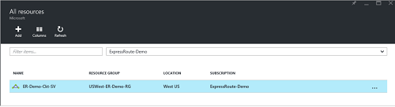

<properties
   pageTitle="Criar e modificar um circuito de rota expressa usando o Gerenciador de recursos e o portal do Azure | Microsoft Azure"
   description="Este artigo descreve como criar, provisionar, verifique se, atualizar, excluir e desprovisionamento um circuito de rota expressa."
   documentationCenter="na"
   services="expressroute"
   authors="cherylmc"
   manager="carmonm"
   editor=""
   tags="azure-resource-manager"/>
<tags
   ms.service="expressroute"
   ms.devlang="na"
   ms.topic="article"
   ms.tgt_pltfrm="na"
   ms.workload="infrastructure-services"
   ms.date="10/10/2016"
   ms.author="cherylmc"/>

# Criar e modificar um circuito de rota expressa

> [AZURE.SELECTOR]
[Portal Azure - Gerenciador de recursos](expressroute-howto-circuit-portal-resource-manager.md)
[PowerShell - Gerenciador de recursos](expressroute-howto-circuit-arm.md)
[PowerShell - clássico](expressroute-howto-circuit-classic.md)

Este artigo descreve como criar um circuito de rota expressa do Azure usando o portal do Azure e o modelo de implantação do Gerenciador de recursos do Azure. As seguintes etapas mostram como verificar o status do circuito, atualizá-lo, ou excluir e desprovisione-lo.

**Sobre os modelos de implantação do Azure**

[AZURE.INCLUDE [vpn-gateway-clasic-rm](../../includes/vpn-gateway-classic-rm-include.md)] 

## Antes de começar

- Examine os [pré-requisitos](expressroute-prerequisites.md) e [fluxos de trabalho](expressroute-workflows.md) antes de começar a configuração.
- Certifique-se de que você tenha acesso ao [portal do Azure](https://portal.azure.com).
- Certifique-se de que você tem permissões para criar novos recursos de rede. Contate o administrador da sua conta se você não tem as permissões corretas.

## Criar e provisionar um circuito de rota expressa

### 1. entrar no portal do Azure

Em um navegador, navegue até o [portal do Azure](http://portal.azure.com) e entre com sua conta do Azure.

### 2. Crie um novo circuito de rota expressa

>[AZURE.IMPORTANT] Seu circuito rota expressa será cobrado no momento em que uma chave de serviço é emitida. Certifique-se de que você executar essa operação quando o provedor de conectividade está pronto para provisionar o circuito.

1. Você pode criar um circuito de rota expressa selecionando a opção para criar um novo recurso. Clique em **novo** > **rede** > **rota expressa**, conforme mostrado na imagem a seguir:

    

2. Depois de clicar **rota expressa**, você verá a lâmina de **circuito de rota expressa criar** . Quando você estiver preenchendo os valores neste blade, certifique-se de que você especificar o nível SKU correto e monitoração de dados.

    - **Camada** determina se um padrão de rota expressa ou um complemento de premium rota expressa está ativado. Você pode especificar **padrão** para obter o SKU ou **Premium** padrão para o complemento premium.

    - **Monitoração de dados** determina o tipo de cobrança. Você pode especificar **limitadas** para um plano de dados limitada e **ilimitado** para um plano de dados ilimitado. Observe que você pode alterar o tipo de cobrança da **limitadas** para **ilimitado**, mas você não pode alterar o tipo de **ilimitado** para **limitadas**.

    

>[AZURE.IMPORTANT] Esteja ciente de que o local de correspondência indica o [local físico](expressroute-locations.md) onde você é correspondência com a Microsoft. Isso **não** está vinculado a propriedade de "Local", que se refere a geografia onde se encontra o provedor de recursos de rede do Azure. Enquanto eles não estão relacionados, é uma boa prática para escolher um provedor de recursos de rede geograficamente Fechar para o local de correspondência do circuito. 

### 3. exibir os circuitos e propriedades

**Exibir todos os circuitos**

Você pode exibir todos os circuitos que você criou, selecionando **todos os recursos** no menu do lado esquerdo.
    

**Exibir as propriedades**

    You can view the properties of the circuit by selecting it. On this blade, note the service key for the circuit. You must copy the circuit key for your circuit and pass it down to the service provider to complete the provisioning process. The circuit key is specific to your circuit.

### 4. enviar a chave de serviço para seu provedor de conectividade para provisionamento

Neste blade, **status do provedor** fornece informações sobre o estado atual de provisionamento do lado do provedor de serviço. **Status de circuito** fornece o estado do lado de Microsoft. Para obter mais informações sobre circuito estados de provisionamento, consulte o artigo de [fluxos de trabalho](expressroute-workflows.md#expressroute-circuit-provisioning-states) .

Quando você cria um novo circuito de rota expressa, o circuito será no estado seguinte:

Status do provedor: não provisionado 
Status de circuito: habilitado

O circuito mudará para o estado seguinte quando o provedor de conectividade está em processo de ativação dele para você:

Status do provedor: provisionamento 
Status de circuito: habilitado

Para que você seja capaz de usar um circuito de rota expressa, ele deve estar no estado seguinte:

Status do provedor: provisionado 
Status de circuito: habilitado

### 5. periodicamente verificar o status e o estado da chave de circuito

Você pode exibir as propriedades do circuito que você está interessado em selecionando-o. Verificar o **status do provedor** e certifique-se de que ela é movida para **provisionado** antes de continuar.

### 6. criar sua configuração de roteamento

Para obter instruções passo a passo, consulte o artigo de [configuração de roteamento de circuito de rota expressa](expressroute-howto-routing-portal-resource-manager.md) para criar e modificar peerings de circuito.

>[AZURE.IMPORTANT] Estas instruções se aplicam apenas às circuitos criados com provedores de serviço que oferecem serviços de conectividade de 2 de camada. Se você estiver usando um provedor de serviços que oferece gerenciado camada 3 serviços (normalmente um IP VPN, como MPLS), seu provedor de conectividade irá configurar e gerenciar o roteamento para você.

### 7. vincular a uma rede virtual a um circuito de rota expressa

Em seguida, vincule a uma rede virtual a seu circuito rota expressa. Use o artigo de [vinculação redes virtuais a rota expressa circuitos](expressroute-howto-linkvnet-arm.md) ao trabalhar com o modelo de implantação do Gerenciador de recursos.

## Obtendo o status de um circuito de rota expressa

Você pode exibir o status de um circuito selecionando-o. 

## Modificando um circuito de rota expressa

Você pode modificar determinadas propriedades de um circuito de rota expressa sem afetar a conectividade. No momento, você não pode modificar propriedades de circuito de rota expressa usando o portal do Azure. No entanto, você pode usar o PowerShell para modificar as propriedades de circuito. Para obter mais informações, consulte a seção [modificando um circuito de rota expressa usando o PowerShell](expressroute-howto-circuit-arm.md#modify).

Você pode fazer o seguinte sem tempo de inatividade:

- Habilitar ou desabilitar um complemento premium de rota expressa para seu circuito rota expressa.

- Aumente a largura de banda de circuito sua rota expressa. Observe que não é suportado downgrade a largura de banda de um circuito. 

- Altere o plano de medição de dados limitadas para dados ilimitado. Observe que não é suportado alterando o plano de medição de dados ilimitado para dados limitadas.

-  Você pode ativar e desativar **Permitir operações clássico**.

Para obter mais informações sobre limites e limitações, consulte as [Perguntas Frequentes de rota expressa](expressroute-faqs.md).

## Desprovisionamento e excluindo um circuito de rota expressa

Você pode excluir seu circuito rota expressa selecionando o ícone **Excluir** . Observe o seguinte:

- Você deve desvincular todas as redes virtuais de circuito a rota expressa. Se essa operação falhar, verifique se as redes virtuais estão vinculados ao circuito.

- Se o estado provisionamento provedor de serviço rota expressa circuito é **provisionamento** ou **provisionado** você deve trabalhar com seu provedor de serviço para desprovisionamento o circuito de seu lado. Podemos continuará a reservar recursos e cobrar você até o provedor de serviço conclui desprovisionamento o circuito e notifica conosco.

- Se o provedor de serviços tem desprovisionada o circuito (o estado de provisionamento de provedor de serviço é definido como **não provisionado**) você pode excluir o circuito. Isso interromperá cobrança para o circuito

## Próximas etapas

Depois de criar seu circuito, certifique-se de que você faça o seguinte:

- [Criar e modificar o roteamento para seu circuito rota expressa](expressroute-howto-routing-portal-resource-manager.md)
- [Vincular sua rede virtual seu circuito rota expressa](expressroute-howto-linkvnet-arm.md)
