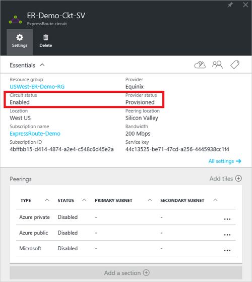

<properties
   pageTitle="Como configurar o roteamento para um circuito de rota expressa usando o Portal do Azure | Microsoft Azure"
   description="Este artigo conduz você pelas etapas de criação e o provisionamento, público e privado Microsoft correspondência de um circuito de rota expressa. Este artigo também mostra como verificar o status, atualizar ou excluir peerings para seu circuito."
   documentationCenter="na"
   services="expressroute"
   authors="cherylmc"
   manager="carmonm"
   editor=""
   tags="azure-resource-manager"/>
<tags
   ms.service="expressroute"
   ms.devlang="na"
   ms.topic="hero-article" 
   ms.tgt_pltfrm="na"
   ms.workload="infrastructure-services"
   ms.date="10/10/2016"
   ms.author="cherylmc"/>

# Criar e modificar o roteamento para um circuito de rota expressa

> [AZURE.SELECTOR]
[Portal Azure - Gerenciador de recursos](expressroute-howto-routing-portal-resource-manager.md)
[PowerShell - Gerenciador de recursos](expressroute-howto-routing-arm.md)
[PowerShell - clássico](expressroute-howto-routing-classic.md)

Este artigo conduz você pelas etapas para criar e gerenciar a configuração de roteamento para um circuito de rota expressa usando o portal do Azure e o modelo de implantação do Gerenciador de recursos.

**Sobre os modelos de implantação do Azure**

[AZURE.INCLUDE [vpn-gateway-clasic-rm](../../includes/vpn-gateway-classic-rm-include.md)] 

## Pré-requisitos de configuração

- Certifique-se de que revisou a página de [pré-requisitos](expressroute-prerequisites.md) , a página de [Roteamento requisitos](expressroute-routing.md) e página [fluxos de trabalho](expressroute-workflows.md) antes de começar a configuração.
- Você deve ter um circuito rota expressa ativo. Siga as instruções para [criar um circuito de rota expressa](expressroute-howto-circuit-arm.md) e ter o circuito habilitado pelo seu provedor de conectividade antes de continuar. O circuito rota expressa deve estar em um estado provisionado e habilitado para ser capaz de executar os cmdlets descritos a seguir.

Estas instruções se aplicam apenas às circuitos criados com provedores de serviço, oferecendo serviços de conectividade de camada 2. Se você estiver usando um provedor de serviços, oferecendo serviços de camada 3 gerenciados (geralmente uma IPVPN, como MPLS), seu provedor de conectividade irá configurar e gerenciar o roteamento para você. 

>[AZURE.IMPORTANT] Estamos atualmente não anunciar peerings configurado pelo provedores de serviços por meio do portal de gerenciamento de serviço. Estamos trabalhando em ativar esse recurso em breve. Verifique com seu provedor de serviço antes de configurar o BGP peerings.

Você pode configurar um, dois ou todos os três peerings de (Azure público particular, Azure e Microsoft) para um circuito de rota expressa. Você pode configurar peerings em qualquer ordem em que você escolher. No entanto, você deve garantir que você conclua a configuração de cada correspondência um por vez. 

## Correspondência particular Azure

Esta seção fornece instruções sobre como criar, obter, atualizar e excluir a configuração de correspondência particular do Azure para um circuito de rota expressa. 

### Para criar correspondência particular Azure

1. Configure o circuito rota expressa. Certifique-se de que o circuito é totalmente provisionado pelo provedor de conectividade antes de continuar.

    

2. Configure a correspondência do Azure particular para o circuito. Certifique-se de que você tenha os seguintes itens antes de continuar com as próximas etapas:

    - Um /30 sub-rede para o link principal. Isso não deve fazer parte de qualquer espaço de endereço reservado para redes virtuais.
    - Um /30 sub-rede do link secundário. Isso não deve fazer parte de qualquer espaço de endereço reservado para redes virtuais.
    - Um ID de VLAN válido para estabelecer a essa correspondência em. Certifique-se de que nenhuma outra correspondência no circuito usa a mesma ID de VLAN.
    - COMO número para correspondência. Você pode usar 2 bytes e de 4 bytes como números. Você pode usar uma privada como número para esta correspondência. Certifique-se de que você não estiver usando 65515.
    - Um hash MD5, se você optar por usar um. **Isso é opcional**.

3. Selecione a linha de correspondência Azure particular, conforme mostrado abaixo.
    
    
    

4. Configure correspondência particular. A imagem abaixo mostra um exemplo de configuração.

    

    
5. Salve a configuração depois que você especificou todos os parâmetros. Depois que a configuração foi aceita com êxito, você verá algo semelhante ao exemplo abaixo.

    
    

### Exibir detalhes de correspondência particulares Azure

Você pode exibir as propriedades de correspondência do Azure particular, selecionando a correspondência.

### Para atualizar a configuração de correspondência particular Azure

Você pode selecionar a linha para correspondência e modificar as propriedades de correspondência. 

### Para excluir a correspondência particular Azure

Você pode remover sua configuração aos selecionando o ícone de exclusão, conforme mostrado abaixo.

## Correspondência de público Azure

Esta seção fornece instruções sobre como criar, obter, atualizar e excluir a configuração de correspondência pública do Azure para um circuito de rota expressa. 

### Para criar a correspondência de público Azure

1. Configure rota expressa circuito. Certifique-se de que o circuito é totalmente provisionado pelo provedor de conectividade antes de continuar ainda mais.

    

2. Configure a correspondência do Azure público para o circuito. Certifique-se de que você tenha os seguintes itens antes de continuar com as próximas etapas:

    - Um /30 sub-rede para o link principal. 
    - Um /30 sub-rede do link secundário. 
    - Todos os endereços IP usados para configurar essa correspondência devem ser válidos endereços IPv4 públicos.
    - Um ID de VLAN válido para estabelecer a essa correspondência em. Certifique-se de que nenhuma outra correspondência no circuito usa a mesma ID de VLAN.
    - COMO número para correspondência. Você pode usar 2 bytes e de 4 bytes como números.
    - Um hash MD5, se você optar por usar um. **Isso é opcional**.

3. Selecione linha aos pública Azure, conforme mostrado abaixo.
    
    
    

4. Configure a correspondência de público. A imagem abaixo mostra um exemplo de configuração.

    

    
5. Salve a configuração depois que você especificou todos os parâmetros. Depois que a configuração foi aceita com êxito, você verá algo semelhante ao exemplo abaixo.

    
    

### Exibir detalhes de correspondência públicos Azure

Você pode exibir as propriedades de correspondência do Azure público, selecionando a correspondência.

### Atualizar a configuração de correspondência pública Azure

Você pode selecionar a linha para correspondência e modificar as propriedades de correspondência. 

### Para excluir a correspondência de público Azure

Você pode remover sua configuração aos selecionando o ícone de exclusão, conforme mostrado abaixo.

## Microsoft correspondência

Esta seção fornece instruções sobre como criar, obter, atualizar e excluir a configuração de correspondência da Microsoft para um circuito de rota expressa. 

### Para criar a correspondência da Microsoft

1. Configure rota expressa circuito. Certifique-se de que o circuito é totalmente provisionado pelo provedor de conectividade antes de continuar ainda mais.

    

2. Configure o Microsoft correspondência para o circuito. Certifique-se de que você tem as seguintes informações antes de continuar.

    - Um /30 sub-rede para o link principal. Este valor deve ser um público IPv4 prefixo válido pertencente a você e registrado em um RIR / TIR.
    - Um /30 sub-rede do link secundário. Este valor deve ser um público IPv4 prefixo válido pertencente a você e registrado em um RIR / TIR.
    - Um ID de VLAN válido para estabelecer a essa correspondência em. Certifique-se de que nenhuma outra correspondência no circuito usa a mesma ID de VLAN.
    - COMO número para correspondência. Você pode usar 2 bytes e de 4 bytes como números.
    - **Anunciado prefixos:** Você deve fornecer uma lista de todos os prefixos que você planeja anunciar sobre a sessão BGP. Somente prefixos de endereço IP públicos são aceitas. Se você planeja enviar um conjunto de prefixos, você pode enviar uma lista separada por vírgulas. Esses prefixos devem ser registrados para você em um RIR / TIR.
    - **Cliente ASN:** Se você estiver prefixos de anúncios que não são registrados para a correspondência como número, você pode especificar o número para o qual elas são registradas. **Isso é opcional**.
    - **Roteamento nome do registro:** Você pode especificar a RIR / TIR em relação à qual o número e prefixos são registrados. **Isso é opcional.**
    - Um hash MD5, se você optar por usar um. **Isso é opcional.**
    
3. Você pode selecionar a correspondência que você deseja configurar conforme mostrado abaixo. Selecione a linha de correspondência da Microsoft.
    
    
    

4.  Configure a correspondência de Microsoft. A imagem abaixo mostra um exemplo de configuração.

    

    
5. Salve a configuração depois que você especificou todos os parâmetros. 

    Se seu circuito obtém a uma validação necessária estado (como mostrado abaixo), você deve abrir um tíquete para mostrar prova de propriedade dos prefixos à nossa equipe de suporte.  
    
    

    Você pode abrir um tíquete diretamente do portal conforme mostrado abaixo   
    
    

6. Depois que a configuração foi aceita com êxito, você verá algo semelhante ao exemplo abaixo.

    
    

### Exibir detalhes de correspondência da Microsoft

Você pode exibir as propriedades de correspondência do Azure público, selecionando a correspondência.

### Atualizar a configuração de correspondência da Microsoft

Você pode selecionar a linha para correspondência e modificar as propriedades de correspondência. 

### Para excluir a correspondência da Microsoft

Você pode remover sua configuração aos selecionando o ícone de exclusão, conforme mostrado abaixo.

## Próximas etapas

Próxima etapa, [um VNet para um circuito de rota expressa do Link](expressroute-howto-linkvnet-arm.md).

-  Para obter mais informações sobre fluxos de trabalho de rota expressa, consulte [fluxos de trabalho de rota expressa](expressroute-workflows.md).

-  Para obter mais informações sobre a correspondência de circuito, consulte [rota expressa circuitos e domínios de roteamento](expressroute-circuit-peerings.md).

-  Para obter mais informações sobre como trabalhar com redes virtuais, consulte [Visão geral de rede Virtual](../virtual-network/virtual-networks-overview.md).

