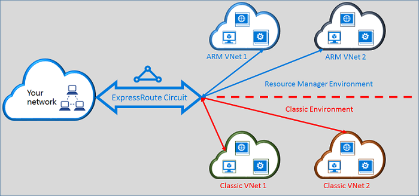

<properties
   pageTitle="Movendo circuitos rota expressa do clássico ao Gerenciador de recursos | Microsoft Azure"
   description="Esta página fornece uma visão geral dos quais você precisa saber sobre o clássico e os modelos de implantação do Gerenciador de recursos de ponte."
   documentationCenter="na"
   services="expressroute"
   authors="ganesr"
   manager="carmonm"
   editor=""/>
<tags
   ms.service="expressroute"
   ms.devlang="na"
   ms.topic="get-started-article"
   ms.tgt_pltfrm="na"
   ms.workload="infrastructure-services"
   ms.date="10/10/2016"
   ms.author="ganesr"/>

# Mover circuitos rota expressa do clássico para o modelo de implantação do Gerenciador de recursos

Este artigo fornece uma visão geral sobre o que significa para mover um circuito de rota expressa do Azure do clássico para o modelo de implantação do Gerenciador de recursos do Azure.

[AZURE.INCLUDE [vpn-gateway-sm-rm](../../includes/vpn-gateway-classic-rm-include.md)]

Você pode usar um único circuito de rota expressa para se conectar à redes virtuais que são implantadas no clássico e os modelos de implantação do Gerenciador de recursos. Um circuito de rota expressa, independentemente de como ele é criado, agora pode vincular a redes virtuais em ambos os modelos de implantação.

## Rota expressa circuitos criadas no modelo clássico de implantação

Rota expressa circuitos criadas no modelo clássico de implantação precisam ser movidos para o modelo de implantação do Gerenciador de recursos primeiro para habilitar a conectividade com o clássico e os modelos de implantação do Gerenciador de recursos. Existe perda de conectividade ou interrupção quando uma conexão está sendo movido. Todos os links de rede de circuito-para-virtual no modelo clássico de implantação (dentro do mesmo assinatura e entre-subscription) são preservados.

Após a mudança é concluída com êxito, o circuito rota expressa procura, executa e parece exatamente um circuito de rota expressa que foi criado no modelo de implantação do Gerenciador de recursos. Agora você pode criar conexões com redes virtuais no modelo de implantação do Gerenciador de recursos.

Após uma rota expressa circuito foi movida para o modelo de implantação do Gerenciador de recursos, você pode gerenciar o ciclo de vida do circuito rota expressa apenas usando o modelo de implantação do Gerenciador de recursos. Isso significa que você pode realizar operações como peerings adicionando/atualizando/excluindo, Atualizando propriedades de circuito (como a largura de banda, SKU e tipo de cobrança) e excluindo circuitos somente no modelo de implantação do Gerenciador de recursos. Consulte a seção abaixo em circuitos criadas no modelo de implantação do Gerenciador de recursos para mais detalhes sobre como você pode gerenciar o acesso a ambos os modelos de implantação.

Você não precisa envolvem seu provedor de conectividade para realizar o movimento.

## Rota expressa circuitos criadas no modelo de implantação do Gerenciador de recursos

Você pode habilitar a rota expressa circuitos criadas no modelo de implantação do Gerenciador de recursos sejam acessíveis em ambos os modelos de implantação. Qualquer circuito rota expressa em sua assinatura pode ser habilitado para ser acessado em ambos os modelos de implantação.

- Rota expressa circuitos criadas no modelo de implantação do Gerenciador de recursos não tem acesso ao modelo clássico de implantação por padrão.
- Rota expressa circuitos que foram movidos para o modelo de implantação do Gerenciador de recursos do modelo clássico de implantação são acessíveis em ambos os modelos de implantação por padrão.
- Um circuito de rota expressa sempre tem acesso ao modelo de implantação do Gerenciador de recursos, independentemente se ele foi criado no Gerenciador de recursos ou modelo clássico de implantação. Isso significa que você pode criar conexões com redes virtuais criadas no modelo de implantação do Gerenciador de recursos seguindo as instruções sobre [como vincular redes virtuais](expressroute-howto-linkvnet-arm.md).
- Acesso ao modelo clássico de implantação é controlado pelo parâmetro **allowClassicOperations** no circuito a rota expressa.

>[AZURE.IMPORTANT] Aplicam a todas as cotas documentadas na página [limites de serviço](../azure-subscription-service-limits.md) . Como exemplo, um circuito padrão pode ter no máximo 10 links/conexões de rede virtual entre o clássico e os modelos de implantação do Gerenciador de recursos.

## Controlar o acesso ao modelo clássico de implantação

Você pode habilitar um único circuito de rota expressa vincular à redes virtuais em ambos os modelos de implantação definindo o parâmetro **allowClassicOperations** do circuito rota expressa.

Definir **allowClassicOperations** como TRUE permite vincular redes virtuais de ambos os modelos de implantação ao circuito rota expressa. Você pode vincular a redes virtuais no modelo clássico de implantação, seguindo a orientação sobre [como vincular redes virtuais no modelo clássico de implantação](expressroute-howto-linkvnet-classic.md). Você pode vincular a redes virtuais no modelo de implantação do Gerenciador de recursos, seguindo a orientação sobre [como vincular redes virtuais no modelo de implantação do Gerenciador de recursos](expressroute-howto-linkvnet-arm.md).

Configuração **allowClassicOperations** para FALSE bloqueia o acesso ao circuito do modelo clássico de implantação. No entanto, todos os links de rede virtual no modelo clássico de implantação são preservados. Nesse caso, o circuito rota expressa não está visível no modelo clássico de implantação.

## Operações com suporte no modelo clássico de implantação

As seguintes operações clássicas têm suporte em um circuito de rota expressa quando **allowClassicOperations** é definida como TRUE:

 - Obter informações de circuito de rota expressa
 - Links de rede virtual criar/atualizar/get/excluir para redes virtuais clássicas
 - Autorizações do link de rede virtual criar/atualizar/get/excluir para conectividade entre-assinatura

Você não pode executar as seguintes operações clássicas quando **allowClassicOperations** é definida como TRUE:

 - Criar/Atualizar/get/excluir borda Gateway Protocol (BGP) peerings para Azure público em particular, Azure e peerings da Microsoft
 - Excluir rota expressa circuitos

## Comunicação entre o clássico e os modelos de implantação do Gerenciador de recursos

O circuito rota expressa atua como uma ponte entre o clássico e os modelos de implantação do Gerenciador de recursos. Tráfego entre virtual machines em redes virtuais no modelo clássico de implantação e as redes virtuais nos fluxos de modelo de implantação do Gerenciador de recursos por meio de rota expressa se ambas as redes virtuais estão vinculadas aos mesmo circuito rota expressa.

Transferência agregada é limitada pela capacidade de produtividade do gateway rede virtual. Tráfego não entrará redes do provedor conectividade ou seu nesses casos. Fluxo de tráfego entre as redes virtuais totalmente está contido na rede da Microsoft.

## Acesso ao público Azure e recursos da Microsoft

Você pode continuar acessar recursos que são normalmente acessíveis por meio de correspondência público Azure e Microsoft correspondência sem interrupções.  

## O que é suportado

Esta seção descreve o que é suportado para circuitos rota expressa:

 - Você pode usar um único circuito de rota expressa para acessar redes virtuais que são implantadas no clássico e os modelos de implantação do Gerenciador de recursos.
 - Você pode mover um circuito de rota expressa do clássico para o modelo de implantação do Gerenciador de recursos. Uma vez movido, o circuito rota expressa procura, parece e executa como qualquer outro circuito de rota expressa que é criado no modelo de implantação do Gerenciador de recursos.
 - Você pode mover apenas o circuito rota expressa. Links de circuito, redes virtuais e gateways VPN podem ser movidos por essa operação.
 - Após uma rota expressa circuito foi movida para o modelo de implantação do Gerenciador de recursos, você pode gerenciar o ciclo de vida do circuito rota expressa apenas usando o modelo de implantação do Gerenciador de recursos. Isso significa que você pode realizar operações como peerings adicionando/atualizando/excluindo, Atualizando propriedades de circuito (como a largura de banda, SKU e tipo de cobrança) e excluindo circuitos somente no modelo de implantação do Gerenciador de recursos.
 - O circuito rota expressa atua como uma ponte entre o clássico e os modelos de implantação do Gerenciador de recursos. Tráfego entre virtual machines em redes virtuais no modelo clássico de implantação e as redes virtuais nos fluxos de modelo de implantação do Gerenciador de recursos por meio de rota expressa se ambas as redes virtuais estão vinculadas aos mesmo circuito rota expressa.
 - Conectividade entre-assinatura é compatível com o clássico e os modelos de implantação do Gerenciador de recursos.

## O que não é suportado

Esta seção descreve o que não há suporte para circuitos rota expressa:

 - Movendo links de circuito, gateways e redes virtuais do clássico para o modelo de implantação do Gerenciador de recursos.
 - Gerenciando o ciclo de vida de um circuito de rota expressa do modelo clássico de implantação.
 - Suporte de controle de acesso (RBAC) baseado em função para o modelo de implantação clássico. Você não pode executar controles de RBAC um circuito no modelo clássico de implantação. Qualquer administrador/coadministrator da assinatura pode vincular ou desvincular redes virtuais ao circuito.

## Configuração

Siga as instruções descritas [Mover um circuito de rota expressa do clássico para o modelo de implantação do Gerenciador de recursos](expressroute-howto-move-arm.md).

## Próximas etapas

- Para obter informações de fluxo de trabalho, consulte a [rota expressa circuito provisionamento estados de circuito e fluxos de trabalho](expressroute-workflows.md).
- Para configurar sua conexão de rota expressa:

    - [Criar um circuito de rota expressa](expressroute-howto-circuit-arm.md)
    - [Configurar o roteamento](expressroute-howto-routing-arm.md)
    - [Vincular uma rede virtual a um circuito de rota expressa](expressroute-howto-linkvnet-arm.md)
