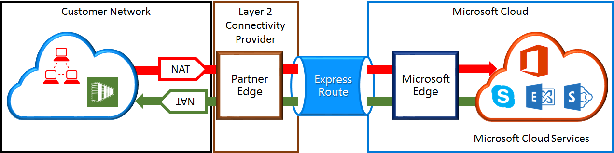

<properties
   pageTitle="Requisitos de NAT para rota expressa circuitos | Microsoft Azure"
   description="Esta página fornece requisitos detalhados para configurar e gerenciar NAT para rota expressa circuitos."
   documentationCenter="na"
   services="expressroute"
   authors="cherylmc"
   manager="carmonm"
   editor=""/>
<tags
   ms.service="expressroute"
   ms.devlang="na"
   ms.topic="get-started-article"
   ms.tgt_pltfrm="na"
   ms.workload="infrastructure-services"
   ms.date="10/10/2016"
   ms.author="cherylmc"/>

# Requisitos de ExpressRoute NAT

Para se conectar aos serviços de nuvem da Microsoft usando rota expressa, você precisará configurar e gerenciar NATs. Alguns provedores de conectividade oferecem configurar e gerenciar NAT como um serviço gerenciado. Verifique com seu provedor de conectividade para ver se eles oferecem um serviço. Caso contrário, você deve atender aos requisitos descritos abaixo. 

Examine a página [rota expressa circuitos e domínios de roteamento](expressroute-circuit-peerings.md) para obter uma visão geral dos vários domínios roteamento. Para atender os requisitos de endereço IP públicos do Azure público e Microsoft correspondência, recomendamos que você configure NAT entre sua rede e a Microsoft. Esta seção fornece uma descrição detalhada da infraestrutura NAT que você precisa configurar.

## Requisitos de NAT para correspondência público Azure

O caminho de correspondência público Azure permite que você se conectar a todos os serviços hospedados no Azure sobre seus endereços IP públicos. Eles incluem serviços listados nas [Perguntas Frequentes de ExpessRoute](expressroute-faqs.md) e qualquer serviços hospedados por ISVs no Microsoft Azure. Conectividade aos serviços do Microsoft Azure na correspondência público é sempre iniciada da sua rede na rede do Microsoft. Tráfego destinado a Microsoft Azure na correspondência público deve ser SNATed a endereços IPv4 públicos válidos antes de entrarem na rede da Microsoft. A figura a seguir fornece uma imagem de alto nível de como o NAT pode ser configurado para atender ao requisito acima.

 

### Anúncios de pool e rota de NAT IP

Você deve garantir que o tráfego é inserindo o caminho de correspondência público do Azure com endereço IPv4 público válido. Microsoft deve ser capaz de validar a posse do pool de endereços IPv4 NAT em relação a um registro de Internet roteamento regional (RIR) ou um registro de roteamento de Internet (TIR). Uma verificação será executada com base no número como sendo peered com e os endereços IP usados para NAT. Consulte a página de [requisitos de roteamento rota expressa](expressroute-routing.md) para obter informações sobre o roteamento de registros.
 
Não existem restrições sobre o comprimento do prefixo NAT IP anunciado através esta correspondência. Você deve monitorar o pool NAT e certifique-se de que você não fiquem sem de sessões NAT.

>[AZURE.IMPORTANT] O pool de NAT IP anunciado para a Microsoft não deve ser anunciado à Internet. Isso interromperá conectividade com outros serviços da Microsoft.

## Requisitos de NAT para correspondência da Microsoft

O caminho de correspondência do Microsoft permite que você se conectar aos serviços de nuvem da Microsoft que não são compatíveis com o caminho de correspondência público Azure. A lista de serviços inclui serviços do Office 365, como o Exchange Online, SharePoint Online, Skype for Business e CRM Online. A Microsoft espera suporta conectividade bidirecional na correspondência da Microsoft. Tráfego destinado aos serviços de nuvem da Microsoft deve ser SNATed a endereços IPv4 públicos válidos antes de entrarem na rede da Microsoft. Tráfego destinado à sua rede de serviços de nuvem da Microsoft deve ser SNATed antes de entrarem na rede. A figura a seguir fornece uma imagem de alto nível de como o NAT deve ser configurado para Microsoft correspondência.
 
 

#### Tráfego provenientes de sua rede destinado à Microsoft

- Você deve garantir que o tráfego é inserindo o caminho de correspondência da Microsoft com um endereço IPv4 público válido. Microsoft deve ser capaz de validar o proprietário do pool de endereços IPv4 NAT contra o registro de internet roteamento regionais (RIR) ou um registro de roteamento de internet (TIR). Uma verificação será executada com base no número como sendo peered com e os endereços IP usados para NAT. Consulte a página de [requisitos de roteamento rota expressa](expressroute-routing.md) para obter informações sobre o roteamento de registros.

- Endereços IP usados para configuração de correspondência pública do Azure e outros circuitos de rota expressa não devem ser anunciados à Microsoft através da sessão BGP. Não há nenhuma restrição o comprimento do prefixo NAT IP anunciado através esta correspondência.

    >[AZURE.IMPORTANT] O pool de NAT IP anunciado para a Microsoft não deve ser anunciado à Internet. Isso interromperá conectividade com outros serviços da Microsoft.

#### Tráfego provenientes Microsoft destinado à sua rede

- Certas situações requerem o Microsoft iniciar a conectividade com pontos de extremidade do serviço hospedado em sua rede. Um exemplo típico do cenário seria conectividade com servidores ADFS hospedado em sua rede do Office 365. Nesses casos, você deve perda prefixos apropriados da sua rede para o Microsoft correspondência. 

- Você deve tráfego SNAT destinado a endereços IP dentro de sua rede da Microsoft. 

## Próximas etapas

- Consulte os requisitos para [Roteamento](expressroute-routing.md) e [QoS](expressroute-qos.md).
- Para obter informações de fluxo de trabalho, consulte a [rota expressa circuito provisionamento estados de circuito e fluxos de trabalho](expressroute-workflows.md).
- Configure sua conexão de rota expressa.

    - [Criar um circuito de rota expressa](expressroute-howto-circuit-classic.md)
    - [Configurar o roteamento](expressroute-howto-routing-classic.md)
    - [Vincular um VNet a um circuito de rota expressa](expressroute-howto-linkvnet-classic.md)

