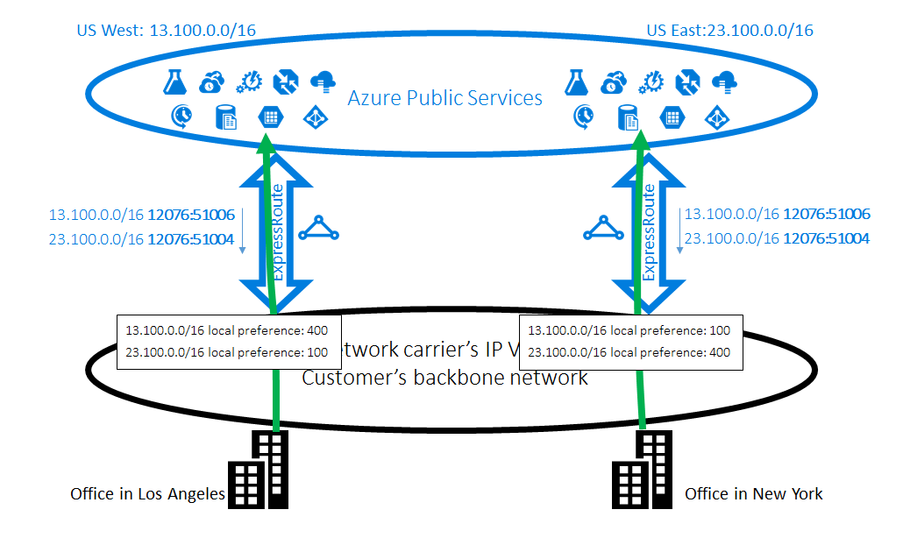
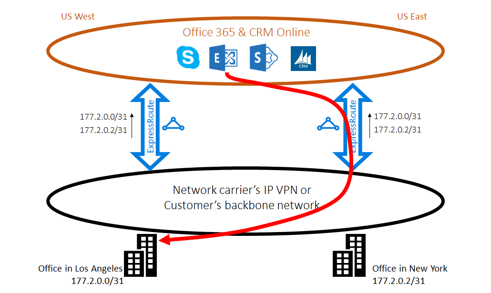

<properties
   pageTitle="Otimizar a rota expressa roteamento | Microsoft Azure"
   description="Esta página fornece detalhes sobre como otimizar roteamento quando um cliente tem mais de uma rota expressa circuitos que se conectam entre a Microsoft e a rede do cliente corp."
   documentationCenter="na"
   services="expressroute"
   authors="charwen"
   manager="carmonm"
   editor=""/>
<tags
   ms.service="expressroute"
   ms.devlang="na"
   ms.topic="get-started-article"
   ms.tgt_pltfrm="na"
   ms.workload="infrastructure-services"
   ms.date="10/10/2016"
   ms.author="charwen"/>

# Otimizar a rota expressa roteamento
Quando você tiver vários circuitos rota expressa, você tem mais de um caminho para se conectar à Microsoft. Como resultado, roteamento com qualidade inferior pode ocorrer - ou seja, o tráfego pode demorar um caminho mais tempo para alcançar a Microsoft e Microsoft à sua rede. Mais o caminho de rede, quanto maior a latência. Latência tem impacto direto no aplicativo de desempenho e experiência do usuário. Este artigo será ilustram esse problema e explicam como otimizar roteamento usando as tecnologias de roteamento padrão.

## Caso de roteamento com qualidade inferior 1
Vamos dar uma olhada fechar o problema de roteamento por exemplo. Imagine que você tenha dois escritórios nos EUA, um em Los Angeles e um em Nova York. Seus escritórios estão conectados em uma rede (LONGA distância), que pode ser sua própria rede de backbone ou VPN seu provedor de serviços IP. Você tem dois circuitos rota expressa, uma no Oeste EUA e outra conosco Leste, que também estejam conectadas na WAN. Obviamente, você tem dois caminhos para se conectar à rede da Microsoft. Agora imagine que você tenha Azure implantação (por exemplo, serviço de aplicativo do Azure) conosco Oeste e Leste dos EUA. Sua intenção é conectá-los em Los Angeles Oeste EUA do Azure e seus usuários em Nova York para Leste do Azure conosco porque seu administrador de serviço anuncia que os usuários em cada escritório acessar os serviços do Azure próximos melhores experiências. Infelizmente, o plano funciona-out bem para os usuários da Costa Leste, mas não para os usuários de região sudeste. A causa do problema é o seguinte. Em cada circuito rota expressa, podemos anunciar a você o prefixo na Azure conosco Leste (23.100.0.0/16) e o prefixo no Azure conosco oeste (13.100.0.0/16). Se você não souber qual prefixo é do que região, você não é capazes de tratar de forma diferente. Sua rede WAN talvez ache ambos os prefixos são mais próximos Leste dos EUA que Oeste EUA e, portanto, rotear ambos os usuários do office para o circuito de rota expressa na Leste dos EUA. No final, você terá muitos usuários triste no escritório de Los Angeles.

### Solução: usar comunidades BGP
Para otimizar o roteamento para ambos os usuários do office, você precisa saber quais prefixo é do Azure conosco Oeste e qual do Leste do Azure conosco. Nós codificar essas informações usando [valores de comunidade BGP](expressroute-routing.md). Podemos atribuiu um valor de comunidade BGP exclusivo para cada região Azure, por exemplo, "12076:51004" para Leste dos EUA, "12076:51006" de Oeste EUA. Agora que você sabe que prefixo é do que região Azure, você pode configurar quais circuito rota expressa deve ser preferido. Como usamos BGP a troca de informações de roteamento, você pode usar preferência Local do BGP influenciar roteamento. Em nosso exemplo, você pode atribuir um valor maior preferência local 13.100.0.0/16 conosco Oeste que na Leste dos EUA e da mesma forma, um valor de preferência local maior a 23.100.0.0/16 conosco Leste que no Oeste EUA. Esta configuração irá se certificar de que, quando ambos os caminhos à Microsoft estiverem disponíveis, seus usuários em Los Angeles entrarão em circuito a rota expressa conosco Oeste para se conectar ao Azure conosco Oeste enquanto os usuários em Nova York levar a rota expressa conosco Leste ao Azure conosco Leste. Roteamento é otimizado em ambos os lados. 

## Caso de roteamento com qualidade inferior 2
Este é outro exemplo onde conexões da Microsoft levar um caminho mais tempo para alcançar a sua rede. Nesse caso, você usar os servidores de Exchange local e o Exchange Online em um [ambiente híbrido](https://technet.microsoft.com/library/jj200581%28v=exchg.150%29.aspx). Seus escritórios estão conectados a uma WAN. Anunciar prefixos dos seus servidores de local em seus escritórios à Microsoft pelos dois circuitos rota expressa ambas. Exchange Online iniciará conexões com os servidores locais em casos como migração de caixas de correio. Infelizmente, a conexão ao seu escritório de Los Angeles é roteado para o circuito de rota expressa conosco Leste antes de percorrer o verso continente inteiro para a região sudeste. A causa do problema é semelhante ao primeiro. Sem qualquer dica, a rede Microsoft não pode decidir qual prefixo de cliente for próximo do Leste dos EUA e qual é a próxima Oeste EUA. Isso acontece escolher o caminho errado ao seu escritório em Los Angeles.

### Solução: usar AS PATH anexando ao início
Existem duas soluções para o problema. O primeiro é que você simplesmente anunciar seu prefixo de local para o seu escritório de Los Angeles, 177.2.0.0/31, no circuito rota expressa em Oeste EUA e seu local de prefixo para o seu escritório de Nova York, 177.2.0.2/31, no circuito rota expressa na Leste dos EUA. Como resultado, há apenas um caminho para a Microsoft para se conectar a cada um dos seus escritórios. Não há nenhum ambiguidade e roteamento é otimizado. Com esse planejamento, você precisa pensar sobre sua estratégia de failover. Se o caminho para a Microsoft pela rota expressa for interrompido, você precisa certificar-se de que o Exchange Online pode ainda se conectar aos servidores local. 

A segunda solução é que você continuar a anunciar ambos os prefixos em ambos os circuitos rota expressa e Além disso em que você envie-uma dica de quais prefixo for próximo qual destas seus escritórios. Como podemos suporte BGP AS Path anexando ao início, você pode configurar do caminho para o prefixo para influenciar roteamento. Neste exemplo, você pode aumentar o caminho como 172.2.0.0/31 conosco Leste para que nós será preferir o circuito de rota expressa em Oeste EUA para tráfego destinado a esse prefixo (como nossa rede será considerado que o caminho para esse prefixo é menor no oeste). Da mesma forma, você pode aumentar o caminho como 172.2.0.2/31 no Oeste EUA para que estamos vai preferir o circuito rota expressa na Leste dos EUA. Roteamento é otimizado para os dois escritórios. Com esse design, se um circuito de rota expressa é quebrado, Exchange Online pode ainda alcançar você por meio de outro circuito de rota expressa e sua WAN. 

>[AZURE.IMPORTANT] Podemos remover particular como números em do caminho para os prefixos recebidos em Microsoft Peering. Você precisa acrescentar público como números em do caminho influenciar roteamento para Microsoft Peering.

>[AZURE.IMPORTANT] Enquanto os exemplos fornecidos aqui são para Microsoft e peerings público, oferecemos suporte para os mesmos recursos para a correspondência particular. Além disso, o caminho como anexando ao início funciona dentro de uma única rota expressa circuito, influenciam a seleção dos caminhos de primário e secundários.
