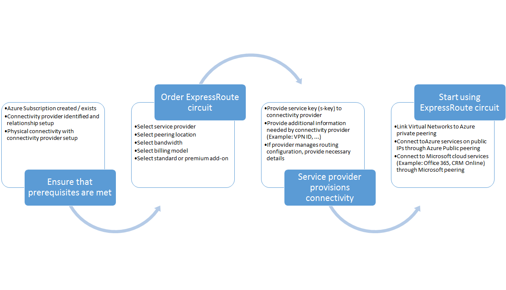

<properties
   pageTitle="Fluxos de trabalho para configurar um circuito de rota expressa | Microsoft Azure"
   description="Esta página orienta você os fluxos de trabalho para a configuração peerings e rota expressa circuito"
   documentationCenter="na"
   services="expressroute"
   authors="cherylmc"
   manager="carmonm"
   editor="" />
<tags
   ms.service="expressroute"
   ms.devlang="na"
   ms.topic="article" 
   ms.tgt_pltfrm="na"
   ms.workload="infrastructure-services"
   ms.date="10/10/2016"
   ms.author="cherylmc"/>

# Fluxos de trabalho de rota expressa para provisionamento de circuito e estados de circuito

Esta página apresenta o serviço de provisionamento e roteamento de fluxos de trabalho de configuração em um alto nível.

A figura a seguir e as etapas correspondentes mostram as tarefas que devem ser seguidas para ter um circuito de rota expressa provisionado ponta a ponta. 

1. Usar o PowerShell para configurar um circuito de rota expressa. Siga as instruções no artigo [rota expressa criar circuitos](expressroute-howto-circuit-classic.md) para obter mais detalhes.

2. Conectividade de ordem do provedor de serviço. Esse processo varia. Contate o provedor de conectividade para obter mais detalhes sobre a ordem de conectividade.

3. Certifique-se de que o circuito foi provisionado com êxito verificando o circuito de rota expressa provisionamento estado através do PowerShell. 

4. Configure domínios de roteamento. Se o seu provedor de conectividade gerencia Layer 3 para você, eles serão configurar o roteamento para seu circuito. Se o seu provedor de conectividade somente oferecer serviços de camada 2, você deve configurar o roteamento por diretrizes descritas nas páginas de [configuração de roteamento](expressroute-howto-routing-classic.md) e [Roteamento requisitos](expressroute-routing.md) .

    -  Habilitar a correspondência particular Azure - você deve habilitar essa correspondência conectar-se a VMs / serviços implantados em redes virtuais em nuvem.
    -  Habilitar a correspondência de público Azure - você deve habilitar a correspondência de público Azure se desejar se conectar aos serviços Azure hospedados em endereços IP públicos. Este é um requisito para acessar recursos Azure se você optou por habilitar o roteamento de padrão para correspondência particular Azure.
    -  Habilitar a correspondência do Microsoft - você deve habilitar isso para acessar o Office 365 e serviços online do CRM. 
    
    >[AZURE.IMPORTANT] Você deve garantir que você usar um proxy separado / borda se conectar à Microsoft daquela que você use para a Internet. Usando a mesma margem para rota expressa e Internet causar assimétricos roteamento e causar interrupções de conectividade para sua rede.

    

5. Vinculação redes virtuais a rota expressa circuitos - você pode vincular redes virtuais a seu circuito rota expressa. Siga as instruções [para vincular VNets](expressroute-howto-linkvnet-arm.md) ao seu circuito. Estes VNets podem ser na mesma assinatura como o circuito rota expressa do Azure ou pode estar em uma assinatura diferente.

## Rota expressa circuito estados de provisionamento

Cada circuito rota expressa tem dois estados:

- Estado de provisionamento de provedor de serviço
- Status

Status representa o estado de provisionamento da Microsoft. Essa propriedade é definida como ativado quando você cria um circuito de rota expressa

O estado de provisionamento de provedor de serviços de conectividade representa o estado do lado do provedor de conectividade. Ele pode ser *NotProvisioned*, *provisionamento*ou *provisionado*. O circuito rota expressa deve estar no estado de provisionado para você poder usá-lo.

### Estados possíveis de um circuito de rota expressa

Esta seção lista os estados possíveis para um circuito de rota expressa.

#### No momento da criação

Você verá o circuito rota expressa no estado seguinte assim que você executar o cmdlet do PowerShell para criar o circuito rota expressa.

    ServiceProviderProvisioningState : NotProvisioned
    Status                           : Enabled

#### Quando o provedor de serviços corporativos de conectividade está em processo de provisionamento o circuito

Você verá o circuito rota expressa no estado seguinte assim que você passar a chave de serviço para o provedor de conectividade e eles iniciou o processo de provisionamento.

    ServiceProviderProvisioningState : Provisioning
    Status                           : Enabled

#### Quando o provedor de serviços corporativos de conectividade concluiu o processo de provisionamento

Você verá o circuito rota expressa no estado seguinte assim que o provedor de conectividade concluiu o processo de provisionamento.

    ServiceProviderProvisioningState : Provisioned
    Status                           : Enabled

Provisionado e Enabled seja que o único estado o circuito pode estar em para você poder usá-lo. Se você estiver usando um provedor de camada 2, você pode configurar o roteamento para seu circuito somente quando ela estiver nesse estado.

#### Quando o provedor de serviços corporativos de conectividade é desprovisionamento o circuito

Se solicitado o provedor de serviços para desprovisione o circuito rota expressa, você verá o circuito definida como o estado seguinte após o provedor de serviços concluiu o processo desprovisionamento.

    ServiceProviderProvisioningState : NotProvisioned
    Status                           : Enabled

Você pode optar por habilitá-lo novamente se necessário, ou executar cmdlets do PowerShell para excluir o circuito.  

>[AZURE.IMPORTANT] Se você executar o cmdlet do PowerShell para excluir o circuito quando o ServiceProviderProvisioningState é provisionamento ou provisionado a operação falhará. Trabalhe com seu provedor de conectividade para desprovisionamento o circuito rota expressa primeiro e exclua o circuito. Microsoft continuará cobrar o circuito até que você execute o cmdlet do PowerShell para excluir o circuito.

## Estado de configuração de sessão roteamento

O BGP estado de provisionamento permite saber se a sessão BGP tenha sido ativada na borda da Microsoft. O estado deve estar habilitado para que você seja capaz de usar a correspondência.

É importante verificar o estado de sessão BGP especialmente para correspondência de Microsoft. Além de BGP estado de provisionamento, há outro estado chamado *anunciado estado pública prefixos*. O estado de prefixos público anunciado deve estar no estado *configurado* , tanto para a sessão BGP seja para cima e para o roteamento funcionar ponta a ponta. 

Se o estado de prefixo público anunciado estiver definido para um estado de *validação necessária* , a sessão BGP não está habilitada, como os prefixos anunciados não correspondem o número em qualquer um dos registros do roteamento. 

>[AZURE.IMPORTANT] Se o estado de anunciado prefixos público estiver em estado de *validação manual* , você deve abrir um tíquete com [suporte da Microsoft](https://portal.azure.com/?#blade/Microsoft_Azure_Support/HelpAndSupportBlade) e comprovar que você possui os endereços IP anunciados junto com o número de sistema autônomo associado.

## Próximas etapas

- Configure sua conexão de rota expressa.

    - [Criar um circuito de rota expressa](expressroute-howto-circuit-arm.md)
    - [Configurar o roteamento](expressroute-howto-routing-arm.md)
    - [Vincular um VNet a um circuito de rota expressa](expressroute-howto-linkvnet-arm.md)
