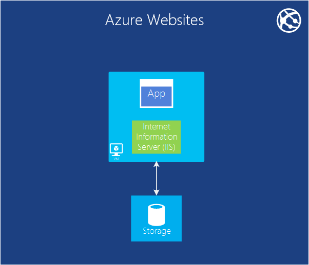
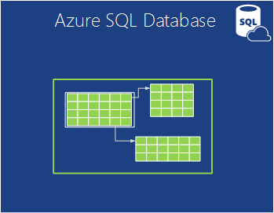
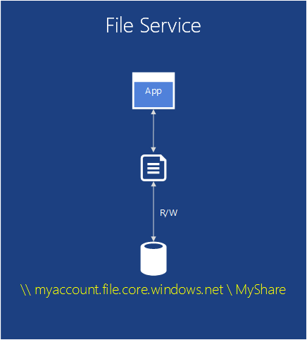
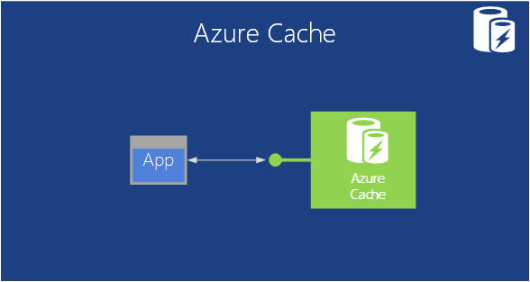
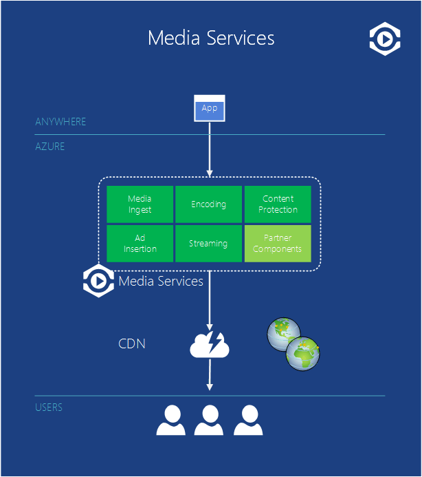

<properties
    pageTitle="Introdução ao Microsoft Azure | Microsoft Azure"
    description="Novo no Microsoft Azure? Obtenha uma visão geral dos serviços que ele oferece com exemplos de como eles são úteis."
    services=" "
    documentationCenter=".net"
    authors="rboucher"
    manager="carolz"
    editor=""/>

<tags
    ms.service="multiple"
    ms.workload="multiple"
    ms.tgt_pltfrm="na"
    ms.devlang="na"
    ms.topic="article"
    ms.date="06/30/2015"  
    ms.author="robb"/>

# Introdução ao Microsoft Azure

Microsoft Azure é a plataforma de aplicativo da Microsoft para a nuvem pública.  O objetivo deste artigo é fornecer uma base para entender os conceitos básicos do Azure, mesmo se você não souber nada sobre nuvem computação.

**Como ler este artigo**

Azure está aumentando o tempo todo, portanto, é fácil obter sobrecarregado.  Comece com os serviços básicos, que são listados primeiro neste artigo e, em seguida, vá para serviços adicionais. Isso não significa que você não pode usar apenas os serviços adicionais isolada, mas os serviços básicos compõem o núcleo de um aplicativo em execução no Azure.

**Enviar comentários**

Seus comentários são importantes. Este artigo deve fornecer uma visão geral de eficaz do Azure. Se não estiver, informe-se na seção comentários na parte inferior da página. Dê alguns detalhes sobre o que você esperava ver e como melhorar o artigo.  

## Os componentes do Azure

Azure agrupa serviços em categorias no Portal de gerenciamento e em diversos Auxílios visuais como o [Que é Azure Infographic](https://azure.microsoft.com/documentation/infographics/azure/) . O Portal de gerenciamento é o que você usa para gerenciar serviços maioria dos (mas não todos) no Azure.

Este artigo usará uma **organização diferente** para conversar sobre os serviços com base em função semelhante e para chamar serviços sub importantes que fazem parte de maiores.  

   
 *Figura: Azure fornece serviços de aplicativo acessível pela Internet em execução no Azure dos data centers.*

## Portal de gerenciamento
Azure tem uma interface de web chamada do [Portal de gerenciamento](http://manage.windowsazure.com) que permite que administradores de acessar e administrar mais, mas nem todos os recursos Azure.  Normalmente, a Microsoft libera o portal de interface do usuário mais recente no beta antes de aposentadoria um mais antigo. Mais recente é chamado de ["Portal de visualização do Azure"](https://portal.azure.com/).

Normalmente, há uma sobreposição longa quando os dois portais estão ativos. Enquanto serviços básicos aparecerão em ambos os portais, nem todas as funcionalidades podem estar disponíveis em ambos. Serviços mais recentes podem aparecem nos mais recentes portal primeiro e anteriores serviços e funcionalidade só pode existir em mais antigos.  A mensagem aqui é que se você não encontrar algo no portal do mais antigo, marque mais recente e vice-versa.

## Calcular

Uma das coisas mais básicas que faz uma plataforma de nuvem é executar aplicativos. Cada um dos modelos de computação Azure tem sua própria função para reproduzir.

Você pode usar essas tecnologias separadamente ou combine-as conforme necessário para criar a base certa para o seu aplicativo. A abordagem escolhida depende de quais problemas que você está tentando resolver.

### Azure máquinas virtuais

   
*Figura: Azure máquinas virtuais oferece controle total sobre instâncias de máquina virtual na nuvem.*

A capacidade de criar uma máquina virtual sob demanda, se a partir de uma imagem padrão ou um você fornecer, pode ser muito útil. Essa abordagem, conhecida como infraestrutura como um serviço (IaaS), é o que fornece máquinas virtuais do Azure. Figura 2 mostra uma combinação de como uma máquina Virtual (VM) é executado e como criar uma de um VHD.  

Para criar uma máquina virtual, você especificar quais VHD para uso e tamanho da VM.  Em seguida, você paga a hora em que a máquina virtual está em execução. Você pode pagar por minuto e somente enquanto ele é executado, embora haja um encargo de armazenamento mínima para manter o VHD disponível. Azure oferece uma galeria de estoque VHDs (chamados de "imagens") que contêm um sistema operacional inicializável para iniciar a partir de. Eles incluem opções Microsoft e de parceiros, como o Windows Server e Linux, SQL Server, Oracle e muito mais. Você está livre para criar VHDs e imagens e carregue-las por conta própria. Você mesmo pode carregar VHDs que contêm somente os dados e, em seguida, acessá-los de VMs em execução.

Onde o VHD vêm, você pode armazenar constantemente quaisquer alterações feitas enquanto uma máquina virtual está em execução. Na próxima vez que você cria uma máquina virtual a partir desse VHD, coisas pegue onde você parou. Os VHDs que volta as máquinas virtuais são armazenados em bolhas de armazenamento do Azure, que falarmos sobre mais tarde.  Isso significa que você obtém redundância para garantir que suas VMs não desaparecem devido a falhas de hardware e disco. Também é possível copiar o VHD alterado fora do Azure e depois executá-lo localmente.

Seu aplicativo é executado em uma ou mais máquinas virtuais, dependendo de como você o criou antes ou decide criá-lo agora do zero.

Essa abordagem bastante geral para computação em nuvem pode ser usada para resolver muitos problemas diferentes.

**Cenários de máquina virtual**

1.  **Desenvolvimento/teste** - você pode usá-los para criar uma plataforma de desenvolvimento e teste barata que você pode desligar quando terminar de usá-lo. Você também pode criar e executar aplicativos que usam qualquer idiomas e bibliotecas que você gostar. Esses aplicativos podem usar qualquer uma das opções de gerenciamento de dados que fornece do Azure e você também pode optar por usar o SQL Server ou outro DBMS executados em um ou mais máquinas virtuais.
2.  **Mover aplicativos Azure (Lift shift e)** - "Levantar shift e" refere-se a mover seu aplicativo muito como usaria uma empilhadeira para mover um objeto grande.  "Tire" VHD do data center local, "shift-" no Azure e executá-lo lá.  Normalmente, você precisará fazer algo para remover dependências em outros sistemas. Se houver muitos, você pode escolher a opção 3 em vez disso.  
3.  **Estender data center** - Use Azure VMs como uma extensão do data center local, executando o SharePoint ou outros aplicativos. Para oferecer suporte a isso, é possível criar domínios Windows na nuvem executando o Active Directory do Azure VMs. Você pode usar o Azure rede Virtual (mencionado posteriormente) para unir sua rede local e sua rede no Azure.

### Aplicativos Web

   
 *Figura: Azure Web Apps executa um aplicativo de site na nuvem sem precisar gerenciar o servidor web subjacente.*

Uma das coisas mais comuns que as pessoas na nuvem é executada sites e aplicativos web. Azure máquinas virtuais permite isso, mas ele ainda resta a responsabilidade de administrar um ou mais VMs e os sistemas operacionais subjacentes. Funções da web de serviços de nuvem podem fazer isso, mas implantação e manutenção-los ainda leva trabalho administrativo.  O que acontece se você quer que apenas um site onde alguém cuida do trabalho administrativo para você?

Isso é exatamente o que fornece Web Apps. Este modelo de computação oferece um ambiente da web gerenciados usando o portal de gerenciamento do Azure bem como APIs. Você pode mover um aplicativo de site existente para Web Apps inalterada, ou você pode criar um novo diretamente na nuvem. Quando um site estiver em execução, você pode adicionar ou remover de instâncias dinamicamente, confiar em aplicativos da Web do Azure para carregar solicitações de saldo entre eles. Aplicativos do Azure oferece uma opção compartilhada, onde seu site é executado em uma máquina virtual com outros sites, e uma opção padrão que permite que um site seja executado em sua própria máquina virtual. A opção padrão também permite aumentar o tamanho (computação power) de suas instâncias se necessário.

Para o desenvolvimento, Web Apps compatível com .NET, PHP, Node, Java e Python juntamente com o banco de dados SQL e MySQL (da ClearDB, um parceiro da Microsoft) para armazenamento relacional. Ele também fornece suporte interno para vários aplicativos populares, incluindo WordPress, Joomla e Drupal. O objetivo é fornecer uma plataforma de baixo custo, escalável e amplamente úteis para a criação de sites e aplicativos web na nuvem pública.

**Cenários de aplicativos Web**

Aplicativos Web destina-se a ser úteis para corporações, os desenvolvedores e agências de design da web. Para corporações, ele é uma solução fácil de gerenciar, flexível, altamente segura e altamente disponível para execução de sites de presença. Quando você precisa configurar um site, é melhor começar com aplicativos Web do Azure e prossiga para serviços de nuvem depois que você precisa de um recurso que não está disponível. Consulte o final da seção "Computação" para mais links que podem ajudar você a escolher entre as opções.

### Serviços de nuvem
   
*Figura: Serviços de nuvem Azure fornece um local para executar altamente escalável código personalizado em uma plataforma como um ambiente de serviço (PaaS)*

Digamos que você queira criar um aplicativo em nuvem que pode oferecer suporte a muitos usuários simultâneos, não requer muito administração e nunca diminui. Você pode ser um fornecedor de software já estabelecida, por exemplo, que decidiu adotar o Software como um serviço (SaaS) criando uma versão de um de seus aplicativos na nuvem. Ou você pode ser uma inicialização criando um aplicativo do consumidor que você espera crescerá rapidamente. Se você está construindo no Azure, o modelo de execução você deve usar?

Azure Web Apps permite criar esse tipo de aplicativo da web, mas há algumas restrições. Você não tem acesso administrativo, por exemplo, que significa que você não pode instalar software aleatório. Azure máquinas virtuais oferece a você muita flexibilidade, incluindo acesso administrativo e você certamente pode usá-lo para criar um aplicativo muito escalável, mas você terá que lidar com vários aspectos de confiabilidade e administração por conta própria. O que você gostaria é uma opção que dá o controle que você precisa, mas também trata maioria do trabalho necessário para confiabilidade e administração.

Isso é exatamente o que é fornecido pelos serviços de nuvem do Azure. Esta tecnologia destina-se expressamente suporte aos scalable, confiável e aplicativos de administração de baixo e ele é um exemplo do que normalmente é chamado plataforma como um serviço (PaaS). Para usá-lo, você cria um aplicativo usando a tecnologia que você escolher, como c#, Java, PHP, Python, Node ou algo mais. Em seguida, executa seu código em máquinas virtuais (referidas como instâncias) executando uma versão do Windows Server.

Mas essas VMs são diferentes daqueles que você cria com máquinas virtuais do Azure. Para uma coisa, Azure próprio gerencia, fazendo coisas como instalação de patches de sistema operacional e automaticamente distribuindo novo corrigido imagens. Isso significa que seu aplicativo não deve manter o estado nas instâncias de função da web ou de trabalho; em vez disso, ele deve ser mantido em uma das opções de gerenciamento de dados do Azure descritas na próxima seção. Azure também monitora essas VMs, qualquer reinicialização que falham. Você pode configurar os serviços de nuvem para criar instâncias de mais ou menos automaticamente em resposta à demanda. Isso permite que você lide com maior uso e, em seguida, dimensionar novamente para que você não está pagando quanto quando houver menos uso.

Você tem duas funções à sua escolha quando você cria uma instância, ambas baseiam no Windows Server. A principal diferença entre os dois é que uma instância de uma função web é executado no IIS, enquanto uma instância de uma função de trabalho não. No entanto, são gerenciados da mesma maneira, e é comum para um aplicativo para usar ambos. Por exemplo, uma instância da função web pode aceitar solicitações de usuários, em seguida, passe-os para uma instância da função de trabalho para processamento. Para dimensionar seu aplicativo para cima ou para baixo, você pode solicitar que o Azure criar mais instâncias de ambas as funções ou desligar instâncias existentes. E semelhante para máquinas virtuais do Azure, você está cobrado somente para o tempo que cada instância de função da web ou de trabalho está sendo executado.

**Cenários de serviços de nuvem**

Serviços de nuvem são ideais dar suporte a escala de massa check-out quando você precisa de mais controle sobre a plataforma de fornecida pelo Azure Web Apps, mas não é necessário um controle sobre o sistema operacional subjacente.

#### Escolhendo um modelo de computação
A página [Azure Web Apps, serviços de nuvem e máquinas virtuais comparação](./app-service-web/choose-web-site-cloud-service-vm.md) fornece informações mais detalhadas sobre como escolher um modelo de computação.

## Gerenciamento de dados

Aplicativos precisam de dados e tipos diferentes de aplicativos precisam de diferentes tipos de dados. Por isso, o Azure fornece várias maneiras de armazenar e gerenciar dados. Azure oferece várias opções de armazenamento, mas todos foram projetados para armazenamento muito durável.  Com qualquer uma dessas opções, sempre há 3 cópias dos seus dados mantidos em sincronia entre um data center Azure - 6 se você permitir Azure usar redundância geográfica para fazer backup em outra data center pelo menos 300 milhas ausente.     

### Em máquinas virtuais
A capacidade de executar o SQL Server ou outro DBMS em uma máquina virtual criada com máquinas virtuais do Azure já mencionada. Perceber que essa opção não está limitada aos sistemas relacionais; Você também está livre para executar NoSQL tecnologias como MongoDB e Cassandra. A execução de seu próprio sistema de banco de dados é simples-it replica o que estamos usados para em nossa própria data centers- mas também requer manipulando a administração de que DBMS.  Em outras opções, o Azure trata mais ou todas as da administração para você.

Novamente, o estado da máquina Virtual e qualquer disco de dados adicionais que você cria ou carrega contam com armazenamento de blob (que falarmos sobre mais tarde).  

### Banco de dados do SQL Azure
   

*Figura: Banco de dados do SQL Azure fornece um serviço de banco de dados relacional gerenciados na nuvem.*

Para armazenamento relacional, Azure fornece o recurso de banco de dados SQL. Não deixe a nomeação enganar. Isso é diferente de um banco de dados SQL típico fornecidos pelo SQL Server em execução na parte superior do Windows Server.  

Anteriormente chamado SQL Azure, o Azure SQL Database fornece todos os recursos principais de um banco de dados relacional sistema de gerenciamento, incluindo transações atômicas, acesso a dados simultâneas por vários usuários com um modelo de programação familiar, consultas ANSI SQL e integridade dos dados. Como o SQL Server, o banco de dados SQL podem ser acessadas usando a estrutura de entidades, ADO.NET, JDBC e outros dados familiares tecnologias de acesso. Ele também suporta a maioria da linguagem T-SQL, juntamente com as ferramentas do SQL Server como o SQL Server Management Studio. Para qualquer pessoa familiarizado com SQL Server (ou outro banco de dados relacional), usar o banco de dados SQL é simples.

Banco de dados SQL que não esteja apenas um DBMS na caixa nuvem-é um serviço de PaaS. Você ainda controlar seus dados e quem pode acessá-lo, mas o banco de dados do SQL cuida do trabalho pesado administrativas, como gerenciar a infraestrutura de hardware e manter o software de banco de dados e sistema operacional atualizados automaticamente. Banco de dados SQL também fornece alta disponibilidade, os backups automáticos, no momento recursos de restauração e podem replicar cópias em regiões geográficas.  

**Cenários para o banco de dados SQL**

Se você estiver criando um aplicativo do Azure (usando qualquer um dos modelos computação) que precisa de armazenamento relacional, banco de dados SQL pode ser uma boa opção. Aplicativos executados fora da nuvem também podem usar esse serviço, porém, portanto, há muitos outros cenários. Por exemplo, os dados armazenados no banco de dados SQL podem ser acessados de sistemas de cliente diferente, inclusive desktops, laptops, tablets e telefones. E porque ele fornece alta disponibilidade interna, através da replicação, usar o banco de dados SQL pode ajudar a minimizar o tempo de inatividade.

### Tabelas
  

*Figura: Tabelas do Azure fornece uma maneira de NoSQL simples para armazenar dados.*

Esse recurso é às vezes chamado termos diferentes como é parte de um recurso maior chamado "Armazenamento do Azure". Se você vir "tabelas", "Azure tabelas" ou "tabelas de armazenamento", é a mesma coisa.  

E não ser confundidas pelo nome: essa tecnologia não oferece armazenamento relacional. Na verdade, é um exemplo de uma abordagem de NoSQL chamado um repositório de chave/valor. Tabelas do Azure permitem que um aplicativo armazenar propriedades de vários tipos, como cadeias de caracteres, inteiros e datas. Um aplicativo pode recuperar um grupo de propriedades, fornecendo uma chave exclusiva para esse grupo. Enquanto operações complexas como junções não têm suporte, tabelas oferecem acesso rápido aos dados digitados. Eles também são muito escaláveis, com uma única tabela capaz de armazenar quanto um terabytes de dados. E correspondência seu simplicidade, as tabelas são geralmente mais econômico usar que o armazenamento relacional do banco de dados SQL.

**Cenários para tabelas**

Suponha que você deseja criar um aplicativo do Azure que precisa de acesso rápido a digitou dados, talvez muitas-lo, mas não precisa executar consultas SQL complexas em dados. Por exemplo, imagine que você está criando um aplicativo do consumidor que precisa armazenar informações de perfil do cliente para cada usuário. Seu aplicativo será muito popular, portanto, é preciso permitir que grandes quantidades de dados, mas você não fazer muito com esses dados além do armazenamento, recuperando-o de maneiras simples. Isso é exatamente o tipo de cenário onde tabelas do Azure faz sentido.

### BLOBs
    
*Figura: Blobs Azure fornece dados binários não estruturados.*  

Azure Blobs (novamente apenas "bolhas de armazenamento" e "Armazenamento de Blob" são a mesma coisa) foi projetado para armazenar dados binários não estruturados. Como tabelas, Blobs fornece armazenamento barato e um único blob pode ser tão grande quanto 1TB (um terabytes). Aplicativos do Azure também podem usar unidades Azure, que permitem que blobs fornecem armazenamento persistente para um sistema de arquivos do Windows montado em uma instância do Azure. O aplicativo vê arquivos comuns do Windows, mas o conteúdo realmente é armazenado em um blob.

Armazenamento de blob é usado por muitos outros recursos Azure (incluindo máquinas virtuais), para que ele certamente pode manipular as cargas de trabalho muito.

**Cenários para Blobs**

Um aplicativo que armazena os arquivos de vídeo, grandes ou outras informações binárias pode usar blobs para armazenamento simples e barato. BLOBs são também usados em conjunto com outros serviços como o conteúdo rede de entrega, que abordaremos mais tarde.  

### Importar / exportar
  

*Figura: Azure importação / exportação oferece a capacidade de enviar um disco rígido físico ou do Azure para dados em massa de mais rápido e mais barato importar ou exportar.*  

Às vezes você deseja mover muitos dados para Azure. Que faria levar muito tempo, talvez dias e usar muitas largura de banda. Nesses casos, você pode usar o Azure importação/exportação, que permite que você enviar criptografados pelo Bitlocker 3,5" unidades de disco SATA diretamente aos Azure data centers, onde Microsoft irá transferir os dados para o armazenamento de blob para você.  Após o carregamento, a Microsoft fornece as unidades de volta para você.  Você também pode solicitar que grandes quantidades de dados do armazenamento de Blob ser exportadas em unidades de disco rígido e enviadas para você via email.

**Cenários para importar / exportar**

- **Migração de dados grande** - sempre que tiver grandes quantidades de dados (Terabytes) que você deseja carregar no Azure, o serviço de importação/exportação geralmente é muito mais rápido e talvez mais barato do que transferi-la pela internet. Depois que os dados em bolhas, você pode processá-lo em outros formulários como armazenamento de tabela ou um banco de dados do SQL.

- **Recuperação de dados arquivados** - você pode usar importação/exportação para ter transferência Microsoft grande quantidades de dados armazenados no armazenamento de Blob do Azure para um dispositivo de armazenamento que você enviar e, em seguida, tiver esse dispositivo entregues volta para um local desejado. Como isso levará algum tempo, não é uma boa opção para recuperação de dados. É melhor para dados arquivados que você não precisa de acesso rápido aos.

### Serviço de arquivos
    
*Figura: Serviços de arquivo Azure fornece SMB \\ \\server\share caminhos para aplicativos executados na nuvem.*

No local, ele é comum ter grandes quantidades de armazenamento de arquivos acessível através do protocolo de bloco de mensagens do servidor (SMB) usando um \\ \\Server\share formato. Azure agora tem um serviço que permite que você use esse protocolo na nuvem. Aplicativos em execução no Azure podem usá-lo para compartilhar arquivos entre VMs usando o sistema de arquivos conhecidos APIs como ReadFile e WriteFile. Além disso, os arquivos também podem ser acessados ao mesmo tempo por meio de uma interface REST, que permite que você acesse os compartilhamentos do local quando você também configurar uma rede virtual. Arquivos do Azure baseia-se sobre o serviço de blob, portanto ela herda a mesma disponibilidade, durabilidade, escalabilidade e localização geográfica redundância interna do armazenamento do Azure.

**Cenários para arquivos do Azure**

- **Migrando aplicativos existentes para a nuvem** - fácil de migrar locais aplicativos na nuvem que usam compartilhamentos de arquivos para compartilhar dados entre partes do aplicativo. Cada máquina virtual se conecta ao compartilhamento de arquivos e, em seguida, ele pode ler e gravar arquivos exatamente como ele faria em relação a um arquivo local compartilhamento.

- **Configurações de aplicativo compartilhado** - um padrão comum para aplicativos distribuídos é ter arquivos de configuração em um local centralizado onde eles podem ser acessados de diversas máquinas virtuais. Esses arquivos de configuração podem ser armazenados em um compartilhamento de arquivo do Azure e ler por todas as instâncias do aplicativo. As configurações também podem ser gerenciadas por meio da interface REST, que permite acessar os arquivos de configuração em todo o mundo.

- **Compartilhar diagnóstico** - você pode salvar e compartilhar arquivos de diagnóstico como logs, métricas e despejos. Tendo esses arquivos disponíveis por meio de interface SMB tanto o resto permite que aplicativos usar uma variedade de ferramentas de análise para processar e analisar os dados de diagnósticos.

- **Teste/desenvolvimento/depuração** - quando os desenvolvedores ou administradores estão trabalhando em máquinas virtuais na nuvem, eles geralmente precisam de um conjunto de ferramentas ou utilitários. Instalar e distribuir esses utilitários em cada máquina virtual são demorado. Com arquivos do Azure, um desenvolvedor ou um administrador pode armazenar suas ferramentas favoritas em um compartilhamento de arquivo e conectá-los de qualquer máquina virtual.

## Rede

Azure é executado atualmente em muitos data centers distribuídas em todo o mundo. Quando você executa um aplicativo ou armazena dados, você pode selecionar um ou mais destas dos data centers usar. Você também pode se conectar a esses centros de dados de várias maneiras usando os serviços abaixo.

### Rede virtual
   

*Figura: Redes virtuais fornece uma rede privada na nuvem para diferentes serviços podem falar uns aos outros, ou para os recursos de local se você tiver configurado uma VPN entre locais conexão.*  

Uma maneira útil para usar uma nuvem pública é tratado como uma extensão de seu próprio data center.

Como você pode criar VMs sob demanda, removê-los (e parar pagando) quando não estiverem mais necessários, você pode ter computação power apenas quando quiser. E como máquinas virtuais do Azure lhe permite criar VMs executando SharePoint, do Active Directory e outros softwares de local familiar, essa abordagem pode trabalhar com os aplicativos que você já tem.

Para fazer isso realmente útil, no entanto, seus usuários devem sejam capazes de tratar esses aplicativos como se estivessem em execução em seu próprio data center. Isso é exatamente o que permite a rede Virtual do Azure. Usando um dispositivo de gateway VPN, um administrador pode configurar uma rede virtual privada (VPN) entre sua rede local e suas VMs que são implantados em uma rede virtual no Azure. Porque você atribuir seus próprios endereços de v4 IP na nuvem VMs, elas parecem ser exibidos em sua própria rede. Os usuários em sua organização podem acessar os aplicativos essas VMs contêm como se estivessem executando localmente.

Para obter mais informações sobre o planejamento e a criação de uma rede virtual que funcione para você, consulte [Rede Virtual](./virtual-network/virtual-networks-overview.md).

### Rota expressa

   

*Figura: Rota expressa usa uma rede Virtual do Azure, mas roteia conexões por meio de mais rápidas dedicadas linhas em vez de Internet pública.*  

Se precisar de mais largura de banda ou segurança de uma rede Virtual do Azure conexão pode fornecer, você pode procurar em rota expressa. Em alguns casos, rota expressa também pode salvar você dinheiro. Você vai precisar de uma rede virtual no Azure, mas o vínculo entre Azure e seu site usa uma conexão dedicada que não vai na Internet pública. Para usar este serviço, você precisará ter um contrato com um provedor de serviços de rede, ou um provedor do exchange.

Configurando uma rota expressa conexão requer mais tempo e planejamento, então você pode querer começar com uma VPN to-site, depois migre para uma conexão de rota expressa.

Para obter mais informações sobre a rota expressa, consulte [Visão geral técnica de rota expressa](./expressroute/expressroute-introduction.md).

### Gerenciador de tráfego

   

*Figura: Gerenciador de tráfego Azure permite direcionar o tráfego global para seu serviço com base em regras inteligentes.*

Se seu aplicativo do Azure é executado em vários data centers, você poderá usar o Gerenciador de tráfego do Azure para rotear solicitações de usuários inteligente nas instâncias do aplicativo. Você também pode direcionar o tráfego para services não em execução no Azure, desde que eles são acessíveis a partir da internet.  

Um aplicativo do Azure com usuários em apenas uma única parte do mundo pode executar em apenas um data center Azure. Um aplicativo com usuários distribuídos no mundo, no entanto, é mais provável ser executado em vários data centers, talvez até mesmo todos eles. Nessa situação segunda, você enfrenta um problema: como você inteligente direcionar os usuários para instâncias do aplicativo? Na maioria das vezes, você provavelmente desejará cada usuário para acessar o data center mais próximo a ela, desde que provavelmente dará ela o melhor horário de resposta. Mas o que acontece se a instância do aplicativo está sobrecarregado ou indisponíveis? Nesse caso, seria bom direcionar a solicitação automaticamente para outro centro de dados. Isso é exatamente o que é feito pelo Gerenciador de tráfego do Azure.

O proprietário de um aplicativo define regras que especificam como as solicitações de usuários devem ser direcionadas dos data centers, em seguida, se baseia no Gerenciador de tráfego para realizar essas regras. Por exemplo, os usuários podem normalmente serão direcionados ao data center Azure mais próximo, mas são enviados para outro quando o tempo de resposta do Center padrão excede o tempo de resposta de outros centros de dados. Para aplicativos distribuídos globalmente com muitos usuários, é útil ter um serviço interno para lidar com problemas como esses.

Gerenciador de tráfego usa o serviço de nomes de diretório (DNS) para usuários de roteiro para pontos de extremidade do serviço, mas ainda mais o tráfego não vai através do Gerenciador de tráfego depois que essa conexão é feita. Isso impede que o Gerenciador de tráfego sendo um gargalo que pode diminuir a sua comunicação do serviço.

## Serviços de desenvolvedor
Azure oferece um número de ferramentas para ajudar os desenvolvedores e profissionais de TI criam e mantêm os aplicativos na nuvem.  

### SDK do Azure
Em 2008, a primeira versão de pré-lançamento do Azure suporte para desenvolvimento do .NET. Hoje, no entanto, você pode criar aplicativos do Azure em praticamente qualquer idioma. Atualmente, a Microsoft fornece SDKs de idiomas específicos para .NET, Java, PHP, Node, Ruby e Python. Também há um SDK gerais do Azure que fornece suporte básico para qualquer idioma, como C++.  

Estes SDKs ajudarão-lo a criar, implantar e gerenciar aplicativos do Azure. Estão disponíveis a partir [www.microsoftazure.com](https://azure.microsoft.com/downloads/) ou GitHub e eles podem ser usados com o Visual Studio e Eclipse. Azure também oferece ferramentas de linha de comando que os desenvolvedores podem usar qualquer ambiente de desenvolvimento ou editor, incluindo ferramentas para implantar aplicativos no Azure de sistemas Linux e Macintosh.

Além de ajudá-lo a criar aplicativos do Azure, estas SDKs também fornecem bibliotecas de cliente que ajudam você criar software que usa os serviços do Azure. Por exemplo, você pode criar um aplicativo que lê e grava blobs Azure ou criar uma ferramenta que implanta aplicativos do Azure por meio da interface de gerenciamento do Azure.

### Serviços de equipe do Visual Studio

Serviços de equipe do Visual Studio é um nome de marketing que aborda um número serviços que ajudam a desenvolver aplicativos no Azure.

Para evitar confusão - ele não fornece uma versão hospedada ou baseado na Web do Visual Studio. Você ainda precisar de sua cópia local de execução do Visual Studio. Mas ela fornece muitas outras ferramentas que podem ser muito útil.

Ele inclui um sistema de controle de origem hospedado chamado de serviço do Team Foundation, que oferece controle de versão e acompanhamento do item de trabalho.  Você ainda pode usar gito para controle de versão se você preferir que. E você pode variar do sistema de controle de origem usado pelo project. Você pode criar projetos de equipe particular ilimitado acessíveis a partir em qualquer lugar do mundo.  

Serviços de equipe do Visual Studio fornece um serviço de teste de carga. Você pode executar testes de carga criados no Visual Studio no VMs na nuvem. Você especifique o número total de usuários que você deseja carregar teste com e Visual Studio Team Services determinará automaticamente quantos forem necessários agentes, gira as máquinas virtuais necessárias e executar testes de carga. Se você for assinante do MSDN, você recebe milhares de usuário-minutos gratuitos de cada mês de teste de carga.

Visual Studio Team Services também oferece suporte para desenvolvimento ágil com recursos como compilações de integração contínua, quadros Kanban e salas de equipe virtual.

**Cenários de serviços de equipe do Visual Studio**

Serviços de equipe do Visual Studio é uma boa opção para empresas que precisam colaborar no mundo inteiro e não tiver a infraestrutura no lugar para fazê-lo. Você pode obter configuração em minutos, escolher um sistema de controle de origem e começar a escrever código e criar esse dia.  As ferramentas de equipe fornecem um local para coordenação e colaboração e as ferramentas adicionais fornecem a análise necessária para testar e ajustar seu aplicativo rapidamente.

Mas as organizações que já tem um sistema local podem testar novos projetos no Visual Studio Team Services para ver se ela é mais eficiente.   

### Obtenção de informações de aplicativo

  

*Figura: Desempenho de monitores de obtenção de informações do aplicativo e o uso do aplicativo web ou dispositivo ao vivo.*

Quando você tiver publicado seu aplicativo - se ele é executado em dispositivos móveis, desktops ou navegadores da web - ideias de aplicativo informa como está o desempenho e o que os usuários estão fazendo com ele. Ele manterá uma contagem de falhas e resposta lenta, alerta você se os números cross limites aceitável e ajudarão-lo a diagnosticar problemas.

Ao desenvolver um novo recurso, planeje medir o sucesso com os usuários. Avaliando os padrões de uso, você entender o que funciona melhor para seus clientes e aprimorar seu aplicativo em cada ciclo de desenvolvimento.

Embora ele esteja hospedado no Azure, obtenção de informações de aplicativo funciona para uma ampla e crescente variedade de aplicativos, dentro e fora do Azure. J2EE e ASP.NET web apps estão cobertos, bem como iOS, Android, OSX e aplicativos Windows. Telemetria é enviada de um SDK criado com o aplicativo, a serem analisado e exibido no serviço de obtenção de informações de aplicativo no Azure.

Se você quiser analytics mais especializados, exporte o fluxo de telemetria para um banco de dados ou Power BI ou outras ferramentas.

**Cenários de obtenção de informações de aplicativos**

Você está desenvolvendo um aplicativo. Talvez seja um aplicativo web ou um aplicativo de dispositivo ou um aplicativo de dispositivo com um back-end da web.

* Ajustar o desempenho do seu aplicativo após a publicação ou enquanto ele está em teste de carga.  Obtenção de informações de aplicativo agrega telemetria de todas as instâncias instaladas e apresenta com gráficos de tempos de resposta, solicitação e contagens de exceção, tempos de resposta de dependência e outros indicadores de desempenho. Estes ajudam você a ajustar o desempenho do seu aplicativo. Você pode inserir o código para relatar mais dados específicos, se necessário.
* Detectar e diagnosticar problemas em seu aplicativo ao vivo. Você pode receber alertas por email se indicadores de desempenho cross limites aceitáveis. Você pode investigar sessões de usuário específico, por exemplo, para ver a solicitação que causou uma exceção.
* Controlar uso para avaliar o sucesso de cada novo recurso. Quando você cria uma nova história de usuário, planeje medir o quanto ele é usado, e se os usuários atingirem suas metas de esperado. Obtenção de informações de aplicativo lhe dados de uso básico como modos de exibição de página da web, e você pode inserir o código para controlar a experiência do usuário mais detalhadamente.

### Automação
Ninguém gosta de perder tempo fazendo os mesmos processos manuais repetidamente. Automação Azure fornece uma maneira de criar, monitorar, gerenciar e implantar recursos em seu ambiente do Azure.  

Automação usa "runbooks", que usa fluxos de trabalho do Windows PowerShell (versus PowerShell apenas regular) nos bastidores. Runbooks destinam-se a ser executado sem interação do usuário. Fluxos de trabalho do PowerShell permite que o estado de um script para ser salvo em pontos de verificação durante o percurso. Em seguida, se ocorrer uma falha, você não precisa iniciar um script desde o começo. Você pode reiniciá-lo no último ponto de verificação. Isso economiza muito trabalho tentar fazer com que o script lidar com cada possível falha.

**Cenários de automação**

Automação Azure é uma boa opção para automatizar as tarefas manuais, demorada, propensa e frequentemente repetidas no Azure.

### Gerenciamento de API

Criar e publicar Interfaces de programador de aplicativo (APIs) na internet é uma maneira comum de fornecer serviços aos aplicativos. Se esses serviços forem resellable (por exemplo, dados meteorológicos), uma organização pode permitir que outros terceiros acessar esses mesmos serviços para uma taxa. Conforme você dimensionar para os parceiros mais, você geralmente precisará otimizar e controlar o acesso.  Alguns parceiros ainda pode ser necessário para os dados em um formato diferente.

Gerenciamento de API Azure torna mais fácil para as organizações publicar APIs para parceiros, funcionários e desenvolvedores de terceiros com segurança e em escala. Ele fornece um ponto de extremidade de API diferente e atua como um proxy para chamar o ponto de extremidade real oferecendo serviços como o armazenamento em cache, transformação, a otimização, controle de acesso e agregação de análise.

**Cenários de gerenciamento de API**

Digamos que a sua empresa tem um conjunto de dispositivos que todos precisam retornar chamada para um serviço central para obter dados--por exemplo, uma empresa de entrega que tem dispositivos em cada caminhão em trânsito.  Certamente a empresa desejará configurar um sistema para controlar sua própria veículos para que possa prever e atualizar tempos de entrega confiável. Ele pode saber quantas veículos tem e planejar adequadamente.  Cada caminhão será necessário um dispositivo que chama de volta para um local central com seu posicionamento e a velocidade de dados e talvez mais.

Um cliente da empresa transportadora provavelmente também se beneficiar recebendo estes dados de posicionamento.  O cliente pode usá-lo para saber quanto produtos têm para viagem, onde eles tiver problemas, quanto eles pagando ao longo de determinadas rotas (se combinado com o que eles paga para enviar). Se a empresa transportadora agrega esses dados já, muitos clientes podem pagar por ele.  Mas então empresa transportadora precisa oferece uma maneira para dar aos clientes os dados. Depois que eles fornecem acesso aos clientes, eles podem não ter controle sobre com que frequência os dados são consultados. Eles terão que fornecem regras sobre quem pode acessar os dados. Todas essas regras teria incorporadas aos seu API externa. Isso é onde o gerenciamento de API pode ajudar.  

## Identidade e acesso

Trabalhar com identidade é parte da maioria dos aplicativos. Saber quem é um usuário permite que um aplicativo decida como ele deve interagir com esse usuário. Azure fornece serviços para ajudar a controlar identidade bem como integra armazenamentos de identidade que talvez você já esteja usando.

### Do Active Directory

Como a maioria dos serviços de diretório, Azure Active Directory armazena informações sobre usuários e as organizações que eles pertencem. Ele permite aos usuários fazer logon no e fornece-los com tokens que eles podem apresentar para aplicativos para provar sua identidade. Isso também permite a sincronização de informações do usuário com o Active Directory do Windows Server em execução no local da sua rede local. Enquanto os mecanismos e formatos de dados usados pelo Active Directory do Azure não idênticos com aqueles usados no Active Directory do Windows Server, as funções que ele executa são muito semelhantes.

É importante entender que Azure Active Directory é projetado principalmente para uso pelos aplicativos de nuvem. Ele pode ser usado por aplicativos em execução no Azure, por exemplo, ou em outras plataformas de nuvem. Ele também é usado por aplicativos de nuvem da Microsoft, como aqueles no Office 365. Se quiser estender seu data center à nuvem usando máquinas virtuais do Azure e rede Virtual do Azure, no entanto, o Active Directory do Azure não a escolha certa. Em vez disso, você desejará executar o Active Directory do Windows Server em máquinas virtuais.

Para permitir que aplicativos acessar as informações que ele contém, o Active Directory do Azure oferece uma API RESTful chamado Azure Active Directory Graph. Essa API permite que aplicativos executados em quaisquer objetos de diretório de acesso de plataforma e as relações entre elas.  Por exemplo, um aplicativo autorizado pode usar essa API para saber mais sobre um usuário, ele pertence aos grupos e outras informações. Aplicativos também podem ver as relações entre usuários seus social graph-permitindo que eles funcionam de forma mais inteligente com as conexões entre pessoas.

Outro recurso desse serviço, Azure ativa o controle de acesso do diretório, torna mais fácil para um aplicativo aceitar as informações de identidade do Facebook, Google, Windows Live ID e outros provedores de identidade populares. Em vez de exigir que o aplicativo para entender os formatos de dados diferentes e protocolos usados por cada um desses provedores, controle de acesso se traduz todos eles em um único formato comum. Ele também permite que um aplicativo aceitar logon de um ou mais domínios do Active Directory. Por exemplo, um fornecedor fornecendo um aplicativo de SaaS pode usar o controle de acesso do Azure Active Directory para dar aos usuários em cada um dos seu clientes logon único para o aplicativo.

Serviços de diretório são uma base de núcleo de computação local. Ele não deve ser surpresa que elas também são importantes na nuvem.

### Autenticação multifator
   

*Figura: Autenticação multifator fornece a funcionalidade do aplicativo verificar mais de um formulário de identificação*

Segurança sempre é importante. Autenticação multifator (MFA) ajuda a garantir que apenas os usuários próprios acessar suas contas. MFA (autenticação de dois fatores também conhecido como ou "2FA") requer que os usuários fornecem dois desses três métodos de verificação de identidade de usuário entrada e transações.

- Há algo que você sabe (geralmente uma senha)
- Algo que você tem (um dispositivo confiável não facilmente duplicado, como um telefone)
- Algo que você é (biometria)

Portanto quando um usuário entra, você pode exigir eles também verificar sua identidade com um aplicativo móvel, uma chamada telefônica ou uma mensagem de texto em combinação com a senha dele. Por padrão, o Active Directory do Azure compatível com o uso de senhas como seu método de autenticação somente para inscrições de usuário. Você pode usar MFA junto com o Azure AD ou com aplicativos personalizados e diretórios usando o SDK do MFA. Você também pode usá-lo junto com aplicativos locais usando o servidor de autenticação multifator.

**MFA cenários**

Proteção de login contas confidenciais como logon bancária e acesso ao código fonte onde entrada não autorizada poderia ter uma propriedade de financeira ou intelectual alta custo.   

## Celular

Se você estiver criando um aplicativo para um dispositivo móvel, Azure pode ajudar armazenar dados na nuvem, autenticar os usuários e enviar notificações por push sem precisar escrever uma grande quantidade de código personalizado.

Enquanto você certamente pode criar back-end para um aplicativo móvel usando máquinas virtuais, serviços de nuvem ou aplicativos Web, você pode gastar muito menos tempo escrevendo os componentes do serviço subjacente usando os serviços do Azure.

### Aplicativos móveis

*Figura: Aplicativos móveis fornece funcionalidade exigida normalmente por aplicativos que interajam com dispositivos móveis.*

Os aplicativos do Azure Mobile fornece muitas funções úteis que podem poupar seu tempo ao criar um back-end para um aplicativo móvel. Ele permite que você faça provisionamento simples e gerenciamento de dados armazenados em um banco de dados do SQL. Com o código do servidor você pode facilmente usar opções de armazenamento de dados adicionais como o armazenamento de blob ou MongoDB. Aplicativos Mobile fornece suporte para notificações, embora em alguns casos você pode usar Hubs de notificação conforme descrito a seguir.  O serviço também tem uma API REST que o aplicativo móvel pode chamar para fazer seu trabalho. Aplicativos Mobile também oferece a capacidade de autenticar usuários através da Microsoft e o Active Directory, bem como outros provedores de identidade conhecido como o Facebook, Twitter e Google.   

Você pode usar outros serviços do Azure como barramento de serviço e funções de trabalho e se conectar a sistemas locais. Você mesmo pode consumir 3º complementos de terceiros do repositório do Azure (como SendGrid para email) para fornecer funcionalidade adicional.

Bibliotecas de cliente nativos para iOS, HTML/JavaScript, Windows Phone, Android e Windows Store facilitam desenvolver aplicativos em todas as principais plataformas móveis. Uma API REST permite que você usar a funcionalidade de autenticação e dados de serviços de celular com aplicativos em diferentes plataformas. Um único serviço móvel pode fazer vários aplicativos cliente para que você pode fornecer uma experiência de usuário consistente em todos os dispositivos.

Como Azure oferece suporte a escala de massa já, você pode manipular o tráfego que seu aplicativo fica mais popular.  Monitoramento e registro em log são suportados para ajudar a solucionar problemas e gerenciar o desempenho.

### Hubs de notificação

  

*Figura: Hubs de notificação fornece funcionalidade exigida normalmente por aplicativos que interajam com dispositivos móveis.*

Embora você pode escrever código para fazer notificações em aplicativos do Azure Mobile, Hubs de notificação é otimizada para transmissão milhões de notificações de envio altamente personalizados em poucos minutos.  Você não precisa se preocupar com detalhes como operadora móvel ou o fabricante do dispositivo. Você pode direcionar individuais ou milhões de usuários com uma única chamada de API.

Hubs de notificação é projetado para funcionar com qualquer back-end. Você pode usar os aplicativos do Azure Mobile, um back-end personalizado na nuvem em execução em qualquer provedor ou um back-end local.

**Cenários de Hub de notificação** Se você estivesse escrevendo um jogo móvel onde players levaram ativa, você talvez precise notificar jogador 2 que esse jogador 1 terminar seu ativar. Se isso for tudo que você precisa fazer, você poderia usar aplicativos Mobile. Mas se você tivesse 100.000 usuários jogo sua e você deseja enviar uma vez confidencial oferta gratuita para todos, Hubs de notificação é a melhor opção.

Você pode enviar últimas notícias, esportivos eventos e notificações de lançamento do produto para milhões de usuários com baixa latência. Empresas podem notificar seus funcionários sobre comunicações confidenciais novo do tempo, como vendas potenciais, para que os funcionários não precisam constantemente verificar email ou outros aplicativos para se manter informado. Você também pode enviar uma senhas necessária para autenticação multifator.

## Backup
Cada empresa precisa fazer backup e restaurar dados. Você pode usar o Azure fazer backup e restaurar seu aplicativo em nuvem ou local. Azure oferece diferentes opções para ajudar a dependendo do tipo de backup.

### Recuperação de site

Recuperação de Site Azure (antigo Gerenciador de recuperação de Hyper-V) pode ajudá-lo a proteger aplicativos importantes por coordenar a recuperação e replicação entre sites. Recuperação de site fornece a capacidade de proteger aplicativos com base em Hyper-v, VMWare ou SAN para seu próprio site secundário, para site de um hoster ou no Azure e evitar as despesas e complexidade de construção e gerenciando seu próprios local secundário. Azure criptografa dados e comunicações e você tem a opção habilitar a criptografia para dados inativos muito.

Ele monitora a integridade dos seus serviços continuamente e ajuda a automatizar a recuperação ordenada dos serviços em caso de falta de site do data center principal. Máquinas virtuais podem ser trazidas para cima de maneira orquestrada para ajudar a restaurar o serviço rapidamente, mesmo para complexas cargas de trabalho de vários níveis.

Recuperação do site funciona com tecnologias existentes como Hyper-V Replica, System Center e SQL Server sempre ligado. Confira [Visão geral de recuperação de Site do Azure](site-recovery/site-recovery-overview.md) para obter mais detalhes.

### Backup Azure
  

*Figura: Backup Azure faz backup dos dados no local dos servidores do Windows para a nuvem.*  

Backup Azure faz backup dos dados de servidores local executando o Windows Server para a nuvem. Você pode gerenciar seus backups diretamente das ferramentas de backup no Windows Server 2012, no Windows Server 2012 Essentials ou System Center 2012 - Gerenciador de proteção de dados. Como alternativa, você pode usar um agente de backup especializado.

Dados é mais seguros porque backups são criptografados antes da transmissão e armazenados criptografados no Azure e protegidos por um certificado que você carregar. O serviço usa a mesma proteção de dados redundantes e altamente disponível encontrada no armazenamento do Azure.  Você pode fazer backup de arquivos e pastas em um agendamento regular ou imediatamente, executando backups completos ou incrementais. Depois que o backup dos dados para a nuvem, usuários autorizados podem facilmente recuperar backups para qualquer servidor. Ele também oferece políticas de retenção de dados configurável, compactação de dados e dados de otimização transferem para que você possa gerenciar o custo para armazenar e transferir dados.

**Cenários para Backup Azure**

Se você já está usando o Windows Server ou System Center, Azure backup é uma solução natural para fazer backup de seu sistema de arquivos de servidores, máquinas virtuais e bancos de dados do SQL Server.  Ele funciona com arquivos criptografados, esparsos e compactados. Há algumas limitações, portanto você deve [Verificar os pré-requisitos de Backup do Azure](http://technet.microsoft.com/library/dn296608.aspx) primeiro.

## Mensagens e integração

Não importa qual ele está fazendo, código frequentemente precisa interagir com outro código.  Em algumas situações, tudo o que precisamos é de mensagens na fila básica. Em outros casos, interações mais complexas são necessárias. Azure fornece algumas maneiras diferentes para resolver esses problemas. Figura 5 ilustra as opções.

### Filas

*Figura: Filas permitem ampliadas de união entre partes de um aplicativo e facilitam a escala.*  

Fila é uma ideia simple: um aplicativo coloca uma mensagem em uma fila e essa mensagem eventualmente é lido por outro aplicativo. Se seu aplicativo precisa apenas este serviço simples, filas do Azure pode ser a melhor opção.

Devido a maneira que o Azure aumentou ao longo do tempo, filas de armazenamento do Azure e serviço barramento fornecem serviços filas semelhantes. Os motivos por que você usaria uma acima da outra estão cobertos no papel razoavelmente técnico [filas do Azure e filas de barramento de serviço - comparada e Contrasted](http://msdn.microsoft.com/library/azure/hh767287.aspx).  Em muitos cenários, dois funcionarão.

**Cenários de fila**

Um uso comum de filas hoje é permitir que uma instância da função web se comunicar com uma instância da função de trabalho dentro do mesmo aplicativo de serviços de nuvem.

Por exemplo, suponha que você crie um aplicativo do Azure para o compartilhamento de vídeo. O aplicativo consiste em código PHP em execução em uma função da web que permite aos usuários carregar e assistir a vídeos, junto com uma função de trabalho implementado em c# que converte vídeo carregado em vários formatos.

Quando uma instância da função web obtém um novo vídeo de um usuário, ele pode armazenar o vídeo em um blob, e enviar uma mensagem para uma função de trabalho por meio de uma fila informando onde encontrar esse novo vídeo. Uma função de trabalho instância-it não importa qual será um e ler a mensagem da fila e realize as traduções de vídeo necessárias no plano de fundo.

Estruturar um aplicativo dessa maneira permite processamento assíncrono, e também torna o aplicativo mais fáceis de escala, desde que o número de instâncias de função da web e instâncias de função de trabalho pode ser variado independentemente. Você também pode usar o tamanho da fila como um disparador para dimensionar o número de funções de trabalho para cima e para baixo. Muito alto, e você adicionar mais funções. Quando ele obtém inferior, você pode reduzir o número de executando funções economizar.  

Você pode usar esse mesmo padrão entre diferentes partes do seu aplicativo, mesmo se eles não usam funções da web e de trabalho.  Ele permite que você dimensionar as partes em ambos os lados da fila para cima e para baixo como demanda e exige o tempo de processamento.

### Barramento de serviço
Se eles executarem na nuvem, no seu centro de dados, em um dispositivo móvel ou em outro lugar, aplicativos precisam interagir. O objetivo do barramento de serviço do Azure é permitir que aplicativos executados praticamente qualquer lugar a troca de dados.

Além de filas (individual) descritas anteriormente, barramento de serviço também oferece aos outros métodos de comunicação.

#### Retransmissão de barramento de serviço

*Figura: Retransmissão de barramento de serviço permite a comunicação entre aplicativos em diferentes lados de um firewall.*

Barramento de serviço permite a comunicação direta por meio de seu serviço de retransmissão, fornecendo uma maneira segura para interagir através de firewalls. Barramento de serviço retransmissões permitem que aplicativos se comuniquem trocando mensagens por meio de um ponto de extremidade hospedado na nuvem, em vez de localmente.

**Cenários de retransmissão de barramento de serviço**

Aplicativos que se comunicar através de barramento de serviço podem ser aplicativos do Azure ou software executado em alguns outra plataforma de nuvem. Eles também podem ser aplicativos executados fora da nuvem, no entanto. Por exemplo, considere uma companhia aérea que implementa serviços de reserva em computadores dentro de sua própria data center. A companhia aérea precisa expor esses serviços para muitos clientes, incluindo quiosques de seleção em aeroportos, terminais de agente de reserva e talvez até mesmo telefones de clientes. Ele pode usar barramento de serviço para fazer isso, criando flexíveis interações entre os vários aplicativos.

#### Tópicos de barramento de serviço e assinaturas
   
 *Figura: Tópicos de barramento de serviço permite que vários aplicativos postar mensagens e outros aplicativos para inscrever-se para receber mensagens que atendem a um critério específico.*

Barramento de serviço fornece um mecanismo de publicação e assinatura chamado tópicos e assinaturas. Com publish-subscribe, um aplicativo pode enviar mensagens para um tópico, enquanto outros aplicativos podem criar assinaturas este tópico. Isso permite a comunicação de um-para-muitos entre um conjunto de aplicativos, permitindo que a mesma mensagem ser lido por vários destinatários.

**Tópicos de barramento de serviço e cenários de assinaturas**

A qualquer momento que você está configurando onde há muitas mensagens que são importantes, mas vários sistemas downstream só precisam ouvir diferentes subconjuntos dessas comunicações, tópico de barramento de serviço e assinaturas são uma boa opção.

### Serviços do BizTalk
   
 *Figura: Serviços BizTalk fornece a capacidade de transformar formatos de mensagens XML na nuvem.*

Às vezes, você precisa se conectar sistemas que se comunicar usando diferentes formatos de mensagens. É comum para empresas ter esquemas de outro banco de dados e XML mensagens formatos, mesmo quando um padrão comum está disponível. Em vez de gravar muita código personalizado, que você pode usar o BizTalk Server local para integrar vários sistemas.  Os serviços do Azure BizTalk fornece o mesmo tipo de serviço, mas na nuvem. Você pode pagar somente o que você usa e não se preocupar com escala como você faria para o local.

**Cenários de serviços do BizTalk**

Interações Business-to-Business (B2B) comumente exigem esse tipo de tradução.  Por exemplo, uma empresa de construção aviões precisa solicitar peças dele de vários fornecedores de peças. Ela terá vários fornecedores de peças.  Esses pedidos devem ser automatizados para ir diretamente dos sistemas de criadores de avião nos sistemas de fornecedores.  Nenhuma empresa deseja alterar seus sistemas centrais e formatos de mensagem e é muito pouco provável que esses formatos são os mesmos. Serviços BizTalk pode levar mensagens e traduzir entre os novos formatos de duas maneiras. Tanto o fornecedor de avião pode fazer o trabalho para traduzir ou vários fornecedores podem, dependendo da quem deseja ter mais controle e na quantidade de tradução necessária.     

## Calcular assistência
Azure fornece assistência para serviços que não precisa executar o tempo todo.  

### Agendador

   
*Figura: Agendador de Azure fornece uma maneira de agendar trabalhos em uma hora específica por determinado tempo.*

Às vezes, aplicativos só precisam executar em um determinado tempo. No Azure, você pode salvar o dinheiro com esse tipo de aplicativo em vez de permitir que um aplicativo simplesmente manter executar 24 x 7 aguardando dados processar. Agendador do Azure permite que você agende quando um aplicativo deverá ser executado com base no intervalo de tempo ou um calendário. Ele é confiável e verificará que um processo é executado mesmo que haja falhas de Central de rede, máquina e dados. Você usa a API REST Agendador para gerenciar essas ações.

Quando ocorre um alarme agendado, o Agendador envia mensagens HTTP ou HTTPS para um ponto de extremidade específico ou pode colocar uma mensagem em uma fila de armazenamento.  Portanto, você precisa ter seu aplicativo tiver um ponto de extremidade acessível ou fazer com que ele monitorar uma fila de armazenamento. Em seguida, depois que ele recebe a mensagem, ele pode realizar qualquer ação que ele está programado para.

**Cenários do Agendador**

- Ações de aplicativo recorrente: como exemplo, um serviço periodicamente pode obter dados do twitter e coletar os dados em um feed regular.
- Manutenção diária: Log de processamento ou remoção, fazendo backups e outros intermitentemente agendem tarefas.
- Tarefas que são executadas à noite.
- Tarefas de aplicativos Web como diária remoção de logs, fazendo backups e outras tarefas de manutenção. Um administrador pode optar por fazer backup de seu banco de dados como 1 AM diariamente para os próximos meses 9, por exemplo.

API do Agendador permite que você criar, atualizar, excluir, exibir e gerenciar os conjuntos de trabalho e tarefas agendadas por programação.

## Desempenho

Desempenho sempre é importante para um aplicativo. Aplicativos tendem a acessar os mesmos dados repetidamente. Uma maneira para melhorar o desempenho é manter uma cópia dos dados mais próximo ao aplicativo, minimizando o tempo necessário para recuperá-la. Azure fornece serviços diferentes para fazer isso.

### Cache Azure

   
 **Figura: Um aplicativo do Azure pode dados na memória em cache e até mesmo dividi-lo em muitas funções de trabalho**

Acessar dados armazenados em qualquer um dos gerenciamento de dados do Azure SQL dos serviços de banco de dados, tabelas ou Blobs-é muito rápido. Ainda acessar dados armazenados na memória é ainda mais rápido. Por isso, manter uma cópia na memória de dados acessados pode melhorar o desempenho do aplicativo. Você pode usar o cache de memória do Azure para fazer isso.

Um aplicativo de serviços de nuvem pode armazenar dados no cache, e recuperá-la diretamente sem precisar acessar o armazenamento persistente. O cache pode ser mantido dentro VMs do seu aplicativo ou ser fornecido pelo VMs dedicadas somente ao armazenamento em cache. Nos dois casos, o cache pode ser distribuído, com os dados, ele contém disseminação entre várias VMs em um data center Azure.

Azure tem um número de tecnologias de cache diferentes que alteraram ao longo do tempo. Na ordem em que eles foram introduzidos, há um compartilhadas, na função, gerenciada e relacionada cache. O cache compartilhado é uma tecnologia mais antiga e você não deve criar novas implementações com ele. O Cache gerenciado tem os mesmos recursos do cache em função, mas como serviço gerenciado fora do Portal de gerenciamento do Azure. O Cache relacionada está no modo de visualização. A implementação relacionada tem o maior número de recursos e é recomendada quando você escreve um novo código de cache.

**Cenários de Cache Azure**

Um aplicativo que lê repetidamente um catálogo de produtos pode se beneficiar usando esse tipo de armazenamento em cache, por exemplo, desde os dados ele precisa estará disponível mais rapidamente. A tecnologia também suporta bloqueio, deixando-a ser usado com leitura/gravação, bem como dados de somente leitura. E aplicativos ASP.NET podem usar o serviço armazenar dados de sessão com apenas uma alteração de configuração.

### Rede de distribuição de conteúdo
   
 **Figura: Cópias de um blob podem ser armazenados em cache em sites em todo o mundo.**

Suponha que você precisa armazenar dados blob serem acessados por usuários em todo o mundo. Talvez seja um vídeo de um livro eletrônico popular, a última correspondência de Copa do mundo, por exemplo ou atualizações de driver. Armazenar uma cópia dos dados em vários data centers Azure ajudará, mas se houver muitos usuários, provavelmente não é suficiente. Para ainda melhor desempenho, você pode usar o CDN do Azure.

A CDN tem dezenas de sites em todo o mundo, cada capaz de armazenar cópias de blobs Azure. Na primeira vez que um usuário de uma parte do mundo acessa um blob específico, as informações que ele contém são copiadas de um data center Azure para armazenamento CDN local em que Geografia. Depois disso, acessos dessa parte do mundo usará a cópia de blob cache na CDN-não precisam ir até a data center Azure mais próximo. O resultado é acesso mais rápido aos dados acessados por usuários em qualquer lugar do mundo.

**Cenários CDN**

É comum usar CDN com os serviços de mídia para distribuir vídeo em todo o mundo. Vídeo é geralmente grande e requer muita largura de banda.  Serviços de mídia é falar sobre outro lugar nesta página.

## Grande volume e computação grande

### HDInsight (Hadoop)
   
 **Figura: HDInsight ajuda com o processamento de massa de grandes quantidades de dados**

Por muitos anos, foi feita em massa da análise de dados relacionais dados armazenados em um data warehouse construído com um DBMS relacional. Esse tipo de análise de negócios ainda é importante, e ela será por um longo tempo. Mas o que acontece se os dados que você deseja analisar é tão grande que bancos de dados relacionais apenas não é possível utilizar? E suponha que os dados não relacionais? Talvez seja servidor registra em um data center, por exemplo, ou dados de eventos históricos de sensores ou algo mais. Em casos assim, você tem o que é conhecido como um problema de grande volume. Você precisa outra abordagem.

A tecnologia dominante hoje para analisar dados grandes é Hadoop. Um Apache abra o projeto de origem, essa tecnologia armazena dados usando o sistema de arquivo distribuído do Hadoop (HDFS), em seguida, permite que os desenvolvedores criar trabalhos de MapReduce para analisar os dados. HDFS páginas dados em vários servidores, e em seguida, executa partes do trabalho MapReduce em cada um, permitindo que os dados de grandes sejam processados em paralelo.

HDInsight é o nome do serviço de baseada em Apache Hadoop do Azure. HDInsight permite HDFS armazenar dados no cluster e distribuí-lo entre várias VMs. Ele também abrange a lógica de um trabalho MapReduce essas VMs. Assim como com Hadoop de locais, os dados são processada lógica localmente-o e os dados que ele funciona em estão na mesma VM- e em paralelo para obter melhor desempenho. HDInsight também pode armazenar dados no Azure armazenamento cofre (ASV), que usa blobs.  Usar ASV permite economizar porque você pode excluir seu cluster HDInsight quando não estiver em uso, mas ainda manter os dados na nuvem.

HDinsight é compatível com outros componentes do Hadoop ecossistema bem, incluindo seção e porco. A Microsoft também criou componentes que tornam mais fácil trabalhar com dados produzidos pelo HDInsight usando ferramentas de BI tradicionais, como o adaptador HiveODBC e o Explorador de dados que funcionam com o Excel.

### (Computação grande) de computação de alto desempenho

Uma das maneiras mais atraentes para usar uma plataforma de nuvem é executar (HPC) de computação de alto desempenho e outros aplicativos "Calcular grande". Alguns exemplos incluem aplicativos de engenharia especializados criados para usar o padrão da indústria mensagem passando Interface (MPI) bem como os chamados aplicativos paralelos, esses modelos de riscos financeiros.

A essência do calcular grande está executando o código em várias máquinas ao mesmo tempo. No Azure, isso significa executando muitos virtual máquinas simultaneamente, todos trabalhando em paralelo resolver algum problema. Isso requer alguma forma aos recursos e agendar aplicativos, ou seja, distribuir seu trabalho por essas instâncias. Pacote de HPC gratuito da Microsoft e outras soluções de cluster de computação podem executar bem no Azure, aproveitando dos serviços de computação e infraestrutura Azure para adicionar capacidade sob demanda para um cluster de cálculo no local ou executar aplicativos calcular grande inteiramente na nuvem.

Azure fornece um intervalo de VM tamanhos de instância com configurações diferentes da CPU cores, memória, capacidade de disco e outras características atender aos requisitos de aplicativos diferentes. O trabalho de instâncias de A8 e A9 recentemente introduzido bem para muitos calcular intenso cargas de trabalho e aplicativos MPI paralelos em particular, pois eles têm alta velocidade, CPUs multinucleados e grandes quantidades de memória. Em determinadas configurações as instâncias tirar proveito de uma rede de aplicativo baixa latência e alta taxa de transferência na nuvem que inclui a tecnologia de acesso (RDMA) de memória direta remoto para máxima eficiência dos aplicativos MPI em paralelo.

Azure também oferece grande calcular desenvolvedores de aplicativo e parceiros um conjunto completo de recursos de computação, serviços, opções de arquitetura e ferramentas de desenvolvimento. Azure suporta calcular grande fluxos de trabalho personalizados que envolvem fluxos de trabalho de dados especializados e cores de computação de trabalho e padrões que podem expandir para milhares de agendamento de tarefas.

## Mídia

   
 **Figura: Serviços de mídia é uma plataforma de aplicativos que fornecem o vídeo e outras mídias para clientes em todo o mundo.**

Vídeo compõe uma grande parte de tráfego de Internet hoje e essa porcentagem serão ainda maior amanhã. Ainda não é simple fornecer vídeo na web. Há muitas variáveis, como o algoritmo de codificação e a resolução de exibição de tela do usuário. Vídeo também tende a ter picos em demanda, como um pico sábado noite quando várias pessoas decidir que quiser assistir um filme online.

Dada sua popularidade, é um cofre aposto que muitos novos aplicativos serão criados que usar o vídeo. Ainda, todos eles precisam não resolver alguns dos mesmos problemas e fazer com que cada uma delas resolver esses problemas no seu próprio faz nenhum sentido. Uma melhor abordagem é criar uma plataforma que fornece soluções comuns para muitos aplicativos usar. E criando esta plataforma na nuvem tem algumas vantagens claras. Pode ser amplamente disponível pago conforme o uso e também pode lidar com a variabilidade em demanda enfrentado aplicativos de vídeo com frequência.

Serviços de mídia do Azure aborda esse problema. Ele fornece um conjunto de componentes de nuvem que facilitam a vida de pessoas criando e executando aplicativos usando vídeo e outras mídias.

Conforme mostrado na figura, serviços de mídia fornece um conjunto de componentes para aplicativos que funcionam com o vídeo e outras mídias. Por exemplo, ele inclui uma mídia inclusão componente para carregar o vídeo em serviços de mídia (onde ele está armazenado em bolhas Azure), um componente de codificação que ofereça suporte a vários formatos de áudio e vídeo, um componente de proteção de conteúdo que fornece o gerenciamento de direitos digitais, um componente para inserir anúncios em um fluxo de vídeo, componentes do streaming e muito mais. Parceiros Microsoft também podem fornecer componentes para a plataforma, e ter o Microsoft distribuir esses componentes e cobrança em seu nome.

Aplicativos que usam essa plataforma podem executar no Azure ou em outro lugar. Por exemplo, um aplicativo de área de trabalho para uma casa de produção de vídeo pode permitir que seus usuários carregar vídeo aos serviços de mídia, em seguida, processá-lo de várias maneiras. Como alternativa, um serviço de gerenciamento de conteúdo baseado em nuvem em execução no Azure pode depender de serviços de mídia para processar e distribuir vídeo. Onde quer que ele é executado e tudo o que ela faz, cada aplicativo escolhe os componentes que ele precisa usar, acessá-los por meio de interfaces RESTful.

Para distribuir o que ela produz, um aplicativo pode usar o Azure CDN, outro CDN, ou enviar apenas bits diretamente aos usuários. No entanto, ele recebe lá, vídeo criado usando os serviços de mídia pode ser consumido por vários sistemas de clientes, incluindo Windows, Macintosh, HTML 5, iOS, Android, Windows Phone, Flash e Silverlight. O objetivo é tornar mais fácil criar aplicativos de mídia moderna.

**Referências**

Para obter uma exibição mais visual do funcionamento dos serviços de mídia, baixe o [Pôster de serviços de mídia do Azure][Azure Media Services Poster].

## Commerce

O aumento de Software como um serviço está transformando como podemos criar aplicativos. Ele também está transformando como podemos vender aplicativos. Como um aplicativo de SaaS reside na nuvem, faz sentido que seus clientes potenciais devem procurar soluções online. E essa alteração é aplicada aos dados, bem como para aplicativos. Por que as pessoas não devem aparência na nuvem para conjuntos de dados disponíveis comercialmente? A Microsoft aborda ambos dessas preocupações com o [Azure Marketplace](https://azure.microsoft.com/marketplace/).

   
 **Figura: Azure Marketplace e o repositório do Azure permitem localizar e comprar aplicativos do Azure e conjuntos de dados comerciais e usá-los como parte de seus aplicativos do Azure.**

A diferença entre os dois é que Marketplace está fora do Portal de gerenciamento do Azure, mas o armazenamento pode ser acessado de dentro do portal. Clientes potenciais podem pesquisar para localizar os aplicativos do Azure que atendam às suas necessidades. Clientes podem procurar conjuntos de dados comerciais bem, incluindo dados demográficos, dados financeiros, dados geográficos e muito mais. Quando eles encontrar algo desejarem, eles podem acessá-lo do fornecedor, diretamente por meio dos locais da web Marketplace ou repositório ou em alguns casos do Portal de gerenciamento. Aplicativos também podem usar a API de pesquisa do Bing através do Marketplace, dando-lhes acesso aos resultados de pesquisas na web.

**Cenários de comércio**

SendGrid é um aplicativo no repositório do Azure que permite que você enviar um email. Ele oferece funcionalidade adicional como entrega confiável e estatísticas.  Você pode comprar este aplicativo e serviços relacionados em vez de tentar criar tal uma infraestrutura de si mesmo.  

## Guia de Introdução

Agora que você tem o quadro global, a próxima etapa é escrever seu primeiro aplicativo do Azure. Escolher o idioma, [Obtenha o SDK apropriado](/downloads/)e vá para ele. Nuvem computação é o novo padrão – comece agora.

[Azure Media Services Poster]: http://azure.microsoft.com/documentation/infographics/media-services/
