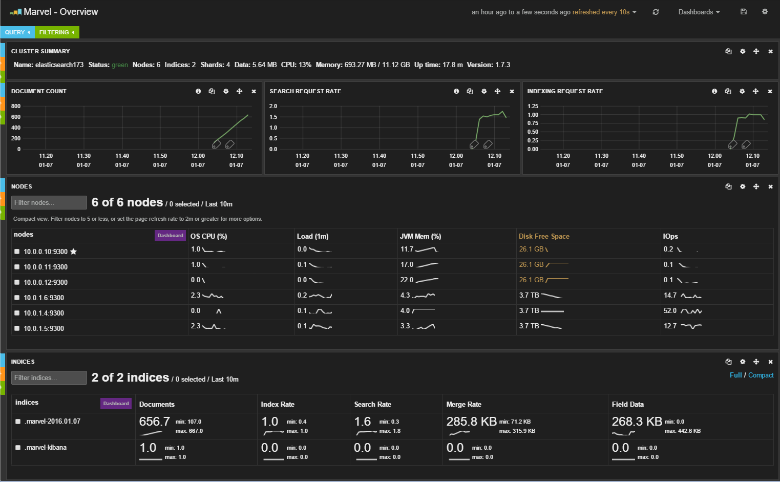

<properties
   pageTitle="Criando um ambiente de teste para Elasticsearch de desempenho | Microsoft Azure"
   description="Como configurar um ambiente para testar o desempenho de um cluster de Elasticsearch."
   services=""
   documentationCenter="na"
   authors="dragon119"
   manager="bennage"
   editor=""
   tags=""/>

<tags
   ms.service="guidance"
   ms.devlang="na"
   ms.topic="article"
   ms.tgt_pltfrm="na"
   ms.workload="na"
   ms.date="09/22/2016"
   ms.author="masashin"/>
   
# <a name="creating-a-performance-testing-environment-for-elasticsearch-on-azure"></a>Criando um ambiente de teste para Elasticsearch no Azure de desempenho

[AZURE.INCLUDE [pnp-header](../../includes/guidance-pnp-header-include.md)]

Este artigo é [parte de uma série](guidance-elasticsearch.md). 

Este documento descreve como configurar um ambiente para testar o desempenho de um cluster de Elasticsearch. Essa configuração foi usada para testar o desempenho dos dados inclusão e consulta cargas de trabalho, conforme descrito em [ajuste de desempenho de inclusão de dados para Elasticsearch no Azure][].

O processo de teste de desempenho usado [Apache JMeter](http://jmeter.apache.org/), com o [conjunto padrão](http://jmeter-plugins.org/wiki/StandardSet/) de plug-ins instalados em uma configuração principal/subordinada usando um conjunto de VMs dedicados (não faz parte do cluster Elasticsearch) especificamente configurado para o objetivo. 

O [Desempenho Server Agent](http://jmeter-plugins.org/wiki/PerfMonAgent/) foi instalado em cada nó Elasticsearch. As seções a seguir fornecem instruções para recriar o ambiente de teste para permitir que você conduza seu próprios testes de desempenho com JMeter. Estas instruções pressupõem que você já tiver criado um cluster Elasticsearch conosco conectados usando uma rede virtual Azure. 

Observe que o ambiente de teste também é executado como um conjunto de VMs Azure gerenciado por meio de um grupo de recursos Azure único.

[Marvel](https://www.elastic.co/products/marvel) também foi instalado e configurado para permitir que os aspectos internos do cluster Elasticsearch para ser monitoramento e analisados com mais facilidade. Se as estatísticas de JMeter mostraram um pico ou trough no desempenho, informações disponíveis por meio de Marvel podem ser muito útil para ajudar a determinar a causa das flutuações.

A imagem a seguir mostra a estrutura de todo o sistema. 


Observe os seguintes pontos:

- O mestre JMeter máquina virtual executa o Windows Server para fornecer o ambiente de interface gráfica do console JMeter. A VM JMeter mestre fornece a interface de gráfica (o aplicativo *jmeter* ) para habilitar um avaliador criar testes, executar testes e visualizar os resultados. Esta máquina virtual coordenadas com o servidor de JMeter VMs que realmente enviar as solicitações que constituem os testes.

- VMs subordinadas JMeter executam Ubuntu servidor (Linux), não há nenhum requisito de interface gráfica para essas VMs. O servidor de JMeter VMs executar o software de servidor de JMeter (o aplicativo *servidor jmeter* ) para enviar solicitações ao cluster Elasticsearch.

- Nós clientes dedicado não foram usados, embora foram dedicado nós mestres.

- O número de nós de dados no cluster pode variar, dependendo do cenário que está sendo testado.

- Todos os nós no cluster Elasticsearch executam Marvel observar desempenho no tempo de execução e o agente de servidor JMeter para coletar dados de monitoramento para análise posterior.

- Ao testar Elasticsearch 2.0.0 e posterior, um de nós dados também executa Kibana. Isso é necessário pela versão do Marvel que é executado em Elasticsearch 2.0.0 e posterior.

## <a name="creating-an-azure-resource-group-for-the-virtual-machines"></a>Criar um grupo de recursos Azure para as máquinas virtuais

O mestre JMeter precisa ser capaz de se conectar diretamente para cada um de nós no cluster Elasticsearch para coletar dados de desempenho. Se o JMeter VNet é diferente do cluster Elasticsearch VNet, isso envolve configurando cada nó Elasticsearch com um endereço IP público. Se isso for um problema com a configuração de Elasticsearch, considere a implementação VMs JMeter na mesma VNet como cluster Elasticsearch usando o mesmo grupo de recursos, nesse caso, você pode omitir esse procedimento primeiro.

Primeiro, [Crie um grupo de recursos](../resource-group-template-deploy-portal.md). Este documento presume que seu grupo de recursos é chamado *JMeterPerformanceTest*. Se você desejar executar VMs JMeter na mesma VNet como cluster Elasticsearch, use o mesmo grupo de recursos como esse cluster em vez de criar um novo.

## <a name="creating-the-jmeter-master-virtual-machine"></a>Criação de máquina virtual JMeter mestre

Próximo [criar uma máquina virtual Windows](../virtual-machines/virtual-machines-windows-hero-tutorial.md) usando a imagem do *Windows Server 2008 R2 SP1* .  Recomendamos selecionando um tamanho de máquina virtual com suficientes cores e memória para executar os testes de desempenho. Ideal será uma máquina com pelo menos 2 cores e 3,5 GB de RAM (A2 padrão ou maior).

<!-- TODO add info on why disabling diagnostics is positive --> 

Recomendamos que você desative o diagnóstico. Ao criar a máquina virtual no portal do, isso é feito no blade *configurações* na seção *monitoramento* em *Diagnóstico*. Deixe as outras configurações em seus valores padrão.

Verifique se que a máquina virtual e todos os recursos associados foram criados com êxito, [examinando o grupo de recursos](../azure-portal/resource-group-portal.md#manage-resource-groups) no portal. Os recursos listados devem consistir em uma máquina virtual, um grupo de segurança de rede e um endereço IP público com o mesmo nome e conta de armazenamento e interface de rede com nomes com base no que da máquina virtual.

## <a name="creating-the-jmeter-subordinate-virtual-machines"></a>Criação de máquinas virtuais subordinadas JMeter

Agora [Crie uma máquina virtual Linux](../virtual-machines/virtual-machines-linux-quick-create-portal.md) usando a imagem *Ubuntu servidor 14.04 LTS* .  Como com a máquina virtual mestre de JMeter, selecione um tamanho de máquina virtual com suficientes cores e memória para executar os testes de desempenho. Ideal será uma máquina com pelo menos 2 cores e pelo menos 3,5 GB de RAM (A2 padrão ou maior).

Novamente, recomendamos que você desabilite o diagnóstico.

Você pode criar quantas VMs subordinadas conforme desejar. 

## <a name="installing-jmeter-server-on-the-jmeter-subordinate-vms"></a>Instalando o servidor do JMeter nas VMs subordinadas JMeter

VMs subordinadas JMeter estejam executando o Linux e por padrão você não consegue se conectar a elas abrindo uma conexão de área de trabalho remota (RDP). Em vez disso, você pode [usar acabamento para abrir uma janela de linha de comando](../virtual-machines/virtual-machines-linux-mac-create-ssh-keys.md) em cada máquina virtual.

Depois que você conectou a uma das VMs subordinadas, usaremos Bash configurar JMeter.

Primeiro, instale o ambiente de tempo de execução Java necessários para executar JMeter.

```bash
sudo add-apt-repository ppa:webupd8team/java
sudo apt-get update
sudo apt-get install oracle-java8-installer
```

Agora, baixe o software de JMeter empacotado como um arquivo zip.

```bash
wget http://apache.mirror.anlx.net/jmeter/binaries/apache-jmeter-2.13.zip
```

Instale o comando descompactar e usá-lo para expandir o software JMeter. O software é copiado para uma pasta chamada **apache-jmeter-2,13**.

```bash
sudo apt-get install unzip
unzip apache-jmeter-2.13.zip
```

Altere o diretório *bin* mantém os executáveis JMeter e tornar os programas *jmeter-servidor* e *jmeter* executável.

```bash
cd apache-jmeter-2.13/bin
chmod u+x jmeter-server
chmod u+x jmeter
```

Agora, precisamos editar o arquivo `jmeter.properties` localizado na pasta atual (use o editor de texto que você está mais familiarizado, como *vi* ou *vim*). Localize as seguintes linhas:

```yaml
...
client.rmi.localport=0
...
server.rmi.localport=4000
...
```

Tire comentários (remover os principais \#caracteres #) e modificar essas linhas, conforme mostrado abaixo, e em seguida, salve o arquivo e feche o editor:

```yaml
...
client.rmi.localport=4441
...
server.rmi.localport=4440
```

Agora, execute os seguintes comandos para abrir a porta 4441 para tráfego de entrada TCP (essa é a porta que você acabou de configurar *jmeter-servidor* para ouvir em):

```bash
sudo iptables -A INPUT -m state --state NEW -m tcp -p tcp --dport 4441 -j ACCEPT
```

Baixe o arquivo zip que contém a coleção padrão de plug-ins do JMeter (esses plug-ins fornecem contadores de monitoramento de desempenho) e, em seguida, descompacte o arquivo para a pasta **apache-jmeter-2,13** . Descompactar o arquivo neste local coloca os plug-ins na pasta correta.

Se você for solicitado a substituir o arquivo de licença, digite R (para todos):

```bash
wget http://jmeter-plugins.org/downloads/file/JMeterPlugins-Standard-1.3.0.zip
unzip JMeterPlugins-Standard-1.3.0.zip
```

Use `nohup` iniciar o servidor JMeter no plano de fundo. Ele deve responder exibindo um ID de processo e uma mensagem indicando que ele tenha criado um objeto remoto e está pronto para começar a receber os comandos.  Execute o seguinte comando no diretório ~/apache-jmeter-2.13/bin. 

```bash
nohup jmeter-server &
```

> [AZURE.NOTE]Se a máquina virtual é encerrado o programa de servidor JMeter é encerrado. Você precisará se conectar para a máquina virtual e reiniciá-lo novamente manualmente. Como alternativa, você pode configurar o sistema para executar o comando *jmeter-server* automaticamente na inicialização adicionando os seguintes comandos para a `/etc/rc.local` arquivo (antes do comando *Sair 0* ):

```bash
sudo -u <username> bash << eoc
cd /home/<username>/apache-jmeter-2.13/bin
nohup ./jmeter-server &
eoc
```

Substituir `<username>` com seu nome de login.

Você talvez seja útil manter a janela do terminal aberta para que você pode monitorar o progresso do servidor JMeter enquanto o teste está em andamento.

Você precisará repetir essas etapas para cada VM subordinada JMeter.

## <a name="installing-the-jmeter-server-agent-on-the-elasticsearch-nodes"></a>Instalando o agente de servidor de JMeter em nós Elasticsearch

Este procedimento pressupõe que você tenha acesso de logon para os nós Elasticsearch. Se você tiver criado o cluster usando o modelo do Gerenciador de recursos, você pode conectar a cada nó por meio da caixa de salto máquina virtual, conforme ilustrado na seção de topologia de Elasticsearch da [Elasticsearch em execução no Azure](guidance-elasticsearch-running-on-azure.md). Você pode se conectar à caixa de salto usando acabamento também. 

A partir daí, você pode usar o comando *ssh* faça logon em cada um de nós no cluster Elasticsearch.

Faça logon um de nós Elasticsearch como administrador.  No prompt de comando Bash, insira os seguintes comandos para criar uma pasta para mantendo o agente de servidor JMeter e mover para essa pasta:

```bash
mkdir server-agent
cd server-agent
```

Execute os seguintes comandos para instalar o comando *Descompacte* (se ela já não estiver instalada), baixe o software do agente de servidor de JMeter e descompacte-lo:

```bash
sudo apt-get install unzip
wget http://jmeter-plugins.org/downloads/file/ServerAgent-2.2.1.zip
unzip ServerAgent-2.2.1.zip
```
 
Execute o seguinte comando para configurar o firewall e habilitar o tráfego TCP passem pela porta 4444 (essa é a porta usada pelo JMeter Server Agent):

```bash
sudo iptables -A INPUT -m state --state NEW -m tcp -p tcp --dport 4444 -j ACCEPT
```

Execute o seguinte comando para iniciar o agente de servidor de JMeter no plano de fundo:

```bash
nohup ./startAgent.sh &
```

O agente de servidor JMeter deve responder com mensagens indicando que ele foi iniciado e é escutar na porta 4444.  Pressione Enter para obter um prompt de comando e, em seguida, execute o seguinte comando.

```bash
telnet <nodename> 4444
```

Substituir `<nodename>` com o nome do nó. (Você pode encontrar o nome do seu nó executando o `hostname` comando.) Esse comando abre uma conexão de telnet à porta 4444 no computador local. Você pode usar esta conexão para verificar se o agente de servidor JMeter está funcionando corretamente.

Se não estiver executando o agente do servidor JMeter, você receberá a resposta 

`*telnet: Unable to connect to remote host: Connection refused*.`

Se estiver executando o agente do servidor JMeter e porta 4444 foi configurada corretamente, você verá a seguinte resposta:


> [AZURE.NOTE] Clonar não fornece qualquer tipo de prompt depois que ele se conectar.

No clonar, digite o seguinte comando:

``` 
test
```

Se o agente de servidor JMeter configurado e listening corretamente, ele deve indicar que recebeu o comando e responder com a mensagem *Yep*.

> [AZURE.NOTE]Você pode digitar em outros comandos para obter dados de monitoramento de desempenho. Por exemplo, o comando `metric-single:cpu:idle` lhe dará a proporção atual da hora em que a CPU está ociosa (isto é um instantâneo). Para obter uma lista completa de comandos, visite a página de [Desempenho Server Agent](http://jmeter-plugins.org/wiki/PerfMonAgent/) . : Para chamar ele Perfmon servidor agente. >>

No clonar, digite o seguinte comando para encerrar a sessão e retornar para o prompt de comando do Bash:

``` 
exit
```

> [AZURE.NOTE]Como com a JMeter subordinados VMs, se você faz logoff, ou se esta máquina está desligado e reiniciado, em seguida, o agente de servidor JMeter precisará ser reiniciado manualmente usando o `startAgent.sh` comando. Se quiser que o agente de servidor JMeter para iniciar automaticamente, adicione o comando a seguir para o final da `/etc/rc.local` arquivo antes do comando *Sair 0* . 
> Substituir `<username>` com seu nome de logon:

```bash
sudo -u <username> bash << eoc
cd /home/<username>/server-agent
nohup ./startAgent.sh &
eoc
```

Você pode agora ou repetir todo esse processo para todos os outros nós no cluster Elasticsearch, ou você pode usar o `scp` comando para copiar a pasta agente de servidor e o conteúdo para cada outro nó e use o `ssh` comando iniciar o agente de servidor de JMeter conforme mostrado abaixo. e substituir `<username>` com seu nome de usuário, e `<nodename>` com o nome do nó onde você deseja copiar e executar o software (você pode ser solicitado a fornecer a senha como executar cada comando):

```bash
scp -r \~/server-agent <username>@<nodename>:\~
ssh <nodename> sudo iptables -A INPUT -m state --state NEW -m tcp -p tcp --dport 4444 -j ACCEPT
ssh <nodename> -n -f 'nohup \~/server-agent/startAgent.sh'
```

## <a name="installing-and-configuring-jmeter-on-the-jmeter-master-vm"></a>Instalando e configurando JMeter na VM mestre JMeter

No portal do Azure, clique em **grupos de recursos**. Na lâmina **grupos de recursos** , clique no grupo de recursos que contém o mestre JMeter e VMs subordinadas.  Na lâmina **grupo de recursos** , clique na **máquina virtual de mestre JMeter**. Na máquina virtual lâmina, na barra de ferramentas, clique em **Conectar**. Abra o arquivo RDP quando solicitado pelo navegador da web. Windows cria uma conexão de área de trabalho remota para sua máquina virtual.  Insira o nome de usuário e a senha para a máquina virtual quando solicitado.

Na VM, usando o Internet Explorer, vá para a página de [Download Java para Windows](http://www.java.com/en/download/ie_manual.jsp) . Siga as instruções para baixar e executar o instalador do Java.

No navegador da web, vá para a página de [Download Apache JMeter](http://jmeter.apache.org/download_jmeter.cgi) e baixe o zip contendo o binário mais recente. Salve o CEP em um local conveniente em sua máquina virtual.

Vá para o site de [Plug-ins do JMeter personalizado](http://jmeter-plugins.org/) e baixar o conjunto padrão de plug-ins. Salve o CEP na mesma pasta que o download de JMeter da etapa anterior.

No Windows Explorer, vá para a pasta que contém a apache-arquivo jmeter -*xxx* zip, onde *xxx* é a versão atual do JMeter. Extrai os arquivos para a pasta atual.

Extrair os arquivos a JMeterPlugins-arquivo padrão -*yyy*. zip, onde *yyy* é a versão atual dos plug-ins, para a apache-pasta jmeter*xxx* . Isso adicionará os plug-ins do JMeter para a pasta correta. Com segurança, você pode mesclar as pastas de biblioteca e substituir os arquivos de licença e Leiame se for solicitado.

Vá para a apache-jmeter*xxx*/bin pasta e edite o jmeter.properties arquivo usando o bloco de notas.  No `jmeter.properties` arquivo, localize a seção rotulada *hosts remotos e configuração de RMI*.  Nesta seção do arquivo, localize a seguinte linha:

```yaml
remote_hosts=127.0.0.1
```

Altere essa linha e substitua a lista de endereço 127.0.0.1 com uma vírgula separado de endereços IP ou nomes de host para cada um dos servidores subordinados JMeter IP. Por exemplo:

```yaml
remote_hosts=JMeterSub1,JMeterSub2
```

Localizar a seguinte linha e, em seguida, remover a `#` caractere no início desta linha e modificar o valor das configurações client.rmi.localport de:

```yaml
#client.rmi.localport=0
```

Para:

```yaml
client.rmi.localport=4440
```

Salve o arquivo e feche o bloco de notas. 

Na barra de tarefas do Windows, clique em **Iniciar**, clique em **Ferramentas administrativas**e clique em **Firewall do Windows com segurança avançada**.  No Firewall do Windows com janela de segurança avançada, no painel esquerdo, clique com botão direito **Regras de entrada**e, em seguida, clique em **Nova regra**.

No **Assistente de nova entrada regra**, na página **Tipo de regra** , selecione a **porta**e clique em **Avançar**.  Na página de portas e protocolos, selecione **TCP**, selecione **portas locais específicas**, na caixa Digite texto `4440-4444`e, em seguida, clique em **Avançar**.  Na página de ação, selecione **Permitir a conexão**e clique em **Avançar**. Na página de perfil, deixe todas as opções marcadas e clique em **Avançar**.  Na página nome, o **nome da** caixa de texto Digite *JMeter*e clique em **Concluir**.  Feche o Firewall do Windows com janela de segurança avançada.

No Windows Explorer, na apache-jmeter*xx*/bin pasta, duas vezes no arquivo de lote *jmeter* Windows para iniciar a interface gráfica. A interface do usuário deve aparecer:


Na barra de menus, clique em **Executar**, clique em **Iniciar remoto**e verifique se as duas máquinas de subordinadas JMeter são listadas:


Agora você está pronto para iniciar o teste de desempenho.

## <a name="installing-and-configuring-marvel"></a>Instalando e configurando Marvel

O modelo de início rápido do Elasticsearch do Azure irão instalar e configurar a versão apropriada do Marvel automaticamente se você definir os parâmetros MARVEL e KIBANA para true ("Sim") durante a criação do cluster:


Se você estiver adicionando Marvel a um cluster existente, você precisará executar a instalação manualmente e o processo é diferente dependendo se você estiver usando a versão de Elasticsearch 1.7.x ou 2. x, conforme descrito nos procedimentos a seguir.

### <a name="installing-marvel-with-elasticsearch-173-or-earlier"></a>Instalando Marvel com Elasticsearch 1,73 ou anterior

Se você estiver usando o Elasticsearch 1.7.3 ou anterior, execute as seguintes etapas *em cada nó* no cluster:

- Faça logon no nó e mover para a pasta Elasticsearch.  No Linux, o diretório inicial típico é `/usr/share/elasticsearch`.

-  Execute o seguinte comando para baixar e instalar o plug-in Marvel para Elasticsearch:

```bash
sudo bin/plugin -i elasticsearch/marvel/latest
```

- Parar e reiniciar Elasticsearch no nó:

```bash
sudo service elasticsearch restart
```

- Para verificar se Marvel foi instalado corretamente, abra um navegador da web e vá para a URL `http://<server>:9200/_plugin/marvel`. Substituir `<server>` com o nome ou o endereço IP do servidor qualquer Elasticsearch no cluster.  Verifique se aparece uma página semelhante ao mostrado abaixo:




### <a name="installing-marvel-with-elasticsearch-200-or-later"></a>Instalando Marvel com Elasticsearch 2.0.0 ou posterior

Se você estiver usando o Elasticsearch 2.0.0 ou posterior, execute as seguintes tarefas *em cada nó* no cluster:

Faça logon no nó e mover para a pasta Elasticsearch (normalmente `/usr/share/elasticsearch`) execute os seguintes comandos para baixar e instalar o plug-in Marvel para Elasticsearch:

```bash
sudo bin/plugin install license
sudo bin/plugin install marvel-agent
```

Parar e reiniciar Elasticsearch no nó:

```bash
sudo service elasticsearch restart
```

No procedimento a seguir, substitua `<kibana-version>` com 4.2.2 se você estiver usando Elasticsearch 2.0.0 ou Elasticsearch 2.0.1 ou com 4.3.1 se você estiver usando Elasticsearch 2.1.0 ou posterior.  Substituir `<marvel-version>` com 2.0.0 se você estiver usando Elasticsearch 2.0.0 ou Elasticsearch 2.0.1 ou com 2.1.0 se você estiver usando Elasticsearch 2.1.0 ou posterior.  Execute as seguintes tarefas *em um nó* no cluster:

Logon nó e baixe a compilação apropriada do Kibana para sua versão do Elasticsearch da [Elasticsearch baixar site](https://www.elastic.co/downloads/past-releases)e extraia o pacote:

```bash
wget https://download.elastic.co/kibana/kibana/kibana-<kibana-version>-linux-x64.tar.gz
tar xvzf kibana-<kibana-version>-linux-x64.tar.gz
```

Abra porta 5601 para aceitar solicitações de entrada:

```bash
sudo iptables -A INPUT -m state --state NEW -m tcp -p tcp --dport 5601 -j ACCEPT
```

Mover para a pasta de configuração de Kibana (`kibana-<kibana-version>-linux-x64/config`), edite o `kibana.yml` de arquivo e, em seguida, adicione a seguinte linha. Substituir `<server>` com o nome ou o endereço IP de um servidor de Elasticsearch em cluster:

```yaml
elasticsearch.url: "http://<server>:9200"
```

Mover para a pasta de compartimento Kibana (`kibana-<kibana-version>-linux-x64/bin`), e execute o seguinte comando para integrar o plug-in Marvel Kibana:

```bash
sudo ./kibana plugin --install elasticsearch/marvel/<marvel-version>
```

Inicie Kibana:

```bash
sudo nohup ./kibana &
```

Para verificar a instalação Marvel, abra um navegador da web e vá para a URL `http://<server>:5601/app/marvel`. Substituir `<server>` com o nome ou o endereço IP do servidor que executa o Kibana.

Verifique se aparece uma página semelhante ao mostrado abaixo (o nome do seu cluster provavelmente irá variar daquele mostrado na imagem).


Clique no link que corresponde ao seu cluster (elasticsearch210 na imagem acima). Deverá aparecer uma página semelhante ao mostrado abaixo:


[Ajuste de desempenho de inclusão de dados para Elasticsearch no Azure]: guidance-elasticsearch-tuning-data-ingestion-performance.md  