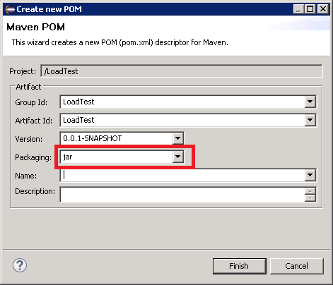
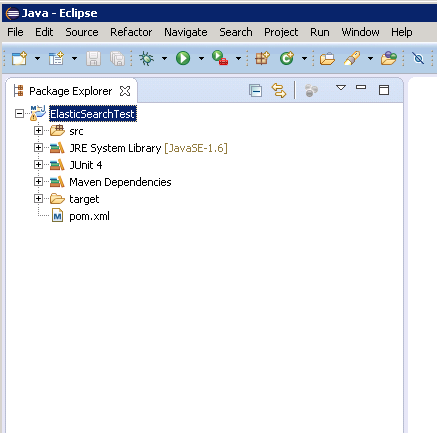
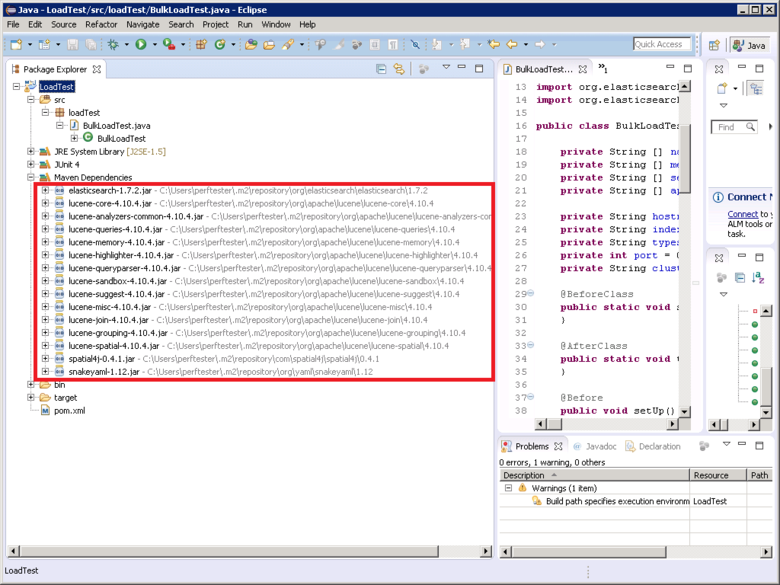

<properties
   pageTitle="Implantando um classificador JMeter JUnit para testar o desempenho de Elasticsearch | Microsoft Azure"
   description="Como usar uma amostra de JUnit para gerar e carregar dados em um cluster de Elasticsearch."
   services=""
   documentationCenter="na"
   authors="dragon119"
   manager="bennage"
   editor=""
   tags=""/>

<tags
   ms.service="guidance"
   ms.devlang="na"
   ms.topic="article"
   ms.tgt_pltfrm="na"
   ms.workload="na"
   ms.date="09/22/2016"
   ms.author="masashin"/>
   
# Implantando um classificador JMeter JUnit para testar o desempenho de Elasticsearch

[AZURE.INCLUDE [pnp-header](../../includes/guidance-pnp-header-include.md)]

Este artigo é [parte de uma série](guidance-elasticsearch.md). 

Este documento descreve como criar e usar uma amostra de JUnit que pode gerar e carregar dados em um cluster de Elasticsearch como parte de um plano de teste JMeter. Essa abordagem fornece uma abordagem altamente flexível para teste de carga que pode gerar grandes quantidades de dados de teste sem dependendo de arquivos de dados externos.

> [AZURE.NOTE] Os testes de carga usados para avaliar o desempenho da inclusão de dados descrito em [ajuste de desempenho de inclusão de dados para Elasticsearch](guidance-elasticsearch-tuning-data-ingestion-performance.md) foram criados usando essa abordagem. Os detalhes do código JUnit são descritos no documento.

Para teste desempenho de inclusão de dados, o código de JUnit foi desenvolvendo usando Eclipse (Marte) e as dependências foram resolvidas usando Maven. Os procedimentos a seguir descrevem o processo passo a passo para instalar o Eclipse, configurando Maven, criando um teste JUnit e implantar esse teste como uma amostra de solicitação de JUnit em um teste JMeter.

> [AZURE.NOTE] Para obter informações detalhadas sobre a estrutura e a configuração do ambiente de teste, consulte [Criando um ambiente de teste de desempenho para Elasticsearch no Azure][].

## Pré-requisitos de instalação

Você precisará do [Ambiente de tempo de execução Java](http://www.java.com/en/download/ie_manual.jsp) em sua máquina de desenvolvimento.
Você também precisará instalar o [Eclipse IDE para desenvolvedores Java](https://www.eclipse.org/downloads/index.php?show_instructions=TRUE).

> [AZURE.NOTE] Se você estiver usando o VM mestre JMeter descrito em [Criando um ambiente de teste de desempenho para Elasticsearch no Azure][] como seu ambiente de desenvolvimento, baixe a versão do Windows de 32 bits do instalador do Eclipse.

## Criar um projeto de teste de JUnit para Elasticsearch de teste de carga

Iniciar o Eclipse IDE se ainda não estiver sendo executado e feche a página de **boas-vindas** .  No menu **arquivo** , clique em e, em seguida, clique em **Projeto Java**.

Na janela **Novo projeto Java** , insira um nome de projeto, selecione **Usar padrão JRE**e clique em **Concluir**.

Na janela **Gerenciador de pacote** , expanda o nó chamado após seu projeto. Verifique se ela contém uma pasta chamada **src** e uma referência para o JRE especificado.

Clique com botão direito na pasta **src** , clique em **novo**e, em seguida, clique em **caso de teste JUnit**.

Na janela **novo caso de teste JUnit** , selecione **novo Junit 4 teste**, insira um nome para o pacote (pode ser o mesmo que o nome do projeto, embora por convenção nome deve começar com uma letra minúscula), um nome para a classe de teste e selecione as opções de geram os stubs de método necessários para o teste. Deixe a caixa de **classe em teste** vazia e clique em **Concluir**.

Se a caixa de diálogo **novo caso de teste de JUnit** seguinte for exibida, selecione a opção para adicionar a biblioteca de JUnit 4 para o caminho de compilação e clique em **Okey**. 

Verifique se o código estrutural para o teste de JUnit é gerado e exibido na janela do editor de Java.

No **Explorador de pacote**, clique com botão direito no nó do seu projeto, clique em **Configurar**e, em seguida, clique em **Converter em projeto Maven**.

> [AZURE.NOTE]Um projeto usando o Maven permite mais facilmente gerenciar dependências externas (como as bibliotecas de cliente Elasticsearch Java) depende.

Na caixa de diálogo **Criar novo POM** , na lista suspensa **embalagem** , selecione **jar**e clique em **Concluir**.

O painel que aparece abaixo do editor de (POM) do modelo de objeto do projeto pode exibir o aviso de "caminho de compilação Especifica o ambiente de execução J2SE 1.5. Não há nenhuma JREs instalados no espaço de trabalho terminantemente compatíveis com esse ambiente", dependendo de qual versão do Java estiver instalado no seu computador de desenvolvimento. Se você tiver uma versão do Java posterior à versão 1.5 ignore este aviso.

No editor de POM, expanda **Propriedades** e, em seguida, clique em **criar**.

Na caixa de diálogo **Adicionar propriedade** , na caixa **nome** , digite *es.version*, na caixa **valor** , digite *1.7.2*e clique em **Okey**. Esta é a versão da biblioteca Elasticsearch Java cliente usar (esta versão pode ser substituída no futuro, e definir a versão como uma propriedade POM e fazendo referência a essa propriedade em qualquer lugar dentro do projeto habilita a versão a ser alterada rapidamente).

Clique na guia **dependências** na base do editor de POM e clique em **Adicionar** ao lado da lista de **dependências** .

Na caixa de diálogo **Selecionar dependência** , na caixa **Id do grupo** , digite *org.elasticsearch*, na caixa **Id de artefato** digite *elasticsearch*, na caixa Digite **versão** * \${es.version}*e clique em **Okey**. Informações sobre a biblioteca de cliente Java Elasticsearch são mantidas no repositório Central Maven online, e essa configuração serão baixadas automaticamente a biblioteca e suas dependências quando o projeto é criado.

No menu **arquivo** , clique em **Salvar tudo**. Essa ação Salvar e criar o projeto, baixando as dependências especificadas pelo Maven. Verifique se a pasta Maven dependências aparece no Explorador de pacote. Expanda esta pasta para exibir os arquivos jar baixados para a biblioteca de cliente Elasticsearch Java de suporte.

## Importando um projeto de teste de JUnit existente para Eclipse

Este procedimento supõe que você baixou um projeto Maven que foi criado anteriormente usando Eclipse.

Inicie o Eclipse IDE. No menu **arquivo** , clique em **Importar**.

Na janela **Selecionar** , expanda a pasta **Maven** , clique em **Projetos Maven existentes**e clique em **Avançar**.

Na janela **Projetos Maven** , especifique a pasta mantendo o projeto (a pasta que contém o arquivo pom.xml), clique em **Selecionar tudo**e, em seguida, clique em **Concluir**.

Na janela **Gerenciador de pacote** , expanda o nó correspondente ao seu projeto. Verifique se o projeto contém uma pasta chamada **src**. Esta pasta contém o código-fonte para o teste de JUnit. O projeto pode ser compilado e implantado seguindo as instruções abaixo.

## Implantando um teste JUnit JMeter

Este procedimento pressupõe que você tenha criado um projeto chamado LoadTest contendo uma classe de teste JUnit denominada `BulkLoadTest.java` que aceita parâmetros de configuração passados como uma única cadeia de caracteres para um construtor (esse é o mecanismo que espera JMeter).

No IDE Eclipse, no **Pacote Explorer**, clique com botão direito no nó do projeto e clique em **Exportar**.

No **Assistente para exportação**, na página **Selecionar** , expanda o nó **Java** , clique em **arquivo JAR**e clique em **Avançar**.

Na página **JAR especificação de arquivo** , na caixa **Selecione os recursos a exportar** , expanda o projeto anular **.project**e desmarque **pom.xml**. Na caixa **arquivo JAR** , forneça um nome de arquivo e um local para o JAR (ele deve ser dada a extensão de arquivo. jar) e clique em **Concluir**.

Usando o Windows Explorer, copie o arquivo JAR você acabou de criar à JVM JMeter mestre e salve-o no apache-jmeter-2,13\\biblioteca\\junit pasta abaixo da pasta onde você instalou JMeter (consulte o procedimento "Criar a máquina virtual mestre do JMeter" na [criação de um ambiente de teste de desempenho para Elasticsearch no Azure](guidance-elasticsearch-creating-performance-testing-environment.md) para obter mais informações.)

Retorne ao Eclipse, expanda a janela **Gerenciador de pacote** e anote todos os arquivos JAR e seus locais listados na pasta Maven dependências do projeto. Observe que os arquivos exibidos na imagem a seguir podem variar dependendo de qual versão do Elasticsearch que você está usando:

Usando o Windows Explorer, copie cada arquivo JAR referenciado na pasta Maven dependências para o apache-jmeter-2,13\\biblioteca\\pasta junit na VM mestre JMeter.

Se a biblioteca\\junit pasta já contém versões mais antigas desses arquivos JAR e depois removê-los. Se você deixar no lugar o teste JUnit pode não funcionar como referências poderiam ser resolvidas para os JARs errados.

No mestre JMeter máquina virtual, interrompa JMeter se está sendo executado.  Inicie JMeter.  Em JMeter, **Plano de teste**de atalho, clique em **Adicionar**, clique em **Threads (usuários)**e clique em **Grupo de segmento**.

Sob o nó de **Plano de teste** , **Grupo de Thread**de atalho, clique em **Adicionar**, clique em **amostra**e clique em **Solicitação de JUnit**.

Na página de **Solicitação de JUnit** , selecione **Procurar anotações JUnit4 (em vez de JUnit 3)**. Na lista suspensa **nome da classe** , selecione sua classe de teste de carga de JUnit (ele será listado no formulário * &lt;pacote&gt;.&lt; classe&gt;*), no **Método de teste** lista de lista suspensa, selecione o JUnit Testar método (Este é o método que realmente executa o trabalho associado ao teste e devem ter sido marcada com a *@test* anotação no projeto Eclipse) e insira todos os valores a serem transmitidos para o construtor na caixa **Rótulo de cadeia de caracteres de construtor** . Os detalhes mostrados na imagem a seguir são exemplos de apenas; o **nome da classe**, * *Método de teste*, e * *Rótulo de cadeia de caracteres de construtor** provavelmente diferem entre esses mostrado.

Se sua classe não aparecer na lista suspensa **nome da classe** , provavelmente significa que o JAR não foi exportado corretamente ou não foi colocado na biblioteca\\junit pasta ou alguns dos JARs dependentes faltam a biblioteca\\junit pasta. Se isso acontecer, exportar o projeto do Eclipse novamente e certifique-se de que você selecionou o recurso **src** , copie o JAR para a biblioteca\\junit pasta e, em seguida, verifique se que você copiou todos os JARs dependentes listados por Maven para a pasta de biblioteca.

Feche JMeter. Não é necessário para salvar o plano de teste.  Copie o arquivo JAR contendo a classe de teste JUnit para o /home/&lt;username&gt;pasta /apache-jmeter-2.13/lib/junit em cada uma das VMs subordinadas JMeter (*&lt;username&gt; * é o nome do usuário administrativo especificado quando você criou a máquina virtual, consulte o procedimento "Criar máquinas virtuais subordinadas JMeter" na [criação de um ambiente de teste de desempenho para Elasticsearch no Azure](guidance-elasticsearch-creating-performance-testing-environment.md) para obter mais informações.)

Copie os arquivos JAR dependentes necessários a classe de teste JUnit para o /home/&lt;username&gt;pasta /apache-jmeter-2.13/lib/junit em cada uma das VMs subordinadas JMeter. Certifique-se remover as versões mais antigas de arquivos JAR desta pasta primeiro.

Você pode usar o `pscp` utilitário para copiar arquivos de um computador com Windows para Linux.

[Criando um ambiente de teste para Elasticsearch no Azure de desempenho]: guidance-elasticsearch-creating-performance-testing-environment.md
