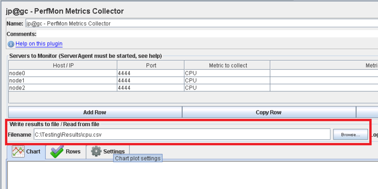
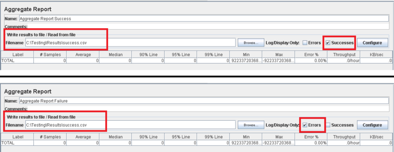

<properties
   pageTitle="Implementando um plano de teste JMeter para Elasticsearch | Microsoft Azure"
   description="Como executar desempenho testa Elasticsearch com JMeter."
   services=""
   documentationCenter="na"
   authors="dragon119"
   manager="bennage"
   editor=""
   tags=""/>

<tags
   ms.service="guidance"
   ms.devlang="na"
   ms.topic="article"
   ms.tgt_pltfrm="na"
   ms.workload="na"
   ms.date="09/22/2016"
   ms.author="masashin" />
   
# <a name="implementing-a-jmeter-test-plan-for-elasticsearch"></a>Implementando um plano de teste JMeter para Elasticsearch

[AZURE.INCLUDE [pnp-header](../../includes/guidance-pnp-header-include.md)]

Este artigo é [parte de uma série](guidance-elasticsearch.md). 

Os testes de desempenho realizados contra Elasticsearch foram implementados usando planos de teste de JMeter junto com o código de Java incorporada como um teste de JUnit para realizar tarefas como carregar dados em cluster. O plano de teste e o código de JUnit são descritas no [ajuste de desempenho de inclusão de dados para Elasticsearch no Azure][]e [ajuste de agregação de dados e desempenho de consulta para Elasticsearch no Azure][].

A finalidade deste documento é resumir a experiência de chave obtida com criando e executando esses planos de teste. A página de [Práticas recomendadas do JMeter](http://jmeter.apache.org/usermanual/best-practices.html) no site Apache JMeter contém mais generalizado conselhos sobre o uso JMeter efetivamente.

## <a name="implementing-a-jmeter-test-plan"></a>Implementação de um plano de teste JMeter

A lista a seguir resume os itens que você deve considerar ao criar um plano de teste JMeter:

- Crie um grupo de thread separada para cada teste que você deseja executar. Um teste pode conter várias etapas, incluindo controladores de lógica, temporizadores, pré e pós-processadores, classificadores e ouvintes.

- Evite criar muitos segmentos em um grupo de segmento. Um número excessivo de threads causará JMeter falha com "Memória fora" exceções. É melhor adicionar mais servidores subordinados JMeter cada um número menor de segmentos de tentar executar um grande número de segmentos em um único servidor JMeter executando.


- Para avaliar o desempenho do cluster, incorpore o plug-in [Coletor de métricas de desempenho](http://jmeter-plugins.org/wiki/PerfMon/) do plano de teste. Este é um ouvinte JMeter que está disponível como um dos plug-ins do JMeter padrão. Salvar os dados de desempenho bruto em um conjunto de arquivos no formato de valores separados por vírgula (CSV) e processá-los quando o teste for concluído. Isso é mais eficiente e impõe menor sobrecarga da JMeter que tentando processe os dados como ele é capturado. 



Você pode usar uma ferramenta de tal Excel para importar os dados e gerar uma variedade de gráficos para fins analíticos.

Considere capturando as seguintes informações:

- Utilização da CPU para cada nó no cluster Elasticsearch.

- O número de bytes lidos por segundo do disco para cada nó.

- Se possível, a porcentagem de CPU tempo gasto aguardando e/s ser executado em cada nó. Isso nem sempre é possível para VMs do Windows, mas para Linux, você pode criar uma métrica personalizada (uma métrica executivo) que executa o seguinte comando shell para chamar *vmstat* em um nó:

```Shell
sh:-c:vmstat 1 5 | awk 'BEGIN { line=0;total=0;}{line=line+1;if(line&gt;1){total=total+\$16;}}END{print total/4}'
```

16 de campo na saída do *vmstat* contém o tempo de CPU gasto aguardando e/s. Para obter mais informações sobre como funciona a esta política, consulte o [comando vmstat](http://linuxcommand.org/man_pages/vmstat8.html).

- O número de bytes enviados e recebidos através da rede para cada nó.

- Use ouvintes de relatório agregado separadas para registrar o desempenho e a frequência de operações bem-sucedidas e. Capture dados de sucesso e falha para arquivos diferentes.



- Manter cada caso de teste JMeter tão simples quanto possível habilitar a correlação diretamente desempenho com ações de teste específico. Para casos de teste que exigem lógica complexa, considere encapsulating essa lógica em um teste de JUnit e use a amostra de solicitação de JUnit JMeter para executar o teste.

- Use a amostra de solicitação HTTP para executar operações de HTTP, como GET, POST, colocar ou excluir. Por exemplo, você pode executar pesquisas de Elasticsearch usando uma consulta de POSTAGEM e fornecer os detalhes da consulta na caixa *Dados do corpo* :


- Facilidade de repetição e reutilização, parametrizar JMeter teste planos de teste. Você pode usar scripts para automatizar a execução de planos de teste.

## <a name="implementing-a-junit-test"></a>Implementação de um teste JUnit

Você pode incorporar código complexo um plano de teste JMeter criando um ou mais testes JUnit. Você pode escrever um teste JUnit usando um ambiente de desenvolvimento integrado (IDE) Java como Eclipse. [Implantando um classificador JMeter JUnit para testar o desempenho de Elasticsearch][] fornece informações sobre como configurar um ambiente de desenvolvimento apropriadas.

A lista a seguir resume algumas práticas recomendadas que você deve seguir ao escrever o código para um teste JUnit:

- Use o construtor de classe de teste para passar parâmetros de inicialização para o teste. JMeter pode usar um construtor que leva um argumento de cadeia de caracteres único. No construtor, analise esse argumento em seus elementos individuais, conforme mostrado pelo código exemplo a seguir:

```Java
private String hostName = "";
private String indexName = "";
private String typeName = "";
private int port = 0;
private String clusterName = "";
private int itemsPerBatch = 0;

/\* JUnit test class constructor \*/
public ElasticsearchLoadTest2(String params) {
    /* params is a string containing a set of comma separated values for:
        hostName
        indexName
        typeName
        port
        clustername
        itemsPerBatch
    */

    /* Parse the parameter string into an array of string items */
    String delims = "\[ \]\*,\[ \]\*"; // comma surrounded by zero or more spaces
    String\[\] items = params.split(delims);

    /* Note: Parameter validation code omitted */

    /* Use the parameters to populate variables used by the test */
    hostName = items[0];
    indexName = items[1];
    typeName = items[2];
    port = Integer.parseInt(items[3]);
    clusterName = items[4];
    itemsPerBatch = Integer.parseInt(items[5]);

    if(itemsPerBatch == 0)
        itemsPerBatch = 1000;
}
```

- Evite operações e/s ou outras operações demoradas no construtor ou classe de teste de configuração, pois eles executado a cada vez que executa o teste JUnit. (O mesmo teste JUnit pode executar milhares de vezes para cada teste de desempenho executado a partir JMeter.)

- Considere usar configuração única para inicialização caro caso de teste.

- Se o teste requer um grande número de parâmetros de entrada, armazenar informações de configuração de teste em um arquivo de configuração separada e passar o local do arquivo para o construtor.

- Evite a codificação caminhos de arquivo no código de teste de carga. Isso pode causar falhas devido a diferenças entre sistemas operacionais como o Windows e Linux.

- Use declarações para indicar falhas no JUnit testar métodos para que você possa controlá-los com JMeter e usá-los como uma métricas de negócios. Se possível, passe volta informações sobre a causa da falha, conforme mostrado em negrito no exemplo de código a seguir:

```Java
@Test
public void bulkInsertTest() throws IOException {
    ...
    BulkResponse bulkResponse = bulkRequest.execute().actionGet();
    assertFalse(
        bulkResponse.buildFailureMessage(), bulkResponse.hasFailures());
        ...
}
```


[Running Elasticsearch on Azure]: guidance-elasticsearch-running-on-azure.md
[Ajuste de desempenho de inclusão de dados para Elasticsearch no Azure]: guidance-elasticsearch-tuning-data-ingestion-performance.md
[Implantando um classificador JMeter JUnit para testar o desempenho de Elasticsearch]: guidance-elasticsearch-deploying-jmeter-junit-sampler.md
[Ajuste de desempenho de consulta para Elasticsearch no Azure e de agregação de dados]: guidance-elasticsearch-tuning-data-aggregation-and-query-performance.md
