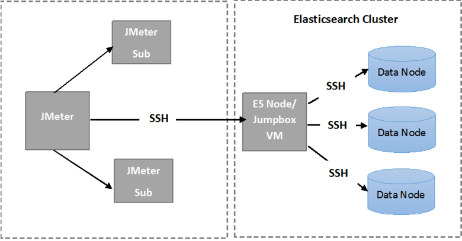

<properties
   pageTitle="Execução dos testes de resiliência Elasticsearch automatizados | Microsoft Azure"
   description="Descrição de como você pode executar os testes de resiliência em seu próprio ambiente."
   services=""
   documentationCenter="na"
   authors="dragon119"
   manager="bennage"
   editor=""
   tags=""/>

<tags
   ms.service="guidance"
   ms.devlang="na"
   ms.topic="article"
   ms.tgt_pltfrm="na"
   ms.workload="na"
   ms.date="09/22/2016"
   ms.author="masashin"/>

# <a name="running-the-automated-elasticsearch-resiliency-tests"></a>Execução dos testes de resiliência Elasticsearch automatizados

[AZURE.INCLUDE [pnp-header](../../includes/guidance-pnp-header-include.md)]

Este artigo é [parte de uma série](guidance-elasticsearch.md).

Em [Configurando resiliência e recuperação em Elasticsearch no Azure][elasticsearch-resilience-recovery], podemos descrito uma série de testes que foram executadas em relação a um cluster de Elasticsearch de amostra para determinar como o sistema respondido a algumas formas comuns de falha e como recuperá-la. Os testes foram script para ativá-los ser executado de uma maneira automatizada. Este documento descreve como você pode repetir os testes no seu ambiente. 

Cenários a seguir foram testados:

- **Falha de nó e reinicie sem perda de dados**. Um nó de dados for interrompido e reiniciado após 5 minutos.
Elasticsearch foi configurado para não realocar fragmentos ausentes nesse intervalo, para que nenhuma e/s adicional é incorridos no percorrer fragmentos. Quando o nó for reiniciado, o processo de recuperação traz os fragmentos nesse nó volta atualizado.

- **Falha de nó com perda de dados grave**. Um nó de dados for interrompido e os dados que ele contém são apagados para simular falha grave disco. O nó é, em seguida, reiniciado (após 5 minutos), efetivamente atuando como substituto para o nó original. O processo de recuperação requer recriar os dados ausentes para este nó e pode envolver realocação fragmentos contidos em outros nós.

- **Falha de nó e reiniciar com sem perda de dados, mas com realocação fragmentar**. Um nó de dados for interrompido e os fragmentos que mantém são realocados para outros nós. O nó é reiniciado e realocação mais ocorre para rebalancear cluster.

- **Sem interrupção atualizações**. Cada nó do cluster for interrompido e reiniciado após um pequeno intervalo para simular máquinas sendo reinicializadas após uma atualização de software. Somente um nó está parado em qualquer momento.
Fragmentos não são realocados enquanto um nó está inoperante.

## <a name="prerequisites"></a>Pré-requisitos

Os testes automatizados requerem os seguintes itens:

- Um cluster de Elasticsearch.

- Uma configuração de ambiente JMeter conforme descrito pelas [orientações de teste de desempenho]. 

- As seguintes adições instaladas na JMeter mestre máquina virtual somente.

    - Java Runtime 7.

    - Nodejs 4 ou posterior.

    - As ferramentas de linha de comando gito.

## <a name="how-the-scripts-work"></a>Como funcionam os scripts

Os scripts de teste destinam-se para executar na VM JMeter mestre. Quando você seleciona um teste para executar, os scripts realizar a seguinte sequência de operações:

1.  Inicie um plano de teste de JMeter passando os parâmetros que você especificou.

2.  Copie um script que executa as operações necessárias pelo teste para uma máquina virtual especificado no cluster. Isso pode ser qualquer máquina virtual que tem um endereço IP público ou a máquina virtual *Jumpbox* se você tiver criado o cluster usando o [modelo de início rápido do Azure Elasticsearch](https://github.com/Azure/azure-quickstart-templates/tree/master/elasticsearch).

3.  Execute o script na máquina virtual (ou Jumpbox).

A imagem a seguir mostra a estrutura do ambiente de teste e Elasticsearch cluster. Observe que os scripts de teste usam SSH (secure shell) para se conectar a cada nó no cluster para executar várias operações de Elasticsearch como parar ou reiniciar um nó.



## <a name="setting-up-the-jmeter-tests"></a>Configurando o JMeter testa

Antes de executar a resiliência testa deve compilar e implantar os testes JUnit localizados na pasta jmeter/resiliência/testes. Esses testes são referenciados pelo plano de teste JMeter. Para obter mais informações, consulte o procedimento "Importando um projeto de teste de JUnit existente para Eclipse" na [implantação de uma amostra de JMeter JUnit para testar o desempenho de Elasticsearch][].

Há duas versões dos testes JUnit contidos nas seguintes pastas:

- **Elasticsearch17.** O projeto nesta pasta gera o arquivo Elasticsearch17.jar. Use este JAR para teste versões de Elasticsearch 1.7.x

- **Elasticsearch20**. O projeto nesta pasta gera o arquivo Elasticsearch20.jar. Use este JAR para teste Elasticsearch versão 2.0.0 e posterior

Copie o arquivo JAR apropriado junto com o restante das dependências para suas máquinas JMeter. O processo é descrito pelo procedimento "Implantando um teste JUnit a JMeter" na [implantação de uma amostra de JMeter JUnit para teste de desempenho de Elasticsearch].

## <a name="configuring-vm-security-for-each-node"></a>Configurando a segurança de máquina virtual para cada nó

Os scripts de teste exigem um certificado de autenticação seja instalado em cada nó Elasticsearch cluster. Isso permite que os scripts sejam executados automaticamente sem solicitar um nome de usuário ou senha conforme eles se conectar a várias VMs.

Iniciar ao efetuar logon em um de nós no cluster Elasticsearch (ou a VM Jumpbox) e, em seguida, execute o seguinte comando para gerar uma chave de autenticação:

```Shell
ssh-keygen -t rsa
```

Enquanto estiver conectado ao nó Elasticsearch (ou Jumpbox), execute os seguintes comandos para cada nó nele Elasticsearch cluster. Substituir `<username>` com o nome de um usuário válido em cada máquina virtual e substituir `<nodename>` com o nome DNS ou o endereço IP da máquina virtual hospedando o nó Elasticsearch.
Observe que você será solicitado a senha do usuário durante a execução desses comandos.
Para obter mais informações, consulte [SSH login sem senha](http://www.linuxproblem.org/art_9.html):

```Shell
ssh <username>@<nodename> mkdir -p .ssh (
cat .ssh/id\_rsa.pub | ssh <username>*@<nodename> 'cat &gt;&gt; .ssh/authorized\_keys'
```

## <a name="downloading-and-configuring-the-test-scripts"></a>Baixar e configurar os scripts de teste

Os scripts de teste são fornecidos em um repositório gito. Use o procedimento a seguir para baixar e configurar os scripts.

Na JMeter mestre máquina onde você executará os testes, abra uma janela de desktop gito (gito Bash) e clonar repositório que contém os scripts, da seguinte maneira:

```Shell
git clone https://github.com/mspnp/azure-guidance.git
```

Mover para a pasta de testes de resiliência e execute o seguinte comando para instalar as dependências necessárias para executar testes:

```Shell
npm install
```

Se estiver executando o mestre JMeter no Windows, baixe [Plink](http://www.chiark.greenend.org.uk/~sgtatham/putty/download.html), que é uma interface de linha de comando para o cliente Telnet acabamento. Copie o Plink executável para a pasta de biblioteca-de testes de resiliência.

Se estiver executando o mestre JMeter no Linux, você não precisa baixar Plink, mas será necessário configurar a senha sem SSH entre o mestre JMeter e o nó de Elasticsearch ou Jumpbox você usou seguindo as etapas descritas no procedimento "Configurando máquina virtual segurança para cada nó." 

Editar os seguintes parâmetros de configuração no `config.js` arquivo para coincidir com o seu ambiente de teste e Elasticsearch cluster. Esses parâmetros são comuns a todos os testes:

| Nome | Descrição | Valor padrão |
| ---- | ----------- | ------------- |
| `jmeterPath` | Caminho do local onde se encontra JMeter. | `C:/apache-jmeter-2.13` |
| `resultsPath` | Diretório relativo onde o script descarta o resultado. | `results` |
| `verbose` | Indica se o script saídas no modo detalhado ou não. | `true` |
| `remote` | Indica se os testes JMeter executado localmente ou nos servidores remotos. | `true` |
| `cluster.clusterName` | O nome do cluster Elasticsearch. | `elasticsearch` |
| `cluster.jumpboxIp`         | O endereço IP da máquina Jumpbox.                 |-|
| `cluster.username`          | O usuário de administrador que você criou ao implantar o cluster. |-|
| `cluster.password`          | A senha do usuário administrador.                        |-|
| `cluster.loadBalancer.ip`   | O endereço IP do balanceador de carga Elasticsearch.    |-|
| `cluster.loadBalancer.url`  | URL base de Balanceador de carga.                          |-|

## <a name="running-the-tests"></a>Execução dos testes

Mover para a pasta de testes de resiliência e execute o seguinte comando:

```Shell
node app.js
```

O menu a seguir deve aparecer:


Insira o número do cenário que você deseja executar: `11`, `12`, `13` ou `21`. 

Depois de selecionar um cenário, o teste será executado automaticamente. Os resultados são armazenados como um conjunto de arquivos de valores separados por vírgula (CSV) em uma pasta criada sob o diretório de resultados. Cada execução tem sua própria pasta de resultados.
Você pode usar o Excel para analisar e dados de gráfico.

[Running Elasticsearch on Azure]: guidance-elasticsearch-running-on-azure.md
[Tuning Data Ingestion Performance for Elasticsearch on Azure]: guidance-elasticsearch-tuning-data-ingestion-performance.md
[diretrizes de teste de desempenho]: guidance-elasticsearch-creating-performance-testing-environment.md
[JMeter guidance]: guidance-elasticsearch-implementing-jmeter.md
[Considerations for JMeter]: guidance-elasticsearch-deploying-jmeter-junit-sampler.md
[Query aggregation and performance]: guidance-elasticsearch-query-aggregation-performance.md
[elasticsearch-resilience-recovery]: guidance-elasticsearch-configuring-resilience-and-recovery.md
[Resilience and Recovery Testing]: guidance-elasticsearch-running-automated-resilience-tests.md
[Implantando um classificador JMeter JUnit para testar o desempenho de Elasticsearch]: guidance-elasticsearch-deploying-jmeter-junit-sampler.md
