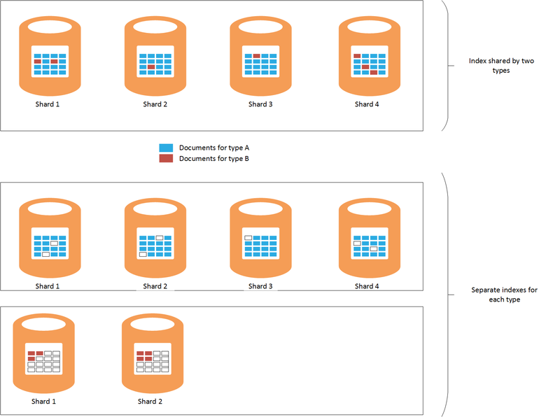
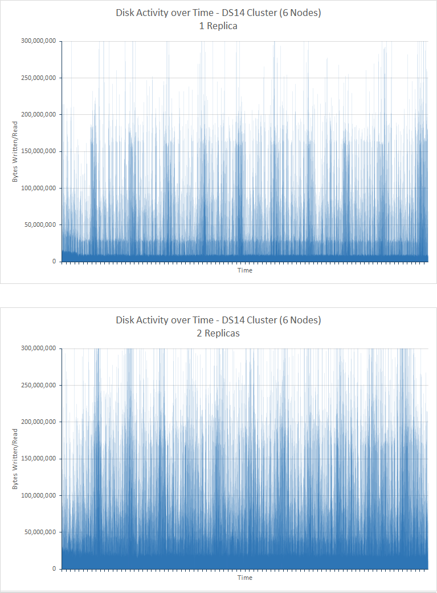
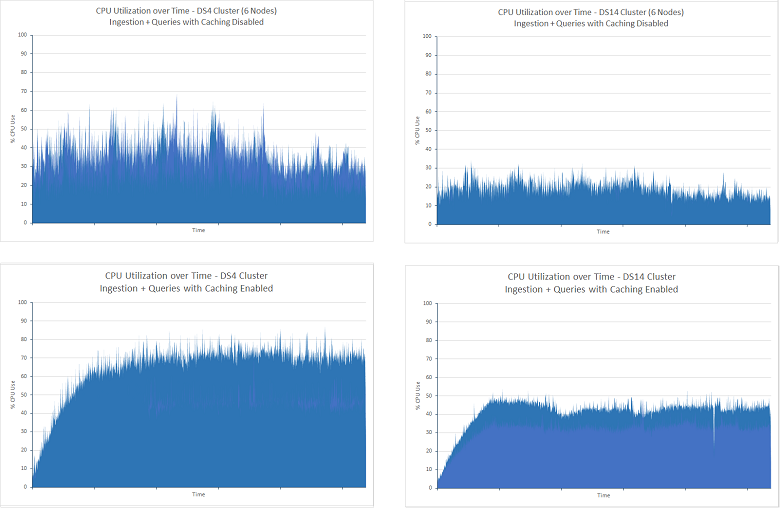
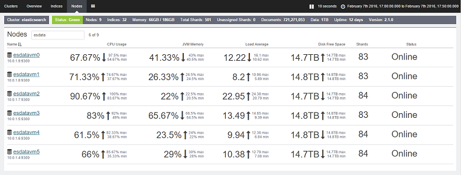

<properties
   pageTitle="Ajuste de desempenho de consulta e de agregação de dados com Elasticsearch no Azure | Microsoft Azure"
   description="Um resumo das considerações ao otimizar desempenho de consulta e pesquisa para Elasticsearch."
   services=""
   documentationCenter="na"
   authors="dragon119"
   manager="bennage"
   editor=""
   tags=""/>

<tags
   ms.service="guidance"
   ms.devlang="na"
   ms.topic="article"
   ms.tgt_pltfrm="na"
   ms.workload="na"
   ms.date="09/22/2016"
   ms.author="masashin"/>
   
# <a name="tuning-data-aggregation-and-query-performance-with-elasticsearch-on-azure"></a>Ajuste de desempenho de consulta e de agregação de dados com Elasticsearch no Azure

[AZURE.INCLUDE [pnp-header](../../includes/guidance-pnp-header-include.md)]

Este artigo é [parte de uma série](guidance-elasticsearch.md). 

A principal razão usando Elasticsearch é oferecer suporte a pesquisas por meio de dados. Usuários devem ser capazes de localizar rapidamente as informações que está procurando. Além disso, o sistema deve permitir que os usuários faça perguntas dos dados, atingir correlações e que podem ser conclusões que podem direcionar decisões de negócios. Esse processamento é o que diferencia dados de informações.

Este documento resume as opções que você pode considerar ao determinar a melhor maneira otimizar seu sistema de pesquisa e consulta de desempenho.

Todas as recomendações de desempenho dependem amplamente os cenários que se aplicam a sua situação, o volume de dados que você está indexando e a taxa em que aplicativos e usuários consultar seus dados. Você deve cuidadosamente testar os resultados de qualquer alteração na configuração ou estrutura de indexação usando seus próprios dados e cargas de trabalho para avaliar os benefícios para seus cenários específicos. Para esse fim, este documento também descreve um número de avaliações que foram executadas para um cenário específico implementado usando configurações diferentes. Você pode adaptar a abordagem utilizada para avaliar o desempenho dos seus próprios sistemas. Os detalhes desses testes são descritos no [Apêndice](#appendix-the-query-and-aggregation-performance-test).

## <a name="index-and-query-performance-considerations"></a>Considerações de desempenho de indexação e consulta

Esta seção descreve alguns fatores comuns que você deve pensar sobre quando criar índices que precisam de suporte consultando e pesquisa rápida.

### <a name="storing-multiple-types-in-an-index"></a>Armazenar vários tipos em um índice

Um índice de Elasticsearch pode conter vários tipos. Talvez seja melhor evitar essa abordagem e criar um índice separado para cada tipo. Considere os seguintes pontos:

- Diferentes tipos podem especificar analyzers diferentes e nem sempre é claro qual analisador Elasticsearch deve usar se uma consulta é executada no nível do índice em vez de no nível do tipo. Consulte [Evitando armadilhas de tipo](https://www.elastic.co/guide/en/elasticsearch/guide/current/mapping.html#_avoiding_type_gotchas) para obter detalhes.

- Fragmentos índices que conter vários tipos de provavelmente será maiores do que aqueles para índices que contêm um único tipo. Quanto maior a fragmentar, maior o esforço é requerido pelo Elasticsearch para filtrar dados ao executar consultas.

- Se houver uma incompatibilidade significativa entre volumes de dados para os tipos de, informações para um tipo podem ficar modo disperso distribuídas entre muitos fragmentos reduzindo a eficiência de pesquisas que recuperar esses dados.

    

    ***Os efeitos de um índice entre tipos de compartilhamento*** 

    Na parte superior do diagrama, o mesmo índice é compartilhado por documentos do tipo A e b tipo. Há muitos documentos do tipo A que tipo de que b procura um será do tipo envolvem consultando fragmentos de quatro todos. A parte inferior do diagrama mostra o efeito se índices separados são criados para cada tipo. Nesse caso, pesquisas para um será do tipo somente requerem acessando dois fragmentos.

- Fragmentos pequenos podem ser distribuição mais uniforme que fragmentos grandes, tornando mais fácil para Elasticsearch distribuir a carga entre nós.

- Tipos diferentes podem ter diferentes períodos de retenção. Pode ser difícil de arquivar dados antigos que compartilha fragmentos com dados ativos.


No entanto, em algumas circunstâncias compartilhando um índice em tipos pode ser eficiente se:

- Pesquisas regularmente abrangem tipos contidos no mesmo índice.

- Os tipos de tem apenas um pequeno número de documentos que cada. Manter um conjunto separado de fragmentos para cada tipo pode se tornar uma sobrecarga significativa nesse caso.


### <a name="optimizing-index-types"></a>Otimizando tipos de índice

Um índice de Elasticsearch contém uma cópia dos documentos JSON originais que foram usadas para preenchê-la. Esta informação é mantida na [* \_fonte*](https://www.elastic.co/guide/en/elasticsearch/reference/current/mapping-source-field.html#mapping-source-field) campo de cada item indexada. Esses dados não é pesquisáveis, mas por padrão são retornados por solicitações *get* e *pesquisa* . No entanto, esse campo gera sobrecarga e ocupa armazenamento, aumentando fragmentos e aumentar o volume de i/o realizado. Você pode desativar o * \_fonte* campo em uma base por tipo:

```http
PUT my_index
{
  "mappings": {
    "my_type": {
      "_source": {
        "enabled": false
      }
    }
  }
}
```
Desabilitar esse campo também remove a capacidade de executar as seguintes operações:

- Atualizando dados no índice usando a *Atualizar* API.

- Executando pesquisas que retornam dados realçados.

- Reindexação de um índice de Elasticsearch diretamente para outro.

- Alterando os mapeamentos ou configurações de análise.

- Consultas de depuração exibindo o documento original.


### <a name="reindexing-data"></a>Reindexação dados

O número de fragmentos disponíveis para um índice basicamente determina a capacidade do índice. Você pode realizar uma estimativa inicial (e informada) em fragmentos quantos será necessários, mas sempre considere seu documento Reindexando estratégia antecipadamente. Em muitos casos, a reindexação pode ser uma tarefa pretendida que os dados crescem. Talvez você não queira alocar um grande número de fragmentos a um índice inicialmente, para fins de otimização de pesquisa, mas alocar fragmentos novos medida que se expande o volume de dados. Em outros casos reindexação talvez precise ser executada em uma base ad-hoc mais se suas estimativas sobre o crescimento do volume de dados simplesmente provam para estar corretas.

> [AZURE.NOTE] Reindexação talvez não seja necessária para dados que expira rapidamente. Nesse caso, um aplicativo pode criar um novo índice para cada período de tempo. Exemplos incluem logs de desempenho ou dados que podem ser armazenados em um índice de clara cada dia de auditoria.

<!-- -->

Reindexação efetivamente envolve a criar um novo índice a partir dos dados em uma antiga e, em seguida, removendo o índice antigo. Se um índice for grande, esse processo pode levar tempo e talvez seja necessário garantir que os dados permaneçam pesquisáveis durante esse período. Por isso, você deve criar um [alias para cada índice](https://www.elastic.co/guide/en/elasticsearch/reference/current/indices-aliases.html)e consultas devem recuperar dados por esses aliases. Durante a reindexação, mantenha o alias apontando para o índice antigo e alterne para referenciar o novo índice quando reindexação for concluída. Essa abordagem também é útil para acessar dados baseados em tempo que cria um novo índice cada dia. Para acessar o atual dados usam um alias que muda para o novo índice como ela é criada.

### <a name="managing-mappings"></a>Gerenciando mapeamentos

Elasticsearch usa mapeamentos para determinar como interpretar os dados que ocorre em cada campo em um documento. Cada tipo tem seu próprio mapeamento, que efetivamente define um esquema para esse tipo. Elasticsearch usa essas informações para gerar índices invertidos para cada campo nos documentos em um tipo. Em qualquer documento, cada campo tem um tipo de dados (como *cadeia de caracteres*, *Data*ou *longo*) e um valor. Você pode especificar os mapeamentos para um índice quando o índice é criado ou pode ser inferidas por Elasticsearch quando novos documentos forem adicionados a um tipo. No entanto, considere os seguintes pontos:

- Mapeamentos gerados dinamicamente podem causar erros dependendo de como os campos são interpretados quando documentos forem adicionados a um índice. Por exemplo, documento 1 pode conter um campo que contém um número e causas Elasticsearch para adicionar um mapeamento que especifica que esse campo é *longo*. Se um documento subsequente é adicionado no campo que contém dados não numéricos, ele falhará. Nesse caso, um campo deve provavelmente sido interpretado como uma cadeia de caracteres quando o primeiro documento foi adicionado. Especificar este mapeamento quando o índice for criado pode ajudar a evitar esses problemas.

- Design seus documentos para evitar Gerando mapeamentos muito grandes, como isso pode adicionar significativo sobrecarga ao executar pesquisas, consumir muita memória e também causar a falha localizar dados nas consultas. Adote uma convenção de nomenclatura consistente para campos em documentos que compartilham o mesmo tipo. Por exemplo, não use nomes de campos como "nome", "Nome" e "forename" em documentos diferentes. Use o mesmo nome de campo em cada documento. Além disso, não tente usar valores como chaves (Isso é uma abordagem comum em bancos de dados de coluna família, mas pode causar falhas e deficiências com Elasticsearch.) Para obter mais informações, consulte [Explosão mapeamento](https://www.elastic.co/blog/found-crash-elasticsearch#mapping-explosion).

- Use *not_analyzed* para evitar a geração de tokens onde apropriado. Por exemplo, se um documento contiver um campo de cadeia de caracteres chamado *dados* que contém o valor "ABC-DEF", em seguida, você pode tentar realizar uma pesquisa para todos os documentos que correspondam a esse valor da seguinte maneira:

  ```http
  GET /myindex/mydata/_search
  {
    "query" : {
      "filtered" : {
        "filter" : {
          "term" : {
            "data" : "ABC-DEF"
          }
        }
      }
    }
  }
  ```

 No entanto, esta pesquisa falhará retornar os resultados esperados devido a maneira em que a cadeia de caracteres ABC-DEF é indexada quando ele é indexado. Ele será efetivamente dividido em dois tokens, ABC e DEF, por um hífen. Esse recurso foi projetado para dar suporte a pesquisa de texto completo, mas se quiser que a cadeia de caracteres a ser interpretadas como um único item atômico você deve desativar geração de tokens quando o documento é adicionado ao índice. Você pode usar um mapeamento como esta:

  ```http
  PUT /myindex
  {
    "mappings" : {
      "mydata" : {
        "properties" : {
          "data" : {
            "type" : "string",
            "index" : "not_analyzed"
          }
        }
      }
    }
  }
  ```

  Para obter mais informações, consulte [Localizar valores exatos](https://www.elastic.co/guide/en/elasticsearch/guide/current/_finding_exact_values.html#_term_filter_with_text).


### <a name="using-doc-values"></a>Usando valores de documento

Muitas consultas e agregações exigem que os dados são classificados como parte da operação de pesquisa. Classificação requer ser capaz de mapear um ou mais termos para uma lista de documentos. Para ajudar esse processo, Elasticsearch pode carregar todos os valores de um campo usado como uma chave de classificação na memória. Esta informação é conhecida como *fielddata*. O objetivo é que cache fielddata na memória incorridos por menos e/s e pode ser mais rápido que repetidamente os mesmos dados de leitura do disco. No entanto, se um campo tiver alta cardinalidade armazenando o fielddata na memória pode consumir muito espaço em pilha, possivelmente afetar a capacidade de executar outras operações simultâneas ou até mesmo esgotamento dos causando Elasticsearch falha de armazenamento.

Como uma abordagem alternativa, Elasticsearch também oferece suporte a *valores de documento*. Um valor de documento é semelhante a um item de fielddata na memória, exceto que ele é armazenado em disco e criado quando os dados são armazenados em um índice (os fielddata é construída dinamicamente quando uma consulta é executada.) Valores de documento não consumir o espaço de pilha e então são úteis para consultas que classificar ou agregar dados entre os campos que podem conter um grande número de valores exclusivos. Além disso, a pressão reduzida na pilha pode ajudar a deslocamento as diferenças de desempenho entre recuperar dados do disco e da memória de leitura. Coleta de lixo é provável que ocorra com menos frequência e outras operações simultâneas que utilizam memória são menos probabilidade de ser afetados.

Você habilitar ou desabilitar valores de documento em uma base por propriedade em um índice usando o atributo *doc_values* , conforme mostrado pelo seguinte exemplo:

```http
PUT /myindex
{
  "mappings" : {
    "mydata" : {
      "properties" : {
        "data" : {
          ...
          "doc_values": true
        }
      }
    }
  }
}
```
> [AZURE.NOTE] Valores de documento são ativadas por padrão com Elasticsearch versão 2.0.0 em diante.

O impacto exato usando valores do documento é provavelmente ser altamente específicos para seus próprios cenários de dados e consulta, portanto, esteja preparado para conduzir testes de desempenho para estabelecer sua utilidade. Observe também que doc valores não funcionam com campos de cadeia de caracteres analisado. Para obter mais informações, consulte [Valores de documento](https://www.elastic.co/guide/en/elasticsearch/guide/current/doc-values.html#doc-values).

### <a name="using-replicas-to-reduce-query-contention"></a>O uso de réplicas para reduzir disputa de consulta

Uma estratégia comum para melhorar o desempenho das consultas é criar várias réplicas de cada índice. Operações de recuperação de dados podem ser atendidas pelo buscar dados a partir de uma réplica. No entanto, essa estratégia seriamente pode afetar o desempenho inclusão das operações de dados, portanto ela precisa ser usado com cuidado em cenários que envolvem cargas de trabalho mistas. Além disso, essa estratégia é apenas de benefício se réplicas são distribuídas entre nós e não competem por recursos com primários fragmentos que fazem parte do mesmo índice. Lembre-se de que é possível aumentar ou diminuir o número de réplicas para um índice dinamicamente.

### <a name="using-the-shard-request-cache"></a>Usando o cache de solicitação fragmentar

Elasticsearch pode armazenar em cache os dados locais solicitados por consultas em cada fragmentar na memória. Este pesquisas permite que recuperam os mesmos dados seja executado mais rapidamente, dados podem ser lidos do armazenamento de memória em vez do disco. Cache de dados dessa maneira, portanto, pode melhorar o desempenho de algumas operações de pesquisa, custo reduzindo a memória disponível para outras tarefas sendo executadas simultaneamente. Também há o risco que dados servidas do cache de estão desatualizada. Os dados no cache são invalidados somente quando o fragmentar é atualizada e os dados forem alterados. A frequência das atualizações é controlada pelo valor da configuração *refresh_interval* do índice.

Solicitação de armazenamento em cache para um índice é desabilitada por padrão, mas você pode habilitá-lo da seguinte maneira:

```http
PUT /myindex/_settings
{
  "index.requests.cache.enable": true
}
```

O cache de solicitação fragmentar é mais adequado para informações que permanecem relativamente estáticas, como dados históricos ou log.

### <a name="using-client-nodes"></a>Usando nós do cliente

Todas as consultas são processadas pelo nó que primeiro recebe a solicitação. Este nó envia ainda mais solicitações para todos os outros nós contendo fragmentos para os índices que está sendo consultados e, em seguida, acumula os resultados para retornar a resposta. Se uma consulta envolve agregar dados ou executando cálculos complexos, o nó inicial é responsável por executar o processamento apropriado. Se seu sistema tiver que dar suporte a um número relativamente pequeno de consultas complexas, considere a criação de um pool de cliente nós para amenizar a carga de nós de dados. Por outro lado, se seu sistema tiver lidar com um grande número de consultas simples, em seguida, envie essas solicitações direto para os nós de dados e usam um balanceador de carga para distribuir as solicitações uniformemente.

### <a name="tuning-queries"></a>Ajuste de consultas

Os pontos a seguir resumem dicas para maximizar o desempenho das consultas de Elasticsearch:

- Evite consultas que envolvem curingas sempre que possível.

- Se o mesmo campo está sujeito a texto completo pesquisando e exato correspondência, considere armazenar os dados do campo em formulários analisados e nonanalyzed. Realize pesquisas de texto completo contra o campo analisado e correspondências exatas contra o campo nonanalyzed.

- Apenas retorne os dados necessários. Se você tiver documentos grandes, mas um aplicativo requer apenas informações mantidas em um subconjunto dos campos, em seguida, retorne esse subconjunto de consultas em vez de documentos inteiros. Essa estratégia pode reduzir os requisitos de largura de banda de rede do cluster.

- Sempre que possível, use filtros em vez de consultas ao procurar dados. Um filtro simplesmente determina se um documento corresponde a um determinado critério enquanto uma consulta também calcula como fechar uma correspondência de um documento é (pontuação). Internamente, os valores gerados por um filtro são armazenados como um bitmap indicando correspondência/não correspondência para cada documento, e eles podem ser cache por Elasticsearch. Se o mesmo critério de filtro ocorrer posteriormente, o bitmap pode ser recuperado do cache e usado para buscar rapidamente os documentos correspondentes. Para obter mais informações, consulte [Operação interna do filtro](https://www.elastic.co/guide/en/elasticsearch/guide/current/_finding_exact_values.html#_internal_filter_operation).

- Usar filtros de *bool* para realizar comparações estáticas e use somente *e*, *ou*e *não* filtros para filtros calculados dinamicamente, como aquelas que envolvem o script ou a *geográfica -\* * filtros.

- Se uma consulta combina *bool* filtros com *e*, *ou*, ou *não* com *geográfica -* * filtros, coloque o *e*/*ou*/*geográfica-* * filtros último para que eles operam o menor possível de conjunto de dados.

    Da mesma forma, use um *post_filter* para executar operações de filtro caro. Esses filtros serão executados última.

- Usar agregações em vez de aspectos. Evite Calculando agregados que são analisadas ou que têm muitos valores possíveis.

    > **Observação**: aspectos foram removidos do Elasticsearch versão 2.0.0.

- Use a agregação de *Cardinalidade* em preferência a agregação de *value_count* , a menos que seu aplicativo requer uma contagem exata de itens correspondentes. Uma contagem exata pode se tornar rapidamente desatualizada e muitos aplicativos solicitar somente uma aproximação razoável.

- Evite o script. Scripts em consultas e filtros podem ser caros e os resultados não são armazenadas em cache. Scripts de execução longa podem consumir pesquisa threads indefinidamente, causando solicitações subsequentes para ser enfileirados. Se a fila encher, ainda mais solicitações serão rejeitadas.

## <a name="testing-and-analyzing-aggregation-and-search-performance"></a>Teste e analisar o desempenho de agregação e pesquisa

Esta seção descreve os resultados de uma série de testes que foram executados no cluster variável e configurações de índice. Dois tipos de testes foram executados, da seguinte maneira:

- *Consulta e *a *inclusão* teste * *. Este teste iniciado com um índice vazio que foi preenchido como o teste seguidos executando operações de inserção em massa (cada operação adicionado documentos de 1000). Ao mesmo tempo, um número de consultas projetado para procurar documentos adicionados durante o período de 15 minutos anterior e gerar agregações foram repetido em intervalos de 5 segundos. Este teste normalmente foi permitida para executar por 24 horas, para reproduzir os efeitos de uma carga de trabalho desafiador que compõem a inclusão de dados em grande escala com perto consultas em tempo real.

- **A *consulta somente* **de teste. Este teste é semelhante ao *inclusão e consulta* testar, exceto que a parte de inclusão for omitida, e o índice em cada nó será preenchido com 100 milhões de documentos. Um conjunto aperfeiçoado de consultas é executado; o elemento de tempo limitando documentos para aqueles adicionados nos últimos 15 minutos foi removido como os dados agora estavam estáticos. Os testes executados para 90 minutos, há menos tempo necessário para estabelecer um padrão de desempenho devido a quantidade fixa de dados.

---

Cada documento no índice tinha o mesmo esquema. Esta tabela resume os campos no esquema:

Nome                          | Tipo         | Anotações |
  ----------------------------- | ------------ | -------------------------------------------------------- |
  Organização                  | Cadeia de caracteres      | O teste gera 200 organizações exclusivas. |
  CustomField1 - CustomField5   |Cadeia de caracteres       |Estas são cinco campos de cadeia de caracteres que são definidos como a cadeia de caracteres vazia.|
  DateTimeRecievedUtc           |Carimbo de hora    |A data e a hora em que o documento foi adicionado.|
  Host                          |Cadeia de caracteres       |Este campo está definido como a cadeia de caracteres vazia.|
  HttpMethod                    |Cadeia de caracteres       |Este campo está definido como um dos seguintes valores: "Postar", "Obter", "Colocar".|
  HttpReferrer                  |Cadeia de caracteres       |Este campo está definido como a cadeia de caracteres vazia.|
  HttpRequest                   |Cadeia de caracteres       |Esse campo é preenchido com texto aleatório entre 10 e 200 caracteres.|
  HttpUserAgent                 |Cadeia de caracteres       |Este campo está definido como a cadeia de caracteres vazia.|
  HttpVersion                   |Cadeia de caracteres       |Este campo está definido como a cadeia de caracteres vazia.|
  Nome_da_Organização              |Cadeia de caracteres       |Este campo está definido para o mesmo valor que o campo da organização.|
  SourceIp                      |IP           |Este campo contém um endereço IP indicando a "origem" dos dados. |
   SourceIpAreaCode              |Longas         |Este campo está definido como 0.|
  SourceIpAsnNr                 |Cadeia de caracteres       |Este campo está definido como "como\#\#\#\#\#".|
  SourceIpBase10                |Longas         |Este campo está definido como 500.|
  SourceIpCountryCode           |Cadeia de caracteres       |Este campo contém um código de país/região 2 caracteres. |
  SourceIpCity                  |Cadeia de caracteres       |Este campo contém uma cadeia de caracteres identificando uma cidade em um país. |
  SourceIpLatitude              |Duplo       |Este campo contém um valor aleatório.|
  SourceIpLongitude             |Duplo       |Este campo contém um valor aleatório.|
  SourceIpMetroCode             |Longas         |Este campo está definido como 0.|
  SourceIpPostalCode            |Cadeia de caracteres       |Este campo está definido como a cadeia de caracteres vazia.|
  SourceLatLong                 |Ponto de localização geográfica   |Este campo está definido como um ponto de localização geográfica aleatório.|
  Porta_da_origem                    |Cadeia de caracteres       |Esse campo é preenchido com a representação de cadeia de caracteres de um número aleatório.|
  TargetIp                      |IP           |Isso é preenchido com um endereço IP aleatório no intervalo 0.0.100.100 para 255.9.100.100.|
  SourcedFrom                   |Cadeia de caracteres       |Este campo está definido como a cadeia de caracteres "MonitoringCollector".|
  TargetPort                    |Cadeia de caracteres       |Esse campo é preenchido com a representação de cadeia de caracteres de um número aleatório.|
  Classificação                        |Cadeia de caracteres       |Este campo é preenchido com um dos 20 valores de cadeia de caracteres diferente selecionadas aleatoriamente.|
  UseHumanReadableDateTimes     |Booliano      |Esse campo é definido como false.|
 
As consultas a seguir foram realizadas como um lote por cada iteração dos testes. Os nomes em itálico são usados para se referir a essas consultas no restante deste documento. Observe que o critério de tempo (documentos adicionados nos últimos 15 minutos) foi omitido a *somente consulta* testes:

- Quantos documentos com cada valor de *classificação* inseridos nos últimos 15 minutos (*contagem por classificação*)? 

- Quantos documentos foram adicionados em cada intervalo de 5 minutos nos últimos 15 minutos (*contagem ao longo do tempo*)?

- Quantos documentos de cada valor de *classificação* foram adicionados para cada país nos últimos 15 minutos (*visitas por país*)?

- Quais 15 organizações ocorrerem maioria dos documentos com frequência em adicionado nos últimos 15 minutos (*15 maiores organizações*)?

- Quantas organizações diferentes ocorrem em documentos adicionados nos últimos 15 minutos (*organizações contagem exclusivo*)?

- Quantos documentos foram adicionados nos últimos 15 minutos (*Contagem Total de visitas*)?

- Quantos valores diferentes de *SourceIp* ocorrerem no documentos adicionados nos últimos 15 minutos (*contagem de IP exclusivo*)?


A definição do índice e os detalhes das consultas são descritas no [Apêndice](#appendix-the-query-and-aggregation-performance-test).

Os testes foram projetados para compreender os efeitos das seguintes variáveis:

- **Tipo de disco**. Os testes foram executados em um cluster de 6 nós de VMs D4 usando armazenamento padrão (unidades de disco rígido) e repetidos em um cluster de nó 6 de VMs DS4 usando o armazenamento de premium (SSDs).

- **Tamanho de máquina - dimensionamento para cima**. Testes foram executados em um cluster de 6 nós que compõem DS3 VMs (designado como o *pequeno* cluster), repetidos em um cluster de DS4 VMs (o cluster *Médio* ) e repetidos novamente em um cluster de máquinas DS14 (o cluster *grande* ). A tabela a seguir resume as características principais de cada SKU VM:

 Cluster | SKU DE MÁQUINA VIRTUAL        | Número de cores | Número de discos de dados | (GB) DE RAM |
---------|---------------|-----------------|----------------------|----------|
 Pequeno   | DS3 padrão  | 4               | 8                    | 14       |
 Média  | DS4 padrão  | 8               | 16                   | 28       |
 Grande   | DS14 padrão | 16              | 32                   | 112      |

- **Tamanho de cluster - dimensionamento**. Testes foram realizados em clusters de VMs DS14 contendo 1, 3 e 6 nós.

- **Número de réplicas de índice**. Testes foram realizados usando índices configurados com réplicas 1 e 2.

- **Valores de documento**. Inicialmente os testes foram realizados com o índice definindo *doc_values* definida como *true* (o valor padrão). Testes selecionados foram repetidos com *doc_values* definido como *false*.

- **Armazenamento em cache**. Testes foram realizados com o cache de solicitação de fragmentar habilitado no índice.

- **Número de fragmentos**. Testes foram repetidos usando números de fragmentos variáveis para estabelecer se consultas encontrei com mais eficiência índices contendo fragmentos de menor e maiores ou menores, mais fragmentos.


## <a name="performance-results---disk-type"></a>Resultados de desempenho - tipo de disco

Desempenho do disco foi avaliado executando o teste de *consulta e inclusão* no cluster 6 nós de VMs D4 (usando unidades de disco rígido) e em cluster 6 nós de VMs DS4 (usando SSDs). A configuração do Elasticsearch em ambos os clusters era o mesmo. Os dados foi difundir através de 16 discos em cada nó e cada nó tinha 14GB de RAM alocada na máquina virtual Java (JVM) executando Elasticsearch, a memória restante (também 14GB) foi deixada para uso do sistema operacional. Cada teste executado durante 24 horas. Esse período foi selecionado para ativar os efeitos da crescente volume de dados para tornar-se evidente e permitir que o sistema se estabilizar. A tabela a seguir resume os resultados, realce os tempos de resposta de várias operações que engloba o teste.

 Cluster | Operação/consulta            | Tempo de resposta médio (ms) |
---------|----------------------------|----------------------------|
 D4      | Inclusão                  | 978                        |
         | Contagem por classificação            | 103                        |
         | Contagem ao longo do tempo            | 134                        |
         | Visitas por país            | 199                        |
         | 15 principais organizações       | 137                        |
         | Contagem exclusivo organizações | 139                        |
         | Contagem de IP exclusivo            | 510                        |
         | Contagem total de ocorrências           | 89                         |
 DS4     | Inclusão                  | 511                        |
         | Contagem por classificação            | 187                        |
         | Contagem ao longo do tempo            | 411                        |
         | Visitas por país            | 402                        |
         | 15 principais organizações       | 307                        |
         | Contagem exclusivo organizações | 320                        |
         | Contagem de IP exclusivo            | 841                        |
         | Contagem total de ocorrências           | 236                        |

A princípio, parece que o cluster DS4 executadas consultas menos bem que o cluster D4, às vezes dobrar (ou pior) o tempo de resposta. Isso não aborda toda a história apesar. A próxima tabela mostra o número de operações de inclusão realizado por cada cluster (Lembre-se de que cada operação carrega documentos de 1000):

 Cluster | Contagem de operação de inclusão |
---------|---------------------------|
 D4      | 264769                    |
 DS4     | 503157                    |

Cluster DS4 conseguiu carregar quase duas vezes mais dados do que o cluster D4 durante o teste. Portanto, ao analisar os tempos de resposta para cada operação, você também precisa considerar quantos documentos cada consulta tem para digitalizar e quantos documentos são retornados. Estas são figuras dinâmicas como o volume de documentos no índice vem aumentando continuamente. Você não pode simplesmente dividir 503137 por 264769 (o número de operações de inclusão realizado por cada cluster) e, em seguida, multiplique o resultado pelo tempo de resposta médio para cada consulta realizada pelo cluster D4 para dar um comparativo informações como isso ignora a quantidade de e/s está sendo executado simultaneamente pela operação de inclusão. Em vez disso, você deve medir a quantidade física de dados sejam gravados e lidos no disco conforme o teste prossegue. O plano de teste JMeter captura essas informações para cada nó. Os resultados resumidos são:

 Cluster | Média de bytes gravados/lido por cada operação |
---------|----------------------------------------------|
 D4      | 13471557                                     |
 DS4     | 24643470                                     |

Esses dados mostram que o cluster DS4 conseguiu sustentar a uma taxa de e/s cerca de 1,8 vezes que do cluster D4. Considerando que, além de natureza dos discos, todos os outros recursos são os mesmos, a diferença deve ser devido a usando o SSDs preferir HDDs.

Para ajudar a justificar essa conclusão, os gráficos a seguintes ilustram como i / o foi realizado ao longo do tempo por cada cluster:


<!-- -->

***Atividade de disco para os clusters D4 e DS4***

O gráfico para o cluster D4 mostra variação significativa, especialmente durante a primeira metade do teste. Isso era provavelmente devido a otimização para reduzir a taxa de e/s. Nos estágios iniciais do teste, as consultas são capazes de executar rapidamente como há dados pouco para analisar. Os discos no cluster D4, portanto, serão prováveis estar operando Fechar para suas operações de entrada/saída por segunda capacidade de (IOPS), embora cada operação pode não estar retornando quantidade de dados. Cluster DS4 aceita uma taxa IOPS superior e não apresenta o mesmo grau de otimização, as taxas de e/s são mais regulares. Para oferecer suporte a essa teoria, o próximo par de gráficos mostram como a CPU foi bloqueada pelo i / disco ao longo do tempo (os tempos de espera do disco mostrados nos gráficos são a proporção entre o tempo que a CPU gasto aguardando e/s):


***O disco de CPU e/s aguardar horas para os clusters D4 e DS4***

É importante entender o que há dois motivos predominantes para operações de e/s bloquear a CPU:

- O subsistema de e/s poderia ser ler ou gravar dados em ou de disco.

- O subsistema de e/s pode ser controlado pelo ambiente de host. Azure disco implementado usando unidades de disco rígido tiver uma taxa de transferência máxima de 500 IOPS e SSDs possui uma taxa de transferência máxima de 5000 IOPS.


Para o cluster D4, a quantidade de tempo gasta aguardando e/s durante a primeira metade de correlaciona o teste perto de maneira invertida com o gráfico mostrando as taxas de e/s. Períodos de baixa i/o correspondem aos períodos de tempo significativo que a CPU gasta bloqueados, isso indica que o i/o está sendo limitado. Conforme mais dados são adicionados ao cluster as alterações de situação e na segunda metade dos picos de teste e/s tempos de espera correspondem com picos de produtividade e/s. Neste ponto, a CPU está bloqueada ao realizar e/s real. Novamente, com o cluster DS4, o tempo gasto aguardando e/s é muito maior. Cada pico corresponde a um pico equivalente no desempenho e/s em vez de pelo, isso significa que há ocorrendo limitação pouco ou nenhum.

Não há um dos outro fatores a considerar. Durante o teste, cluster D4 gerado 10584 erros de inclusão e 21 erros de consulta. O teste no cluster DS4 produzidas sem erros.

## <a name="performance-results---scaling-up"></a>Resultados de desempenho - dimensionamento para cima

Teste de escala-up foi realizado executando testes contra clusters 6 nós de DS3, DS4 e DS14 VMs. Estes SKUS foram selecionadas porque uma máquina virtual DS4 fornece dobro cores de CPU e memória como um DS3 e uma máquina DS14 dobra os recursos da CPU novamente, fornecendo quatro vezes a quantidade de memória. A tabela a seguir compara os principais aspectos de cada SKU:

 SKU  | \#Cores de CPU | Memória (GB) | Disco de max IOPS | Largura de banda máxima (MB/s)|
------|-------------|-------------|---------------|--------------|
 DS3  | 4           | 14          | 12,800| 128 |
 DS4  | 8           | 28          | 25,600| 256 |
 DS14 | 16          | 112         | 50.000| 512 |

A tabela a seguir resume os resultados da execução dos testes no grandes clusters (DS14), pequena (DS3) e média (DS4). Cada máquina virtual usado SSDs para manter os dados. Cada teste executado durante 24 horas.

A tabela informa o número de solicitações bem-sucedidas para cada tipo de consulta (falhas não estão incluídas). O número de solicitações uma tentativa para cada tipo de consulta é aproximadamente o mesmo durante uma execução do teste. Isso ocorre porque o plano de teste JMeter executa uma única ocorrência de cada consulta (contagem por classificação, contagem ao longo do tempo, visitas por país, superior 15 organizações, organizações de contagem exclusivo, contagem de IP exclusivo e Contagem Total de visitas) juntos em uma unidade única conhecida como uma *transação de teste* (esta transação é independente da tarefa que realiza a operação de inclusão, que é executada por um thread separado). Cada iteração do plano de teste executa uma transação de teste único. O número de transações de teste concluídas, portanto, é uma medida do tempo de resposta da consulta mais lento em cada transação.

| Cluster      | Operação/consulta            | Número de solicitações | Tempo de resposta médio (ms) |
|--------------|----------------------------|--------------------|----------------------------|
| Pequeno (DS3)  | Inclusão                  | 207284             | 3328                       |
|              | Contagem por classificação            | 18444              | 268                        |
|              | Contagem ao longo do tempo            | 18444              | 340                        |
|              | Visitas por país            | 18445              | 404                        |
|              | 15 principais organizações       | 18439              | 323                        |
|              | Contagem exclusivo organizações | 18437              | 338                        |
|              | Contagem de IP exclusivo            | 18442              | 468                        |
|              | Contagem total de ocorrências           | 18428              | 294   
|||||
| Média (DS4) | Inclusão                  | 503157             | 511                        |
|              | Contagem por classificação            | 6958               | 187                        |
|              | Contagem ao longo do tempo            | 6958               | 411                        |
|              | Visitas por país            | 6958               | 402                        |
|              | 15 principais organizações       | 6958               | 307                        |
|              | Contagem exclusivo organizações | 6956               | 320                        |
|              | Contagem de IP exclusivo            | 6955               | 841                        |
|              | Contagem total de ocorrências           | 6958               | 236                        |
|||||
| Grande (DS14) | Inclusão                  | 502714             | 511                        |
|              | Contagem por classificação            | 7041               | 201                        |
|              | Contagem ao longo do tempo            | 7040               | 298                        |
|              | Visitas por país            | 7039               | 363                        |
|              | 15 principais organizações       | 7038               | 244                        |
|              | Contagem exclusivo organizações | 7037               | 283                        |
|              | Contagem de IP exclusivo            | 7037               | 681                        |
|              | Contagem total de ocorrências           | 7038               | 200                        |

Esses números mostram que, para este teste, o desempenho do cluster DS4 e DS14 eram razoavelmente semelhantes. Os tempos de resposta para as operações de consulta para o cluster DS3 também aparecem comparar favorável inicialmente, e o número de operações de consulta realizada é muito maior que os valores para o cluster DS4 e DS14. No entanto, um também deve levar forte aviso da taxa de inclusão e o número resultante de documentos que está sendo pesquisada. No cluster DS3 inclusão é muito mais restrito e no final do teste de banco de dados continha somente cerca de 40% dos documentos lidos por cada um dos outros dois clusters. É possível devido a recursos de processamento, de rede e largura de banda do disco disponível para uma máquina virtual de DS3 comparada a uma DS4 ou máquina virtual DS14. Considerando que uma máquina virtual DS4 tem dobro recursos disponíveis como uma máquina virtual DS3 e um DS14 tem duas vezes (quatro vezes para memória) os recursos de uma máquina virtual DS4, resta uma pergunta: por que é a diferença em taxas de inclusão entre os clusters DS4 e DS14 significativamente menor do que o que ocorre entre os clusters DS3 e DS4? Isso pode ser devido a utilização de rede e limites de largura de banda de VMs do Azure. Os gráficos abaixo mostram esses dados para todos os três clusters:


**Utilização de rede para os clusters DS3, DS4 e DS14 executar o teste de inclusão e consulta** 

<!-- -->

Os limites de largura de banda de rede disponível com VMs do Azure não são publicados e podem variar, mas o fato de atividade de rede parece ter levelled em uma média de aproximadamente 2.75GBps para os dois a DS4 e testes de DS14 sugere que esse limite atingido e tornou o fator principal no restringindo produtividade. No caso de cluster DS3, a atividade de rede foi consideravelmente inferior para que o desempenho inferior é mais provável devido a restrições na disponibilidade de outros recursos.

Para isolar os efeitos das operações de inclusão e ilustram como o desempenho da consulta varia conforme nós dimensionar para cima, um conjunto de testes somente consulta foi executado usando os mesmos nós. A tabela a seguir resume os resultados obtidos em cada cluster:

> [AZURE.NOTE] Você não deve comparar o desempenho e o número de solicitações executadas por consultas na *somente consulta* teste com aqueles executado pelo teste *inclusão e consulta* . Isso ocorre porque as consultas foram modificadas e o volume de documentos envolvidos é diferente.

| Cluster      | Operação/consulta            | Número de solicitações | Resposta média Ttme (ms) |
|--------------|----------------------------|--------------------|----------------------------|
| Pequeno (DS3)  | Contagem por classificação            | 464                | 11758                      |
|              | Contagem ao longo do tempo            | 464                | 14699                      |
|              | Visitas por país            | 463                | 14075                      |
|              | 15 principais organizações       | 464                | 11856                      |
|              | Contagem exclusivo organizações | 462                | 12314                      |
|              | Contagem de IP exclusivo            | 461                | 19898                      |
|              | Contagem total de ocorrências           | 462                | 8882  
|||||
| Média (DS4) | Contagem por classificação            | 1045               | 4489                       |
|              | Contagem ao longo do tempo            | 1045               | 7292                       |
|              | Visitas por país            | 1053               | 7564                       |
|              | 15 principais organizações       | 1055               | 5066                       |
|              | Contagem exclusivo organizações | 1051               | 5231                       |
|              | Contagem de IP exclusivo            | 1051               | 9228                       |
|              | Contagem total de ocorrências           | 1051               | 2180                       |
|||||
| Grande (DS14) | Contagem por classificação            | 1842               | 1927                       |
|              | Contagem ao longo do tempo            | 1839               | 4483                       |
|              | Visitas por país            | 1838               | 4761                       |
|              | 15 principais organizações       | 1842               | 2117                       |
|              | Contagem exclusivo organizações | 1837               | 2393                       |
|              | Contagem de IP exclusivo            | 1837               | 7159                       |
|              | Contagem total de ocorrências           | 1837               | 642                        |

Desta vez, as tendências nos tempos de resposta médio entre os diferentes clusters é mais clara. Utilização de rede está bem abaixo do 2.75GBps necessários anteriormente clusters DS4 e DS14 (que provavelmente saturado rede nos testes inclusão e consulta) e o 1.5GBps para o cluster DS3. Na verdade, é mais próximo de 200MBps em todos os casos, conforme mostrado pelo gráficos abaixo:


***Utilização de DS3, de rede clusters DS4 e DS14 executar o teste somente consulta*** 

O fator de limitação no clusters DS3 e DS4 agora parece ser da CPU, que é fechar para 100% para a maior parte do tempo. No DS14 uso de cluster CPU as médias pouco mais 80%. Isso é ainda alto, mas claramente realça as vantagens de ter mais cores de CPU disponíveis. A imagem a seguir mostra os padrões de uso do CPU para os clusters DS3, DS4 e DS14.


***Utilização da CPU para os clusters DS3 e DS14 executar o teste somente consulta*** 

## <a name="performance-results---scaling-out"></a>Resultados de desempenho - dimensionamento

Para ilustrar como o sistema expande-se com o número de nós, testes foram executados usando clusters DS14 contendo 1, 3 e 6 nós. Somente desta vez, a *consulta somente* teste foi executado, usando 100 milhões de documentos e em execução para 90 minutos:

| Cluster | Operação/consulta            | Número de solicitações | Tempo de resposta médio (ms) |
|---------|----------------------------|--------------------|----------------------------|
| 1 nó  | Contagem por classificação            | 288                | 6216                       |
|         | Contagem ao longo do tempo            | 288                | 28933                      |
|         | Visitas por país            | 288                | 29455                      |
|         | 15 principais organizações       | 288                | 9058                       |
|         | Contagem exclusivo organizações | 287                | 19916                      |
|         | Contagem de IP exclusivo            | 284                | 54203                      |
|         | Contagem total de ocorrências           | 287                | 3333                       |
|||||
| 3 nós | Contagem por classificação            | 1194               | 3427                       |
|         | Contagem ao longo do tempo            | 1194               | 5381                       |
|         | Visitas por país            | 1191               | 6840                       |
|         | 15 principais organizações       | 1196               | 3819                       |
|         | Contagem exclusivo organizações | 1190               | 2938                       |
|         | Contagem de IP exclusivo            | 1189               | 12516                      |
|         | Contagem total de ocorrências           | 1191               | 1272                       |
|||||
| Nós de 6 | Contagem por classificação            | 1842               | 1927                       |
|         | Contagem ao longo do tempo            | 1839               | 4483                       |
|         | Visitas por país            | 1838               | 4761                       |
|         | 15 principais organizações       | 1842               | 2117                       |
|         | Contagem exclusivo organizações | 1837               | 2393                       |
|         | Contagem de IP exclusivo            | 1837               | 7159                       |
|         | Contagem total de ocorrências           | 1837               | 642                        |

O número de nós faz uma diferença significativa no desempenho consulta do cluster, embora de maneira não linear. O cluster 3 nós conclui aproximadamente 4 horas como muitas consultas como cluster de nó único, enquanto o cluster 6 nós manipula 6 horas como muitos. Para ajudar a explicar este nonlinearity, os gráficos a seguintes mostram como a CPU foi sendo consumida por três clusters:


***Utilização da CPU para o 1, 3 e 6 nós clusters executar o teste somente consulta***

Os clusters de nó único e 3 nós são vinculados à CPU, enquanto embora utilização da CPU é alta no cluster 6 nós capacidade de processamento de reserva está disponível. Nesse caso, outros fatores são provavelmente estar limitando a produtividade. Isso pode ser confirmado testando conosco 9 e 12, que provavelmente mostrarão ainda mais capacidade de processamento de substituição.

Os dados na tabela acima também mostram como os tempos de resposta médio para as consultas variam. Este é o item que é mais informativo ao testar como escalas de um sistema para tipos específicos de consulta. Algumas pesquisas são claramente muito mais eficientes quando abrangendo mais nós do que outras pessoas. Isso pode ser devido a proporção entre o número de nós e o número de documentos no aumento de cluster, cada cluster contidos 100 milhões de documentos. Ao executar pesquisas que envolvem agregar dados, Elasticsearch processará e os dados recuperados como parte do processo de agregação na memória em cada nó de buffer. Se houver mais nós, há menos dados para recuperar, buffer e processar em cada nó.

## <a name="performance-results---number-of-replicas"></a>Resultados de desempenho - número de réplicas

Os testes de *inclusão e consulta* foram executados em relação a um índice com uma única réplica. Os testes foram repetidos em 6 nós DS4 e DS14 clusters usando um índice configurado com duas réplicas. Todos os testes executado durante 24 horas. A tabela a seguir mostra os resultados comparativos para réplicas de um e dois:

| Cluster | Operação/consulta            | Tempo de resposta médio (ms) - 1 réplica | Tempo de resposta médio (ms) - 2 réplicas | % diferença no tempo de resposta |
|---------|----------------------------|----------------------------------------|-----------------------------------------|-------------------------------|
| DS4     | Inclusão                  | 511                                    | 655                                     | + 28%                          |
|         | Contagem por classificação            | 187                                    | 168                                     | -10%                          |
|         | Contagem ao longo do tempo            | 411                                    | 309                                     | -25%                          |
|         | Visitas por país            | 402                                    | 562                                     | + 40%                          |
|         | 15 principais organizações       | 307                                    | 366                                     | + 19%                          |
|         | Contagem exclusivo organizações | 320                                    | 378                                     | + 18%                          |
|         | Contagem de IP exclusivo            | 841                                    | 987                                     | + 17%                          |
|         | Contagem total de ocorrências           | 236                                    | 236                                     | + 0%                           |
||||||
| DS14    | Inclusão                  | 511                                    | 618                                     | + 21%                          |
|         | Contagem por classificação            | 201                                    | 275                                     | + 37%                          |
|         | Contagem ao longo do tempo            | 298                                    | 466                                     | + 56%                          |
|         | Visitas por país            | 363                                    | 529                                     | + 46%                          |
|         | 15 principais organizações       | 244                                    | 407                                     | + 67%                          |
|         | Contagem exclusivo organizações | 283                                    | 403                                     | + 42%                          |
|         | Contagem de IP exclusivo            | 681                                    | 823                                     | + 21%                          |
|         | Contagem total de ocorrências           | 200                                    | 221                                     | + 11%                          |

A taxa de inclusão reduzida conforme o número de réplicas aumentado. Isso deve ser esperado como Elasticsearch está gravando mais cópias de cada documento, gerando i/o disco adicional.  Isso é refletido pelos gráficos para o cluster DS14 para índices com 1 e 2 réplicas mostradas na imagem abaixo. No caso de índice com 1 réplica, a taxa de e/s média foi 16896573 bytes/segundo. O índice com 2 réplicas, a taxa de e/s média foi 33986843 bytes/segundo, apenas sobre dobro.



***Taxas de i / disco para nós com 1 e 2 réplicas executar o teste de inclusão e consulta***

| Cluster | Consulta                      | Tempo de resposta médio (ms) - 1 réplica | Tempo de resposta médio (ms) - 2 réplicas |
|---------|----------------------------|----------------------------------------|-----------------------------------------|
| DS4     | Contagem por classificação            | 4489                                   | 4079                                    |
|         | Contagem ao longo do tempo            | 7292                                   | 6697                                    |
|         | Visitas por país            | 7564                                   | 7173                                    |
|         | 15 principais organizações       | 5066                                   | 4650                                    |
|         | Contagem exclusivo organizações | 5231                                   | 4691                                    |
|         | Contagem de IP exclusivo            | 9228                                   | 8752                                    |
|         | Contagem total de ocorrências           | 2180                                   | 1909                                    |
|||||
| DS14    | Contagem por classificação            | 1927                                   | 2330                                    |
|         | Contagem ao longo do tempo            | 4483                                   | 4381                                    |
|         | Visitas por país            | 4761                                   | 5341                                    |
|         | 15 principais organizações       | 2117                                   | 2560                                    |
|         | Contagem exclusivo organizações | 2393                                   | 2546                                    |
|         | Contagem de IP exclusivo            | 7159                                   | 7048                                    |
|         | Contagem total de ocorrências           | 642                                    | 708                                     |

Esses resultados mostram uma melhoria no tempo de resposta médio para cluster DS4, mas um aumento para o cluster DS14. Para ajudar a interpretar esses resultados, você também deve considerar o número de consultas realizado por cada teste:

| Cluster | Consulta                      | Número realizado – 1 réplica | Número realizado - 2 réplicas |
|---------|----------------------------|------------------------------|-------------------------------|
| DS4     | Contagem por classificação            | 1054                         | 1141                          |
|         | Contagem ao longo do tempo            | 1054                         | 1139                          |
|         | Visitas por país            | 1053                         | 1138                          |
|         | 15 principais organizações       | 1055                         | 1141                          |
|         | Contagem exclusivo organizações | 1051                         | 1136                          |
|         | Contagem de IP exclusivo            | 1051                         | 1135                          |
|         | Contagem total de ocorrências           | 1051                         | 1136                          |
|||||
| DS14    | Contagem por classificação            | 1842                         | 1718                          |
|         | Contagem ao longo do tempo            | 1839                         | 1716                          |
|         | Visitas por país            | 1838                         | 1714                          |
|         | 15 principais organizações       | 1842                         | 1718                          |
|         | Contagem exclusivo organizações | 1837                         | 1712                          |
|         | Contagem de IP exclusivo            | 1837                         | 1712                          |
|         | Contagem total de ocorrências           | 1837                         | 1712                          |

Esses dados mostram que o número de consultas executadas pelo cluster DS4 aumentado alinhado com a redução no tempo de resposta médio, mas novamente o inverso é verdadeiro do cluster DS14. Um fator importante é que a utilização de CPU do DS4 cluster nos testes réplica de 1 e 2-réplica desigualdade era distribuído. Alguns nós apresentado próxima utilização de 100%, enquanto outras pessoas tinham capacidade de processamento de substituição. A melhoria no desempenho é provavelmente devido a capacidade de aumento de distribuir o processamento em nós do cluster. A imagem a seguir mostra a variação em CPU processamento entre as VMs mais levemente e muito usadas (nós 4 e 3):


***Utilização de CPU para os nós mais usados e menos usados no cluster DS4 executar o teste somente consulta***

Para o cluster DS14 isso não era o caso. Utilização de CPU para ambos os testes estava inferior em todos os nós e a disponibilidade de uma segunda réplica se tornou menos de uma vantagem e mais de uma sobrecarga:


***Utilização de CPU para os nós mais usados e menos usados no cluster DS14 executar o teste somente consulta***

Esses resultados mostram a necessidade de avaliar o seu sistema com cuidado ao decidir se deve usar várias réplicas. Você sempre deve ter pelo menos uma réplica de cada índice (a menos que você está disposto correr o risco de perda de dados se um nó falhar), mas réplicas adicionais podem impor uma carga no sistema para benefício pouco, dependendo de sua carga de trabalho e os recursos de hardware disponíveis para o cluster.

## <a name="performance-results---doc-values"></a>Resultados de desempenho - valores de documento

Os testes de *inclusão e consulta* foram realizados com valores de doc habilitados, causando Elasticsearch armazenar dados usados para classificação campos no disco. Os testes foram repetidos com valores de doc desabilitados, para que Elasticsearch construído fielddata dinamicamente e armazenados em cache na memória. Todos os testes executado durante 24 horas. A tabela a seguir compara os tempos de resposta para testes executados clusters de 6 nós criados usando D4, DS4 e VMs DS14 (cluster D4 usa discos regulares, enquanto os clusters DS4 e DS14 usam SSDs).

| Cluster | Operação/consulta            | Tempo de resposta médio (ms) - valores de doc habilitados | Tempo de resposta médio (ms) - valores de doc desabilitados | % diferença no tempo de resposta |
|---------|----------------------------|-------------------------------------------------|--------------------------------------------------|-------------------------------|
| D4      | Inclusão                  | 978                                             | 835                                              | -15%                          |
|         | Contagem por classificação            | 103                                             | 132                                              | + 28%                          |
|         | Contagem ao longo do tempo            | 134                                             | 189                                              | + 41%                          |
|         | Visitas por país            | 199                                             | 259                                              | + 30%                          |
|         | 15 principais organizações       | 137                                             | 184                                              | + 34%                          |
|         | Contagem exclusivo organizações | 139                                             | 197                                              | + 42%                          |
|         | Contagem de IP exclusivo            | 510                                             | 604                                              | + 18%                          |
|         | Contagem total de ocorrências           | 89                                              | 134                                              | + 51%                          |
||||||
| DS4     | Inclusão                  | 511                                             | 581                                              | + 14%                          |
|         | Contagem por classificação            | 187                                             | 190                                              | + 2%                           |
|         | Contagem ao longo do tempo            | 411                                             | 409                                              | -0,5%                         |
|         | Visitas por país            | 402                                             | 414                                              | + 3%                           |
|         | 15 principais organizações       | 307                                             | 284                                              | -7%                           |
|         | Contagem exclusivo organizações | 320                                             | 313                                              | -% de 2                           |
|         | Contagem de IP exclusivo            | 841                                             | 955                                              | + 14%                          |
|         | Contagem total de ocorrências           | 236                                             | 281                                              | + 19%                          |
||||||
| DS14    | Inclusão                  | 511                                             | 571                                              | + 12%                          |
|         | Contagem por classificação            | 201                                             | 232                                              | + 15%                          |
|         | Contagem ao longo do tempo            | 298                                             | 341                                              | + 14%                          |
|         | Visitas por país            | 363                                             | 457                                              | + 26%                          |
|         | 15 principais organizações       | 244                                             | 338                                              | + 39%                          |
|         | Contagem exclusivo organizações | 283                                             | 350                                              | + 24%                          |
|         | Contagem de IP exclusivo            | 681                                             | 909                                              | + 33%                          |
|         | Contagem total de ocorrências           | 200                                             | 245                                              | + 23%                          |

A próxima tabela compara o número de operações de inclusão realizado por testes:

| Cluster | Contagem de operação de inclusão - valores de doc habilitados | Contagem de operação de inclusão - doc valores desativado | % de diferença no \number das operações de inclusão |
|---------|----------------------------------------------|-----------------------------------------------|-----------------------------------------|
| D4      | 264769                                       | 408690                                        | + 54%                                    |
| DS4     | 503137                                       | 578237                                        | + 15%                                    |
| DS14    | 502714                                       | 586472                                        | + 17%                                    |

As taxas de inclusão aprimorado ocorrerem com valores de doc desabilitados como menos dados estão sendo gravados em disco como documentos são inseridos. O desempenho aprimorado é especialmente perceptível com a máquina virtual de D4 usando unidades de disco rígido para armazenar dados. Neste caso, o tempo de resposta para operações de inclusão também reduzida por 15% (consulte a primeira tabela nesta seção). Isso pode ser devido a pressão reduzida sobre as unidades de disco rígido que eram provavelmente executando Fechar para seus limites IOPS no teste com doc valores habilitados, consulte o teste de tipo de disco para obter mais informações. O gráfico a seguir compara o desempenho de i/o das VMs D4 com valores de doc habilitados (valores mantidos em disco) e doc valores desativado (valores mantidos na memória):


***Atividade de disco para cluster D4 com valores de doc habilitado e desabilitado***

Em contraste, os valores de inclusão para VMs usando SSDs mostram um pequeno aumento no número de documentos, mas também um aumento no tempo de resposta das operações de inclusão. Com uma ou duas exceções pequenas, os tempos de resposta de consulta também foram piores. O SSDs é menos provável estar executando Fechar para seus limites IOPS com valores de doc habilitados, portanto alterações no desempenho são mais provavelmente devido a maior atividade e a sobrecarga de gerenciamento de pilha JVM de processamento. Isso é evidente comparando a utilização da CPU com valores de doc habilitado e desabilitado. Gráfico do próximo realça esses dados para o cluster DS4, onde a maioria da utilização da CPU move na faixa de 30 a 40% com valores de documento ativados, para a faixa de 40 a 50% com valores de doc desabilitado (cluster DS14 mostrava uma tendência semelhante):


***Utilização de CPU para o cluster DS4 com valores de doc habilitado e desabilitado***

Para distinguir os efeitos dos valores de doc no desempenho de consulta de inclusão de dados, pares de testes somente consulta foram realizados para os clusters DS4 e DS14 com valores de doc habilitado e desabilitado. A tabela abaixo resume os resultados desses testes:

| Cluster | Operação/consulta            | Tempo de resposta médio (ms) - valores de doc habilitados | Tempo de resposta médio (ms) - valores de doc desabilitados | % diferença no tempo de resposta |
|---------|----------------------------|-------------------------------------------------|--------------------------------------------------|-------------------------------|
| DS4     | Contagem por classificação            | 4489                                            | 3736                                             | -16%                          |
|         | Contagem ao longo do tempo            | 7293                                            | 5459                                             | -25%                          |
|         | Visitas por país            | 7564                                            | 5930                                             | -22%                          |
|         | 15 principais organizações       | 5066                                            | 3874                                             | -14%                          |
|         | Contagem exclusivo organizações | 5231                                            | 4483                                             | -% de 2                           |
|         | Contagem de IP exclusivo            | 9228                                            | 9474                                             | + 3%                           |
|         | Contagem total de ocorrências           | 2180                                            | 1218                                             | -44%                          |
||||||
| DS14    | Contagem por classificação            | 1927                                            | 2144                                             | + 11%                          |
|         | Contagem ao longo do tempo            | 4483                                            | 4337                                             | -3%                           |
|         | Visitas por país            | 4761                                            | 4840                                             | + 2%                           |
|         | 15 principais organizações       | 2117                                            | 2302                                             | + 9%                           |
|         | Contagem exclusivo organizações | 2393                                            | 2497                                             | + 4%                           |
|         | Contagem de IP exclusivo            | 7159                                            | 7639                                             | + 7%                           |
|         | Contagem total de ocorrências           | 642                                             | 633                                              | -% de 1                           |

Lembre-se de que, com Elasticsearch 2.0 em diante, os valores de documento são ativadas por padrão. Nos testes que aborda cluster DS4, desabilitar valores doc parece ter um efeito positivo geral, enquanto o inverso é geralmente verdadeiro para cluster DS14 (os dois casos onde o desempenho é melhor com valores de doc desabilitados são muito baixa).

Para o cluster DS4, utilização de CPU em ambos os casos estava Fechar para 100% para a duração de ambos os testes indicando que o cluster foi vinculado à CPU. No entanto, o número de consultas processadas diminuído de 7369 para 5894 (20%). Lembre-se de que, se valores de documento são desabilitados Elasticsearch gerará dinamicamente fielddata na memória, e isso consome energia de CPU. Essa configuração tem reduzida a taxa de i / disco, mas enfatize aumento em CPUs já executando Fechar para seus recursos máximos, portanto nesse caso as consultas são mais rápidas com valores de doc desativados mas há menos deles.

Nos testes DS14 com e sem valores de doc CPU atividade era alta, mas não 100%. O número de consultas executadas foi ligeiramente acima (aproximadamente 4%) em testes com valores de doc habilitados:

| Cluster | Consulta                      | Número realizado – valores doc habilitados | Número realizado - doc valores desativado |
|---------|----------------------------|---------------------------------------|----------------------------------------|
| DS4     | Contagem por classificação            | 1054                                  | 845                                    |
|         | Contagem ao longo do tempo            | 1054                                  | 844                                    |
|         | Visitas por país            | 1053                                  | 842                                    |
|         | 15 principais organizações       | 1055                                  | 846                                    |
|         | Contagem exclusivo organizações | 1051                                  | 839                                    |
|         | Contagem de IP exclusivo            | 1051                                  | 839                                    |
|         | Contagem total de ocorrências           | 1051                                  | 839  
|||||                                  |
| DS14    | Contagem por classificação            | 1772                                  | 1842                                   |
|         | Contagem ao longo do tempo            | 1772                                  | 1839                                   |
|         | Visitas por país            | 1770                                  | 1838                                   |
|         | 15 principais organizações       | 1773                                  | 1842                                   |
|         | Contagem exclusivo organizações | 1769                                  | 1837                                   |
|         | Contagem de IP exclusivo            | 1768                                  | 1837                                   |
|         | Contagem total de ocorrências           | 1769                                  | 1837                                   |

## <a name="performance-results---shard-request-cache"></a>Resultados de desempenho - cache de solicitação de fragmentar

Para demonstrar como os dados de índice cache na memória de cada nó podem afetar o desempenho, o teste de *consulta e inclusão* foi realizado em um DS4 e um cluster de nó 6 DS14 com o cache de índice habilitado - consulte a seção [usando o cache de solicitação fragmentar](#using-the-shard-request-cache) para obter mais informações. Os resultados foram comparados àqueles geradas pelos testes anteriores usando o mesmo índice, mas com o índice cache desabilitado. A tabela a seguir resume os resultados. Observe que os dados tem sido curtailed para cobrir apenas os primeiros 90 minutos do teste, neste ponto a tendência comparativa ficou evidente e continuar o teste seria provavelmente não gerou qualquer obtenção de informações adicionais:

| Cluster | Operação/consulta            | Tempo de resposta médio (ms) - cache de índice desabilitada | Tempo de resposta médio (ms) - cache de índice habilitado | % diferença no tempo de resposta |
|---------|----------------------------|---------------------------------------------------|--------------------------------------------------|-------------------------------|
| DS4     | Inclusão                  | 504                                               | 3260                                             | + 547%                         |
|         | Contagem por classificação            | 218                                               | 273                                              | + 25%                          |
|         | Contagem ao longo do tempo            | 450                                               | 314                                              | -30%                          |
|         | Visitas por país            | 447                                               | 397                                              | -11%                          |
|         | 15 principais organizações       | 342                                               | 317                                              | -7%                           |
|         | Contagem exclusivo organizações | 370                                               | 324                                              | -12% %                         |
|         | Contagem de IP exclusivo            | 760                                               | 355                                              | -53%                          |
|         | Contagem total de ocorrências           | 258                                               | 291                                              | + 12%                          |
||||||
| DS14    | Inclusão                  | 503                                               | 3365                                             | + 569%                         |
|         | Contagem por classificação            | 234                                               | 262                                              | + 12%                          |
|         | Contagem ao longo do tempo            | 357                                               | 298                                              | -17%                          |
|         | Visitas por país            | 416                                               | 383                                              | -8%                           |
|         | 15 principais organizações       | 272                                               | 324                                              | -7%                           |
|         | Contagem exclusivo organizações | 330                                               | 321                                              | -3%                           |
|         | Contagem de IP exclusivo            | 674                                               | 352                                              | -48%                          |
|         | Contagem total de ocorrências           | 227                                               | 292                                              | + 29%                          |

Esses dados mostram dois pontos de interesse:

-  Taxas de inclusão de dados parecem ser bastante reduzida habilitando o cache de índice.

-  Cache de índice não necessariamente melhora o tempo de resposta de todos os tipos de consulta e pode ter um efeito negativo em certas operações agregadas como aqueles realizado pelas consultas contagem por classificação e a contagem Total de visitas.
 

Para compreender por que o sistema exibe este comportamento, você deve considerar o número de consultas com êxito executadas em cada caso durante a execução de teste. A tabela a seguir resume esses dados:

| Cluster | Operação/consulta            | Contagem de operações/consultas - cache de índice desabilitada | Contagem de operações/consultas - cache de índice habilitado |
|---------|----------------------------|-------------------------------------------------|------------------------------------------------|
| DS4     | Inclusão                  | 38611                                           | 13232                                          |
|         | Contagem por classificação            | 524                                             | 18704                                          |
|         | Contagem ao longo do tempo            | 523                                             | 18703                                          |
|         | Visitas por país            | 522                                             | 18702                                          |
|         | 15 principais organizações       | 521                                             | 18706                                          |
|         | Contagem exclusivo organizações | 521                                             | 18700                                          |
|         | Contagem de IP exclusivo            | 521                                             | 18699                                          |
|         | Contagem total de ocorrências           | 521                                             | 18701                                          |
||||                                        |
| DS14    | Inclusão                  | 38769                                           | 12835                                          |
|         | Contagem por classificação            | 528                                             | 19239                                          |
|         | Contagem ao longo do tempo            | 528                                             | 19239                                          |
|         | Visitas por país            | 528                                             | 19238                                          |
|         | 15 principais organizações       | 527                                             | 19240                                          |
|         | Contagem exclusivo organizações | 524                                             | 19234                                          |
|         | Contagem de IP exclusivo            | 524                                             | 19234                                          |
|         | Contagem total de ocorrências           | 527                                             | 19236                                          |

Você pode ver que, embora a taxa de inclusão quando o cache foi ativado foi aproximadamente 1/3 de que quando o cache foi desativado, aumenta o número de consultas realizado por um fator de 34. Não é mais consultas geram tantos i / disco e não tinha que competir para recursos de disco. Isso é refletido pelo gráficos que comparam a atividade de e/s para todos os casos de quatro na figura abaixo:


***Atividade de disco i/o para o teste de inclusão e consulta com o cache de índice desabilitado e habilitado***

A redução no i / disco também significa que a CPU gasto menos tempo aguardando e/s concluir. Isso é realçado na próxima figura:


***Tempo de CPU gasto aguardando i / disco ser concluída para o teste de inclusão e consulta com o índice cache desabilitado e habilitado***

A redução no disco que e/s queria que Elasticsearch poderia passam uma proporção muito maior de seu tempo atendendo a consultas de dados são mantidos na memória. Isso aumentou a utilização de CPU, que fica evidente se você examinar a utilização de CPU para todos os quatro casos. Os gráficos abaixo mostram como o uso da CPU foi mais estável com o cache ativado:



***Utilização de CPU para a inclusão e a consulta de teste com índice cache desabilitado e habilitado***

O volume de rede e/s em ambos os cenários para a duração dos testes foi amplamente semelhante. Os testes sem cache mostraram uma degradação gradual durante o período de teste, mas a mais, 24 horas executa desses testes mostrado que essa estatística levelled em aproximadamente 2.75GBps. A imagem abaixo mostra esses dados para os clusters DS4 (os dados para os clusters DS14 foram muito semelhantes):


***Volumes de tráfego de rede para o teste de inclusão e consulta com o índice cache desabilitado e habilitado***

Conforme descrito no teste de [dimensionamento para cima](#performance-results-scaling-up) , as restrições de largura de banda com Azure VMs rede não são publicadas e podem variar, mas os níveis moderados de atividade de CPU e disco sugere que a utilização da rede pode ser o fator de limitação neste cenário.

Armazenamento em cache é mais naturalmente adequado para cenários onde dados alterados com frequência. Para realçar o impacto de cache neste cenário, a *consulta somente* testes foram executados com cache habilitada. Os resultados são mostrados abaixo (esses testes executou por minuto 90 e os índices em teste contidos 100 milhões de documentos):

| Cluster | Consulta                      | Tempo de resposta médio (ms) | Número de consultas executadas |
|---------|----------------------------|----------------------------|-------------------------|
|         |                            | **Cache desabilitado**         | **Cache habilitado**       |
| DS4     | Contagem por classificação            | 4489                       | 210                     |
|         | Contagem ao longo do tempo            | 7292                       | 211                     |
|         | Visitas por país            | 7564                       | 231                     |
|         | 15 principais organizações       | 5066                       | 211                     |
|         | Contagem exclusivo organizações | 5231                       | 211                     |
|         | Contagem de IP exclusivo            | 9228                       | 218                     |
|         | Contagem total de ocorrências           | 2180                       | 210                     |
|         |                            |                            |                         |
| DS14    | Contagem por classificação            | 1927                       | 211                     |
|         | Contagem ao longo do tempo            | 4483                       | 219                     |
|         | Visitas por país            | 4761                       | 236                     |
|         | 15 principais organizações       | 2117                       | 212                     |
|         | Contagem exclusivo organizações | 2393                       | 212                     |
|         | Contagem de IP exclusivo            | 7159                       | 220                     |
|         | Contagem total de ocorrências           | 642                        | 211                     |

A variação no desempenho dos testes um é devido a diferença em recursos disponíveis entre o DS4 e DS14 VMs. Em ambos os casos do teste em cache o tempo de resposta médio descartado significativamente como dados foi sendo recuperado diretamente da memória. Também é importante observar que os tempos de resposta para o modo cache DS4 e testes de cluster DS14 foram muito semelhantes apesar a disparidade com os resultados de uma. Também há pouca diferença entre os tempos de resposta para cada consulta dentro de cada teste, todos eles levam aproximadamente 220ms. As taxas de i / disco e utilização da CPU para os dois clusters foram muito pouco como uma vez todos os dados na memória pouco e/s ou processamento é necessário. A taxa de rede e/s era semelhante dos testes sem cache, confirmando que largura de banda de rede pode ser um fator de limitação nesse teste. Os gráficos a seguintes apresentam essas informações para o cluster DS4. O perfil do cluster DS14 foi muito semelhante:


***I / disco, utilização da CPU e a utilização de rede para o teste somente consulta com o cache de índice ativado***

Os números na tabela acima sugiram que usando a arquitetura de DS14 mostra pouco benefício usando o DS4. Na verdade, o número de amostras gerados pelo cluster DS14 foi aproximadamente 5% abaixo do cluster DS4, mas isso também pode ser devido a restrições de rede que podem variar um pouco ao longo do tempo.

## <a name="performance-results---number-of-shards"></a>Resultados de desempenho - número de fragmentos

O objetivo desse teste era determinar se o número de fragmentos criada para um índice tem qualquer influência sobre o desempenho de consulta de índice.

Separada testes realizados mostraram que a configuração de fragmentar de um índice pode afetar a taxa de inclusão de dados. Os testes realizados para determinar o desempenho da consulta seguido uma metodologia semelhante, mas eram restritos para um cluster de 6 nós executando em hardware DS14. Essa abordagem ajuda a minimizar o número de variáveis, então as diferenças de desempenho devem ser devido ao volume de fragmentos.

A *consulta somente* teste foi realizado em cópias do mesmo índice configurado com 7, 13, 23, 37 e 61 fragmentos principais. O índice contido 100 milhões de documentos e tinha uma única réplica, dobrar o número de fragmentos no cluster. Cada teste executado para 90 minutos. A tabela a seguir resume os resultados. O tempo de resposta médio mostrado é o tempo de resposta para a transação de teste JMeter que abrange o conjunto completo de consultas realizado por cada iteração do teste. Consulte a observação na seção [resultados de desempenho - dimensionamento](#performance-results-scaling-up) para obter mais informações:

| Número de fragmentos          | Layout de fragmentar (fragmentos por nó, incluindo réplicas) | Número de consultas executadas | Tempo de resposta médio (ms) |
|---------------------------|----------------------------------------------------|-----------------------------|------------------------|
| 7 (incluindo réplicas 14) | 3-2-2-2-2-3                                        | 7461                        | 40524                  |
| 13 (26)                   | 5-4-5-4-4-4                                        | 7369                        | 41055                  |
| 23 (46)                   | 7-8-8-7-8-8                                        | 14193                       | 21283                  |
| 37 (74)                   | 13-12-12-13-12-12                                  | 13399                       | 22506                  |
| 61 (122)                  | 20-21-20-20-21-20                                  | 14743                       | 20445                  |

Esses resultados indicam que não há uma diferença significativa no desempenho entre 13(26) fragmentar cluster e cluster fragmentar 23,(46), produtividade quase dobra e tempos de resposta dividir. Isso é mais provável devido a configuração de VMs e as estruturas de Elasticsearch usa para processar solicitações de pesquisa. Solicitações de pesquisa estão na fila e cada solicitação de pesquisa é tratada por um segmento único de pesquisa. O número de segmentos de pesquisa criadas por um nó Elasticsearch é uma função do número de processadores disponíveis na máquina o nó de hospedagem. Os resultados sugerem que com apenas 4 ou 5 fragmentos em um nó, recursos de processamento não são sendo totalmente utilizados. Isso é suportado examinando a utilização da CPU ao executar este teste. A imagem a seguir é um instantâneo tirado de Marvel ao executar o teste de fragmentar 13(26):


***Para o teste somente consulta no cluster fragmentar 7(14) da CPU***

Compare esses números com aqueles do teste fragmentar 23(46):



***Para o teste somente consulta no cluster fragmentar 23(46) da CPU***

No teste fragmentar 23(46), utilização de CPU estava muito maior. Cada nó contém fragmentos de 7 ou 8. A arquitetura de DS14 fornece 16 processadores e Elasticsearch melhor é capaz de explorar este número de cores com os fragmentos adicionais. Os números na tabela acima sugerem que aumentar o número de fragmentos além deste ponto pode melhorar o desempenho ligeiramente, mas você deve deslocar esses números em comparação com a sobrecarga adicional de manter um alto volume de fragmentos. Esses testes sugerem que o número ideal de fragmentos por nó é metade do número de cores de processador disponíveis em cada nó. No entanto, lembre-se de que esses resultados foram obtidos durante a execução somente consultas. Se seu sistema importar dados, você também deve considerar como fragmentação pode afetar o desempenho das operações de inclusão de dados. 

## <a name="summary"></a>Resumo

Elasticsearch oferece muitas opções que você pode usar para estruturar índices e ajustá-los para oferecer suporte a operações de consulta grande escala. Este documento tem resumidos algumas configurações de comuns e técnicas que você pode usar para ajustar o seu banco de dados para fins de consulta. No entanto, você deve reconhecer que há uma relação entre otimizando um banco de dados para oferecer suporte a recuperação rápida em vez de inclusão de dados de grande volume de suporte. Às vezes, o que é bom para consultar pode ter um impacto prejudicial em operações de inserção e vice-versa. Em um sistema que é exposto a cargas de trabalho mistas, você precisa avaliar onde está o saldo e ajustar os parâmetros do sistema de acordo.

Além disso, a capacidade de aplicação de configurações diferentes e técnicas pode variar dependendo da estrutura dos dados e as limitações (ou não) do hardware, o sistema é construído no. Muitos dos testes mostrados neste documento ilustram como a seleção da plataforma de hardware pode afetar a produtividade, e também como algumas estratégias podem ser útil em alguns casos, mas prejudicial em outros. O ponto importante é compreender as opções disponíveis e, em seguida, executar a comparação de rigorosos usando seus próprios dados para determinar a combinação ideal.

Por fim, lembre-se de que um banco de dados de Elasticsearch não é necessariamente um item estático. Provavelmente crescerá ao longo do tempo e as estratégias usadas para estruturar os dados talvez precise ser revisada regularmente. Por exemplo, ele pode ser necessário expandir, dimensionar ou reindexar dados com fragmentos adicionais. Como o sistema aumenta de tamanho e complexidade, esteja preparado para continuamente testar desempenho para garantir que você ainda está atendendo qualquer SLAs garantidos que seus clientes.

## <a name="appendix-the-query-and-aggregation-performance-test"></a>Apêndice: a consulta e agregação teste de desempenho

Este apêndice descreve o teste de desempenho executado contra cluster Elasticsearch. Os testes foram executados usando JMeter em execução em um conjunto separado de VMs. Detalhes da configuração do ambiente de teste são descritos na [criação de um ambiente para Elasticsearch no Azure de teste de desempenho](guidance-elasticsearch-creating-performance-testing-environment.md). Para executar seu próprio teste, você pode criar seu próprio plano de teste de JMeter manualmente seguindo as orientações neste apêndice ou você pode usar os scripts de teste automatizado disponíveis separadamente. Para obter mais informações, consulte a [execução dos testes de desempenho Elasticsearch automatizados](guidance-elasticsearch-running-automated-performance-tests.md).

A carga de trabalho de consulta de dados executadas o conjunto de consultas descrito a seguir ao realizar um grande escala upload de documentos ao mesmo tempo. A finalidade dessa carga de trabalho era simular um ambiente de produção onde novos dados está sendo adicionados constantemente enquanto pesquisas são executadas. As consultas foram estruturadas para recuperar somente os dados mais recentes de documentos adicionados nos últimos 15 minutos.

Cada documento foi armazenado em um único índice chamado *idx*e tinha o tipo de *documento*. Você pode usar a seguinte solicitação HTTP para criar o índice. As configurações de *number_of_replicas* e *number_of_shards* variam dos valores mostrados abaixo em muitos dos testes. Além disso, para os testes que usou fielddata em vez de valores de documento, cada propriedade foi anotados com o atributo *"doc_values": false*.

**Importante**: O índice foi descartado e recriado antes de cada execução de teste. 

``` http
PUT /idx
{  
    "settings" : {
        "number_of_replicas": 1,
        "refresh_interval": "30s",
        "number_of_shards": "5",
        "index.translog.durability": "async"    
    },
    "doc": {
        "mappings": {
            "event": {
                "_all": {
                    "enabled": false
                },
                "_timestamp": {
                    "enabled": true,
                    "store": true,
                    "format": "date_time"
                },
                "properties": {
                    "Organization": {
                        "type": "string",
                        "index": "not_analyzed"
                    },
                    "CustomField1": {
                        "type": "string",
                        "index": "not_analyzed"
                    },
                    "CustomField2": {
                        "type": "string",
                        "index": "not_analyzed"
                    },
                    "CustomField3": {
                        "type": "string",
                        "index": "not_analyzed"
                    },
                    "CustomField4": {
                        "type": "string",
                        "index": "not_analyzed"
                    },
                    "CustomField5": {
                        "type": "string",
                        "index": "not_analyzed"
                    },
                    "DateTimeReceivedUtc": {
                        "type": "date",
                        "format": "dateOptionalTime"
                    },
                    "Host": {
                        "type": "string",
                        "index": "not_analyzed"
                    },
                    "HttpMethod": {
                        "type": "string",
                        "index": "not_analyzed"
                    },
                    "HttpReferrer": {
                        "type": "string",
                        "index": "not_analyzed"
                    },
                    "HttpRequest": {
                        "type": "string",
                        "index": "not_analyzed"
                    },
                    "HttpUserAgent": {
                        "type": "string",
                        "index": "not_analyzed"
                    },
                    "HttpVersion": {
                        "type": "string",
                        "index": "not_analyzed"
                    },
                    "OrganizationName": {
                        "type": "string",
                        "index": "not_analyzed"
                    },
                    "SourceIp": {
                        "type": "ip"
                    },
                    "SourceIpAreaCode": {
                        "type": "long"
                    },
                    "SourceIpAsnNr": {
                        "type": "string",
                        "index": "not_analyzed"
                    },
                    "SourceIpBase10": {
                        "type": "long"
                    },
                    "SourceIpCity": {
                        "type": "string",
                        "index": "not_analyzed"
                    },
                    "SourceIpCountryCode": {
                        "type": "string",
                        "index": "not_analyzed"
                    },
                    "SourceIpLatitude": {
                        "type": "double"
                    },
                    "SourceIpLongitude": {
                        "type": "double"
                    },
                    "SourceIpMetroCode": {
                        "type": "long"
                    },
                    "SourceIpPostalCode": {
                        "type": "string",
                        "index": "not_analyzed"
                    },
                    "SourceIpRegion": {
                        "type": "string",
                        "index": "not_analyzed"
                    },
                    "SourceLatLong": {
                        "type": "geo_point",
                        "doc_values": true,
                        "lat_lon": true,
                        "geohash": true
                    },
                    "SourcePort": {
                        "type": "string",
                        "index": "not_analyzed"
                    },
                    "SourcedFrom": {
                        "type": "string",
                        "index": "not_analyzed"
                    },
                    "TargetIp": {
                        "type": "ip"
                    },
                    "TargetPort": {
                        "type": "string",
                        "index": "not_analyzed"
                    },
                    "Rating": {
                        "type": "string",
                        "index": "not_analyzed"
                    },
                    "UseHumanReadableDateTimes": {
                        "type": "boolean"
                    }
                }
            }
        }
    }
}
```

As consultas a seguir foram realizadas pelo teste:
* Quantos documentos com cada valor de classificação foram inseridos no últimos 15 minutos?

  ```http
  GET /idx/doc/_search
  {
    "query": {
      "bool": {
        "must": [
          {
            "range": {
              "DateTimeReceivedUtc": {
                "gte": "now-15m",
                "lte": "now"
              }
            }
          }
        ],
        "must_not": [],
        "should": []
      }
    },
    "from": 0,
    "size": 0,
    "aggs": {
      "2": {
        "terms": {
          "field": "Rating",
          "size": 5,
          "order": {
            "_count": "desc"
          }
        }
      }
    }
  }
  ```

* Quantos documentos foram adicionados em cada intervalo de 5 minutos nos últimos 15 minutos?

  ```http
  GET /idx/doc/_search
  {
    "query": {
      "bool": {
        "must": [
          {
            "range": {
              "DateTimeReceivedUtc": {
                "gte": "now-15m",
                "lte": "now"
              }
            }
          }
        ],
        "must_not": [],
        "should": []
      }
    },
    "from": 0,
    "size": 0,
    "sort": [],
    "aggs": {
      "2": {
        "date_histogram": {
          "field": "DateTimeReceivedUtc",
          "interval": "5m",
          "time_zone": "America/Los_Angeles",
          "min_doc_count": 1,
          "extended_bounds": {
            "min": "now-15m",
            "max": "now"
          }
        }
      }
    }
  }
  ```

* Quantos documentos de cada valor de classificação foram adicionados para cada país nos últimos 15 minutos?

  ```HTTP
  GET /idx/doc/_search
  {
    "query": {
      "filtered": {
        "query": {
          "query_string": {
            "query": "*",
            "analyze_wildcard": true
          }
        },
        "filter": {
          "bool": {
            "must": [
              {
                "query": {
                  "query_string": {
                    "query": "*",
                    "analyze_wildcard": true
                  }
                }
              },
              {
                "range": {
                  "DateTimeReceivedUtc": {
                    "gte": "now-15m",
                    "lte": "now"
                  }
                }
              }
            ],
            "must_not": []
          }
        }
      }
    },
    "size": 0,
    "aggs": {
      "2": {
        "terms": {
          "field": "Rating",
          "size": 5,
          "order": {
            "_count": "desc"
          }
        },
        "aggs": {
          "3": {
            "terms": {
              "field": "SourceIpCountryCode",
              "size": 15,
              "order": {
                "_count": "desc"
              }
            }
          }
        }
      }
    }
  }
  ```

* Quais 15 organizações ocorrem com mais frequência nos documentos adicionados nos últimos 15 minutos?

  ```http
  GET /idx/doc/_search
  {
    "query": {
      "filtered": {
        "query": {
          "query_string": {
            "query": "*",
            "analyze_wildcard": true
          }
        },
        "filter": {
          "bool": {
            "must": [
              {
                "query": {
                  "query_string": {
                    "query": "*",
                    "analyze_wildcard": true
                  }
                }
              },
              {
                "range": {
                  "DateTimeReceivedUtc": {
                    "gte": "now-15m",
                    "lte": "now"
                  }
                }
              }
            ],
            "must_not": []
          }
        }
      }
    },
    "size": 0,
    "aggs": {
      "2": {
        "terms": {
          "field": "Organization",
          "size": 15,
          "order": {
            "_count": "desc"
          }
        }
      }
    }
  }
  ```

* Quantas organizações diferentes ocorrem em documentos adicionados nos últimos 15 minutos?

  ```http
  GET /idx/doc/_search
  {
    "query": {
      "filtered": {
        "query": {
          "query_string": {
            "query": "*",
            "analyze_wildcard": true
          }
        },
        "filter": {
          "bool": {
            "must": [
              {
                "query": {
                  "query_string": {
                    "query": "*",
                    "analyze_wildcard": true
                  }
                }
              },
              {
                "range": {
                  "DateTimeReceivedUtc": {
                    "gte": "now-15m",
                    "lte": "now"
                  }
                }
              }
            ],
            "must_not": []
          }
        }
      }
    },
    "size": 0,
    "aggs": {
      "2": {
        "cardinality": {
          "field": "Organization"
        }
      }
    }
  }
  ```

* Quantos documentos foram adicionados nos últimos 15 minutos?

  ```http
  GET /idx/doc/_search
  {
    "query": {
      "filtered": {
        "query": {
          "query_string": {
            "query": "*",
            "analyze_wildcard": true
          }
        },
        "filter": {
          "bool": {
            "must": [
              {
                "query": {
                  "query_string": {
                    "analyze_wildcard": true,
                    "query": "*"
                  }
                }
              },
              {
                "range": {
                  "DateTimeReceivedUtc": {
                    "gte": "now-15m",
                    "lte": "now"
                  }
                }
              }
            ],
            "must_not": []
          }
        }
      }
    },
    "size": 0,
    "aggs": {}
  }
  ```

* Quantos valores diferentes de SourceIp ocorrerem no documentos adicionados nos últimos 15 minutos?

  ```http
  GET /idx/doc/_search
  {
    "query": {
      "filtered": {
        "query": {
          "query_string": {
            "query": "*",
            "analyze_wildcard": true
          }
        },
        "filter": {
          "bool": {
            "must": [
              {
                "query": {
                  "query_string": {
                    "query": "*",
                    "analyze_wildcard": true
                  }
                }
              },
              {
                "range": {
                  "DateTimeReceivedUtc": {
                    "gte": "now-15m",
                    "lte": "now"
                  }
                }
              }
            ],
            "must_not": []
          }
        }
      }
    },
    "size": 0,
    "aggs": {
      "2": {
        "cardinality": {
          "field": "SourceIp"
        }
      }
    }
  }
  ```
