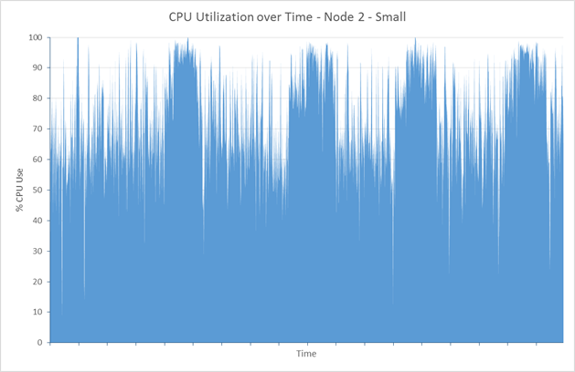
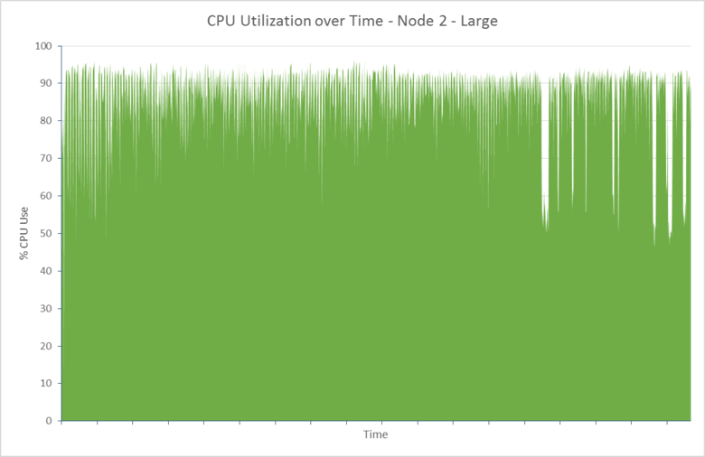
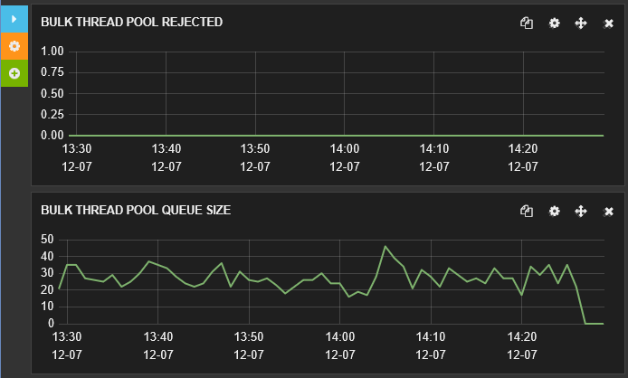
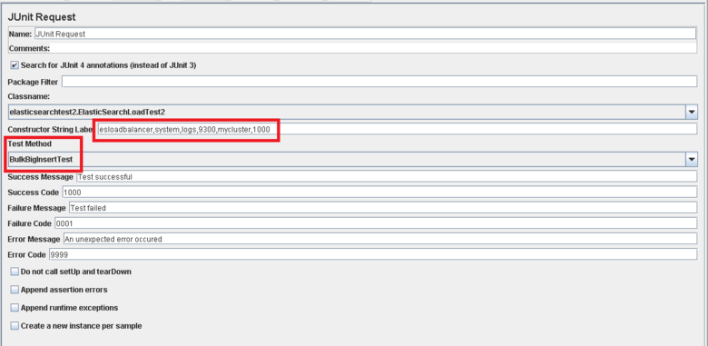

<properties
   pageTitle="Ajuste de desempenho de inclusão de dados para Elasticsearch no Azure | Microsoft Azure"
   description="Como maximizar o desempenho de inclusão de dados com Elasticsearch no Azure."
   services=""
   documentationCenter="na"
   authors="dragon119"
   manager="bennage"
   editor=""
   tags=""/>

<tags
   ms.service="guidance"
   ms.devlang="na"
   ms.topic="article"
   ms.tgt_pltfrm="na"
   ms.workload="na"
   ms.date="09/22/2016"
   ms.author="masashin"/>

# <a name="tuning-data-ingestion-performance-for-elasticsearch-on-azure"></a>Ajuste de desempenho de inclusão de dados para Elasticsearch no Azure

[AZURE.INCLUDE [pnp-header](../../includes/guidance-pnp-header-include.md)]

Este artigo é [parte de uma série](guidance-elasticsearch.md). 

## <a name="overview"></a>Visão geral

Um aspecto importante ao criar qualquer banco de dados de pesquisa é determinar a melhor maneira de estruturar o sistema para inclusão dados pesquisáveis de forma rápida e eficiente. As considerações ao redor esse requisito interessam não apenas a opção de infraestrutura no qual você implementa o sistema, mas também as várias otimizações que você pode usar para ajudar a garantir que o sistema pode acompanhar os níveis esperados de influxo de dados. 

Este documento descreve as opções de implantação e configuração que você deve considerar para implementar um cluster de Elasticsearch que espera uma alta taxa de inclusão de dados. Para fornecer dados sólidos ilustração, este documento também mostra os resultados da comparação de várias configurações usando uma carga de trabalho de inclusão de dados de grande volume simples. Os detalhes da carga de trabalho são descritos no [Apêndice](#appendix-the-bulk-load-data-ingestion-performance-test) no final deste documento.

A finalidade das avaliações foi não para gerar valores de desempenho absoluto para execução de Elasticsearch ou até mesmo recomendar uma topologia específica, mas ilustram métodos que você pode usar para avaliar o desempenho, nós de dados de dimensionamento e implementar clusters que podem atender às suas próprias necessidades de desempenho. 

Quando seus próprios sistemas de dimensionamento, é importante testar desempenho completamente com base em seus próprio cargas de trabalho. Reunir telemetria que permite que você obter informações sobre a configuração de hardware ideal para uso e os fatores de dimensionamento horizontais que você deve considerar. Em particular, você deve:

- Considere o tamanho total da carga enviado e não apenas o número de itens em cada solicitação de inserir em massa. Um número menor de itens de massa grande em cada solicitação poderia ser melhor que um número maior, dependendo do recurso disponível para processar cada solicitação.

Você pode monitorar os efeitos de variação na solicitação de inserir em massa usando [Marvel](https://www.elastic.co/products/marvel), usando o *readbytes*/i /*writebytes* disputa com [JMeter](https://jmeter.apache.org/), e ferramentas de sistema operacional como *iostat* e *vmstat* no Ubuntu. 

- Conduzir testes de desempenho e coletar telemetria para processamento de medida CPU e tempos de espera e/s, latência de disco, produtividade e tempos de resposta. Esta informação pode ajudar a identificar gargalos potenciais e avaliar os custos e benefícios do uso de armazenamento premium. Tenha em mente que utilização de CPU e disco pode não ser mesmo em todos os nós dependendo da maneira em que fragmentos e réplicas são distribuídos em cluster (alguns nós podem conter mais fragmentos que outros).

- Considere como o número de solicitações simultâneas para sua carga de trabalho será distribuído pelos cluster e avaliar o impacto da utilização de um número diferente de nós para lidar com essa carga de trabalho.

- Considere como cargas de trabalho podem crescer conforme os negócios expande. Avalie o impacto desse crescimento nos custos das VMs e armazenamento usado por nós.

- Reconhece que usando um cluster com um número maior de nós com discos regulares pode ser mais econômico se seu cenário exigir um grande número de solicitações e a infraestrutura de disco mantém a produtividade que satisfaz seus contratos de nível de serviço (SLAS). No entanto, aumentando o número de nós pode introduzir sobrecarga na forma de comunicações de nó entre adicionais e sincronização.

- Entenda o que um número maior de cores por nó pode gerar mais tráfego de disco conforme mais documentos podem ser processados. Nesse caso, medir a utilização de disco para avaliar se o subsistema de e/s pode se tornar um gargalo e determinar os benefícios de usar o armazenamento de premium.

- Testar e analisar as compensações com um número maior de nós com menos cores versus menos nós com mais cores. Tenha em mente que o aumento do número de réplicas escala as exigências no cluster e pode exigir a adicionar nós.

- Considere a possibilidade de que usando discos efêmeros pode exigir que os índices precisam ser recuperadas com mais frequência.

- Meça o uso de volume de armazenamento para avaliar capacidade e, em utilização de armazenamento. Por exemplo, em nosso cenário podemos armazenados documentos de 1,5 bilhões usando 350GB de armazenamento.

- Meça as taxas de transferência para suas cargas de trabalho e considerar como fechar você é provável que acessar o limite de transferência de taxa i/o total de qualquer conta de armazenamento específica em que você criou discos virtuais.

## <a name="node-and-index-design"></a>Design de nó e índice

Em um sistema que deve oferecer suporte a inclusão de dados em grande escala, você faça as seguintes perguntas:

- **É os dados avanço ou relativamente estáticos?** Quanto mais dinâmico os dados, maior a manutenção sobrecarga para Elasticsearch. Se os dados são replicados, cada réplica é mantida sincronia. Avanço com apenas um tempo de vida limitado ou dados que podem ser facilmente reconstruídos podem beneficiar Desabilitando replicação completamente. Essa opção é discutida na seção [ajuste a inclusão de dados em grande escala.](#tuning-large-scale-data-ingestion)

- **Atualizado como você precisa os dados descobertos pesquisando seja?** Para manter o desempenho, Elasticsearch buffers tantos dados na memória possível. Isso significa que nem todas as alterações são imediatamente disponíveis para solicitações de pesquisa. O processo que elasticsearch usa para manter as alterações e torná-las visíveis é descrito na [Fazendo alterações persistente](https://www.elastic.co/guide/en/elasticsearch/guide/current/translog.html#translog). 

    A taxa de dados fica visível são regulamentadas pelo *atualizar\_intervalo* configuração do índice relevante. Por padrão, esse intervalo é definido em 1 segundo. Entretanto, não cada situação requer atualizações ocorrem isso rapidamente. Por exemplo, dados do log de gravação de índices talvez seja necessário lidar com um influxo rápido e contínuo de informações que precisam ser incluídos rapidamente, mas não exija que as informações sejam disponibilizadas imediatamente para consultar. Nesse caso, considere a possibilidade de reduzindo a frequência das atualizações. Este recurso também é descrito na seção [ajuste a inclusão de dados em grande escala.](#tuning-large-scale-data-ingestion)

- **É como rapidamente os dados provavelmente aumentará?** Capacidade de índice é determinada pelo número de fragmentos especificado quando o índice for criado. Para permitir crescimento, especifique um número adequado de fragmentos (o padrão é cinco). Se o índice for criado inicialmente em um único nó, todos os cinco fragmentos estarão localizados naquele nó, mas conforme o volume de dados aumenta adicional nós podem ser adicionados e Elasticsearch dinamicamente distribua fragmentos em nós. No entanto, cada fragmentar tem uma sobrecarga. Todas as pesquisas em um índice irá consultar todos os fragmentos, para que a criação de um grande número de fragmentos para uma pequena quantidade de dados pode reduzir recuperações de dados (Evite o cenário de [fragmentos de Kagillion](https://www.elastic.co/guide/en/elasticsearch/guide/current/kagillion-shards.html) ).

    Algumas cargas de trabalho (como log) podem criar um novo índice cada dia e se você observar que o número de fragmentos seja insuficiente para o volume de dados, você deve alterá-lo antes de criar o próximo índice (índices existentes será afetados). Se você deve distribuir dados existentes em fragmentos mais, uma opção é reindexar as informações. Criar um novo índice com a configuração apropriada e copie os dados para ela. Esse processo pode ser transparentes para aplicativos usando [aliases de índice](https://www.elastic.co/guide/en/elasticsearch/reference/current/indices-aliases.html).

- **Dados precisam ser particionado entre usuários em um cenário de multitenancy?** Você pode criar índices separados para cada usuário, mas isso pode ser caro se cada usuário tiver apenas uma quantidade moderada de dados. Em vez disso, considere a criação de [índices compartilhados](https://www.elastic.co/guide/en/elasticsearch/guide/current/shared-index.html) e usar [aliases com base em filtros](https://www.elastic.co/guide/en/elasticsearch/guide/current/faking-it.html) para direcionar solicitações aos dados por usuário. Para manter os dados de um usuário juntos na mesma fragmentar, substitua a configuração de roteamento padrão para os dados de índice e rota com base em algum atributo identificação do usuário.

- **São dados longos ou curta duração?** Se você estiver usando um conjunto de VMs do Azure para implementar um cluster de Elasticsearch, você pode armazenar dados efêmeros em um disco de sistema do recurso local em vez de uma unidade conectada.
Usando uma SKU VM que utiliza uma SSD do disco do recurso pode melhorar o desempenho e/s. No entanto, as informações mantidas no disco recurso são temporárias e podem ser perdidas se a máquina virtual reiniciar (consulte a seção quando os dados em um temporário unidade ser perdidas em [Noções básicas sobre a unidade temporária em máquinas virtuais do Microsoft Azure](http://blogs.msdn.com/b/mast/archive/2013/12/07/understanding-the-temporary-drive-on-windows-azure-virtual-machines.aspx) para obter mais detalhes). Se você precisar manter dados entre reiniciar, crie discos de dados para armazenar essas informações e anexe-os para a máquina virtual.

- **Como o active estão os dados?** VHDs Azure estão sujeitos a limitação se a quantidade de atividade de leitura/gravação exceder parâmetros especificados (atualmente 500 operações de entrada/saída por segundo (IOPS) para um disco conectado a uma VM nível padrão e 5000 IOPS de um disco de armazenamento de Premium). 

    Para reduzir as chances de otimização e aumentar o desempenho e/s, considere a criação de vários discos de dados para cada máquina virtual e configurar Elasticsearch para dividir os dados entre esses discos conforme descrito nos [requisitos de sistema de arquivos e disco](guidance-elasticsearch-running-on-azure.md#disk-and-file-system-requirements).

    Você deve selecionar uma configuração de hardware que ajuda a minimizar o número de i / operações de leitura garantindo que memória suficiente está disponível em cache acessado frequentemente os dados do disco. Isso é descrito na seção [requisitos de memória](guidance-elasticsearch-running-on-azure.md#memory-requirements) do Elasticsearch em execução no Azure.

- **Que tipo de carga de trabalho cada nó precisarão oferece suporte?** Elasticsearch benefícios de ter memória disponível para os dados de cache do (na forma de cache do sistema de arquivo) e para pilha JVM conforme descrito na seção [requisitos de memória](guidance-elasticsearch-running-on-azure.md#memory-requirements) do Elasticsearch em execução no Azure. 

    A quantidade de memória, número de cores de CPU e a quantidade de discos disponíveis são definidas pelo SKU da máquina virtual. Para obter mais informações, consulte [Preços de máquinas virtuais](http://azure.microsoft.com/pricing/details/virtual-machines/) no site do Azure.

### <a name="virtual-machine-options"></a>Opções de máquina virtual

Você pode provisionar VMs no Azure usando um número de diferentes SKUs. Os recursos disponíveis para uma máquina virtual do Azure dependem SKU selecionado. Cada SKU oferece uma combinação diferente de cores, memória e armazenamento. Você precisa selecionar um tamanho adequado da máquina virtual que irá lidar com a carga de trabalho esperada, mas que também provar econômico.
Comece com uma configuração que atenda às suas necessidades atuais (executar avaliações de desempenho para testar, conforme descrito mais adiante neste documento). Você pode dimensionar um cluster mais tarde, adicionando mais VMs executando Elasticsearch nós.

[Tamanhos para máquinas virtuais](../virtual-machines/virtual-machines-linux-sizes.md) no site do Azure documentos as diversas opções e SKUs disponíveis para VMs.

Você deve corresponder o tamanho e os recursos de uma máquina virtual para a função que nós em execução na máquina virtual executará.

De um nó de dados:

- Alocar até 30 GB ou 50% da memória RAM disponível para o Java pilha, o que for menor. Deixe o resto para o sistema operacional a ser usado para o cache de arquivos. Se você estiver usando o Linux, você pode especificar a quantidade de memória para alocar à pilha Java definindo o ES\_pilha\_variável de ambiente de tamanho antes de executar Elasticsearch. Como alternativa, se você estiver usando o Windows ou Linux, pode determinar o tamanho de memória com os parâmetros *Xmx* e *Xms* quando você começa a Elasticsearch.

    Dependendo da carga de trabalho, menos VMs grandes podem não ser tão eficientes para desempenho ao usar um número maior de VMs moderadamente tamanhos. Você deve conduzir testes que podem medir as compensações entre o tráfego de rede adicional e a manutenção envolvidos versus os custos de aumentar o número de cores disponíveis e a disputa de disco reduzida em cada nó.

- Use o armazenamento de premium para armazenar dados de Elasticsearch. Isso é discutido mais detalhadamente na seção [Opções de armazenamento](#storage-options) .

- Use vários discos do mesmos tamanho e distribuição dos dados entre esses discos. O SKU das suas VMs determinarão o número máximo de discos de dados que você pode anexar. Para obter mais informações, consulte [requisitos de sistema de arquivos e disco](guidance-elasticsearch-running-on-azure.md#disk-and-file-system-requirements).

- Use uma SKU de CPU multi-core com pelo menos 2 cores, preferência 4 ou mais. 

De um nó de cliente:

- Não alocar armazenamento em disco para dados de Elasticsearch, clientes dedicados não armazenem dados em disco.

- Certifique-se de que a memória adequada está disponível para lidar com cargas de trabalho. Solicitações de inserção em massa são lidos na memória antes dos dados sejam enviados para os diversos nós de dados e os resultados de consultas e agregações são acumulados na memória antes de ser retornado para o aplicativo cliente. Seu próprio cargas de trabalho e monitorar o uso de memória usando uma ferramenta como Marvel ou as [informações de JVM](https://www.elastic.co/guide/en/elasticsearch/guide/current/_monitoring_individual_nodes.html#_jvm_section) retornadas usando o *nó/estatísticas* API (`GET _nodes/stats`) para avaliar os requisitos ideais.  Em particular, monitorar o *pilha\_usado\_por cento* métrica para cada nó e objetivo para manter o tamanho da pilha abaixo de 75% do espaço disponível.

- Certifique-se de que as cores de CPU suficientes estão disponíveis para receber e processar o volume esperado de solicitações.
Solicitações são enfileiradas conforme elas são recebidas antes de processamento e o volume de itens que podem ser enfileirados é uma função do número de cores de CPU em cada nó. Você pode monitorar os comprimentos de fila usando os dados nas [informações de pool](https://www.elastic.co/guide/en/elasticsearch/guide/current/_monitoring_individual_nodes.html#_threadpool_section) retornados usando o nó/estatísticas API. 

    Se a contagem *rejeitado* para uma fila indica que estão sendo recusou solicitações, isso indica que o cluster está começando a afunilamento. Isso pode ser devido a largura de banda de CPU, mas pode também ser devido a outros fatores como falta de memória ou desempenho lento de e/s, portanto usar essas informações em conjunto com outras estatísticas para ajudar a determinar a causa raiz.

    Nós de cliente podem ou não ser necessários, dependendo das suas cargas de trabalho. Cargas de trabalho de inclusão de dados não costumam beneficiar usando clientes dedicados, enquanto algumas pesquisas e agregações podem executar mais rapidamente. Esteja preparado para seus próprios cenários de padrão de referência.

    Nós de cliente são úteis principalmente para aplicativos que usam a API do cliente de transporte para se conectar ao cluster. Você também pode usar a API de cliente nó, que cria dinamicamente um cliente dedicado para o aplicativo, usando os recursos do ambiente de host do aplicativo. Se seus aplicativos usam a API do cliente de nó, em seguida, pode não ser necessário para o seu cluster conter nós pré-configurado clientes dedicado. 
    
    No entanto, esteja ciente de que um nó criado usando a API de nó do cliente é um membro de primeira classe do cluster e participa assim o com chuviscos de rede com outros nós. Frequentemente iniciar e parar nós do cliente podem criar ruído desnecessário em todo o cluster.

Para um nó mestre:

- Não alocar armazenamento em disco para dados de Elasticsearch, nós mestres dedicados não armazenem dados em disco.

- Requisitos de CPU devem ser mínimos.

- Requisitos de memória dependem do tamanho do cluster. Informações sobre o estado do cluster são mantidas na memória. Para pequenas clusters a quantidade de memória necessária é mínima, mas para um cluster de grande e altamente ativo onde índices estão sendo criados com frequência e fragmentos percorrer, a quantidade de informações de estado pode crescer significativamente. Monitore o tamanho de pilha JVM para determinar se você precisar adicionar mais memória.

> [AZURE.NOTE]Para confiabilidade cluster, sempre criar vários nós mestres para e configurar os nós restantes para evitar a possibilidade de ocorrer um cérebro dividido. Ideal seria deve ser um número ímpar de nós mestres. Este tópico é descrito mais detalhadamente [Configurando resiliência e recuperação em Elasticsearch no Azure][].

### <a name="storage-options"></a>Opções de armazenamento

Um número de opções de armazenamento estão disponíveis no VMs do Azure com diferentes concessões afetando custo, desempenho, disponibilidade e recuperação que você precisa considerar cuidadosamente.

Observe que você deve armazenar dados de Elasticsearch em discos de dados dedicados.  Isso ajudará a reduzir disputa com o sistema operacional e garantir que grandes volumes de i/o Elasticsearch não competem com funções de sistema operacional para os recursos de e/s.

Azure discos estão sujeitos a restrições de desempenho. Se você achar que um cluster passa por periódicos picos de atividade de solicitações de i podem ser limitadas. Para ajudar a evitar isso, ajuste seu design equilíbrio entre o tamanho do documento em Elasticsearch contra o volume de solicitações provavelmente recebidos por cada disco.

Discos com base em armazenamento padrão oferecem suporte a uma taxa de solicitação máxima de 500 IOPS enquanto discos com base em armazenamento premium podem operar em IOPS até 5.000, dependendo do tamanho dos discos dados. Discos de armazenamento Premium estão disponíveis apenas para as séries de VMs DS e GS. Para localizar o disco máximo IOPS por tamanho de máquina virtual, consulte [tamanhos para máquinas virtuais no Azure](../virtual-machines/virtual-machines-linux-sizes.md). Desempenho armazenamento premium é determinado pelo tamanho da máquina virtual junto com alocação de tamanho de disco. Para obter mais informações, consulte [armazenamento Premium: armazenamento de alto desempenho para cargas de trabalho do Azure Máquina Virtual](../storage/storage-premium-storage.md).

**Discos de dados persistentes**

Disco de dados persistentes é VHDs que contam com o armazenamento do Azure. Se a máquina virtual precisa ser recriadas após uma falha principal, VHDs existentes podem ser facilmente anexados a máquina virtual novo. VHDs podem ser criados com base em armazenamento padrão (girando media) ou armazenamento premium (SSDs). Se você quiser usar SSDs, você deve criar VMs usando a série DS ou melhor. Máquinas DS custo a mesma que as VMs série D equivalentes, mas cobrado extra para usar o armazenamento de premium.

Em casos onde a taxa de transferência máxima por disco está insuficiente para dar suporte a carga de trabalho esperada, considere a qualquer um dos vários discos de dados de criação e permitir Elasticsearch para [Dividir os dados entre esses discos](guidance-elasticsearch-running-on-azure.md#disk-and-file-system-requirements)ou implementar sistema nível [RAID 0 distribuição usando discos virtuais](../virtual-machines/virtual-machines-linux-configure-raid.md).

> [AZURE.NOTE]Experiência do Microsoft demonstrou que usar RAID 0 é especialmente vantajoso para suavização os efeitos de e/s de *spiky* cargas de trabalho que geram picos de atividade.

Premium de uso localmente redundante (ou localmente redundantes para low-end ou cargas de trabalho de p & r) armazenamento para a conta de armazenamento mantém os discos; não é necessário para Elasticsearch alta disponibilidade replicação em países e regiões. 

**Discos efêmeros**

Usando discos persistentes com base em SSDs requer a criação de VMs que oferecem suporte ao armazenamento de premium. Isso tem uma implicação de preço. Usar o disco de efêmero local para manter dados de Elasticsearch pode ser uma solução econômica para nós moderadamente tamanhos exigindo até aproximadamente 800 GB de armazenamento. Na série padrão-D de VMs, discos efêmeros são implementados usando o SSDs que fornecem desempenho muito maior e muito menor latência que discos comuns

Ao usar Elasticsearch, o desempenho poderá ser equivalente a usar o armazenamento de premium sem o custo – consulte a seção [problemas de latência de disco de endereçamento](#addressing-disk-latency-issues) para obter mais informações.

O tamanho da máquina virtual limita a quantidade de espaço disponível em armazenamento efêmero conforme descrito na postagem do blog [Expectativas de desempenho de série D](https://azure.microsoft.com/blog/d-series-performance-expectations/).

Por exemplo, um padrão\_máquina virtual D1 fornece 50GB de armazenamento efêmero, um padrão\_máquina virtual D2 tem 100GB de armazenamento efêmero e um padrão\_máquina virtual D14 fornece 800GB de espaço efêmero. Para clusters onde nós solicitar somente essa quantidade de espaço, usando uma máquina virtual série D com armazenamento efêmero pode ser econômico.

Você deve saldo a maior produtividade disponível com armazenamento efêmero com o tempo e os custos envolvidos na recuperar esses dados após reiniciar uma máquina. O conteúdo do disco efêmero é perdido se a máquina virtual for movida para um servidor de host diferente, se o host é atualizado ou se o host sofrer uma falha de hardware. Se os dados em si tem um tempo de vida limitado Esta perda de dados pode ser tolerável. Para dados auto-assinados, talvez seja possível recriar um índice ou recuperar as informações ausentes de um backup. É possível minimizar a possibilidade de perda usando réplicas mantidas em outras VMs.

> [AZURE.NOTE]Não use uma **única** máquina virtual para armazenar dados críticos de produção. Se o nó falhar, todos os dados não está disponível. Para obter informações críticas, certifique-se de que os dados serão replicados em pelo menos um outro nó.

**Arquivos do Azure**

O [Serviço de arquivos do Azure](http://blogs.msdn.com/b/windowsazurestorage/archive/2014/05/12/introducing-microsoft-azure-file-service.aspx) fornece acesso de arquivo compartilhado usando o armazenamento do Azure. Você pode criar compartilhamentos de arquivos que você pode montar, em seguida, em VMs do Azure. Várias VMs podem montar o mesmo compartilhamento de arquivo, permitindo que eles acessem os mesmos dados.

Por razões de desempenho, ele não é recomendável que você use compartilhamentos de arquivos de retenção de dados de Elasticsearch que não precisam ser compartilhado entre nós, discos de dados regulares são mais adequados para essa finalidade. Compartilhamentos de arquivos podem ser usados para a criação de Elasticsearch [índices de réplica sombra](https://www.elastic.co/guide/en/elasticsearch/reference/current/indices-shadow-replicas.html). No entanto, esse recurso é atualmente experimental e não deve ser implementado em um ambiente de produção neste momento. Por esse motivo, índices de sombra não são considerados mais neste guia.

**Opções de rede**

Azure implementa um esquema de rede compartilhado. VMs utilizando o mesmo hardware racks competem por recursos de rede. Portanto, largura de banda de rede disponível pode variar de acordo com a hora do dia e diária ciclo de trabalho em execução no VMs compartilhando a mesma infraestrutura de rede física. Você tem pouco controle sobre esses fatores. É importante entender que o desempenho da rede é provavelmente flutuar ao longo do tempo, então defina expectativas dos usuários adequadamente.

## <a name="scaling-up-nodes-to-support-large-scale-data-ingestion"></a>Dimensionamento de nós para dar suporte a inclusão de dados em grande escala

Você pode criar clusters Elasticsearch usando o hardware razoavelmente moderado e depois expandir ou dimensionar conforme o volume de dados aumenta e aumenta o número de solicitações. Com o Azure, você escala-up executando no maiores e mais caras VMs ou você pode escala-out usando VMs menores e mais baratas adicionais. 

Você também pode executar uma combinação de ambas as estratégias. Não há nenhuma solução única para todos os cenários, portanto para avaliar a melhor abordagem para cada situação que você precisa estar preparado para realizar um desempenho de série testes.

Esta seção trata-se com a abordagem de escala-up, out dimensionamento é discutido na seção [dimensionamento check-out: conclusões](#scaling-out-conclusions).
Esta seção descreve os resultados de uma série de parâmetros de comparação que foram executadas em um conjunto de Elasticsearch clusters contendo VMs de tamanhos variados. Os clusters foram designados como pequeno, médio e grande. A tabela a seguir resume os recursos alocados para as VMs em cada cluster.

| Cluster | SKU DE MÁQUINA VIRTUAL      | Número de cores | Número de discos de dados | RAM  |
|---------|-------------|-----------------|----------------------|------|
| Pequeno   | D2 padrão | 2               | 4                    | 7GB  |
| Média  | D3 padrão | 4               | 8                    | 14GB |
| Grande   | D4 padrão | 8               | 16                   | 28GB |

Cada cluster Elasticsearch contido 3 nós de dados. Esses nós de dados tratadas as solicitações de cliente, além de tratamento de processamento de dados. Nós de cliente separada não foram usados porque eles oferecidos pouco benefício o cenário de inclusão de dados usado por testes. O cluster também contidos três nós mestres, um dos quais foi optado por Elasticsearch para coordenar o cluster.

Os testes foram realizados usando Elasticsearch 1.7.3. Testes inicialmente foram executados em clusters executando Ubuntu Linux 14.0.4 e, em seguida, repetidas usando o Windows Server 2012. Os detalhes da carga de trabalho realizado por testes são descritos no [Apêndice](#appendix-the-bulk-load-data-ingestion-performance-test).

### <a name="data-ingestion-performance--ubuntu-linux-1404"></a>Desempenho de inclusão de dados – Ubuntu Linux 14.0.4

A tabela a seguir resume os resultados gerais da execução dos testes por duas horas para cada configuração:

| Configuração | Contagem de amostra | Tempo de resposta médio (ms) | Taxa de transferência (operações/s) |
|---------------|--------------|----------------------------|---------------------------|
| Pequeno         | 67057        | 636                        | 9.3                       |
| Média        | 123482       | 692                        | 17.2                      |
| Grande         | 197085       | 839                        | 27,4                      |

A taxa de transferência e o número de amostras processadas por três configurações estão na razão aproximada 1:2:3. No entanto, os recursos disponíveis em termos de memória, cores de CPU e discos tem a proporção 1:2:4. Ele foi sentido seja a pena investigar os detalhes de desempenho de baixo nível de nós no cluster para avaliar por que isso pode ser o caso. Esta informação pode ajudar a determinar se há limites de dimensionamento e, quando talvez seja melhor considerar dimensionamento. 

### <a name="determining-limiting-factors-network-utilization"></a>Determinar limitando fatores: utilização de rede

Elasticsearch é dependente tendo largura de banda suficiente para oferecer suporte o influxo de solicitações de cliente, bem como as informações de sincronização que flui entre nós no cluster. Conforme realçado anteriormente, você têm controle limitado sobre a disponibilidade de largura de banda, que depende de diversas variáveis como data center em uso e a carga de outras VMs a mesma infraestrutura de rede de compartilhamento de rede atual. Entretanto, ele é ainda vale a pena examinar a atividade de rede para cada cluster verificar se o volume de tráfego não está excessivo. O gráfico abaixo mostra uma comparação o tráfego de rede recebido pelo nó 2 em cada um dos clusters (os volumes para os outros nós em cada cluster era muito semelhante).


A média de bytes recebida por segundo para o nó 2 em cada configuração de cluster durante o período de duas horas foram da seguinte maneira:

| Configuração | Número médio de bytes recebidos/s |
|---------------|--------------------------------------|
| Pequeno         | 3993640.3                            |
| Média        | 7311689.9                            |
| Grande         | 11893874.2                           |

Os testes foram realizados enquanto o sistema estava em execução no **estado estável**. Em situações onde indexar redistribuição ou nó recuperando está ocorrendo, transmissões de dados entre nós mantendo primário e fragmentos de réplica podem gerar tráfego significativo na rede. Os efeitos desse processo são descritos mais no documento [Configurando resiliência e recuperação em Elasticsearch no Azure][].

### <a name="determining-limiting-factors-cpu-utilization"></a>Determinar limitando fatores: da CPU

A taxa na qual as solicitações são tratadas pelo menos parcialmente é controlada pela capacidade de processamento disponível. Elasticsearch aceita solicitações de inserção em massa em massa inserir fila. Cada nó tem um conjunto de massa inserir filas determinadas pelo número de processadores disponíveis. Por padrão, há uma fila para cada processador e cada fila pode conter até 50 solicitações pendentes antes que eles começarão a ser rejeitadas. 

Aplicativos devem enviar solicitações a uma taxa que não causam filas para overspill. O número de itens em cada fila em qualquer momento vier a ser uma função da taxa na qual as solicitações são enviadas por aplicativos cliente e a taxa em que essas mesmas solicitações são recuperadas e processadas pelo Elasticsearch. Por esse motivo, uma estatística importante capturado preocupações a taxa de erro resumidos na tabela a seguir.

| Configuração | Total de amostras | Contagem de erros  | Taxa de erro |
|---------------|---------------|--------------|------------|
| Pequeno         | 67057         | 0            | 0,00%      |
| Média        | 123483        | 1            | 0.0008%    |
| Grande         | 200702        | 3617         | 1,8%      |

Cada um desses erros foi causada pela seguinte exceção Java:

```
org.elasticsearch.action.support.replication.TransportShardReplicationOperationAction$PrimaryPhase$1@75a30c1b]; ]
[219]: index [systembase], type [logs], id [AVEAioKb2TRSNcPa_8YG], message [RemoteTransportException[[esdatavm2][inet[/10.0.1.5:9300]][indices:data/write/bulk[s]]]; nested: EsRejectedExecutionException[rejected execution (queue capacity 50)
```

Aumentar o número de filas e/ou o comprimento de cada fila pode reduzir o número de erros, mas essa abordagem só pode lidar com picos de curta duração. Isso durante a execução de uma série contínua de tarefas de inclusão de dados será simplesmente atrasar o ponto no qual erros iniciar ocorrendo. Além disso, essa alteração não aumentará a produtividade e provavelmente será prejudicar o tempo de resposta dos aplicativos cliente como solicitações serão enfileiradas para mais antes de serem processados.

A estrutura de índice padrão de 5 fragmentos com os resultados da 1 réplica (10 fragmentos em todos), em um desequilíbrio pequena no carregamento entre os nós em um cluster, dois nós conterá três fragmentos enquanto outro nó conterá quatro. O nó mais ocupado é provavelmente ser o item que restringe a produtividade ao máximo, que é por isso que este nó foi selecionado em cada caso. 

O conjunto de gráficos a seguir ilustram a utilização de CPU para o nó mais ocupado em cada cluster.




Para o pequeno, médio e grandes clusters, a utilização de CPU média para esses nós era 75.01%, 64.93% e 64.64%. Raramente utilização realmente acertar 100% e utilização descarta como o tamanho de nós e disponível aumenta de energia a CPU disponível. Potência de CPU, portanto, é provável a ser um fator limitando o desempenho do cluster grande.

### <a name="determining-limiting-factors-memory"></a>Determinar limitando fatores: memória

Uso de memória é outro aspecto importante que pode influenciar o desempenho. Para os testes, Elasticsearch foi alocada 50% da memória disponível. Isso é alinhado com [documentadas recomendações](https://www.elastic.co/guide/en/elasticsearch/guide/current/heap-sizing.html#_give_half_your_memory_to_lucene). Enquanto estavam em execução testes, JVM foi monitorar para a atividade de coleta de lixo em excesso (uma indicação de falta de memória). Em todos os casos, o tamanho da pilha foi estável e JVM apresentado atividade de coleta de lixo baixa. Captura de tela abaixo mostra um instantâneo do Marvel, realce a tecla estatísticas JVM por um período curto enquanto o teste estava em execução no cluster grande.


***JVM memória e lixo conjunto atividade no cluster grande.***

### <a name="determining-limiting-factors-disk-io-rrates"></a>Determinar limitando fatores: rRates de e/s de disco

O recurso físico restante no lado do servidor que pode restringir o desempenho é o desempenho do disco subsistema e/s. O gráfico abaixo compara a atividade do disco em termos de bytes gravados para os nós mais ocupados em cada cluster.

 

A tabela a seguir mostra a média de bytes escrita por segundo para o nó 2 em cada configuração de cluster durante o período de duas horas:

| Configuração | Número médio de bytes gravadas/s |
|---------------|-------------------------------------|
| Pequeno         | 25502361.94                         |
| Média        | 48856124.5                          |
| Grande         | 88137675.46                         |

O volume de dados gravados aumenta com o número de solicitações estão sendo processadas por um cluster, mas as taxas de i/o estão dentro dos limites de armazenamento do Azure (discos criados usando o armazenamento do Azure podem oferecer suporte a uma constante taxas 10s para 100s de MB/s, dependendo se armazenamento Standard ou Premium é usado). Examinando a quantidade de tempo gasto aguardando i / disco ajuda a explicar por que a taxa de transferência do disco está abaixo do máximo teórico. Os gráficos e a tabela a seguir mostram essas estatísticas para os mesmos três nós:

> [AZURE.NOTE]O tempo de espera do disco é medido monitorando a porcentagem de CPU tempo durante o qual os processadores são bloqueados aguardando operações de e/s ser concluída.


| Configuração | Médio disco aguardar tempo de CPU (%) |
|---------------|--------------------------------|
| Pequeno         | 21.04                          |
| Média        | 14.48                          |
| Grande         | 15.84                          |

Estes dados indicam que uma proporção significativa de tempo de CPU (entre quase 16% e 21%) é gasto aguardando e/s de disco para concluir. Isso é restringindo a capacidade de Elasticsearch para processar solicitações e armazenar dados.

Durante a execução de teste, o cluster grande inserido mais de **cinco cem milhões de documentos**. Permitir o teste continuar mostrava tempos de espera aumentaram significativamente quando o banco de dados contido mais de seis cem milhões de documentos. Os motivos para esse comportamento não foram totalmente investigação, mas pode ser devido a disco fragmentação causando latência de disco maiores. 

Aumentar o tamanho do cluster sobre mais nós pode ajudar a minimizar os efeitos desse comportamento. Em casos extremos pode ser necessário desfragmentar um disco que está mostrando tempos de i / excessivos. Entretanto, desfragmentar um disco grande, pode levar um tempo considerável (possivelmente mais de 48 horas para uma unidade VHD 2TB) e simplesmente reformatar a unidade e permitindo que Elasticsearch recuperar os dados ausentes da fragmentos de réplica podem ser uma abordagem mais econômica.

### <a name="addressing-disk-latency-issues"></a>Resolver problemas de latência de disco

Os testes foram realizados inicialmente usando VMs configuradas com discos padrão. Um disco padrão baseia-se em girando mídia e como resultado está sujeito a latência de rotação e outros gargalos que podem restringir taxas de e/s. Azure também fornece armazenamento de premium nas quais discos criados usando dispositivos SSD. Esses dispositivos não têm rotação latência e como resultado devem fornecer aprimoradas velocidades de e/s. 

A tabela a seguir compara os resultados de substituição de discos padrão com discos premium no cluster grande (D4 VMs padrão no cluster grande foram substituídas por VMs DS4 padrão; o número de cores, memória e discos era o mesmo em ambos os casos, a única diferença de que as VMs DS4 usado SSDs).

| Configuração    | Contagem de amostra | Tempo de resposta médio (ms) | Taxa de transferência (operações/s) |
|------------------|--------------|----------------------------|---------------------------|
| Grande - padrão | 197085       | 839                        | 27,4                      |
| Grande - Premium  | 255985       | 581                        | 35,6                      |

Tempos de resposta foram visivelmente melhores, resultando em uma taxa de transferência média muito perto de 4 x que do cluster pequeno. Isso é mais alinhado com os recursos disponíveis em uma VM DS4 padrão. Utilização média da CPU no nó mais ocupado no cluster (nó 1 neste caso) aumentada conforme ele gasto menos tempo aguardando e/s concluir:


A redução no tempo de espera de disco fica evidente quando você considera o gráfico a seguir, que mostra que para o nó mais ocupado essa estatística descartados para cerca de 1% em média:


Existe um preço para pagar essa melhoria, no entanto. O número de erros de inclusão aumentado por um fator de 10 a 35797 (12.3%). Novamente, a maioria desses erros era o resultado em massa inserir fila limite ser excedido. Considerando que o hardware agora parece estar executando o próximo capacidade, talvez seja necessário adicionar mais nós ou a taxa de inserções em massa para reduzir o volume dos erros de volta aceleração. Esses problemas são discutidos mais adiante neste documento.

### <a name="testing-with-ephemeral-storage"></a>Teste com armazenamento efêmero

Os mesmos testes foram repetidos em um cluster de VMs D4 usando armazenamento efêmero. Em VMs D4, armazenamento efêmero é implementado como um único 400GB SSD. O número de exemplos processados, tempo de resposta e produtividade foram tudo muito semelhante às ilustrações relatadas para o cluster baseado em DS14 VMs com armazenamento premium.

| Configuração                     | Contagem de amostra | Tempo de resposta médio (ms) | Taxa de transferência (operações/s) |
|-----------------------------------|--------------|----------------------------|---------------------------|
| Grande - Premium                   | 255985       | 581                        | 35,6                      |
| Grandes – padrão (disco efêmero) | 255626       | 585                        | 35,5                      |

A taxa de erro também foi semelhantes (33862 falhas fora 289488 solicitações no total – 11.7%).

Os gráficos a seguintes mostram a utilização da CPU e disco aguardar estatísticas para o nó mais ocupado no cluster (nó 2 neste momento):



! [] (media/guidance-elasticsearch/data-ingestion-image13.png

Nesse caso, em termos de desempenho sozinhos, usando o armazenamento efêmero pode ser considerado uma solução mais econômica que usando o armazenamento de premium.

### <a name="data-ingestion-performance--windows-server-2012"></a>Desempenho de inclusão de dados – Windows Server 2012

Os mesmos testes foram repetidos usando um conjunto de Elasticsearch clusters conosco executando o Windows Server 2012. A finalidade desses testes era estabelecer que efeitos, se houver, a opção de sistema operacional pode ter sobre o desempenho do cluster.

Para ilustrar a escalabilidade do Elasticsearch no Windows, a tabela a seguir mostra os tempos de produtividade e resposta obtidos para o pequeno, médio e configurações de cluster grande. Observe que esses testes foram todas executados com Elasticsearch configurado para usar o armazenamento efêmero SSD, como os testes com Ubuntu tinham mostrado latência de disco é provável que foi a ser um fator crítico atingir desempenho máximo:

| Configuração | Contagem de amostra | Tempo de resposta médio (ms) | Taxa de transferência (operações/s) |
|---------------|--------------|----------------------------|---------------------------|
| Pequeno         | 90295        | 476                        | 12.5                      |
| Média        | 169243       | 508                        | 23,5                      |
| Grande         | 257115       | 613                        | 35,6                      |

Esses resultados indicam como Elasticsearch escalas com tamanho de máquina virtual e recursos disponíveis no Windows.

As tabelas a seguir compara os resultados para o cluster grande no Ubuntu e Windows:

| Sistema Operacional | Contagem de amostra | Tempo de resposta médio (ms) | Taxa de transferência (operações/s) | Taxa de erro (%) |
|------------------|--------------|----------------------------|---------------------------|----------------|
| Ubuntu           | 255626       | 585                        | 35,5                      | 11.7           |
| Windows          | 257115       | 613                        | 35,6                      | 7.2            |

A taxa de transferência estava consistente com que os clusters Ubuntu grandes, embora o tempo de resposta foi um pouco mais alto. Isso pode ser representado pela taxa de erro inferior (erros são relatados mais rapidamente que operações bem-sucedidas, portanto têm um tempo de resposta inferior).

A utilização de CPU relatada pelas ferramentas de monitoramento do Windows foi um pouco maior que Ubuntu. No entanto, você deve tratar diretas comparações de medidas como esses em sistemas operacionais com muito cuidado devido a maneira como essas estatísticas de relatório de sistemas operacionais diferentes. Além disso, informações sobre latência de disco em termos de tempo de CPU gasto aguardando e/s não estão disponíveis da mesma forma que ele seja para Ubuntu. O ponto importante é que a utilização de CPU estava alta, indicando que tempo gasto aguardando e/s era baixa:


### <a name="scaling-up-conclusions"></a>Dimensionamento: conclusões

Desempenho de Elasticsearch para um cluster bem ajustado é provavelmente será equivalente no Windows e Ubuntu e que ele escalas-up em um padrão semelhante em ambos os sistemas operacionais. Para obter melhor desempenho, **use o armazenamento de premium de retenção de dados de Elasticsearch**.

## <a name="scaling-out-clusters-to-support-large-scale-data-ingestion"></a>Dimensionamento clusters para dar suporte a inclusão de dados em grande escala

Dimensionamento é a abordagem complementar dimensionamento para cima investigação na seção anterior. Um recurso importante do Elasticsearch é a inerente escalabilidade horizontal integrada do software. Aumentar o tamanho de um cluster é simplesmente uma questão de adicionar mais nós. Você não precisa realizar operações manuais para redistribuir índices ou fragmentos como essas tarefas são tratados automaticamente, embora existam em um número de opções de configuração disponíveis que você pode usar para influenciar esse processo. 

Adicionando nós mais ajuda a melhorar o desempenho distribuindo a carga em maquinário mais. Conforme você adicionar mais nós, você também precisa considerar a reindexação de dados para aumentar o número de fragmentos disponíveis. Você pode tomar o lugar esse processo até certo ponto, Criando índices que têm mais fragmentos que nós disponíveis inicialmente. Quando mais nós são adicionados, os fragmentos podem ser distribuídos.

Além de aproveitar a escalabilidade horizontal do Elasticsearch, há outras razões para implementar índices que têm mais fragmentos de nós. Cada fragmentar é implementado como uma estrutura de dados separado (um índice [Lucene](https://lucene.apache.org/) ) e tem seus próprio mecanismos internos para manter a consistência e manipulação de concorrência. Criando vários fragmentos ajuda a aumentar paralelismo dentro de um nó e pode melhorar o desempenho. 

No entanto, mantendo o desempenho enquanto o dimensionamento é um ato de equilíbrio. Mais nós e fragmentos que contém um cluster, maior o esforço é necessário para sincronizar o trabalho realizado pelo cluster, que pode diminuir a produtividade. Para qualquer determinada carga de trabalho, há uma configuração ideal que maximiza o desempenho de inclusão minimizando a sobrecarga de manutenção. Esta configuração é muito dependente da natureza da carga de trabalho e o cluster; Especificamente, volume, tamanho e conteúdo de documentos, a taxa em que ocorre a inclusão e o hardware no qual o sistema é executado.  

Esta seção resume os resultados das investigações em dimensionamento clusters destinados ao suporte a carga de trabalho usada pelos testes de desempenho descritos anteriormente. O mesmo teste foi executado em clusters com VMs com base na execução de (D4 padrão com 8 cores de CPU, discos de 16 dados e 28GB de RAM) de tamanho de máquina virtual grande Ubuntu Linux 14.0.4, mas configurado com números diferentes de nós e fragmentos. Os resultados não pretende ser definitivo como elas se aplicam somente a um cenário específico, mas eles podem atuar como um bom ponto de partida para ajudá-lo para analisar a escalabilidade horizontal do seu clusters e gerar números para a melhor proporção de fragmentos para nós que melhor atender às suas próprias necessidades.

### <a name="baseline-results--3-nodes"></a>Resultados da linha de base – 3 nós

Para obter uma figura de linha de base, o teste de desempenho de inclusão de dados foi executado em relação a um cluster de 3 nó com 5 fragmentos e 1 réplica. Esta é a configuração padrão para um índice de Elasticsearch. Nessa configuração, Elasticsearch distribui 2 fragmentos primários para 2 de nós e o restante fragmentar primária está armazenada no terceiro nó. A tabela a seguir resume a produtividade em termos de operações de inclusão de massa por segundo e o número de documentos que foram armazenadas com êxito pelo teste.

> [AZURE.NOTE] Nas tabelas a seguir nesta seção, a distribuição dos fragmentos primárias é apresentada como um número para cada nó separado por traços. Por exemplo, o layout de 3 nós fragmentar 5 é descrito como 2-2-1. O layout de fragmentos de réplica não está incluído. Eles seguirão um esquema similar para os fragmentos principais.

| Configuração | Contagem de documentos | Taxa de transferência (operações/s)   | Layout de fragmentar |
|---------------|----------------|-----------------------------|--------------|
| 5 fragmentos      | 200560412      | 27.86                       | 2-2-1        |

### <a name="6-node-results"></a>resultados de 6-node

O teste foi repetido em um cluster de 6 nó. A finalidade desses testes era experimentar e determinar mais precisamente os efeitos do armazenamento fragmentar mais de um em um nó.

| Configuração | Contagem de documentos | Taxa de transferência (operações/s)   | Layout de fragmentar |
|---------------|----------------|-----------------------------|--------------|
| 4 fragmentos      | 227360412      | 31.58                       | 1-1-0-1-1-0  |
| 7 fragmentos      | 268013252      | 37.22                       | 2-1-1-1-1-1  |
| 10 fragmentos     | 258065854      | 35.84                       | 1-2-2-2-1-2  |
| 11 fragmentos     | 279788157      | 38.86                       | 2-2-2-1-2-2  |
| 12 fragmentos     | 257628504      | 35.78                       | 2-2-2-2-2-2  |
| 13 fragmentos     | 300126822      | 41.68                       | 2-2-2-2-2-3  |

Esses resultados aparecem indicar as seguintes tendências:

* Mais fragmentos por nó melhora a produtividade. Com o pequeno número de fragmentos por nó criado para esses testes, esse fenômeno era esperado, por razões descritas anteriormente.

* Um número ímpar de fragmentos oferece melhor desempenho que um número par. Os motivos para isso são menos limpar, mas *pode* ser que o algoritmo de roteamento que usa Elasticsearch melhor é capaz de distribuir os dados em fragmentos nesse caso, levam a uma carga mais uniforme por nó.

Para testar essas hipóteses, vários testes mais foram realizados com números maiores de fragmentos. Em conselhos de Elasticsearch, decidiu usar um número primo de fragmentos para cada teste que fornecem uma distribuição razoável de numeração ímpar para o intervalo em questão.

| Configuração | Contagem de documentos | Taxa de transferência (operações/s)   | Layout de fragmentar      |
|---------------|----------------|-----------------------------|-------------------|
| 23 fragmentos     | 312844185      | 43.45                       | 4-4-4-3-4-4       |
| 31 fragmentos     | 309930777      | 43.05                       | 5-5-5-5-6-5       |
| 43 fragmentos     | 316357076      | 43.94                       | 8-7-7-7-7-7       |
| 61 fragmentos     | 305072556      | 42.37                       | 10-11-10-10-10-10 |
| 91 fragmentos     | 291073519      | 40.43                       | 15-15-16-15-15-15 |
| 119 fragmentos    | 273596325      | 38.00                       | 20-20-20-20-20-19 |

Esses resultados sugeridos que o ápice foi encontrado em torno 23 fragmentos. Depois disso, aumentando o número de fragmentos causado uma pequena degradação no desempenho (a taxa de transferência para 43 fragmentos possivelmente é uma anomalia).

### <a name="9-node-results"></a>resultados de 9-node

Os testes foram repetidos usando um cluster de 9 nós, novamente usando um número primo de fragmentos.

| Configuração | Contagem de documentos | Taxa de transferência (operações/s)   | Layout de fragmentar               |
|---------------|----------------|-----------------------------|----------------------------|
| 17 fragmentos     | 325165364      | 45.16                       | 2-2-2-2-2-2-2-2-1          |
| 19 fragmentos     | 331272619      | 46.01                       | 2-2-2-2-2-2-2-2-3          |
| 29 fragmentos     | 349682551      | 48.57                       | 3-3-3-4-3-3-3-4-3          |
| 37 fragmentos     | 352764546      | 49,00                       | 4-4-4-4-4-4-4-4-5          |
| 47 fragmentos     | 343684074      | 47.73                       | 5-5-5-6-5-5-5-6-5          |
| 89 fragmentos     | 336248667      | 46.70                       | 10-10-10-10-10-10-10-10-9  |
| 181 fragmentos    | 297919131      | 41.38                       | 20-20-20-20-20-20-20-20-21 |

Esses resultados mostraram um padrão semelhante, com o ápice em torno 37 fragmentos.

### <a name="scaling-out-conclusions"></a>Adição de servidores: conclusões

Usando uma extrapolação crua, os resultados dos testes 6 nós e 9-node indicam que, para esse cenário específico, o número ideal de fragmentos para maximizar o desempenho estava 4n + 1, onde n é o número de nós. Esta *pode* ser uma função do número de segmentos de inserir em massa disponíveis, que por sua vez depende o número de cores de CPU, a lógica sendo da seguinte maneira (consulte [Padrões de vários documentos](https://www.elastic.co/guide/en/elasticsearch/guide/current/distrib-multi-doc.html#distrib-multi-doc) para obter detalhes):

- Cada solicitação de inserir em massa enviada pelo aplicativo cliente é recebida por um nó de dados único.

- O nó de dados cria uma nova solicitação de inserir em massa para cada fragmentar primária afetado pela solicitação original e encaminha para os outros nós, em paralelo.

- Como cada fragmentar primária é escrito, outra solicitação é enviada para cada réplica para esse fragmentar. A principal fragmentar aguarda a solicitação enviada para a réplica para ser concluída antes de concluir.

Por padrão, o Elasticsearch cria um segmento de inserir em massa para cada núcleo da CPU disponível em uma máquina virtual. No caso de VMs D4 usado por esse teste, cada CPU contidas 8 cores, para inserir o massa 8 threads foram criados. O índice usado estendido 4 (em um caso 5) primários fragmentos em cada nó, mas também havia 4 (5) réplicas em cada nó. Inserindo dados nesses fragmentos e réplicas pode consumir até 8 threads em cada nó por solicitação, o número disponível de correspondência. Aumentar ou reduzir o número de fragmentos pode causar segmentação deficiências como threads são possivelmente esquerdas desocupados ou solicitações são enfileiradas. Entretanto, sem experimento posterior é apenas uma teoria e não é possível ser definitivo.

Os testes também ilustrado outro ponto importante. Neste cenário, aumentando o número de nós pode melhorar o desempenho de inclusão de dados, mas os resultados não necessariamente dimensionar linear. Conduzir testes mais com 12 e 15 clusters de nó pode mostrar o ponto no qual escala traz pouco benefício adicional. Se este número de nós fornece espaço de armazenamento insuficiente, talvez seja necessário voltar para a escala de estratégia e começar a usar mais ou maiores discos com base em armazenamento premium.

> [AZURE.IMPORTANT] Não terão a 4n proporção + 1 como uma fórmula mágica que sempre funcionam para cada cluster. Se você tiver menos ou mais cores de CPU disponíveis, a configuração de fragmentar ideais pode ser diferente. Os resultados foram com base em uma carga de trabalho específica que fez apenas a inclusão de dados. Para cargas de trabalho que também incluem uma mistura de consultas e agregações os resultados podem ser muito diferentes.

> Além disso, a carga de trabalho de inclusão de dados utilizado um único índice. Em muitas situações, os dados são prováveis possam ser distribuídas entre vários índices levam a diferentes padrões ou uso de recursos.

> O ponto importante deste exercício é entender o método usado em vez de obter os resultados. Você deve estar preparado para realizar sua própria avaliação escalabilidade com base em seus próprio cargas de trabalho para obter informações que são mais aplicáveis a seu cenário.

## <a name="tuning-large-scale-data-ingestion"></a>Ajuste a inclusão de dados em grande escala

Elasticsearch é altamente configurável, com muitas opções e configurações que você pode usar para otimizar o desempenho para cenários e casos de uso específicos. Esta seção descreve alguns exemplos comuns. Lembre-se de que a flexibilidade que Elasticsearch fornece neste aspecto vem com um aviso, é muito fácil para detune Elasticsearch e desempenho pior. Quando ajuste, somente Verifique um altere uma vez e sempre medir os efeitos das alterações para garantir que eles não estejam prejudiciais ao seu sistema.

### <a name="optimizing-resources-for-indexing-operations"></a>Otimizando recursos para operações de indexação

A lista a seguir descreve alguns pontos que você deve considerar ao ajuste um cluster de Elasticsearch para oferecer suporte a inclusão de dados em grande escala. Os dois primeiros itens são provavelmente têm um efeito imediatamente óbvio no desempenho enquanto o resto é mais baixa, dependendo da carga de trabalho:

*  Novos documentos adicionados a um índice só ficam visíveis às pesquisas quando o índice for atualizado. Atualizar um índice é uma operação cara, portanto, ele só é executado periodicamente em vez de como cada documento é criado. O intervalo de atualização padrão é 1 segundo. Se você estiver executando operações em massa, você deve considerar desativar temporariamente atualizações de índice. Definir o índice *atualizar\_intervalo* como -1.

    ```http
    PUT /my_busy_index
    {
        "settings" : {
            "refresh_interval": -1
        }
    }
    ```

    Disparar uma atualização manualmente usando o [* \_atualização*](https://www.elastic.co/guide/en/elasticsearch/reference/current/indices-refresh.html) API no final da operação para tornar os dados visíveis. Para obter mais informações, consulte [Uso de indexação de massa](https://www.elastic.co/guide/en/elasticsearch/reference/current/indices-update-settings.html#bulk) . Mais detalhes sobre o [impacto de como alterar o intervalo de atualização em inclusão de dados](#the-impact-of-changing-the-index-refresh-interval-on-data-ingestion-performance) são descritos mais tarde.

* Se um índice for replicado, cada operação de indexação (documento criar, atualizar ou excluir) será repetido nos fragmentos de réplica conforme eles ocorrem na fragmentar principal. Considere desabilitar a replicação durante operações de importação em massa e, em seguida, reativá-lo quando a importação for concluída:

    ```http
    PUT /my_busy_index
    {
        "settings" : {
            "number_of_replicas": 0
        }
    }
    ```

    Quando você reativar replicação, Elasticsearch executa uma transferência de rede bytes por byte de dados do índice para cada réplica. Isso é mais eficiente que o processo de indexação documentos em cada nó de repetição. O risco é que dados podem ser perdidos do nó primário falhar ao executar a importação em massa, mas a recuperação pode ser simplesmente uma questão de iniciar a importação novamente. O [impacto da replicação no desempenho de inclusão de dados](#the-impact-of-replicas-on-data-ingestion-performance) é descrito em mais detalhes posteriormente.

* Elasticsearch tenta saldo os recursos disponíveis entre aqueles necessários para consultar e aqueles necessários para a inclusão de dados. Como resultado, ele pode aumento de desempenho de inclusão de dados (limitação eventos são registrados no log de Elasticsearch). Essa restrição destina-se para impedir que um grande número de segmentos de índice de sendo criados simultaneamente que exigem mesclagem e salvando disco, um processo que pode monopolizar os recursos. Se seu sistema não está executando no momento consultas, você pode desativar a aceleração de inclusão de dados. Isso deve permitir a indexação maximizar o desempenho. Você pode desabilitar a limitação para um cluster inteiro da seguinte maneira:

    ```http
    PUT /_cluster/settings
    {
        "transient" : {
            "indices.store.throttle.type": "none"
        }
    }
    ```

    Defina o tipo de aceleração do cluster voltar para *"direta"* quando tiver concluído a inclusão. Também Observe que desativando a otimização pode levar a instabilidade no cluster, portanto garantir que você tenha procedimentos no local que pode recuperar o cluster se necessário.

* Elasticsearch reserva uma proporção de memória da pilha para operações de indexação, o resto é usado principalmente por consultas e pesquisas. A finalidade desses buffers é reduzir o número de operações de e/s de disco, com o objetivo de realizando gravações de menor e maiores que o menores, mais gravações. A proporção padrão de memória alocada é 10%. Se você estiver indexando um grande volume de dados este valor poderá ser insuficiente. Para sistemas que oferecem suporte à inclusão de altos volumes de dados, você deve permitir até 512MB de memória para cada ativo fragmentar no nó. Por exemplo, se você estiver executando o Elasticsearch em VMs D4 (28GB de RAM) e tiverem alocados 50% da memória disponível para a JVM (14GB), em seguida, 1,4 GB estará disponível para uso por operações de indexação. Se um nó contém 3 fragmentos ativos, em seguida, essa configuração provavelmente será suficiente. No entanto, se um nó contém mais fragmentos que isso, considere aumentar o valor da *indices.memory.index\_buffer\_tamanho* parâmetro no arquivo de configuração elasticsearch.yml. Para obter mais informações, consulte [Considerações sobre desempenho para Elasticsearch indexação](https://www.elastic.co/blog/performance-considerations-elasticsearch-indexing).

    Alocar mais do que 512MB por fragmentar ativa provavelmente não irão melhorar o desempenho da indexação e pode realmente ser prejudicial como menos memória está disponível para realizar outras tarefas. Também esteja ciente de que alocar mais espaço de pilha para buffers de índice remove memória para outras operações como pesquisar e agregar dados e pode reduzir o desempenho das operações de consulta.

* Elasticsearch restringe o número de threads (o valor padrão é 8) que simultaneamente pode executar operações de indexação em um fragmentar. Se um nó contém apenas um pequeno número de fragmentos, em seguida, considere aumentar o *índice\_concorrência* configuração para um índice que está sujeito a um grande volume de indexação operações, ou o destino de um insert em massa, da seguinte maneira:

    ```http
    PUT /my_busy_index
    {
        "settings" : {
            "index_concurrency": 20
        }
    }
    ```

* Se você estiver executando um grande número de operações de indexação e em massa por um curto período de tempo, você pode aumentar o número de segmentos de *índice* e *em massa* disponíveis no pool de segmento e estender o tamanho da fila de *inserção em massa* para cada nó de dados. Isso permitirá mais solicitações em fila em vez de ser descartado. Para obter mais informações, consulte [Pool de segmento](https://www.elastic.co/guide/en/elasticsearch/reference/current/modules-threadpool.html). Se você estiver executando estáveis altos níveis de inclusão de dados, não é recomendável aumentar o número de segmentos em massa. Em vez disso, criar nós adicionais e use fragmentação para distribuir a carga de indexação entre esses nós. Como alternativa, considere o envio em massa inserir lotes em série em vez de em paralelo como isso irá atuar como um mecanismo de otimização natural que pode reduzir as chances dos erros devido a uma massa inserir fila limite ser excedido.

### <a name="the-impact-of-changing-the-index-refresh-interval-on-data-ingestion-performance"></a>O impacto da alteração do índice atualizar intervalo no desempenho de inclusão de dados

O intervalo de atualização controla a taxa na qual dados ingeridos fica visíveis a consultas e agregações, mas frequentes atualizações podem afetar o desempenho inclusão das operações de dados. O intervalo de atualização padrão é 1 segundo. Você pode desabilitar a atualização completamente, mas isso pode não ser apropriado para sua carga de trabalho. Você pode experimentar experimentar diferentes intervalos e estabelecendo o ponto ideal que equilibra o desempenho de inclusão em relação a necessidade para apresentar informações atualizadas.

Como um exemplo do impacto, o teste de desempenho de inclusão de dados foi repetido em um cluster de Elasticsearch consiste 7 fragmentos distribuir por nós de 3 dados. O índice tinha uma única réplica. Cada nó de dados foi baseado em uma VM D4 (28GB de RAM, 8 cores processador) usando reserva SSD efêmero armazenamento para manter os dados. Cada teste executado para 1 hora.

Nesse teste, a taxa de atualização foi definida como o valor padrão de 1 segundo. A tabela a seguir mostra os tempos de produtividade e resposta para este teste em comparação com uma execução separada onde a taxa de atualização foi reduzida para uma vez a cada 30 segundos.

| Taxa de atualização | Contagem de amostra | Tempo de resposta médio – operações bem-sucedidas (ms) | Produtividade – operações bem-sucedidas (operações/s) |
|--------------|--------------|----------------------------------------------------|---------------------------------------------------|
| 1 segundo     | 93755        | 460                                                | 26.0                                              |
| 30 segundos   | 117758       | 365                                                | economia de 32,7                                              |

Nesse teste, soltando a taxa de atualização resultou em um aprimoramento de 18% de produtividade e redução 21% no tempo de resposta médio. Os gráficos seguintes gerados usando Marvel ilustram o principal motivo para essa diferença. As figuras abaixo mostram a atividade de mesclagem de índice ocorridas com o intervalo de atualização definido como 1 segundo e 30 segundos. 

Mesclagens de índice são executadas para impedir que o número de segmentos de índice de memória se tornar muito inúmeros. Um 1 segundo intervalo de atualização gera um grande número de pequenos segmentos que precisam ser mesclados com frequência, enquanto o intervalo de atualização de um segundo 30 gera menos grandes segmentos que podem ser mesclados mais otimizada.


***Atividade de mesclagem de índice para uma taxa de atualização de índice de 1 segundo***


***Atividade de mesclagem de índice para uma taxa de atualização do índice de 30 segundos***

### <a name="the-impact-of-replicas-on-data-ingestion-performance"></a>O impacto das réplicas no desempenho de inclusão de dados

Réplicas são um recurso essencial de qualquer cluster flexível e sem usá-los risco perder informações se um nó falhar. No entanto, réplicas aumentam a quantidade de disco e de rede e/s está sendo executada e podem ser prejudiciais para a taxa em que os dados é incluídos. Por razões descritas anteriormente, pode ser útil desativar temporariamente réplicas para a duração das operações de carregamento de dados em grande escala.

Testes de desempenho de inclusão de dados foram repetidos usando três configurações:

* Usando um cluster com nenhum réplicas.

* Usando um cluster com 1 réplica.

* Usando um cluster com 2 réplicas.

Em todos os casos, o cluster contido 7 fragmentos distribuir por 3 nós e executados em VMs configuradas conforme descrito na seção anterior dos testes. O índice de teste usado um intervalo de atualização de 30 segundos.

A tabela a seguir resume os tempos de resposta e a produtividade de cada teste para fins de comparação:

| Configuração | Contagem de amostra | Tempo de resposta médio – operações bem-sucedidas (ms) | Produtividade – operações bem-sucedidas (operações/s) | Erros de inclusão de dados |
|---------------|--------------|----------------------------------------------------|---------------------------------------------------|--------------------------|
| 0 réplicas    | 215451       | 200                                                | 59.8                                              | 0                        |
| 1 réplica     | 117758       | 365                                                | economia de 32,7                                              | 0                        |
| 2 réplicas    | 94218        | 453                                                | 26.1                                              | 194262                   |


A diminuição no desempenho como o número de réplicas aumenta é clara, mas você também deve observar o grande volume de erros de inclusão de dados na terceiro teste. As mensagens geradas por esses erros indicado que eles foram devido a massa inserir fila estourando causando solicitações a ser rejeitada. Essas rejeições ocorreram muito rapidamente, é por isso que o número é grande.

> [AZURE.NOTE] Os resultados do teste terceiro realçar a importância de usar uma estratégia de repetir inteligente quando ocorrerem erros temporárias como esta — retirada por um período curto permitir que a fila de inserir em massa a descarregar antes de tentar novamente a repetir em massa inserir operação.

Os conjuntos de próxima dos gráficos comparam os tempos de resposta durante os testes. Em cada caso que o primeiro gráfico mostra os tempos de resposta geral, enquanto o segundo gráfico amplia os tempos de resposta para as operações mais rápidas (Observe que a escala do primeiro gráfico é dez vezes da segunda). Você pode ver como o perfil dos tempos de resposta varia entre três testes.

Com nenhum réplicas, a maioria das operações levou entre 75ms e 750ms, com a resposta mais rápida de horários em torno 25ms:


Com 1 réplica o tempo de resposta operacional mais preenchido foi no intervalo 125ms para 1250ms. As respostas mais rápidas levaram aproximadamente 75ms, embora houvesse menos dessas respostas rápido que no caso réplicas 0. Houve também muito mais respostas que demorou significativamente mais do que a maioria dos casos, mais 1250ms:


Com 2 réplicas, o intervalo de tempo de resposta mais preenchido era 200 ms para 1500ms, mas havia muito menos resultados abaixo do intervalo mínimo que no teste 1 réplica. No entanto, o padrão de resultados acima do limite superior foram muito semelhante ao que o teste de 1 réplica. Isso é mais provável devido aos efeitos da fila inserir em massa estourando (ultrapassando um comprimento de fila de 50 solicitações). O trabalho adicional necessário para manter 2 réplicas faz com que a fila de estouro mais frequentemente, impedindo operações de inclusão de ter tempos de resposta excessiva. Operações são rejeitadas rapidamente em vez de tomar um longo período de tempo, possivelmente causando exceções de tempo limite ou afetar a capacidade de resposta dos aplicativos cliente (essa é a finalidade do mecanismo de fila de inserir em massa):


Usando Marvel, você pode ver o efeito do número de réplicas na fila de índice em massa. A figura a seguir mostra os dados de Marvel que descreve como em massa inserir fila preenchida durante o teste. O comprimento de fila média foi em torno de 40 solicitações, mas periódicos picos causados ele excedente e solicitações foram rejeitadas como resultado:


***Tamanho de fila de índice de massa e número de solicitações rejeitadas com 2 réplicas.***

Você deve comparar isso com a figura a seguir que mostra os resultados para uma única réplica. O mecanismo de Elasticsearch conseguiu processar solicitações rapidez suficiente para manter o comprimento de fila média em torno de 25 e em nenhum momento fez o comprimento da fila exceder 50 solicitações para que nenhum trabalho foi rejeitado.



***Tamanho de fila de índice de massa e número de solicitações rejeitadas com 1 réplica.***

## <a name="best-practices-for-clients-sending-data-to-elasticsearch"></a>Práticas recomendadas para enviar dados para Elasticsearch de clientes

Muitos aspectos de desempenho se preocupam não somente internamente dentro do sistema, mas com como o sistema é usado por aplicativos do cliente. Elasticsearch fornece vários recursos que podem ser utilizados pelo processo de inclusão de dados; Gerar identificadores exclusivos para documentos, realizando análises de documento e até mesmo usando o script para transformar os dados como estão armazenado são alguns exemplos. No entanto, essas funções que todos adicionado à carga no engine Elasticsearch e em muitos casos podem ser executadas com mais eficiência por aplicativos cliente antes da transmissão. 

> [AZURE.NOTE] Esta lista de práticas recomendadas seja principalmente preocupada com a inclusão de novos dados preferir modificando dados existentes já armazenados em um índice. Cargas de trabalho de inclusão são executadas como acrescentar operações por Elasticsearch, enquanto as modificações de dados são executadas como operações delete/acrescentar. Isso ocorre porque os documentos em um índice são imutáveis, então a modificação de um documento envolve a substituição todo o documento com uma nova versão. Você pode executar uma solicitação de HTTP colocar para substituir um documento existente, ou você pode usar o Elasticsearch *Atualizar* API que abstrai uma consulta para buscar um documento existente, mescla as alterações e, em seguida, executa um colocar para armazenar o novo documento.

Além disso, considere a implementação as seguintes práticas onde apropriado:

* Desative a análise de texto para campos de índice que não precisa ser analisado. Análise envolve tokens das texto para habilitar consultas que podem pesquisar termos específicos. No entanto, ele pode ser uma tarefa que requer muita CPU, portanto seja seletivo. Se você estiver usando Elasticsearch para armazenar dados de log, talvez seja útil indexar as mensagens de log detalhado para permitir pesquisas complexas. Outros campos, como aqueles que contém códigos de erro ou identificadores provavelmente não devem ser indexadas (frequência você provavelmente solicitar os detalhes de todas as mensagens é cujo código de erro contém um "3", para example?) o seguinte código desativa a análise para os campos de *nome* e *hostip* no tipo de *logs* do índice *systembase* .

    ```http
    PUT /systembase
    {
        "settings" : {
            ...
        },
        "logs" : {
            ...
            "name": {
                "type": "string",
                "index" : "not_analyzed"
            },
            "hostip": {
                "type": "string",
                "index" : "not_analyzed"
            },
            ...
        }
    }
    ```

* Desabilite o campo *_all* de um índice se ele não é necessário. O * \_todos os* campo concatena os valores dos outros campos no documento para análise e indexação. Ele é útil para executar consultas que podem fazer a correspondência em relação a qualquer campo em um documento. Se os clientes são esperados para correspondência com campos nomeados, em seguida, permitindo que * \_todas as* simplesmente gera sobrecarga de CPU e armazenamento. O exemplo a seguir mostra como desativar o * \_todos os* campo para o tipo de *logs* no índice *systembase* .

    ```http
    PUT /systembase
    {
        "settings" : {
            ...
        },
        "logs" : {
            "_all": {
                "enabled" : false
            },
            ...,
        ...
        }
    }
    ```

    Observe que você pode criar uma versão seletiva do * \_todos os* que só contém informações de campos específicos. Para obter mais informações, consulte [Desabilitando o \_todos os campos](https://www.elastic.co/guide/en/elasticsearch/reference/current/mapping-all-field.html#disabling-all-field).

* Evite mapeamentos dinâmicos em índices. Mapeamento dinâmico é um recurso poderoso, mas adicionando novos campos a um índice existente requer coordenação alterações na estrutura de índice em nós e temporariamente pode causar o índice a ser bloqueada. Mapeamento dinâmico também pode levar a uma explosão no número de campos e o volume resultante de metadados do índice se não for usada com cuidado. Por sua vez, isso resulta em requisitos de armazenamento aumentado e e/s, para a inclusão de dados e ao executar consultas. Esses dois problemas afetará o desempenho. Considere desabilitar mapeamento dinâmico e definir suas estruturas de índice explicitamente. Para obter mais informações, consulte [Mapeamento de campo dinâmico](https://www.elastic.co/guide/en/elasticsearch/reference/current/dynamic-field-mapping.html#dynamic-field-mapping).

* Compreenda como saldo a carga de trabalho para atender aos requisitos conflitantes. Você deve considerar sempre que inclusão de dados pode ter um impacto significativo no desempenho de outras operações simultâneas, como executar consultas de usuários. Inclusão de dados pode estar sujeito picos súbitas e se o sistema tenta consumir todos os dados que chegam imediatamente o influxo pode causar taxas de consulta para um está lenta. Elasticsearch tenta evitar essa situação ocorra por meio da regulamentação a taxa em que ele processará solicitações de inclusão através em massa inserir fila (consulte a seção [fatores de limitação determinando – utilização da CPU](#determining-limiting-factors-cpu-utilization) para obter mais informações), mas esse mecanismo realmente deve ser tratado como último recurso. Se o código do seu aplicativo não está preparado para lidar com rejeitada solicitações que o risco de perda de dados. Em vez disso, considere o uso de um padrão como [Levelling de carga baseado em fila](https://msdn.microsoft.com/library/dn589783.aspx) para controlar a taxa em que os dados são passados para Elasticsearch.

* Certifique-se de que o seu cluster tem recursos suficientes para lidar com a carga de trabalho, especialmente se índices são configurados com várias réplicas.

* Uso em massa inserir API para carregar grandes quantidades de documentos. Em massa de tamanho solicitações adequadamente. Às vezes maiores lotes não são melhores para desempenho e podem causar Elasticsearch threads e outros recursos para ficar sobrecarregado, atrasar outras operações simultâneas. Os documentos em um lote de inserir em massa são mantidos na memória no nó coordenando enquanto a operação é executada. O tamanho físico de cada lote é mais importante do que a contagem de documento. Não há nenhuma regra difícil e rápida sobre o que constitui o tamanho de lote ideal, embora recomenda de documentação Elasticsearch usando entre 5 MB e 15 MB como um iniciando apontar para seus próprio investigações. Conduza testes de desempenho para estabelecer o tamanho de lote ideal para seus próprios cenários e mistura de carga de trabalho.

* Certifique-se de que solicitações de inserção em massa são distribuídas entre os nós em vez de direcionado para um único nó. Direciona todas as solicitações para um único nó pode causar esgotamento da memória como cada solicitação de inserir em massa sendo processada é armazenada na memória no nó. Ele também pode aumentar a latência de rede como solicitações são redirecionadas para outros nós.

* Elasticsearch usa um quorum consiste a maioria de nós primário e réplica ao gravar dados. Uma operação de gravação não será concluída até que o quorum relatórios de sucesso. Essa abordagem ajuda a garantir que dados não sejam gravados, se a maioria de nós estão indisponíveis devido a um evento de partição (falha) de rede. Usar um quorum pode reduzir o desempenho de operações de gravação. Você pode desativar baseado em quorum escrita definindo o parâmetro de *consistência* a *um* ao gravar dados. O exemplo a seguir adiciona um novo documento, mas conclui assim que a gravação a fragmentar primária foi concluída.

    ```http
    PUT /my_index/my_data/104?consistency=one
    {
        "name": "Bert",
        "age": 23
    }
    ```

    Observe que como com replicação assíncrona, desabilitar baseado em quorum escrita pode levar a inconsistências entre o fragmentar primária e cada uma das réplicas.

* Ao usar quorums, Elasticsearch esperará se nós insuficientes disponíveis antes de determinar que uma operação de gravação deve ser cancelada porque um quorum não pode ser acessado. Esse período de espera é determinado pelo parâmetro de consulta de tempo limite (o padrão é 1 minuto). Você pode modificar essa configuração usando o parâmetro de consulta de tempo limite. O exemplo a seguir cria um novo documento e aguarda um máximo de 5 segundos para que o quorum responder antes de cancelar:

    ```http
    PUT /my_index/my_data/104?timeout=5s
    {
        "name": "Sid",
        "age": 27
    }
    ```

    Elasticsearch também permite usar seus próprios números de versão [geradas externamente](https://www.elastic.co/guide/en/elasticsearch/reference/current/docs-index_.html#_version_types).

* Considere desabilitar a * \_fonte* campo de um índice. Este campo contém uma cópia do documento original JSON que foi usado quando o documento está armazenado. Salvar este campo gera custos de armazenamento adicional e i / disco. No entanto, esses custos podem ser marginais dependendo a estrutura do documento, e você também deve estar ciente que desabilitando o * \_fonte* campo impede que um cliente ser capaz de executar as seguintes operações:

    * Usar a API de atualização para modificar um documento.
    * Executando o realce Deslizar durante a execução de consultas.
    * Dados reindexação.
    * Depuração de consultas e agregações exibindo o documento original.

    O exemplo a seguir desativa a * \_fonte* campo para o tipo de *logs* no índice *systembase* .

  ```http
  PUT /systembase
  {
        "settings" : {
            ...
        },
        "logs" : {
            "_source": {
                "enabled": false
            },
            ...,
        ...
        }
  }
  ```

## <a name="general-guidelines-for-conducting-data-ingestion-performance-testing-with-elasticsearch"></a>Diretrizes gerais para conduzir testes com Elasticsearch de desempenho de inclusão de dados

Os seguintes pontos realçam alguns dos itens que você deve considerar ao executar testes de desempenho com Elasticsearch e analisar os resultados.

* Teste de desempenho é necessariamente demorado e caro. No mínimo, reunir estatísticas que meçam taxas de transferência no disco e rede, utilização da CPU, tempos de espera de CPU e latência de disco (se possível). Isso pode lhe comentários rápido em seu esforço de teste com boa retorno do investimento.

* Aproveite quaisquer recursos de script fornecidos pelo seu ferramenta de teste de carga para coletar métricas que podem não estar disponíveis. Por exemplo, Linux tem uma variedade de estatísticas de desempenho confiável que você pode coletar usando utilitários como *vmstat* e *iostat*. Você pode usar o script com JMeter para capturar dados como parte de um plano de teste.

* Engenharia de desempenho é principalmente sobre a análise estatística com base em dados confiáveis e repetitivo. Não pare em métricas de alto nível que não fornecerá a obtenção de informações necessárias. Informe-se com os dados e faça um processo de operações de desenvolvimento com um ciclo de feedback rápida de engenharia de desempenho. Sempre examine as estatísticas comparando tendências e resultados/configurações anteriores. Fazendo isso regularmente que irá gerar dados que você compreendam, é repetida com suas cargas de trabalho e com o qual você poderá avaliar os efeitos das alterações na configuração e implantação.

* Use uma ferramenta como Marvel para monitorar o desempenho do cluster e nó durante o teste para obter ideias adicionais. JMeter pode ser eficaz para capturar dados brutos para análise posterior, mas usar Marvel pode você sentirá em tempo real para prosperidade desempenho e as possíveis causas de problemas e reduzir baixos. Além disso, muitas ferramentas de teste de carga não fornecem visibilidade para as métricas internas de Elasticsearch. Usar e comparar a indexação taxas de transferência, contagens de segmento de mesclagem, estatísticas de coletor de lixo (GC) e a otimização de horários disponíveis nas estatísticas de índice. Repita essa análise regularmente.

* Compare as estatísticas de ferramenta de teste de carga com estatísticas de nó no Marvel (disco e rede tráfego, utilização de CPU, memória e thread pool de uso) para entender o padrão de correlação entre os números informados pela infraestrutura e as estatísticas de Elasticsearch específicas.

* Como uma regra geral considere *uma fragmentar de um nó* como a linha de base para teste de desempenho e avaliar custos de aplicativo Adicionando nós. No entanto, não dependem completamente extrapolar desempenho com base em um pequeno número de nós e fragmentos. Os custos de sincronização e comunicação do cluster podem ter efeitos imprevisíveis o maior número de nós e fragmentos.

* Examine a alocação de fragmentar em nós para comparar as estatísticas. Alguns nós terá menos réplicas e fragmentos que criará um desequilíbrio da utilização do recurso.

* Se você estiver executando o teste de carga, aumente o número de segmentos que a ferramenta de teste usa para enviar o trabalho ao cluster até que ocorrem erros. Para produtividade sustentável de teste, considere a possibilidade de manter seu nível de teste abaixo a carga de pico esperado. Se a taxa de erro exceder o teto, erros provocará custo nos recursos de back-end devido a capacidade de recuperação. Nessas situações, produtividade inevitavelmente diminuirá.

* Para simular como o seu sistema reage a um intermitente inesperadamente grande de atividade, considere a possibilidade de executar testes que gerar uma taxa de erro que excede a carga de pico esperado. Isso lhe dará figuras de produtividade não apenas em termos de capacidade, mas também o custo da capacidade de recuperação.

* Use uma contagem de documento para avaliar o seu perfil de desempenho e Lixeira documentos acompanhando seus padrões de carga de trabalho. Considere a possibilidade de que medida mais documentos são adicionados, o perfil de desempenho pode mudar.

* Esteja atento os SLAs para IOPS e transferência limites de taxas para o armazenamento que você está usando. Tipos de armazenamento diferente (SSD, girando mídia) têm taxas de transferência diferentes.

* Lembre-se de que o desempenho da CPU pode soltar não apenas devido a atividade de disco e de rede, mas como os aplicativos de back-end podem usar mecanismos de bloqueio e comunicação com processamento distribuído que podem causar subutilização do processador.

* Execute testes de desempenho para pelo menos duas horas (não alguns minutos). Indexação pode afetar o desempenho de maneiras que podem não estar visíveis imediatamente. Por exemplo, estatísticas de coleta de lixo JVM e indexação mesclagens podem alterar o perfil de desempenho ao longo do tempo.

* Considere como as atualizações de índice podem produtividade de inclusão de dados de grande impacto e limitação com um cluster.

## <a name="summary"></a>Resumo

É importante entender como dimensionar sua solução como os volumes de dados e o número de solicitações aumenta. Elasticsearch em execução no Azure permite dimensionamento vertical e horizontal. Você pode executar no maiores VMs com mais recursos, e você pode distribuir um cluster de Elasticsearch em uma rede de VMs. A variedade de opções pode ser confusa. É mais econômico implementar um cluster em um grande número de VMs pequenos, em um cluster com um pequeno número de VMs grandes ou em algum lugar no meio? Além disso, quantos fragmentos cada índice deve conter, e quais são as compensações referentes à inclusão de dados versus o desempenho de consulta? A maneira em que os fragmentos são distribuídos entre nós pode ter um impacto significativo na taxa de transferência de inclusão de dados. Usar mais fragmentos pode reduzir a quantidade de disputa interna que ocorre dentro de um fragmentar, mas você deve saldo esse benefício com sobrecarga que usar muitos fragmentos pode impor em um cluster. Para atender a essas perguntas efetivamente, você deve estar preparado para testar seu sistema para determinar a estratégia mais apropriada.

Para cargas de trabalho de inclusão de dados, o desempenho do disco subsistema e/s é um fator crítico. Usando o SSDs pode aumentar a produtividade, reduzindo a latência de disco de operações de gravação. Se não precisar grandes quantidades de espaço em disco em um nó, considere usar VMs padrão com armazenamento efêmero no lugar de VMs mais caras que oferecem suporte ao armazenamento de premium.

## <a name="appendix-the-bulk-load-data-ingestion-performance-test"></a>Apêndice: em massa teste de carga dados inclusão de desempenho

Este apêndice descreve o teste de desempenho executado contra cluster Elasticsearch. Os testes foram executados usando JMeter em execução em um conjunto separado de VMs. Detalhes da configuração do ambiente de teste são descritos na [criação de um ambiente para Elasticsearch no Azure de teste de desempenho][]. Para executar seu próprio teste, você pode criar seu próprio plano de teste JMeter manualmente ou você pode usar os scripts de teste automatizado disponíveis separadamente. Para obter mais informações, consulte [execução dos testes de desempenho Elasticsearch automatizados][] .

A carga de trabalho de inclusão de dados executadas um grande escala upload de documentos usando a API de inserir em massa. A finalidade deste índice era simular um repositório recebendo dados de log que representa eventos do sistema para análise e pesquisa subsequente. Cada documento foi armazenado em um índice único chamado *systembase*e tinha os *logs*do tipo. Todos os documentos tinham o mesmo esquema fixo descrito pela tabela a seguir:

| Campo         | Tipo de dados            | Exemplo                           |
|---------------|---------------------|-----------------------------------|
| @timestamp    | DateTime            | 2013-12-11T08:01:45.000Z          |
| nome          | cadeia de caracteres              | Checkout.Payment                  |
| Mensagem       | cadeia de caracteres              | Mensagem de solicitação de entrada          |
| severityCode  | número inteiro             | 1                                 |
| gravidade      | cadeia de caracteres              | informações                              |
| nome do host      | cadeia de caracteres              | sixshot                           |
| hostip        | cadeia de caracteres (endereço ip) | 10.0.0.4                          |
| PID           | int                 | 123                               |
| TID           | int                 | 4325                              |
| appId         | cadeia de caracteres (uuid)       | {00000000-0000-0000-000000000000} |
| appName       | cadeia de caracteres              | mytestapp                         |
| appVersion    | cadeia de caracteres              | 0.1.0.1234                        |
| tipo          | int                 | 5                                 |
| subtipo       | int                 | 1                                 |
| correlationId | GUID                | {00000000-0000-0000-000000000000} |
| sistema operacional            | cadeia de caracteres              | Linux                             |
| osVersion     | cadeia de caracteres              | 4.1.1                             |
| parâmetros    | [ ]                | {chave: valor, chave:}             |

Você pode usar a seguinte solicitação para criar o índice. O *número\_de\_réplicas*, *atualizar\_intervalo*, e *número\_de\_fragmentos* configurações variadas dos valores mostrados abaixo em muitos dos testes.

> [AZURE.IMPORTANT] O índice foi descartado e recriado antes de cada execução de teste.

```http
PUT /systembase
{
    "settings" : {
        "number_of_replicas": 1,
        "refresh_interval": "30s",
        "number_of_shards": "5"
    },
    "logs" : {
        "properties" : {
            "@timestamp": {
            "type": "date",
            "index" : "not_analyzed"
            },
            "name": {
                "type": "string",
                "index" : "not_analyzed"
            },
            "message": {
                "type": "string",
                "index" : "not_analyzed"
            },
            "severityCode": {
                "type": "integer",
                "index" : "not_analyzed"
            },
            "severity": {
                "type": "string",
                "index" : "not_analyzed"
            },
            "hostname": {
                "type": "string",
                "index" : "not_analyzed"
            },
            "hostip": {
                "type": "string",
                "index" : "not_analyzed"
            },
            "pid": {
                "type": "integer",
                "index" : "not_analyzed"
            },
            "tid": {
                "type": "integer",
                "index" : "not_analyzed"
            },
            "appId": {
                "type": "string",
                "index" : "not_analyzed"
            },
            "appName": {
                "type": "string",
                "index" : "not_analyzed"
            },
            "appVersion": {
                "type": "integer",
                "index" : "not_analyzed"
            },
            "type": {
                "type": "integer",
                "index" : "not_analyzed"
            },
            "subtype": {
                "type": "integer",
                "index" : "not_analyzed"
            },
            "correlationId": {
                "type": "string",
                "index" : "not_analyzed"
            },
            "os": {
                "type": "string",
                "index" : "not_analyzed"
            },
            "osVersion": {
                "type": "string",
                "index" : "not_analyzed"
            },
            "parameters": {
                "type": "string",     
                "index" : "not_analyzed"
            }
        }
    }
}
```

Cada lote de inserir em massa contidos 1000 documentos. Cada documento foi gerado com base em uma combinação de valores aleatórios para o *severityCode*, *hostname*, *hostip*, *pid*, *tid*, *appName*, *appVersion*, campos *tipo*, *subtipo*e *correlationId* e uma seleção aleatória de texto de um conjunto de termos para os campos de *nome*, *mensagem*, *gravidade*, *sistema operacional*, *osVersion*, *parâmetros*, *data1*e *data2* fixo. O número de instâncias do aplicativo de cliente usado para carregar dados cuidadosamente foi selecionado para maximizar o volume de entrada bem-sucedido. Testes executado por duas horas habilitar o cluster liquidar e reduzir a influência de quaisquer problemas temporários nos resultados da gerais. No momento, alguns testes carregados cerca de 1,5 bilhões documentos.

Os dados foi gerados dinamicamente usando uma amostra de solicitação de JUnit personalizada que foi adicionada a um grupo de threads em um plano de teste JMeter. O código de JUnit foi criado usando o modelo de caso de teste de JUnit no IDE Eclipse.

> [AZURE.NOTE] Para obter informações sobre como criar um teste JUnit para JMeter, consulte [Implantando uma amostra de JMeter JUnit para testar o desempenho de Elasticsearch][].

O trecho a seguir mostra o código Java para teste Elasticsearch 1.7.3. Observe que a classe de teste JUnit neste exemplo é chamada *ElasticsearchLoadTest2*:

```java
/* Java */
package elasticsearchtest2;

    import static org.junit.Assert.*;

    import org.junit.*;

    import java.util.*;

    import java.io.*;

    import org.elasticsearch.action.bulk.*;
    import org.elasticsearch.common.transport.*;
    import org.elasticsearch.client.transport.*;
    import org.elasticsearch.common.settings.*;
    import org.elasticsearch.common.xcontent.*;

    public class ElasticsearchLoadTest2 {

        private String [] names={"checkout","order","search","payment"};
        private String [] messages={"Incoming request from code","incoming operation succeeded with code","Operation completed time","transaction performed"};
        private String [] severity={"info","warning","transaction","verbose"};
        private String [] apps={"4D24BD62-20BF-4D74-B6DC-31313ABADB82","5D24BD62-20BF-4D74-B6DC-31313ABADB82","6D24BD62-20BF-4D74-B6DC-31313ABADB82","7D24BD62-20BF-4D74-B6DC-31313ABADB82"};

        private String hostname = "";
        private String indexstr = "";
        private String typestr = "";
        private int port = 0;
        private int itemsPerInsert = 0;
        private String clustername = "";
        private static Random rand=new Random();

        @Before
        public void setUp() throws Exception {
        }

        public ElasticsearchLoadTest2(String paras) {
        \* Paras is a string containing a set of comma separated values for:
            hostname
            indexstr
            typestr
            port
            clustername
            node
            itemsPerInsert
        */

            // Note: No checking/validation is performed

            String delims = "[ ]*,[ ]*"; // comma surrounded by zero or more spaces
            String[] items = paras.split(delims);

            hostname = items[0];
            indexstr = items[1];
            typestr = items[2];
            port = Integer.parseInt(items[3]);
            clustername = items[4];
            itemsPerInsert = Integer.parseInt(items[5]);

            if (itemsPerInsert == 0)
                itemsPerInsert = 1000;
            }

        @After
        public void tearDown() throws Exception {
        }

        @Test
        public void BulkBigInsertTest() throws IOException {

            Settings settings = ImmutableSettings.settingsBuilder().put("cluster.name", clustername).build();

            TransportClient client;
            client = new TransportClient(settings);

            try {
                client.addTransportAddress(new InetSocketTransportAddress(hostname, port));
                BulkRequestBuilder bulkRequest = client.prepareBulk();
                Random random = new Random();
                char[] exmarks = new char[12000];
                Arrays.fill(exmarks, 'x');
                String dataString = new String(exmarks);

                for(int i=1; i &lt; itemsPerInsert; i++){
                    random.nextInt(10);
                    int host=random.nextInt(20);

                    bulkRequest.add(client.prepareIndex(indexstr, typestr).setSource(XContentFactory.jsonBuilder().startObject()
                        .field("@timestamp", new Date())
                        .field("name", names[random.nextInt(names.length)])
                        .field("message", messages[random.nextInt(messages.length)])
                        .field("severityCode", random.nextInt(10))
                        .field("severity", severity[random.nextInt(severity.length)])
                        .field("hostname", "Hostname"+host)
                        .field("hostip", "10.1.0."+host)
                        .field("pid",random.nextInt(10))
                        .field("tid",random.nextInt(10))
                        .field("appId", apps[random.nextInt(apps.length)])
                        .field("appName", "application" + host)
                        .field("appVersion", random.nextInt(5))
                        .field("type", random.nextInt(6))
                        .field("subtype", random.nextInt(6))
                        .field("correlationId", UUID.randomUUID().toString())
                        .field("os", "linux")
                        .field("osVersion", "14.1.5")
                        .field("parameters", "{key:value,key:value}")
                        .field("data1",dataString)
                        .field("data2",dataString)
                    .endObject()));
                }

                BulkResponse bulkResponse = bulkRequest.execute().actionGet();
                assertFalse(bulkResponse.hasFailures());
            }
            finally {
                client.close();
            }
        }

        @Test
        public void BulkDataInsertTest() throws IOException {
            Settings settings = ImmutableSettings.settingsBuilder().put("cluster.name", clustername).build();

            TransportClient client;
            client = new TransportClient(settings);

            try {
                client.addTransportAddress(new InetSocketTransportAddress(hostname, port));
                BulkRequestBuilder bulkRequest = client.prepareBulk();

                for(int i=1; i&lt; itemsPerInsert; i++){
                    rand.nextInt(10);
                    int host=rand.nextInt(20);

                    bulkRequest.add(client.prepareIndex(indexstr, typestr).setSource(XContentFactory.jsonBuilder().startObject()
                        .field("@timestamp", new Date())
                        .field("name", names[rand.nextInt(names.length)])
                        .field("message", messages[rand.nextInt(messages.length)])
                        .field("severityCode", rand.nextInt(10))
                        .field("severity", severity[rand.nextInt(severity.length)])
                        .field("hostname", "Hostname" + host)
                        .field("hostip", "10.1.0."+host)
                        .field("pid",rand.nextInt(10))
                        .field("tid",rand.nextInt(10))
                        .field("appId", apps[rand.nextInt(apps.length)])
                        .field("appName", "application"+host)
                        .field("appVersion", rand.nextInt(5))
                        .field("type", rand.nextInt(6))
                        .field("subtype", rand.nextInt(6))
                        .field("correlationId", UUID.randomUUID().toString())
                        .field("os", "linux")
                        .field("osVersion", "14.1.5")
                        .field("parameters", "{key:value,key:value}")
                    .endObject()));
                }

                BulkResponse bulkResponse = bulkRequest.execute().actionGet();
                assertFalse(bulkResponse.hasFailures());
            }
            finally {
                client.close();
            }
        }
    }
```

A *cadeia de caracteres* matrizes particular *nomes*, *mensagens*, *gravidade*e *aplicativos* contêm um pequeno conjunto de valores que itens são selecionadas aleatoriamente. Os itens de dados restantes para cada documento são gerados em tempo de execução.

O construtor que usa o parâmetro de *cadeia de caracteres* é chamado de JMeter e os valores passados na cadeia de caracteres são especificados como parte da configuração de amostra de solicitação de JUnit. Para este teste JUnit, o parâmetro de *cadeia de caracteres* deve conter as seguintes informações:

* **Nome do host**. Este é o nome ou o endereço IP do balanceador de carga Azure. O balanceador de carga tenta distribuir a solicitação entre os nós de dados em cluster. Se você não estiver usando um balanceador de carga que você pode especificar o endereço de um nó no cluster, mas todas as solicitações serão direcionadas para que o nó e que pode resultar em ela se tornar um gargalo.

* **Indexstr**. Este é o nome do que os dados gerados pelo teste JUnit são adicionados ao índice. Se você criou o índice conforme descrito acima, esse valor deve ser *systembase*.

* **Typestr**. Este é o tipo no índice onde os dados são armazenados. Se você criou o índice conforme descrito acima, esse valor deve ser *logs*.

* **Porta**. Esta é a porta para se conectar do host. Na maioria dos casos, isso deve ser definido como 9300 (a porta usada pelo Elasticsearch para escutar para solicitações de API do cliente, porta 9200 só é usado para solicitações HTTP).

* **Clustername**. Este é o nome do cluster Elasticsearch que contém o índice.

* **ItemsPerInsert**. Este é um parâmetro numérico indicando o número de documentos para adicionar em cada lote de inserir em massa. O tamanho do lote padrão é 1000.

Você especifica os dados para a cadeia de caracteres do construtor da página de solicitação de JUnit usada para configurar a amostra de JUnit no JMeter. A imagem a seguir mostra um exemplo:



Os métodos *BulkInsertTest* e *BigBulkInsertTest* realizam o trabalho real de gerar e carregando os dados. Ambos os métodos são muito semelhantes. Eles se conectar ao cluster Elasticsearch e, em seguida, criar um lote de documentos (conforme determinado pelo parâmetro *ItemsPerInsert* construtor cadeia de caracteres). Os documentos são adicionados ao índice usando a API do Elasticsearch em massa. A diferença entre os dois métodos é que os campos de cadeia de caracteres *data1* e *data2* em cada documento sejam omitidos o upload no método *BulkInsertTest* , mas são preenchidos com cadeias de 12000 caracteres no método *BigBulkInsertTest* . Observe que você seleciona qual desses métodos para executar usando a caixa de *Método de teste* na página de solicitação de JUnit no JMeter (realçado na figura anterior).

> [AZURE.NOTE] O código de exemplo apresentado aqui usa a biblioteca de cliente de transporte Elasticsearch 1.7.3. Se você estiver usando o Elasticsearch 2.0.0 ou posterior, você deve usar a biblioteca apropriada para a versão selecionada. Para obter mais informações sobre a biblioteca de cliente de transporte Elasticsearch 2.0.0, consulte a página de [Transporte do cliente](https://www.elastic.co/guide/en/elasticsearch/client/java-api/2.0/transport-client.html) no site Elasticsearch.

[Configurando resiliência e recuperação em Elasticsearch no Azure]: guidance-elasticsearch-configuring-resilience-and-recovery.md
[Criando um ambiente de teste para Elasticsearch no Azure de desempenho]: guidance-elasticsearch-creating-performance-testing-environment.md
[Execução dos testes de desempenho Elasticsearch automatizada]: guidance-elasticsearch-running-automated-performance-tests.md
[Implantando um classificador JMeter JUnit para testar o desempenho de Elasticsearch]: guidance-elasticsearch-deploying-jmeter-junit-sampler.md
