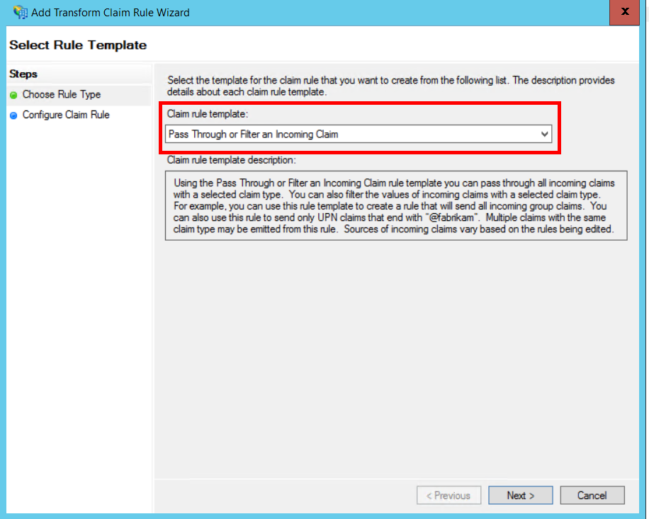
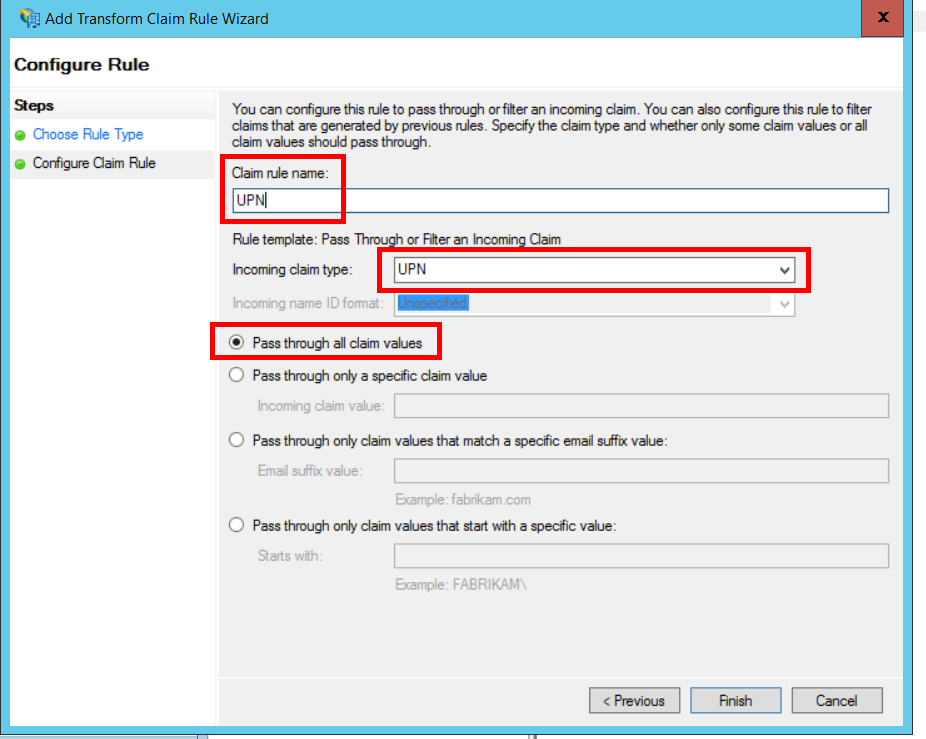

<properties
   pageTitle="Federando com AD FS de um cliente | Microsoft Azure"
   description="Como a agrupe com um cliente fica AD FS em um aplicativo de vários locatários"
   services=""
   documentationCenter="na"
   authors="JohnPWSharp"
   manager="roshar"
   editor=""
   tags=""/>

<tags
   ms.service="guidance"
   ms.devlang="dotnet"
   ms.topic="article"
   ms.tgt_pltfrm="na"
   ms.workload="na"
   ms.date="06/02/2016"
   ms.author="v-josha"/>

# <a name="federating-with-a-customers-ad-fs-for-multitenant-apps-in-azure"></a>Federando com AD FS de um cliente para aplicativos vários locatários no Azure

[AZURE.INCLUDE [pnp-header](../../includes/guidance-pnp-header-include.md)]

Este artigo é [parte de uma série]. Há também um [aplicativo de exemplo] completo que acompanha esta série.

Este artigo descreve como um aplicativo de SaaS vários locatário pode oferecer suporte à autenticação por meio de serviços de Federação do Active Directory (AD FS), para federar-se com AD FS de um cliente.

## <a name="overview"></a>Visão geral

Azure Active Directory (AD Azure) facilita a entrar em usuários de locatários do Azure AD, inclusive clientes Office365 e Dynamics CRM Online. Mas e quanto os clientes que usam no local do Active Directory em uma intranet corporativa?

Uma opção é para esses clientes sincronizar seu AD no local com o Azure AD, usando o [Azure AD Connect]. No entanto, alguns clientes talvez não seja possível usar essa abordagem, devido a política de TI corporativa ou outros motivos. Nesse caso, outra opção é federada por meio de serviços de Federação do Active Directory (AD FS).

Para habilitar este cenário:

-   O cliente deve ter um farm voltado para a Internet AD FS.
-   O provedor de SaaS implanta sua próprias farm do AD FS.
-   O cliente e o provedor de SaaS devem configurar [confiança de Federação]. Este é um processo manual.

Há três funções principais na relação de confiança:

-   AD FS do cliente é o [parceiro de conta], responsável por autenticar usuários do cliente do AD e criando tokens de segurança com declarações de usuário.
-   AD FS do provedor de SaaS é o [parceiro de recurso], que confia o parceiro de conta e recebe as declarações de usuário.
-   O aplicativo está configurado como parte confiante (RP) no AD FS do provedor SaaS.

    

> [AZURE.NOTE] Neste artigo, vamos supor que o aplicativo usa OpenID conectar como o protocolo de autenticação. Outra opção é usar o Web Services Federation.

> Para se conectar a OpenID, o provedor de SaaS deve usar o AD FS 4.0 em execução no Windows Server 2016, que está sendo Technical Preview. O AD FS 3.0 não dá suporte a OpenID se conectar.

> Principais do ASP.NET 1.0 não inclui o suporte de-de-prontos para Web Services Federation.

Para obter um exemplo do uso de Web Services Federation com ASP.NET 4, consulte a [amostra de ativo-diretório-dotnet-Web App-wsfederation][active-directory-dotnet-webapp-wsfederation].

## <a name="authentication-flow"></a>Fluxo de autenticação

1.  Quando o usuário clica "entrar", o aplicativo redireciona para um ponto de extremidade OpenID conectar na AD FS do provedor SaaS.
2.  O usuário insere seu nome de usuário organizacionais ("`alice@corp.contoso.com`"). AD FS usa descoberta de território primário para redirecionar para do AD FS do cliente, onde o usuário insere suas credenciais.
3.  AD FS do cliente envia declarações de usuário para AD FS do provedor de SaaS, usando WF-Federation (ou SAML).
4.  Fluxo de declarações do AD FS para o aplicativo, usando a conexão de OpenID. Isso requer uma transição de protocolo da Web Services Federation.

## <a name="limitations"></a>Limitações

No momento da redação deste artigo, o aplicativo recebe um conjunto limitado de declarações em id_token OpenID, conforme listados na tabela a seguir. O AD FS 4.0 está em ainda preview, portanto este conjunto pode mudar. Não é possível atualmente definir declarações adicionais:

Declaração   | Descrição
------|-------------
AUD | Audiência. O aplicativo para o qual as declarações foram emitidas.
authenticationinstant   | [Autenticação instantânea]. O tempo na qual autenticação ocorreu.
c_hash  | Valor de hash de código. Este é um hash do conteúdo do token.
EXP | [Tempo de expiração]. O tempo após o qual o token já não serão aceitas.
IAT | [Emitido em]. O tempo quando o token foi emitido.
ISS | Emissor. O valor desta declaração é sempre AD FS do parceiro de recurso.
nome    | Nome de usuário. Exemplo: `john@corp.fabrikam.com`.
Identificador de nome | [Identificador de nome]. O identificador para o nome da entidade para a qual o token foi emitido.
valor de uso único   | Valor de uso único de sessão. Um valor exclusivo gerado pelo AD FS para ajudar a evitar ataques de repetição.
UPN | Nome de usuário principal (UPN). Exemplo:john@corp.fabrikam.com
pwd_exp | Período de expiração de senha. O número de segundos até que a senha do usuário ou um segredo de autenticação semelhantes, como um PIN. expira.

> [AZURE.NOTE] "iss" reivindicar contém o AD FS do parceiro (geralmente, esta declaração identifique o provedor de SaaS como o emissor). Ele não identificar AD FS do cliente. Você pode encontrar domínio do cliente como parte do UPN.

O restante deste artigo descreve como configurar a relação de confiança entre o RP (o aplicativo) e o parceiro de conta (o cliente).

## <a name="ad-fs-deployment"></a>Implantação do AD FS

O provedor de SaaS pode implantar o AD FS no local ou em VMs do Azure. Para segurança e disponibilidade, as seguintes diretrizes são importantes:

-   Implante pelo menos dois servidores do AD FS e dois servidores de proxy do AD FS para obter a melhor disponibilidade do serviço do AD FS.
-   Controladores de domínio e servidores do AD FS nunca devem ser expostos diretamente à Internet e devem estar em uma rede virtual com acesso direto a elas.
-   Proxies de aplicativo da Web (anteriormente proxies do AD FS) devem ser usados para publicar servidores do AD FS na Internet.

Para configurar uma topologia semelhante no Azure requer o uso de redes virtuais, do NSG, da máquina virtual azure e conjuntos de disponibilidade. Para obter mais detalhes, consulte [as diretrizes de implantação do Active Directory do Windows Server em máquinas virtuais do Azure][active-directory-on-azure].

## <a name="configure-openid-connect-authentication-with-ad-fs"></a>Configurar a autenticação OpenID conectar-se com o AD FS

O provedor de SaaS deve habilitar OpenID conectar-se entre o aplicativo e do AD FS. Para fazer isso, adicione um grupo de aplicativos do AD FS.  Você pode encontrar instruções detalhadas esta [postagem de blog], em "Configurar um aplicativo da Web para conectar OpenId assinar no AD FS." 

Em seguida, configure o middleware OpenID se conectar. O ponto de extremidade de metadados é `https://domain/adfs/.well-known/openid-configuration`, onde domínio é do provedor SaaS do AD FS.

Normalmente, você pode combinar isso com outros pontos de extremidade OpenID conectar (como AAD). Você precisará dois diferentes entrar botões ou alguma outra maneira para diferenciá-los, para que o usuário é enviado para o ponto de extremidade de autenticação correta.

## <a name="configure-the-ad-fs-resource-partner"></a>Configurar o parceiro do AD FS recurso

O provedor de SaaS deve fazer o seguinte para cada cliente que deseja se conectar por meio de ADFS:

1.  Adicione uma relação de confiança de provedor de declarações.
2.  Adicione regras de declarações.
3.  Habilite a descoberta de território home.

Aqui estão as etapas mais detalhadamente.

### <a name="add-the-claims-provider-trust"></a>Adicionar a relação de confiança de provedor de declarações

1.  No Gerenciador do servidor, clique em **Ferramentas**e selecione **Gerenciamento do AD FS**.
2.  Na árvore do console, sob **o AD FS**, clique com botão direito **Relações de confiança de provedor de declarações**. Selecione **Adicionar relação de confiança de provedor de declarações**.
3.  Clique em **Iniciar** para iniciar o assistente.
4.  Selecione os opção "importar dados sobre o provedor de declarações publicado online ou em uma rede local". Insira o URI do ponto de extremidade de metadados de Federação do cliente. (Exemplo: `https://contoso.com/FederationMetadata/2007-06/FederationMetadata.xml`.) Você precisará obter isso do cliente.
5.  Conclua o assistente usando as opções padrão.

### <a name="edit-claims-rules"></a>Editar regras de declarações

1.  Clique com botão direito a relação de confiança de provedor de declarações recém-adicionado e selecione **Editar regras de declarações**.
2.  Clique em **Adicionar regra**.
3.  Selecione "Passar através de ou filtrar uma declaração de entrada" e clique em **Avançar**.
    
4.  Insira um nome para a regra.
5.  Em "Tipo de declaração de entrada", selecione **UPN**.
6.  Selecione "Passagem todos reivindicar valores".
  
7.  Clique em **Concluir**.
8.  Repita as etapas 2 a 7 e especifique o **Tipo de declaração de âncora** para o tipo de declaração de entrada.
9.  Clique em **Okey** para concluir o assistente.

### <a name="enable-home-realm-discovery"></a>Habilitar a descoberta de território home
Execute o seguinte script do PowerShell:

```
Set-ADFSClaimsProviderTrust -TargetName "name" -OrganizationalAccountSuffix @("suffix")
```

onde "nome" é o nome amigável da relação de confiança de provedor de declarações, e "sufixo" é o sufixo UPN para o cliente do AD (por exemplo, "corp.fabrikam.com").

Com essa configuração, os usuários finais pode digitar na sua conta organizacional e do AD FS selecionará automaticamente o provedor de declarações correspondente. Consulte [Personalizando as AD FS entrar páginas], sob a seção "Configurar o provedor de identidade usar determinados sufixos de email".

## <a name="configure-the-ad-fs-account-partner"></a>Configurar o parceiro do AD FS conta

O cliente deve fazer o seguinte:

1.  Adicione uma terceira confiança de festa (RP).
2.  Adiciona regras de declarações.

### <a name="add-the-rp-trust"></a>Adicionar a relação de confiança RP

1.  No Gerenciador do servidor, clique em **Ferramentas**e selecione **Gerenciamento do AD FS**.
2.  Na árvore do console, sob **o AD FS**, clique com botão direito **Confiar festa confia**. Selecione **Adicionar terceira confiança de terceiros**.
3.  Selecione **Requerimentos cientes** e clique em **Iniciar**.
4.  Na página **Selecionar fonte de dados** , selecione os opção "importar dados sobre o provedor de declarações publicado online ou em uma rede local". Insira o URI do ponto de extremidade de metadados de Federação do provedor SaaS.
  
5.  Na página **Especificar nome para exibição** , digite qualquer nome.
6.  Na página **Escolher diretiva de controle de acesso** , escolha uma política. Você pode permitir que todos na organização ou escolha um grupo de segurança específico.
  
7.  Digite quaisquer parâmetros necessários na caixa **política** .
8.  Clique em **Avançar** para concluir o assistente.

### <a name="add-claims-rules"></a>Adicionar regras de declarações

1.  Clique com botão direito a confiança de festa terceira recém-adicionado e selecione **Editar diretiva de emissão de declaração**.
2.  Clique em **Adicionar regra**.
3.  Selecione "Enviar LDAP atributos como declarações de" e clique em **Avançar**.
4.  Insira um nome para a regra, como "UPN".
5.  Em **atributo armazenar**, selecione **Active Directory**.
  
6.  Na seção **atributos de mapeamento de LDAP** :
  - Em **Atributo LDAP**, selecione o **Nome de usuário Principal**.
  - Em **Tipo de declaração de saída**, selecione **UPN**.
  
7.  Clique em **Concluir**.
8.  Clique em **Adicionar regra** novamente.
9.  Selecione "Enviar declarações usando uma regra personalizada" e clique em **Avançar**.
10. Insira um nome para a regra, como "Tipo de declaração de âncora".
11. Em **regra personalizada**, insira o seguinte:

    ```
    EXISTS([Type == "http://schemas.microsoft.com/ws/2014/01/identity/claims/anchorclaimtype"])=>
      issue (Type = "http://schemas.microsoft.com/ws/2014/01/identity/claims/anchorclaimtype",
             Value = "http://schemas.xmlsoap.org/ws/2005/05/identity/claims/upn");
    ```

    Essa regra emite uma declaração de tipo `anchorclaimtype`. A declaração informa a terceira parte usar UPN como imutável ID de. do usuário

12. Clique em **Concluir**.
13. Clique em **Okey** para concluir o assistente.

## <a name="next-steps"></a>Próximas etapas

- Leia o próximo artigo desta série: [declaração do cliente usando obter tokens de acesso do Azure AD][client assertion]

<!-- Links -->
[parte de uma série]: guidance-multitenant-identity.md
[Azure AD Connect]: ../active-directory/active-directory-aadconnect.md
[confiança de Federação]: https://technet.microsoft.com/library/cc770993(v=ws.11).aspx
[parceiro de conta]: https://technet.microsoft.com/library/cc731141(v=ws.11).aspx
[parceiro de recurso]: https://technet.microsoft.com/library/cc731141(v=ws.11).aspx
[Autenticação instantânea]: https://msdn.microsoft.com/library/system.security.claims.claimtypes.authenticationinstant%28v=vs.110%29.aspx
[Tempo de expiração]: http://tools.ietf.org/html/draft-ietf-oauth-json-web-token-25#section-4.1.4
[Emitido em]: http://tools.ietf.org/html/draft-ietf-oauth-json-web-token-25#section-4.1.6
[Identificador de nome]: https://msdn.microsoft.com/library/system.security.claims.claimtypes.nameidentifier(v=vs.110).aspx
[active-directory-on-azure]: https://msdn.microsoft.com/library/azure/jj156090.aspx
[postagem de blog]: http://www.cloudidentity.com/blog/2015/08/21/OPENID-CONNECT-WEB-SIGN-ON-WITH-ADFS-IN-WINDOWS-SERVER-2016-TP3/
[Personalizando as AD FS entrar páginas]: https://technet.microsoft.com/library/dn280950.aspx
[exemplo de aplicativo]: https://github.com/Azure-Samples/guidance-identity-management-for-multitenant-apps
[client assertion]: guidance-multitenant-identity-client-assertion.md
[active-directory-dotnet-webapp-wsfederation]: https://github.com/Azure-Samples/active-directory-dotnet-webapp-wsfederation
