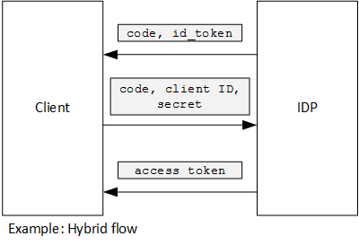

<properties
   pageTitle="Usando declaração do cliente para obter tokens de acesso do Azure AD | Microsoft Azure"
   description="Como usar a declaração do cliente obter tokens de acesso do Azure AD."
   services=""
   documentationCenter="na"
   authors="MikeWasson"
   manager="roshar"
   editor=""
   tags=""/>

<tags
   ms.service="guidance"
   ms.devlang="dotnet"
   ms.topic="article"
   ms.tgt_pltfrm="na"
   ms.workload="na"
   ms.date="05/23/2016"
   ms.author="mwasson"/>

# <a name="using-client-assertion-to-get-access-tokens-from-azure-ad"></a>Usando declaração do cliente para obter tokens de acesso do Azure AD

[AZURE.INCLUDE [pnp-header](../../includes/guidance-pnp-header-include.md)]

Este artigo é [parte de uma série]. Há também um [aplicativo de exemplo] completo que acompanha esta série.

## <a name="background"></a>Plano de fundo

Ao usar o fluxo de código de autorização ou híbrido fluxo em OpenID conectar, o cliente de troca um código de autorização para um token de acesso. Durante esta etapa, o cliente tem para se autenticar no servidor.



Uma maneira para autenticar o cliente é usando um segredo de cliente. É como as [Pesquisas de Tailspin] [ Surveys] aplicativo está configurado por padrão.

Aqui está um exemplo de solicitação do cliente para IDP, solicitando um token de acesso. Observação a `client_secret` parâmetro.

```
POST https://login.microsoftonline.com/b9bd2162xxx/oauth2/token HTTP/1.1
Content-Type: application/x-www-form-urlencoded

resource=https://tailspin.onmicrosoft.com/surveys.webapi
  &client_id=87df91dc-63de-4765-8701-b59cc8bd9e11
  &client_secret=i3Bf12Dn...
  &grant_type=authorization_code
  &code=PG8wJG6Y...
```

O segredo é apenas uma cadeia de caracteres, para que você tenha que garantir que não a perda o valor. A prática recomendada é manter o segredo cliente sair do controle de origem. Quando você implanta no Azure, armazenar o segredo em uma [configuração de aplicativo][configure-web-app].

No entanto, qualquer pessoa com acesso à assinatura Azure pode exibir as configurações de aplicativo. Além disso, sempre há uma tentativa para verificar segredos no controle de origem (por exemplo, em scripts de implantação), compartilhá-los por email e assim por diante.

Para ter mais segurança, você pode usar a [declaração de cliente] em vez de um segredo de cliente. Com a declaração de cliente, o cliente usa um certificado x. 509 para comprovar que a solicitação de token veio do cliente. O certificado de cliente está instalado no servidor web. Em geral, será mais fácil restringir o acesso para o certificado, que garantir que ninguém inadvertidamente revela um segredo de cliente. Para obter mais informações sobre como configurar certificados em um aplicativo web, consulte [Usando certificados em aplicativos de sites do Azure][using-certs-in-websites]

Aqui está uma solicitação de token usando declaração do cliente:

```
POST https://login.microsoftonline.com/b9bd2162xxx/oauth2/token HTTP/1.1
Content-Type: application/x-www-form-urlencoded

resource=https://tailspin.onmicrosoft.com/surveys.webapi
  &client_id=87df91dc-63de-4765-8701-b59cc8bd9e11
  &client_assertion_type=urn:ietf:params:oauth:client-assertion-type:jwt-bearer
  &client_assertion=eyJhbGci...
  &grant_type=authorization_code
  &code= PG8wJG6Y...
```

Observe que o `client_secret` parâmetro já não é usado. Em vez disso, o `client_assertion` parâmetro contém um token JWT que foi assinado usando o certificado de cliente. O `client_assertion_type` parâmetro especifica o tipo de declaração &mdash; nesse caso, símbolo JWT. O servidor valida o token JWT. Se o token JWT for inválido, a solicitação de token retornará um erro.

> [AZURE.NOTE] Certificados x. 509 não são a única forma de declaração do cliente; Vamos nos concentrar nela aqui porque ele é compatível com o Azure AD.

## <a name="using-client-assertion-in-the-surveys-application"></a>Usando declaração do cliente no aplicativo de pesquisas

Esta seção mostra como configurar o aplicativo de Tailspin pesquisas para usar declaração do cliente. Nestas etapas, você irá gerar um certificado auto-assinado que seja adequado para desenvolvimento, mas não para uso de produção.

1. Executar o script do PowerShell [/Scripts/Setup-KeyVault.ps1] [ Setup-KeyVault] da seguinte maneira:

    ```
    .\Setup-KeyVault.ps -Subject [subject]
    ```

    Para o `Subject` parâmetro, digite qualquer nome, como "surveysapp". O script gera um certificado auto-assinado e armazena no repositório de certificados "usuário atual/pessoal".

2. A saída do script é um fragmento JSON. Adicione isto ao manifesto do aplicativo do aplicativo web, da seguinte maneira:

    1. Log para o [portal de gerenciamento Azure] [ azure-management-portal] e navegue até o diretório do Azure AD.

    2. Clique em **aplicativos**.

    3. Selecione o aplicativo de pesquisas.

    4.  Clique em **Gerenciar manifesto** e selecione **Baixar manifesto**.

    5.  Abra o arquivo de JSON manifesto em um editor de texto. Colar a saída do script para o `keyCredentials` propriedade. Ele deve ser semelhante ao seguinte:

        ```    
        "keyCredentials": [
            {
              "type": "AsymmetricX509Cert",
              "usage": "Verify",
              "keyId": "29d4f7db-0539-455e-b708-....",
              "customKeyIdentifier": "ZEPpP/+KJe2fVDBNaPNOTDoJMac=",
              "value": "MIIDAjCCAeqgAwIBAgIQFxeRiU59eL.....
            }
          ],
         ```

    6.  Salve suas alterações no arquivo JSON.

    7.  Volte para o portal. Clique em **Gerenciar manifesto** > **Carregar manifesto** e carregar o arquivo JSON.

3. Execute o seguinte comando para obter a impressão digital do certificado.

    ```
    certutil -store -user my [subject]
    ```

    onde `[subject]` é o valor que você especificou para assunto no script PowerShell. A impressão digital será listada como "Certificado Hash(sha1)". Remova os espaços entre os números hexadecimais.

4. Atualize seus segredos de aplicativo. No Solution Explorer, clique com botão direito no projeto Tailspin.Surveys.Web e selecione **Gerenciar segredos do usuário**. Adicione uma entrada para "Assimétrico" em "AzureAd", conforme mostrado abaixo:

    ```
    {
      "AzureAd": {
        "ClientId": "[Surveys application client ID]",
        // "ClientSecret": "[client secret]",  << Delete this entry
        "PostLogoutRedirectUri": "https://localhost:44300/",
        "WebApiResourceId": "[App ID URI of your Survey.WebAPI application]",
        // new:
        "Asymmetric": {
          "CertificateThumbprint": "[certificate thumbprint]",  // Example: "105b2ff3bc842c53582661716db1b7cdc6b43ec9"
          "StoreName": "My",
          "StoreLocation": "CurrentUser",
          "ValidationRequired": "false"
        }
      },
      "Redis": {
        "Configuration": "[Redis connection string]"
      }
    }
    ```

    Você deve definir `ValidationRequired` como false, porque o certificado não foi assinado por uma autoridade de certificação raiz. Em produção, use um certificado assinado por uma autoridade de certificação e definido `ValidationRequired` como true.

    Também exclua a entrada para `ClientSecret`, pois não é necessária com declaração do cliente.

5. No Startup.cs, localize o código que registra o `ICredentialService`. Tire comentários a linha que usa `CertificateCredentialService`e comente a linha que usa `ClientCredentialService`:

    ```csharp
    // Uncomment this:
    services.AddSingleton<ICredentialService, CertificateCredentialService>();
    // Comment out this:
    //services.AddSingleton<ICredentialService, ClientCredentialService>();
    ```

Em tempo de execução, o aplicativo web lê o certificado do armazenamento de certificado. O certificado deve ser instalado na mesma máquina que o aplicativo web.

## <a name="next-steps"></a>Próximas etapas

- Leia o próximo artigo desta série: [Usando o Azure chave cofre para proteger segredos de aplicativo][key vault]


<!-- Links -->
[configure-web-app]: ../app-service-web/web-sites-configure.md
[azure-management-portal]: https://manage.windowsazure.com
[declaração de cliente]: https://tools.ietf.org/html/rfc7521
[key vault]: guidance-multitenant-identity-keyvault.md
[Setup-KeyVault]: https://github.com/Azure-Samples/guidance-identity-management-for-multitenant-apps/blob/master/scripts/Setup-KeyVault.ps1
[Surveys]: guidance-multitenant-identity-tailspin.md
[using-certs-in-websites]: https://azure.microsoft.com/blog/using-certificates-in-azure-websites-applications/
[parte de uma série]: guidance-multitenant-identity.md
[exemplo de aplicativo]: https://github.com/Azure-Samples/guidance-identity-management-for-multitenant-apps
