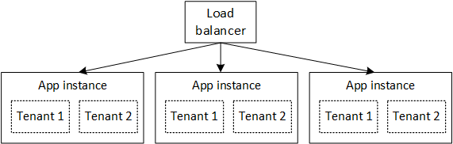

<properties
   pageTitle="Gerenciamento de identidades para vários locatários aplicativos | Microsoft Azure"
   description="Introdução ao gerenciamento de identidades em aplicativos de vários locatários"
   services=""
   documentationCenter="na"
   authors="MikeWasson"
   manager="roshar"
   editor=""
   tags=""/>

<tags
   ms.service="guidance"
   ms.devlang="dotnet"
   ms.topic="article"
   ms.tgt_pltfrm="na"
   ms.workload="na"
   ms.date="06/02/2016"
   ms.author="mwasson"/>

# Introdução ao gerenciamento de identidades para vários locatários aplicativos no Microsoft Azure

[AZURE.INCLUDE [pnp-header](../../includes/guidance-pnp-header-include.md)]

Este artigo é [parte de uma série]. Há também um [aplicativo de exemplo] completo que acompanha esta série.

Digamos que você está escrevendo uma empresa SaaS aplicativo sejam hospedados na nuvem. Claro, o aplicativo terá usuários:

Mas esses usuários pertencem a organizações:

Exemplo: Tailspin vende assinaturas do seu aplicativo de SaaS. Contoso e Fabrikam Inscreva-se para o aplicativo. Quando Alice (`alice@contoso`) sinais no, o aplicativo deve saber que Alice é parte da Contoso.

- Alice _devem_ ter acesso aos dados de Contoso.
- Alice _não devem_ ter acesso aos dados da Fabrikam.

Este guia mostrará como gerenciar identidades dos usuários em um aplicativo de vários locatários, usando o [Active Directory do Azure] [ AzureAD] (Azure AD) para tratar entrar e autenticação.

## O que é multitenancy?

Um _locatário_ é um grupo de usuários. Em um aplicativo de SaaS, locatário é um assinante ou um cliente do aplicativo. _Multilocação_ é uma arquitetura onde vários locatários compartilham a mesma instância física do aplicativo. Embora locatários compartilhem recursos físicos (como VMs ou armazenamento), cada locatário obtém sua própria instância lógica do aplicativo.

Normalmente, dados de aplicativos são compartilhados entre os usuários dentro de um locatário, mas não com outros locatários.

Compare essa arquitetura com uma arquitetura de locatário do único, onde cada locatário tem uma instância de física dedicada. Em uma arquitetura de único locatário, adicione locatários bagunçar novas instâncias do aplicativo.

### Dimensionamento de multitenancy e horizontal

Para obter escala na nuvem, é comum para adicionar mais físicas instâncias. Isso é conhecido como _dimensionamento horizontal_ ou _escala check-out_. Considere a possibilidade de um aplicativo web. Para lidar com mais tráfego, você pode adicionar mais server VMs e colocá-los atrás de um balanceador de carga. Cada máquina virtual executa uma instância física separada do aplicativo web.

Qualquer solicitação poderão ser roteada para qualquer instância. Juntos, o sistema funciona como uma única instância lógica. Você pode subdividir uma máquina virtual ou girar uma nova VM, sem afetar os usuários. Nesta arquitetura, cada instância física é vários locatário e dimensionar adicionando mais instâncias. Se uma instância falhar, ele não deve afetar qualquer locatário.

## Identidade em um aplicativo de vários locatários

Em um aplicativo de vários locatários, você deve considerar os usuários no contexto de locatários.

**Autenticação**

- Usuários entro no aplicativo com suas credenciais de organização. Eles não precisam criar novos perfis de usuário para o aplicativo.
- Os usuários na mesma organização fazem parte do mesmo locatário.
- Quando um usuário entra, o aplicativo sabe qual locatário o usuário pertence.

**Autorização**

- Ao autorizar ações de um usuário (digamos, exibindo um recurso), o aplicativo deve levar em conta de locatário do usuário.
- Os usuários podem ser atribuídos a funções dentro do aplicativo, como "Administrador" ou "Usuário padrão". Atribuições de função devem ser gerenciadas pelo cliente, não pelo provedor de SaaS.

**Exemplo.** Alice, um funcionário na Contoso, navega para o aplicativo em seu navegador e clica no botão "Login". Ela será redirecionada para uma tela de login onde ela insere suas credenciais corporativas (nome de usuário e senha). Neste ponto, ela é registrada no aplicativo como `alice@contoso.com`. O aplicativo também sabe que Alice é um usuário de administrador para este aplicativo. Porque ela é um administrador, ela pode ver uma lista de todos os recursos que pertencem a Contoso. No entanto, ela não pode exibir os recursos da Fabrikam, porque ela é um administrador apenas dentro dela locatário.

Neste guia, veremos especificamente usando o Azure AD para gerenciamento de identidades.

- Vamos supor que o cliente armazena seus perfis de usuário no Azure AD (incluindo locatários do Office 365 e Dynamics CRM)
- Os clientes no local do Active Directory (AD) podem usar [Azure AD Connect] [ ADConnect] para sincronizar seu AD no local com o Azure AD.

Se um cliente com AD no local não é possível usar Azure AD Connect (devido a política de TI corporativa ou outros motivos), o SaaS provedor poderá federar-se com o cliente fica AD por meio de serviços de Federação do Active Directory (AD FS). Essa opção é descrita em [Federating com AD FS de um cliente].

Este guia não considera outros aspectos de multilocação como partição de dados, configuração de por locatário e assim por diante.

## Próximas etapas

- Leia o próximo artigo desta série: [sobre pesquisas de Tailspin o aplicativo][tailpin]

<!-- Links -->
[ADConnect]: ../active-directory/active-directory-aadconnect.md
[AzureAD]: https://azure.microsoft.com/documentation/services/active-directory/
[parte de uma série]: guidance-multitenant-identity.md
[Federando com AD FS de um cliente]: guidance-multitenant-identity-adfs.md
[exemplo de aplicativo]: https://github.com/Azure-Samples/guidance-identity-management-for-multitenant-apps
[tailpin]: guidance-multitenant-identity-tailspin.md
