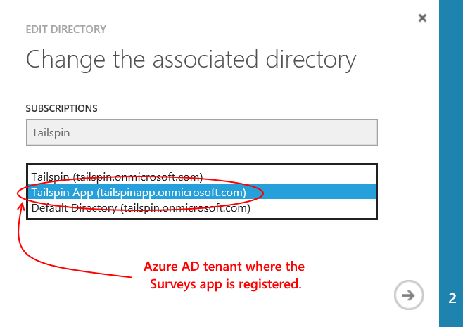

<properties
   pageTitle="Usar chave cofre para proteger segredos de aplicativo | Microsoft Azure"
   description="Como um use o serviço de chave cofre para armazenar segredos de aplicativo"
   services=""
   documentationCenter="na"
   authors="MikeWasson"
   manager="roshar"
   editor=""
   tags=""/>

<tags
   ms.service="guidance"
   ms.devlang="dotnet"
   ms.topic="article"
   ms.tgt_pltfrm="na"
   ms.workload="na"
   ms.date="02/16/2016"
   ms.author="mwasson"/>

# <a name="using-azure-key-vault-to-protect-application-secrets"></a>Usando o Azure chave cofre para proteger segredos de aplicativo

[AZURE.INCLUDE [pnp-header](../../includes/guidance-pnp-header-include.md)]

Este artigo é [parte de uma série]. Há também um [aplicativo de exemplo] completo que acompanha esta série.

## <a name="overview"></a>Visão geral

É comum ter configurações de aplicativo que são confidenciais e devem ser protegidas, tais como:

- Cadeias de caracteres de conexão de banco de dados
- Senhas
- Chaves de criptografia

Como prática recomendada de segurança, você nunca deve armazenar esses segredos no controle de origem. É muito fácil para que elas sejam perda &mdash; mesmo se o repositório de código fonte é particular. E ela é não praticamente manter segredos da geral pública. Em projetos maiores, talvez você queira restringir que os desenvolvedores e operadores podem acessar as senhas de produção. (São diferentes configurações para ambientes de teste ou desenvolvimento.)

Uma opção mais segura é armazenar esses segredos no [Azure chave cofre][KeyVault]. Cofre de chave é um serviço hospedado na nuvem para o gerenciamento de chaves de criptografia e outras senhas. Este artigo mostra como usar chave cofre para armazenar definições de configuração para o aplicativo.

Na [Tailspin pesquisas] [ Surveys] aplicativo, as configurações a seguir são secretas:

- A cadeia de conexão de banco de dados.
- A cadeia de conexão relacionada.
- O segredo de cliente para o aplicativo web.

Para armazenar segredos de configuração em Cofre de chave, o aplicativo de pesquisas implementa um provedor de configuração personalizada, que conecta no [sistema de configuração]ASP.NET Core 1.0[configuration]. O provedor personalizado lê configurações do Cofre de chave na inicialização.

O aplicativo de pesquisas carrega configurações nos seguintes locais:

- O arquivo de appsettings.json
- A [armazenam segredos do usuário] [ user-secrets] (ambiente de desenvolvimento somente; para teste)
- O ambiente de hospedagem (configurações de aplicativo no Azure web apps)
- Chave cofre

Cada um dessas substituições aquele anterior, portanto quaisquer configurações armazenadas no cofre de chave prevalecem.

> [AZURE.NOTE] Por padrão, o provedor de configuração do Cofre de chave é desabilitado. Não é necessária para execução do aplicativo localmente. Você deve habilitá-lo em uma implantação de produção.

> O provedor de chave cofre atualmente não há suporte para .NET Core, porque ela requer o [Microsoft.Azure.KeyVault] [ Microsoft.Azure.KeyVault] pacote.

Na inicialização, o aplicativo lê as configurações de cada provedor de configuração registrado e os usa para preencher um objeto de opções acentuado. (Para obter mais informações, consulte [usando opções e objetos de configuração][options].)

## <a name="implementation"></a>Implementação

O [KeyVaultConfigurationProvider] [ KeyVaultConfigurationProvider] classe é um provedor de configuração que se conecta ao [sistema de configuração]do ASP.NET Core 1.0[configuration].

Usar o `KeyVaultConfigurationProvider`, chame o `AddKeyVaultSecrets` método de extensão da classe de inicialização:

```csharp
    var builder = new ConfigurationBuilder()
        .SetBasePath(appEnv.ApplicationBasePath)
        .AddJsonFile("appsettings.json");

    if (env.IsDevelopment())
    {
        builder.AddUserSecrets();
    }
    builder.AddEnvironmentVariables();
    var config = builder.Build();

    // Add key vault configuration:
    builder.AddKeyVaultSecrets(config["AzureAd:ClientId"],
        config["KeyVault:Name"],
        config["AzureAd:Asymmetric:CertificateThumbprint"],
        Convert.ToBoolean(config["AzureAd:Asymmetric:ValidationRequired"]),
        loggerFactory);
```

Observe que `KeyVaultConfigurationProvider` requer algumas configurações, que precisam ser armazenados em uma das fontes de configuração.

Quando o aplicativo for iniciado, `KeyVaultConfigurationProvider` enumera todas as senhas no cofre de chave. Para cada segredo, ela procura uma marca chamada 'ConfigKey'. O valor da marca é o nome da configuração.

> [AZURE.NOTE] [Marcas] [ key-tags] são armazenados com uma chave de metadados opcionais. Marcas são usadas aqui porque nomes de chave não podem conter caracteres de dois-pontos (:).

```csharp
var kvClient = new KeyVaultClient(GetTokenAsync);
var secretsResponseList = await kvClient.GetSecretsAsync(_vault, MaxSecrets, token);
foreach (var secretItem in secretsResponseList.Value)
{
    //The actual config key is stored in a tag with the Key "ConfigKey"
    // because ':' is not supported in a shared secret name by Key Vault.
    if (secretItem.Tags != null && secretItem.Tags.ContainsKey(ConfigKey))
    {
        var secret = await kvClient.GetSecretAsync(secretItem.Id, token);
        Data.Add(secret.Tags[ConfigKey], secret.Value);
    }
}
```

> [AZURE.NOTE] Consulte [KeyVaultConfigurationProvider.cs].

## <a name="setting-up-key-vault-in-the-surveys-app"></a>Configurando chave cofre no aplicativo pesquisas

Pré-requisitos:

- Instalar os [Cmdlets do Gerenciador de recursos Azure][azure-rm-cmdlets].
- Configurar o aplicativo de pesquisas, conforme descrito em [executando o aplicativo de pesquisas][readme].

Etapas de alto nível:

1. Configure um usuário de administrador no locatário.
2. Configure um certificado de cliente.
3. Crie um chave cofre.
4. Adicione configurações para seu cofre chave.
5. Tire comentários o código que permite chave cofre.
6. Atualize segredos do usuário do aplicativo.

### <a name="set-up-an-admin-user"></a>Configurar um usuário administrador

> [AZURE.NOTE] Para criar um chave cofre, você deve usar uma conta que pode gerenciar sua assinatura do Azure. Além disso, qualquer aplicativo que você autoriza a ler no cofre chave deve ser registrado no mesmo locatário como essa conta.

Nesta etapa, você irá assegurar que você pode criar um cofre chave enquanto conectado como um usuário do locatário de onde o aplicativo de pesquisas está registrado.

Primeiro, altere o diretório associado a sua assinatura do Azure.

1. Entrar no [portal de gerenciamento do Azure][azure-management-portal]

2. Clique em **configurações**.

    

3. Selecione sua assinatura do Azure.

4. Clique em **Editar pasta** na parte inferior do portal.

    

5. Em "Alterar diretório associado", selecione o locatário do Azure AD onde o aplicativo de pesquisas está registrado,

    

6. Clique no botão de seta e preencha a caixa de diálogo.

Crie um usuário de administrador dentro do locatário do Azure AD onde o aplicativo de pesquisas está registrado.

1. Log para o [portal de gerenciamento Azure][azure-management-portal].

2. Selecione o locatário do Azure AD onde seu aplicativo está registrado.

3. Clique em **usuários** > **Adicionar usuário**.

4. Na caixa de diálogo **Adicionar usuário** , atribua o usuário para a função de Administrador Global.

Adicione o usuário admin como um administrador de colegas para sua assinatura do Azure.

1. Log para o [portal de gerenciamento Azure][azure-management-portal].

2. Clique em **configurações** e selecione sua assinatura do Azure.

3. Clique em **administradores**

4. Clique em **Adicionar** na parte inferior do portal.

5. Insira o email do usuário administrador que você criou anteriormente.

6. Marque a caixa de seleção para a assinatura.

7. Clique no botão de marca de seleção para concluir a caixa de diálogo.


### <a name="set-up-a-client-certificate"></a>Configurar um certificado de cliente

1. Executar o script do PowerShell [/Scripts/Setup-KeyVault.ps1] [ Setup-KeyVault] da seguinte maneira:
    ```
    .\Setup-KeyVault.ps1 -Subject <<subject>>
    ```
    Para o `Subject` parâmetro, digite qualquer nome, como "surveysapp". O script gera um certificado auto-assinado e armazena no repositório de certificados "usuário atual/pessoal".

2. A saída do script é um fragmento JSON. Adicione isto ao manifesto do aplicativo do aplicativo web, da seguinte maneira:

    1. Log para o [portal de gerenciamento Azure] [ azure-management-portal] e navegue até o diretório do Azure AD.

    2. Clique em **aplicativos**.

    3. Selecione o aplicativo de pesquisas.

    4.  Clique em **Gerenciar manifesto** e selecione **Baixar manifesto**.

    5.  Abra o arquivo de JSON manifesto em um editor de texto. Colar a saída do script para o `keyCredentials` propriedade. Ele deve ser semelhante ao seguinte:
    ```
            "keyCredentials": [
                {
                  "type": "AsymmetricX509Cert",
                  "usage": "Verify",
                  "keyId": "29d4f7db-0539-455e-b708-....",
                  "customKeyIdentifier": "ZEPpP/+KJe2fVDBNaPNOTDoJMac=",
                  "value": "MIIDAjCCAeqgAwIBAgIQFxeRiU59eL.....
                }
              ],
    ```          
    6.  Salve suas alterações no arquivo JSON.

    7.  Volte para o portal. Clique em **Gerenciar manifesto** > **Carregar manifesto** e carregar o arquivo JSON.

3. Adicione o fragmento JSON mesmo ao manifesto do aplicativo da web API (Surveys.WebAPI).

4. Execute o seguinte comando para obter a impressão digital do certificado.
    ```
    certutil -store -user my [subject]
    ```
    onde `[subject]` é o valor que você especificou para assunto no script PowerShell. A impressão digital será listada como "Certificado Hash(sha1)". Remova os espaços entre os números hexadecimais.

Você usará a impressão digital posteriormente.

### <a name="create-a-key-vault"></a>Criar um cofre chave

1. Executar o script do PowerShell [/Scripts/Setup-KeyVault.ps1] [ Setup-KeyVault] da seguinte maneira:

    ```
    .\Setup-KeyVault.ps1 -KeyVaultName <<key vault name>> -ResourceGroupName <<resource group name>> -Location <<location>>
    ```

    Quando solicitado a fornecer credenciais, entre como o usuário do Azure AD que você criou anteriormente. O script cria um novo grupo de recursos e um novo cofre chave dentro desse grupo de recursos.

    Observação: para o local parâmetro-, você pode usar o seguinte comando do PowerShell para obter uma lista das regiões válidos:

    ```
    Get-AzureRmResourceProvider -ProviderNamespace "microsoft.keyvault" | Where-Object { $_.ResourceTypes.ResourceTypeName -eq "vaults" } | Select-Object -ExpandProperty Locations
    ```

2. Execute SetupKeyVault.ps novamente, com os seguintes parâmetros:

    ```
    .\Setup-KeyVault.ps1 -KeyVaultName <<key vault name>> -ApplicationIds @("<<web app client ID>>", "<<web API client ID>>")
    ```

    onde

    - nome do cofre chave = o nome que você deu Cofre de chave na etapa anterior.
    - ID do cliente de aplicativo da Web = a ID do cliente para o aplicativo da web de pesquisas.
    - ID do cliente de api da Web = a ID do cliente para o aplicativo Surveys.WebAPI.

    Exemplo:
    ```
    .\Setup-KeyVault.ps1 -KeyVaultName tailspinkv -ApplicationIds @("f84df9d1-91cc-4603-b662-302db51f1031", "8871a4c2-2a23-4650-8b46-0625ff3928a6")
    ```

    > [AZURE.NOTE] Você pode obter o cliente IDs a partir do [portal de gerenciamento Azure][azure-management-portal]. Selecione o locatário do Azure AD, selecione o aplicativo e clique em **Configurar**.

    Esse script autoriza o web app e web API para recuperar segredos de seu cofre chave. Consulte [Introdução ao Azure chave cofre] [ authorize-app] para obter mais informações.

### <a name="add-configuration-settings-to-your-key-vault"></a>Adicionar configurações ao seu cofre chave

1. Executar SetupKeyVault.ps da seguinte maneira:

    ```
    .\Setup-KeyVault.ps1 -KeyVaultName <<key vault name> -KeyName RedisCache -KeyValue "<<Redis DNS name>>.redis.cache.windows.net,password=<<Redis access key>>,ssl=true" -ConfigName "Redis:Configuration"
    ```
    onde

    - nome do cofre chave = o nome que você deu Cofre de chave na etapa anterior.
    - Relacionada nome DNS = o nome DNS da sua instância de cache relacionada.
    - Tecla de acesso de relacionada = a tecla de acesso para a sua instância de cache relacionada.

    Este comando adiciona um segredo ao seu cofre chave. O segredo é um par nome/valor mais uma marca:

    -   O nome da chave não é usado pelo aplicativo, mas deve ser exclusivo dentro do compartimento de chave.
    -   O valor é o valor da opção configuração, neste caso a cadeia de conexão relacionada.
    -   a marca "ConfigKey" mantém o nome da chave de configuração.

2. Neste ponto, é uma boa ideia para testar se você as senhas cofre chave armazenado com êxito. Execute o seguinte comando do PowerShell:

    ```
    Get-AzureKeyVaultSecret <<key vault name>> RedisCache | Select-Object *
    ```
    A saída deverá exibir o valor secreto mais alguns metadados:

    

3. Execute SetupKeyVault.ps novamente para adicionar a cadeia de conexão de banco de dados:

    ```
    .\Setup-KeyVault.ps1 -KeyVaultName <<key vault name> -KeyName ConnectionString -KeyValue <<DB connection string>> -ConfigName "Data:SurveysConnectionString"
    ```

    onde `<<DB connection string>>` é o valor da cadeia de caracteres de conexão de banco de dados.

    Para teste com o banco de dados local, copie a cadeia de conexão do arquivo Tailspin.Surveys.Web/appsettings.json. Se você fizer isso, verifique se alterar as barras invertidas ('\\\\') em uma barra invertida. As barras invertidas é um caractere de escape no arquivo JSON.

    Exemplo:

    ```
    .\Setup-KeyVault.ps1 -KeyVaultName mykeyvault -KeyName ConnectionString -KeyValue "Server=(localdb)\MSSQLLocalDB;Database=Tailspin.SurveysDB;Trusted_Connection=True;MultipleActiveResultSets=true" -ConfigName "Data:SurveysConnectionString"
    ```

### <a name="uncomment-the-code-that-enables-key-vault"></a>Tire comentários o código que permite Cofre de chave

1. Abra a solução de Tailspin.Surveys.

2. Em [Tailspin.Surveys.Web/Startup.cs][web-startup], localize o bloco de código a seguir e Tire comentários a ele.

    ```csharp
    //#if DNX451
    //            _configuration = builder.Build();
    //            builder.AddKeyVaultSecrets(_configuration["AzureAd:ClientId"],
    //                _configuration["KeyVault:Name"],
    //                _configuration["AzureAd:Asymmetric:CertificateThumbprint"],
    //                Convert.ToBoolean(_configuration["AzureAd:Asymmetric:ValidationRequired"]),
    //                loggerFactory);
    //#endif
    ```

3. Em [Tailspin.Surveys.WebAPI/Startup.cs][web-api-startup], localize o bloco de código a seguir e Tire comentários a ele.

    ```csharp
    //#if DNX451
    //            var config = builder.Build();
    //            builder.AddKeyVaultSecrets(config["AzureAd:ClientId"],
    //                config["KeyVault:Name"],
    //                config["AzureAd:Asymmetric:CertificateThumbprint"],
    //                Convert.ToBoolean(config["AzureAd:Asymmetric:ValidationRequired"]),
    //                loggerFactory);
    //#endif
    ```

4. Em [Tailspin.Surveys.Web/Startup.cs][web-startup], localize o código que registra o `ICredentialService`. Tire comentários a linha que usa `CertificateCredentialService`e comente a linha que usa `ClientCredentialService`:

    ```csharp
    // Uncomment this:
    services.AddSingleton<ICredentialService, CertificateCredentialService>();
    // Comment out this:
    //services.AddSingleton<ICredentialService, ClientCredentialService>();
    ```

    Essa alteração permite que o aplicativo web usar a [declaração do cliente] [ client-assertion] obter tokens de acesso OAuth. Com a declaração de cliente, não é necessário um segredo de cliente OAuth. Como alternativa, você pode armazenar o segredo de cliente em chave cofre. No entanto, cofre chave e declaração do cliente usam um cliente de certificado, portanto se você ativar chave cofre, é uma boa prática para habilitar a declaração de cliente também.

### <a name="update-the-user-secrets"></a>Atualizar as senhas de usuário

No Solution Explorer, clique com botão direito no projeto Tailspin.Surveys.Web e selecione **Gerenciar segredos do usuário**. No arquivo secrets.json, exclua o JSON existente e cole o seguinte:

    ```
    {
      "AzureAd": {
        "ClientId": "[Surveys web app client ID]",
        "PostLogoutRedirectUri": "https://localhost:44300/",
        "WebApiResourceId": "[App ID URI of your Surveys.WebAPI application]",
        "Asymmetric": {
          "CertificateThumbprint": "[certificate thumbprint. Example: 105b2ff3bc842c53582661716db1b7cdc6b43ec9]",
          "StoreName": "My",
          "StoreLocation": "CurrentUser",
          "ValidationRequired": "false"
        }
      },
      "KeyVault": {
        "Name": "[key vault name]"
      }
    }
    ```

Substitua as entradas de colchetes [] com os valores corretos.

- `AzureAd:ClientId`: A ID do cliente do aplicativo pesquisas.
- `AzureAd:WebApiResourceId`: URI de identificação o aplicativo que você especificou quando você criou o aplicativo de Surveys.WebAPI no Azure AD.
- `Asymmetric:CertificateThumbprint`: A impressão digital de certificado obtido anteriormente, quando você criou o certificado de cliente.
- `KeyVault:Name`: O nome do seu cofre chave.

> [AZURE.NOTE] `Asymmetric:ValidationRequired`é falso porque o certificado que você criou anteriormente não foi assinado por uma autoridade de certificação (CA) raiz. Em produção, use um certificado assinado por uma autoridade de certificação raiz e definido `ValidationRequired` como true.

Salve o arquivo atualizado secrets.json.

Em seguida, no Solution Explorer, clique com botão direito no projeto Tailspin.Surveys.WebApi e selecione **Gerenciar segredos do usuário**. Excluir o JSON existente e cole o seguinte:

```
{
  "AzureAd": {
    "ClientId": "[Surveys.WebAPI client ID]",
    "WebApiResourceId": "https://tailspin5.onmicrosoft.com/surveys.webapi",
    "Asymmetric": {
      "CertificateThumbprint": "[certificate thumbprint]",
      "StoreName": "My",
      "StoreLocation": "CurrentUser",
      "ValidationRequired": "false"
    }
  },
  "KeyVault": {
    "Name": "[key vault name]"
  }
}
```

Substitua as entradas colchetes [] e salve o arquivo de secrets.json.

> [AZURE.NOTE] Para a web API, certifique-se de usar a ID do cliente para o aplicativo de Surveys.WebAPI, não o aplicativo de pesquisas.


<!-- Links -->
[authorize-app]: ../key-vault/key-vault-get-started.md/#authorize
[azure-management-portal]: https://manage.windowsazure.com/
[azure-rm-cmdlets]: https://msdn.microsoft.com/library/mt125356.aspx
[client-assertion]: guidance-multitenant-identity-client-assertion.md
[configuration]: https://docs.asp.net/en/latest/fundamentals/configuration.html
[KeyVault]: https://azure.microsoft.com/services/key-vault/
[KeyVaultConfigurationProvider]: https://github.com/Azure-Samples/guidance-identity-management-for-multitenant-apps/blob/master/src/Tailspin.Surveys.Configuration.KeyVault/KeyVaultConfigurationProvider.cs
[key-tags]: https://msdn.microsoft.com/library/azure/dn903623.aspx#BKMK_Keytags
[Microsoft.Azure.KeyVault]: https://www.nuget.org/packages/Microsoft.Azure.KeyVault/
[options]: https://docs.asp.net/en/latest/fundamentals/configuration.html#using-options-and-configuration-objects
[readme]: https://github.com/Azure-Samples/guidance-identity-management-for-multitenant-apps/blob/master/docs/running-the-app.md
[Setup-KeyVault]: https://github.com/Azure-Samples/guidance-identity-management-for-multitenant-apps/blob/master/scripts/Setup-KeyVault.ps1
[Surveys]: guidance-multitenant-identity-tailspin.md
[user-secrets]: http://go.microsoft.com/fwlink/?LinkID=532709
[web-startup]: https://github.com/Azure-Samples/guidance-identity-management-for-multitenant-apps/blob/master/src/Tailspin.Surveys.Web/Startup.cs
[web-api-startup]: https://github.com/Azure-Samples/guidance-identity-management-for-multitenant-apps/blob/master/src/Tailspin.Surveys.WebAPI/Startup.cs
[parte de uma série]: guidance-multitenant-identity.md
[KeyVaultConfigurationProvider.cs]: https://github.com/Azure-Samples/guidance-identity-management-for-multitenant-apps/blob/master/src/Tailspin.Surveys.Configuration.KeyVault/KeyVaultConfigurationProvider.cs
[exemplo de aplicativo]: https://github.com/Azure-Samples/guidance-identity-management-for-multitenant-apps
