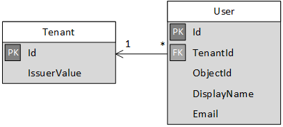

<properties
   pageTitle="Inscrição e integração em vários locatários aplicativos de locatários | Microsoft Azure"
   description="Como locatários integrados em um aplicativo de vários locatários"
   services=""
   documentationCenter="na"
   authors="MikeWasson"
   manager="roshar"
   editor=""
   tags=""/>

<tags
   ms.service="guidance"
   ms.devlang="dotnet"
   ms.topic="article"
   ms.tgt_pltfrm="na"
   ms.workload="na"
   ms.date="05/23/2016"
   ms.author="mwasson"/>

# <a name="sign-up-and-tenant-onboarding-in-a-multitenant-application"></a>Inscrição e integração em um aplicativo de vários locatários de locatários

[AZURE.INCLUDE [pnp-header](../../includes/guidance-pnp-header-include.md)]

Este artigo é [parte de uma série]. Há também um [aplicativo de exemplo] completo que acompanha esta série.

Este artigo descreve como implementar uma _inscrição_ processo em um aplicativo de vários locatário, que permite que um cliente para se inscrever em sua organização para o seu aplicativo.
Há vários motivos para implementar um processo de inscrição:

-   Permitir que um administrador do AD para consentimento para toda a organização do cliente a usar o aplicativo.
-   Colete pagamento de cartão de crédito ou outras informações de clientes.
-   Execute qualquer instalação de locatário de uso único necessitada para seu aplicativo.

## <a name="admin-consent-and-azure-ad-permissions"></a>Consentimento de administrador e permissões do Azure AD

Para autenticar com o Azure AD, um aplicativo precisa acessar o diretório do usuário. No mínimo, o aplicativo precisa permissão para ler o perfil do usuário. A primeira vez que um usuário entra, Azure AD mostra uma página de autorização que mostra as permissões que está sendo solicitadas. Clicando em **Aceitar**, o usuário concede permissão para o aplicativo.

Por padrão, consentimento é concedido por usuário. Cada usuário que entrarem nele vê a página de autorização. No entanto, o Azure AD também suporta _consentimento de administrador_, que permite que o administrador AD consentimento para uma organização inteira.

Quando o fluxo de consentimento administração é usado, a página de autorização informa que o administrador do AD está concedendo permissão em nome de todos os inquilinos:


Depois que o administrador clicar em **Aceitar**, outros usuários no mesmo locatário podem entrar e Azure AD irá ignorar a tela de consentimento.

Somente um administrador do AD pode dar consentimento de administração, como ele concede permissão em nome de toda a organização. Se um não-administrador tenta autenticar com o fluxo de consentimento admin, o Azure AD exibirá um erro:


Se o aplicativo exigir permissões adicionais posteriormente, o cliente precisará inscrever novamente e concorda com as permissões atualizadas.  

## <a name="implementing-tenant-sign-up"></a>Implementando locatário inscrição

Para as [Pesquisas de Tailspin] [ Tailspin] aplicativo, definimos vários requisitos para o processo de inscrição:

-   Um locatário deve se inscrever antes que os usuários possam entrar.
-   Inscrição usa o fluxo de consentimento de administrador.
-   Inscrição adiciona locatário do usuário no banco de dados do aplicativo.
-   Depois de um locatário inscreve, o aplicativo mostra uma página de integração.

Nesta seção, examinaremos nossa implementação do processo de inscrição.
É importante entender que "inscrição" versus "entrada" é um conceito de aplicativo. Durante o fluxo de autenticação, Azure AD não naturalmente saber se o usuário está estão em processo de inscrição. Ele é o aplicativo para controlar o contexto.

Quando um usuário anônimo visita o aplicativo de pesquisas, o usuário é mostrados dois botões, uma para entrar e outra para "registrar sua empresa" (inscrever).


Esses botões chamar ações na classe [AccountController] .

O `SignIn` ação retorna um **ChallegeResult**, que faz com que a middleware OpenID conectar redirecionar para o ponto de extremidade de autenticação. Esta é a maneira padrão de autenticação de disparador no ASP.NET Core 1.0.  

```csharp
[AllowAnonymous]
public IActionResult SignIn()
{
    return new ChallengeResult(
        OpenIdConnectDefaults.AuthenticationScheme,
        new AuthenticationProperties
        {
            IsPersistent = true,
            RedirectUri = Url.Action("SignInCallback", "Account")
        });
}
```

Agora compare a `SignUp` ação:

```csharp
[AllowAnonymous]
public IActionResult SignUp()
{
    // Workaround for https://github.com/aspnet/Security/issues/546
    HttpContext.Items.Add("signup", "true");

    var state = new Dictionary<string, string> { { "signup", "true" }};
    return new ChallengeResult(
        OpenIdConnectDefaults.AuthenticationScheme,
        new AuthenticationProperties(state)
        {
            RedirectUri = Url.Action(nameof(SignUpCallback), "Account")
        });
}
```

Como `SignIn`, o `SignUp` ação também retorna um `ChallengeResult`. Mas desta vez, vamos adicionar um pedaço de informações de estado para o `AuthenticationProperties` no `ChallengeResult`:

-   inscrição: um sinalizador booliano, indicando que o usuário iniciou o processo de inscrição.

As informações de estado no `AuthenticationProperties` é adicionada ao parâmetro de [estado] OpenID conectar, que arredondar viagens durante o fluxo de autenticação.


Depois que o usuário autentica no Azure AD e é redirecionado volta para o aplicativo, a permissão de autenticação contém o estado. Estamos usando esse fato para certificar-se de que o valor de "inscrição" persiste entre o fluxo de autenticação inteiros.

## <a name="adding-the-admin-consent-prompt"></a>Adicionando o prompt de consentimento do administrador

No Azure AD, o fluxo de consentimento administração é disparado, adicionando um parâmetro de "aviso" para a cadeia de caracteres de consulta na solicitação de autenticação:

```
/authorize?prompt=admin_consent&...
```

O aplicativo de pesquisas adiciona o prompt durante o `RedirectToAuthenticationEndpoint` evento. Este evento é chamado direita antes do middleware redireciona para o ponto de extremidade de autenticação.

```csharp
public override Task RedirectToAuthenticationEndpoint(RedirectContext context)
{
    if (context.IsSigningUp())
    {
        context.ProtocolMessage.Prompt = "admin_consent";
    }

    _logger.RedirectToIdentityProvider();
    return Task.FromResult(0);
}
```

> [AZURE.NOTE] Consulte [SurveyAuthenticationEvents.cs].

Definindo` ProtocolMessage.Prompt` informa o middleware para adicionar o parâmetro de "aviso" à solicitação de autenticação.

Observe que o prompt só é necessária durante a inscrição. Entrar regular não deve inclui-lo. Para distinguir entre elas, podemos verificar o `signup` valor no estado de autenticação. Esta condição verifica o seguinte método de extensão:

```csharp
internal static bool IsSigningUp(this BaseControlContext context)
{
    Guard.ArgumentNotNull(context, nameof(context));

    string signupValue;
    object obj;
    // Check the HTTP context and convert to string
    if (context.HttpContext.Items.TryGetValue("signup", out obj))
    {
        signupValue = (string)obj;
    }
    else
    {
        // It's not in the HTTP context, so check the authentication ticket.  If it's not there, we aren't signing up.
        if ((context.AuthenticationTicket == null) ||
            (!context.AuthenticationTicket.Properties.Items.TryGetValue("signup", out signupValue)))
        {
            return false;
        }
    }

    // We have found the value, so see if it's valid
    bool isSigningUp;
    if (!bool.TryParse(signupValue, out isSigningUp))
    {
        // The value for signup is not a valid boolean, throw                
        throw new InvalidOperationException($"'{signupValue}' is an invalid boolean value");
    }

    return isSigningUp;
}
```

> [AZURE.NOTE] Consulte [BaseControlContextExtensions.cs].

> [AZURE.NOTE] Observação: Este código inclui uma solução alternativa para um bug conhecido no ASP.NET Core 1.0 RC1. No `RedirectToAuthenticationEndpoint` evento, não há nenhuma maneira de obter as propriedades de autenticação que contém o estado de "inscrição". Como alternativa, o `AccountController.SignUp` método também coloca o estado de "inscrição" para o `HttpContext`. Isso funciona porque `RedirectToAuthenticationEndpoint` acontece antes de redirecionar, portanto, ainda temos a mesma `HttpContext`.

## <a name="registering-a-tenant"></a>Registrar um locatário

O aplicativo de pesquisas armazena algumas informações sobre cada locatário e usuário do banco de dados do aplicativo.



Na tabela locatário, IssuerValue é o valor da declaração emissor do locatário. Azure AD, isso é `https://sts.windows.net/<tentantID>` e fornece um valor exclusivo por locatário.

Quando um novo locatário inscreve, o aplicativo de pesquisas grava um registro de locatário ao banco de dados. Isso acontece dentro do `AuthenticationValidated` evento. (Não faça isso antes deste evento, porque o token de ID não ser validado ainda, para que você não pode confiar os valores de declaração. Consulte [autenticação].

Aqui está o código relevante do aplicativo de pesquisas:

```csharp
public override async Task AuthenticationValidated(AuthenticationValidatedContext context)
{
    var principal = context.AuthenticationTicket.Principal;
    var userId = principal.GetObjectIdentifierValue();
    var tenantManager = context.HttpContext.RequestServices.GetService<TenantManager>();
    var userManager = context.HttpContext.RequestServices.GetService<UserManager>();
    var issuerValue = principal.GetIssuerValue();
    _logger.AuthenticationValidated(userId, issuerValue);

    // Normalize the claims first.
    NormalizeClaims(principal);
    var tenant = await tenantManager.FindByIssuerValueAsync(issuerValue)
        .ConfigureAwait(false);

    if (context.IsSigningUp())
    {
        // Originally, we were checking to see if the tenant was non-null, however, this would not allow
        // permission changes to the application in AAD since a re-consent may be required.  Now we just don't
        // try to recreate the tenant.
        if (tenant == null)
        {
            tenant = await SignUpTenantAsync(context, tenantManager)
                .ConfigureAwait(false);
        }

        // In this case, we need to go ahead and set up the user signing us up.
        await CreateOrUpdateUserAsync(context.AuthenticationTicket, userManager, tenant)
            .ConfigureAwait(false);
    }
    else
    {
        if (tenant == null)
        {
            _logger.UnregisteredUserSignInAttempted(userId, issuerValue);
            throw new SecurityTokenValidationException($"Tenant {issuerValue} is not registered");
        }

        await CreateOrUpdateUserAsync(context.AuthenticationTicket, userManager, tenant)
            .ConfigureAwait(false);
    }
}
```

> [AZURE.NOTE] Consulte [SurveyAuthenticationEvents.cs].

Este código faz o seguinte:

1.  Verifique se o valor de emissor do locatário já está no banco de dados. Se o locatário não se inscreveu, `FindByIssuerValueAsync` retorna null.
2.  Se o usuário está se inscrevendo:
  1.    Adicionar o locatário ao banco de dados (`SignUpTenantAsync`).
  2.    Adicionar o usuário autenticado ao banco de dados (`CreateOrUpdateUserAsync`).
3.  Caso contrário, conclua o fluxo de entrada normal:
  1.    Se emissor do locatário não foi encontrado no banco de dados, significa que o locatário não está registrado e o cliente precisa inscrever-se. Nesse caso, lança uma exceção para fazer com que a autenticação falha.
  2.    Caso contrário, crie um registro de banco de dados para esse usuário, se não houver um já (`CreateOrUpdateUserAsync`).

Veja aqui o método de [SignUpTenantAsync] que adiciona o locatário ao banco de dados.

```csharp
private async Task<Tenant> SignUpTenantAsync(BaseControlContext context, TenantManager tenantManager)
{
    Guard.ArgumentNotNull(context, nameof(context));
    Guard.ArgumentNotNull(tenantManager, nameof(tenantManager));

    var principal = context.AuthenticationTicket.Principal;
    var issuerValue = principal.GetIssuerValue();
    var tenant = new Tenant
    {
        IssuerValue = issuerValue,
        Created = DateTimeOffset.UtcNow
    };

    try
    {
        await tenantManager.CreateAsync(tenant)
            .ConfigureAwait(false);
    }
    catch(Exception ex)
    {
        _logger.SignUpTenantFailed(principal.GetObjectIdentifierValue(), issuerValue, ex);
        throw;
    }

    return tenant;
}
```

Aqui está um resumo do fluxo de inscrição inteiro no aplicativo pesquisas:

1.  O usuário clica no botão **Inscrever-se** .
2.  O `AccountController.SignUp` ação retorna um resultado de challege.  O estado de autenticação inclui o valor de "inscrição".
3.  No `RedirectToAuthenticationEndpoint` evento, adicione o `admin_consent` prompt.
4.  A middleware OpenID conectar redireciona para Azure AD e a autenticação do usuário.
5.  No `AuthenticationValidated` evento, procure o estado de "inscrição".
6.  Adicione o locatário ao banco de dados.

## <a name="next-steps"></a>Próximas etapas

- Leia o próximo artigo desta série: [funções do aplicativo em aplicativos vários locatários][app roles]


<!-- Links -->
[app roles]: guidance-multitenant-identity-app-roles.md
[Tailspin]: guidance-multitenant-identity-tailspin.md
[parte de uma série]: guidance-multitenant-identity.md
[AccountController]: https://github.com/Azure-Samples/guidance-identity-management-for-multitenant-apps/blob/master/src/Tailspin.Surveys.Web/Controllers/AccountController.cs
[estado]: http://openid.net/specs/openid-connect-core-1_0.html#AuthRequest
[SurveyAuthenticationEvents.cs]: https://github.com/Azure-Samples/guidance-identity-management-for-multitenant-apps/blob/master/src/Tailspin.Surveys.Web/Security/SurveyAuthenticationEvents.cs
[BaseControlContextExtensions.cs]: https://github.com/Azure-Samples/guidance-identity-management-for-multitenant-apps/blob/master/src/Tailspin.Surveys.Web/Security/BaseControlContextExtensions.cs
[Autenticação]: guidance-multitenant-identity-authenticate.md
[SignUpTenantAsync]: https://github.com/Azure-Samples/guidance-identity-management-for-multitenant-apps/blob/master/src/Tailspin.Surveys.Web/Security/SurveyAuthenticationEvents.cs
[exemplo de aplicativo]: https://github.com/Azure-Samples/guidance-identity-management-for-multitenant-apps
