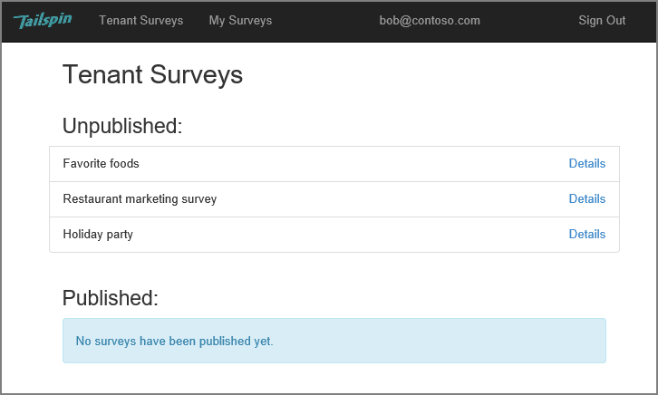

<properties
   pageTitle="Sobre o aplicativo de pesquisas de Tailspin | Microsoft Azure"
   description="Visão geral do aplicativo de pesquisas Tailspin"
   services=""
   documentationCenter="na"
   authors="MikeWasson"
   manager="roshar"
   editor=""
   tags=""/>

<tags
   ms.service="guidance"
   ms.devlang="dotnet"
   ms.topic="article"
   ms.tgt_pltfrm="na"
   ms.workload="na"
   ms.date="05/23/2016"
   ms.author="mwasson"/>

# Sobre o aplicativo de Tailspin pesquisas

[AZURE.INCLUDE [pnp-header](../../includes/guidance-pnp-header-include.md)]

Este artigo é [parte de uma série]. Há também um [aplicativo de exemplo] completo que acompanha esta série.

Tailspin é uma empresa fictícia que está desenvolvendo um aplicativo de SaaS chamado pesquisas. Este aplicativo permite que organizações criar e publicar pesquisas onlinehttps.

- Uma organização pode se inscrever para o aplicativo.
- Depois que a empresa esteja inscrita, os usuários poderão entrar no aplicativo com suas credenciais organizacionais.
- Os usuários podem criar, editar e publicar pesquisas.

> [AZURE.NOTE] Para começar a usar o aplicativo, consulte [executando o aplicativo de pesquisas].

## Os usuários podem criar, editar e exibir pesquisas

Um usuário autenticado pode exibir todas as pesquisas que ele ou ela criou ou tem direitos de Colaborador para e criar novas pesquisas. Observe que o usuário estiver conectado com sua identidade organizacional, `bob@contoso.com`.

Esta captura de tela mostra a página Editar pesquisa:

Os usuários também podem exibir qualquer pesquisas criadas por outros usuários no mesmo locatário.

## Proprietários de pesquisa podem convidar colaboradores

Quando um usuário cria uma pesquisa, ele ou ela pode convidar outras pessoas como colaboradores na pesquisa. Os colaboradores podem editar a pesquisa, mas não é possível excluir ou publicá-lo.  

Um usuário pode adicionar colaboradores de outros locatários, que permite a cruz locatário compartilhamento de recursos. Esta captura de tela, Paulo (`bob@contoso.com`) está adicionando Alice (`alice@fabrikam.com`) como um colaborador uma pesquisa que Paulo criado.

Quando Alice fizer logon, ela vê a pesquisa listada em "Posso podem contribuir para pesquisas".

Observe que Alice entra no próprio locatário, não como um convidado do locatário Contoso. Alice tem permissões de Colaborador somente para pesquisa &mdash; ela não é possível exibir outras pesquisas de locatário de Contoso.

## Arquitetura

O aplicativo de pesquisas consiste em um web front-end e um web API back-end. Ambos são implementados usando [ASP.NET Core 1.0].

O aplicativo web usa Azure Active Directory (AD Azure) para autenticar usuários. O aplicativo web também chama Azure AD para obter tokens de acesso OAuth 2 para a API da Web. Tokens de acesso são armazenados em Cache relacionada do Azure. O cache permite várias instâncias compartilhar o mesmo cache de token (por exemplo, em um farm de servidores).

## Próximas etapas

- Leia o próximo artigo desta série: [autenticação nos aplicativos vários locatários, usando o Active Directory do Azure e OpenID conectar][authentication]

<!-- Links -->

[authentication]: guidance-multitenant-identity-authenticate.md
[parte de uma série]: guidance-multitenant-identity.md
[Executando o aplicativo de pesquisas]: https://github.com/Azure-Samples/guidance-identity-management-for-multitenant-apps/blob/master/docs/running-the-app.md
[Principais do ASP.NET 1.0]: https://docs.asp.net/en/latest/
[exemplo de aplicativo]: https://github.com/Azure-Samples/guidance-identity-management-for-multitenant-apps
