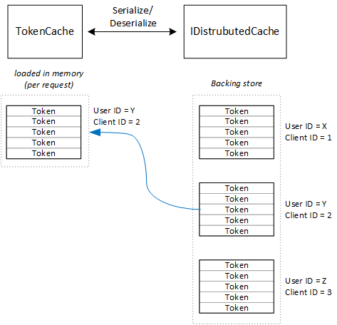

<properties
   pageTitle="Cache tokens de acesso em um aplicativo de vários locatários | Microsoft Azure"
   description="Cache tokens de acesso usados para chamar um Web API de back-end"
   services=""
   documentationCenter="na"
   authors="MikeWasson"
   manager="roshar"
   editor=""
   tags=""/>

<tags
   ms.service="guidance"
   ms.devlang="dotnet"
   ms.topic="article"
   ms.tgt_pltfrm="na"
   ms.workload="na"
   ms.date="02/16/2016"
   ms.author="mwasson"/>


# <a name="caching-access-tokens-in-a-multitenant-application"></a>Cache tokens de acesso em um aplicativo de vários locatários

[AZURE.INCLUDE [pnp-header](../../includes/guidance-pnp-header-include.md)]

Este artigo é [parte de uma série]. Há também um [aplicativo de exemplo] completo que acompanha esta série.

É relativamente caro obter um acesso OAuth token, porque ela requer uma solicitação HTTP para o ponto de extremidade de token. Portanto, é bom tokens de cache sempre que possível. A [Biblioteca de autenticação do Azure AD] [ ADAL] (ADAL) automaticamente armazena tokens obtidas do Azure AD, incluindo tokens de atualização.

ADAL fornece uma implementação de cache de token padrão. Entretanto, esse cache token destina-se a aplicativos cliente nativo e é _não_ adequado para aplicativos web:

-   É uma instância estática e thread não confiável.
-   Ele não dimensionar para um grande número de usuários, pois tokens de todos os usuários ir para o mesmo dicionário.
-   Ele não pode ser compartilhado entre servidores web em um farm.

Em vez disso, você deve implementar um cache de token personalizado que deriva o ADAL `TokenCache` classe mas é adequado para um ambiente de servidor e fornece o desejável nível de isolamento entre tokens para usuários diferentes.

O `TokenCache` classe armazena um dicionário de tokens, indexados pelo emissor, recurso, ID do cliente e usuário. Um cache de token personalizado deve gravar esse dicionário um armazenamento de backup, como um cache relacionada.

No aplicativo Tailspin pesquisas, o `DistributedTokenCache` classe implementa o cache de token. Essa implementação usa a [IDistributedCache] [ distributed-cache] abstração do ASP.NET Core 1.0. Dessa maneira, qualquer `IDistributedCache` implementação pode ser usada como um armazenamento de backup.

-   Por padrão, o aplicativo de pesquisas usa um cache relacionada.
-   Para um servidor web de instância única, você poderá usar o [cache de memória]do ASP.NET Core 1.0[in-memory-cache]. (Isso também é uma boa opção para executar o aplicativo localmente durante o desenvolvimento.)

> [AZURE.NOTE] Atualmente o cache relacionada não há suporte para .NET Core.

`DistributedTokenCache`armazena os dados do cache como pares de chave/valor no armazenamento de backup. A chave é a ID de usuário mais ID do cliente, para que o armazenamento de backup mantém os dados de cache separadas para cada combinação exclusiva de cliente/usuário.



Armazenamento de backup é dividido pela usuário. Para cada solicitação HTTP, os tokens para esse usuário são ler a partir do armazenamento de apoio e colocado corretamente o `TokenCache` dicionário. Se relacionada é usado como o armazenamento de apoio, cada instância do servidor em um farm de servidor leituras/gravações para o mesmo cache e escalas dessa abordagem para vários usuários.

## <a name="encrypting-cached-tokens"></a>Criptografar tokens em cache

Tokens são dados confidenciais, pois eles conceder acesso aos recursos de um usuário. (Além disso, ao contrário de senha de um usuário, você não pode apenas armazenar um hash do token.) Portanto, é essencial para proteger os tokens seja comprometido. O cache de reserva relacionada está protegido por senha, mas se alguém obtém a senha, elas poderiam receberão todos os tokens de acesso em cache. Por que motivo, a `DistributedTokenCache` criptografa tudo o que ele grava ao armazenamento de backup. Criptografia é feita usando a [proteção de dados] do ASP.NET Core 1.0[ data-protection] APIs.

> [AZURE.NOTE] Se você implantar para Sites do Azure, as chaves de criptografia são copiadas para o armazenamento de rede e sincronizadas em todas as máquinas (consulte [Gerenciamento de chave][key-management]). Por padrão, as chaves não são criptografadas durante a execução em Sites do Azure, mas você pode [Habilitar a criptografia usando um certificado x. 509][x509-cert-encryption].


## <a name="distributedtokencache-implementation"></a>Implementação de DistributedTokenCache

O [DistributedTokenCache] [ DistributedTokenCache] classe deriva o ADAL [TokenCache] [ tokencache-class] classe.

No construtor, a `DistributedTokenCache` classe cria uma chave para o usuário atual e carrega o cache de armazenamento de backup:

```csharp
public DistributedTokenCache(
    ClaimsPrincipal claimsPrincipal,
    IDistributedCache distributedCache,
    ILoggerFactory loggerFactory,
    IDataProtectionProvider dataProtectionProvider)
    : base()
{
    _claimsPrincipal = claimsPrincipal;
    _cacheKey = BuildCacheKey(_claimsPrincipal);
    _distributedCache = distributedCache;
    _logger = loggerFactory.CreateLogger<DistributedTokenCache>();
    _protector = dataProtectionProvider.CreateProtector(typeof(DistributedTokenCache).FullName);
    AfterAccess = AfterAccessNotification;
    LoadFromCache();
}
```

A chave é criada concatenando a ID de usuário e a ID do cliente. Ambos estão tirados de declarações encontradas do usuário `ClaimsPrincipal`:

```csharp
private static string BuildCacheKey(ClaimsPrincipal claimsPrincipal)
{
    string clientId = claimsPrincipal.FindFirstValue("aud", true);
    return string.Format(
        "UserId:{0}::ClientId:{1}",
        claimsPrincipal.GetObjectIdentifierValue(),
        clientId);
}
```

Para carregar os dados do cache, leia o blob serializado do armazenamento de backup e chamada `TokenCache.Deserialize` para converter o blob em cache de dados.

```csharp
private void LoadFromCache()
{
    byte[] cacheData = _distributedCache.Get(_cacheKey);
    if (cacheData != null)
    {
        this.Deserialize(_protector.Unprotect(cacheData));
    }
}
```

Sempre que ADAL acessar o cache, ele aciona uma `AfterAccess` evento. Se os dados do cache foi alterado, o `HasStateChanged` propriedade é verdadeira. Nesse caso, atualize o armazenamento de apoio para refletir a alteração e defina `HasStateChanged` como false.

```csharp
public void AfterAccessNotification(TokenCacheNotificationArgs args)
{
    if (this.HasStateChanged)
    {
        try
        {
            if (this.Count > 0)
            {
                _distributedCache.Set(_cacheKey, _protector.Protect(this.Serialize()));
            }
            else
            {
                // There are no tokens for this user/client, so remove the item from the cache.
                _distributedCache.Remove(_cacheKey);
            }
            this.HasStateChanged = false;
        }
        catch (Exception exp)
        {
            _logger.WriteToCacheFailed(exp);
            throw;
        }
    }
}
```

TokenCache envia dois outros eventos:

- `BeforeWrite`. Chamado imediatamente antes ADAL grava o cache. Você pode usar isso para implementar uma estratégia de concorrência
- `BeforeAccess`. Chamado imediatamente antes ADAL lê do cache. Aqui você pode recarregar o cache para obter a versão mais recente.

Em nosso caso, estamos decidiu não lidar com esses dois eventos.

- Para concorrência, última escreva wins. É Okey, porque tokens são armazenadas independentemente para cada usuário + cliente, para que um conflito só pode acontecer se o mesmo usuário tinha duas sessões de login simultâneas.
- Para leitura, podemos carregar o cache em cada solicitação. Solicitações são vida curta. Se o cache obtém modificado no momento, a próxima solicitação selecionará o novo valor.

## <a name="next-steps"></a>Próximas etapas

- Leia o próximo artigo desta série: [Federating com AD FS de um cliente para aplicativos vários locatários no Azure][adfs]

<!-- links -->
[ADAL]: https://msdn.microsoft.com/library/azure/jj573266.aspx
[adfs]: guidance-multitenant-identity-adfs.md
[data-protection]: https://docs.asp.net/en/latest/security/data-protection/index.html
[distributed-cache]: https://docs.asp.net/en/latest/fundamentals/distributed-cache.html
[DistributedTokenCache]: https://github.com/Azure-Samples/guidance-identity-management-for-multitenant-apps/blob/master/src/Tailspin.Surveys.TokenStorage/DistributedTokenCache.cs
[key-management]: https://docs.asp.net/en/latest/security/data-protection/configuration/default-settings.html
[in-memory-cache]: https://docs.asp.net/en/latest/fundamentals/caching.html
[tokencache-class]: https://msdn.microsoft.com/library/azure/microsoft.identitymodel.clients.activedirectory.tokencache.aspx
[x509-cert-encryption]: https://docs.asp.net/en/latest/security/data-protection/implementation/key-encryption-at-rest.html#x-509-certificate
[parte de uma série]: guidance-multitenant-identity.md
[exemplo de aplicativo]: https://github.com/Azure-Samples/guidance-identity-management-for-multitenant-apps
