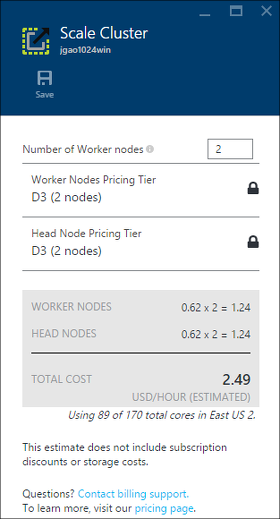
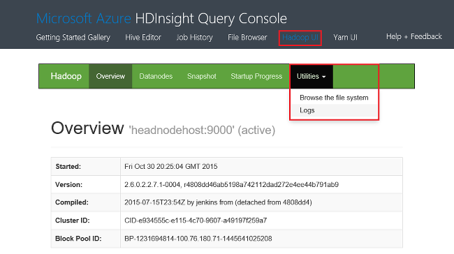

<properties
    pageTitle="Gerenciar clusters Hadoop em HDInsight usando o portal de Azure | Microsoft Azure"
    description="Saiba como administrar HDInsight Service. Criar um cluster de HDInsight, abra o console do JavaScript interativo e abra o console de comando do Hadoop."
    services="hdinsight"
    documentationCenter=""
    tags="azure-portal"
    authors="mumian"
    manager="jhubbard"
    editor="cgronlun"/>

<tags
    ms.service="hdinsight"
    ms.workload="big-data"
    ms.tgt_pltfrm="na"
    ms.devlang="na"
    ms.topic="article"
    ms.date="09/14/2016"
    ms.author="jgao"/>

# Gerenciar clusters Hadoop em HDInsight usando o portal do Azure

[AZURE.INCLUDE [selector](../../includes/hdinsight-portal-management-selector.md)]

Usando o [portal do Azure][azure-portal], você pode criar clusters Hadoop no Azure HDInsight, alterar senha de usuário do Hadoop e habilitar o protocolo de área de trabalho remota (RDP) para poder acessar o console de comando do Hadoop no cluster.

As informações neste artigo se aplica somente clusters baseados em janela HDInsight. Para obter informações sobre como gerenciar clusters baseados em Linux, clique no seletor de tabulação acima.

Clique no seletor de tabulação para obter informações sobre como criar clusters Hadoop em HDInsight usando outras ferramentas. 

**Pré-requisitos**

Antes de começar este artigo, você deve ter o seguinte:

- **Assinatura de um Azure**. Consulte [avaliação gratuita do Azure obter](https://azure.microsoft.com/documentation/videos/get-azure-free-trial-for-testing-hadoop-in-hdinsight/).
- **Conta de armazenamento do azure** - HDInsight um cluster usa um contêiner de armazenamento de Blob do Azure como o sistema de arquivo padrão. Para obter mais informações sobre como o armazenamento de Blob do Azure fornece uma experiência perfeita com clusters de HDInsight, consulte [Usar armazenamento de Blob Azure com HDInsight](hdinsight-hadoop-use-blob-storage.md). Para obter detalhes sobre como criar uma conta de armazenamento do Azure, veja [como criar uma conta de armazenamento](../storage/storage-create-storage-account.md).

##Abra o Portal

1. Entrar no [https://portal.azure.com](https://portal.azure.com).
2. Após abrir o portal, você pode:

    - Clique em **novo** no menu à esquerda para criar um novo cluster:
    
        
    - Clique em **Clusters de HDInsight** no menu à esquerda.
    
        

    Se **HDInsight** não aparecer no menu à esquerda, clique em **Procurar**. 

    

##Criar clusters

Para as instruções de criação usando o Portal, consulte [criar HDInsight clusters](hdinsight-provision-clusters.md#create-using-the-preview-portal).

HDInsight funciona com uma ampla variedade de Hadoop componentes. Para a lista dos componentes que foram verificadas e com suporte, consulte [qual versão do Hadoop está em Azurehdinsight](hdinsight-component-versioning.md). Você pode personalizar HDInsight usando uma das seguintes opções:

- Use a ação de Script para executar scripts personalizados que podem personalizar um cluster para alterar a configuração de cluster ou instalar componentes personalizados como Giraph ou Solr. Para obter mais informações, consulte [Personalizar HDInsight cluster usando a ação de Script](hdinsight-hadoop-customize-cluster.md).
- Use os parâmetros de personalização de cluster no HDInsight .NET SDK ou Azure PowerShell durante a criação de cluster. Essas alterações de configuração, em seguida, são preservadas por meio de vida útil do cluster e não são afetadas por reimages de nó de cluster que realiza periodicamente a plataforma Windows Azure para manutenção. Para obter mais informações sobre como usar os parâmetros de personalização de cluster, consulte [clusters de criar HDInsight](hdinsight-provision-clusters.md).
- Alguns componentes Java nativos, como Mahout e em cascata, podem ser executados no cluster como arquivos JAR. Esses arquivos JAR podem ser distribuídos ao armazenamento de Blob do Azure e enviados a HDInsight clusters através de mecanismos de envio de trabalho do Hadoop. Para obter mais informações, consulte [Enviar Hadoop trabalhos programaticamente](hdinsight-submit-hadoop-jobs-programmatically.md).

    >[AZURE.NOTE] Se você tiver problemas para HDInsight clusters implantar arquivos JAR ou chamar arquivos JAR em clusters de HDInsight, contate o [Suporte da Microsoft](https://azure.microsoft.com/support/options/).

    > Em cascata não é suportado pelo HDInsight e não está qualificado para o Microsoft Support. Listas de componentes com suporte, consulte [Novidades nas versões cluster fornecidas pelo HDInsight?](hdinsight-component-versioning.md).

Não há suporte para a instalação do software personalizado em cluster usando a Conexão de área de trabalho remota. Evite armazenar todos os arquivos nas unidades do nó principal, como elas serão perdidas se você precisar recriar os clusters. É recomendável armazenar arquivos de armazenamento de Blob do Azure. Armazenamento de blob é persistente.

##Listar e mostrar clusters

1. Entrar no [https://portal.azure.com](https://portal.azure.com).
2. Clique em **Clusters de HDInsight** no menu à esquerda.
3. Clique no nome de cluster. Se a lista de cluster for longa, você pode usar o filtro no topo da página.
4. Clique duas vezes em um cluster da lista para mostrar os detalhes.

    **Menu e essentials**:

    
    
    - Para personalizar o menu, clique com botão direito em qualquer lugar no menu e clique em **Personalizar**.
    - **Configurações** e **Todas as configurações**: exibe a lâmina de **configurações** para o cluster, que permite que você acesse informações detalhadas de configuração para o cluster.
    - URL do **painel**, **Painel de controle de Cluster** e **: estas são todas as maneiras de acessar o painel de cluster, que é Ambari Web para clusters baseados em Linux. - **Secure Shell * *: mostra as instruções para conectar-se ao cluster usando conexão SSH (Secure Shell).
    - **Cluster de escala**: permite que você altere o número de nós de trabalho para esse cluster.
    - **Excluir**: exclui o cluster.
    - **Início rápido ()**: exibe as informações que ajudarão você a começar a usar o HDInsight.
    - **Usuários ()**: permite que você defina permissões para _gerenciamento de portal_ desse cluster para outros usuários na sua assinatura do Azure.
    
        > [AZURE.IMPORTANT] Este _só_ afeta as permissões para esse cluster no portal do Azure e acesso e não tem efeito sobre quem pode se conectar ao ou enviar trabalhos ao cluster HDInsight.
    - **Marcas ()**: marcas permite que você defina pares de chave/valor para definir uma taxonomia personalizada dos seus serviços de nuvem. Por exemplo, você pode criar uma chave chamada __project__e, em seguida, use um valor em comum para todos os serviços associados a um projeto específico.
    - **Modos de exibição de Ambari**: Links Ambari Web.
    
    > [AZURE.IMPORTANT] Para gerenciar os serviços fornecidos pelo cluster HDInsight, você deve usar Ambari Web ou a API REST Ambari. Para obter mais informações sobre como usar o Ambari, consulte [Gerenciar HDInsight clusters usando Ambari](hdinsight-hadoop-manage-ambari.md).

    **Uso**:
    
    
    
5. Clique em **configurações**.

    

    - **Propriedades**: exibir as propriedades de cluster.
    - **Cluster AAD identidade**: 
    - **Teclas de armazenamento do Azure**: exibir a conta de armazenamento padrão e sua chave. A conta de armazenamento é configuração durante o processo de criação de cluster.
    - **Cluster Login**: alterar o nome de usuário de cluster HTTP e a senha.
    - **Metastores externo**: exibir a seção e Oozie metastores. O metastores só pode ser configurado durante o processo de criação de cluster.
    - **Cluster de escala**: aumentar e diminuir o número de nós de operador de cluster.
    - **Área de trabalho remota**: habilitar e desabilitar o acesso de área de trabalho remota (RDP) e configurar o nome de usuário RDP.  O nome de usuário RDP deve ser diferente do nome de usuário HTTP.
    - **Parceiro de registro**:
    
    > [AZURE.NOTE] Esta é uma lista genérica configurações disponíveis; nem todos eles serão apresentar para todos os tipos de cluster.

6. Clique em **Propriedades**:

    Propriedades lista o seguinte:
    
    - **Hostname**: nome do Cluster.
    - **URL do cluster**.
    - **Status**: incluir interrompida, aceita, ClusterStorageProvisioned, AzureVMConfiguration, HDInsightConfiguration, operacional, executando, erro, excluindo, excluído, Timedout, DeleteQueued, DeleteTimedout, DeleteError, PatchQueued, CertRolloverQueued, ResizeQueued, ClusterCustomization
    - **Região**: Azure local. Para obter uma lista dos locais Azure com suporte, consulte a caixa de listagem suspensa **região** no [HDInsight preços](https://azure.microsoft.com/pricing/details/hdinsight/).
    - **Dados criados**.
    - **Sistema operacional**: O **Windows** ou **Linux**.
    - **Tipo**: Hadoop, HBase, tempestade, gerar. 
    - **Versão**. Consulte [versões de HDInsight](hdinsight-component-versioning.md)
    - **Assinatura**: nome da assinatura.
    - **ID da assinatura**.
    - **Fonte de dados principal**. A conta de armazenamento de Blob do Azure usada como o sistema de arquivo Hadoop padrão.
    - **Nós de trabalhador preços camada**.
    - **Nível de preço de nó de cabeça**.

##Excluir clusters

Excluir um cluster não irá excluir a conta de armazenamento do padrão ou todas as contas de armazenamento vinculado. Você pode recriar o cluster usando as mesmas contas de armazenamento e o mesmo metastores.

1. Entre [Portal][azure-portal].
2. Clique em **Procurar tudo** no menu à esquerda, clique em **Clusters de HDInsight**nome do seu cluster.
3. Clique em **Excluir** no menu superior e siga as instruções.

Consulte também [Pausar/desligar clusters](#pauseshut-down-clusters).

##Clusters de escala
O cluster dimensionamento recurso permite que você altere o número de nós de trabalho usado por um cluster que é executado em Azurehdinsight sem precisar recriar o cluster.

>[AZURE.NOTE] Somente clusters com HDInsight versão 3.1.3 ou superior são suportadas. Se você não tiver certeza da versão do seu cluster, você pode verificar a página de propriedades.  Consulte [clusters de lista e mostrar](#list-and-show-clusters).

O impacto das alterando o número de nós de dados para cada tipo de cluster suportado pelo HDInsight:

- Hadoop

    Perfeita, você pode aumentar o número de nós de trabalho em um cluster de Hadoop que está em execução sem afetar os trabalhos em execução ou pendentes. Novos trabalhos também podem ser enviados enquanto a operação está em andamento. Falhas em uma operação de dimensionamento normalmente são tratadas de forma que o cluster sempre seja deixado em um estado funcional.

    Quando um cluster de Hadoop será dimensionado para baixo, reduzindo o número de nós de dados, alguns dos serviços no cluster são reiniciados. Isso faz com que todos funcionando e trabalhos pendentes falha após a conclusão da operação de escala. No entanto, você pode reenviar os trabalhos quando a operação for concluída.

- HBase

    Perfeita, você pode adicionar ou remover nós ao cluster HBase enquanto ele é executado. Servidores regionais são automaticamente equilibrados em poucos minutos de concluir a operação de escala. No entanto, você também manualmente pode comparar os servidores regionais efetuando login a headnode de cluster e executando os seguintes comandos em uma janela do prompt de comando:

        >pushd %HBASE_HOME%\bin
        >hbase shell
        >balancer

    Para obter mais informações sobre como usar o shell de HBase, consulte]
- Tempestade

    Perfeitamente pode adicionar ou remover nós de dados para o seu cluster tempestade enquanto ele é executado. Mas após a conclusão bem-sucedida da operação de escala, você precisará rebalancear a topologia.

    Redistribuição pode ser feito de duas maneiras:

    * Web de tempestade interface do usuário
    * Ferramenta de interface de linha (comando)

    Consulte a [documentação de tempestade Apache](http://storm.apache.org/documentation/Understanding-the-parallelism-of-a-Storm-topology.html) para obter mais detalhes.

    Web tempestade UI está disponível no cluster HDInsight:

    

    Eis um exemplo de como usar o comando CLI para rebalancear a topologia de tempestade:

        ## Reconfigure the topology "mytopology" to use 5 worker processes,
        ## the spout "blue-spout" to use 3 executors, and
        ## the bolt "yellow-bolt" to use 10 executors

        $ storm rebalance mytopology -n 5 -e blue-spout=3 -e yellow-bolt=10

**Dimensionar clusters**

1. Entre [Portal][azure-portal].
2. Clique em **Procurar tudo** no menu à esquerda, clique em **Clusters de HDInsight**nome do seu cluster.
3. Clique em **configurações** no menu superior e, em seguida, clique em **Cluster de escala**.
4. Insira o **número de trabalho nós**. O limite no número de nó de cluster varia entre assinaturas do Azure. Você pode contatar o suporte de cobrança para aumentar o limite.  As informações de custo refletirão as alterações feitas para o número de nós.

    

##Pausar/desligar clusters

A maioria dos trabalhos de Hadoop são trabalhos em lotes que só são executados ocasionalmente. Para a maioria dos clusters do Hadoop, há grandes períodos de tempo que o cluster não está sendo usado para processamento. Com HDInsight, seus dados são armazenados no armazenamento do Azure, assim você pode excluir com segurança um cluster quando ele não está em uso.
Você também cobrado para um cluster de HDInsight, mesmo quando não estiver em uso. Como os encargos para o cluster são muitas vezes mais do que os encargos de armazenamento, faz sentido econômico excluir clusters quando eles não estão em uso.

Há várias maneiras que você pode programar o processo:

- Usuário dados Azure fábrica. Consulte [Serviço vinculado do Azure HDInsight](../data-factory/data-factory-compute-linked-services.md) e [transformação e analisar usando fábrica de dados do Azure](../data-factory/data-factory-data-transformation-activities.md) para serviços de HDInsight vinculado sob demanda e auto definidos.
- Use o PowerShell Azure.  Consulte [os dados de atrasos de voos de análise](hdinsight-analyze-flight-delay-data.md).
- Use CLI Azure. Consulte [Gerenciar HDInsight clusters usando CLI do Azure](hdinsight-administer-use-command-line.md).
- Use o SDK do .NET HDInsight. Consulte [Hadoop enviar trabalhos](hdinsight-submit-hadoop-jobs-programmatically.md).

Para obter informações sobre preços, consulte [HDInsight preços](https://azure.microsoft.com/pricing/details/hdinsight/). Para excluir um cluster no Portal do, consulte [Excluir clusters](#delete-clusters)

##Nome de usuário de cluster de alteração

Um cluster de HDInsight pode ter duas contas de usuário. A conta de usuário de cluster HDInsight é criada durante o processo de criação. Você também pode criar uma conta de usuário RDP para acessar o cluster via RDP. Consulte [Ativar área de trabalho remota](#connect-to-hdinsight-clusters-by-using-rdp).

**Para alterar o nome de usuário de cluster HDInsight e a senha**

1. Entre [Portal][azure-portal].
2. Clique em **Procurar tudo** no menu à esquerda, clique em **Clusters de HDInsight**nome do seu cluster.
3. Clique em **configurações** no menu superior e clique em **Logon de Cluster**.
4. Se **logon de Cluster** tiver sido ativado, você deve clique em **Desabilitar**e clique em **Habilitar** antes de alterar o nome de usuário e senha..
4. Altere o **Nome de Login de Cluster** e/ou a **Senha de logon do Cluster**e clique em **Salvar**.

    

##Acesso de Grant/revoke

HDInsight clusters têm os seguintes serviços de web HTTP (todos esses serviços têm pontos de extremidade RESTful):

- ODBC
- JDBC
- Ambari
- Oozie
- Templeton

Por padrão, esses serviços são concedidos acesso. Você pode revogar/conceder o acesso do portal do Azure.

>[AZURE.NOTE] Por concedendo/revogar o acesso, você irá redefinir cluster nome de usuário e senha.

**Para conceder/revogar o acesso de serviços de web HTTP**

1. Entre [Portal][azure-portal].
2. Clique em **Procurar tudo** no menu à esquerda, clique em **Clusters de HDInsight**nome do seu cluster.
3. Clique em **configurações** no menu superior e clique em **Logon de Cluster**.
4. Se **logon de Cluster** tiver sido ativado, você deve clique em **Desabilitar**e clique em **Habilitar** antes de alterar o nome de usuário e senha..
6. **Nome de usuário de Login de Cluster** e **Senha de logon do Cluster**, digite o novo nome de usuário e senha (respectivamente) para o cluster.
7. Clique em **Salvar**.

    

##Localize a conta de armazenamento padrão

Cada cluster HDInsight possui uma conta de armazenamento padrão. A conta padrão de armazenamento e suas chaves para um cluster é exibido em **configurações**/**Propriedades**/**Chaves de armazenamento do Azure**. Consulte [clusters de lista e mostrar](#list-and-show-clusters).

    
##Localize o grupo de recursos 

No modo do Gerenciador de recursos do Azure, cada cluster HDInsight é criado com um grupo de recursos Azure. O grupo de recursos Azure qual pertence um cluster aparece no:

- A lista de cluster possui uma coluna de **Grupo de recursos** .
- Cluster peças **essenciais** .  

Consulte [clusters de lista e mostrar](#list-and-show-clusters).
   
##Console de consulta de HDInsight aberto

O console de consulta de HDInsight inclui os seguintes recursos:

- **Galeria de Introdução**: para usar a Galeria, consulte [Saiba Hadoop usando a Galeria de Introdução do Azure HDInsight obtendo](hdinsight-learn-hadoop-use-sample-gallery.md).
- **Editor de seção**: interface de web de um gráfica para envio de trabalhos de seção.  Consulte a [seção executar consultas usando o Console de consulta](hdinsight-hadoop-use-hive-query-console.md).

    

- **Histórico de trabalho**: Monitor Hadoop trabalhos.  

    

    Clique no **Nome da consulta** para mostrar os detalhes, incluindo propriedades de trabalho, **A consulta de trabalho**, e * * saída de trabalho. Você também pode baixar a consulta e a saída da sua estação de trabalho.

- **Navegador de arquivos**: procurar a conta de armazenamento padrão e as contas de armazenamento vinculado.

    

    Na captura de tela, o **<Account>** tipo indica o item é uma conta de armazenamento do Azure.  Clique no nome da conta para procurar os arquivos.
    
- **Interface de usuário do Hadoop**.

    
    
    De **Hadoop UI*, você pode procurar arquivos e verifique logs. 

- **Fio colorido de interface do usuário**.

    

##Executar consultas de seção

A seção trabalhos for executado a partir do Portal, clique em **Editor de seção** no console de consulta de HDInsight. Consulte [console de consulta de HDInsight aberta](#open-hdinsight-query-console).

##Trabalhos de monitor

Para monitorar trabalhos a partir do Portal, clique em **Histórico de trabalho** no console de consulta de HDInsight. Consulte [console de consulta de HDInsight aberta](#open-hdinsight-query-console).

##Procurar arquivos

Para procurar arquivos armazenados na conta de armazenamento padrão e as contas de armazenamento vinculado, clique em **Navegador de arquivo** no console de consulta de HDInsight. Consulte [console de consulta de HDInsight aberta](#open-hdinsight-query-console).

Você também pode usar o utilitário **Procurar o sistema de arquivos** da **Interface de usuário do Hadoop** no console de HDInsight.  Consulte [console de consulta de HDInsight aberta](#open-hdinsight-query-console).

##Monitore o uso do cluster

A seção de __uso__ da lâmina cluster HDInsight exibe informações sobre o número de cores disponíveis para sua assinatura para uso com HDInsight, bem como o número de cores alocados para este cluster e como eles são alocados para os nós dentro desse cluster. Consulte [clusters de lista e mostrar](#list-and-show-clusters).

> [AZURE.IMPORTANT] Para monitorar os serviços fornecidos pelo cluster HDInsight, você deve usar Ambari Web ou a API REST Ambari. Para obter mais informações sobre como usar o Ambari, consulte [clusters de gerenciar HDInsight usando Ambari](hdinsight-hadoop-manage-ambari.md)

##Abra a interface de usuário do Hadoop

Para monitorar o cluster, procure o sistema de arquivos e verifique logs, clique em **Interface de usuário do Hadoop** no console de consulta de HDInsight. Consulte [console de consulta de HDInsight aberta](#open-hdinsight-query-console).

##Abra o fio colorido de interface do usuário

Para usar a interface de usuário de fio colorido, clique em **Fio colorido UI** no console de consulta de HDInsight. Consulte [console de consulta de HDInsight aberta](#open-hdinsight-query-console).

##Conectar-se a clusters usando RDP

As credenciais para o cluster que você forneceu na sua criação dar acesso aos serviços no cluster, mas não para o próprio cluster por meio de área de trabalho remota. Você pode ativar o acesso de área de trabalho remota quando você provisionar um cluster ou após um cluster está provisionado. Para obter as instruções sobre como habilitar a área de trabalho remota na criação, consulte [criar HDInsight cluster](hdinsight-provision-clusters.md).

**Para habilitar a área de trabalho remota**

1. Entre [Portal][azure-portal].
2. Clique em **Procurar tudo** no menu à esquerda, clique em **Clusters de HDInsight**nome do seu cluster.
3. Clique em **configurações** no menu superior e clique em **Área de trabalho remota**.
4. Insira **Expira em** **Nome de usuário de Desktop remoto** e **Senha de área de trabalho remota**e clique em **Habilitar**.

    

    Os valores padrão para expira em é uma semana.
> [AZURE.NOTE] Você também pode usar o SDK do .NET HDInsight para habilitar a área de trabalho remota em um cluster. Use o método de **EnableRdp** no objeto de cliente HDInsight da seguinte maneira: **cliente. EnableRdp (clustername, local, "rdpuser", "rdppassword", DateTime.Now.AddDays(6))**. Da mesma forma, para desabilitar a área de trabalho remota no cluster, você pode usar o cliente de **. DisableRdp (clustername, local)**. Para obter mais informações sobre esses métodos, consulte [Referência de SDK do .NET HDInsight](http://go.microsoft.com/fwlink/?LinkId=529017). Isso é aplicável somente para clusters de HDInsight em execução no Windows.

**Para se conectar a um cluster usando RDP**

1. Entre [Portal][azure-portal].
2. Clique em **Procurar tudo** no menu à esquerda, clique em **Clusters de HDInsight**nome do seu cluster.
3. Clique em **configurações** no menu superior e clique em **Área de trabalho remota**.
4. Clique em **Conectar** e siga as instruções. Se conectar está desabilitado, você deve habilitá-lo primeiro. Certifique-se de usar o nome de usuário de área de trabalho remota e senha.  Você não pode usar as credenciais de usuário de Cluster.

##Abrir a linha de comando do Hadoop

Para conectar-se ao cluster usando a área de trabalho remota e usar a linha de comando do Hadoop, você deve primeiro habilitou acesso de área de trabalho remota ao cluster conforme descrito na seção anterior.

**Para abrir uma linha de comando do Hadoop**

1. Conectar-se ao cluster usando a área de trabalho remota.
8. Da área de trabalho, clique duas vezes em **linha de comando do Hadoop**.

    ![HDI. HadoopCommandLine][image-hadoopcommandline]

    Para obter mais informações sobre os comandos Hadoop, consulte [referência de comandos do Hadoop](http://hadoop.apache.org/docs/current/hadoop-project-dist/hadoop-common/CommandsManual.html).

A captura de tela anterior, o nome da pasta tem o número de versão do Hadoop inserido. O número da versão pode alteradas com base na versão dos componentes Hadoop instalados no cluster. Você pode usar variáveis de ambiente de Hadoop para se referir a essas pastas. Por exemplo:

    cd %hadoop_home%
    cd %hive_home%
    cd %hbase_home%
    cd %pig_home%
    cd %sqoop_home%
    cd %hcatalog_home%
    
##Próximas etapas
Neste artigo, você aprendeu como criar um cluster de HDInsight usando o Portal e como abrir a ferramenta de linha de comando do Hadoop. Para saber mais, consulte os seguintes artigos:

* [Administrar HDInsight usando o PowerShell Azure](hdinsight-administer-use-powershell.md)
* [Administrar HDInsight usando CLI Azure](hdinsight-administer-use-command-line.md)
* [Criar clusters de HDInsight](hdinsight-provision-clusters.md)
* [Enviar trabalhos de Hadoop programaticamente](hdinsight-submit-hadoop-jobs-programmatically.md)
* [Introdução ao Azure HDInsight](hdinsight-hadoop-linux-tutorial-get-started.md)
* [Que versão do Hadoop está em Azurehdinsight?](hdinsight-component-versioning.md)

[azure-portal]: https://portal.azure.com
[image-hadoopcommandline]: ./media/hdinsight-administer-use-management-portal/hdinsight-hadoop-command-line.png "Linha de comando do Hadoop"
