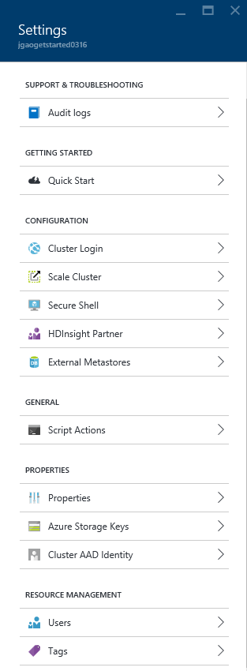
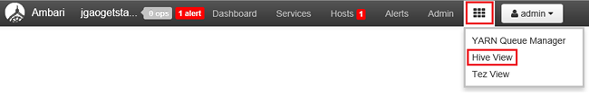

<properties
    pageTitle="Gerenciar clusters baseados em Linux Hadoop em HDInsight usando o portal Azure | Microsoft Azure"
    description="Aprenda a criar e gerenciar clusters baseados em Linux HDInsight usando o portal do Azure."
    services="hdinsight"
    documentationCenter=""
    authors="mumian"
    manager="jhubbard"
    editor="cgronlun"
    tags="azure-portal"/>

<tags
    ms.service="hdinsight"
    ms.workload="big-data"
    ms.tgt_pltfrm="na"
    ms.devlang="na"
    ms.topic="article"
    ms.date="08/10/2016"
    ms.author="jgao"/>

#Gerenciar clusters Hadoop em HDInsight usando o portal do Azure

[AZURE.INCLUDE [selector](../../includes/hdinsight-portal-management-selector.md)]

Usando o [portal do Azure][azure-portal], você pode gerenciar clusters baseados em Linux no Azure HDInsight. Use o seletor de tabulação para obter informações sobre como criar clusters Hadoop em HDInsight usando outras ferramentas. 

**Pré-requisitos**

Antes de começar este artigo, você deve ter o seguinte:

- **Assinatura de um Azure**. Consulte [avaliação gratuita do Azure obter](https://azure.microsoft.com/documentation/videos/get-azure-free-trial-for-testing-hadoop-in-hdinsight/).

##Abra o Portal

1. Entrar no [https://portal.azure.com](https://portal.azure.com).
2. Após abrir o portal, você pode:

    - Clique em **novo** no menu à esquerda para criar um novo cluster:
    
        
    - Clique em **Clusters de HDInsight** no menu à esquerda para listar os clusters existentes
    
        

        Se **HDInsight** não aparecer no menu à esquerda, clique em **Procurar**e, em seguida, clique em **Clusters de HDInsight**.

        

##Criar clusters

[AZURE.INCLUDE [delete-cluster-warning](../../includes/hdinsight-delete-cluster-warning.md)]

HDInsight funciona com uma ampla variedade de Hadoop componentes. Para a lista dos componentes que foram verificadas e com suporte, consulte [qual versão do Hadoop está em Azurehdinsight](hdinsight-component-versioning.md). Para as informações de criação de cluster gerais, consulte [criar Hadoop clusters no HDInsight](hdinsight-hadoop-provision-linux-clusters.md). 

##Listar e mostrar clusters

1. Entrar no [https://portal.azure.com](https://portal.azure.com).
2. Clique em **Clusters de HDInsight** no menu à esquerda para listar os clusters existentes.
3. Clique no nome de cluster. Se a lista de cluster for longa, você pode usar o filtro no topo da página.
4. Clique duas vezes em um cluster da lista para mostrar os detalhes.

    **Menu e essentials**:

    
    
    - **Configurações** e **Todas as configurações**: exibe a lâmina de **configurações** para o cluster, que permite que você acesse informações detalhadas de configuração para o cluster.
    - **Painel de controle**, o **Painel de Cluster** e * * URL: estas são todas as maneiras de acessar o painel de cluster, que é Ambari Web para clusters baseados em Linux.
    - **Secure Shell**: mostra as instruções para conectar-se ao cluster usando conexão SSH (Secure Shell).
    - **Cluster de escala**: permite que você altere o número de nós de trabalho para esse cluster.
    - **Excluir**: exclui o cluster.
    - **Início rápido ()**: exibe as informações que ajudarão você a começar a usar o HDInsight.
    - **Usuários ()**: permite que você defina permissões para _gerenciamento de portal_ desse cluster para outros usuários na sua assinatura do Azure.
    
        > [AZURE.IMPORTANT] Este _só_ afeta as permissões para esse cluster no portal do Azure e acesso e não tem efeito sobre quem pode se conectar ao ou enviar trabalhos ao cluster HDInsight.
    - **Marcas ()**: marcas permite que você defina pares de chave/valor para definir uma taxonomia personalizada dos seus serviços de nuvem. Por exemplo, você pode criar uma chave chamada __project__e, em seguida, use um valor em comum para todos os serviços associados a um projeto específico.
    - **Modos de exibição de Ambari**: Links Ambari Web.
    
    > [AZURE.IMPORTANT] Para gerenciar os serviços fornecidos pelo cluster HDInsight, você deve usar Ambari Web ou a API REST Ambari. Para obter mais informações sobre como usar o Ambari, consulte [Gerenciar HDInsight clusters usando Ambari](hdinsight-hadoop-manage-ambari.md).

    **Uso**:
    
    
    
5. Clique em **configurações**.

    

    - **Logs de auditoria**:
    - **Início rápido**: exibe as informações que ajudarão você a começar a usar o HDInsight.
    - **Cluster de escala**: aumentar e diminuir o número de nós de operador de cluster.
    - **Secure Shell**: mostra as instruções para conectar-se ao cluster usando conexão SSH (Secure Shell).
    - **Parceiro HDInsight**: Adicionar/remover o parceiro HDInsight atual.
    - **Metastores externo**: exibir a seção e Oozie metastores. O metastores só pode ser configurado durante o processo de criação de cluster.
    - **Ações de script**: Bash executar scripts em cluster.
    - **Propriedades**: exibir as propriedades de cluster.
    - **Teclas de armazenamento do Azure**: exibir a conta de armazenamento padrão e sua chave. A conta de armazenamento é configuração durante o processo de criação de cluster.
    - **Cluster AAD identidade**: 
    - **Usuários**: permite que você defina permissões para _gerenciamento de portal_ desse cluster para outros usuários na sua assinatura do Azure.
    - **Marcas**: marcas permite que você defina pares de chave/valor para definir uma taxonomia personalizada dos seus serviços de nuvem. Por exemplo, você pode criar uma chave chamada __project__e, em seguida, use um valor em comum para todos os serviços associados a um projeto específico.
    
    > [AZURE.NOTE] Esta é uma lista genérica configurações disponíveis; nem todos eles serão apresentar para todos os tipos de cluster.

6. Clique em **Propriedades**:

    As propriedades são:
    
    - **Hostname**: nome do Cluster.
    - **URL do cluster**.
    - **Status**: incluir interrompida, aceita, ClusterStorageProvisioned, AzureVMConfiguration, HDInsightConfiguration, operacional, executando, erro, excluindo, excluído, Timedout, DeleteQueued, DeleteTimedout, DeleteError, PatchQueued, CertRolloverQueued, ResizeQueued, ClusterCustomization
    - **Região**: Azure local. Para obter uma lista dos locais Azure com suporte, consulte a caixa de listagem suspensa **região** no [HDInsight preços](https://azure.microsoft.com/pricing/details/hdinsight/).
    - **Dados criados**.
    - **Sistema operacional**: O **Windows** ou **Linux**.
    - **Tipo**: Hadoop, HBase, tempestade, gerar. 
    - **Versão**. Consulte [versões de HDInsight](hdinsight-component-versioning.md)
    - **Assinatura**: nome da assinatura.
    - **ID da assinatura**.
    - **Fonte de dados padrão**: O sistema de arquivos de cluster padrão.
    - **Nós de trabalhador preços camada**.
    - **Nível de preço de nó de cabeça**.

##Excluir clusters

Excluir um cluster não irá excluir a conta de armazenamento do padrão ou todas as contas de armazenamento vinculado. Você pode recriar o cluster usando as mesmas contas de armazenamento e o mesmo metastores. É recomendável usar um novo contêiner de Blob padrão quando você recriar o cluster.

1. Entre [Portal][azure-portal].
2. Clique em **Procurar tudo** no menu à esquerda, clique em **Clusters de HDInsight**nome do seu cluster.
3. Clique em **Excluir** no menu superior e siga as instruções.

Consulte também [Pausar/desligar clusters](#pauseshut-down-clusters).

##Clusters de escala
O cluster dimensionamento recurso permite que você altere o número de nós de trabalho usado por um cluster que é executado em Azurehdinsight sem precisar recriar o cluster.

>[AZURE.NOTE] Somente clusters com HDInsight versão 3.1.3 ou superior são suportadas. Se você não tiver certeza da versão do seu cluster, você pode verificar a página de propriedades.  Consulte [clusters de lista e mostrar](#list-and-show-clusters).

O impacto das alterando o número de nós de dados para cada tipo de cluster suportado pelo HDInsight:

- Hadoop

    Perfeita, você pode aumentar o número de nós de trabalho em um cluster de Hadoop que está em execução sem afetar os trabalhos em execução ou pendentes. Novos trabalhos também podem ser enviados enquanto a operação está em andamento. Falhas em uma operação de dimensionamento normalmente são tratadas de forma que o cluster sempre seja deixado em um estado funcional.

    Quando um cluster de Hadoop será dimensionado para baixo, reduzindo o número de nós de dados, alguns dos serviços no cluster são reiniciados. Isso faz com que todos funcionando e trabalhos pendentes falha após a conclusão da operação de escala. No entanto, você pode reenviar os trabalhos quando a operação for concluída.

- HBase

    Perfeita, você pode adicionar ou remover nós ao cluster HBase enquanto ele é executado. Servidores regionais são automaticamente equilibrados em poucos minutos de concluir a operação de escala. No entanto, você também manualmente pode comparar os servidores regionais efetuando login a headnode de cluster e executando os seguintes comandos em uma janela do prompt de comando:

        >pushd %HBASE_HOME%\bin
        >hbase shell
        >balancer

    Para obter mais informações sobre como usar o shell de HBase, consulte]
- Tempestade

    Perfeitamente pode adicionar ou remover nós de dados para o seu cluster tempestade enquanto ele é executado. Mas após a conclusão bem-sucedida da operação de escala, você precisará rebalancear a topologia.

    Redistribuição pode ser feito de duas maneiras:

    * Web de tempestade interface do usuário
    * Ferramenta de interface de linha (comando)

    Consulte a [documentação de tempestade Apache](http://storm.apache.org/documentation/Understanding-the-parallelism-of-a-Storm-topology.html) para obter mais detalhes.

    Web tempestade UI está disponível no cluster HDInsight:

    

    Eis um exemplo de como usar o comando CLI para rebalancear a topologia de tempestade:

        ## Reconfigure the topology "mytopology" to use 5 worker processes,
        ## the spout "blue-spout" to use 3 executors, and
        ## the bolt "yellow-bolt" to use 10 executors

        $ storm rebalance mytopology -n 5 -e blue-spout=3 -e yellow-bolt=10

**Dimensionar clusters**

1. Entre [Portal][azure-portal].
2. Clique em **Procurar tudo** no menu à esquerda, clique em **Clusters de HDInsight**nome do seu cluster.
3. Clique em **configurações** no menu superior e, em seguida, clique em **Cluster de escala**.
4. Insira o **número de trabalho nós**. O limite no número de nó de cluster varia entre assinaturas do Azure. Você pode contatar o suporte de cobrança para aumentar o limite.  As informações de custo refletirão as alterações feitas para o número de nós.

    

##Pausar/desligar clusters

A maioria dos trabalhos de Hadoop são trabalhos em lotes que só são executados ocasionalmente. Para a maioria dos clusters do Hadoop, há grandes períodos de tempo que o cluster não está sendo usado para processamento. Com HDInsight, seus dados são armazenados no armazenamento do Azure, assim você pode excluir com segurança um cluster quando ele não está em uso.
Você também cobrado para um cluster de HDInsight, mesmo quando não estiver em uso. Como os encargos para o cluster são muitas vezes mais do que os encargos de armazenamento, faz sentido econômico excluir clusters quando eles não estão em uso.

Há várias maneiras que você pode programar o processo:

- Usuário dados Azure fábrica. Consulte [Criar por demanda baseado em Linux Hadoop clusters em HDInsight usando fábrica de dados do Azure](hdinsight-hadoop-create-linux-clusters-adf.md) para criar serviços de HDInsight vinculado sob demanda.
- Use o PowerShell Azure.  Consulte [os dados de atrasos de voos de análise](hdinsight-analyze-flight-delay-data.md).
- Use CLI Azure. Consulte [Gerenciar HDInsight clusters usando CLI do Azure](hdinsight-administer-use-command-line.md).
- Use o SDK do .NET HDInsight. Consulte [Hadoop enviar trabalhos](hdinsight-submit-hadoop-jobs-programmatically.md).

Para obter informações sobre preços, consulte [HDInsight preços](https://azure.microsoft.com/pricing/details/hdinsight/). Para excluir um cluster no Portal do, consulte [Excluir clusters](#delete-clusters)

##Alterar senhas

Um cluster de HDInsight pode ter duas contas de usuário. O HDInsight conta de usuário de cluster (também conhecido como Conta de usuário HTTP) e a conta de usuário SSH são criadas durante o processo de criação. Você pode web Ambari interface de usuário para alterar o nome de conta de usuário de cluster e senha e ações de script para alterar a conta de usuário do SSH

###Alterar a senha de usuário de cluster

Você pode usar a interface do usuário do Ambari Web para alterar a senha de usuário de Cluster. Para efetuar login em Ambari, você deve usar o nome de usuário de cluster existente e a senha.

> [AZURE.NOTE] Se você alterar a senha do usuário (admin) cluster, isso pode causar script executou ações contra este cluster falha. Se você tiver quaisquer ações de script persistentes que nós de trabalho de destino, esses podem falhar quando você adiciona nós ao cluster por meio de redimensionar operações. Para obter mais informações sobre ações de script, consulte [Personalizar HDInsight clusters usando ações de script](hdinsight-hadoop-customize-cluster-linux.md).

1. Entrar no Ambari Web interface do usuário usando as credenciais de usuário de cluster HDInsight. O nome de usuário padrão é **admin**. A URL é **https://&lt;nome de Cluster HDInsight > azurehdinsight.net**.
2. Clique em **administrador** no menu superior e clique em "Gerenciar Ambari". 
3. No menu à esquerda, clique em **usuários**.
4. Clique em **administrador**.
5. Clique em **Alterar senha**.

Ambari, em seguida, altera a senha em todos os nós no cluster.

###Alterar a senha do usuário SSH

1. Usando um editor de texto, salve o seguinte como um arquivo denominado __changepassword.sh__.

    > [AZURE.IMPORTANT] Você deve usar um editor que usa LF como o final da linha. Se o editor usa CRLF, em seguida, o script não funcionará.
    
        #! /bin/bash
        USER=$1
        PASS=$2

        usermod --password $(echo $PASS | openssl passwd -1 -stdin) $USER

2. Carregar o arquivo em um local de armazenamento que possa ser acessado do HDInsight usando um endereço HTTP ou HTTPS. Por exemplo, um arquivo pública armazenar como o OneDrive ou o Azure Blob storage. Salve o URI (endereço HTTP ou HTTPS), o arquivo, como isso é necessário na próxima etapa.

3. No portal do Azure, selecione o seu cluster HDInsight e selecione __todas as configurações__. Da lâmina __configurações__ , selecione __Ações de Script__.

4. A lâmina de __Ações de Script__ , selecione __Enviar novos__. Quando a __ação de script de enviar__ lâmina for exibida, insira as seguintes informações.

  	| Campo | Valor |
  	| ----- | ----- |
  	| Nome | Alterar ssh senha |
  	| Script de bash URI | O URI para o arquivo de changepassword.sh |
  	| Nós (cabeça trabalhador, Nimbus, Supervisor, Zookeeper, etc.) | ✓ para todos os tipos de nó listados |
  	| Parâmetros | Insira o nome de usuário SSH e a nova senha. Deve haver um espaço entre o nome de usuário e a senha.
  	| Se mantiver esta ação de script... | Deixe este campo desmarcada.

5. Selecione __criar__ para aplicar o script. Quando o script for concluído, você poderá se conectar ao cluster usando o SSH com a nova senha.

##Acesso de Grant/revoke

HDInsight clusters têm os seguintes serviços de web HTTP (todos esses serviços têm pontos de extremidade RESTful):

- ODBC
- JDBC
- Ambari
- Oozie
- Templeton

Por padrão, esses serviços são concedidos acesso. Você pode revogar/conceder acesso usando [CLI do Azure](hdinsight-administer-use-command-line.md#enabledisable-http-access-for-a-cluster) e o [Azure PowerShell](hdinsight-administer-use-powershell.md#grantrevoke-access).

##Localizar a identificação de assinatura

**Para localizar sua assinatura do Azure IDs**

1. Entre [Portal][azure-portal].
2. Clique em **Procurar tudo** no menu à esquerda e, em seguida, clique em **assinaturas**. Cada assinatura tem um nome e uma ID.

Cada cluster está vinculado a uma assinatura do Azure. A ID da assinatura é mostrado no cluster peças **essenciais** . Consulte [clusters de lista e mostrar](#list-and-show-clusters).

##Localize o grupo de recursos 

No modo de ARM, cada cluster HDInsight é criado com um grupo de recursos Azure. O grupo de recursos Azure qual pertence um cluster aparece no:

- A lista de cluster possui uma coluna de **Grupo de recursos** .
- Cluster peças **essenciais** .  

Consulte [clusters de lista e mostrar](#list-and-show-clusters).

##Localize a conta de armazenamento padrão

Cada cluster HDInsight possui uma conta de armazenamento padrão. A conta padrão de armazenamento e suas chaves para um cluster é exibido em **configurações**/**Propriedades**/**Chaves de armazenamento do Azure**. Consulte [clusters de lista e mostrar](#list-and-show-clusters).

##Executar consultas de seção

Não é possível executar o trabalho de seção diretamente do portal do Azure, mas você pode usar o modo de exibição de seção na interface de usuário do Ambari Web.

**Executar consultas de seção usando o modo de exibição de seção Ambari**

1. Entrar no Ambari Web interface do usuário usando as credenciais de usuário de cluster HDInsight. O nome de usuário padrão é **admin**. A URL é **https://&lt;nome de Cluster HDInsight > azurehdinsight.net**.
2. Abra a seção modo de exibição conforme mostrado na seguinte captura de tela:  

    
3. No menu superior, clique em **consulta** .
4. Insira uma consulta de seção no **Editor de consulta**e clique em **Executar**.

##Trabalhos de monitor

Consulte [Gerenciar HDInsight clusters, usando a interface do usuário do Ambari Web](hdinsight-hadoop-manage-ambari.md#monitoring).

##Procurar arquivos

Usando o portal do Azure, você pode procurar o conteúdo do contêiner padrão.

1. Entrar no [https://portal.azure.com](https://portal.azure.com).
2. Clique em **Clusters de HDInsight** no menu à esquerda para listar os clusters existentes.
3. Clique no nome de cluster. Se a lista de cluster for longa, você pode usar o filtro no topo da página.
4. Clique em **configurações**.
5. Da lâmina de **configurações** , clique em **Chaves de armazenamento do Azure**.
6. Clique no nome de conta de armazenamento padrão.
7. Clique no bloco de **Blobs** .
8. Clique no nome do contêiner de padrão.

##Monitore o uso do cluster

A seção de __uso__ da lâmina cluster HDInsight exibe informações sobre o número de cores disponíveis para sua assinatura para uso com HDInsight, bem como o número de cores alocados para este cluster e como eles são alocados para os nós dentro desse cluster. Consulte [clusters de lista e mostrar](#list-and-show-clusters).

> [AZURE.IMPORTANT] Para monitorar os serviços fornecidos pelo cluster HDInsight, você deve usar Ambari Web ou a API REST Ambari. Para obter mais informações sobre como usar o Ambari, consulte [clusters de gerenciar HDInsight usando Ambari](hdinsight-hadoop-manage-ambari.md)

##Conectar a um cluster

Consulte [usar seção com Hadoop em HDInsight com o SSH](hdinsight-hadoop-use-hive-ssh.md#ssh).
    
##Próximas etapas
Neste artigo, você aprendeu como criar um cluster de HDInsight usando o Portal e como abrir a ferramenta de linha de comando do Hadoop. Para saber mais, consulte os seguintes artigos:

* [Administrar HDInsight usando o PowerShell Azure](hdinsight-administer-use-powershell.md)
* [Administrar HDInsight usando CLI Azure](hdinsight-administer-use-command-line.md)
* [Criar clusters de HDInsight](hdinsight-provision-clusters.md)
* [Use a seção no HDInsight](hdinsight-use-hive.md)
* [Usar porco em HDInsight](hdinsight-use-pig.md)
* [Use Sqoop em HDInsight](hdinsight-use-sqoop.md)
* [Introdução ao Azure HDInsight](hdinsight-hadoop-linux-tutorial-get-started.md)
* [Que versão do Hadoop está em Azurehdinsight?](hdinsight-component-versioning.md)

[azure-portal]: https://portal.azure.com
[image-hadoopcommandline]: ./media/hdinsight-administer-use-portal-linux/hdinsight-hadoop-command-line.png "Linha de comando do Hadoop"
