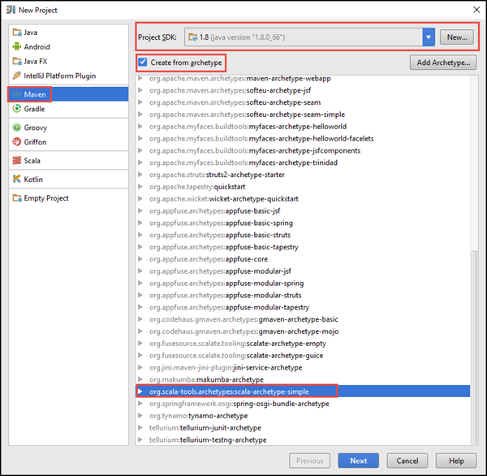

<properties
    pageTitle="Criar autônomo scala aplicativos sejam executados em clusters de HDInsight Spark | Microsoft Azure"
    description="Aprenda a criar um aplicativo de Spark seja executado em clusters de HDInsight Spark autônomo."
    services="hdinsight"
    documentationCenter=""
    authors="nitinme"
    manager="jhubbard"
    editor="cgronlun"
    tags="azure-portal"/>

<tags
    ms.service="hdinsight"
    ms.workload="big-data"
    ms.tgt_pltfrm="na"
    ms.devlang="na"
    ms.topic="article"
    ms.date="10/28/2016"
    ms.author="nitinme"/>

# Criar um aplicativo Scala em execução no cluster Spark Apache no HDInsight Linux autônomo

Este artigo fornece orientações passo a passo sobre como desenvolver aplicativos de Spark autônomo escritos em Scala usando Maven com IntelliJ IDEIA. O artigo usa Apache Maven como o sistema de compilação e começa com um arquétipo Maven existente para Scala fornecido pelo IntelliJ IDEIA.  Em um alto nível, criando um Scala aplicativo em IntelliJ IDEIA envolve as seguintes etapas:

* Use Maven como o sistema de compilação.
* Atualize o arquivo de modelo de objeto do projeto (POM) para resolver dependências de módulo Spark.
* Escreva seu aplicativo no Scala.
* Gere um arquivo jar que pode ser enviado aos HDInsight Spark clusters.
* Execute o aplicativo em cluster Spark usando Livy.

>[AZURE.NOTE] HDInsight também fornece uma ferramenta de plug-in de IDEIA IntelliJ para facilitar o processo de criação e o envio de aplicativos para um cluster de HDInsight Spark no Linux. Para obter mais informações, consulte [Usar HDInsight ferramentas plug-in para IntelliJ IDEIA criar e enviar aplicativos Spark](hdinsight-apache-spark-intellij-tool-plugin.md).

**Pré-requisitos**

* Uma assinatura do Azure. Consulte [avaliação gratuita do Azure obter](https://azure.microsoft.com/documentation/videos/get-azure-free-trial-for-testing-hadoop-in-hdinsight/).
* Um cluster de Apache Spark no HDInsight Linux. Para obter instruções, consulte [criar Apache Spark clusters no Azure HDInsight](hdinsight-apache-spark-jupyter-spark-sql.md).
* Kit de desenvolvimento Java Oracle. Você pode instalá-lo [aqui](http://www.oracle.com/technetwork/java/javase/downloads/jdk8-downloads-2133151.html).
* Um Java IDE. Este artigo usa IDEIA IntelliJ 15.0.1. Você pode instalá-lo [aqui](https://www.jetbrains.com/idea/download/).

## Instalar o plug-in Scala para IntelliJ IDEIA

Se instalação IntelliJ IDEIA não não solicitar para habilitar o plug-in Scala, inicie IntelliJ IDEIA e vá as seguintes etapas para instalar o plug-in:

1. Iniciar IntelliJ IDEIA e da tela de boas-vindas, clique em **Configurar** e clique em **Plug-ins**.

    

2. Na tela seguinte, clique em **JetBrains instalar o plug-in** do canto inferior esquerdo. Na caixa de diálogo **Procurar plug-ins do JetBrains** que se abre, pesquise Scala e clique em **instalar**.

    

3. Depois que o plug-in instalado com êxito, clique no **botão reiniciar IntelliJ IDEIA** para reiniciar o IDE.

## Criar um projeto de Scala autônomo

1. Inicie a IDEIA IntelliJ e crie um novo projeto. Na caixa de diálogo Novo projeto, verifique as seguintes opções e clique em **Avançar**.

    

    * Selecione **Maven** como o tipo de projeto.
    * Especifica um **projeto SDK**. Clique em novo e navegue até o diretório de instalação do Java, normalmente `C:\Program Files\Java\jdk1.8.0_66`.
    * Selecione a opção de **criar a partir da arquétipo** .
    * Na lista de arquétipos, selecione **org.scala tools.archetypes:scala-arquétipo-simples**. Isso criará a estrutura de diretório correto e baixe as dependências de padrão necessários para escrever Scala programa.

2. Fornece valores relevantes para **ID do grupo**, **ArtifactId**e **versão**. Clique em **Avançar**.

3. Na próxima caixa de diálogo onde você especificar diretório inicial Maven e outras configurações do usuário, aceite os padrões e clique em **Avançar**.

4. Na caixa de diálogo última, especifique um nome de projeto e o local e clique em **Concluir**.

5. Exclua o arquivo **MySpec.Scala** em **src\test\scala\com\microsoft\spark\example**. Você não precisa isso para o aplicativo.

6. Se necessário, renomeie os arquivos de origem e de teste do padrão. No painel esquerdo na IDEIA IntelliJ, navegue até **src\main\scala\com.microsoft.spark.example**. **App.scala**de atalho, clique **Refactor**, clique em Renomear arquivo e na caixa de diálogo, forneça o novo nome para o aplicativo e clique em **Refatorar**.

      

7. As etapas subsequentes, você irá atualizar o pom.xml para definir as dependências para o aplicativo Spark Scala. Para essas dependências ser baixado e resolvidos automaticamente, você deve configurar Maven adequadamente.

    

    1. No menu **arquivo** , clique em **configurações**.
    2. Na caixa de diálogo **configurações** , navegue até **criar, execução, implantação** > **Ferramentas de construção** > **Maven** > **importando**.
    3. Selecione a opção para **Importar Maven projetos automaticamente**.
    4. Clique em **Aplicar**e, em seguida, clique em **Okey**.

8. Atualize o arquivo de origem Scala para incluir o código do seu aplicativo. Abra e substitua o código de amostra existente com o seguinte código e salve as alterações. Este código lê os dados a partir do HVAC.csv (disponível em todos os clusters HDInsight Spark), recupera as linhas que possuem apenas um dígito na coluna sexta e grava a saída **/HVACOut** sob o contêiner de armazenamento padrão para o cluster.

        package com.microsoft.spark.example

        import org.apache.spark.SparkConf
        import org.apache.spark.SparkContext

        /**
          * Test IO to wasb
          */
        object WasbIOTest {
          def main (arg: Array[String]): Unit = {
            val conf = new SparkConf().setAppName("WASBIOTest")
            val sc = new SparkContext(conf)

            val rdd = sc.textFile("wasbs:///HdiSamples/HdiSamples/SensorSampleData/hvac/HVAC.csv")

            //find the rows which have only one digit in the 7th column in the CSV
            val rdd1 = rdd.filter(s => s.split(",")(6).length() == 1)

            rdd1.saveAsTextFile("wasbs:///HVACout")
          }
        }

9. Atualize o pom.xml.

    1.  Dentro de `<project>\<properties>` adicione o seguinte:

            <scala.version>2.10.4</scala.version>
            <scala.compat.version>2.10.4</scala.compat.version>
            <scala.binary.version>2.10</scala.binary.version>

    2. Dentro de `<project>\<dependencies>` adicione o seguinte:

            <dependency>
              <groupId>org.apache.spark</groupId>
              <artifactId>spark-core_${scala.binary.version}</artifactId>
              <version>1.4.1</version>
            </dependency>

    Salve alterações pom.xml.

10. Crie o arquivo. jar. IntelliJ IDEIA permite a criação de JAR como artefato de um projeto. Execute as etapas a seguir.

    1. No menu **arquivo** , clique em **Estrutura de projeto**.
    2. Na caixa de diálogo **Estrutura de projeto** , clique em **artefatos** e clique no símbolo de adição. Na caixa de diálogo pop-up, clique **JAR**e, em seguida, clique em **de módulos com dependências**.

        

    3. Na caixa de diálogo **Criar JAR de módulos** , clique nas reticências ( ) em relação a **Classe principal**.

    4. Na caixa de diálogo **Selecionar classe principal** , selecione a classe que é exibida por padrão e clique em **Okey**.

        

    5. Na caixa de diálogo **Criar JAR de módulos** , certifique-se de que a opção para **extrair o destino JAR** está selecionada e clique em **Okey**. Isso cria um único JAR com todas as dependências.

        

    6. Na guia layout de saída lista todos os jars estão incluídos como parte do projeto Maven. Você pode selecionar e excluir aquelas em que o aplicativo Scala não tem nenhuma dependência direta. Para o aplicativo que estamos criando aqui, você pode remover todos, exceto o último um (**SparkSimpleApp compilar saída**). Selecione os jars excluir e clique no ícone **Excluir** .

        

        Verifique se caixa **desenvolver tornar** estiver selecionada, que garante que o jar é criado sempre que o projeto é criado ou atualizado. Clique em **Aplicar** e, em seguida, **Okey**.

    7. Na barra de menus, clique em **criar**e, em seguida, clique em **Tornar projeto**. Você também pode clicar em **Criar artefatos** para criar o jar. O jar de saída é criado em **\out\artifacts**.

        

## Executar o aplicativo no cluster Spark

Para executar o aplicativo no cluster, você deve fazer o seguinte:

* **Copiar jar da aplicação para o blob de armazenamento do Azure** associado ao cluster. Você pode usar [**AzCopy**](../storage/storage-use-azcopy.md), um utilitário de linha de comando, para fazê-lo. Há muitas outros clientes assim que você pode usar para carregar dados. Você pode encontrar mais sobre eles em [carregar dados para trabalhos de Hadoop em HDInsight](hdinsight-upload-data.md).

* **Usar Livy para enviar um trabalho de aplicativo remotamente** ao cluster Spark. Clusters Spark HDInsight inclui Livy que expõe pontos de extremidade restante para enviar remotamente os trabalhos de Spark. Para obter mais informações, consulte [trabalhos de enviar Spark remotamente usando Livy com clusters Spark em HDInsight](hdinsight-apache-spark-livy-rest-interface.md).

## Consulte também

* [Visão geral: Apache Spark no Azure HDInsight](hdinsight-apache-spark-overview.md)

### Cenários

* [Spark com BI: executar análise de dados interativos usando Spark em HDInsight com ferramentas de BI](hdinsight-apache-spark-use-bi-tools.md)

* [Spark com aprendizado de máquina: Spark de uso em HDInsight para analisar a temperatura de construção usando dados HVAC](hdinsight-apache-spark-ipython-notebook-machine-learning.md)

* [Spark com aprendizado de máquina: Spark de uso em HDInsight prever resultados da inspeção de alimentos](hdinsight-apache-spark-machine-learning-mllib-ipython.md)

* [Streaming Spark: Uso Spark no HDInsight para criar aplicativos de streaming em tempo real](hdinsight-apache-spark-eventhub-streaming.md)

* [Análise de log de site usando Spark no HDInsight](hdinsight-apache-spark-custom-library-website-log-analysis.md)

### Criar e executar aplicativos

* [Executar trabalhos remotamente em um cluster de Spark usando Livy](hdinsight-apache-spark-livy-rest-interface.md)

### Ferramentas e extensões

* [Usar o plug-in de ferramentas de HDInsight para IntelliJ IDEIA para criar e enviar Spark Scala aplicativos](hdinsight-apache-spark-intellij-tool-plugin.md)

* [Usar o plug-in de ferramentas de HDInsight para IntelliJ IDEIA para depurar aplicativos de Spark remotamente](hdinsight-apache-spark-intellij-tool-plugin-debug-jobs-remotely.md)

* [Usar blocos de anotações de Zeppelin com um cluster Spark em HDInsight](hdinsight-apache-spark-use-zeppelin-notebook.md)

* [Kernels disponíveis para o bloco de anotações de Jupyter em cluster Spark para HDInsight](hdinsight-apache-spark-jupyter-notebook-kernels.md)

* [Usar os pacotes externos com blocos de anotações de Jupyter](hdinsight-apache-spark-jupyter-notebook-use-external-packages.md)

* [Instalar Jupyter no seu computador e se conectar a um cluster de HDInsight Spark](hdinsight-apache-spark-jupyter-notebook-install-locally.md)

### Gerenciar recursos

* [Gerenciar recursos para cluster Spark Apache no Azure HDInsight](hdinsight-apache-spark-resource-manager.md)

* [Rastrear e depurar trabalhos em execução em um cluster de Apache Spark em HDInsight](hdinsight-apache-spark-job-debugging.md)
