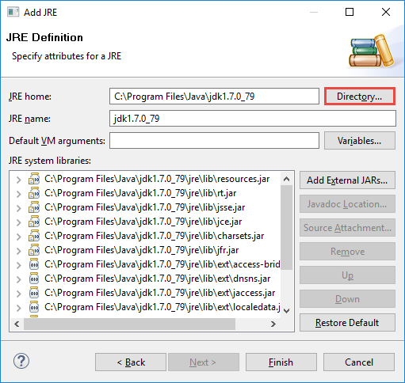
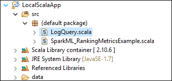
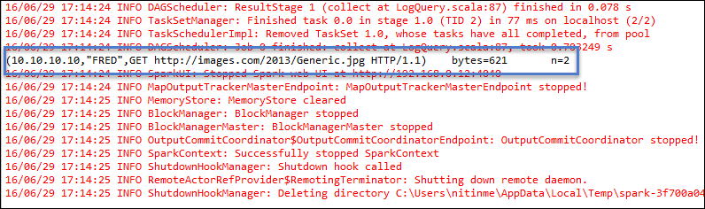

 <properties
    pageTitle="Criar aplicativos Spark Scala usando ferramentas de HDInsight do Kit de ferramentas do Azure para Eclipse | Microsoft Azure"
    description="Aprenda a criar um aplicativo de Spark seja executado em clusters de HDInsight Spark autônomo."
    services="hdinsight"
    documentationCenter=""
    authors="nitinme"
    manager="jhubbard"
    editor="cgronlun"
    tags="azure-portal"/>

<tags
    ms.service="hdinsight"
    ms.workload="big-data"
    ms.tgt_pltfrm="na"
    ms.devlang="na"
    ms.topic="article"
    ms.date="08/30/2016"
    ms.author="nitinme"/>

# Use as ferramentas de HDInsight do Kit de ferramentas do Azure para Eclipse para criar Spark aplicativos para cluster HDInsight Spark Linux

Este artigo fornece orientações passo a passo sobre como desenvolver aplicativos Spark escritos em Scala e enviá-lo para um HDInsight Spark cluster usando ferramentas de HDInsight do Kit de ferramentas do Azure para Eclipse. Você pode usar as ferramentas de algumas maneiras diferentes:

* Para desenvolver e enviar um aplicativo Scala Spark em um cluster de HDInsight Spark
* Acessar os recursos de cluster do Azure HDInsight Spark
* Para desenvolver e executar um aplicativo de Scala Spark localmente

>[AZURE.IMPORTANT] Esta ferramenta pode ser usada para criar e enviar aplicativos apenas para um cluster de HDInsight Spark no Linux.

##Pré-requisitos

* Uma assinatura do Azure. Consulte [avaliação gratuita do Azure obter](https://azure.microsoft.com/documentation/videos/get-azure-free-trial-for-testing-hadoop-in-hdinsight/).

* Um cluster de Apache Spark no HDInsight Linux. Para obter instruções, consulte [criar Apache Spark clusters no Azure HDInsight](hdinsight-apache-spark-jupyter-spark-sql.md).

* Kit de desenvolvimento de Java Oracle versão 7 e 8. 
    * **Java SDK 7** é usado para compilar projetos Spark como clusters HDInsight suportam Java versão 7. Você pode baixar Java SDK 7 do [aqui](http://www.oracle.com/technetwork/java/javase/downloads/jdk7-downloads-1880260.html).
    * **Java SDK 8** é usado para Eclipse IDE runtime. É possível baixá-lo [aqui](http://www.oracle.com/technetwork/java/javase/downloads/jdk8-downloads-2133151.html).

* Eclipse IDE. Este artigo usa Eclipse Neon. Você pode instalá-lo [aqui](https://www.eclipse.org/downloads/).

* Scala IDE para Eclipse. 
    * **Se você tiver Eclipse IDE instalado**, você pode adicionar o plug-in Scala IDE indo para **ajudar a** -> **Instalar novo SoftWare**e adicione [http://download.scala-ide.org/sdk/lithium/e44/scala211/stable/site](http://download.scala-ide.org/sdk/lithium/e44/scala211/stable/site) como fonte para baixar Scala Plugin para Eclipse. 
    * **Se você não tiver Eclipse IDE instalado**, você poderá instalar Scala IDE diretamente do [aqui](http://scala-ide.org/download/sdk.html). Você pode baixar o arquivo. zip desse link, extrai-lo, navegue até a pasta **/eclipse** e, em seguida, execute o arquivo de **eclipse.exe** de lá.
    
    >[AZURE.NOTE] As etapas neste documento são baseadas em usando o Eclipse IDE com Scala plug-in instalado.

* Spark SDK. É possível baixá-lo [aqui](http://go.microsoft.com/fwlink/?LinkID=723585&clcid=0x409).

* Instale e (fx) clipse do [https://www.eclipse.org/efxclipse/install.html](https://www.eclipse.org/efxclipse/install.html).

## Instalar ferramentas de HDInsight no Azure Kit de ferramentas para Eclipse

HDInsight ferramentas para Eclipse está disponível como parte do Kit de ferramentas do Azure para Eclipse. Para obter instruções sobre como instalar o Kit de ferramentas do Azure, consulte [instalar o Kit de ferramentas do Azure para Eclipse](../azure-toolkit-for-eclipse-installation.md).

## Faça logon em sua assinatura do Azure

1. Iniciar o Eclipse IDE e abrir o Explorer do Azure. No menu **janela** no IDE, clique em **Mostrar modo de exibição** e clique em **outros**. Na caixa de diálogo que é aberta, expanda **Azure**, clique **Azure Explorer**e, em seguida, clique em **Okey**.

    

2. O nó do **Azure** no **Azure Explorer**de atalho e, em seguida, clique em **Gerenciar assinaturas**.

3. Na caixa de diálogo **Gerenciar assinaturas** , clique em **entrar** e insira suas credenciais do Azure.

    

4. Depois que você estiver conectado, a caixa de diálogo **Gerenciar inscrições** lista todas as assinaturas Azure associadas com as credenciais. Clique em **Fechar** na caixa de diálogo.

5. Na guia do Azure Explorer, expanda **HDInsight** para ver os clusters HDInsight Spark em sua assinatura.

    

6. Você pode expandir ainda mais um nó de nome de cluster para ver os recursos (por exemplo, contas de armazenamento) associados ao cluster.

    

## Configurar um projeto Spark Scala para um cluster de HDInsight Spark

1. Do espaço de trabalho do Eclipse IDE, clique em **arquivo**, clique em **novo**e, em seguida, clique em **projeto**. 

2. No Assistente de **Novo projeto** , expanda **HDInsight**, selecione **Spark em HDInsight (Scala)**e clique em **Avançar**.

    

3. Na caixa de diálogo **Novo projeto de Scala de HDInsight** , digite/seleciona valores conforme mostrado na imagem abaixo e clique em **Avançar**.

    

    * Insira um nome para o projeto.
    * Na caixa **JRE** , certifique-se de **que usar um ambiente de execução JRE** está definido como **JavaSE-1.7**.
    * Verifique se que Spark SDK está definido para o local onde você baixou o SDK. O link para o local de download será incluído nos [pré-requisitos](#prerequisites) anteriormente contidas neste tópico. Você também pode baixar o SDK do link incluído nesta caixa de diálogo, conforme mostrado na imagem acima.    

4. Na caixa de diálogo seguinte, clique na guia **bibliotecas** e clique duas vezes em **Biblioteca de sistema JRE [JavaSE-1.7]**.

    

5. Na caixa de diálogo **Editar biblioteca** , verifique se o **Que ambiente de execução** está definida como **JavaSE-1.7(jdk1.7.0_79)**. Se isso não estiver disponível como uma opção, siga as etapas abaixo.

    1. Selecione a opção **JRE alternativo** e veja se **JavaSE-1.7(jdk1.7.0_79)** está disponível.
    2. Caso contrário, clique no botão **JREs instalado** .

          

    3. Na caixa de diálogo **JREs instalado** , clique em **Adicionar**.

            

    4. Na caixa de diálogo **JRE tipo** , selecione **Máquina virtual padrão**e clique em **Avançar**

            

    5. Na caixa de diálogo **Definição de JRE** , clique em diretório, navegue até o local de instalação do JDK 7 e selecione a pasta raiz de **jdk1.7.0_79**.

            

    6. Clique em **Concluir**. Na caixa de diálogo **JREs instalado** , selecione o JRE recém-adicionado e clique em **Okey**.

           

    7. O JRE recém-adicionado deve estar listado para o **Ambiente de execução**. Clique em **Concluir**.

           

6. Na aba **bibliotecas** , clique duas vezes **Scala biblioteca contêiner [2.11.8]**. Na caixa de diálogo **Editar biblioteca** , selecione **fixo biblioteca Scala contêiner: 2.10.6**. 

    

    Clique em **Concluir** até que você sair da caixa de diálogo de configurações do project.

## Criar um aplicativo de Scala para cluster HDInsight Spark

1. No IDE Eclipse já aberto, do **Explorer do pacote**, expanda o projeto que você criou anteriormente, **src**de atalho, aponte para **novo**e clique em **outros**.

2. Na caixa de diálogo **Selecionar um assistente** , expanda **Scala assistentes**, clique em **Objeto Scala**e clique em **Avançar**.

    

3. Na caixa de diálogo **Criar novo arquivo** , insira um nome para o objeto e clique em **Concluir**.

    

4. Cole o seguinte código no editor de texto.

        import org.apache.spark.SparkConf
        import org.apache.spark.SparkContext
    
        object MyClusterApp{
          def main (arg: Array[String]): Unit = {
            val conf = new SparkConf().setAppName("MyClusterApp")
            val sc = new SparkContext(conf)
        
            val rdd = sc.textFile("wasbs:///HdiSamples/HdiSamples/SensorSampleData/hvac/HVAC.csv")
        
            //find the rows which have only one digit in the 7th column in the CSV
            val rdd1 =  rdd.filter(s => s.split(",")(6).length() == 1)
        
            rdd1.saveAsTextFile("wasbs:///HVACOut")
          }     
        }

5. Execute o aplicativo em um cluster de HDInsight Spark.

    1. Do **Pacote Explorer**, clique com botão direito no nome do projeto e selecione **Enviar Spark aplicativo ao HDInsight**.      

    2. Na caixa de diálogo **Spark envio** , forneça os valores a seguir.

        * Para **Nome do Cluster**, selecione o cluster de HDInsight Spark no qual você deseja executar o aplicativo.

        * Você precisa selecione um artefato do projeto Eclipse ou selecione um no disco rígido.

        * Em relação a caixa de texto **nome da classe principal** , digite o nome do objeto que você especificou no código (consulte a imagem abaixo).

            

        * Porque o código do aplicativo neste exemplo não precisam quaisquer argumentos de linha de comando ou referência JARs ou arquivos, você poderá deixar outras caixas de texto vazia.

        * Clique em **Enviar**.

    3. Na guia de **Envio Spark** deve iniciar exibindo o andamento. Você pode parar o aplicativo clicando no botão vermelho na janela "Spark envio". Você também pode exibir os logs para este aplicativo específico executar clicando no ícone de globo (indicado pelo caixa azul na imagem).

        

    Na próxima seção, você aprende a acessar o trabalho usando as ferramentas de HDInsight do Kit de ferramentas do Azure para Eclipse de saída.

## Acessar e gerenciar clusters de HDInsight Spark usando as ferramentas de HDInsight do Kit de ferramentas do Azure para Eclipse

Você pode executar uma variedade de operações usando as ferramentas de HDInsight.

### Acessar o contêiner de armazenamento para o cluster

1. Do Explorer Azure, expanda o nó de raiz de **HDInsight** para ver uma lista de clusters HDInsight Spark disponíveis.

3. Expanda o nome do cluster para ver a conta de armazenamento e o contêiner de armazenamento padrão para o cluster.

    

4. Clique no nome do contêiner de armazenamento associado ao cluster. No painel à direita, você deve ver uma pasta chamada **HVACOut**. Clique duas vezes para abrir a pasta e você verá **parte -*** arquivos. Abra um desses arquivos para ver a saída do aplicativo.

### Acessar o servidor de histórico Spark

1. Do **Azure Explorer**, o nome do seu cluster de Spark de atalho e selecione **Abrir UI de histórico Spark**. Quando solicitado, digite as credenciais de administrador para o cluster. Você deve especificou esses ao provisionar o cluster.

2. No painel Spark histórico Server, você pode procurar o aplicativo que você acabou terminado executando usando o nome do aplicativo. No código acima, você definir o nome do aplicativo usando `val conf = new SparkConf().setAppName("MyClusterApp")`. Portanto, o nome do seu aplicativo de Spark foi **MyClusterApp**.

### Iniciar o portal de Ambari

Do **Azure Explorer**, o nome do seu cluster de Spark de atalho e selecione **Abrir Portal de gerenciamento de Cluster (Ambari)**. Quando solicitado, digite as credenciais de administrador para o cluster. Você deve especificou esses ao provisionar o cluster.

### Gerenciar assinaturas do Azure

Por padrão, as ferramentas de HDInsight do Kit de ferramentas do Azure para Eclipse lista os clusters Spark de todas as suas assinaturas Azure. Se necessário, você pode especificar as assinaturas para a qual você deseja acessar o cluster. Do **Azure Explorer**, clique com botão direito no nó de raiz do **Azure** e clique em **Gerenciar assinaturas**. Na caixa de diálogo, desmarque as caixas de seleção contra a assinatura que você não deseja acessar e clique em **Fechar**. Você também pode clicar em **Sair** se você quiser fazer logoff sua assinatura do Azure.

## Executar um aplicativo de Spark Scala localmente

Você pode usar as ferramentas de HDInsight no Kit de ferramentas do Azure para Eclipse ao executar aplicativos de Spark Scala localmente na estação de trabalho. Normalmente, esses aplicativos não precisa de acesso aos recursos de cluster como o contêiner de armazenamento e podem ser executados e testados localmente.

### Pré-requisito

Enquanto estiver executando o aplicativo Spark Scala local em um computador Windows, você pode receber uma exceção, como explicado em [SPARK 2356](https://issues.apache.org/jira/browse/SPARK-2356) que ocorre devido a uma falta **WinUtils.exe** no sistema operacional Windows. Para contornar esse erro, você deve [baixar o arquivo executável a partir daqui](http://public-repo-1.hortonworks.com/hdp-win-alpha/winutils.exe) para um local como **C:\WinUtils\bin**. Em seguida, adicione uma variável de ambiente **HADOOP_HOME** e defina o valor da variável como **C\WinUtils**.

### Executar um aplicativo Spark Scala local  

1. Inicie o Eclipse e crie um novo projeto. Na caixa de diálogo Novo projeto, verifique as seguintes opções e clique em **Avançar**.

    

    * No painel esquerdo, selecione **HDInsight**.
    * No painel direito, selecione **Spark em amostra de execução de HDInsight Local (Scala)**.
    * Clique em **Avançar**.

2. Para fornecer os detalhes do projeto, siga as etapas 3 a 6 conforme mostrado na seção anterior, [Configurar um projeto de aplicativo Spark Scala para um cluster de HDInsight Spark](#set-up-a-spark-scala-application-project-for-an-hdinsight-spark cluster).

3. O modelo adiciona um código de amostra (**LogQuery**) na pasta **src** que você pode executar localmente em seu computador.

    

4.  Clique com o botão direito no aplicativo **LogQuery** , aponte para **Executar como**e clique em **1 Scala aplicativo**. Você verá uma saída assim na guia **Console** na parte inferior.

    

## Problemas conhecidos e de comentários

Exibindo atualmente Spark saídas diretamente não é suportado e estamos trabalhando nisso.

Se você tiver quaisquer sugestões ou comentários ou se você encontrar problemas ao usar esta ferramenta, fique à vontade para Solte-em um email no hdivstool em microsoft ponto com.

## Consulte também

* [Visão geral: Apache Spark no Azure HDInsight](hdinsight-apache-spark-overview.md)

### Cenários

* [Spark com BI: executar análise de dados interativos usando Spark em HDInsight com ferramentas de BI](hdinsight-apache-spark-use-bi-tools.md)

* [Spark com aprendizado de máquina: Spark de uso em HDInsight para analisar a temperatura de construção usando dados HVAC](hdinsight-apache-spark-ipython-notebook-machine-learning.md)

* [Spark com aprendizado de máquina: Spark de uso em HDInsight prever resultados da inspeção de alimentos](hdinsight-apache-spark-machine-learning-mllib-ipython.md)

* [Streaming Spark: Uso Spark no HDInsight para criar aplicativos de streaming em tempo real](hdinsight-apache-spark-eventhub-streaming.md)

* [Análise de log de site usando Spark no HDInsight](hdinsight-apache-spark-custom-library-website-log-analysis.md)

### Criar e executar aplicativos

* [Criar um aplicativo autônomo usando Scala](hdinsight-apache-spark-create-standalone-application.md)

* [Executar trabalhos remotamente em um cluster de Spark usando Livy](hdinsight-apache-spark-livy-rest-interface.md)

### Ferramentas e extensões

* [Use as ferramentas de HDInsight do Kit de ferramentas do Azure para IntelliJ para criar e enviar Spark Scala aplicativos](hdinsight-apache-spark-intellij-tool-plugin.md)

* [Ferramentas de HDInsight de uso do Kit de ferramentas do Azure para IntelliJ depurar gerar aplicativos remotamente](hdinsight-apache-spark-intellij-tool-plugin-debug-jobs-remotely.md)

* [Usar blocos de anotações de Zeppelin com um cluster Spark em HDInsight](hdinsight-apache-spark-use-zeppelin-notebook.md)

* [Kernels disponíveis para o bloco de anotações de Jupyter em cluster Spark para HDInsight](hdinsight-apache-spark-jupyter-notebook-kernels.md)

* [Usar os pacotes externos com blocos de anotações de Jupyter](hdinsight-apache-spark-jupyter-notebook-use-external-packages.md)

* [Instalar Jupyter no seu computador e se conectar a um cluster de HDInsight Spark](hdinsight-apache-spark-jupyter-notebook-install-locally.md)

### Gerenciar recursos

* [Gerenciar recursos para cluster Spark Apache no Azure HDInsight](hdinsight-apache-spark-resource-manager.md)

* [Rastrear e depurar trabalhos em execução em um cluster de Apache Spark em HDInsight](hdinsight-apache-spark-job-debugging.md)
