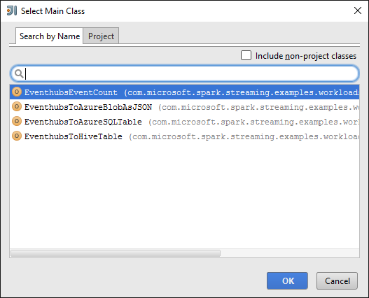

<properties 
    pageTitle="Use Hubs de evento do Azure com Spark Apache no HDInsight para processar dados streaming | Microsoft Azure" 
    description="Instruções passo a passo sobre como enviar um dados fluxo Hub de evento do Azure e recebem esses eventos no Spark usando um aplicativo de scala" 
    services="hdinsight" 
    documentationCenter="" 
    authors="nitinme" 
    manager="jhubbard" 
    editor="cgronlun"
    tags="azure-portal"/>

<tags 
    ms.service="hdinsight" 
    ms.workload="big-data" 
    ms.tgt_pltfrm="na" 
    ms.devlang="na" 
    ms.topic="article" 
    ms.date="09/30/2016" 
    ms.author="nitinme"/>

# Streaming Spark: Processar eventos com Hubs de evento do Azure com cluster Spark Apache no HDInsight Linux

Spark Streaming estende a API Spark para criar aplicativos de processamento de fluxo de tolerância, scalable alta produtividade principal. Podem ser incluídos dados de várias origens. Neste artigo, usamos Hubs de evento do Azure para inclusão de dados. Hubs de evento é um sistema de inclusão altamente escaláveis essa entrada can milhões de eventos por segundo. 

Neste tutorial, você aprenderá a criar um Hub de evento do Azure, como a inclusão de mensagens a um Hub de evento usando um aplicativo de console em Java e recuperá-las em paralelo usando um aplicativo de Spark escrito em Scala. Este aplicativo consome dados transmitidos por meio de Hubs de evento e a encaminha para diferentes saídas (Azure armazenamento de Blob, tabela de seção e tabela SQL).

> [AZURE.NOTE] Para seguir as instruções neste artigo, você terá que usar as duas versões do portal do Azure. Para criar um Hub de evento, você usará o [portal do Azure clássico](https://manage.windowsazure.com). Para trabalhar com o cluster HDInsight Spark, você usará o [Portal do Azure](https://portal.azure.com/).  

**Pré-requisitos:**

Você deve ter o seguinte:

- Uma assinatura do Azure. Consulte [avaliação gratuita do Azure obter](https://azure.microsoft.com/documentation/videos/get-azure-free-trial-for-testing-hadoop-in-hdinsight/).
- Um cluster de Apache Spark. Para obter instruções, consulte [criar Apache Spark clusters no Azure HDInsight](hdinsight-apache-spark-jupyter-spark-sql.md).
- Kit de desenvolvimento Java Oracle. Você pode instalá-lo [aqui](http://www.oracle.com/technetwork/java/javase/downloads/jdk8-downloads-2133151.html).
- Um Java IDE. Este artigo usa IDEIA IntelliJ 15.0.1. Você pode instalá-lo [aqui](https://www.jetbrains.com/idea/download/).
- Driver JDBC da Microsoft para SQL Server, v 4.1 ou posterior. Isso é necessário para gravar os dados do evento em um banco de dados do SQL Server. Você pode instalá-lo [aqui](https://msdn.microsoft.com/sqlserver/aa937724.aspx).
- Um banco de dados do SQL Azure. Para obter instruções, consulte [criar um banco de dados SQL em minutos](../sql-database/sql-database-get-started.md).

## O que faz esta solução?

Isso é como a solução streaming flui:

1. Crie um Hub de evento do Azure que vai receber um fluxo de eventos.

2. Executar um aplicativo autônomo local que gera eventos e push Hub de evento do Azure. O aplicativo de exemplo que faz isso é publicado em [https://github.com/hdinsight/spark-streaming-data-persistence-examples](https://github.com/hdinsight/spark-streaming-data-persistence-examples).

2. Execute um aplicativo de streaming remotamente em um cluster de Spark que lê eventos streaming de Hub de evento do Azure e envia-para locais diferentes (Azure Blob, tabela de seção e tabela de banco de dados do SQL). 

## Criar Hub de evento Azure

1. No [Portal do Azure](https://manage.windowsazure.com), selecione **novo** > **Barramento de serviço** > **Hub de evento** > **Criar personalizada**.

2. Na tela **Adicionar um novo Hub de evento** , digite um **Nome de Hub do evento**, selecione a **região** para criar o hub e criar um novo namespace ou selecione um existente. Clique na **seta** para continuar.

    ![página 1 do assistente] (./media/hdinsight-apache-spark-eventhub-streaming/hdispark.streaming.create.event.hub.png "Criar um Hub de evento Azure")

    > [AZURE.NOTE] Você deve selecionar no mesmo **local** como seu cluster Spark Apache no HDInsight para reduzir a latência e custos.

3. Na tela **Configurar Hub de evento** , insira os valores de **contagem de partição** e **Retenção de mensagens** e, em seguida, clique na marca de seleção. Para este exemplo, use uma contagem de partição de 10 e uma retenção de mensagem de 1. Observe a contagem de partição porque você precisará esse valor mais tarde.

    ![página 2 do assistente] (./media/hdinsight-apache-spark-eventhub-streaming/hdispark.streaming.create.event.hub2.png "Dias de retenção e tamanho de partição de especificar do Hub de evento")

4. Clique o Hub de eventos que você criou, clique em **Configurar**e, em seguida, criar duas diretivas de acesso para o hub de evento.

    <table>
    <tr><th>Nome</th><th>Permissões</th></tr>
    <tr><td>mysendpolicy</td><td>Enviar</td></tr>
    <tr><td>myreceivepolicy</td><td>Ouvir</td></tr>
    </table>

    Depois de criar as permissões, selecione o ícone de **Salvar** na parte inferior da página. Isso cria as políticas de acesso compartilhado que serão usadas para enviar (**mysendpolicy**) e ouvir (**myreceivepolicy**) este Hub de evento.

    ![políticas] (./media/hdinsight-apache-spark-eventhub-streaming/hdispark.streaming.event.hub.policies.png "Hub de evento criar políticas")

    
5. Na mesma página, anote as teclas de política gerado para as duas diretivas. Salve estas teclas porque eles serão usados mais tarde.

    ![teclas de política] (./media/hdinsight-apache-spark-eventhub-streaming/hdispark.streaming.event.hub.policy.keys.png "Salvar chaves de política")

6. Na página do **painel** , clique em **Informações de Conexão** da parte inferior para recuperar e salvar as cadeias de caracteres de conexão para o Hub de evento usando as duas diretivas.

    ![teclas de política] (./media/hdinsight-apache-spark-eventhub-streaming/hdispark.streaming.event.hub.policy.connection.strings.png "Salvar cadeias de caracteres de conexão de política")

## Use um aplicativo de Scala para enviar mensagens para Hub de evento

Nesta seção você use um aplicativo de Scala local autônomo para enviar um fluxo de eventos hub de evento do Azure que você criou na etapa anterior. Este aplicativo está disponível no GitHub em [https://github.com/hdinsight/eventhubs-sample-event-producer](https://github.com/hdinsight/eventhubs-sample-event-producer). Veja as etapas presumem que você já tiver bifurcada este repositório GitHub.

1. Abra o aplicativo, **EventhubsSampleEventProducer**, no IntelliJ IDEIA.
    
2. Crie o projeto. No menu **Build** , clique em **Tornar o projeto**. O jar de saída é criado em **\out\artifacts**.

>[AZURE.TIP] Você também pode usar uma opção disponível no IntelliJ IDEIA criar diretamente o projeto de um repositório GitHub. Para compreender como usar essa abordagem, use as instruções na próxima seção para obter orientação. Observe que muitas etapas descritas na próxima seção não será aplicável para o aplicativo de Scala criados por você nesta etapa. Por exemplo:

> * Você não precisará atualizar o POM para incluir a versão Spark. Isso ocorre porque não há nenhuma dependência no Spark para criar este aplicativo
> * Você não precisará adicionar alguns jars de dependência na biblioteca de projeto. Isso ocorre porque esses jars não são necessárias para esse projeto.

## Atualizar o Scala streaming aplicativo para receber os eventos

Um aplicativo de Scala de amostra para receber o evento e encaminhá-lo para diferentes destinos está disponível em [https://github.com/hdinsight/spark-streaming-data-persistence-examples](https://github.com/hdinsight/spark-streaming-data-persistence-examples). Siga as etapas abaixo para atualizar o aplicativo e crie o jar de saída.

1. Iniciar IntelliJ IDEIA e na tela Iniciar, selecione **Check-out do controle de versão** e clique em **gito**.
        
    

2. Na caixa de diálogo **Clonar repositório** , fornece a URL para o repositório de gito para clonar de, especifique o diretório de clonar para e clique em **clonar**.

    

    
3. Siga os prompts até que o projeto é completamente duplicado. Pressione **Alt + 1** para abrir o **Modo de exibição do Project**. Ele deve ser semelhante ao seguinte.

    
    
4. Verifique se que o código do aplicativo é compilado com Java8. Para garantir isso, clique em **arquivo**, clique em **Estrutura de projeto**e na guia **projeto** , verifique se o nível de idioma do projeto está definido como **8 - Lambdas, anotações de tipo, etc**.

    

5. Abra o **pom.xml** e verifique se que a versão de Spark está correta. Em <properties> nó, procure o trecho a seguir e verificar a versão de Spark.

        <scala.version>2.10.4</scala.version>
        <scala.compat.version>2.10.4</scala.compat.version>
        <scala.binary.version>2.10</scala.binary.version>
        <spark.version>1.6.2</spark.version>
    
5. O aplicativo requer dois jars de dependência:

    * **Jar de receptor de EventHub**. Isso é necessário para Spark receber as mensagens de evento Hub. Para usar este jar, atualize o **pom.xml** para adicionar o seguinte em `<dependencies>`.

            <dependency>
              <groupId>com.microsoft.azure</groupId>
              <artifactId>spark-streaming-eventhubs_2.10</artifactId>
              <version>1.6.0</version>
            </dependency> 

    * **Jar de driver JDBC**. Isso é necessário para escrever as mensagens recebidas de Hub de evento em um banco de dados do SQL Azure. Você pode baixar v 4.1 ou posterior deste arquivo jar [aqui](https://msdn.microsoft.com/sqlserver/aa937724.aspx). Adicione referência a esse jar na biblioteca do projeto. Execute as seguintes etapas:

        1. IntelliJ IDEIA na janela de onde você tiver o aplicativo abrir, clique em **arquivo**, clique em **Estrutura de projeto**e, em seguida, clique em **bibliotecas**. 
        
        2. Clique no ícone Adicionar (), clique em **Java**e, em seguida, navegue até o local onde você baixou o jar de driver JDBC. Siga os prompts para adicionar o arquivo jar para a biblioteca de projeto.

            ![Adicionar dependências ausentes] (./media/hdinsight-apache-spark-eventhub-streaming/add-missing-dependency-jars.png "Adicionar jars de dependência ausentes")

        3. Clique em **Aplicar**.

6. Crie o arquivo de jar de saída. Execute as etapas a seguir.
    1. Na caixa de diálogo **Estrutura de projeto** , clique em **artefatos** e clique no símbolo de adição. Na caixa de diálogo pop-up, clique **JAR**e, em seguida, clique em **de módulos com dependências**.

        

    1. Na caixa de diálogo **Criar JAR de módulos** , clique nas reticências () em relação a **Classe principal**.

    1. Na caixa de diálogo **Selecionar classe principal** , selecione qualquer uma das classes disponíveis e clique em **Okey**.

        

    1. Na caixa de diálogo **Criar JAR de módulos** , certifique-se de que a opção para **extrair o destino JAR** está selecionada e clique em **Okey**. Isso cria um único JAR com todas as dependências.

        

    1. Na guia **Layout de saída** lista todos os jars estão incluídos como parte do projeto Maven. Você pode selecionar e excluir aquelas em que o aplicativo Scala não tem nenhuma dependência direta. Para o aplicativo que estamos criando aqui, você pode remover todos, exceto o último um (**microsoft-spark-streaming-exemplos compilam saída**). Selecione os jars excluir e clique no ícone **Excluir** ().

        

        Verifique se caixa **desenvolver tornar** estiver selecionada, que garante que o jar é criado sempre que o projeto é criado ou atualizado. Clique em **Aplicar** e, em seguida, **Okey**.

    1. Na guia **Layout de saída** , à direita na parte inferior da caixa **Elementos disponíveis** , você tem o jar SQL JDBC que você adicionou anteriormente para a biblioteca de projeto. Você deve adicionar isso para a guia **Layout de saída** . O arquivo jar de atalho e, em seguida, clique em **Extrair em raiz de saída**.

          

        Na guia **Layout de saída** agora deve ficar assim.

             

        Na caixa de diálogo **Estrutura de projeto** , clique em **Aplicar** e clique em **Okey**. 

    1. Na barra de menus, clique em **criar**e, em seguida, clique em **Tornar projeto**. Você também pode clicar em **Criar artefatos** para criar o jar. O jar de saída é criado em **\out\artifacts**.

        

## Execute os aplicativos remotamente em um cluster de Spark usando Livy

Usaremos Livy para executar o aplicativo de streaming remotamente em um cluster de Spark. Para informações detalhadas sobre como usar Livy com cluster HDInsight Spark, consulte [enviar trabalhos remotamente para um cluster de Apache Spark em Azurehdinsight](hdinsight-apache-spark-livy-rest-interface.md). Antes de iniciar executando os trabalhos remotos eventos de fluxo usando Spark há algumas coisas que você deve fazer:

1. Iniciar o aplicativo autônomo local para gerar eventos e enviada ao Hub de evento. Use o seguinte comando para fazê-lo:

        java -cp EventhubsSampleEventProducer.jar com.microsoft.eventhubs.client.example.EventhubsClientDriver --eventhubs-namespace "mysbnamespace" --eventhubs-name "myeventhub" --policy-name "mysendpolicy" --policy-key "<policy key>" --message-length 32 --thread-count 32 --message-count -1

2. Copie o jar streaming (**microsoft-spark-streaming-examples.jar**) para o armazenamento de Blob do Azure associado ao cluster. Isso tornará o jar acessíveis para Livy. Você pode usar [**AzCopy**](../storage/storage-use-azcopy.md), um utilitário de linha de comando, para fazê-lo. Existem muitos outros clientes que você pode usar para carregar dados. Você pode encontrar mais sobre eles em [carregar dados para trabalhos de Hadoop em HDInsight](hdinsight-upload-data.md).

3. Instale o ONDULAÇÃO no computador onde você está executando esses aplicativos a partir. Usamos ONDULAÇÃO para invocar os pontos de extremidade Livy para executar os trabalhos remotamente.

### Execute os aplicativos para receber os eventos em um Blob de armazenamento do Azure como texto

Abra um prompt de comando, navegue até a pasta onde você instalou ONDULAÇÃO e execute o seguinte comando (substituir nome de usuário/senha e cluster nome):

    curl -k --user "admin:mypassword1!" -v -H "Content-Type: application/json" -X POST --data @C:\Temp\inputBlob.txt "https://mysparkcluster.azurehdinsight.net/livy/batches"

Os parâmetros no arquivo **inputBlob.txt** são definidos da seguinte maneira:

    { "file":"wasbs:///example/jars/microsoft-spark-streaming-examples.jar", "className":"com.microsoft.spark.streaming.examples.workloads.EventhubsEventCount", "args":["--eventhubs-namespace", "mysbnamespace", "--eventhubs-name", "myeventhub", "--policy-name", "myreceivepolicy", "--policy-key", "<put-your-key-here>", "--consumer-group", "$default", "--partition-count", 10, "--batch-interval-in-seconds", 20, "--checkpoint-directory", "/EventCheckpoint", "--event-count-folder", "/EventCount/EventCount10"], "numExecutors":20, "executorMemory":"1G", "executorCores":1, "driverMemory":"2G" }

Vamos Entenda quais são os parâmetros no arquivo de entrada:

* **arquivo** é o caminho para o arquivo de jar de aplicativo na conta de armazenamento do Azure associado ao cluster.
* **nome da classe** é o nome da classe no jar.
* **argumentos** é a lista de argumentos necessários pela classe
* **numExecutors** é o número de cores usadas pelo Spark para executar o aplicativo de streaming. Isso deve ser sempre pelo menos duas vezes o número de partições de Hub de evento.
* **executorMemory**, **executorCores**, **driverMemory** são usados para atribuir recursos necessários para o aplicativo de streaming de parâmetros.

>[AZURE.NOTE] Você não precisa criar as pastas de saída (EventCheckpoint, EventCount/EventCount10) que são usadas como parâmetros. O aplicativo de streaming cria-los para você.
    
Quando você executa o comando, você deverá ver uma saída semelhante ao seguinte:

    < HTTP/1.1 201 Created
    < Content-Type: application/json; charset=UTF-8
    < Location: /18
    < Server: Microsoft-IIS/8.5
    < X-Powered-By: ARR/2.5
    < X-Powered-By: ASP.NET
    < Date: Tue, 01 Dec 2015 05:39:10 GMT
    < Content-Length: 37
    <
    {"id":1,"state":"starting","log":[]}* Connection #0 to host mysparkcluster.azurehdinsight.net left intact

Anote a ID de lote na última linha da saída (no exemplo é '1'). Para verificar que o aplicativo seja executado com êxito, você pode examinar sua conta de armazenamento do Azure associada ao cluster e você deverá ver a pasta de **/EventCount/EventCount10** criada. Esta pasta deve conter bolhas que captura o número de eventos processados dentro do período de tempo especificado para o parâmetro **lote intervalo em segundos**.

O aplicativo continuará a ser executado até você eliminá-lo. Para fazer isso, use o seguinte comando:

    curl -k --user "admin:mypassword1!" -v -X DELETE "https://mysparkcluster.azurehdinsight.net/livy/batches/1"

### Execute os aplicativos para receber os eventos em um Blob de armazenamento do Azure como JSON

Abra um prompt de comando, navegue até a pasta onde você instalou ONDULAÇÃO e execute o seguinte comando (substituir nome de usuário/senha e cluster nome):

    curl -k --user "admin:mypassword1!" -v -H "Content-Type: application/json" -X POST --data @C:\Temp\inputJSON.txt "https://mysparkcluster.azurehdinsight.net/livy/batches"

Os parâmetros no arquivo **inputJSON.txt** são definidos da seguinte maneira:

    { "file":"wasbs:///example/jars/microsoft-spark-streaming-examples.jar", "className":"com.microsoft.spark.streaming.examples.workloads.EventhubsToAzureBlobAsJSON", "args":["--eventhubs-namespace", "mysbnamespace", "--eventhubs-name", "myeventhub", "--policy-name", "myreceivepolicy", "--policy-key", "<put-your-key-here>", "--consumer-group", "$default", "--partition-count", 10, "--batch-interval-in-seconds", 20, "--checkpoint-directory", "/EventCheckpoint", "--event-count-folder", "/EventCount/EventCount10", "--event-store-folder", "/EventStore10"], "numExecutors":20, "executorMemory":"1G", "executorCores":1, "driverMemory":"2G" }

Os parâmetros são semelhantes às que você especificou para a saída de texto, na etapa anterior. Novamente, você não precisa criar as pastas de saída (EventCheckpoint, EventCount/EventCount10) que são usadas como parâmetros. O aplicativo de streaming cria-los para você.

 Depois de executar o comando, você pode examinar sua conta de armazenamento do Azure associada ao cluster e você deverá ver a pasta de **/EventStore10** criada. Abrir qualquer arquivo prefixo **parte** e você verá os eventos processados em um formato JSON.

### Execute os aplicativos para receber os eventos em uma tabela de seção

Para executar o aplicativo que fluxos eventos em uma tabela de seção que você precisa de alguns componentes adicionais. Estas são:

* datanucleus-api-jdo-3.2.6.jar
* datanucleus-rdbms-3.2.9.jar
* datanucleus-core-3.2.10.jar
* seção site.xml

Os arquivos **. jar** estão disponíveis em seu cluster HDInsight Spark em `/usr/hdp/current/spark-client/lib`. A **seção site.xml** está disponível em `/usr/hdp/current/spark-client/conf`.

Você pode usar [WinScp](http://winscp.net/eng/download.php) para copiar esses arquivos do cluster para seu computador local. Em seguida, você pode usar ferramentas para copiar esses arquivos para sua conta de armazenamento associada ao cluster. Para obter mais informações sobre como carregar arquivos para a conta de armazenamento, consulte [carregar dados para trabalhos de Hadoop em HDInsight](hdinsight-upload-data.md).

Depois que você copiou os arquivos para sua conta de armazenamento do Azure, abra um prompt de comando, navegue até a pasta onde você instalou ONDULAÇÃO e execute o seguinte comando (substituir nome de usuário/senha e cluster nome):

    curl -k --user "admin:mypassword1!" -v -H "Content-Type: application/json" -X POST --data @C:\Temp\inputHive.txt "https://mysparkcluster.azurehdinsight.net/livy/batches"

Os parâmetros no arquivo **inputHive.txt** são definidos da seguinte maneira:

    { "file":"wasbs:///example/jars/microsoft-spark-streaming-examples.jar", "className":"com.microsoft.spark.streaming.examples.workloads.EventhubsToHiveTable", "args":["--eventhubs-namespace", "mysbnamespace", "--eventhubs-name", "myeventhub", "--policy-name", "myreceivepolicy", "--policy-key", "<put-your-key-here>", "--consumer-group", "$default", "--partition-count", 10, "--batch-interval-in-seconds", 20, "--checkpoint-directory", "/EventCheckpoint", "--event-count-folder", "/EventCount/EventCount10", "--event-hive-table", "EventHiveTable10" ], "jars":["wasbs:///example/jars/datanucleus-api-jdo-3.2.6.jar", "wasbs:///example/jars/datanucleus-rdbms-3.2.9.jar", "wasbs:///example/jars/datanucleus-core-3.2.10.jar"], "files":["wasbs:///example/jars/hive-site.xml"], "numExecutors":20, "executorMemory":"1G", "executorCores":1, "driverMemory":"2G" }

Os parâmetros são semelhantes às que você especificou para a saída de texto, nas etapas anteriores. Novamente, você não precisa criar as pastas de saída (EventCheckpoint, EventCount/EventCount10) ou a saída da tabela de seção (EventHiveTable10) que são usados como parâmetros. O aplicativo de streaming cria-los para você. Observe que a opção **jars** e **arquivos** inclui caminhos para os arquivos. jar e o site.xml de seção que você copiou sobre a conta de armazenamento.

Para verificar que a tabela de seção foi criada com êxito, você poderá SSH para o cluster e executar consultas de seção. Para obter instruções, consulte a [Seção uso com Hadoop em HDInsight com o SSH](hdinsight-hadoop-use-hive-ssh.md). Quando você estiver conectado usando SSH, você pode executar o comando a seguir para verificar se a tabela de seção, **EventHiveTable10**, é criada.

    show tables;

Você deve ver uma saída semelhante à seguinte:

    OK
    eventhivetable10
    hivesampletable

Você também pode executar uma consulta seleção para exibir o conteúdo da tabela.

    SELECT * FROM eventhivetable10 LIMIT 10;

Você deve ver uma saída semelhante ao seguinte:

    ZN90apUSQODDTx7n6Toh6jDbuPngqT4c
    sor2M7xsFwmaRW8W8NDwMneFNMrOVkW1
    o2HcsU735ejSi2bGEcbUSB4btCFmI1lW
    TLuibq4rbj0T9st9eEzIWJwNGtMWYoYS
    HKCpPlWFWAJILwR69MAq863nCWYzDEw6
    Mvx0GQOPYvPR7ezBEpIHYKTKiEhYammQ
    85dRppSBSbZgThLr1s0GMgKqynDUqudr
    5LAWkNqorLj3ZN9a2mfWr9rZqeXKN4pF
    ulf9wSFNjD7BZXCyunozecov9QpEIYmJ
    vWzM3nvOja8DhYcwn0n5eTfOItZ966pa
    Time taken: 4.434 seconds, Fetched: 10 row(s)

### Execute os aplicativos para receber os eventos em uma tabela de banco de dados do SQL Azure

Antes de executar esta etapa, verifique se que você tem um banco de dados do SQL Azure criado. Você precisará valores para nome do banco de dados, o nome de servidor de banco de dados e as credenciais de administrador de banco de dados como parâmetros. Você não precisa criar a tabela de banco de dados apesar. O aplicativo de streaming que cria para você.

Abra um prompt de comando, navegue até a pasta onde você instalou ONDULAÇÃO e execute o seguinte comando:

    curl -k --user "admin:mypassword1!" -v -H "Content-Type: application/json" -X POST --data @C:\Temp\inputSQL.txt "https://mysparkcluster.azurehdinsight.net/livy/batches"

Os parâmetros no arquivo **inputSQL.txt** são definidos da seguinte maneira:

    { "file":"wasbs:///example/jars/microsoft-spark-streaming-examples.jar", "className":"com.microsoft.spark.streaming.examples.workloads.EventhubsToAzureSQLTable", "args":["--eventhubs-namespace", "mysbnamespace", "--eventhubs-name", "myeventhub", "--policy-name", "myreceivepolicy", "--policy-key", "<put-your-key-here>", "--consumer-group", "$default", "--partition-count", 10, "--batch-interval-in-seconds", 20, "--checkpoint-directory", "/EventCheckpoint", "--event-count-folder", "/EventCount/EventCount10", "--sql-server-fqdn", "<database-server-name>.database.windows.net", "--sql-database-name", "mysparkdatabase", "--database-username", "sparkdbadmin", "--database-password", "<put-password-here>", "--event-sql-table", "EventContent" ], "numExecutors":20, "executorMemory":"1G", "executorCores":1, "driverMemory":"2G" }

Para verificar que o aplicativo seja executado com êxito, você pode se conectar ao banco de dados SQL Azure usando o SQL Server Management Studio. Para obter instruções sobre como fazer isso, consulte [conectar ao banco de dados do SQL com o SQL Server Management Studio](../sql-database/sql-database-connect-query-ssms.md). Quando você estiver conectado ao banco de dados, você pode navegar para a tabela de **EventContent** que foi criada pelo aplicativo de streaming. Você pode executar uma consulta rápida para obter os dados da tabela. Execute a seguinte consulta:

    SELECT * FROM EventCount

Você deve ver o resultado similar ao seguinte:

    00046b0f-2552-4980-9c3f-8bba5647c8ee
    000b7530-12f9-4081-8e19-90acd26f9c0c
    000bc521-9c1b-4a42-ab08-dc1893b83f3b
    00123a2a-e00d-496a-9104-108920955718
    0017c68f-7a4e-452d-97ad-5cb1fe5ba81b
    001KsmqL2gfu5ZcuQuTqTxQvVyGCqPp9
    001vIZgOStka4DXtud0e3tX7XbfMnZrN
    00220586-3e1a-4d2d-a89b-05c5892e541a
    0029e309-9e54-4e1b-84be-cd04e6fce5ec
    003333cf-874f-4045-9da3-9f98c2b4ea49
    0043c07e-8d73-420a-9af7-1fcb94575356
    004a11a9-0c2c-4bc0-a7d5-2e0ebd947ab9

    
## Consulte também

* [Visão geral: Apache Spark no Azure HDInsight](hdinsight-apache-spark-overview.md)

### Cenários

* [Spark com BI: executar análise de dados interativos usando Spark em HDInsight com ferramentas de BI](hdinsight-apache-spark-use-bi-tools.md)

* [Spark com aprendizado de máquina: Spark de uso em HDInsight para analisar a temperatura de construção usando dados HVAC](hdinsight-apache-spark-ipython-notebook-machine-learning.md)

* [Spark com aprendizado de máquina: Spark de uso em HDInsight prever resultados da inspeção de alimentos](hdinsight-apache-spark-machine-learning-mllib-ipython.md)

* [Análise de log de site usando Spark no HDInsight](hdinsight-apache-spark-custom-library-website-log-analysis.md)

### Criar e executar aplicativos

* [Criar um aplicativo autônomo usando Scala](hdinsight-apache-spark-create-standalone-application.md)

* [Executar trabalhos remotamente em um cluster de Spark usando Livy](hdinsight-apache-spark-livy-rest-interface.md)

### Ferramentas e extensões

* [Usar o plug-in de ferramentas de HDInsight para IntelliJ IDEIA para criar e enviar Spark Scala aplicativos](hdinsight-apache-spark-intellij-tool-plugin.md)

* [Usar o plug-in de ferramentas de HDInsight para IntelliJ IDEIA para depurar aplicativos de Spark remotamente](hdinsight-apache-spark-intellij-tool-plugin-debug-jobs-remotely.md)

* [Usar blocos de anotações de Zeppelin com um cluster Spark em HDInsight](hdinsight-apache-spark-use-zeppelin-notebook.md)

* [Kernels disponíveis para o bloco de anotações de Jupyter em cluster Spark para HDInsight](hdinsight-apache-spark-jupyter-notebook-kernels.md)

* [Usar os pacotes externos com blocos de anotações de Jupyter](hdinsight-apache-spark-jupyter-notebook-use-external-packages.md)

* [Instalar Jupyter no seu computador e se conectar a um cluster de HDInsight Spark](hdinsight-apache-spark-jupyter-notebook-install-locally.md)

### Gerenciar recursos

* [Gerenciar recursos para cluster Spark Apache no Azure HDInsight](hdinsight-apache-spark-resource-manager.md)

* [Rastrear e depurar trabalhos em execução em um cluster de Apache Spark em HDInsight](hdinsight-apache-spark-job-debugging.md)

[hdinsight-versions]: hdinsight-component-versioning.md
[hdinsight-upload-data]: hdinsight-upload-data.md
[hdinsight-storage]: hdinsight-hadoop-use-blob-storage.md

[azure-purchase-options]: http://azure.microsoft.com/pricing/purchase-options/
[azure-member-offers]: http://azure.microsoft.com/pricing/member-offers/
[azure-free-trial]: http://azure.microsoft.com/pricing/free-trial/
[azure-management-portal]: https://manage.windowsazure.com/
[azure-create-storageaccount]: ../storage-create-storage-account/ 
