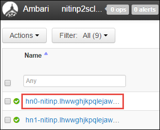
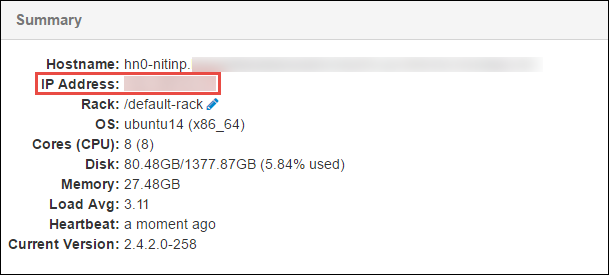
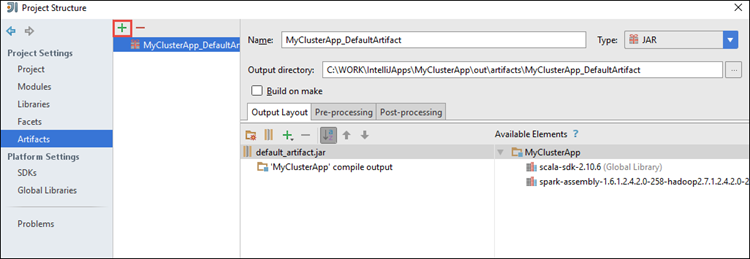
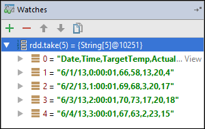
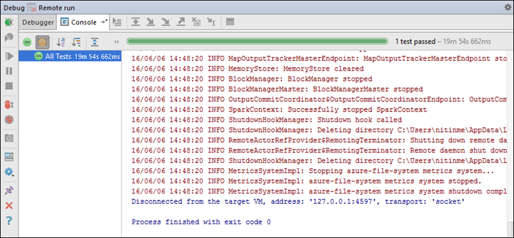

 <properties
    pageTitle="Use as ferramentas de HDInsight do Kit de ferramentas do Azure para IntelliJ para depurar remotamente aplicativos executados em clusters de HDInsight Spark | Microsoft Azure"
    description="Saiba como usar as ferramentas de HDInsight do Kit de ferramentas do Azure para IntelliJ para depurar remotamente aplicativos executados em clusters de HDInsight Spark."
    services="hdinsight"
    documentationCenter=""
    authors="nitinme"
    manager="jhubbard"
    editor="cgronlun"
    tags="azure-portal"/>

<tags
    ms.service="hdinsight"
    ms.workload="big-data"
    ms.tgt_pltfrm="na"
    ms.devlang="na"
    ms.topic="article"
    ms.date="09/09/2016"
    ms.author="nitinme"/>

# Use as ferramentas de HDInsight do Kit de ferramentas do Azure para IntelliJ para depurar aplicativos Spark remotamente em cluster de HDInsight Spark Linux

Este artigo fornece orientações passo a passo sobre como usar as ferramentas de HDInsight no Kit de ferramentas do Azure para IntelliJ para enviar um trabalho Spark em cluster HDInsight Spark e depurar-remotamente a partir de seu computador desktop. Para fazer isso, você deve executar as seguintes etapas de alto nível:

1. Crie uma rede de Virtual Azure-to-site ou ponto-a-site. As etapas neste documento presumem que você usa uma rede to-site.

2. Crie um cluster de Spark no Azure HDInsight que faz parte da rede Virtual-to-site Azure.

3. Verificar a conectividade entre o headnode cluster e sua área de trabalho.

4. Criar um aplicativo de Scala no IntelliJ IDEIA e configure-o para depuração remota.

5. Executar e depurar o aplicativo.

##Pré-requisitos

* Uma assinatura do Azure. Consulte [avaliação gratuita do Azure obter](https://azure.microsoft.com/documentation/videos/get-azure-free-trial-for-testing-hadoop-in-hdinsight/).

* Um cluster de Apache Spark no HDInsight Linux. Para obter instruções, consulte [criar Apache Spark clusters no Azure HDInsight](hdinsight-apache-spark-jupyter-spark-sql.md).
 
* Kit de desenvolvimento Java Oracle. Você pode instalá-lo [aqui](http://www.oracle.com/technetwork/java/javase/downloads/jdk8-downloads-2133151.html).
 
* IntelliJ IDEIA. Este artigo usa versão 15.0.1. Você pode instalá-lo [aqui](https://www.jetbrains.com/idea/download/).
 
* Ferramentas de HDInsight do Azure Kit de ferramentas para IntelliJ. Ferramentas de HDInsight para IntelliJ estão disponíveis como parte do Kit de ferramentas do Azure para IntelliJ. Para obter instruções sobre como instalar o Kit de ferramentas do Azure, consulte [instalar o Kit de ferramentas do Azure para IntelliJ](../azure-toolkit-for-intellij-installation.md).

* Efetue login em sua assinatura do Azure do IntelliJ IDEIA. Siga as instruções [aqui](hdinsight-apache-spark-intellij-tool-plugin.md#log-into-your-azure-subscription).
 
* Enquanto estiver executando o aplicativo de Spark Scala para depuração remota em um computador Windows, você pode receber uma exceção, como explicado em [SPARK 2356](https://issues.apache.org/jira/browse/SPARK-2356) que ocorre devido a um WinUtils.exe ausente no Windows. Para contornar esse erro, você deve [baixar o arquivo executável a partir daqui](http://public-repo-1.hortonworks.com/hdp-win-alpha/winutils.exe) para um local como **C:\WinUtils\bin**. Em seguida, adicione uma variável de ambiente **HADOOP_HOME** e defina o valor da variável como **C\WinUtils**.

## Etapa 1: Criar uma rede Virtual Azure

Siga as instruções dos links a seguir para criar uma rede Virtual do Azure e verificar a conectividade entre a área de trabalho e a rede Virtual do Azure.

* [Criar um VNet com uma conexão de VPN-to-site usando o Portal do Azure](../vpn-gateway/vpn-gateway-howto-site-to-site-resource-manager-portal.md)
* [Criar um VNet com uma conexão de VPN-to-site usando o PowerShell](../vpn-gateway/vpn-gateway-create-site-to-site-rm-powershell.md)
* [Configurar uma conexão ponto-a-site a uma rede virtual usando o PowerShell](../vpn-gateway/vpn-gateway-howto-point-to-site-rm-ps.md)

## Etapa 2: Criar um cluster de HDInsight Spark

Você também deve criar um cluster de Apache Spark em Azurehdinsight que faz parte da rede Virtual Azure que você criou. Use as informações disponíveis na [baseados em Linux criar clusters no HDInsight](hdinsight-hadoop-provision-linux-clusters.md). Como parte da configuração opcional, selecione a rede Virtual do Azure que você criou na etapa anterior.

## Etapa 3: Confirmar a conectividade entre o headnode cluster e sua área de trabalho

1. Obtenha o endereço IP da headnode. Abra Ambari UI para o cluster. Da lâmina cluster, clique em **Painel de controle**.

    

2. Do UI Ambari, do canto superior direito, clique em **Hosts**.

    

3. Você deve ver uma lista de headnodes, nós de trabalho e zookeeper. Os headnodes têm o **hn*** prefixo. Clique na primeira headnode.

    

4. Na parte inferior da página que é aberta, na caixa de **Resumo** , copie o endereço IP do headnode e o nome de host.

    

5. Inclua o endereço IP e o nome de host do headnode ao arquivo **hosts** no computador onde você deseja executar e depurar remotamente os trabalhos Spark. Isso permitirá que você se comunique com o headnode usando o endereço IP, bem como o nome de host.

    1. Abra um bloco de notas com permissões elevadas. No menu Arquivo, clique em **Abrir** e, em seguida, navegue até o local do arquivo hosts. Em um computador Windows, é `C:\Windows\System32\Drivers\etc\hosts`.

    2. Adicione o seguinte ao arquivo **hosts** .

            # For headnode0
            192.xxx.xx.xx hn0-nitinp
            192.xxx.xx.xx hn0-nitinp.lhwwghjkpqejawpqbwcdyp3.gx.internal.cloudapp.net

            # For headnode1
            192.xxx.xx.xx hn1-nitinp
            192.xxx.xx.xx hn1-nitinp.lhwwghjkpqejawpqbwcdyp3.gx.internal.cloudapp.net

5. No computador que você conectado à rede Virtual Azure que é usado pelo cluster HDInsight, verifique se que você pode executar ping ambas as os headnodes usando o endereço IP, bem como o nome de host.

6. SSH para o headnode cluster seguindo as instruções em [conectar a um cluster de HDInsight usando SSH](hdinsight-hadoop-linux-use-ssh-windows.md#connect-to-a-linux-based-hdinsight-cluster). De headnode cluster, ping do endereço IP do computador desktop. Você deve testar a conectividade com os endereços IP atribuídos ao computador, um para a conexão de rede e outra para a rede Virtual do Azure que o computador está conectado ao.

7. Repita as etapas para outro headnode. 

## Etapa 4: Criar um aplicativo de Spark Scala usando as ferramentas de HDInsight do Kit de ferramentas do Azure para IntelliJ e configurá-lo para depuração remota

1. Inicie a IDEIA IntelliJ e crie um novo projeto. Na caixa de diálogo Novo projeto, verifique as seguintes opções e clique em **Avançar**.

    

    * No painel esquerdo, selecione **HDInsight**.
    * No painel direito, selecione **Spark em HDInsight (Scala)**.
    * Clique em **Avançar**.

2. Na próxima janela, forneça os detalhes do projeto.

    * Forneça um nome de projeto e o local do projeto.
    * Para o **SDK do projeto**, certificar-se de que você forneça uma versão de Java maior que 7.
    * Para **Scala SDK**, clique em **criar**, clique em **Download**e, em seguida, selecione a versão do Scala usar. **Certificar-se de que você não use versão 2.11.x**. Este exemplo utiliza a versão **2.10.6**.

        

    * Para **Spark SDK**, baixar e usar o SDK do [aqui](http://go.microsoft.com/fwlink/?LinkID=723585&clcid=0x409). Você também pode ignorar isso e use o [Repositório Maven Spark](http://mvnrepository.com/search?q=spark) , no entanto, verifique se você tem o repositório maven direita instalado para desenvolver aplicativos Spark. (Por exemplo, você precisa verificar se que você tem a parte Spark Streaming instalada se você estiver usando Spark Streaming; Também, verifique se que você estiver utilizando o repositório marcado como Scala 2.10 - não use o repositório marcado como Scala 2.11.)

        

    * Clique em **Concluir**.

3. O projeto Spark criará automaticamente um artefato para você. Para ver o artefato, siga estas etapas.

    1. No menu **arquivo** , clique em **Estrutura de projeto**.
    2. Na caixa de diálogo **Estrutura de projeto** , clique em **artefatos** para ver o artefato padrão que é criado.

        

    Você também pode criar seu próprios artefato bly clicar na **+** ícone, realçado na imagem acima.

4. Na caixa de diálogo **Estrutura de projeto** , clique em **projeto**. Se o **SDK do projeto** é definido como 1,8, verifique se o **nível de idioma do projeto** é definido como **7 - losangos, etc do BRAÇO, vários variável,**.

    

4. Adicione bibliotecas ao seu projeto. Para adicionar uma biblioteca, clique com botão direito no nome do projeto na árvore do projeto e clique em **Abrir configurações de módulo**. Na caixa de diálogo **Estrutura de projeto** , no painel esquerdo, clique em **bibliotecas**, clique em (+) símbolo e clique em **Do Maven**. 

     

    Na caixa de diálogo **Biblioteca de Download do repositório Maven** , pesquisar e adicione as seguintes bibliotecas.

    * `org.scalatest:scalatest_2.10:2.2.1`
    * `org.apache.hadoop:hadoop-azure:2.7.1`

5. Cópia `yarn-site.xml` e `core-site.xml` de headnode o cluster e adicioná-la ao projeto. Use os seguintes comandos para copiar os arquivos. Você pode usar [Cygwin](https://cygwin.com/install.html) para executar o seguinte `scp` comandos para copiar os arquivos de headnodes o cluster.

        scp <ssh user name>@<headnode IP address or host name>://etc/hadoop/conf/core-site.xml .

    Porque nós já adicionou o endereço IP do cluster headnode e nomes de host fo os hosts de arquivos na área de trabalho, podemos usar os comandos de **scp** da seguinte maneira.

        scp sshuser@hn0-nitinp:/etc/hadoop/conf/core-site.xml .
        scp sshuser@hn0-nitinp:/etc/hadoop/conf/yarn-site.xml .

    Adicionar esses arquivos ao seu projeto, copiando-as na pasta **/src** na árvore seu projeto, por exemplo `<your project directory>\src`.

6. Atualizar o `core-site.xml` para fazer as seguintes alterações.

    1. `core-site.xml`inclui a chave criptografada para a conta de armazenamento associada ao cluster. No `core-site.xml` que você adicionou ao projeto, substituir a chave criptografada com a chave de armazenamento real associados à conta de armazenamento de padrão. Consulte [Gerenciar suas chaves de acesso de armazenamento](../storage/storage-create-storage-account.md#manage-your-storage-account).

            <property>
                <name>fs.azure.account.key.hdistoragecentral.blob.core.windows.net</name>
                <value>access-key-associated-with-the-account</value>
            </property>

    2. Remova as seguintes entradas do `core-site.xml`.

            <property>
                <name>fs.azure.account.keyprovider.hdistoragecentral.blob.core.windows.net</name>
                <value>org.apache.hadoop.fs.azure.ShellDecryptionKeyProvider</value>
            </property>

            <property>
                <name>fs.azure.shellkeyprovider.script</name>
                <value>/usr/lib/python2.7/dist-packages/hdinsight_common/decrypt.sh</value>
            </property>

            <property>
                <name>net.topology.script.file.name</name>
                <value>/etc/hadoop/conf/topology_script.py</value>
            </property>

    3. Salve o arquivo.

7. Adicione a classe principal para o seu aplicativo. Do **Explorador de projeto**, **src**de atalho, aponte para **novo**e, em seguida, clique em **classe Scala**.

    

8. Na caixa de diálogo **Criar nova classe Scala** , forneça um nome, **tipo** selecionar **objeto**e clique em **Okey**.

    

9. No `MyClusterAppMain.scala` arquivo, cole o seguinte código. Este código cria o Visual contexto e inicia um `executeJob` método a partir do `SparkSample` objeto.

        import org.apache.spark.{SparkConf, SparkContext}

        object SparkSampleMain {
          def main (arg: Array[String]): Unit = {
            val conf = new SparkConf().setAppName("SparkSample")
                                      .set("spark.hadoop.validateOutputSpecs", "false")
            val sc = new SparkContext(conf)
        
            SparkSample.executeJob(sc,
                                   "wasbs:///HdiSamples/HdiSamples/SensorSampleData/hvac/HVAC.csv",
                                   "wasbs:///HVACOut")
          }
        }

10. Repita as etapas 8 e 9 acima para adicionar um novo objeto Scala chamado `SparkSample`. Para essa classe, adicione o seguinte código. Este código lê os dados a partir do HVAC.csv (disponível em todos os clusters HDInsight Spark), recupera as linhas que possuem apenas um dígito na coluna sétima de CSV e grava a saída **/HVACOut** sob o contêiner de armazenamento padrão para o cluster.

        import org.apache.spark.SparkContext
    
        object SparkSample {
          def executeJob (sc: SparkContext, input: String, output: String): Unit = {
            val rdd = sc.textFile(input)
        
            //find the rows which have only one digit in the 7th column in the CSV
            val rdd1 =  rdd.filter(s => s.split(",")(6).length() == 1)
        
            val s = sc.parallelize(rdd.take(5)).cartesian(rdd).count()
            println(s)
        
            rdd1.saveAsTextFile(output)
            //rdd1.collect().foreach(println)
          }
        
        }

11. Repita a classe de etapas 8 e 9 acima para adicionar uma nova chamada `RemoteClusterDebugging`. Essa classe implementa a estrutura de teste de Spark que é usada para depuração de aplicativos. Adicione o seguinte código para o `RemoteClusterDebugging` classe.

        import org.apache.spark.{SparkConf, SparkContext}
        import org.scalatest.FunSuite
        
        class RemoteClusterDebugging extends FunSuite {
        
          test("Remote run") {
            val conf = new SparkConf().setAppName("SparkSample")
                                      .setMaster("yarn-client")
                                      .set("spark.yarn.am.extraJavaOptions", "-Dhdp.version=2.4")
                                      .set("spark.yarn.jar", "wasbs:///hdp/apps/2.4.2.0-258/spark-assembly-1.6.1.2.4.2.0-258-hadoop2.7.1.2.4.2.0-258.jar")
                                      .setJars(Seq("""C:\WORK\IntelliJApps\MyClusterApp\out\artifacts\MyClusterApp_DefaultArtifact\default_artifact.jar"""))
                                      .set("spark.hadoop.validateOutputSpecs", "false")
            val sc = new SparkContext(conf)
        
            SparkSample.executeJob(sc,
              "wasbs:///HdiSamples/HdiSamples/SensorSampleData/hvac/HVAC.csv",
              "wasbs:///HVACOut")
          }
        }

    Algumas coisas importante que observar aqui:
    
    * Para `.set("spark.yarn.jar", "wasbs:///hdp/apps/2.4.2.0-258/spark-assembly-1.6.1.2.4.2.0-258-hadoop2.7.1.2.4.2.0-258.jar")`, verifique se o assembly Spark JAR está disponível no armazenamento de cluster no caminho especificado.
    * Para `setJars`, especifique o local onde o jar artefato será criado. Geralmente é `<Your IntelliJ project directory>\out\<project name>_DefaultArtifact\default_artifact.jar`. 

11. No `RemoteClusterDebugging` classe, clique com botão direito do `test` palavra-chave e selecione **Criar RemoteClusterDebugging configuração**.

    

12. Na caixa de diálogo, forneça um nome para a configuração e selecione o **tipo de teste** como **o nome de teste**. Deixe todos os outros valores como padrão, clique em **Aplicar**e, em seguida, clique em **Okey**.

    

13. Agora você deve ver uma configuração **Executar remoto** suspensa na barra de menus. 

    

## Etapa 5: Executar o aplicativo no modo de depuração

1. No seu projeto de IDEIA IntelliJ, abra `SparkSample.scala` e criar um ponto de interrupção ao lado de 'val rdd1'. No menu pop-up para a criação de um ponto de interrupção, selecione a **linha na função executeJob**.

    

2. Clique no botão **Depuração executar** ao lado da configuração **Executar remoto** suspensa para iniciar a execução do aplicativo.

    

3. Quando a execução do programa atinge o ponto de interrupção, você deve ver uma guia de **depurador** no painel inferior.

    

4. Clique na (**+**) ícone para adicionar uma inspeção, conforme mostrado na imagem abaixo. 

    

    Aqui, porque o aplicativo interrompeu antes da variável `rdd1` foi criado, usando este inspeção podemos ver quais são as 5 primeiros linhas na variável `rdd`. Pressione **ENTER**.

    

    O que você vê na imagem acima é que durante a execução, você poderia consultar terabytes de dados e depurar como seu aplicativo avança. Por exemplo, na saída mostrada na imagem acima, você pode ver que a primeira linha da saída é um cabeçalho. Com base nisso, você pode modificar o código do seu aplicativo para ignorar a linha de cabeçalho, se necessário.

5. Agora você pode clicar no ícone de **Programa de currículo** para prosseguir com a execução de seu aplicativo.

    

6. Se o aplicativo for concluído com êxito, você deverá ver uma saída semelhante ao seguinte.

    

 

## Consulte também

* [Visão geral: Apache Spark no Azure HDInsight](hdinsight-apache-spark-overview.md)

### Cenários

* [Spark com BI: executar análise de dados interativos usando Spark em HDInsight com ferramentas de BI](hdinsight-apache-spark-use-bi-tools.md)

* [Spark com aprendizado de máquina: Spark de uso em HDInsight para analisar a temperatura de construção usando dados HVAC](hdinsight-apache-spark-ipython-notebook-machine-learning.md)

* [Spark com aprendizado de máquina: Spark de uso em HDInsight prever resultados da inspeção de alimentos](hdinsight-apache-spark-machine-learning-mllib-ipython.md)

* [Streaming Spark: Uso Spark no HDInsight para criar aplicativos de streaming em tempo real](hdinsight-apache-spark-eventhub-streaming.md)

* [Análise de log de site usando Spark no HDInsight](hdinsight-apache-spark-custom-library-website-log-analysis.md)

### Criar e executar aplicativos

* [Criar um aplicativo autônomo usando Scala](hdinsight-apache-spark-create-standalone-application.md)

* [Executar trabalhos remotamente em um cluster de Spark usando Livy](hdinsight-apache-spark-livy-rest-interface.md)

### Ferramentas e extensões

* [Use as ferramentas de HDInsight do Kit de ferramentas do Azure para IntelliJ para criar e enviar Spark Scala aplicativos](hdinsight-apache-spark-intellij-tool-plugin.md)

* [Use as ferramentas de HDInsight do Kit de ferramentas do Azure para Eclipse para criar Spark aplicativos](hdinsight-apache-spark-eclipse-tool-plugin.md)

* [Usar blocos de anotações de Zeppelin com um cluster Spark em HDInsight](hdinsight-apache-spark-use-zeppelin-notebook.md)

* [Kernels disponíveis para o bloco de anotações de Jupyter em cluster Spark para HDInsight](hdinsight-apache-spark-jupyter-notebook-kernels.md)

* [Usar os pacotes externos com blocos de anotações de Jupyter](hdinsight-apache-spark-jupyter-notebook-use-external-packages.md)

* [Instalar Jupyter no seu computador e se conectar a um cluster de HDInsight Spark](hdinsight-apache-spark-jupyter-notebook-install-locally.md)

### Gerenciar recursos

* [Gerenciar recursos para cluster Spark Apache no Azure HDInsight](hdinsight-apache-spark-resource-manager.md)

* [Rastrear e depurar trabalhos em execução em um cluster de Apache Spark em HDInsight](hdinsight-apache-spark-job-debugging.md)
