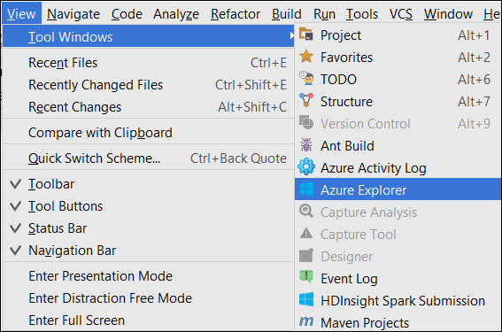
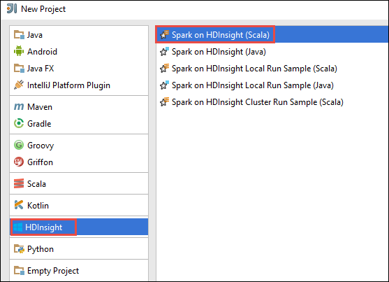
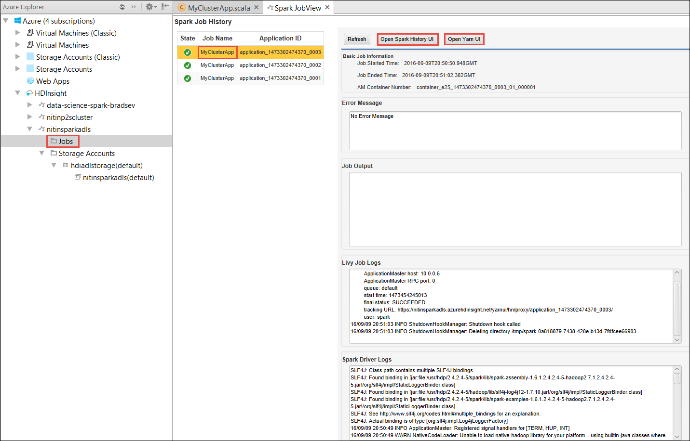
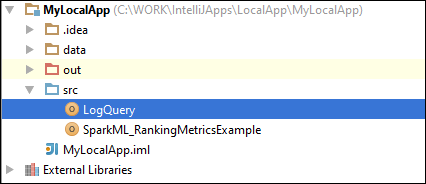
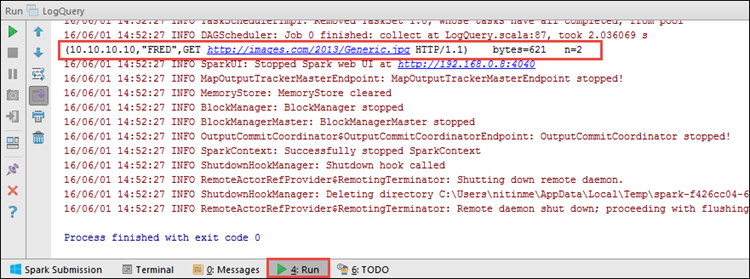

 <properties
    pageTitle="Criar aplicativos Spark Scala usando ferramentas de HDInsight no Kit de ferramentas do Azure para IntelliJ | Microsoft Azure"
    description="Aprenda a criar um aplicativo de Spark seja executado em clusters de HDInsight Spark autônomo."
    services="hdinsight"
    documentationCenter=""
    authors="nitinme"
    manager="jhubbard"
    editor="cgronlun"
    tags="azure-portal"/>

<tags
    ms.service="hdinsight"
    ms.workload="big-data"
    ms.tgt_pltfrm="na"
    ms.devlang="na"
    ms.topic="article"
    ms.date="09/09/2016"
    ms.author="nitinme"/>

# Use as ferramentas de HDInsight do Kit de ferramentas do Azure para IntelliJ para criar Spark aplicativos para cluster HDInsight Spark Linux

Este artigo fornece orientações passo a passo sobre como desenvolver aplicativos Spark escritos em Scala e enviá-lo para um HDInsight Spark cluster usando ferramentas de HDInsight no Kit de ferramentas do Azure para IntelliJ.  Você pode usar as ferramentas de algumas maneiras diferentes:

* Para desenvolver e enviar um aplicativo Scala Spark em um cluster de HDInsight Spark
* Acessar os recursos de cluster do Azure HDInsight Spark
* Para desenvolver e executar um aplicativo de Scala Spark localmente

Você também pode seguir um vídeo [aqui](https://mix.office.com/watch/1nqkqjt5xonza) para iniciá-lo.

>[AZURE.IMPORTANT] Esta ferramenta pode ser usada para criar e enviar aplicativos apenas para um cluster de HDInsight Spark no Linux.

##Pré-requisitos

* Uma assinatura do Azure. Consulte [avaliação gratuita do Azure obter](https://azure.microsoft.com/documentation/videos/get-azure-free-trial-for-testing-hadoop-in-hdinsight/).

* Um cluster de Apache Spark no HDInsight Linux. Para obter instruções, consulte [criar Apache Spark clusters no Azure HDInsight](hdinsight-apache-spark-jupyter-spark-sql.md).

* Kit de desenvolvimento Java Oracle. Você pode instalá-lo [aqui](http://www.oracle.com/technetwork/java/javase/downloads/jdk8-downloads-2133151.html).

* IntelliJ IDEIA. Este artigo usa versão 15.0.1. Você pode instalá-lo [aqui](https://www.jetbrains.com/idea/download/).

## Instalar ferramentas de HDInsight no Azure Kit de ferramentas para IntelliJ

Ferramentas de HDInsight para IntelliJ está disponível como parte do Kit de ferramentas do Azure para IntelliJ. Para obter instruções sobre como instalar o Kit de ferramentas do Azure, consulte [instalar o Kit de ferramentas do Azure para IntelliJ](../azure-toolkit-for-intellij-installation.md).

## Faça logon em sua assinatura do Azure

1. Iniciar o IDE IntelliJ e abra o Explorador do Azure. No menu **Exibir** no IDE, clique em **Ferramenta Windows** e clique em **Azure Explorer**.

    

2. O nó do **Azure** no **Azure Explorer**de atalho e, em seguida, clique em **Gerenciar assinaturas**.

3. Na caixa de diálogo **Gerenciar assinaturas** , clique em **entrar** e insira suas credenciais do Azure.

    

4. Depois que você estiver conectado, a caixa de diálogo **Gerenciar inscrições** lista todas as assinaturas Azure associadas com as credenciais. Clique em **Fechar** na caixa de diálogo.

5. Na guia do **Azure Explorer** , expanda **HDInsight** para ver os clusters HDInsight Spark em sua assinatura.

    

6. Você pode expandir ainda mais um nó de nome de cluster para ver os recursos (por exemplo, contas de armazenamento) associados ao cluster.

    

## Executar um aplicativo Spark Scala em um cluster de HDInsight Spark

1. Inicie a IDEIA IntelliJ e crie um novo projeto. Na caixa de diálogo Novo projeto, verifique as seguintes opções e clique em **Avançar**.

    

    * No painel esquerdo, selecione **HDInsight**.
    * No painel direito, selecione **Spark em HDInsight (Scala)**.
    * Clique em **Avançar**.

2. Na próxima janela, forneça os detalhes do projeto.

    * Forneça um nome de projeto e o local do projeto.
    * Para o **SDK do projeto**, certificar-se de que você forneça uma versão de Java maior que 7.
    * Para **Scala SDK**, clique em **criar**, clique em **Download**e, em seguida, selecione a versão do Scala usar. **Certificar-se de que você não use versão 2.11.x**. Este exemplo utiliza a versão **2.10.6**.

        

    * Para **Spark SDK**, baixar e usar o SDK do [aqui](http://go.microsoft.com/fwlink/?LinkID=723585&clcid=0x409). Você também pode ignorar isso e use o [Repositório Maven Spark](http://mvnrepository.com/search?q=spark) , no entanto, verifique se você tem o repositório maven direita instalado para desenvolver aplicativos Spark. (Por exemplo, você precisa verificar se que você tem a parte Spark Streaming instalada se você estiver usando Spark Streaming; Também, verifique se que você estiver utilizando o repositório marcado como Scala 2.10 - não use o repositório marcado como Scala 2.11.)

        

    * Clique em **Concluir**.

3. O projeto Spark criará automaticamente um artefato para você. Para ver o artefato, siga estas etapas.

    1. No menu **arquivo** , clique em **Estrutura de projeto**.
    2. Na caixa de diálogo **Estrutura de projeto** , clique em **artefatos** para ver o artefato padrão que é criado.

        

    Você também pode criar seu próprios artefato bly clicar na **+** ícone, realçado na imagem acima.

4. Na caixa de diálogo **Estrutura de projeto** , clique em **projeto**. Se o **SDK do projeto** é definido como 1,8, verifique se o **nível de idioma do projeto** é definido como **7 - losangos, etc do BRAÇO, vários variável,**.

    

5. Adicione seu código de origem do aplicativo.

    1. Do **Explorador de projeto**, **src**de atalho, aponte para **novo**e, em seguida, clique em **classe Scala**.

        

    2. Na caixa de diálogo **Criar nova classe Scala** , forneça um nome, **tipo** selecionar **objeto**e clique em **Okey**.

        

    3. No arquivo **MyClusterApp.scala** , cole o código a seguir. Este código lê os dados a partir do HVAC.csv (disponível em todos os clusters HDInsight Spark), recupera as linhas que possuem apenas um dígito na coluna sétima de CSV e grava a saída **/HVACOut** sob o contêiner de armazenamento padrão para o cluster.

            import org.apache.spark.SparkConf
            import org.apache.spark.SparkContext

            object MyClusterApp{
              def main (arg: Array[String]): Unit = {
                val conf = new SparkConf().setAppName("MyClusterApp")
                val sc = new SparkContext(conf)

                val rdd = sc.textFile("wasbs:///HdiSamples/HdiSamples/SensorSampleData/hvac/HVAC.csv")

                //find the rows which have only one digit in the 7th column in the CSV
                val rdd1 =  rdd.filter(s => s.split(",")(6).length() == 1)

                rdd1.saveAsTextFile("wasbs:///HVACOut")
              }

            }

5. Execute o aplicativo em um cluster de HDInsight Spark.

    1. Do **Explorador de projeto**, clique com botão direito no nome do projeto e selecione **Enviar Spark aplicativo ao HDInsight**.

        

    2. Você será solicitado a inserir suas credenciais de assinatura Azure. Na caixa de diálogo **Spark envio** , forneça os valores a seguir.

        * Para **clusters Spark (somente Linux)**, selecione o cluster de HDInsight Spark no qual você deseja executar o aplicativo.

        * Você precisa selecionar um artefato no projeto IntelliJ, ou selecione uma do disco rígido.

        * Em relação a caixa de texto **nome da classe principal** , clique nas reticências ( ), selecione a classe principal no seu código de fonte do aplicativo e clique em **Okey**.

            

        * Porque o código do aplicativo neste exemplo não precisam quaisquer argumentos de linha de comando ou referência JARs ou arquivos, você poderá deixar outras caixas de texto vazia.

        * Depois de fornecer todas as entradas, a caixa de diálogo deve semelhante ao seguinte:

            

        * Clique em **Enviar**.

    3. Na guia de **Envio Spark** na parte inferior da janela deve iniciar exibindo o andamento. Você também pode interromper o aplicativo clicando no botão vermelho na janela "Spark envio".

        

    Na próxima seção, você aprende a acessar o trabalho usando as ferramentas de HDInsight do Kit de ferramentas do Azure para IntelliJ de saída.

## Acessar e gerenciar clusters de HDInsight Spark usando as ferramentas de HDInsight do Kit de ferramentas do Azure para IntelliJ

Você pode executar uma variedade de operações usando as ferramentas de HDInsight que fazem parte do Kit de ferramentas do Azure para IntelliJ.

### Acessar a exibição de trabalho diretamente das ferramentas do HDInsight

1. Do **Azure Explorer**, expanda **HDInsight**, expanda o nome do cluster Spark e, em seguida, clique em **trabalhos**.

2. No painel direito, na guia **Modo de exibição de trabalho Spark** exibe todos os aplicativos que foram executados no cluster. Clique no nome do aplicativo para o qual você deseja ver mais detalhes.

    

3. As caixas para a **Mensagem de erro**, **Saída de trabalho**, **Livy Logs de trabalho**e **Os Logs do Driver Spark** são preenchidas com base no aplicativo que você seleciona.

4. Você também pode abrir a **Interface de usuário do Spark histórico** e a **Interface de usuário de fio COLORIDO** (no nível do aplicativo), clicando nos respectivos botões na parte superior da tela.

### Acessar o servidor de histórico Spark

1. Do **Azure Explorer**, expanda **HDInsight**, o nome do seu cluster de Spark de atalho e selecione **Abrir UI de histórico Spark**. Quando solicitado, digite as credenciais de administrador para o cluster. Você deve especificou esses ao provisionar o cluster.

2. No painel Spark histórico Server, você pode procurar o aplicativo que você acabou terminado executando usando o nome do aplicativo. No código acima, você definir o nome do aplicativo usando `val conf = new SparkConf().setAppName("MyClusterApp")`. Portanto, o nome do seu aplicativo de Spark foi **MyClusterApp**.

### Iniciar o portal de Ambari

Do **Azure Explorer**, expanda **HDInsight**, o nome do seu cluster de Spark de atalho e selecione **Abrir Portal de gerenciamento de Cluster (Ambari)**. Quando solicitado, digite as credenciais de administrador para o cluster. Você deve especificou esses ao provisionar o cluster.

### Gerenciar assinaturas do Azure

Por padrão, as ferramentas de HDInsight lista os clusters Spark de todas as suas assinaturas Azure. Se necessário, você pode especificar as assinaturas para a qual você deseja acessar o cluster. Do **Azure Explorer**, clique com botão direito no nó de raiz do **Azure** e clique em **Gerenciar assinaturas**. Na caixa de diálogo, desmarque as caixas de seleção contra a assinatura que você não deseja acessar e clique em **Fechar**. Você também pode clicar em **Sair** se você quiser fazer logoff sua assinatura do Azure.

## Executar um aplicativo de Spark Scala localmente

Você pode usar as ferramentas de HDInsight do Kit de ferramentas do Azure para IntelliJ ao executar aplicativos de Spark Scala localmente na estação de trabalho. Normalmente, esses aplicativos não precisa de acesso aos recursos de cluster como o contêiner de armazenamento e podem ser executados e testados localmente.

### Pré-requisito

Enquanto estiver executando o aplicativo Spark Scala local em um computador Windows, você pode receber uma exceção, como explicado em [SPARK 2356](https://issues.apache.org/jira/browse/SPARK-2356) que ocorre devido a um WinUtils.exe ausente no Windows. Para contornar esse erro, você deve [baixar o arquivo executável a partir daqui](http://public-repo-1.hortonworks.com/hdp-win-alpha/winutils.exe) para um local como **C:\WinUtils\bin**. Em seguida, adicione uma variável de ambiente **HADOOP_HOME** e defina o valor da variável como **C\WinUtils**.

### Executar um aplicativo Spark Scala local  

1. Inicie a IDEIA IntelliJ e crie um novo projeto. Na caixa de diálogo Novo projeto, verifique as seguintes opções e clique em **Avançar**.

    

    * No painel esquerdo, selecione **HDInsight**.
    * No painel direito, selecione **Spark em amostra de execução de HDInsight Local (Scala)**.
    * Clique em **Avançar**.

2. Na próxima janela, forneça os detalhes do projeto.

    * Forneça um nome de projeto e o local do projeto.
    * Para o **SDK do projeto**, certificar-se de que você forneça uma versão de Java maior que 7.
    * Para **Scala SDK**, clique em **criar**, clique em **Download**e, em seguida, selecione a versão do Scala usar. **Certificar-se de que você não use versão 2.11.x**. Este exemplo utiliza a versão **2.10.6**.

        

    * Para **Spark SDK**, baixar e usar o SDK do [aqui](http://go.microsoft.com/fwlink/?LinkID=723585&clcid=0x409). Você também pode ignorar isso e use o [Repositório Maven Spark](http://mvnrepository.com/search?q=spark) , no entanto, verifique se você tem o repositório maven direita instalado para desenvolver aplicativos Spark. (Por exemplo, você precisa verificar se que você tem a parte Spark Streaming instalada se você estiver usando Spark Streaming; Também, verifique se que você estiver utilizando o repositório marcado como Scala 2.10 - não use o repositório marcado como Scala 2.11.)

        

    * Clique em **Concluir**.

3. O modelo adiciona um código de amostra (**LogQuery**) na pasta **src** que você pode executar localmente em seu computador.

    

4.  Clique com o botão direito no aplicativo **LogQuery** e clique em **"Executar 'LogQuery'"**. Você verá uma saída assim na guia **Executar** na parte inferior.

    

## Converter aplicativos de IDEIA IntelliJ existente para usar as ferramentas de HDInsight do Kit de ferramentas do Azure para IntelliJ

Você também pode converter seus aplicativos Spark Scala existentes criados no IntelliJ IDEIA ser compatível com as ferramentas de HDInsight do Kit de ferramentas do Azure para IntelliJ. Isso permitirá que você usar a ferramenta para submeter os aplicativos para um cluster de HDInsight Spark. Você pode fazer isso realizando as seguintes etapas:

1. Para uma aplicação de Spark Scala existente criada usando IntelliJ IDEIA, abra o arquivo .iml associado.
2. No nível raiz, você verá um elemento de **módulo** assim:

        <module org.jetbrains.idea.maven.project.MavenProjectsManager.isMavenModule="true" type="JAVA_MODULE" version="4">

3. Edite o elemento adicionar `UniqueKey="HDInsightTool"` para que o elemento de **módulo** se parece com o seguinte:

        <module org.jetbrains.idea.maven.project.MavenProjectsManager.isMavenModule="true" type="JAVA_MODULE" version="4" UniqueKey="HDInsightTool">

4. Salve as alterações. Seu aplicativo agora deve ser compatível com as ferramentas de HDInsight do Kit de ferramentas do Azure para IntelliJ. Você pode testar isso clicando no nome do projeto no Explorador de projeto. No menu pop-up agora deve ter a opção para **Enviar a solicitação de Spark ao HDInsight**.

## Solução de problemas

### "Use um tamanho maior de pilha" Erro no local executar

Em Spark 1,6, se você estiver usando um SDK Java de 32 bits durante a execução local, você poderá encontrar os seguintes erros:

    Exception in thread "main" java.lang.IllegalArgumentException: System memory 259522560 must be at least 4.718592E8. Please use a larger heap size.
        at org.apache.spark.memory.UnifiedMemoryManager$.getMaxMemory(UnifiedMemoryManager.scala:193)
        at org.apache.spark.memory.UnifiedMemoryManager$.apply(UnifiedMemoryManager.scala:175)
        at org.apache.spark.SparkEnv$.create(SparkEnv.scala:354)
        at org.apache.spark.SparkEnv$.createDriverEnv(SparkEnv.scala:193)
        at org.apache.spark.SparkContext.createSparkEnv(SparkContext.scala:288)
        at org.apache.spark.SparkContext.<init>(SparkContext.scala:457)
        at LogQuery$.main(LogQuery.scala:53)
        at LogQuery.main(LogQuery.scala)
        at sun.reflect.NativeMethodAccessorImpl.invoke0(Native Method)
        at sun.reflect.NativeMethodAccessorImpl.invoke(NativeMethodAccessorImpl.java:57)
        at sun.reflect.DelegatingMethodAccessorImpl.invoke(DelegatingMethodAccessorImpl.java:43)
        at java.lang.reflect.Method.invoke(Method.java:606)
        at com.intellij.rt.execution.application.AppMain.main(AppMain.java:144)

Isso ocorre porque o tamanho da pilha não é grande o suficiente para Spark executar, pois Spark requer pelo menos 471MB (você pode obter mais detalhes de [SPARK 12081](https://issues.apache.org/jira/browse/SPARK-12081) se desejar). Uma solução simples é usar um SDK Java de 64 bits. Você também pode alterar as configurações de JVM no IntelliJ, adicionando as seguintes opções:

    -Xms128m -Xmx512m -XX:MaxPermSize=300m -ea

## Problemas conhecidos e de comentários

Exibindo atualmente Spark saídas diretamente não é suportado e estamos trabalhando nisso.

Se você tiver sugestões ou comentários ou se você encontrar problemas ao usar esta ferramenta, fique à vontade para Solte-em um email no hdivstool em microsoft ponto com.

## Consulte também

* [Visão geral: Apache Spark no Azure HDInsight](hdinsight-apache-spark-overview.md)

### Cenários

* [Spark com BI: executar análise de dados interativos usando Spark em HDInsight com ferramentas de BI](hdinsight-apache-spark-use-bi-tools.md)

* [Spark com aprendizado de máquina: Spark de uso em HDInsight para analisar a temperatura de construção usando dados HVAC](hdinsight-apache-spark-ipython-notebook-machine-learning.md)

* [Spark com aprendizado de máquina: Spark de uso em HDInsight prever resultados da inspeção de alimentos](hdinsight-apache-spark-machine-learning-mllib-ipython.md)

* [Streaming Spark: Uso Spark no HDInsight para criar aplicativos de streaming em tempo real](hdinsight-apache-spark-eventhub-streaming.md)

* [Análise de log de site usando Spark no HDInsight](hdinsight-apache-spark-custom-library-website-log-analysis.md)

### Criar e executar aplicativos

* [Criar um aplicativo autônomo usando Scala](hdinsight-apache-spark-create-standalone-application.md)

* [Executar trabalhos remotamente em um cluster de Spark usando Livy](hdinsight-apache-spark-livy-rest-interface.md)

### Ferramentas e extensões

* [Ferramentas de HDInsight de uso do Kit de ferramentas do Azure para IntelliJ depurar gerar aplicativos remotamente](hdinsight-apache-spark-intellij-tool-plugin-debug-jobs-remotely.md)

* [Use as ferramentas de HDInsight do Kit de ferramentas do Azure para Eclipse para criar Spark aplicativos](hdinsight-apache-spark-eclipse-tool-plugin.md)

* [Usar blocos de anotações de Zeppelin com um cluster Spark em HDInsight](hdinsight-apache-spark-use-zeppelin-notebook.md)

* [Kernels disponíveis para o bloco de anotações de Jupyter em cluster Spark para HDInsight](hdinsight-apache-spark-jupyter-notebook-kernels.md)

* [Usar os pacotes externos com blocos de anotações de Jupyter](hdinsight-apache-spark-jupyter-notebook-use-external-packages.md)

* [Instalar Jupyter no seu computador e se conectar a um cluster de HDInsight Spark](hdinsight-apache-spark-jupyter-notebook-install-locally.md)

### Gerenciar recursos

* [Gerenciar recursos para cluster Spark Apache no Azure HDInsight](hdinsight-apache-spark-resource-manager.md)

* [Rastrear e depurar trabalhos em execução em um cluster de Apache Spark em HDInsight](hdinsight-apache-spark-job-debugging.md)
