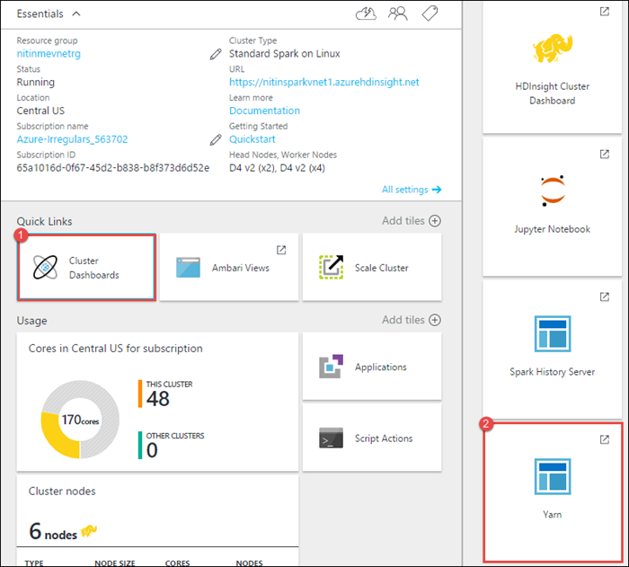
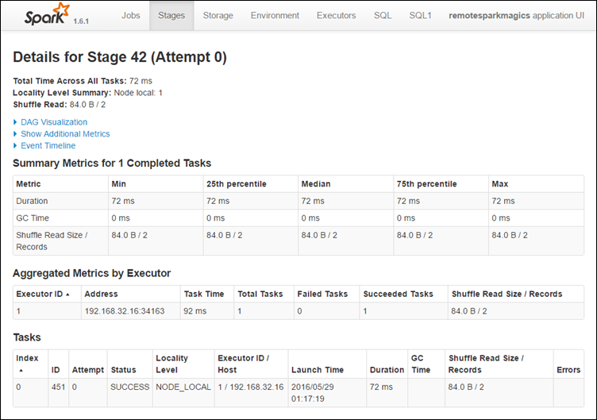
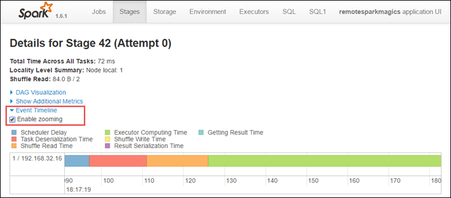

<properties 
    pageTitle="Rastrear e depurar trabalhos em execução no Apache Spark cluster no HDInsight | Microsoft Azure" 
    description="Usar fio COLORIDO UI, Spark UI e histórico de Spark server para controlar e depurar trabalhos em execução em um cluster de Spark no Azure HDInsight" 
    services="hdinsight" 
    documentationCenter="" 
    authors="nitinme" 
    manager="jhubbard" 
    editor="cgronlun"
    tags="azure-portal"/>

<tags 
    ms.service="hdinsight" 
    ms.workload="big-data" 
    ms.tgt_pltfrm="na" 
    ms.devlang="na" 
    ms.topic="article" 
    ms.date="08/25/2016" 
    ms.author="nitinme"/>

# Rastrear e depurar trabalhos em execução no cluster Spark Apache no HDInsight Linux

Neste artigo, você aprenderá como controlar e depurar trabalhos Spark usando a interface do usuário fio COLORIDO, Spark interface do usuário e o servidor de histórico Spark. Neste artigo, vamos começar um trabalho Spark usando um bloco de anotações disponível com o cluster Spark, **aprendizado de máquina: análise de previsão nos dados de inspeção de alimentação usando MLLib**. Você pode usar as etapas abaixo para acompanhar um aplicativo que você enviou usando qualquer outra abordagem também, por exemplo, **Enviar spark**.

##Pré-requisitos

Você deve ter o seguinte:

- Uma assinatura do Azure. Consulte [avaliação gratuita do Azure obter](https://azure.microsoft.com/documentation/videos/get-azure-free-trial-for-testing-hadoop-in-hdinsight/).
- Um cluster de Apache Spark no HDInsight Linux. Para obter instruções, consulte [criar Apache Spark clusters no Azure HDInsight](hdinsight-apache-spark-jupyter-spark-sql.md).
- Você deve ter iniciado executando o bloco de anotações, **[aprendizado de máquina: análise de previsão nos dados de inspeção de alimentação usando MLLib](hdinsight-apache-spark-machine-learning-mllib-ipython.md)**. Para obter instruções sobre como executar este bloco de anotações, siga o link.  

## Acompanhar um aplicativo na interface de usuário fio COLORIDO

1. Inicie a interface do usuário fio COLORIDO. Da lâmina cluster, clique em **Painel de Cluster**e clique em **fio COLORIDO**.

    

    >[AZURE.TIP] Como alternativa, você também pode iniciar o UI fio COLORIDO da Ambari UI. Para iniciar a Ambari UI, da lâmina cluster, clique em **Painel de Cluster**e, em seguida, clique em **Painel de Cluster HDInsight**. Partir da Ambari UI, clique **fio COLORIDO**, clique em **Links rápidos**, clique em Gerenciador de recursos ativo e clique em **ResourceManager UI**.  

3. Porque você iniciou o trabalho Spark usando blocos de anotações de Jupyter, o aplicativo tem o nome **remotesparkmagics** (Este é o nome para todos os aplicativos que são iniciados de blocos de anotações). Clique no ID de aplicativo com o nome do aplicativo para obter mais informações sobre o trabalho. Isso inicia o modo de exibição do aplicativo.

    

    Para tais aplicativos iniciados os blocos de anotações de Jupyter, o status é sempre **executando** até que você saia do bloco de anotações.

4. Do modo de exibição do aplicativo, você pode analisar mais para descobrir os contêineres associado com o aplicativo e os logs (stdout/stderr). Você também pode iniciar a interface do usuário Spark clicando na vinculação correspondente à **URL do controle**, conforme mostrado abaixo. 

    

## Acompanhar um aplicativo na interface de usuário Spark

A IU Spark, você pode fazer busca detalhada em trabalhos Spark que são gerados pelo aplicativo iniciada anteriormente.

1. Para iniciar a interface do usuário Spark, de modo de exibição do aplicativo, clique no link em relação a **URL de acompanhamento**, como mostra a captura de tela acima. Você pode ver todos os trabalhos de Spark que são iniciados pelo aplicativo executado no bloco de anotações Jupyter.

    

2. Clique na guia **executores** para ver informações de processamento e armazenamento de cada executor. Você também pode recuperar a pilha de chamadas, clicando no link **Thread despejar** .

    
 
3. Clique na guia de **estágios** para ver os estágios associados com o aplicativo.

    

    Cada estágio pode ter várias tarefas para o qual você pode exibir estatísticas de execução, como mostrado abaixo.

     

4. Na página de detalhes do estágio, você pode iniciar Dag mão visualização. Expanda o link de **Visualização de Dag mão** na parte superior da página, conforme mostrado abaixo.

    

    Dag mão ou direto Aclyic gráfico representa os diferentes estágios no aplicativo. Cada caixa azul no gráfico representa uma operação de Spark invocada do aplicativo.

5. Na página de detalhes do estágio, você também pode iniciar o modo de exibição de linha do tempo do aplicativo. Expanda o link de **Cronograma de evento** na parte superior da página, conforme mostrado abaixo.

    

    Isso exibe os eventos Spark na forma de uma linha do tempo. O modo de exibição de linha do tempo está disponível em três níveis, entre trabalhos, dentro de um trabalho e em um estágio. A imagem acima captura o modo de exibição de linha do tempo para um determinado estágio.

    >[AZURE.TIP] Se você selecionar a caixa de seleção **Habilitar o zoom** , você pode rolar esquerda e direita entre o modo de exibição de linha do tempo.

6. Outras guias na interface de usuário Spark fornecem informações úteis sobre a instância de Spark também.

    * Guia de armazenamento - se seu aplicativo cria um RDDs, você pode encontrar informações sobre aqueles na guia armazenamento.
    * Guia de ambiente - esta guia fornece muitas informações úteis sobre sua instância Spark como o 
        * Versão scala
        * Diretório de log de eventos associado ao cluster
        * Número de cores de executor para o aplicativo
        * Etc.

## Encontre informações sobre trabalhos concluídos usando o servidor de histórico Spark

Depois que uma tarefa é concluída, as informações sobre o trabalho são mantidas no servidor Spark histórico.

1. Para iniciar o servidor de histórico Spark, da lâmina cluster, clique em **Painel de Cluster**e, em seguida, clique em **Servidor de histórico Spark**.

    

    >[AZURE.TIP] Como alternativa, você também pode iniciar a interface de usuário do servidor de histórico Spark da Ambari UI. Para iniciar a Ambari UI, da lâmina cluster, clique em **Painel de Cluster**e, em seguida, clique em **Painel de Cluster HDInsight**. Partir da Ambari UI, clique **Spark**, clique em **Links rápidos**e clique em **Spark histórico de servidor de interface do usuário**.

2. Você verá todos os aplicativos concluídos listados. Clique em uma ID de aplicativo para fazer busca detalhada em um aplicativo para obter mais informações.

    
    

## Consulte também

* [Visão geral: Apache Spark no Azure HDInsight](hdinsight-apache-spark-overview.md)

### Cenários

* [Spark com BI: executar análise de dados interativos usando Spark em HDInsight com ferramentas de BI](hdinsight-apache-spark-use-bi-tools.md)

* [Spark com aprendizado de máquina: Spark de uso em HDInsight para analisar a temperatura de construção usando dados HVAC](hdinsight-apache-spark-ipython-notebook-machine-learning.md)

* [Spark com aprendizado de máquina: Spark de uso em HDInsight prever resultados da inspeção de alimentos](hdinsight-apache-spark-machine-learning-mllib-ipython.md)

* [Streaming Spark: Uso Spark no HDInsight para criar aplicativos de streaming em tempo real](hdinsight-apache-spark-eventhub-streaming.md)

* [Análise de log de site usando Spark no HDInsight](hdinsight-apache-spark-custom-library-website-log-analysis.md)

### Criar e executar aplicativos

* [Criar um aplicativo autônomo usando Scala](hdinsight-apache-spark-create-standalone-application.md)

* [Executar trabalhos remotamente em um cluster de Spark usando Livy](hdinsight-apache-spark-livy-rest-interface.md)

### Ferramentas e extensões

* [Usar o plug-in de ferramentas de HDInsight para IntelliJ IDEIA para criar e enviar Spark Scala aplicativos](hdinsight-apache-spark-intellij-tool-plugin.md)

* [Usar o plug-in de ferramentas de HDInsight para IntelliJ IDEIA para depurar aplicativos de Spark remotamente](hdinsight-apache-spark-intellij-tool-plugin-debug-jobs-remotely.md)

* [Usar blocos de anotações de Zeppelin com um cluster Spark em HDInsight](hdinsight-apache-spark-use-zeppelin-notebook.md)

* [Kernels disponíveis para o bloco de anotações de Jupyter em cluster Spark para HDInsight](hdinsight-apache-spark-jupyter-notebook-kernels.md)

* [Usar os pacotes externos com blocos de anotações de Jupyter](hdinsight-apache-spark-jupyter-notebook-use-external-packages.md)

* [Instalar Jupyter no seu computador e se conectar a um cluster de HDInsight Spark](hdinsight-apache-spark-jupyter-notebook-install-locally.md)

### Gerenciar recursos

* [Gerenciar recursos para cluster Spark Apache no Azure HDInsight](hdinsight-apache-spark-resource-manager.md)
